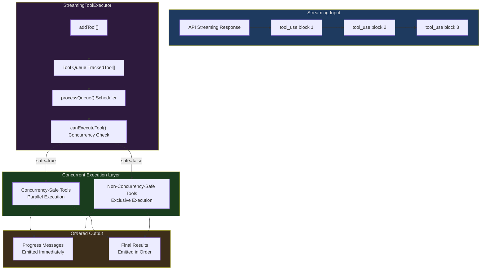
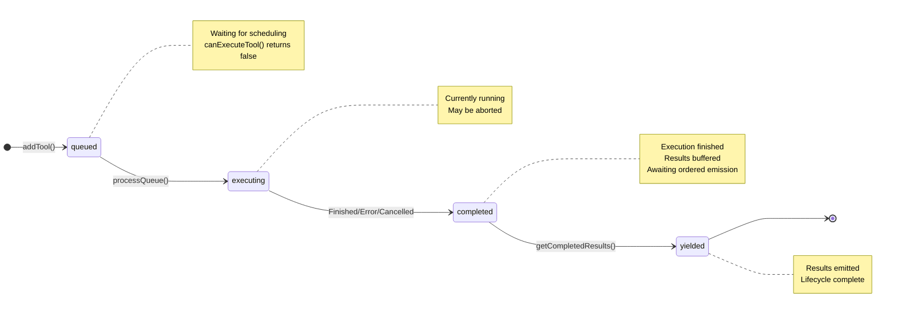
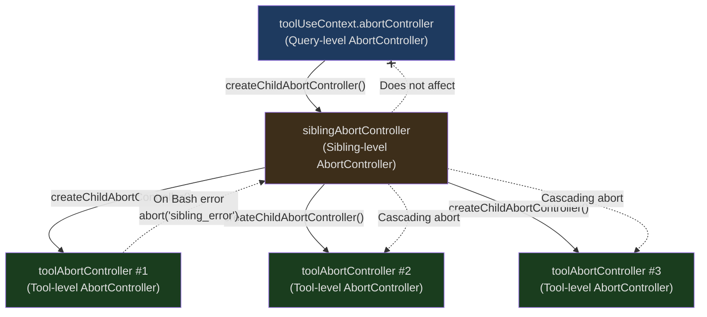

## The Problem

Imagine this scenario: you ask Claude Code to refactor a module. The model returns 5 `tool_use` calls in a single response — 3 file reads, 1 Bash command execution, and 1 file write. Now the questions arise:

1. Should these 5 tools run serially or in parallel?
2. If the Bash command fails, should the file reads running in parallel be cancelled?
3. The file write depends on the Bash result — should it wait for Bash to complete before executing?
4. The user presses ESC during tool execution — which tools should stop, and which should continue?
5. Multiple tools produce progress messages simultaneously — how should the UI display them in order?

These questions seem simple, but each one involves core challenges of concurrency control. Serial execution is too slow — users don't want to wait for 3 independent file reads to complete one after another. Full parallelism is too dangerous — a write operation and a read operation accessing the same file simultaneously could cause a data race.

Claude Code's solution is `StreamingToolExecutor` — a carefully designed concurrency orchestrator that lets each tool declare whether it can run in parallel, then dynamically schedules execution based on those declarations. This article will dissect every design decision in detail.

---

## Why a Streaming Tool Executor?

In the previous article, we covered the overall architecture of the tool system. But one key question was intentionally deferred to this article: when the model returns multiple tool calls in a single streaming response, how does the executor manage their lifecycles?

Traditional approaches fall into two extremes:

**Approach A: Fully Serial**

```mermaid
gantt
    title Fully Serial Execution (Total time: 4T)
    dateFormat X
    axisFormat %s
    section Execution
        Tool 1 :a, 0, 1
        Tool 2 :b, after a, 1
        Tool 3 :c, after b, 1
        Tool 4 :d, after c, 1
```



Safe but extremely slow. Each tool waits for the previous one to finish before starting. For 3 independent file reads, this means 3x the wait time.

**Approach B: Fully Parallel**

```mermaid
gantt
    title Fully Parallel Execution (Total time: T)
    dateFormat X
    axisFormat %s
    section Execution
        Tool 1 :a, 0, 1
        Tool 2 :b, 0, 1
        Tool 3 :c, 0, 1
        Tool 4 :d, 0, 1
```



Fast but dangerous. If Tool 1 is `rm -rf build/` and Tool 2 is `cat build/output.js`, the result of parallel execution is unpredictable.

**Approach C: Claude Code's Hybrid Scheduling**

```mermaid
gantt
    title Hybrid Scheduling (Total time: 2T)
    dateFormat X
    axisFormat %s
    section Parallel Reads
        Tool 1 (Read)  :a, 0, 1
        Tool 2 (Read)  :b, 0, 1
        Tool 3 (Read)  :c, 0, 1
    section Exclusive Write
        Tool 4 (Bash)  :d, 1, 2
```



Reads run in parallel, writes get exclusive access. Safe and efficient.

This is the core problem `StreamingToolExecutor` solves.

---

## Architecture Overview

`StreamingToolExecutor` lives in `src/services/tools/StreamingToolExecutor.ts` and is a class of roughly 530 lines. Its responsibilities are:

1. **Receive tool calls** — accept `tool_use` blocks one by one as the streaming response arrives
2. **Determine scheduling strategy** — based on each tool's concurrency safety declaration, decide whether to execute immediately or queue
3. **Manage lifecycles** — track each tool from queuing to completion
4. **Handle error cascading** — one tool's failure may require cancelling its sibling tools
5. **Emit results in order** — progress messages are sent immediately, final results are emitted in sequence

Here is the overall architecture diagram:



---

## TrackedTool: The Complete Lifecycle of a Tool

Every tool call that enters the executor is wrapped in a `TrackedTool` object. This structure is defined at lines 21-32 of `StreamingToolExecutor.ts`:

```typescript
// src/services/tools/StreamingToolExecutor.ts:19-32
type ToolStatus = 'queued' | 'executing' | 'completed' | 'yielded'

type TrackedTool = {
  id: string
  block: ToolUseBlock
  assistantMessage: AssistantMessage
  status: ToolStatus
  isConcurrencySafe: boolean
  promise?: Promise<void>
  results?: Message[]
  // Progress messages are stored separately and yielded immediately
  pendingProgress: Message[]
  contextModifiers?: Array<(context: ToolUseContext) => ToolUseContext>
}
```

### Four Lifecycle States

`ToolStatus` is a four-value enum, and each tool flows strictly through `queued -> executing -> completed -> yielded`:



**queued (waiting)**: The tool was just added by `addTool()` and hasn't started executing yet. There may be other non-concurrency-safe tools currently running exclusively, so it must wait.

**executing (running)**: The tool has started execution. Its `promise` field holds the execution Promise, and progress messages are collected in real time via the `pendingProgress` array.

**completed (finished)**: Tool execution has ended (success, failure, or cancellation), and results are stored in the `results` field but haven't been emitted to the caller yet. This is the key to ordered emission — even if Tool 3 finishes first, it waits for Tool 1 and Tool 2's results to be emitted first.

**yielded (emitted)**: Results have been emitted to the caller via `getCompletedResults()`, and this tool's lifecycle is completely over.

### Key Field Analysis

`pendingProgress` is a field worth special attention. Progress messages (like real-time output from a Bash command) need to be shown to the user immediately and can't wait until the tool completes. So progress messages and final results are stored separately — progress messages can be emitted at any time, while final results must be emitted in order.

`contextModifiers` stores the tool's modifications to the execution context. For example, a tool might need to update file history state. But note an important restriction in the code (lines 391-395):

```typescript
// src/services/tools/StreamingToolExecutor.ts:389-395
// NOTE: we currently don't support context modifiers for concurrent
//       tools. None are actively being used, but if we want to use
//       them in concurrent tools, we need to support that here.
if (!tool.isConcurrencySafe && contextModifiers.length > 0) {
  for (const modifier of contextModifiers) {
    this.toolUseContext = modifier(this.toolUseContext)
  }
}
```

Only non-concurrency-safe tools can modify the context. This is a deliberate design constraint — concurrent tools modifying shared context would introduce race conditions, so it's simply prohibited.

---

## isConcurrencySafe: Tools Decide for Themselves Whether They Can Run in Parallel

The most fundamental design principle of `StreamingToolExecutor` is that **tools declare their own concurrency safety**. Not guessed by the scheduler, not defined in a global configuration table, but implemented by each tool in its `isConcurrencySafe()` method.

This method is defined at line 402 of `src/Tool.ts`:

```typescript
// src/Tool.ts:402
isConcurrencySafe(input: z.infer<Input>): boolean
```

Note that it accepts an `input` parameter — this means the same tool may have different concurrency safety depending on the input.

### Concurrency Safety Declarations Across Tools

Let's look at how various tools actually declare themselves in the code:

**FileReadTool (file reading) — always concurrency-safe:**

```typescript
// src/tools/FileReadTool/FileReadTool.ts:373-375
isConcurrencySafe() {
  return true
},
```

File reading is a purely read-only operation; multiple reads running simultaneously produce no side effects.

**GrepTool (search) — always concurrency-safe:**

```typescript
// src/tools/GrepTool/GrepTool.ts:183-185
isConcurrencySafe() {
  return true
},
```

Search operations are likewise read-only, naturally supporting parallelism.

**AgentTool (sub-agent) — always concurrency-safe:**

```typescript
// src/tools/AgentTool/AgentTool.tsx:1273-1275
isConcurrencySafe() {
  return true;
},
```

The sub-agent tool declares itself as concurrency-safe because each sub-agent runs in its own isolated context.

**BashTool (command execution) — depends on input:**

```typescript
// src/tools/BashTool/BashTool.tsx:434-436
isConcurrencySafe(input) {
  return this.isReadOnly?.(input) ?? false;
},
```

This is the most interesting case. The Bash tool's concurrency safety depends on whether the command itself is read-only. `ls`, `cat`, `grep` are read-only and can run in parallel; `rm`, `mv`, `git commit` have side effects and must run exclusively.

**Default behavior — assume unsafe (line 759):**

```typescript
// src/Tool.ts:757-759
const TOOL_DEFAULTS = {
  // ...
  isConcurrencySafe: (_input?: unknown) => false,
  // ...
}
```

Tools built through `buildTool()` that don't explicitly declare `isConcurrencySafe` default to returning `false`. This is a **conservatively safe** design — better to sacrifice performance than risk concurrency issues.

### Safety Calculation in addTool

When a tool is added to the executor, the `isConcurrencySafe` calculation process is worth careful examination. See lines 104-121 of `StreamingToolExecutor.ts`:

```typescript
// src/services/tools/StreamingToolExecutor.ts:104-121
const parsedInput = toolDefinition.inputSchema.safeParse(block.input)
const isConcurrencySafe = parsedInput?.success
  ? (() => {
      try {
        return Boolean(toolDefinition.isConcurrencySafe(parsedInput.data))
      } catch {
        return false
      }
    })()
  : false
this.tools.push({
  id: block.id,
  block,
  assistantMessage,
  status: 'queued',
  isConcurrencySafe,
  pendingProgress: [],
})
```

There are three layers of defense here:

1. **Input validation**: First validate input using the Zod schema. If the input format is invalid, it's immediately marked as non-concurrency-safe.
2. **try-catch wrapper**: Even if the input is valid, `isConcurrencySafe()` itself might throw an exception (e.g., a bug in the tool definition). Any exception falls back to `false`.
3. **Boolean coercion**: The result is wrapped in `Boolean()` to prevent tools from accidentally returning truthy values (like non-empty strings).

This "defense in depth" pattern is ubiquitous in Claude Code — on code paths related to concurrency and safety, always assume the worst case.

---

## canExecuteTool: The Core Scheduling Decision

Given each tool's concurrency safety declaration, how does the scheduler decide whether a tool can execute immediately? The logic is remarkably concise, just 6 lines of code (lines 129-135):

```typescript
// src/services/tools/StreamingToolExecutor.ts:129-135
private canExecuteTool(isConcurrencySafe: boolean): boolean {
  const executingTools = this.tools.filter(t => t.status === 'executing')
  return (
    executingTools.length === 0 ||
    (isConcurrencySafe && executingTools.every(t => t.isConcurrencySafe))
  )
}
```

In plain language: **a tool can execute if and only if one of the following two conditions holds**:

1. No tools are currently executing (idle state, any tool can start)
2. The current tool is concurrency-safe, **and** all currently executing tools are also concurrency-safe

This logic implies an important corollary: **as long as any non-concurrency-safe tool is executing, all other tools must wait**. Non-concurrency-safe tools get exclusive access.

Let's visualize with a table:

| Currently Executing Tools | New Tool (safe) | New Tool (unsafe) |
|:---|:---:|:---:|
| None (idle) | Can execute | Can execute |
| All safe | Can execute | Wait |
| Includes unsafe | Wait | Wait |

This is a classic **read-write lock** pattern: concurrency-safe tools are like read locks (multiple can coexist), non-concurrency-safe tools are like write locks (must be exclusive).

---

## processQueue: The Subtleties of Queue Scheduling

The `processQueue()` method (lines 140-151) is responsible for traversing the queue and starting executable tools:

```typescript
// src/services/tools/StreamingToolExecutor.ts:140-151
private async processQueue(): Promise<void> {
  for (const tool of this.tools) {
    if (tool.status !== 'queued') continue

    if (this.canExecuteTool(tool.isConcurrencySafe)) {
      await this.executeTool(tool)
    } else {
      // Can't execute this tool yet, and since we need to maintain
      // order for non-concurrent tools, stop here
      if (!tool.isConcurrencySafe) break
    }
  }
}
```

This code has an easily overlooked but critically important detail — the `break` statement. When it encounters a **non-concurrency-safe** tool that can't execute, the scheduler stops traversal. Why?

Consider the following tool sequence:

```mermaid
gantt
    title Tool Sequence with Concurrency Safety
    dateFormat X
    axisFormat %s
    section safe
        Read A :a, 0, 1
        Read B :b, 0, 1
    section unsafe
        Bash "git add ." :c, 1, 2
    section safe
        Read C :d, 2, 3
    section unsafe
        Bash "git commit" :e, 3, 4
```



Without the `break`, the scheduler would skip `Bash "git add ."` when it can't execute and continue checking `Read C`. `Read C` is concurrency-safe and might be started. But this is problematic — `Read C` would execute **before** `git add .`, potentially reading file contents not yet staged.

The `break` ensures **ordering between non-concurrency-safe tools**. Once a queued non-concurrency-safe tool is encountered, no subsequent tools (safe or not) will be started.

Conversely: what if the tool that can't execute is a **concurrency-safe** one? It's simply skipped (`continue`) and doesn't prevent scheduling of subsequent tools. When would a concurrency-safe tool be unable to execute? When a non-concurrency-safe tool currently has exclusive access. Once the exclusive tool completes, all queued concurrency-safe tools can start together.

### When processQueue Is Triggered

`processQueue()` is called in two places:

1. **In addTool()** (line 123): every time a new tool is added, immediately try to schedule it.
2. **When executeTool() completes** (lines 402-404): after a tool finishes, trigger a new round of scheduling.

```typescript
// src/services/tools/StreamingToolExecutor.ts:398-404
const promise = collectResults()
tool.promise = promise

// Process more queue when done
void promise.finally(() => {
  void this.processQueue()
})
```

This creates a self-driving loop: tool completes -> try to schedule -> new tool starts -> new tool completes -> schedule again... until the queue is empty.

---

## Sibling AbortController: Cascading Cancellation of Errors

One of the trickiest problems with concurrent execution is error handling. When multiple tools are running in parallel, how should one tool's failure affect the others?

Claude Code's design is: **only Bash tool errors cascade-cancel sibling tools**. This design stems from a practical observation — Bash commands often have implicit dependency chains (`mkdir` fails, so the subsequent `cd` and `touch` are pointless), while Read, Grep, WebFetch and other tools are independent — one file read failure shouldn't affect another file's read.

### Three-Layer AbortController Architecture

Error cascading relies on a carefully designed three-layer `AbortController` architecture:



**Layer 1: Query-Level AbortController (`toolUseContext.abortController`)**

This is the lifecycle controller for the entire query turn. When the user presses ESC or submits a new message, this controller is aborted, causing the entire turn to end.

**Layer 2: Sibling-Level AbortController (`siblingAbortController`)**

This is created by `StreamingToolExecutor` during construction as a child controller of the query-level controller (lines 59-61):

```typescript
// src/services/tools/StreamingToolExecutor.ts:59-61
this.siblingAbortController = createChildAbortController(
  toolUseContext.abortController,
)
```

Key property: **aborting the sibling-level controller does not abort the parent controller**. This means a Bash error can cancel all sibling tools without terminating the entire query turn — the model will still receive the error information and continue reasoning.

**Layer 3: Tool-Level AbortController (`toolAbortController`)**

Each tool creates its own controller during execution as a child of the sibling-level controller (lines 301-302):

```typescript
// src/services/tools/StreamingToolExecutor.ts:301-302
const toolAbortController = createChildAbortController(
  this.siblingAbortController,
)
```

### Bash Error Cascade Path

When a Bash tool execution fails, the complete cascade path is as follows (lines 354-363):

```typescript
// src/services/tools/StreamingToolExecutor.ts:354-363
if (isErrorResult) {
  thisToolErrored = true
  // Only Bash errors cancel siblings. Bash commands often have implicit
  // dependency chains (e.g. mkdir fails -> subsequent commands pointless).
  // Read/WebFetch/etc are independent — one failure shouldn't nuke the rest.
  if (tool.block.name === BASH_TOOL_NAME) {
    this.hasErrored = true
    this.erroredToolDescription = this.getToolDescription(tool)
    this.siblingAbortController.abort('sibling_error')
  }
}
```

Execution flow:

1. The Bash tool's execution result contains a `tool_result` with `is_error: true`
2. The `hasErrored` flag is set to `true`
3. `erroredToolDescription` records the description of the errored tool (e.g., `Bash(mkdir /tmp/test...)`)
4. `siblingAbortController.abort('sibling_error')` is called
5. This abort signal propagates through `createChildAbortController`'s parent-child relationship to all other tools' `toolAbortController`
6. Executing tools that receive the abort signal generate synthetic error messages (lines 189-204)

### Tool-Level Abort Upward Propagation

The tool-level `AbortController` has a subtle event listener (lines 304-317) that handles a special case — when permission dialog denial occurs:

```typescript
// src/services/tools/StreamingToolExecutor.ts:304-317
toolAbortController.signal.addEventListener(
  'abort',
  () => {
    if (
      toolAbortController.signal.reason !== 'sibling_error' &&
      !this.toolUseContext.abortController.signal.aborted &&
      !this.discarded
    ) {
      this.toolUseContext.abortController.abort(
        toolAbortController.signal.reason,
      )
    }
  },
  { once: true },
)
```

This code means: if the tool is aborted for a reason **other than** a sibling error (such as permission denial), then this abort needs to **bubble up** to the query-level controller to terminate the entire turn. The code comments mention `#21056 regression` — this upward bubbling logic was added to fix a specific regression bug.

### Synthetic Error Messages

Cancelled tools aren't simply discarded — they receive a synthetic error message so the model knows these tools didn't execute successfully. The `createSyntheticErrorMessage` method (lines 153-205) generates different error messages based on the cancellation reason:

```typescript
// src/services/tools/StreamingToolExecutor.ts:153-205
private createSyntheticErrorMessage(
  toolUseId: string,
  reason: 'sibling_error' | 'user_interrupted' | 'streaming_fallback',
  assistantMessage: AssistantMessage,
): Message {
  if (reason === 'user_interrupted') {
    return createUserMessage({
      content: [{
        type: 'tool_result',
        content: withMemoryCorrectionHint(REJECT_MESSAGE),
        is_error: true,
        tool_use_id: toolUseId,
      }],
      toolUseResult: 'User rejected tool use',
      // ...
    })
  }
  if (reason === 'streaming_fallback') {
    return createUserMessage({
      content: [{
        type: 'tool_result',
        content: '<tool_use_error>Error: Streaming fallback - tool execution discarded</tool_use_error>',
        is_error: true,
        tool_use_id: toolUseId,
      }],
      // ...
    })
  }
  // sibling_error
  const desc = this.erroredToolDescription
  const msg = desc
    ? `Cancelled: parallel tool call ${desc} errored`
    : 'Cancelled: parallel tool call errored'
  return createUserMessage({
    content: [{
      type: 'tool_result',
      content: `<tool_use_error>${msg}</tool_use_error>`,
      is_error: true,
      tool_use_id: toolUseId,
    }],
    // ...
  })
}
```

Three cancellation reasons produce three different messages:

| Reason | Message Content | Purpose |
|:---|:---|:---|
| `sibling_error` | `Cancelled: parallel tool call Bash(mkdir...) errored` | Model knows which sibling tool failed |
| `user_interrupted` | `User rejected tool use` + memory correction hint | Model knows the user actively cancelled |
| `streaming_fallback` | `Streaming fallback - tool execution discarded` | Silent cancellation during streaming fallback |

### Preventing Duplicate Error Messages

There's an elegant deduplication logic in the code — the `thisToolErrored` flag (lines 330-345):

```typescript
// src/services/tools/StreamingToolExecutor.ts:328-345
// Track if this specific tool has produced an error result.
// This prevents the tool from receiving a duplicate "sibling error"
// message when it is the one that caused the error.
let thisToolErrored = false

for await (const update of generator) {
  const abortReason = this.getAbortReason(tool)
  if (abortReason && !thisToolErrored) {
    messages.push(
      this.createSyntheticErrorMessage(
        tool.id,
        abortReason,
        tool.assistantMessage,
      ),
    )
    break
  }
  // ...
  if (isErrorResult) {
    thisToolErrored = true
    // ...
  }
}
```

If Tool A is a Bash tool that errors, it triggers `siblingAbortController.abort()`. At this point, `getAbortReason()` would also return `sibling_error` for Tool A itself. But because `thisToolErrored` has already been set to `true`, Tool A won't receive an additional synthetic error message — it already has its own real error result.

---

## Progress Buffering and Ordered Emission

Concurrent execution introduces an output ordering problem. Suppose Tool 1 and Tool 2 are running in parallel, and Tool 2 finishes first — should its results be emitted before Tool 1's?

Claude Code's answer is to treat two types of output differently:

1. **Progress messages**: emitted immediately, no ordering required
2. **Final results**: must be emitted in tool addition order

### Immediate Emission of Progress Messages

In the execution loop of the `executeTool()` method (lines 366-374), progress messages are stored in the `pendingProgress` array:

```typescript
// src/services/tools/StreamingToolExecutor.ts:366-374
if (update.message) {
  // Progress messages go to pendingProgress for immediate yielding
  if (update.message.type === 'progress') {
    tool.pendingProgress.push(update.message)
    // Signal that progress is available
    if (this.progressAvailableResolve) {
      this.progressAvailableResolve()
      this.progressAvailableResolve = undefined
    }
  } else {
    messages.push(update.message)
  }
}
```

Note the `progressAvailableResolve` semaphore — when new progress messages arrive, it wakes up the waiting `getRemainingResults()`.

### Ordered Emission of Results

The `getCompletedResults()` method (lines 412-440) implements ordered emission logic:

```typescript
// src/services/tools/StreamingToolExecutor.ts:412-440
*getCompletedResults(): Generator<MessageUpdate, void> {
  if (this.discarded) {
    return
  }

  for (const tool of this.tools) {
    // Always yield pending progress messages immediately,
    // regardless of tool status
    while (tool.pendingProgress.length > 0) {
      const progressMessage = tool.pendingProgress.shift()!
      yield { message: progressMessage, newContext: this.toolUseContext }
    }

    if (tool.status === 'yielded') {
      continue
    }

    if (tool.status === 'completed' && tool.results) {
      tool.status = 'yielded'

      for (const message of tool.results) {
        yield { message, newContext: this.toolUseContext }
      }

      markToolUseAsComplete(this.toolUseContext, tool.id)
    } else if (tool.status === 'executing' && !tool.isConcurrencySafe) {
      break
    }
  }
}
```

The traversal logic in this code is quite elegant. Let's illustrate with an example:

| Tool | Type | Concurrency | Status | Note |
|:---|:---|:---:|:---|:---|
| Tool 1 | Read | safe | `yielded` | |
| Tool 2 | Read | safe | `completed` | results pending emission |
| Tool 3 | Read | safe | `executing` | |
| Tool 4 | Bash | unsafe | `queued` | |

Traversal process:
1. Tool 1: `yielded`, skip (but emit any pending progress first)
2. Tool 2: `completed`, emit results, mark as `yielded`
3. Tool 3: `executing`, concurrency-safe, **don't break**, continue traversal (emit pending progress)
4. Tool 4: `queued`, doesn't match any condition, natural end

What if Tool 3 were non-concurrency-safe?

| Tool | Type | Concurrency | Status | Note |
|:---|:---|:---:|:---|:---|
| Tool 1 | Read | safe | `yielded` | |
| Tool 2 | Read | safe | `completed` | |
| Tool 3 | Bash | unsafe | `executing` | still running |
| Tool 4 | Read | safe | `completed` | |

Traversal process:
1. Tool 1: `yielded`, skip
2. Tool 2: `completed`, emit results
3. Tool 3: `executing` and `!isConcurrencySafe`, **break**!
4. Tool 4's results will NOT be emitted, even though it's already completed

Why? Because the non-concurrency-safe tool's results may have changed the context (via `contextModifiers`), and Tool 4's results might depend on this modified context. So we must wait for Tool 3 to complete and the context to update before emitting Tool 4's results.

### getRemainingResults Wait Mechanism

`getRemainingResults()` is an `AsyncGenerator` (lines 453-490) that continuously waits until all tools have finished:

```typescript
// src/services/tools/StreamingToolExecutor.ts:453-490
async *getRemainingResults(): AsyncGenerator<MessageUpdate, void> {
  if (this.discarded) {
    return
  }

  while (this.hasUnfinishedTools()) {
    await this.processQueue()

    for (const result of this.getCompletedResults()) {
      yield result
    }

    if (
      this.hasExecutingTools() &&
      !this.hasCompletedResults() &&
      !this.hasPendingProgress()
    ) {
      const executingPromises = this.tools
        .filter(t => t.status === 'executing' && t.promise)
        .map(t => t.promise!)

      const progressPromise = new Promise<void>(resolve => {
        this.progressAvailableResolve = resolve
      })

      if (executingPromises.length > 0) {
        await Promise.race([...executingPromises, progressPromise])
      }
    }
  }

  for (const result of this.getCompletedResults()) {
    yield result
  }
}
```

`Promise.race` is the key — it simultaneously waits for two types of events:

1. Any executing tool to complete
2. Any tool to produce new progress messages

Whichever happens first wakes up the loop, allowing it to emit new results or progress. This implements an event-driven reactive loop — not polling, but passively waiting for notifications.

---

## interruptBehavior: Strategy Selection on User Interruption

When a user presses ESC or submits a new message during tool execution, different tools should react differently. Some tools should stop immediately (like a long-running search), while others should continue running to completion (like a file write in progress — stopping midway could corrupt the file).

### cancel vs block

The `interruptBehavior` method is defined at lines 408-416 of `src/Tool.ts`:

```typescript
// src/Tool.ts:408-416
/**
 * What should happen when the user submits a new message while this tool
 * is running.
 *
 * - 'cancel' — stop the tool and discard its result
 * - 'block'  — keep running; the new message waits
 *
 * Defaults to 'block' when not implemented.
 */
interruptBehavior?(): 'cancel' | 'block'
```

- **`cancel`**: The tool can safely stop midway. On user interruption, a synthetic error message is generated and partial results are discarded.
- **`block`**: The tool is performing a non-interruptible operation. The user's new message must wait until this tool completes before being sent.

The default behavior is `block`, which is again a conservatively safe design.

### Implementation in StreamingToolExecutor

The `getAbortReason()` method (lines 210-230) handles `interruptBehavior`:

```typescript
// src/services/tools/StreamingToolExecutor.ts:210-230
private getAbortReason(
  tool: TrackedTool,
): 'sibling_error' | 'user_interrupted' | 'streaming_fallback' | null {
  if (this.discarded) {
    return 'streaming_fallback'
  }
  if (this.hasErrored) {
    return 'sibling_error'
  }
  if (this.toolUseContext.abortController.signal.aborted) {
    if (this.toolUseContext.abortController.signal.reason === 'interrupt') {
      return this.getToolInterruptBehavior(tool) === 'cancel'
        ? 'user_interrupted'
        : null
    }
    return 'user_interrupted'
  }
  return null
}
```

Note the priority hierarchy here:

1. First check `discarded` (streaming fallback) — highest priority
2. Then check `hasErrored` (sibling error) — second highest
3. Finally check the abort signal:
   - If the reason is `'interrupt'` (user submitted a new message), only `cancel` tools will be cancelled
   - If the reason is something else (user pressed ESC), all tools will be cancelled

### Interruptible State Updates

The `updateInterruptibleState()` method (lines 254-260) maintains a global state that tells the UI whether all tools can currently be interrupted:

```typescript
// src/services/tools/StreamingToolExecutor.ts:254-260
private updateInterruptibleState(): void {
  const executing = this.tools.filter(t => t.status === 'executing')
  this.toolUseContext.setHasInterruptibleToolInProgress?.(
    executing.length > 0 &&
      executing.every(t => this.getToolInterruptBehavior(t) === 'cancel'),
  )
}
```

Only when **all** executing tools are of the `cancel` type does the UI show an "interruptible" indicator. If any `block` tool is running, the entire turn is considered non-interruptible.

---

## Discardable Mode: Tool Discard During Streaming Fallback

Claude Code uses streaming to receive model responses, but streaming can fail (network errors, server issues, etc.). When a streaming fallback occurs, the executor needs to discard results from tools that have already started but haven't completed.

The `discard()` method (lines 69-71) is very simple:

```typescript
// src/services/tools/StreamingToolExecutor.ts:64-71
/**
 * Discards all pending and in-progress tools. Called when streaming fallback
 * occurs and results from the failed attempt should be abandoned.
 * Queued tools won't start, and in-progress tools will receive synthetic errors.
 */
discard(): void {
  this.discarded = true
}
```

It only sets a flag. This flag propagates to all tools through `getAbortReason()`:

- Queued tools: `processQueue()` -> `executeTool()` -> detects abort reason -> immediately generates synthetic error
- Executing tools: detects abort reason in the next iteration loop -> generates synthetic error and breaks
- Completed tools: `getCompletedResults()` checks `this.discarded` and returns immediately

`getRemainingResults()` also checks `this.discarded` (lines 454-456):

```typescript
// src/services/tools/StreamingToolExecutor.ts:453-456
async *getRemainingResults(): AsyncGenerator<MessageUpdate, void> {
  if (this.discarded) {
    return
  }
  // ...
}
```

This guarantees that after a streaming fallback, no residual results leak into subsequent processing.

---

## Complete Execution Flow

Let's tie all the components together with an end-to-end example. Suppose the model returns the following tool calls:

```mermaid
gantt
    title Complete Execution Flow: Scheduling 5 Tools
    dateFormat X
    axisFormat %s
    section Concurrency-safe (Phase 1)
        Read("src/main.ts") :a, 0, 2
        Grep("TODO") :b, 0, 2
        Read("src/utils.ts") :c, 0, 2
    section Not concurrency-safe (Phase 4-5)
        Bash("npm test") :d, 2, 4
        Edit("src/main.ts") :e, 4, 5
```



**Phase 1-3: Concurrent Reads + Queuing**

Three concurrency-safe tools `Read` and `Grep` pass through `addTool()` → `processQueue()` → `canExecuteTool()` and begin executing simultaneously. The subsequently arriving `Bash("npm test")` (unsafe) and `Edit("src/main.ts")` (unsafe) enter the queue — `Bash` can't acquire exclusive access while safe tools are executing, and `Edit` is blocked behind the queued `Bash` due to `break`.

**Phase 4: Reads Complete, Bash Starts**

Once all reads complete, `processQueue()` triggers. The execution queue is now empty, so Bash can acquire exclusive execution access.

**Phase 5: Ordered Result Emission**

`getRemainingResults()` emits results strictly in tool addition order: Read → Grep → Read → wait for Bash → Bash result → wait for Edit → Edit result.

**Exception Path: Bash Fails**

If `npm test` returns `is_error: true`:

```mermaid
gantt
    title Exception Path: Cascading Cancellation After Bash Failure
    dateFormat X
    axisFormat %s
    section Completed
        Read("src/main.ts") :done, a, 0, 2
        Grep("TODO") :done, b, 0, 2
        Read("src/utils.ts") :done, c, 0, 2
    section Failed
        Bash("npm test") :crit, d, 2, 4
    section Cancelled
        Edit("src/main.ts") :active, e, 4, 5
```



`hasErrored = true` → `siblingAbortController.abort('sibling_error')` → Edit detects abort at `executeTool()` entry → generates synthetic error message `"Cancelled: parallel tool call Bash(npm test) errored"`. The model receives two error messages — one with Bash's real error, one with Edit's cancellation notice — and decides its next steps accordingly.

---

## Comparison with toolOrchestration

There's another tool orchestration implementation in `src/services/tools/toolOrchestration.ts` called `runTools()`. How does it differ from `StreamingToolExecutor`?

`runTools()` uses a **partition-batch** model (lines 19-80):

```typescript
// src/services/tools/toolOrchestration.ts:19-30
export async function* runTools(
  toolUseMessages: ToolUseBlock[],
  assistantMessages: AssistantMessage[],
  canUseTool: CanUseToolFn,
  toolUseContext: ToolUseContext,
): AsyncGenerator<MessageUpdate, void> {
  let currentContext = toolUseContext
  for (const { isConcurrencySafe, blocks } of partitionToolCalls(
    toolUseMessages,
    currentContext,
  )) {
```

It first partitions all tool calls by concurrency safety, then executes them batch by batch. This is a simpler model — but it requires **all tool calls to be known before execution begins**.

`StreamingToolExecutor`'s advantage is its support for **incremental addition** — tool calls are added one by one as the streaming response arrives, without waiting for all tool calls to be parsed. This is critical in streaming scenarios, because the model may still be generating the 5th tool call while the first 3 can already start executing.

| Feature | `runTools()` | `StreamingToolExecutor` |
|:---|:---|:---|
| Tool addition timing | All at once | Incremental |
| Scheduling strategy | Partition-batch | Real-time queue scheduling |
| Progress messages | No special handling | Separate storage, immediate emission |
| Error cascading | None | Sibling AbortController |
| Discard mode | None | Supported |
| Interrupt behavior | None | cancel/block strategy |

---

## Memory Safety of createChildAbortController

`StreamingToolExecutor` makes extensive use of `createChildAbortController()` (defined in `src/utils/abortController.ts`). This utility method deserves a closer look because it solves an easily overlooked memory leak problem.

The standard parent-child AbortController relationship is typically implemented like this:

```typescript
// Naive implementation
parent.signal.addEventListener('abort', () => {
  child.abort(parent.signal.reason)
})
```

The problem is: `parent` holds a strong reference to `child` through the closure. Even if `child` is discarded at the application level, as long as `parent` is alive, `child` can't be garbage collected. In `StreamingToolExecutor`, each tool creates a `toolAbortController` (child), while `siblingAbortController` (parent) lives throughout the entire tool execution phase. If the model returns 20 tool calls, there are 20 children strongly held by the parent.

`createChildAbortController()` solves this with `WeakRef` (lines 68-99):

```typescript
// src/utils/abortController.ts:68-99
export function createChildAbortController(
  parent: AbortController,
  maxListeners?: number,
): AbortController {
  const child = createAbortController(maxListeners)

  if (parent.signal.aborted) {
    child.abort(parent.signal.reason)
    return child
  }

  const weakChild = new WeakRef(child)
  const weakParent = new WeakRef(parent)
  const handler = propagateAbort.bind(weakParent, weakChild)

  parent.signal.addEventListener('abort', handler, { once: true })

  // Auto-cleanup: remove parent listener when child is aborted
  child.signal.addEventListener(
    'abort',
    removeAbortHandler.bind(weakParent, new WeakRef(handler)),
    { once: true },
  )

  return child
}
```

Key design decisions:

1. **WeakRef holds child**: The parent's event listener references child through `WeakRef`, not preventing GC
2. **WeakRef holds parent**: The child's cleanup logic also references parent through `WeakRef`, avoiding reverse strong references
3. **Auto-cleanup**: When child is aborted, it automatically removes its listener from parent, preventing listener accumulation
4. **`{once: true}`**: Ensures the event handler is called only once

These measures ensure no memory leaks occur in high-concurrency tool execution scenarios.

---

## Transferable Patterns: Implementing Similar Architecture in Your Projects

`StreamingToolExecutor`'s concurrency model isn't unique to Claude Code — it's fundamentally a **declarative concurrency scheduler**. If you need to implement similar tool orchestration in your own projects, here are the core patterns you can adopt:

### Pattern 1: Self-Declared Concurrency Safety

Let each operation declare for itself whether it can run in parallel, rather than hard-coding rules in the scheduler:

```typescript
interface Operation {
  // The operation decides for itself whether it can run in parallel
  isConcurrencySafe(input: unknown): boolean
  execute(input: unknown, signal: AbortSignal): Promise<Result>
}
```

Benefit: the scheduler doesn't need to understand the details of each operation, and adding new operations doesn't require modifying the scheduler code.

### Pattern 2: Read-Write Lock Scheduling

```typescript
function canExecute(
  newOp: Operation,
  executingOps: Operation[]
): boolean {
  // No operations executing: always allowed
  if (executingOps.length === 0) return true
  // New operation and all executing operations are concurrency-safe: allowed
  if (newOp.isSafe && executingOps.every(op => op.isSafe)) return true
  // Otherwise: wait
  return false
}
```

### Pattern 3: Layered AbortController

```typescript
class OperationGroup {
  private groupController: AbortController
  private operations: Map<string, AbortController> = new Map()

  constructor(parentController: AbortController) {
    // group controller is a child of the parent controller
    this.groupController = createChild(parentController)
  }

  addOperation(id: string): AbortSignal {
    // each operation's controller is a child of the group
    const opController = createChild(this.groupController)
    this.operations.set(id, opController)
    return opController.signal
  }

  cancelGroup(reason: string): void {
    // cancel all operations in the group without affecting the parent
    this.groupController.abort(reason)
  }
}
```

### Pattern 4: Separating Progress from Results

```typescript
interface TrackedOperation {
  status: 'queued' | 'executing' | 'completed' | 'yielded'
  // Progress messages stored separately, can be emitted out of order
  pendingProgress: ProgressEvent[]
  // Final results emitted in order
  results?: Result[]
}

function* yieldInOrder(operations: TrackedOperation[]) {
  for (const op of operations) {
    // Progress is always emitted immediately
    yield* op.pendingProgress.splice(0)

    if (op.status === 'completed') {
      yield* op.results!
      op.status = 'yielded'
    } else if (op.status === 'executing' && !op.isSafe) {
      // Non-safe operations block subsequent result emission
      break
    }
  }
}
```

### Pattern 5: Conservative Defaults

```typescript
const DEFAULTS = {
  isConcurrencySafe: () => false,    // Default to unsafe
  interruptBehavior: () => 'block',  // Default to non-interruptible
}
```

In safety-related scenarios, always make the default behavior the most conservative. Tool developers must **proactively declare** safety, rather than safety being assumed by default.

### Complete Mini Implementation

Combining the patterns above, a minimal viable concurrency scheduler is roughly 200 lines of code:

```typescript
type OperationStatus = 'queued' | 'executing' | 'completed' | 'yielded'

interface TrackedOp<T> {
  id: string
  isSafe: boolean
  status: OperationStatus
  execute: (signal: AbortSignal) => Promise<T>
  result?: T
  error?: Error
  promise?: Promise<void>
}

class ConcurrentScheduler<T> {
  private ops: TrackedOp<T>[] = []
  private groupAbort = new AbortController()

  add(op: TrackedOp<T>): void {
    this.ops.push({ ...op, status: 'queued' })
    this.processQueue()
  }

  private canExecute(isSafe: boolean): boolean {
    const executing = this.ops.filter(o => o.status === 'executing')
    return executing.length === 0 ||
      (isSafe && executing.every(o => o.isSafe))
  }

  private processQueue(): void {
    for (const op of this.ops) {
      if (op.status !== 'queued') continue
      if (this.canExecute(op.isSafe)) {
        this.executeOp(op)
      } else if (!op.isSafe) {
        break // Maintain order for non-safe operations
      }
    }
  }

  private async executeOp(op: TrackedOp<T>): Promise<void> {
    op.status = 'executing'
    try {
      op.result = await op.execute(this.groupAbort.signal)
    } catch (e) {
      op.error = e as Error
      if (!op.isSafe) {
        this.groupAbort.abort('operation_error')
      }
    }
    op.status = 'completed'
    this.processQueue()
  }

  *getResults(): Generator<{ id: string; result?: T; error?: Error }> {
    for (const op of this.ops) {
      if (op.status === 'yielded') continue
      if (op.status === 'completed') {
        op.status = 'yielded'
        yield { id: op.id, result: op.result, error: op.error }
      } else if (op.status === 'executing' && !op.isSafe) {
        break
      }
    }
  }
}
```

---

## Design Trade-offs

Looking back at the entire `StreamingToolExecutor` design, there are several trade-offs worth discussing:

### Why Do Only Bash Errors Cascade?

The code comment says it clearly (lines 357-359):

> Bash commands often have implicit dependency chains (e.g. mkdir fails -> subsequent commands pointless). Read/WebFetch/etc are independent — one failure shouldn't nuke the rest.

This is a pragmatic choice. In theory, each tool could declare "whether my errors should cascade," but in practice, only the Bash tool has this kind of implicit dependency relationship. Over-engineering would only increase the cognitive burden on tool developers.

### Why Not Support contextModifier for Concurrent Tools?

The code comment (lines 389-390) acknowledges this is a feature gap:

> NOTE: we currently don't support context modifiers for concurrent tools. None are actively being used, but if we want to use them in concurrent tools, we need to support that here.

Concurrent tools modifying shared context requires solving race conditions — what happens when two tools simultaneously modify the same context field? The current approach simply prohibits it, waiting for actual demand before designing a solution. This is a textbook application of "YAGNI" (You Aren't Gonna Need It).

### Why Does interruptBehavior Default to block?

Because cancelling a write operation midway could cause data corruption. `block` means "let the tool finish," which in the worst case only means waiting a few more seconds. `cancel` in the worst case could result in a half-written file. Safety > performance.

### Why Generators Instead of Callbacks?

`getCompletedResults()` returns a `Generator`, and `getRemainingResults()` returns an `AsyncGenerator`. This design lets callers naturally consume results using `for...of` and `for await...of`, without needing to register callbacks. The lazy evaluation property of Generators also means unneeded results won't be computed.

---

## Summary

`StreamingToolExecutor` is an elegant concurrency orchestration component in Claude Code that solves the seemingly simple but actually complex problem of "letting AI operate multiple tools simultaneously." Its core design principles include:

1. **Self-declared concurrency safety**: Tools know whether they can run in parallel; the scheduler merely executes their declarations
2. **Read-write lock scheduling**: Concurrency-safe tools share access, non-concurrency-safe tools get exclusive access
3. **Layered cancellation**: Three-layer AbortController architecture for precise error cascading
4. **Ordered emission**: Progress is immediately visible, results are output in order
5. **Conservative defaults**: Without a declaration, assume unsafe and non-interruptible

These principles apply not only to AI tool orchestration but to any system requiring mixed concurrency strategies — database operation scheduling, microservice orchestration, CI/CD pipeline management, and more. The 530 lines of `StreamingToolExecutor` distill the core wisdom of production-grade concurrency orchestration.

In the next article, we'll dive into the permission system — exploring how Claude Code ensures every tool call undergoes a security review through its six-layer evaluation chain.
