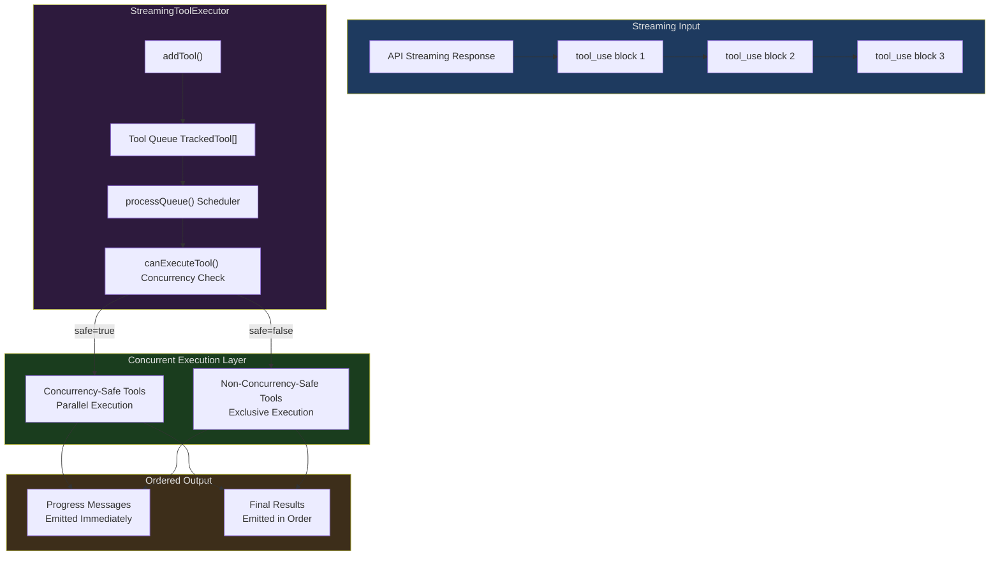
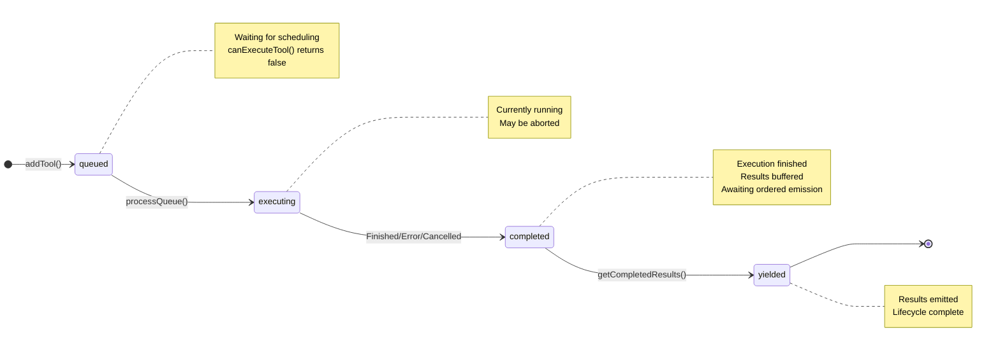
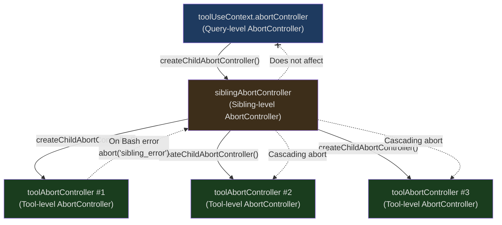

## The Problem

Imagine this scenario: you ask Claude Code to refactor a module. The model returns 5 `tool_use` calls in a single response — 3 file reads, 1 Bash command execution, and 1 file write. Now the questions arise:

1. Should these 5 tools run serially or in parallel?
2. If the Bash command fails, should the file reads running in parallel be cancelled?
3. The file write depends on the Bash result — should it wait for Bash to complete before executing?
4. The user presses ESC during tool execution — which tools should stop, and which should continue?
5. Multiple tools produce progress messages simultaneously — how should the UI display them in order?

These questions seem simple, but each one involves core challenges of concurrency control. Serial execution is too slow — users don't want to wait for 3 independent file reads to complete one after another. Full parallelism is too dangerous — a write operation and a read operation accessing the same file simultaneously could cause a data race.

Claude Code's solution is `StreamingToolExecutor` — a carefully designed concurrency orchestrator that lets each tool declare whether it can run in parallel, then dynamically schedules execution based on those declarations. This article will dissect every design decision in detail.

---

## Why a Streaming Tool Executor?

In the previous article, we covered the overall architecture of the tool system. But one key question was intentionally deferred to this article: when the model returns multiple tool calls in a single streaming response, how does the executor manage their lifecycles?

Traditional approaches fall into two extremes:

**Approach A: Fully Serial**

```mermaid
gantt
    title Fully Serial Execution (Total time: 4T)
    dateFormat X
    axisFormat %s
    section Execution
        Tool 1 :a, 0, 1
        Tool 2 :b, after a, 1
        Tool 3 :c, after b, 1
        Tool 4 :d, after c, 1
```



Safe but extremely slow. Each tool waits for the previous one to finish before starting. For 3 independent file reads, this means 3x the wait time.

**Approach B: Fully Parallel**

```mermaid
gantt
    title Fully Parallel Execution (Total time: T)
    dateFormat X
    axisFormat %s
    section Execution
        Tool 1 :a, 0, 1
        Tool 2 :b, 0, 1
        Tool 3 :c, 0, 1
        Tool 4 :d, 0, 1
```



Fast but dangerous. If Tool 1 is `rm -rf build/` and Tool 2 is `cat build/output.js`, the result of parallel execution is unpredictable.

**Approach C: Claude Code's Hybrid Scheduling**

```mermaid
gantt
    title Hybrid Scheduling (Total time: 2T)
    dateFormat X
    axisFormat %s
    section Parallel Reads
        Tool 1 (Read)  :a, 0, 1
        Tool 2 (Read)  :b, 0, 1
        Tool 3 (Read)  :c, 0, 1
    section Exclusive Write
        Tool 4 (Bash)  :d, 1, 2
```



Reads run in parallel, writes get exclusive access. Safe and efficient.

This is the core problem `StreamingToolExecutor` solves.

---

## Architecture Overview

`StreamingToolExecutor` lives in `src/services/tools/StreamingToolExecutor.ts` and is a class of roughly 530 lines. Its responsibilities are:

1. **Receive tool calls** — accept `tool_use` blocks one by one as the streaming response arrives
2. **Determine scheduling strategy** — based on each tool's concurrency safety declaration, decide whether to execute immediately or queue
3. **Manage lifecycles** — track each tool from queuing to completion
4. **Handle error cascading** — one tool's failure may require cancelling its sibling tools
5. **Emit results in order** — progress messages are sent immediately, final results are emitted in sequence

Here is the overall architecture diagram:



---

## TrackedTool: The Complete Lifecycle of a Tool

Every tool call that enters the executor is wrapped in a `TrackedTool` object. This structure is defined at lines 21-32 of `StreamingToolExecutor.ts`:

```typescript
// src/services/tools/StreamingToolExecutor.ts:19-32

// The four possible lifecycle states of a tool within the executor.
// Tools always progress linearly: queued -> executing -> completed -> yielded.
// This strict ordering ensures predictable state transitions and simplifies
// reasoning about concurrency — no tool can "go back" to a previous state.
type ToolStatus = 'queued' | 'executing' | 'completed' | 'yielded'

// TrackedTool wraps every tool call that enters the executor, adding the
// metadata needed for lifecycle management, concurrency scheduling, and
// ordered result emission. This is the central data structure of the system.
type TrackedTool = {
  // Unique identifier matching the tool_use block's ID from the API response
  id: string
  // The raw tool_use block from the streaming API (contains tool name and input)
  block: ToolUseBlock
  // Reference to the parent assistant message that triggered this tool call
  assistantMessage: AssistantMessage
  // Current lifecycle state — drives scheduling and emission decisions
  status: ToolStatus
  // Pre-computed concurrency safety flag (evaluated once at addTool time,
  // not re-evaluated during execution, since input doesn't change)
  isConcurrencySafe: boolean
  // The execution Promise — set when the tool starts running, used by
  // getRemainingResults() to await completion via Promise.race
  promise?: Promise<void>
  // Buffered final results — stored here until ordered emission by
  // getCompletedResults(). Even if this tool finishes early, results
  // wait until all prior tools have been emitted first.
  results?: Message[]
  // Progress messages are stored separately and yielded immediately
  // (e.g., streaming Bash output). Unlike results, progress messages
  // bypass the ordering constraint for real-time user feedback.
  pendingProgress: Message[]
  // Optional functions that modify the shared execution context after
  // this tool completes. Only supported for non-concurrent tools to
  // avoid race conditions on shared state.
  contextModifiers?: Array<(context: ToolUseContext) => ToolUseContext>
}
```

### Four Lifecycle States

`ToolStatus` is a four-value enum, and each tool flows strictly through `queued -> executing -> completed -> yielded`:



**queued (waiting)**: The tool was just added by `addTool()` and hasn't started executing yet. There may be other non-concurrency-safe tools currently running exclusively, so it must wait.

**executing (running)**: The tool has started execution. Its `promise` field holds the execution Promise, and progress messages are collected in real time via the `pendingProgress` array.

**completed (finished)**: Tool execution has ended (success, failure, or cancellation), and results are stored in the `results` field but haven't been emitted to the caller yet. This is the key to ordered emission — even if Tool 3 finishes first, it waits for Tool 1 and Tool 2's results to be emitted first.

**yielded (emitted)**: Results have been emitted to the caller via `getCompletedResults()`, and this tool's lifecycle is completely over.

### Key Field Analysis

`pendingProgress` is a field worth special attention. Progress messages (like real-time output from a Bash command) need to be shown to the user immediately and can't wait until the tool completes. So progress messages and final results are stored separately — progress messages can be emitted at any time, while final results must be emitted in order.

`contextModifiers` stores the tool's modifications to the execution context. For example, a tool might need to update file history state. But note an important restriction in the code (lines 391-395):

```typescript
// src/services/tools/StreamingToolExecutor.ts:389-395

// NOTE: we currently don't support context modifiers for concurrent
//       tools. None are actively being used, but if we want to use
//       them in concurrent tools, we need to support that here.

// Only apply context modifications from non-concurrent (exclusive) tools.
// This guard prevents race conditions: if two concurrent tools both tried
// to modify toolUseContext simultaneously, the final state would be
// non-deterministic. By restricting modifiers to exclusive tools, we
// guarantee that context updates happen sequentially and predictably.
if (!tool.isConcurrencySafe && contextModifiers.length > 0) {
  // Apply each modifier in order — each one receives the context produced
  // by the previous modifier, forming a reduction chain.
  for (const modifier of contextModifiers) {
    this.toolUseContext = modifier(this.toolUseContext)
  }
}
```

Only non-concurrency-safe tools can modify the context. This is a deliberate design constraint — concurrent tools modifying shared context would introduce race conditions, so it's simply prohibited.

---

## isConcurrencySafe: Tools Decide for Themselves Whether They Can Run in Parallel

The most fundamental design principle of `StreamingToolExecutor` is that **tools declare their own concurrency safety**. Not guessed by the scheduler, not defined in a global configuration table, but implemented by each tool in its `isConcurrencySafe()` method.

This method is defined at line 402 of `src/Tool.ts`:

```typescript
// src/Tool.ts:402
// Each tool implements this method to declare whether it can safely run
// alongside other tools. The input parameter is key — it allows the SAME
// tool to return different answers depending on what it's being asked to do
// (e.g., a Bash tool running "ls" is safe, but "rm -rf" is not).
isConcurrencySafe(input: z.infer<Input>): boolean
```

Note that it accepts an `input` parameter — this means the same tool may have different concurrency safety depending on the input.

### Concurrency Safety Declarations Across Tools

Let's look at how various tools actually declare themselves in the code:

**FileReadTool (file reading) — always concurrency-safe:**

```typescript
// src/tools/FileReadTool/FileReadTool.ts:373-375
// File reads are purely read-only — no side effects, no shared state mutation.
isConcurrencySafe() {
  return true
},
```

File reading is a purely read-only operation; multiple reads running simultaneously produce no side effects.

**GrepTool (search) — always concurrency-safe:**

```typescript
// src/tools/GrepTool/GrepTool.ts:183-185
// Search/grep is read-only, safe to run multiple searches in parallel.
isConcurrencySafe() {
  return true
},
```

Search operations are likewise read-only, naturally supporting parallelism.

**AgentTool (sub-agent) — always concurrency-safe:**

```typescript
// src/tools/AgentTool/AgentTool.tsx:1273-1275
// Sub-agents run in fully isolated contexts (separate message history,
// separate tool instances), so they cannot interfere with each other.
isConcurrencySafe() {
  return true;
},
```

The sub-agent tool declares itself as concurrency-safe because each sub-agent runs in its own isolated context.

**BashTool (command execution) — depends on input:**

```typescript
// src/tools/BashTool/BashTool.tsx:434-436
// The Bash tool's safety depends on the COMMAND being run. The isReadOnly
// helper analyzes the command string to determine if it only reads data
// (e.g., ls, cat, grep) or has side effects (e.g., rm, mv, git commit).
// If isReadOnly is not defined or throws, the nullish coalescing (??)
// falls back to false — the conservative "assume unsafe" default.
isConcurrencySafe(input) {
  return this.isReadOnly?.(input) ?? false;
},
```

This is the most interesting case. The Bash tool's concurrency safety depends on whether the command itself is read-only. `ls`, `cat`, `grep` are read-only and can run in parallel; `rm`, `mv`, `git commit` have side effects and must run exclusively.

**Default behavior — assume unsafe (line 759):**

```typescript
// src/Tool.ts:757-759
// Default values applied to all tools created via buildTool().
// The underscore prefix on _input signals that the parameter is
// intentionally unused — the default always returns false.
const TOOL_DEFAULTS = {
  // ...
  // Conservative default: any tool that doesn't explicitly opt in to
  // concurrency safety is treated as unsafe and will run exclusively.
  // This "fail-safe" approach means new tools are safe by default —
  // developers must consciously declare parallelism support.
  isConcurrencySafe: (_input?: unknown) => false,
  // ...
}
```

Tools built through `buildTool()` that don't explicitly declare `isConcurrencySafe` default to returning `false`. This is a **conservatively safe** design — better to sacrifice performance than risk concurrency issues.

### Safety Calculation in addTool

When a tool is added to the executor, the `isConcurrencySafe` calculation process is worth careful examination. See lines 104-121 of `StreamingToolExecutor.ts`:

```typescript
// src/services/tools/StreamingToolExecutor.ts:104-121

// LAYER 1: Validate the tool's input against its Zod schema.
// safeParse returns { success: true, data } or { success: false, error }
// without throwing, so invalid input is handled gracefully.
const parsedInput = toolDefinition.inputSchema.safeParse(block.input)

// Determine concurrency safety through a three-layer defensive chain:
const isConcurrencySafe = parsedInput?.success
  ? (() => {
      try {
        // LAYER 2: Call the tool's isConcurrencySafe with validated input.
        // Wrapped in try-catch because a bug in the tool's implementation
        // could throw — we never want a tool definition error to crash
        // the entire executor.
        // LAYER 3: Boolean() coercion prevents truthy-but-not-true values
        // (e.g., a non-empty string) from being treated as safe.
        return Boolean(toolDefinition.isConcurrencySafe(parsedInput.data))
      } catch {
        // Any exception in the safety check defaults to unsafe —
        // if we can't determine safety, assume the worst.
        return false
      }
    })()
  : false // Invalid input => treat as unsafe (will likely error during execution anyway)

// Create the TrackedTool entry and add it to the queue.
// Every tool starts in the 'queued' state and waits for processQueue()
// to determine when it can begin executing.
this.tools.push({
  id: block.id,
  block,
  assistantMessage,
  status: 'queued',
  isConcurrencySafe,
  pendingProgress: [],
})
```

There are three layers of defense here:

1. **Input validation**: First validate input using the Zod schema. If the input format is invalid, it's immediately marked as non-concurrency-safe.
2. **try-catch wrapper**: Even if the input is valid, `isConcurrencySafe()` itself might throw an exception (e.g., a bug in the tool definition). Any exception falls back to `false`.
3. **Boolean coercion**: The result is wrapped in `Boolean()` to prevent tools from accidentally returning truthy values (like non-empty strings).

This "defense in depth" pattern is ubiquitous in Claude Code — on code paths related to concurrency and safety, always assume the worst case.

---

## canExecuteTool: The Core Scheduling Decision

Given each tool's concurrency safety declaration, how does the scheduler decide whether a tool can execute immediately? The logic is remarkably concise, just 6 lines of code (lines 129-135):

```typescript
// src/services/tools/StreamingToolExecutor.ts:129-135

// The core scheduling decision — implements a read-write lock pattern
// in just 6 lines. This is called for every queued tool to determine
// if it can start executing right now.
private canExecuteTool(isConcurrencySafe: boolean): boolean {
  // Snapshot of all currently running tools
  const executingTools = this.tools.filter(t => t.status === 'executing')
  return (
    // Condition 1: No tools running — the executor is idle, so any
    // tool (safe or unsafe) can start immediately.
    executingTools.length === 0 ||
    // Condition 2: Both the new tool AND all running tools are
    // concurrency-safe. This is the "multiple readers" case —
    // safe tools can freely coexist. If ANY running tool is unsafe,
    // this condition fails and the new tool must wait.
    (isConcurrencySafe && executingTools.every(t => t.isConcurrencySafe))
  )
}
```

In plain language: **a tool can execute if and only if one of the following two conditions holds**:

1. No tools are currently executing (idle state, any tool can start)
2. The current tool is concurrency-safe, **and** all currently executing tools are also concurrency-safe

This logic implies an important corollary: **as long as any non-concurrency-safe tool is executing, all other tools must wait**. Non-concurrency-safe tools get exclusive access.

Let's visualize with a table:

| Currently Executing Tools | New Tool (safe) | New Tool (unsafe) |
|:---|:---:|:---:|
| None (idle) | Can execute | Can execute |
| All safe | Can execute | Wait |
| Includes unsafe | Wait | Wait |

This is a classic **read-write lock** pattern: concurrency-safe tools are like read locks (multiple can coexist), non-concurrency-safe tools are like write locks (must be exclusive).

---

## processQueue: The Subtleties of Queue Scheduling

The `processQueue()` method (lines 140-151) is responsible for traversing the queue and starting executable tools:

```typescript
// src/services/tools/StreamingToolExecutor.ts:140-151

// Scans the tool queue front-to-back, starting any tools that are
// eligible to execute. Called both when new tools are added and when
// running tools complete — creating a self-driving scheduling loop.
private async processQueue(): Promise<void> {
  for (const tool of this.tools) {
    // Skip tools that are already running, finished, or emitted —
    // only 'queued' tools need scheduling decisions.
    if (tool.status !== 'queued') continue

    if (this.canExecuteTool(tool.isConcurrencySafe)) {
      // Tool can run now — start it. Note: executeTool() sets up the
      // Promise but does NOT await completion, so multiple tools can
      // be kicked off within a single processQueue() pass.
      await this.executeTool(tool)
    } else {
      // Can't execute this tool yet, and since we need to maintain
      // order for non-concurrent tools, stop here
      //
      // CRITICAL: For unsafe tools, we BREAK — not continue. This prevents
      // tools AFTER this unsafe tool from being scheduled out of order.
      // Without this break, a later safe tool might leapfrog this unsafe
      // tool and execute before it, violating ordering guarantees.
      // Safe tools just skip (implicit continue) because they don't
      // impose ordering constraints on subsequent tools.
      if (!tool.isConcurrencySafe) break
    }
  }
}
```

This code has an easily overlooked but critically important detail — the `break` statement. When it encounters a **non-concurrency-safe** tool that can't execute, the scheduler stops traversal. Why?

Consider the following tool sequence:

```mermaid
gantt
    title Tool Sequence with Concurrency Safety
    dateFormat X
    axisFormat %s
    section safe
        Read A :a, 0, 1
        Read B :b, 0, 1
    section unsafe
        Bash "git add ." :c, 1, 2
    section safe
        Read C :d, 2, 3
    section unsafe
        Bash "git commit" :e, 3, 4
```



Without the `break`, the scheduler would skip `Bash "git add ."` when it can't execute and continue checking `Read C`. `Read C` is concurrency-safe and might be started. But this is problematic — `Read C` would execute **before** `git add .`, potentially reading file contents not yet staged.

The `break` ensures **ordering between non-concurrency-safe tools**. Once a queued non-concurrency-safe tool is encountered, no subsequent tools (safe or not) will be started.

Conversely: what if the tool that can't execute is a **concurrency-safe** one? It's simply skipped (`continue`) and doesn't prevent scheduling of subsequent tools. When would a concurrency-safe tool be unable to execute? When a non-concurrency-safe tool currently has exclusive access. Once the exclusive tool completes, all queued concurrency-safe tools can start together.

### When processQueue Is Triggered

`processQueue()` is called in two places:

1. **In addTool()** (line 123): every time a new tool is added, immediately try to schedule it.
2. **When executeTool() completes** (lines 402-404): after a tool finishes, trigger a new round of scheduling.

```typescript
// src/services/tools/StreamingToolExecutor.ts:398-404

// Start the tool's execution and capture the resulting Promise.
// This Promise resolves when the tool finishes (success, error, or abort).
const promise = collectResults()
// Store the Promise on the TrackedTool so getRemainingResults() can
// use Promise.race() to efficiently wait for the next tool to complete.
tool.promise = promise

// Process more queue when done
// This .finally() callback creates the self-driving scheduling loop:
// when this tool completes, it triggers another scheduling pass, which
// may start queued tools that were waiting for this one to finish.
// The void keyword discards the returned Promise — we don't need to
// await the next processQueue() call here.
void promise.finally(() => {
  void this.processQueue()
})
```

This creates a self-driving loop: tool completes -> try to schedule -> new tool starts -> new tool completes -> schedule again... until the queue is empty.

---

## Sibling AbortController: Cascading Cancellation of Errors

One of the trickiest problems with concurrent execution is error handling. When multiple tools are running in parallel, how should one tool's failure affect the others?

Claude Code's design is: **only Bash tool errors cascade-cancel sibling tools**. This design stems from a practical observation — Bash commands often have implicit dependency chains (`mkdir` fails, so the subsequent `cd` and `touch` are pointless), while Read, Grep, WebFetch and other tools are independent — one file read failure shouldn't affect another file's read.

### Three-Layer AbortController Architecture

Error cascading relies on a carefully designed three-layer `AbortController` architecture:



**Layer 1: Query-Level AbortController (`toolUseContext.abortController`)**

This is the lifecycle controller for the entire query turn. When the user presses ESC or submits a new message, this controller is aborted, causing the entire turn to end.

**Layer 2: Sibling-Level AbortController (`siblingAbortController`)**

This is created by `StreamingToolExecutor` during construction as a child controller of the query-level controller (lines 59-61):

```typescript
// src/services/tools/StreamingToolExecutor.ts:59-61

// Create the sibling-level AbortController as a CHILD of the query-level
// controller. This parent-child relationship means:
//   - If the query-level controller aborts (user presses ESC), the sibling
//     controller is also aborted, cascading to all tools.
//   - If the sibling controller aborts (Bash error), it does NOT propagate
//     upward — the query continues so the model can see the error and react.
this.siblingAbortController = createChildAbortController(
  toolUseContext.abortController,
)
```

Key property: **aborting the sibling-level controller does not abort the parent controller**. This means a Bash error can cancel all sibling tools without terminating the entire query turn — the model will still receive the error information and continue reasoning.

**Layer 3: Tool-Level AbortController (`toolAbortController`)**

Each tool creates its own controller during execution as a child of the sibling-level controller (lines 301-302):

```typescript
// src/services/tools/StreamingToolExecutor.ts:301-302

// Each tool gets its own AbortController, created as a child of the
// sibling-level controller. This gives each tool an independent abort
// handle while still responding to group-level and query-level aborts
// via the parent-child chain: query -> sibling -> tool.
const toolAbortController = createChildAbortController(
  this.siblingAbortController,
)
```

### Bash Error Cascade Path

When a Bash tool execution fails, the complete cascade path is as follows (lines 354-363):

```typescript
// src/services/tools/StreamingToolExecutor.ts:354-363

// When a tool produces an error result, determine whether it should
// cascade-cancel sibling tools or just fail in isolation.
if (isErrorResult) {
  // Mark this tool as errored so it won't also receive a duplicate
  // synthetic "sibling_error" message (see deduplication logic below).
  thisToolErrored = true
  // Only Bash errors cancel siblings. Bash commands often have implicit
  // dependency chains (e.g. mkdir fails -> subsequent commands pointless).
  // Read/WebFetch/etc are independent — one failure shouldn't nuke the rest.
  if (tool.block.name === BASH_TOOL_NAME) {
    // Set executor-wide error state so getAbortReason() returns
    // 'sibling_error' for all other tools on their next check.
    this.hasErrored = true
    // Record which tool caused the error, so synthetic error messages
    // for cancelled siblings can include a helpful description like
    // "Cancelled: parallel tool call Bash(mkdir /tmp/test) errored".
    this.erroredToolDescription = this.getToolDescription(tool)
    // Abort the sibling controller — this cascades to ALL tool-level
    // controllers via the parent-child chain, signaling every other
    // running tool to stop. Does NOT propagate to the query-level
    // controller, so the model can still process the error.
    this.siblingAbortController.abort('sibling_error')
  }
}
```

Execution flow:

1. The Bash tool's execution result contains a `tool_result` with `is_error: true`
2. The `hasErrored` flag is set to `true`
3. `erroredToolDescription` records the description of the errored tool (e.g., `Bash(mkdir /tmp/test...)`)
4. `siblingAbortController.abort('sibling_error')` is called
5. This abort signal propagates through `createChildAbortController`'s parent-child relationship to all other tools' `toolAbortController`
6. Executing tools that receive the abort signal generate synthetic error messages (lines 189-204)

### Tool-Level Abort Upward Propagation

The tool-level `AbortController` has a subtle event listener (lines 304-317) that handles a special case — when permission dialog denial occurs:

```typescript
// src/services/tools/StreamingToolExecutor.ts:304-317

// Listen for this tool's abort signal to handle UPWARD propagation —
// certain abort reasons need to bubble up from tool-level to query-level.
// This was added to fix regression #21056 where permission denials
// weren't properly terminating the query turn.
toolAbortController.signal.addEventListener(
  'abort',
  () => {
    // Only propagate upward if ALL three conditions are met:
    if (
      // 1. The abort was NOT caused by a sibling error (those are
      //    intentionally contained at the sibling level).
      toolAbortController.signal.reason !== 'sibling_error' &&
      // 2. The query-level controller is not already aborted
      //    (no need to abort something already aborted).
      !this.toolUseContext.abortController.signal.aborted &&
      // 3. The executor is not in discard mode (streaming fallback
      //    handles cleanup differently).
      !this.discarded
    ) {
      // Propagate the abort reason (e.g., permission denial) up to
      // the query-level controller, terminating the entire turn.
      this.toolUseContext.abortController.abort(
        toolAbortController.signal.reason,
      )
    }
  },
  // { once: true } ensures this handler fires at most once and is
  // automatically removed, preventing memory leaks.
  { once: true },
)
```

This code means: if the tool is aborted for a reason **other than** a sibling error (such as permission denial), then this abort needs to **bubble up** to the query-level controller to terminate the entire turn. The code comments mention `#21056 regression` — this upward bubbling logic was added to fix a specific regression bug.

### Synthetic Error Messages

Cancelled tools aren't simply discarded — they receive a synthetic error message so the model knows these tools didn't execute successfully. The `createSyntheticErrorMessage` method (lines 153-205) generates different error messages based on the cancellation reason:

```typescript
// src/services/tools/StreamingToolExecutor.ts:153-205

// Generates a synthetic tool_result error message for tools that were
// cancelled before completing. The model receives these messages in its
// conversation history so it understands WHY tools didn't produce results.
// Each cancellation reason produces a distinct message tailored to help
// the model make the best next decision.
private createSyntheticErrorMessage(
  toolUseId: string,
  reason: 'sibling_error' | 'user_interrupted' | 'streaming_fallback',
  assistantMessage: AssistantMessage,
): Message {
  // Case 1: User actively cancelled (pressed ESC or submitted new message).
  // The memory correction hint tells the model not to retry the same action,
  // since the user explicitly chose to reject it.
  if (reason === 'user_interrupted') {
    return createUserMessage({
      content: [{
        type: 'tool_result',
        content: withMemoryCorrectionHint(REJECT_MESSAGE),
        is_error: true,
        tool_use_id: toolUseId,
      }],
      toolUseResult: 'User rejected tool use',
      // ...
    })
  }
  // Case 2: Streaming connection failed and the executor is discarding
  // all in-flight work. This is a transient infrastructure error, not
  // a tool logic error — the model will typically retry.
  if (reason === 'streaming_fallback') {
    return createUserMessage({
      content: [{
        type: 'tool_result',
        content: '<tool_use_error>Error: Streaming fallback - tool execution discarded</tool_use_error>',
        is_error: true,
        tool_use_id: toolUseId,
      }],
      // ...
    })
  }
  // Case 3: A sibling Bash tool errored, causing this tool to be cancelled.
  // Include the description of the ERRORED tool so the model knows which
  // sibling caused the cascade and can reason about the dependency.
  // sibling_error
  const desc = this.erroredToolDescription
  const msg = desc
    ? `Cancelled: parallel tool call ${desc} errored`
    : 'Cancelled: parallel tool call errored'
  return createUserMessage({
    content: [{
      type: 'tool_result',
      content: `<tool_use_error>${msg}</tool_use_error>`,
      is_error: true,
      tool_use_id: toolUseId,
    }],
    // ...
  })
}
```

Three cancellation reasons produce three different messages:

| Reason | Message Content | Purpose |
|:---|:---|:---|
| `sibling_error` | `Cancelled: parallel tool call Bash(mkdir...) errored` | Model knows which sibling tool failed |
| `user_interrupted` | `User rejected tool use` + memory correction hint | Model knows the user actively cancelled |
| `streaming_fallback` | `Streaming fallback - tool execution discarded` | Silent cancellation during streaming fallback |

### Preventing Duplicate Error Messages

There's an elegant deduplication logic in the code — the `thisToolErrored` flag (lines 330-345):

```typescript
// src/services/tools/StreamingToolExecutor.ts:328-345

// Track if this specific tool has produced an error result.
// This prevents the tool from receiving a duplicate "sibling error"
// message when it is the one that caused the error.
// Without this flag, a Bash tool that errors would: (1) produce its own
// error result, (2) trigger siblingAbortController.abort(), (3) then on
// the next loop iteration, getAbortReason() returns 'sibling_error' for
// THIS tool too, generating a SECOND spurious error. The flag prevents step 3.
let thisToolErrored = false

// Consume the tool's execution generator, processing each update as it arrives.
// This is the main per-tool execution loop where progress, results, and abort
// signals are all handled in real time.
for await (const update of generator) {
  // On every iteration, check if this tool should be cancelled.
  // getAbortReason() checks (in priority order): discard mode, sibling
  // errors, and user interrupts.
  const abortReason = this.getAbortReason(tool)
  // Only inject a synthetic error if the tool hasn't already produced its
  // own error. This is the deduplication guard — the originating error tool
  // already has a real error message and doesn't need a synthetic one.
  if (abortReason && !thisToolErrored) {
    messages.push(
      this.createSyntheticErrorMessage(
        tool.id,
        abortReason,
        tool.assistantMessage,
      ),
    )
    // Stop consuming updates — this tool is done.
    break
  }
  // ...
  if (isErrorResult) {
    // Mark this tool as errored BEFORE the abort cascades, so the
    // deduplication guard above will prevent a synthetic message.
    thisToolErrored = true
    // ...
  }
}
```

If Tool A is a Bash tool that errors, it triggers `siblingAbortController.abort()`. At this point, `getAbortReason()` would also return `sibling_error` for Tool A itself. But because `thisToolErrored` has already been set to `true`, Tool A won't receive an additional synthetic error message — it already has its own real error result.

---

## Progress Buffering and Ordered Emission

Concurrent execution introduces an output ordering problem. Suppose Tool 1 and Tool 2 are running in parallel, and Tool 2 finishes first — should its results be emitted before Tool 1's?

Claude Code's answer is to treat two types of output differently:

1. **Progress messages**: emitted immediately, no ordering required
2. **Final results**: must be emitted in tool addition order

### Immediate Emission of Progress Messages

In the execution loop of the `executeTool()` method (lines 366-374), progress messages are stored in the `pendingProgress` array:

```typescript
// src/services/tools/StreamingToolExecutor.ts:366-374

// Route each message to the appropriate buffer based on its type.
// This two-path design is fundamental to the output strategy:
// progress is real-time, results are ordered.
if (update.message) {
  // Progress messages go to pendingProgress for immediate yielding
  // (e.g., streaming Bash stdout lines). Users see these in real time.
  if (update.message.type === 'progress') {
    tool.pendingProgress.push(update.message)
    // Signal that progress is available — this resolves the Promise
    // that getRemainingResults() is awaiting via Promise.race(),
    // waking it up to emit the new progress immediately.
    if (this.progressAvailableResolve) {
      this.progressAvailableResolve()
      // Clear the resolver so the next wait creates a fresh Promise.
      this.progressAvailableResolve = undefined
    }
  } else {
    // Non-progress messages (tool_result, etc.) are final results —
    // buffer them for ordered emission by getCompletedResults().
    messages.push(update.message)
  }
}
```

Note the `progressAvailableResolve` semaphore — when new progress messages arrive, it wakes up the waiting `getRemainingResults()`.

### Ordered Emission of Results

The `getCompletedResults()` method (lines 412-440) implements ordered emission logic:

```typescript
// src/services/tools/StreamingToolExecutor.ts:412-440

// A synchronous generator that emits completed tool results in the order
// tools were added (not the order they completed). This preserves a
// deterministic output order regardless of parallel execution timing.
*getCompletedResults(): Generator<MessageUpdate, void> {
  // If the executor has been discarded (streaming fallback), produce nothing.
  // Any residual results would be stale and potentially confusing.
  if (this.discarded) {
    return
  }

  // Walk through tools in insertion order (the order the model requested them).
  for (const tool of this.tools) {
    // Always yield pending progress messages immediately,
    // regardless of tool status.
    // Progress is always emitted eagerly — even for tools that haven't
    // completed yet or have already been yielded. shift() drains the
    // buffer one message at a time.
    while (tool.pendingProgress.length > 0) {
      const progressMessage = tool.pendingProgress.shift()!
      yield { message: progressMessage, newContext: this.toolUseContext }
    }

    // Already emitted — nothing more to do for this tool.
    if (tool.status === 'yielded') {
      continue
    }

    if (tool.status === 'completed' && tool.results) {
      // Transition to 'yielded' — this tool's lifecycle is now complete.
      tool.status = 'yielded'

      // Emit all buffered final results for this tool.
      for (const message of tool.results) {
        yield { message, newContext: this.toolUseContext }
      }

      // Notify the context that this tool is done (used for UI updates,
      // permission tracking, etc.)
      markToolUseAsComplete(this.toolUseContext, tool.id)
    } else if (tool.status === 'executing' && !tool.isConcurrencySafe) {
      // CRITICAL BREAK: An unsafe tool is still running. We must NOT emit
      // any results from tools that come AFTER it, because the unsafe tool's
      // contextModifiers may change the context that later results depend on.
      // Wait for it to complete before continuing emission.
      break
    }
    // If a safe tool is still executing, we simply skip past it (no break)
    // and continue checking later tools. Safe tools don't modify context,
    // so there's no ordering dependency.
  }
}
```

The traversal logic in this code is quite elegant. Let's illustrate with an example:

| Tool | Type | Concurrency | Status | Note |
|:---|:---|:---:|:---|:---|
| Tool 1 | Read | safe | `yielded` | |
| Tool 2 | Read | safe | `completed` | results pending emission |
| Tool 3 | Read | safe | `executing` | |
| Tool 4 | Bash | unsafe | `queued` | |

Traversal process:
1. Tool 1: `yielded`, skip (but emit any pending progress first)
2. Tool 2: `completed`, emit results, mark as `yielded`
3. Tool 3: `executing`, concurrency-safe, **don't break**, continue traversal (emit pending progress)
4. Tool 4: `queued`, doesn't match any condition, natural end

What if Tool 3 were non-concurrency-safe?

| Tool | Type | Concurrency | Status | Note |
|:---|:---|:---:|:---|:---|
| Tool 1 | Read | safe | `yielded` | |
| Tool 2 | Read | safe | `completed` | |
| Tool 3 | Bash | unsafe | `executing` | still running |
| Tool 4 | Read | safe | `completed` | |

Traversal process:
1. Tool 1: `yielded`, skip
2. Tool 2: `completed`, emit results
3. Tool 3: `executing` and `!isConcurrencySafe`, **break**!
4. Tool 4's results will NOT be emitted, even though it's already completed

Why? Because the non-concurrency-safe tool's results may have changed the context (via `contextModifiers`), and Tool 4's results might depend on this modified context. So we must wait for Tool 3 to complete and the context to update before emitting Tool 4's results.

### getRemainingResults Wait Mechanism

`getRemainingResults()` is an `AsyncGenerator` (lines 453-490) that continuously waits until all tools have finished:

```typescript
// src/services/tools/StreamingToolExecutor.ts:453-490

// The main consumer-facing async generator. Callers use
// `for await (const result of executor.getRemainingResults()) { ... }`
// to receive all results and progress as they become available.
// This method drives the entire execution loop to completion.
async *getRemainingResults(): AsyncGenerator<MessageUpdate, void> {
  // Early exit if executor was discarded (streaming fallback).
  if (this.discarded) {
    return
  }

  // Main loop: keep running as long as any tools are queued or executing.
  while (this.hasUnfinishedTools()) {
    // Trigger scheduling — may start new tools if queue conditions allow.
    await this.processQueue()

    // Emit any results and progress that are ready right now.
    for (const result of this.getCompletedResults()) {
      yield result
    }

    // If tools are still executing but there's nothing new to emit,
    // we need to WAIT efficiently rather than busy-polling.
    if (
      this.hasExecutingTools() &&
      !this.hasCompletedResults() &&
      !this.hasPendingProgress()
    ) {
      // Collect all executing tools' Promises — when any one resolves,
      // it means a tool has finished and we should check for new results.
      const executingPromises = this.tools
        .filter(t => t.status === 'executing' && t.promise)
        .map(t => t.promise!)

      // Create a Promise that resolves when ANY tool produces new progress.
      // This is the "semaphore" that executeTool() resolves when it pushes
      // a progress message into pendingProgress.
      const progressPromise = new Promise<void>(resolve => {
        this.progressAvailableResolve = resolve
      })

      if (executingPromises.length > 0) {
        // Promise.race: wake up when EITHER a tool completes OR new
        // progress arrives — whichever comes first. This is event-driven,
        // not polling, so there's zero CPU waste while waiting.
        await Promise.race([...executingPromises, progressPromise])
      }
    }
  }

  // Final drain: emit any remaining results after all tools have finished.
  // This catches results from the last tool to complete.
  for (const result of this.getCompletedResults()) {
    yield result
  }
}
```

`Promise.race` is the key — it simultaneously waits for two types of events:

1. Any executing tool to complete
2. Any tool to produce new progress messages

Whichever happens first wakes up the loop, allowing it to emit new results or progress. This implements an event-driven reactive loop — not polling, but passively waiting for notifications.

---

## interruptBehavior: Strategy Selection on User Interruption

When a user presses ESC or submits a new message during tool execution, different tools should react differently. Some tools should stop immediately (like a long-running search), while others should continue running to completion (like a file write in progress — stopping midway could corrupt the file).

### cancel vs block

The `interruptBehavior` method is defined at lines 408-416 of `src/Tool.ts`:

```typescript
// src/Tool.ts:408-416

// Declares how this tool should behave when the user interrupts execution
// (e.g., pressing ESC or submitting a new message). This is optional —
// tools that don't implement it inherit the safe default of 'block'.
/**
 * What should happen when the user submits a new message while this tool
 * is running.
 *
 * - 'cancel' — stop the tool and discard its result
 * - 'block'  — keep running; the new message waits
 *
 * Defaults to 'block' when not implemented.
 */
interruptBehavior?(): 'cancel' | 'block'
```

- **`cancel`**: The tool can safely stop midway. On user interruption, a synthetic error message is generated and partial results are discarded.
- **`block`**: The tool is performing a non-interruptible operation. The user's new message must wait until this tool completes before being sent.

The default behavior is `block`, which is again a conservatively safe design.

### Implementation in StreamingToolExecutor

The `getAbortReason()` method (lines 210-230) handles `interruptBehavior`:

```typescript
// src/services/tools/StreamingToolExecutor.ts:210-230

// Checks whether a tool should be aborted and returns the reason why.
// Called on every iteration of the execution loop to detect cancellation
// as early as possible. Returns null if the tool should keep running.
// The priority order matters — higher-priority reasons are checked first.
private getAbortReason(
  tool: TrackedTool,
): 'sibling_error' | 'user_interrupted' | 'streaming_fallback' | null {
  // PRIORITY 1 (highest): Streaming fallback — the entire streaming
  // connection failed, so all tools must be discarded unconditionally.
  if (this.discarded) {
    return 'streaming_fallback'
  }
  // PRIORITY 2: A sibling Bash tool errored — cascade-cancel all tools.
  if (this.hasErrored) {
    return 'sibling_error'
  }
  // PRIORITY 3: The query-level abort signal fired (user action).
  if (this.toolUseContext.abortController.signal.aborted) {
    // Special case: if the reason is 'interrupt' (user submitted a new
    // message), we check the tool's interruptBehavior. Tools that declare
    // 'block' return null here — they continue running and the user's
    // new message waits. Only 'cancel' tools get interrupted.
    if (this.toolUseContext.abortController.signal.reason === 'interrupt') {
      return this.getToolInterruptBehavior(tool) === 'cancel'
        ? 'user_interrupted'
        : null  // Tool declares 'block' — let it finish
    }
    // For any other abort reason (e.g., ESC pressed), all tools are cancelled.
    return 'user_interrupted'
  }
  // No abort condition detected — tool should continue executing.
  return null
}
```

Note the priority hierarchy here:

1. First check `discarded` (streaming fallback) — highest priority
2. Then check `hasErrored` (sibling error) — second highest
3. Finally check the abort signal:
   - If the reason is `'interrupt'` (user submitted a new message), only `cancel` tools will be cancelled
   - If the reason is something else (user pressed ESC), all tools will be cancelled

### Interruptible State Updates

The `updateInterruptibleState()` method (lines 254-260) maintains a global state that tells the UI whether all tools can currently be interrupted:

```typescript
// src/services/tools/StreamingToolExecutor.ts:254-260

// Updates the UI-facing flag that indicates whether the current execution
// can be interrupted. The UI uses this to decide whether to show an
// "interrupt" button or a "please wait" indicator.
private updateInterruptibleState(): void {
  const executing = this.tools.filter(t => t.status === 'executing')
  // The entire turn is interruptible ONLY if:
  // 1. At least one tool is executing (otherwise there's nothing to interrupt)
  // 2. ALL executing tools support cancellation ('cancel' behavior)
  // Even one 'block' tool makes the whole turn non-interruptible — we can't
  // partially interrupt, so we wait for the blocking tool to finish.
  this.toolUseContext.setHasInterruptibleToolInProgress?.(
    executing.length > 0 &&
      executing.every(t => this.getToolInterruptBehavior(t) === 'cancel'),
  )
}
```

Only when **all** executing tools are of the `cancel` type does the UI show an "interruptible" indicator. If any `block` tool is running, the entire turn is considered non-interruptible.

---

## Discardable Mode: Tool Discard During Streaming Fallback

Claude Code uses streaming to receive model responses, but streaming can fail (network errors, server issues, etc.). When a streaming fallback occurs, the executor needs to discard results from tools that have already started but haven't completed.

The `discard()` method (lines 69-71) is very simple:

```typescript
// src/services/tools/StreamingToolExecutor.ts:64-71

/**
 * Discards all pending and in-progress tools. Called when streaming fallback
 * occurs and results from the failed attempt should be abandoned.
 * Queued tools won't start, and in-progress tools will receive synthetic errors.
 */
// Remarkably simple: just sets a boolean flag. The actual cleanup happens
// lazily — each tool checks this flag via getAbortReason() on its next
// loop iteration. This avoids the complexity of forcefully terminating
// running tools and instead lets them self-terminate gracefully.
discard(): void {
  this.discarded = true
}
```

It only sets a flag. This flag propagates to all tools through `getAbortReason()`:

- Queued tools: `processQueue()` -> `executeTool()` -> detects abort reason -> immediately generates synthetic error
- Executing tools: detects abort reason in the next iteration loop -> generates synthetic error and breaks
- Completed tools: `getCompletedResults()` checks `this.discarded` and returns immediately

`getRemainingResults()` also checks `this.discarded` (lines 454-456):

```typescript
// src/services/tools/StreamingToolExecutor.ts:453-456

// Early exit guard: if the executor has been discarded, produce no output.
// The async generator immediately returns (closes), so the caller's
// for-await-of loop ends without yielding any stale results.
async *getRemainingResults(): AsyncGenerator<MessageUpdate, void> {
  if (this.discarded) {
    return
  }
  // ...
}
```

This guarantees that after a streaming fallback, no residual results leak into subsequent processing.

---

## Complete Execution Flow

Let's tie all the components together with an end-to-end example. Suppose the model returns the following tool calls:

```mermaid
gantt
    title Complete Execution Flow: Scheduling 5 Tools
    dateFormat X
    axisFormat %s
    section Concurrency-safe (Phase 1)
        Read("src/main.ts") :a, 0, 2
        Grep("TODO") :b, 0, 2
        Read("src/utils.ts") :c, 0, 2
    section Not concurrency-safe (Phase 4-5)
        Bash("npm test") :d, 2, 4
        Edit("src/main.ts") :e, 4, 5
```



**Phase 1-3: Concurrent Reads + Queuing**

Three concurrency-safe tools `Read` and `Grep` pass through `addTool()` → `processQueue()` → `canExecuteTool()` and begin executing simultaneously. The subsequently arriving `Bash("npm test")` (unsafe) and `Edit("src/main.ts")` (unsafe) enter the queue — `Bash` can't acquire exclusive access while safe tools are executing, and `Edit` is blocked behind the queued `Bash` due to `break`.

**Phase 4: Reads Complete, Bash Starts**

Once all reads complete, `processQueue()` triggers. The execution queue is now empty, so Bash can acquire exclusive execution access.

**Phase 5: Ordered Result Emission**

`getRemainingResults()` emits results strictly in tool addition order: Read → Grep → Read → wait for Bash → Bash result → wait for Edit → Edit result.

**Exception Path: Bash Fails**

If `npm test` returns `is_error: true`:

```mermaid
gantt
    title Exception Path: Cascading Cancellation After Bash Failure
    dateFormat X
    axisFormat %s
    section Completed
        Read("src/main.ts") :done, a, 0, 2
        Grep("TODO") :done, b, 0, 2
        Read("src/utils.ts") :done, c, 0, 2
    section Failed
        Bash("npm test") :crit, d, 2, 4
    section Cancelled
        Edit("src/main.ts") :active, e, 4, 5
```



`hasErrored = true` → `siblingAbortController.abort('sibling_error')` → Edit detects abort at `executeTool()` entry → generates synthetic error message `"Cancelled: parallel tool call Bash(npm test) errored"`. The model receives two error messages — one with Bash's real error, one with Edit's cancellation notice — and decides its next steps accordingly.

---

## Comparison with toolOrchestration

There's another tool orchestration implementation in `src/services/tools/toolOrchestration.ts` called `runTools()`. How does it differ from `StreamingToolExecutor`?

`runTools()` uses a **partition-batch** model (lines 19-80):

```typescript
// src/services/tools/toolOrchestration.ts:19-30

// A simpler, non-streaming alternative to StreamingToolExecutor.
// This function requires ALL tool calls upfront (no incremental addition)
// and uses a batch-partition model: group tools by concurrency safety,
// then execute each group sequentially (with safe groups running in parallel).
export async function* runTools(
  toolUseMessages: ToolUseBlock[],    // All tool calls, known in advance
  assistantMessages: AssistantMessage[],
  canUseTool: CanUseToolFn,
  toolUseContext: ToolUseContext,
): AsyncGenerator<MessageUpdate, void> {
  // Mutable context reference — updated by non-concurrent tools' modifiers
  let currentContext = toolUseContext
  // partitionToolCalls groups consecutive tools: safe tools are batched
  // together for parallel execution, unsafe tools form single-item groups.
  // Each partition is then executed as a unit.
  for (const { isConcurrencySafe, blocks } of partitionToolCalls(
    toolUseMessages,
    currentContext,
  )) {
```

It first partitions all tool calls by concurrency safety, then executes them batch by batch. This is a simpler model — but it requires **all tool calls to be known before execution begins**.

`StreamingToolExecutor`'s advantage is its support for **incremental addition** — tool calls are added one by one as the streaming response arrives, without waiting for all tool calls to be parsed. This is critical in streaming scenarios, because the model may still be generating the 5th tool call while the first 3 can already start executing.

| Feature | `runTools()` | `StreamingToolExecutor` |
|:---|:---|:---|
| Tool addition timing | All at once | Incremental |
| Scheduling strategy | Partition-batch | Real-time queue scheduling |
| Progress messages | No special handling | Separate storage, immediate emission |
| Error cascading | None | Sibling AbortController |
| Discard mode | None | Supported |
| Interrupt behavior | None | cancel/block strategy |

---

## Memory Safety of createChildAbortController

`StreamingToolExecutor` makes extensive use of `createChildAbortController()` (defined in `src/utils/abortController.ts`). This utility method deserves a closer look because it solves an easily overlooked memory leak problem.

The standard parent-child AbortController relationship is typically implemented like this:

```typescript
// Naive implementation — demonstrates the memory leak problem.
// The closure captures `child`, creating a strong reference from parent to child.
// As long as `parent` is alive, `child` can never be garbage collected,
// even if nothing else references it.
parent.signal.addEventListener('abort', () => {
  child.abort(parent.signal.reason)
})
```

The problem is: `parent` holds a strong reference to `child` through the closure. Even if `child` is discarded at the application level, as long as `parent` is alive, `child` can't be garbage collected. In `StreamingToolExecutor`, each tool creates a `toolAbortController` (child), while `siblingAbortController` (parent) lives throughout the entire tool execution phase. If the model returns 20 tool calls, there are 20 children strongly held by the parent.

`createChildAbortController()` solves this with `WeakRef` (lines 68-99):

```typescript
// src/utils/abortController.ts:68-99

// Creates a child AbortController that is automatically aborted when the
// parent is aborted, but uses WeakRef to avoid memory leaks. This is the
// foundation of the three-layer abort architecture used by StreamingToolExecutor.
export function createChildAbortController(
  parent: AbortController,
  maxListeners?: number,
): AbortController {
  // Create a fresh controller, optionally with a higher max listener count
  // (Node.js warns at 10 listeners by default; high-concurrency tools may exceed this).
  const child = createAbortController(maxListeners)

  // Edge case: if the parent is ALREADY aborted at creation time,
  // immediately abort the child and return — no need to set up listeners.
  if (parent.signal.aborted) {
    child.abort(parent.signal.reason)
    return child
  }

  // KEY INSIGHT: Use WeakRef for BOTH directions to prevent memory leaks.
  // Without WeakRef, the parent's event listener closure would hold a strong
  // reference to child, preventing GC even after the child is no longer needed.
  const weakChild = new WeakRef(child)
  const weakParent = new WeakRef(parent)
  // propagateAbort is a standalone function (not a closure) that dereferences
  // the WeakRefs at call time. If the child has been GC'd, it's a no-op.
  // Using .bind() avoids creating a closure that captures strong references.
  const handler = propagateAbort.bind(weakParent, weakChild)

  // When parent aborts, propagate to child. { once: true } auto-removes
  // the listener after firing, preventing duplicate abort propagation.
  parent.signal.addEventListener('abort', handler, { once: true })

  // Auto-cleanup: remove parent listener when child is aborted
  // If the child is aborted independently (not via parent), we clean up
  // the listener we added to parent. This prevents listener accumulation
  // when many short-lived children are created for a long-lived parent.
  child.signal.addEventListener(
    'abort',
    removeAbortHandler.bind(weakParent, new WeakRef(handler)),
    { once: true },
  )

  return child
}
```

Key design decisions:

1. **WeakRef holds child**: The parent's event listener references child through `WeakRef`, not preventing GC
2. **WeakRef holds parent**: The child's cleanup logic also references parent through `WeakRef`, avoiding reverse strong references
3. **Auto-cleanup**: When child is aborted, it automatically removes its listener from parent, preventing listener accumulation
4. **`{once: true}`**: Ensures the event handler is called only once

These measures ensure no memory leaks occur in high-concurrency tool execution scenarios.

---

## Transferable Patterns: Implementing Similar Architecture in Your Projects

`StreamingToolExecutor`'s concurrency model isn't unique to Claude Code — it's fundamentally a **declarative concurrency scheduler**. If you need to implement similar tool orchestration in your own projects, here are the core patterns you can adopt:

### Pattern 1: Self-Declared Concurrency Safety

Let each operation declare for itself whether it can run in parallel, rather than hard-coding rules in the scheduler:

```typescript
// Pattern: each operation encapsulates its own concurrency knowledge.
// The scheduler never needs to know implementation details — it just
// asks "can you run in parallel?" and respects the answer.
interface Operation {
  // The operation decides for itself whether it can run in parallel.
  // Accepts input so the decision can be context-dependent
  // (e.g., read-only commands vs. write commands).
  isConcurrencySafe(input: unknown): boolean
  // AbortSignal allows the scheduler to cancel the operation externally
  // when errors cascade or the user interrupts.
  execute(input: unknown, signal: AbortSignal): Promise<Result>
}
```

Benefit: the scheduler doesn't need to understand the details of each operation, and adding new operations doesn't require modifying the scheduler code.

### Pattern 2: Read-Write Lock Scheduling

```typescript
// Implements the read-write lock pattern: safe operations are "readers"
// that can coexist, unsafe operations are "writers" that need exclusive access.
// This single function encapsulates the entire scheduling policy.
function canExecute(
  newOp: Operation,
  executingOps: Operation[]
): boolean {
  // No operations executing: always allowed (idle state)
  if (executingOps.length === 0) return true
  // New operation and all executing operations are concurrency-safe: allowed
  // (multiple readers can coexist without conflict)
  if (newOp.isSafe && executingOps.every(op => op.isSafe)) return true
  // Otherwise: wait (a writer is running, or we are a writer)
  return false
}
```

### Pattern 3: Layered AbortController

```typescript
// Demonstrates the three-layer AbortController pattern:
// parent (query-level) -> group (sibling-level) -> operation (tool-level).
// Aborting a layer cancels all its descendants but NOT its ancestors.
class OperationGroup {
  private groupController: AbortController
  private operations: Map<string, AbortController> = new Map()

  constructor(parentController: AbortController) {
    // group controller is a child of the parent controller
    // If the parent aborts (e.g., user cancels everything), this group
    // and all its operations are automatically aborted via the parent-child chain.
    this.groupController = createChild(parentController)
  }

  addOperation(id: string): AbortSignal {
    // each operation's controller is a child of the group
    // This gives each operation an independent abort handle while still
    // responding to group-level cancellation.
    const opController = createChild(this.groupController)
    this.operations.set(id, opController)
    // Return the signal (not the controller) — operations can listen
    // for abort but cannot abort themselves (principle of least privilege).
    return opController.signal
  }

  cancelGroup(reason: string): void {
    // cancel all operations in the group without affecting the parent
    // This is the key property: error cascading is SCOPED to this group.
    // The parent (and other groups) continue unaffected.
    this.groupController.abort(reason)
  }
}
```

### Pattern 4: Separating Progress from Results

```typescript
// The dual-channel output pattern: progress is real-time (out of order),
// results are sequential (in insertion order). This gives users immediate
// feedback while maintaining deterministic final output.
interface TrackedOperation {
  status: 'queued' | 'executing' | 'completed' | 'yielded'
  // Progress messages stored separately, can be emitted out of order
  // (e.g., streaming stdout from a long-running command)
  pendingProgress: ProgressEvent[]
  // Final results emitted in order — buffered until all prior
  // operations have been yielded
  results?: Result[]
}

// Generator that walks operations in order, emitting what's ready
// and stopping at ordering barriers.
function* yieldInOrder(operations: TrackedOperation[]) {
  for (const op of operations) {
    // Progress is always emitted immediately — splice(0) drains and
    // clears the array in one atomic operation
    yield* op.pendingProgress.splice(0)

    if (op.status === 'completed') {
      // This operation is done — emit its results and mark as yielded
      yield* op.results!
      op.status = 'yielded'
    } else if (op.status === 'executing' && !op.isSafe) {
      // Non-safe operations block subsequent result emission.
      // We can't emit later results because this unsafe operation
      // might modify shared context that later results depend on.
      break
    }
    // Safe operations that are still executing are simply skipped —
    // they don't block emission of later completed operations.
  }
}
```

### Pattern 5: Conservative Defaults

```typescript
// Conservative defaults: in safety-critical systems, the safest behavior
// should require zero configuration. Developers must explicitly OPT IN
// to more permissive behavior (parallelism, interruptibility).
const DEFAULTS = {
  isConcurrencySafe: () => false,    // Default to unsafe — runs exclusively
  interruptBehavior: () => 'block',  // Default to non-interruptible — finishes before new input
}
```

In safety-related scenarios, always make the default behavior the most conservative. Tool developers must **proactively declare** safety, rather than safety being assumed by default.

### Complete Mini Implementation

Combining the patterns above, a minimal viable concurrency scheduler is roughly 200 lines of code:

```typescript
// A minimal but complete implementation combining all patterns above.
// This ~60-line scheduler demonstrates the core concepts of
// StreamingToolExecutor without the streaming, progress, or interrupt
// complexity. Suitable as a starting point for your own projects.

// Four-state lifecycle — same as StreamingToolExecutor's TrackedTool
type OperationStatus = 'queued' | 'executing' | 'completed' | 'yielded'

interface TrackedOp<T> {
  id: string
  isSafe: boolean                              // Concurrency safety declaration
  status: OperationStatus                      // Current lifecycle state
  execute: (signal: AbortSignal) => Promise<T> // The actual work to perform
  result?: T                                   // Buffered result (set on completion)
  error?: Error                                // Captured error (set on failure)
  promise?: Promise<void>                      // Execution handle for awaiting
}

// Generic scheduler parameterized by result type T.
// Implements the read-write lock pattern with ordered result emission.
class ConcurrentScheduler<T> {
  private ops: TrackedOp<T>[] = []
  // Group-level AbortController — aborting this cancels all operations,
  // analogous to StreamingToolExecutor's siblingAbortController.
  private groupAbort = new AbortController()

  // Add an operation and immediately attempt to schedule it.
  // Operations can be added incrementally (one at a time) — the scheduler
  // handles ordering and concurrency automatically.
  add(op: TrackedOp<T>): void {
    this.ops.push({ ...op, status: 'queued' })
    this.processQueue()
  }

  // Read-write lock check: safe ops can coexist, unsafe ops need exclusivity.
  private canExecute(isSafe: boolean): boolean {
    const executing = this.ops.filter(o => o.status === 'executing')
    return executing.length === 0 ||
      (isSafe && executing.every(o => o.isSafe))
  }

  // Scan the queue and start eligible operations. The break on unsafe ops
  // preserves ordering — no operation after an unsafe one can leapfrog it.
  private processQueue(): void {
    for (const op of this.ops) {
      if (op.status !== 'queued') continue
      if (this.canExecute(op.isSafe)) {
        this.executeOp(op)
      } else if (!op.isSafe) {
        break // Maintain order for non-safe operations
      }
    }
  }

  // Execute a single operation with error cascading for unsafe operations.
  private async executeOp(op: TrackedOp<T>): Promise<void> {
    op.status = 'executing'
    try {
      // Pass the group abort signal so operations can check for cancellation
      op.result = await op.execute(this.groupAbort.signal)
    } catch (e) {
      op.error = e as Error
      // Only unsafe operation errors cascade — safe operations fail in isolation
      if (!op.isSafe) {
        this.groupAbort.abort('operation_error')
      }
    }
    op.status = 'completed'
    // Self-driving loop: completion triggers another scheduling pass,
    // which may unblock queued operations waiting for this one.
    this.processQueue()
  }

  // Emit results in insertion order, with the same barrier logic as
  // StreamingToolExecutor's getCompletedResults().
  *getResults(): Generator<{ id: string; result?: T; error?: Error }> {
    for (const op of this.ops) {
      if (op.status === 'yielded') continue
      if (op.status === 'completed') {
        op.status = 'yielded'
        yield { id: op.id, result: op.result, error: op.error }
      } else if (op.status === 'executing' && !op.isSafe) {
        // Unsafe operation still running — stop emission to preserve
        // ordering. Results after this point may depend on its outcome.
        break
      }
    }
  }
}
```

---

## Design Trade-offs

Looking back at the entire `StreamingToolExecutor` design, there are several trade-offs worth discussing:

### Why Do Only Bash Errors Cascade?

The code comment says it clearly (lines 357-359):

> Bash commands often have implicit dependency chains (e.g. mkdir fails -> subsequent commands pointless). Read/WebFetch/etc are independent — one failure shouldn't nuke the rest.

This is a pragmatic choice. In theory, each tool could declare "whether my errors should cascade," but in practice, only the Bash tool has this kind of implicit dependency relationship. Over-engineering would only increase the cognitive burden on tool developers.

### Why Not Support contextModifier for Concurrent Tools?

The code comment (lines 389-390) acknowledges this is a feature gap:

> NOTE: we currently don't support context modifiers for concurrent tools. None are actively being used, but if we want to use them in concurrent tools, we need to support that here.

Concurrent tools modifying shared context requires solving race conditions — what happens when two tools simultaneously modify the same context field? The current approach simply prohibits it, waiting for actual demand before designing a solution. This is a textbook application of "YAGNI" (You Aren't Gonna Need It).

### Why Does interruptBehavior Default to block?

Because cancelling a write operation midway could cause data corruption. `block` means "let the tool finish," which in the worst case only means waiting a few more seconds. `cancel` in the worst case could result in a half-written file. Safety > performance.

### Why Generators Instead of Callbacks?

`getCompletedResults()` returns a `Generator`, and `getRemainingResults()` returns an `AsyncGenerator`. This design lets callers naturally consume results using `for...of` and `for await...of`, without needing to register callbacks. The lazy evaluation property of Generators also means unneeded results won't be computed.

---

## Summary

`StreamingToolExecutor` is an elegant concurrency orchestration component in Claude Code that solves the seemingly simple but actually complex problem of "letting AI operate multiple tools simultaneously." Its core design principles include:

1. **Self-declared concurrency safety**: Tools know whether they can run in parallel; the scheduler merely executes their declarations
2. **Read-write lock scheduling**: Concurrency-safe tools share access, non-concurrency-safe tools get exclusive access
3. **Layered cancellation**: Three-layer AbortController architecture for precise error cascading
4. **Ordered emission**: Progress is immediately visible, results are output in order
5. **Conservative defaults**: Without a declaration, assume unsafe and non-interruptible

These principles apply not only to AI tool orchestration but to any system requiring mixed concurrency strategies — database operation scheduling, microservice orchestration, CI/CD pipeline management, and more. The 530 lines of `StreamingToolExecutor` distill the core wisdom of production-grade concurrency orchestration.

In the next article, we'll dive into the permission system — exploring how Claude Code ensures every tool call undergoes a security review through its six-layer evaluation chain.
