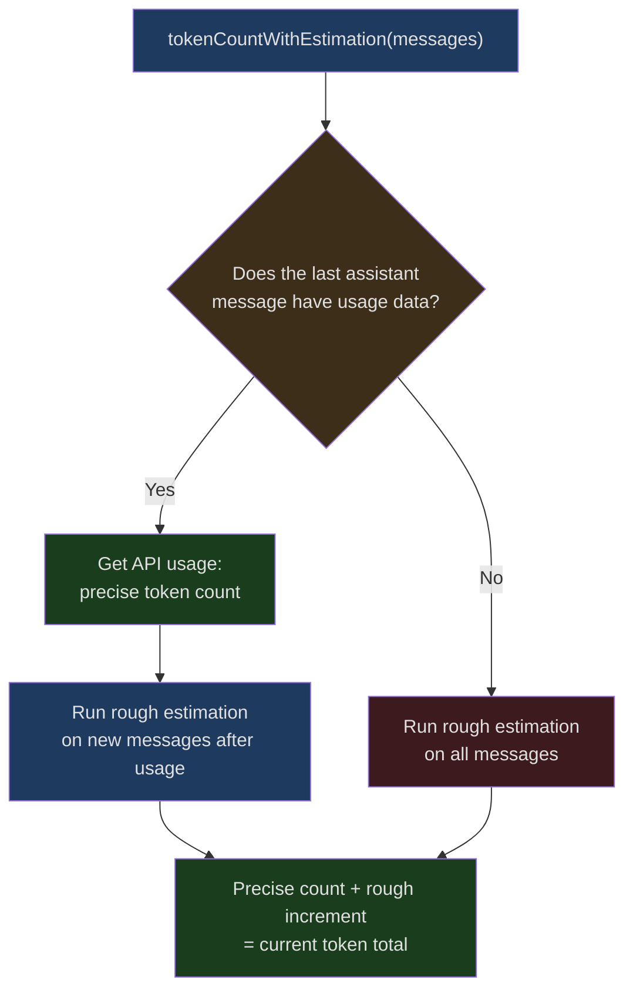
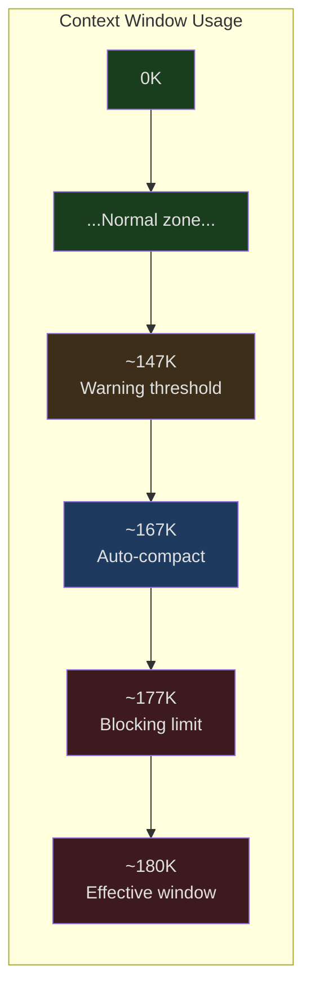
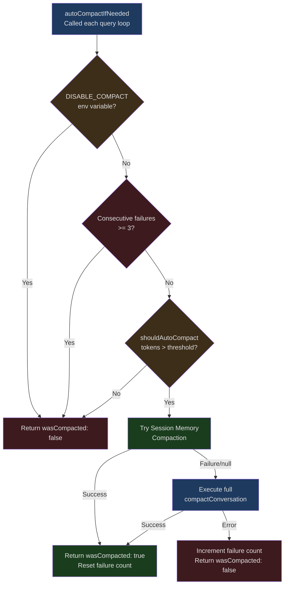
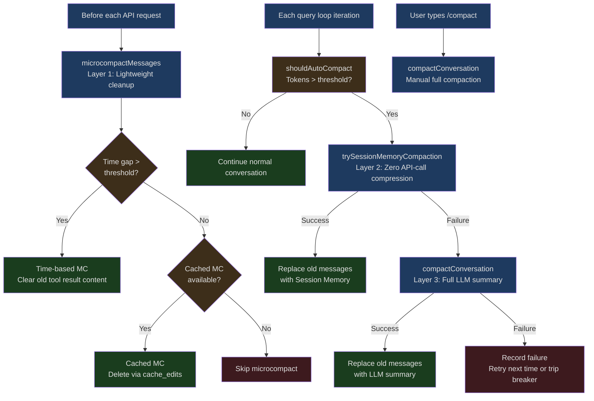

## The Problem

A typical Claude Code coding session can last hours. A user asks to refactor a module, and Claude reads 20 files, executes 30 shell commands, and makes 15 file edits — these interactions generate hundreds of thousands of tokens of conversation history. Even though Claude's context window has reached 200K tokens, in intensive coding sessions, the window can fill up within 30-60 minutes.

The core tension is this: **don't compress, and history exceeds the window making continuation impossible; compress, and you risk losing critical information** — like a bug fix the user explicitly corrected, the precise signature of a function, or an instruction like "always use this style going forward."

Claude Code's solution isn't a single compression algorithm but a multi-layered, multi-strategy context management system. From lightweight tool result cleanup (microcompact), to session memory-based fast compression (session memory compact), to full LLM-driven summary compression (full compact), each layer kicks in at different pressure levels, maintaining conversation sustainability with minimal information loss.

This article dives into the implementation under the `services/compact/` directory, analyzing the engineering design of this system layer by layer.

## Token Estimation: The Foundation of Everything

Before deciding "when to compress," we first need to answer a seemingly simple question: **how many tokens has the current conversation consumed?**

### Rough Estimation vs. Precise API Counting

Claude Code uses two token counting strategies:

1. **Rough estimation**: Based on character length divided by a bytes-per-token ratio
2. **Precise API counting**: Calling Anthropic's `countTokens` API

The core function for rough estimation is in `src/services/tokenEstimation.ts`, lines 203-208:

```typescript
// src/services/tokenEstimation.ts:203-208
export function roughTokenCountEstimation(
  content: string,
  bytesPerToken: number = 4,
): number {
  return Math.round(content.length / bytesPerToken)
}
```

The default ratio is 4 bytes per token. But for different file types, this ratio needs adjustment — JSON files contain many single-character tokens (`{`, `}`, `:`, `,`, `"`), so the actual ratio is closer to 2:

```typescript
// src/services/tokenEstimation.ts:215-224
export function bytesPerTokenForFileType(fileExtension: string): number {
  switch (fileExtension) {
    case 'json':
    case 'jsonl':
    case 'jsonc':
      return 2
    default:
      return 4
  }
}
```

### Message-Level Token Estimation

For complete message arrays, estimation needs to handle multiple content block types. The `estimateMessageTokens` function in `microCompact.ts` (lines 164-205) shows this complexity:

```typescript
// src/services/compact/microCompact.ts:164-205
export function estimateMessageTokens(messages: Message[]): number {
  let totalTokens = 0

  for (const message of messages) {
    if (message.type !== 'user' && message.type !== 'assistant') {
      continue
    }

    if (!Array.isArray(message.message.content)) {
      continue
    }

    for (const block of message.message.content) {
      if (block.type === 'text') {
        totalTokens += roughTokenCountEstimation(block.text)
      } else if (block.type === 'tool_result') {
        totalTokens += calculateToolResultTokens(block)
      } else if (block.type === 'image' || block.type === 'document') {
        totalTokens += IMAGE_MAX_TOKEN_SIZE  // Fixed at 2000
      } else if (block.type === 'thinking') {
        totalTokens += roughTokenCountEstimation(block.thinking)
      } else if (block.type === 'tool_use') {
        totalTokens += roughTokenCountEstimation(
          block.name + jsonStringify(block.input ?? {}),
        )
      }
      // ...other types
    }
  }

  // Multiply by 4/3 as a conservative safety margin
  return Math.ceil(totalTokens * (4 / 3))
}
```

Note the final `4/3` safety factor — since rough estimation inherently underestimates, multiplying by 1.33 avoids the "thought there was still room but actually overflowed" problem caused by underestimation.

### Hybrid Strategy: tokenCountWithEstimation

The function actually used for auto-compaction decisions is `tokenCountWithEstimation` (`src/utils/tokens.ts`, line 226), which combines both strategies:

1. Get the precise token count from the last assistant message that has API usage data
2. Use rough estimation for new messages after that point
3. Add the two together for the current total

This design cleverly avoids two extremes: pure API counting is too slow (requires a network request each time), and pure rough estimation is too inaccurate. By using usage data already present in API responses as an anchor and only doing rough estimation on the incremental portion, it achieves a balance between accuracy and performance.



## Context Pressure Detection: A Multi-Level Threshold System

Once we know "how many tokens have been used," the next question is: **when should compression begin?**

Claude Code defines a sophisticated multi-level threshold system, implemented in `autoCompact.ts`.

### Effective Context Window

First, not all window space is available for conversation. The system needs to reserve space for output:

```typescript
// src/services/compact/autoCompact.ts:30-49
// Based on p99.99 compact summary output of 17,387 tokens
const MAX_OUTPUT_TOKENS_FOR_SUMMARY = 20_000

export function getEffectiveContextWindowSize(model: string): number {
  const reservedTokensForSummary = Math.min(
    getMaxOutputTokensForModel(model),
    MAX_OUTPUT_TOKENS_FOR_SUMMARY,
  )
  let contextWindow = getContextWindowForModel(model, getSdkBetas())

  // Support overriding window size via environment variable (for testing)
  const autoCompactWindow = process.env.CLAUDE_CODE_AUTO_COMPACT_WINDOW
  if (autoCompactWindow) {
    const parsed = parseInt(autoCompactWindow, 10)
    if (!isNaN(parsed) && parsed > 0) {
      contextWindow = Math.min(contextWindow, parsed)
    }
  }

  return contextWindow - reservedTokensForSummary
}
```

For a 200K context window, the effective space is approximately 180K.

### Four Threshold Levels

The `calculateTokenWarningState` function (lines 93-145) defines four pressure levels:

```typescript
// src/services/compact/autoCompact.ts:62-65
export const AUTOCOMPACT_BUFFER_TOKENS = 13_000
export const WARNING_THRESHOLD_BUFFER_TOKENS = 20_000
export const ERROR_THRESHOLD_BUFFER_TOKENS = 20_000
export const MANUAL_COMPACT_BUFFER_TOKENS = 3_000
```

Here's a concrete example (assuming an effective window of 180K tokens):

| Threshold Level | Calculation | Approximate Token Value | Triggered Behavior |
|----------------|-------------|------------------------|-------------------|
| Auto-compact | Effective window - 13,000 | ~167K | Triggers the auto-compact process |
| Warning threshold | Threshold - 20,000 | ~147K | UI displays yellow warning |
| Error threshold | Threshold - 20,000 | ~147K | UI displays red warning |
| Blocking limit | Effective window - 3,000 | ~177K | Blocks sending new messages, forces compaction |



### Circuit Breaker

A key engineering detail: auto-compaction doesn't retry indefinitely. Lines 68-70 of `autoCompact.ts` define the circuit breaker:

```typescript
// src/services/compact/autoCompact.ts:68-70
// BQ 2026-03-10: 1,279 sessions had 50+ consecutive failures (up to 3,272)
// in a single session, wasting ~250K API calls/day globally.
const MAX_CONSECUTIVE_AUTOCOMPACT_FAILURES = 3
```

This comment reveals a real production incident: before the circuit breaker was introduced, 1,279 sessions experienced 50 or more consecutive compaction failures (up to 3,272!), wasting approximately 250,000 API calls per day. Now, retries stop after 3 consecutive failures:

```typescript
// src/services/compact/autoCompact.ts:257-265
if (
  tracking?.consecutiveFailures !== undefined &&
  tracking.consecutiveFailures >= MAX_CONSECUTIVE_AUTOCOMPACT_FAILURES
) {
  return { wasCompacted: false }
}
```

## The /compact Command and Reactive Compaction: Active vs. Passive

Claude Code's context compression has two trigger modes:

### Active Mode: User-Initiated

The user types `/compact` in the conversation, optionally with custom compression instructions (e.g., `/compact focus on preserving test-related code changes`). When triggered manually, `compactConversation` is called directly with `isAutoCompact` set to `false`.

### Passive Mode: Automatic Triggering

The `shouldAutoCompact` function (lines 160-239) serves as the gatekeeper for auto-compaction. It has multiple short-circuit conditions to prevent triggering in inappropriate scenarios:

```typescript
// src/services/compact/autoCompact.ts:160-239 (simplified)
export async function shouldAutoCompact(
  messages: Message[],
  model: string,
  querySource?: QuerySource,
  snipTokensFreed = 0,
): Promise<boolean> {
  // 1. Recursion guard: compact and session_memory sub-agents don't trigger
  if (querySource === 'session_memory' || querySource === 'compact') {
    return false
  }

  // 2. Global toggle check
  if (!isAutoCompactEnabled()) {
    return false
  }

  // 3. Token calculation and threshold comparison
  const tokenCount = tokenCountWithEstimation(messages) - snipTokensFreed
  const threshold = getAutoCompactThreshold(model)

  const { isAboveAutoCompactThreshold } = calculateTokenWarningState(
    tokenCount, model,
  )

  return isAboveAutoCompactThreshold
}
```

The first short-circuit condition deserves special attention: `querySource === 'compact'` prevents self-recursion during compaction. Since compaction is executed via a forked agent (sending the entire conversation as context to Claude to generate a summary), without this guard, the forked agent's own context could trigger compaction, leading to infinite recursion.

### The Complete Auto-Compaction Flow

`autoCompactIfNeeded` is the function called on every query loop iteration. Its execution logic is layered:



Note the priority: **Session Memory Compaction takes precedence over full LLM Compaction**. This is because Session Memory Compaction doesn't require additional API calls, making it faster and cheaper.

## Compression Strategies in Detail

### Layer 1: Microcompact — Lightweight Tool Result Cleanup

Microcompact is the lightest compression strategy. It doesn't call any LLM; instead, it directly cleans up old tool call results in the conversation. The core idea: results from tools like `FileRead`, `Bash`, and `Grep` are often large (a file might be thousands of tokens), but as the conversation progresses, the informational value of these results diminishes.

#### Compactable Tool Types

Lines 41-50 of `microCompact.ts` define which tools' results can be cleaned up:

```typescript
// src/services/compact/microCompact.ts:41-50
const COMPACTABLE_TOOLS = new Set<string>([
  FILE_READ_TOOL_NAME,
  ...SHELL_TOOL_NAMES,
  GREP_TOOL_NAME,
  GLOB_TOOL_NAME,
  WEB_SEARCH_TOOL_NAME,
  WEB_FETCH_TOOL_NAME,
  FILE_EDIT_TOOL_NAME,
  FILE_WRITE_TOOL_NAME,
])
```

Note the selection of this set: it only includes "read-type" and "output-heavy" tools. Tools like `TodoRead` and `ToolSearch`, which produce smaller, information-dense output, are excluded.

#### Two Microcompact Paths

Claude Code actually has two microcompact implementations:

**1. Time-based Microcompact (Time-based MC)**

When a user steps away for a while and returns to continue the conversation, the server-side prompt cache has already expired, and the entire prompt prefix must be rewritten. At this point, cleaning up old tool results is "free" — since the cache needs to be rebuilt anyway, it's an opportunity to slim things down.

The `evaluateTimeBasedTrigger` function (lines 422-444) detects the time gap:

```typescript
// src/services/compact/microCompact.ts:438-443
const gapMinutes =
  (Date.now() - new Date(lastAssistant.timestamp).getTime()) / 60_000
if (!Number.isFinite(gapMinutes) || gapMinutes < config.gapThresholdMinutes) {
  return null
}
return { gapMinutes, config }
```

When the gap exceeds the threshold, it retains the most recent N tool results and replaces the rest with `[Old tool result content cleared]`:

```typescript
// src/services/compact/microCompact.ts:476-483
if (
  block.type === 'tool_result' &&
  clearSet.has(block.tool_use_id) &&
  block.content !== TIME_BASED_MC_CLEARED_MESSAGE
) {
  tokensSaved += calculateToolResultTokens(block)
  touched = true
  return { ...block, content: TIME_BASED_MC_CLEARED_MESSAGE }
}
```

**2. Cache Edit-based Microcompact (Cached MC)**

This is the more sophisticated path. Instead of modifying local message content, it uses the API's `cache_edits` mechanism to tell the server "please remove these tool results from the cache." This reduces the actual number of tokens sent while keeping the prompt cache valid.

```typescript
// src/services/compact/microCompact.ts:369-371
// Return messages unchanged - cache_reference and cache_edits
// are added at API layer
```

The selection logic between these two paths: when the time gap is large (cache is cold), use time-based MC to directly modify content; when the gap is small (cache is still warm), use cached MC to delete via the API layer.

#### Microcompact Entry Function

`microcompactMessages` (lines 253-293) is the unified entry point:

```typescript
// src/services/compact/microCompact.ts:253-293 (simplified)
export async function microcompactMessages(
  messages: Message[],
  toolUseContext?: ToolUseContext,
  querySource?: QuerySource,
): Promise<MicrocompactResult> {
  // 1. Try time-triggered cleanup first (short-circuit)
  const timeBasedResult = maybeTimeBasedMicrocompact(messages, querySource)
  if (timeBasedResult) {
    return timeBasedResult
  }

  // 2. Then try the cache edit path
  if (feature('CACHED_MICROCOMPACT')) {
    // ...condition checks...
    return await cachedMicrocompactPath(messages, querySource)
  }

  // 3. Neither applies, return unchanged
  return { messages }
}
```

### Layer 2: Session Memory Compaction — Zero API-Call Compression

Session Memory Compaction is an ingenious optimization. Claude Code continuously maintains a "session memory" in the background, recording key information from the conversation — user preferences, technical decisions, error fixes, and so on. When compression is needed, this existing memory can be used directly as a summary, without calling an LLM to generate one.

#### How It Works

`trySessionMemoryCompaction` in `sessionMemoryCompact.ts` (lines 514-630) is the core:

```typescript
// src/services/compact/sessionMemoryCompact.ts:514-530 (simplified)
export async function trySessionMemoryCompaction(
  messages: Message[],
  agentId?: AgentId,
  autoCompactThreshold?: number,
): Promise<CompactionResult | null> {
  if (!shouldUseSessionMemoryCompaction()) {
    return null
  }

  // Wait for any in-progress session memory extraction to complete
  await waitForSessionMemoryExtraction()

  const lastSummarizedMessageId = getLastSummarizedMessageId()
  const sessionMemory = await getSessionMemoryContent()

  // No session memory, or memory is an empty template — fall back to traditional compaction
  if (!sessionMemory || await isSessionMemoryEmpty(sessionMemory)) {
    return null
  }
  // ...
}
```

#### Message Retention Strategy

A key design: Session Memory Compaction doesn't discard all old messages but intelligently retains a portion of recent messages. `calculateMessagesToKeepIndex` (lines 324-397) implements this logic:

```typescript
// src/services/compact/sessionMemoryCompact.ts:57-61
export const DEFAULT_SM_COMPACT_CONFIG: SessionMemoryCompactConfig = {
  minTokens: 10_000,        // Keep at least 10K tokens of messages
  minTextBlockMessages: 5,   // Keep at least 5 messages with text content
  maxTokens: 40_000,         // Keep at most 40K tokens
}
```

The retention strategy starts from `lastSummarizedMessageId` (which message was last summarized) and expands forward until the minimum retention conditions are met (at least 10K tokens or 5 text messages), but doesn't exceed the 40K token upper limit.

#### Tool Pair Integrity Protection

There's a subtle but critical engineering detail when retaining messages: the pairing relationship between `tool_use` and `tool_result` must not be broken. `adjustIndexToPreserveAPIInvariants` (lines 232-314) handles this.

Consider this scenario:

```
Index N:   assistant, message.id: X, content: [thinking]
Index N+1: assistant, message.id: X, content: [tool_use: ORPHAN_ID]
Index N+2: assistant, message.id: X, content: [tool_use: VALID_ID]
Index N+3: user, content: [tool_result: ORPHAN_ID, tool_result: VALID_ID]
```

If `startIndex = N+2`, we've kept `tool_use: VALID_ID` and both `tool_result` entries, but the `tool_use` for `ORPHAN_ID` was discarded, and the API would error due to the orphaned `tool_result`. `adjustIndexToPreserveAPIInvariants` detects this situation and automatically adjusts `startIndex` to `N+1` to include the matching `tool_use`.

### Layer 3: Full Compact — LLM-Driven Comprehensive Summarization

When microcompact and session memory compaction are insufficient (or simply unavailable), the system uses full LLM compression: the entire conversation history is sent to Claude to generate a structured summary.

#### Compression Prompt Design

`BASE_COMPACT_PROMPT` in `prompt.ts` (lines 61-143) defines the structural requirements for the summary. This prompt requests a summary containing 9 sections:

1. **Primary Request and Intent** - The user's explicit requests and intentions
2. **Key Technical Concepts** - Key technical concepts
3. **Files and Code Sections** - Files and code snippets
4. **Errors and fixes** - Errors encountered and how they were fixed
5. **Problem Solving** - The problem-solving process
6. **All user messages** - All user messages (non-tool-results)
7. **Pending Tasks** - Tasks yet to be completed
8. **Current Work** - Work currently in progress
9. **Optional Next Step** - Optional next step

Section 6 ("list all non-tool-result user messages") is particularly noteworthy. Its purpose is to ensure that user feedback and course corrections are not lost during compression — these are often the most critical pieces of information.

#### Two-Phase Generation: Analysis/Summary

The prompt uses a clever two-phase structure: first, the model organizes its thoughts in an `<analysis>` tag, then outputs the final summary in a `<summary>` tag. `formatCompactSummary` (lines 311-335) strips the analysis portion, keeping only the summary:

```typescript
// src/services/compact/prompt.ts:311-335
export function formatCompactSummary(summary: string): string {
  let formattedSummary = summary

  // Strip the analysis section — it's a draft for improving summary quality,
  // and has no informational value once the summary is written
  formattedSummary = formattedSummary.replace(
    /<analysis>[\s\S]*?<\/analysis>/,
    '',
  )

  // Extract and format the summary section
  const summaryMatch = formattedSummary.match(/<summary>([\s\S]*?)<\/summary>/)
  if (summaryMatch) {
    const content = summaryMatch[1] || ''
    formattedSummary = formattedSummary.replace(
      /<summary>[\s\S]*?<\/summary>/,
      `Summary:\n${content.trim()}`,
    )
  }

  return formattedSummary.trim()
}
```

This design leverages a characteristic of LLMs: "thinking" before "outputting" typically produces higher-quality results, but the thinking process itself doesn't need to be retained in the final context.

#### Multi-Layered Protection Against Tool Calls

The compression request is sent to a forked agent that needs to produce a plain-text summary rather than calling tools. `NO_TOOLS_PREAMBLE` in `prompt.ts` (lines 19-26) shows the strict instructions for preventing the model from calling tools:

```typescript
// src/services/compact/prompt.ts:19-26
const NO_TOOLS_PREAMBLE = `CRITICAL: Respond with TEXT ONLY. Do NOT call any tools.

- Do NOT use Read, Bash, Grep, Glob, Edit, Write, or ANY other tool.
- You already have all the context you need in the conversation above.
- Tool calls will be REJECTED and will waste your only turn — you will fail the task.
- Your entire response must be plain text: an <analysis> block followed by a <summary> block.

`
```

And at the end of the prompt, `NO_TOOLS_TRAILER` reinforces the point:

```typescript
// src/services/compact/prompt.ts:269-272
const NO_TOOLS_TRAILER =
  '\n\nREMINDER: Do NOT call any tools. Respond with plain text only — ' +
  'an <analysis> block followed by a <summary> block. ' +
  'Tool calls will be rejected and you will fail the task.'
```

Comments (lines 16-17) explain why such forcefulness is needed: on Sonnet 4.6+ adaptive-thinking models, relying solely on `maxTurns: 1` isn't sufficient — the model has a 2.79% chance of attempting tool calls (compared to 0.01% on version 4.5), and a rejected tool call means no text output, causing the entire compaction to fail.

#### Partial Compact

Beyond full compaction, Claude Code also supports partial compaction — users can select a message as a split point and compress only the portion before or after it. `partialCompactConversation` (starting at line 772 of `compact.ts`) implements two directions:

- **`from`**: Compresses the portion after the selected message, preserving what came before. Prompt cache can remain valid.
- **`up_to`**: Compresses the portion before the selected message, preserving what comes after. Prompt cache will be invalidated (because the prefix changed).

#### Prompt-Too-Long Retry

The compression request itself can also fail due to excessive context length (this seems paradoxical but is entirely possible — the conversation is so long that even the request to the compression agent exceeds limits). `truncateHeadForPTLRetry` (lines 243-291) handles this situation:

```typescript
// src/services/compact/compact.ts:243-291 (simplified)
export function truncateHeadForPTLRetry(
  messages: Message[],
  ptlResponse: AssistantMessage,
): Message[] | null {
  const groups = groupMessagesByApiRound(input)
  if (groups.length < 2) return null

  // Calculate how many groups to drop based on the API-returned token gap
  const tokenGap = getPromptTooLongTokenGap(ptlResponse)
  let dropCount: number
  if (tokenGap !== undefined) {
    // Precise dropping: calculate based on token gap
    let acc = 0
    dropCount = 0
    for (const g of groups) {
      acc += roughTokenCountEstimationForMessages(g)
      dropCount++
      if (acc >= tokenGap) break
    }
  } else {
    // Conservative dropping: drop 20% of groups
    dropCount = Math.max(1, Math.floor(groups.length * 0.2))
  }

  // Keep at least one group to generate a summary from
  dropCount = Math.min(dropCount, groups.length - 1)
  // ...
}
```

It retries up to 3 times (`MAX_PTL_RETRIES = 3`), dropping the earliest portions of the conversation each time. This is lossy, but at least it lets the user keep working.

## File Cache and Deduplication: readFileState

After compaction, Claude Code needs to restore context for key files. `readFileState` is an LRU cache that records file contents and timestamps read during the conversation.

### FileStateCache Design

`src/utils/fileStateCache.ts` implements an LRU cache with path normalization:

```typescript
// src/utils/fileStateCache.ts:30-43
export class FileStateCache {
  private cache: LRUCache<string, FileState>

  constructor(maxEntries: number, maxSizeBytes: number) {
    this.cache = new LRUCache<string, FileState>({
      max: maxEntries,
      maxSize: maxSizeBytes,
      sizeCalculation: value => Math.max(1, Buffer.byteLength(value.content)),
    })
  }

  get(key: string): FileState | undefined {
    return this.cache.get(normalize(key))
  }
  // ...
}
```

Key design decisions:

1. **Dual limits**: A maximum of 100 entries and a total size cap of 25MB. `sizeCalculation` uses file content byte length as the basis, preventing a single huge file from blowing up the cache.
2. **Path normalization**: All `get`/`set`/`has`/`delete` operations process paths through `normalize(key)`, ensuring `/foo/../bar` and `/bar` hit the same cache entry.
3. **Partial view marking**: The `isPartialView` field marks entries that were auto-injected (e.g., CLAUDE.md) but have incomplete content — HTML comments stripped, frontmatter removed, MEMORY.md truncated. When the Edit/Write tools see this flag, they require an explicit Read first.

### Post-Compaction File Restoration

`compactConversation` saves a file state snapshot before compaction and selectively restores the most important files afterward:

```typescript
// src/services/compact/compact.ts:517-521
// Save current file state before compaction
const preCompactReadFileState = cacheToObject(context.readFileState)

// Clear the cache
context.readFileState.clear()
context.loadedNestedMemoryPaths?.clear()
```

Restoration is budget-limited (lines 122-130 of `compact.ts`):

```typescript
// src/services/compact/compact.ts:122-130
export const POST_COMPACT_MAX_FILES_TO_RESTORE = 5
export const POST_COMPACT_TOKEN_BUDGET = 50_000
export const POST_COMPACT_MAX_TOKENS_PER_FILE = 5_000
export const POST_COMPACT_MAX_TOKENS_PER_SKILL = 5_000
export const POST_COMPACT_SKILLS_TOKEN_BUDGET = 25_000
```

At most 5 files are restored, with a total budget of 50K tokens, and no single file exceeding 5K tokens. This design ensures that file restoration doesn't cause the post-compaction context to bloat again.

### FILE_UNCHANGED_STUB: Deduplication Optimization

When the model re-reads a file after compaction that was previously read and hasn't changed, `FileReadTool` doesn't return the full content but instead returns a placeholder `FILE_UNCHANGED_STUB`. This avoids duplicate large file contents appearing in the context.

## System Prompt Token Budget

The system prompt is sent with every API request, and the tokens it consumes directly impact the space available for conversation. Claude Code controls this overhead through careful budget management.

The space reserved for output during compaction (lines 29-30 of `autoCompact.ts`) is based on real data:

```typescript
// src/services/compact/autoCompact.ts:29-30
// Based on p99.99 compact summary output of 17,387 tokens
const MAX_OUTPUT_TOKENS_FOR_SUMMARY = 20_000
```

p99.99 means that in 99.99% of cases, the compact summary output doesn't exceed 17,387 tokens. Reserving 20,000 tokens provides additional safety margin.

The post-compaction summary format also considers token efficiency. The summary message generated by `getCompactUserSummaryMessage` (lines 337-374 of `prompt.ts`) includes:

1. The formatted summary body
2. The transcript file path (users can read the full history when needed)
3. A flag indicating whether recent messages were preserved
4. Continuation instructions (in auto-compact, telling the model "don't ask questions, just continue")

```typescript
// src/services/compact/prompt.ts:345-349
let baseSummary = `This session is being continued from a previous conversation
that ran out of context. The summary below covers the earlier portion of the
conversation.

${formattedSummary}`
```

## Post-Compaction Cleanup and State Reset

Compaction isn't as simple as "replacing old messages with a summary." `runPostCompactCleanup` (`postCompactCleanup.ts`) and `compactConversation` itself perform extensive cleanup:

1. **Prompt Cache Break Detection**: Notifies the cache monitoring system that "compaction just happened, subsequent cache misses are normal, don't alert"
2. **Session Metadata Re-appending**: Appends session title, tags, and other metadata to the end of the transcript, ensuring the `--resume` command can correctly display session names
3. **Tool Discovery State Migration**: Saves the list of dynamically discovered tools before compaction via `preCompactDiscoveredTools`, ensuring the model can still use these tools after compaction
4. **Hook Execution**: Sequentially runs `PreCompact` hooks, `SessionStart` hooks, and `PostCompact` hooks
5. **Microcompact State Reset**: Time-triggered microcompact resets cached MC global state, avoiding attempts to edit cache entries that no longer exist

## The Layered Architecture of Compression Strategies

Let's summarize the entire compression system's hierarchy with a complete diagram:



## Tool Use Summaries

During compaction, handling tool calls and results is one of the most complex parts. In a typical Claude Code session, tool calls can account for 70-80% of total tokens — a single `FileRead` might return thousands of lines of code, and a single `Bash` might output massive compilation logs.

### Image and Document Stripping

`stripImagesFromMessages` (lines 145-200 of `compact.ts`) strips all image and document blocks before sending to the compaction agent, replacing them with text markers `[image]` or `[document]`. The reason is practical: images are useless for generating a text summary but could cause the compression request itself to exceed token limits.

```typescript
// src/services/compact/compact.ts:157-161
const newContent = content.flatMap(block => {
  if (block.type === 'image') {
    hasMediaBlock = true
    return [{ type: 'text' as const, text: '[image]' }]
  }
  // ...
})
```

### API Round Grouping

`groupMessagesByApiRound` (`grouping.ts`) groups messages by API round. This is more fine-grained than grouping by "user message" — in SDK/CCR scenarios, the entire workload might consist of a single user message but dozens of API rounds. A group boundary is defined as: when a new assistant `message.id` appears, a new group begins.

This grouping is used in two places:
1. Determining how much history to drop during prompt-too-long retries
2. Progressively reducing context round by round in reactive compaction

### Post-Compaction Context Reconstruction

After compaction, the new message sequence contains:

1. **Compact Boundary Marker** - A system message marking where compaction occurred
2. **Summary Messages** - The formatted summary
3. **Messages to Keep** - Retained recent messages (unique to Session Memory Compact)
4. **File Attachments** - Restored key files
5. **Hook Results** - Output from SessionStart hooks (e.g., CLAUDE.md content)

This ordering is carefully designed: the boundary marker comes first so subsequent loaders can quickly locate the compaction point; the summary follows, providing context for the retained messages; file attachments and hook results come last, providing the latest working environment information.

## Transferable Patterns

Claude Code's context management strategies contain several general-purpose patterns that can be transferred to other LLM applications:

### 1. Hybrid Token Counting

Don't use only API counting (too slow) or only heuristic estimation (too inaccurate). Use usage data already present in API responses as an anchor, and only estimate the incremental portion. This pattern applies to any scenario requiring real-time token budgeting.

### 2. Multi-Level Thresholds + Progressive Compression

Different pressure levels trigger different compression strategies:

- **Low pressure** (microcompact): Clean up old tool outputs with almost zero information loss
- **Medium pressure** (session memory): Leverage existing structured memory with no additional API cost
- **High pressure** (full compact): Call an LLM to generate a comprehensive summary — lossy but thorough

This is far more flexible than a single "compress when the threshold is hit" approach.

### 3. Circuit Breaker Pattern

For automated operations that can fail (not just compaction), set a maximum consecutive failure count to avoid wasting resources on futile retries. Claude Code's 3-failure circuit breaker was calibrated based on production data (250,000 wasted API calls per day).

### 4. Analysis-Output Separation

Have the model analyze in a draft area first, then output the final result. Use XML tags to separate the two phases, keeping only the output portion in the end. This pattern works in any scenario requiring high-quality LLM output.

### 5. Tool Pair Integrity Protection

In any operation involving message pruning, ensure the pairing relationship between `tool_use` and `tool_result` is not broken. This is a hard constraint of the Claude API, but the same principle applies to any LLM application using function calling — every tool_result must have a corresponding tool_use in the context.

### 6. Post-Compaction State Restoration

Compaction isn't just replacing messages. You need to consider:
- Cache invalidation notifications (to avoid false alerts)
- File state restoration (to maintain working context)
- Hook re-execution (to restore environment configuration)
- Metadata migration (to maintain session identity)

### 7. Leveraging Cache Lifecycle

Time-based microcompact leverages an insight: when the prompt cache has already expired due to time, modifying message content costs nothing (it needs to be rewritten anyway). When designing any system involving prompt caching, consider the impact of cache cold/hot state on operation costs.

## Conclusion

Claude Code's context management system is a sophisticated multi-layered engineering effort:

- The **token estimation** layer uses a hybrid strategy to balance accuracy and performance
- The **pressure detection** layer uses four threshold levels for progressive response
- The **microcompact** layer handles tool result bloat at minimal cost
- The **session memory compact** layer leverages existing structured memory to avoid additional API calls
- The **full compact** layer uses carefully designed prompts to ensure high-quality lossy compression
- The **state restoration** layer ensures compaction doesn't break working environment continuity

Every layer's design comes from production experience: p99.99 data-driven buffer sizes, circuit breakers based on real incidents, and model version-specific safeguards. This isn't a theoretically elegant architecture — it's practical engineering forged at the scale of millions of users.

In the next article, we'll explore Claude Code's startup performance optimization — another engineering challenge that's critical at scale.
