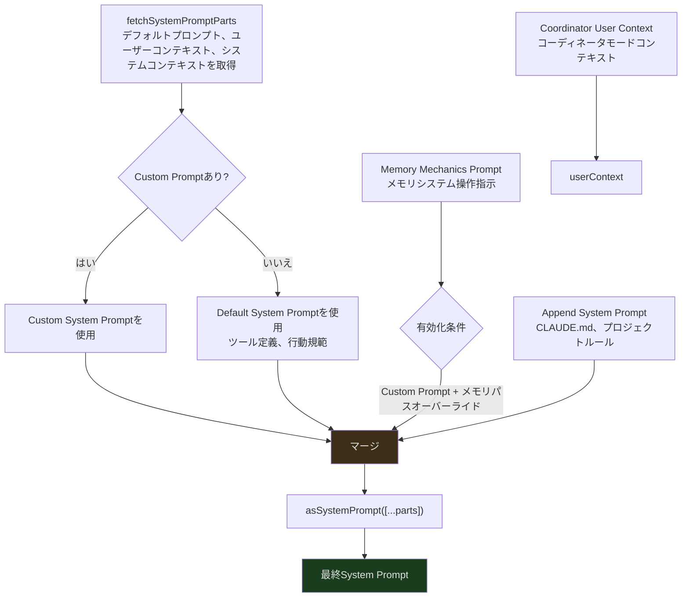
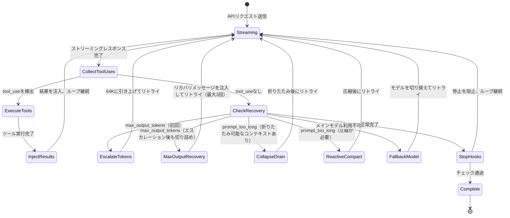
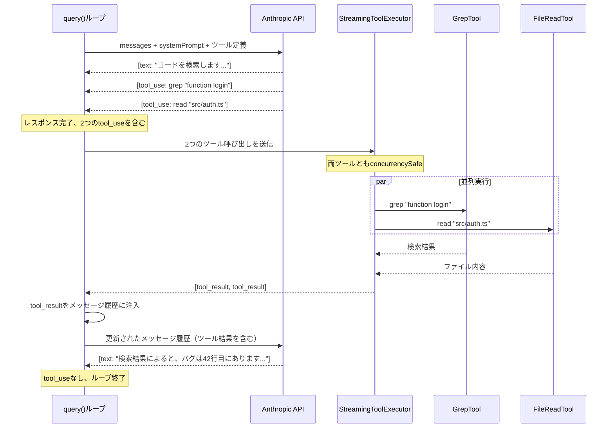
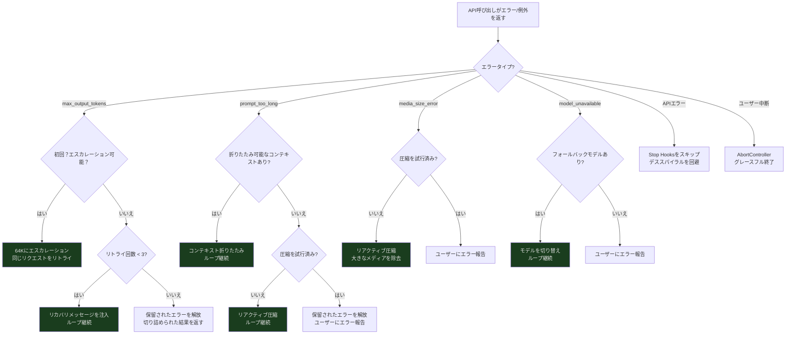
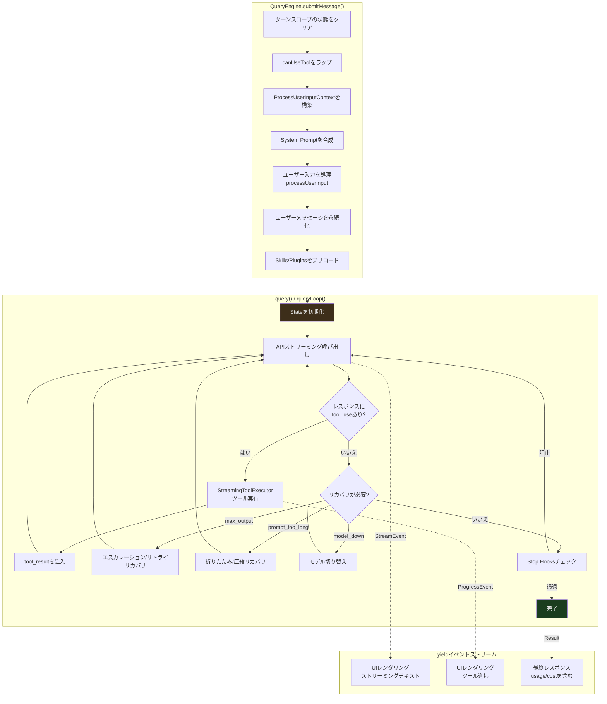

## 概要

前回の全体像の記事では、Claude Codeのアーキテクチャが5層に分けられ、クエリエンジンが最もコアな位置にあることを確認しました。今回は、この層を深く掘り下げていきます。

ターミナルで「このバグを修正して」と入力してから、Claudeがストリーミングで回答を出力し、ツールを実行し、最終的な結果を返すまで、その間に一体何が起きているのでしょうか？答えは2つのファイルにあります：

- **`QueryEngine.ts`（約1,295行）** — セッション管理器。ターン間の状態を維持します
- **`query.ts`（約1,729行）** — ストリーミングクエリループ。非同期ジェネレータ駆動のステートマシンです

本記事では、`submitMessage()` のエントリから `query()` ジェネレータのループ実行、そしてリカバリ戦略の発動まで、一回の対話のライフサイクルを完全に追跡します。これはClaude CodeがLLMとどのように対話するかを理解するための鍵です。

---

## QueryEngine：セッションの状態コンテナ

`QueryEngine` は呼び出しごとに作成されるものではなく、対話セッション全体を通じて存続する長寿命オブジェクトです。その役割はターン間の状態を管理することです：

```typescript
// src/QueryEngine.ts:184-207
export class QueryEngine {
  private config: QueryEngineConfig
  private mutableMessages: Message[]      // ターン間の完全なメッセージ履歴
  private abortController: AbortController // ユーザー中断シグナル
  private permissionDenials: SDKPermissionDenial[] // 権限拒否の記録
  private totalUsage: NonNullableUsage     // 累計トークン使用量
  private hasHandledOrphanedPermission = false
  private readFileState: FileStateCache    // 読み取り済みファイルキャッシュ（重複読み取りの回避）
  private discoveredSkillNames = new Set<string>()
  private loadedNestedMemoryPaths = new Set<string>()

  constructor(config: QueryEngineConfig) {
    this.config = config
    this.mutableMessages = config.initialMessages ?? []
    this.abortController = config.abortController ?? createAbortController()
    this.permissionDenials = []
    this.readFileState = config.readFileCache
    this.totalUsage = EMPTY_USAGE
  }
}
```

いくつかの重要なフィールドに注目しましょう：

- **`mutableMessages`** — 対話全体のメッセージ履歴です。各ターンの新しいメッセージはここに追加され、ツール実行の結果もここに注入されます。この配列は「ミュータブル」です。Claude Codeが全体的にイミュータブルデータを好む設計の中で、これは意図的な例外です。メッセージ履歴は高頻度で更新が必要で、追加操作は並行性の問題を引き起こさないためです。
- **`readFileState`** — ファイル読み取りキャッシュです。AIが `FileReadTool` でファイルを読み取ると、その内容がここにキャッシュされます。AIが後でそのファイルを再度参照する場合、エンジンは完全な内容をAPIに再送信することを避け、トークンを節約できます。
- **`permissionDenials`** — ユーザーがツールの実行権限を拒否した場合、その拒否がここに記録され、後続のSDKレポートに使用されます。
- **`discoveredSkillNames`** — 現在のターンで発見されたスキル名を追跡します。各ターンの開始時にクリアされ、長いセッションでの無限増加を防ぎます。
- **`loadedNestedMemoryPaths`** — 読み込み済みのネストされたメモリパスを記録し、重複読み込みを防ぎます。

### QueryEngineConfig：エンジンの設定コントラクト

`submitMessage()` に踏み込む前に、`QueryEngineConfig` を理解する必要があります。これは `QueryEngine` 作成時に提供する必要があるすべてを定義しています：

```typescript
// src/QueryEngine.ts:130-173（主要フィールド）
export type QueryEngineConfig = {
  cwd: string                    // 作業ディレクトリ
  tools: Tools                   // 利用可能なツールリスト
  commands: Command[]            // スラッシュコマンドリスト
  mcpClients: MCPServerConnection[] // MCPクライアント接続
  agents: AgentDefinition[]      // エージェント定義
  canUseTool: CanUseToolFn       // ツール権限チェック関数
  getAppState: () => AppState    // アプリケーション状態の取得
  setAppState: (f: (prev: AppState) => AppState) => void
  initialMessages?: Message[]    // 初期メッセージ履歴（セッション復元時に使用）
  readFileCache: FileStateCache  // ファイル状態キャッシュ
  customSystemPrompt?: string    // カスタムシステムプロンプト
  appendSystemPrompt?: string    // 追加システムプロンプト
  userSpecifiedModel?: string    // ユーザー指定モデル
  fallbackModel?: string         // フォールバックモデル
  thinkingConfig?: ThinkingConfig // 思考モード設定
  maxTurns?: number              // 最大ターン数制限
  maxBudgetUsd?: number          // 予算制限（米ドル）
  taskBudget?: { total: number } // タスク予算
  jsonSchema?: Record<string, unknown> // 構造化出力スキーマ
  verbose?: boolean
  replayUserMessages?: boolean
  handleElicitation?: ToolUseContext['handleElicitation']
  snipReplay?: (            // Snip境界ハンドラ
    yieldedSystemMsg: Message,
    store: Message[],
  ) => { messages: Message[]; executed: boolean } | undefined
}
```

この設定オブジェクトは重要な設計決定を体現しています：**すべての外部依存を作成時に一括注入する**ということです。`QueryEngine` は自らツールリストやMCPクライアントを取得しません。すべて呼び出し側が提供します。これにより、エンジンは異なる使用シナリオ（SDKモード、REPLモード、テストモード）で柔軟に設定できます。

---

### submitMessage()：各ターンのエントリポイント

ユーザーが新しいメッセージを入力するたびに `submitMessage()` が呼び出されます。これは**非同期ジェネレータ**（`async *`）であり、単一の結果を返すのではなく、段階的にストリーミングイベントをyieldします：

```typescript
// src/QueryEngine.ts:209-212
async *submitMessage(
  prompt: string | ContentBlockParam[],
  options?: { uuid?: string; isMeta?: boolean }
): AsyncGenerator<SDKMessage, void, unknown>
```

`submitMessage()` の実行はいくつかの明確なフェーズに分かれています。順を追って追跡していきましょう。

#### フェーズ1：ターンレベルの初期化

```typescript
// src/QueryEngine.ts:238-241
this.discoveredSkillNames.clear()  // 前のターンで発見されたスキルをクリア
setCwd(cwd)                        // 作業ディレクトリを設定
const persistSession = !isSessionPersistenceDisabled()
const startTime = Date.now()
```

各ターンの開始時に、エンジンはまずクリーンアップを行います。`discoveredSkillNames.clear()` により、スキル発見はターンスコープになります。長時間実行されるセッションで、スキル名のコレクションが無限に増加してメモリを浪費することを防ぎます。

#### フェーズ2：権限追跡ラッパー

```typescript
// src/QueryEngine.ts:244-271（簡略化）
const wrappedCanUseTool: CanUseToolFn = async (tool, input, ...) => {
  const result = await canUseTool(tool, input, ...)

  // 拒否を追跡し、SDKレポートに使用
  if (result.behavior !== 'allow') {
    this.permissionDenials.push({
      tool_name: sdkCompatToolName(tool.name),
      tool_use_id: toolUseID,
      tool_input: input,
    })
  }

  return result
}
```

エンジンは設定の `canUseTool` 関数を直接使用するのではなく、ラッパーを被せています。このラッパーは権限判断のロジックを変えることなく、拒否されたすべてのツール呼び出しを記録します。これらの記録は最終的にSDKの返却する `result` メッセージに含まれ、呼び出し側にどの操作がユーザーによって拒否されたかを知らせます。

#### フェーズ3：ProcessUserInputContextの構築

これは `submitMessage()` の最大のステップです。現在のターンに必要なすべてを含む大規模な設定オブジェクトを構築します：

```typescript
// src/QueryEngine.ts:335-395（主要フィールド）
let processUserInputContext: ProcessUserInputContext = {
  messages: this.mutableMessages,
  setMessages: fn => {
    this.mutableMessages = fn(this.mutableMessages)
  },
  onChangeAPIKey: () => {},
  handleElicitation: this.config.handleElicitation,
  options: {
    commands,
    tools,
    verbose,
    mainLoopModel: initialMainLoopModel,
    thinkingConfig: initialThinkingConfig,
    mcpClients,
    isNonInteractiveSession: true,
    customSystemPrompt,
    appendSystemPrompt,
    agentDefinitions: { activeAgents: agents, allAgents: [] },
    maxBudgetUsd,
  },
  getAppState,
  setAppState,
  abortController: this.abortController,
  readFileState: this.readFileState,
  nestedMemoryAttachmentTriggers: new Set<string>(),
  loadedNestedMemoryPaths: this.loadedNestedMemoryPaths,
  dynamicSkillDirTriggers: new Set<string>(),
  discoveredSkillNames: this.discoveredSkillNames,
  // ...その他のフィールド
}
```

`ProcessUserInputContext` はクエリエンジンと `query()` ジェネレータ間の「コントラクト」です。`query()` が使用できるすべての機能と状態を定義しています。`setMessages` の実装に注目してください。クロージャで `this.mutableMessages` の参照をキャプチャすることで、スラッシュコマンド（`/force-snip` など）がメッセージ配列を直接変更できるようになっています。

注目すべき点として、`processUserInputContext` は `submitMessage()` 内で**2回**作成されます。1回目はユーザー入力の処理（スラッシュコマンド、添付ファイルなど）に使用され、2回目はスラッシュコマンドの処理完了後に、更新されたメッセージとモデルを使って再作成されます。これにより、スラッシュコマンドによる状態の変更が後続の `query()` 呼び出しに反映されることが保証されます。

---

## System Promptの多層合成

APIを呼び出す前に、エンジンはSystem Promptを組み立てる必要があります。これは単純な文字列ではなく、複数の層のコンテンツの合成です：



実際のコードがこの合成をどのように実装しているか見てみましょう：

```typescript
// src/QueryEngine.ts:289-325（簡略化）
const {
  defaultSystemPrompt,
  userContext: baseUserContext,
  systemContext,
} = await fetchSystemPromptParts({
  tools,
  mainLoopModel: initialMainLoopModel,
  mcpClients,
  customSystemPrompt: customPrompt,
})

// コーディネータモードのユーザーコンテキストをマージ
const userContext = {
  ...baseUserContext,
  ...getCoordinatorUserContext(mcpClients, scratchpadDir),
}

// メモリメカニクスプロンプトの条件付き読み込み
const memoryMechanicsPrompt =
  customPrompt !== undefined && hasAutoMemPathOverride()
    ? await loadMemoryPrompt()
    : null

// 最終合成
const systemPrompt = asSystemPrompt([
  ...(customPrompt !== undefined ? [customPrompt] : defaultSystemPrompt),
  ...(memoryMechanicsPrompt ? [memoryMechanicsPrompt] : []),
  ...(appendSystemPrompt ? [appendSystemPrompt] : []),
])
```

各層の役割：

1. **Default System Prompt** — 基本的な行動規範。利用可能なツールの定義、安全指示、出力フォーマット要件を含みます。`fetchSystemPromptParts()` によって生成され、ユーザーコンテキストとシステムコンテキストの収集ロジックは `src/context.ts` と `src/utils/queryContext.ts` にあります。
2. **Custom System Prompt** — ユーザーが設定で提供するカスタム指示です。存在する場合、デフォルトプロンプトを**置換**します（追加ではありません）。
3. **Memory Mechanics** — メモリシステムの操作指示（MEMORY.mdの読み書き方法）です。2つの条件が同時に満たされた場合のみ有効になります：カスタムプロンプトの存在 + メモリパスオーバーライド環境変数の設定。
4. **Append System Prompt** — CLAUDE.mdファイルからのプロジェクトレベルのルールです。カスタムプロンプトの有無にかかわらず、**常に末尾に追加**されます。

各層は数千トークンのコンテンツを含む可能性があります。System Prompt自体が大量のコンテキストウィンドウを消費する場合、実際の対話に残るスペースが減少します。これがコンテキスト管理がこれほど重要な理由です。

### User ContextとSystem Context

System Prompt自体に加えて、`fetchSystemPromptParts()` は2つのcontextオブジェクトも返します：

- **`userContext`** — `[key: value]` 形式で各APIリクエストのユーザーメッセージの前に注入されます。作業ディレクトリ、プラットフォーム情報、時刻などの動的コンテキストを含みます。
- **`systemContext`** — 同様の形式でシステムメッセージの末尾に注入されます。インストール済みのMCPサーバーリストなどの静的コンテキストを含みます。

この分離は意図的なものです。`userContext` は各リクエストで変化する可能性がありますが（例えば現在の作業ディレクトリ）、`systemContext` はセッション全体を通じて比較的安定しています。

---

## query()：非同期ジェネレータ駆動のストリーミングステートマシン

`query()` 関数はクエリエンジン全体のコアループです。そのシグネチャがその本質を示しています — 非同期ジェネレータです：

```typescript
// src/query.ts:219-228
export async function* query(params: QueryParams): AsyncGenerator<
  | StreamEvent
  | RequestStartEvent
  | Message
  | TombstoneMessage
  | ToolUseSummaryMessage,
  Terminal
>
```

なぜ非同期ジェネレータなのでしょうか？ストリーミングAI対話は本質的に**多段階で、中断可能で、状態を持つプロセス**だからです：

1. APIにリクエストを送信
2. ストリーミングレスポンスを受信（トークンごとに）
3. ツール呼び出しを検出 -> ストリーミング出力を一時停止 -> ツールを実行 -> 結果を注入 -> リクエストを継続
4. リカバリが必要と検出 -> リカバリ戦略を実行 -> リトライ
5. 最終的に完了

ジェネレータパターンにより、呼び出し側（UI層）はこれらのイベントを段階的に消費でき、各 `yield` ポイントで最新の状態をレンダリングできます。プロセス全体の完了を待つ必要はありません。

### query()の二層構造

`query()` 自体は薄いラッパーに過ぎません。実際の処理を `queryLoop()` に委譲し、正常完了時にコマンドライフサイクルに通知します：

```typescript
// src/query.ts:219-239
export async function* query(params: QueryParams): AsyncGenerator<...> {
  const consumedCommandUuids: string[] = []
  const terminal = yield* queryLoop(params, consumedCommandUuids)
  // 正常完了時のみここに到達
  // throwの場合、エラーはyield*を通じて伝播
  // .return()の場合、両方のジェネレータが閉じられる
  for (const uuid of consumedCommandUuids) {
    notifyCommandLifecycle(uuid, 'completed')
  }
  return terminal
}
```

`yield*` が鍵です。`queryLoop()` のすべてのyield値を `query()` の呼び出し側に直接「透過」し、同時にエラーとキャンセルシグナルも伝播します。このパターンにより、エラー処理とリソースクリーンアップが自然になります。`queryLoop()` が例外をスローすると、例外は直接呼び出し側にバブルアップします。呼び出し側が `.return()` を呼ぶと、両方のジェネレータが正しく閉じられます。

### State：クエリループの内部状態

```typescript
// src/query.ts:204-217
type State = {
  messages: Message[]
  toolUseContext: ToolUseContext
  autoCompactTracking: AutoCompactTrackingState | undefined
  maxOutputTokensRecoveryCount: number   // リトライ済み回数（最大3回）
  hasAttemptedReactiveCompact: boolean   // リアクティブ圧縮を試みたかどうか
  maxOutputTokensOverride: number | undefined
  pendingToolUseSummary: Promise<ToolUseSummaryMessage | null> | undefined
  stopHookActive: boolean | undefined
  turnCount: number                     // 現在のターンカウント
  transition: Continue | undefined       // 前回のループが継続した理由
}
```

この `State` 型はクエリループの挙動を理解する鍵です。いくつかの重要なフィールドを見てみましょう：

- **`maxOutputTokensRecoveryCount`** — APIが `max_output_tokens` エラーを返した場合（AIの出力が切り詰められた場合）、エンジンは自動的にリトライします。このカウンタはリトライ済み回数を追跡し、上限は `MAX_OUTPUT_TOKENS_RECOVERY_LIMIT = 3` で定義されています。
- **`hasAttemptedReactiveCompact`** — コンテキストが上限に近づくと、エンジンは「リアクティブ圧縮」を試みます。履歴メッセージを自動圧縮してスペースを確保します。このフラグにより圧縮は一度だけ試行され、無限ループを防ぎます。
- **`transition`** — 前回のイテレーションがなぜ継続したかを記録します。値は `Continue` 型（例：`{ reason: 'max_output_tokens_recovery', attempt: 2 }`）で、テストではメッセージ内容を検査せずにリカバリパスが発動したかを検証できます。
- **`maxOutputTokensOverride`** — 初めて出力切り詰めに遭遇した際、エンジンはまず出力トークン上限をデフォルトの8Kから64K（`ESCALATED_MAX_TOKENS`）に引き上げてから、マルチターンリカバリを検討します。
- **`autoCompactTracking`** — 自動圧縮の状態を追跡します。トークン使用量の警告閾値の計算を含みます。

### メインループ構造



クエリループのコアは（概念的に）`while(true)` 構造で、各イテレーションでは：

1. **Stream** — 現在のメッセージ履歴をAPIに送信し、ストリーミングレスポンスを受信
2. **Collect** — レスポンスからテキストコンテンツと `tool_use` 呼び出しを収集
3. **Execute** — `tool_use` がある場合、`StreamingToolExecutor` を通じてツールを実行
4. **Inject** — ツール実行結果を `tool_result` メッセージとして履歴に注入
5. **Decide** — ループを継続するか（新しいツール結果があるか、リカバリが必要か）、終了するか（これ以上の操作がないか）を判断

---

## QueryParams：query()の入力コントラクト

ツール呼び出しループに入る前に、`query()` が受け取るパラメータを見てみましょう：

```typescript
// src/query.ts:181-199
export type QueryParams = {
  messages: Message[]
  systemPrompt: SystemPrompt
  userContext: { [k: string]: string }
  systemContext: { [k: string]: string }
  canUseTool: CanUseToolFn
  toolUseContext: ToolUseContext
  fallbackModel?: string
  querySource: QuerySource
  maxOutputTokensOverride?: number
  maxTurns?: number
  skipCacheWrite?: boolean
  taskBudget?: { total: number }
  deps?: QueryDeps
}
```

`deps?: QueryDeps` パラメータに注目してください。これは**依存性注入ポイント**です。本番環境では `productionDeps` を使用し、テストではモック実装に差し替えることができます。`QueryDeps` にはAPI呼び出し、ツール実行などのコア機能の具体的な実装が含まれており、`query()` 自体は外部モジュールに依存せずにテスト可能になっています。

```typescript
// src/query/deps.ts
export type QueryDeps = {
  // API呼び出し、ツール実行などのコア依存
}
export const productionDeps: QueryDeps = { ... }
```

---

## ツール呼び出しループ：AIはどのようにツールを使うのか

APIレスポンスに `tool_use` コンテンツブロックが含まれている場合、クエリループはツール実行フェーズに入ります。これがClaude CodeのAIエージェントとしてのコア機能です。AIはテキストを生成するだけでなく、操作を実行できます。

典型的なツール呼び出しループ：



重要な詳細に注目してください：

- **並列実行**：`GrepTool` と `FileReadTool` はどちらも `isConcurrencySafe() = true` を宣言しているため（読み取り専用操作）、`StreamingToolExecutor` はそれらを並列に実行します
- **結果の注入**：ツール結果は `tool_result` メッセージとしてメッセージ履歴に追加され、履歴全体がAPIに再送信されます
- **ループの継続**：APIはツール結果に基づいて新しいレスポンスを生成し、新しいレスポンスにも `tool_use` が含まれていればループが継続します
- **権限チェック**：ツール実行前に、`wrappedCanUseTool` がユーザーがその操作を承認しているかチェックします。拒否された操作はAIにエラーメッセージを返し、`permissionDenials` に記録されます

### ツール結果のストレージ最適化

各ツールの実行結果は大きくなり得ます（例えば大きなファイルの全内容）。メッセージ履歴に直接保存すると、コンテキストウィンドウが急速に消費されます。Claude Codeは `applyToolResultBudget`（`src/utils/toolResultStorage.ts`）を使用してツール結果に予算制御を適用します。予算を超える結果は切り詰めまたは要約され、単一のツール呼び出しによってメッセージ履歴が肥大化するのを防ぎます。

### 欠落したツール結果の処理

APIレスポンスに `tool_use` が含まれているが実行が中断された場合（例えばユーザーがCtrl+Cを押した場合）、未完了の各ツール呼び出しに対してエラータイプの `tool_result` を生成する必要があります。これはAnthropic APIの要件です。各 `tool_use` には対応する `tool_result` が必要です：

```typescript
// src/query.ts:123-149
function* yieldMissingToolResultBlocks(
  assistantMessages: AssistantMessage[],
  errorMessage: string,
) {
  for (const assistantMessage of assistantMessages) {
    const toolUseBlocks = assistantMessage.message.content.filter(
      content => content.type === 'tool_use',
    ) as ToolUseBlock[]

    for (const toolUse of toolUseBlocks) {
      yield createUserMessage({
        content: [{
          type: 'tool_result',
          content: errorMessage,
          is_error: true,
          tool_use_id: toolUse.id,
        }],
        toolUseResult: errorMessage,
        sourceToolAssistantUUID: assistantMessage.uuid,
      })
    }
  }
}
```

この関数はすべてのアシスタントメッセージ内の `tool_use` ブロックを走査し、各ブロックに対してエラー情報を含む `tool_result` ユーザーメッセージを生成します。

---

## リカバリ戦略：問題が発生した場合

実世界では、API呼び出しが常に成功するとは限りません。ネットワークが中断する可能性があり、コンテキストがオーバーフローする可能性があり、モデルが出力を完了できない可能性があります。`query.ts` は複数のエラータイプに対して自動リカバリ戦略を実装しています。

### エラーの「保留」メカニズム

具体的な戦略に踏み込む前に、重要な設計を理解する必要があります：**エラーメッセージの保留（withholding）**です。

ストリーミングループが `max_output_tokens` または `prompt_too_long` エラーを検出した場合、**エラーメッセージを呼び出し側に即座にyieldしません**。なぜでしょうか？SDK呼び出し側（Claude Desktopなど）は `error` タイプのメッセージを受信すると、即座にセッションを終了する可能性があるからです。エンジンがエラーをyieldした後にリカバリ戦略で正常に継続できたとしても、呼び出し側はもうリスンしていません。リカバリは無意味になります。

そのため、エンジンはエラーメッセージを「保留」し、リカバリを試みます。リカバリが失敗した場合にのみ、エラーメッセージをyieldします。

```typescript
// src/query.ts:175-179
// isWithheldMaxOutputTokens はメッセージが保留されたmax_output_tokensエラーかどうかをチェック
function isWithheldMaxOutputTokens(
  msg: Message | StreamEvent | undefined,
): msg is AssistantMessage {
  return msg?.type === 'assistant' && msg.apiError === 'max_output_tokens'
}
```

### 戦略1：出力トークンのエスカレーション（max_output_tokensの初回リカバリ）

AIの出力が切り詰められた場合、エンジンはまず「ゼロコスト」のリカバリを試みます — 出力トークン上限の引き上げです：

```typescript
// src/query.ts:1188-1221（簡略化）
if (isWithheldMaxOutputTokens(lastMessage)) {
  // 第一段階：64Kにエスカレーション
  if (capEnabled && maxOutputTokensOverride === undefined) {
    logEvent('tengu_max_tokens_escalate', {
      escalatedTo: ESCALATED_MAX_TOKENS,
    })
    const next: State = {
      ...state,
      maxOutputTokensOverride: ESCALATED_MAX_TOKENS,
      transition: { reason: 'max_output_tokens_escalate' },
    }
    state = next
    continue  // より大きな出力上限で同じリクエストをリトライ
  }
```

この戦略の巧妙な点は、**同じリクエストをリトライ**することです。出力トークン上限を引き上げるだけです。リカバリメッセージを注入する必要はなく、メッセージ履歴の長さは増えません。8Kでは足りないが64Kで足りる場合、問題は静かに解決されます。

### 戦略2：マルチターンリカバリ（max_output_tokensの後続リカバリ）

64Kにエスカレーションしても切り詰められる場合、エンジンはマルチターンリカバリモードに入ります。リカバリメッセージを注入し、AIに中断点から続行させます：

```typescript
// src/query.ts:1223-1252
if (maxOutputTokensRecoveryCount < MAX_OUTPUT_TOKENS_RECOVERY_LIMIT) {
  const recoveryMessage = createUserMessage({
    content:
      `Output token limit hit. Resume directly — no apology, ` +
      `no recap of what you were doing. Pick up mid-thought ` +
      `if that is where the cut happened. Break remaining ` +
      `work into smaller pieces.`,
    isMeta: true,
  })

  const next: State = {
    messages: [
      ...messagesForQuery,
      ...assistantMessages,
      recoveryMessage,
    ],
    maxOutputTokensRecoveryCount: maxOutputTokensRecoveryCount + 1,
    transition: {
      reason: 'max_output_tokens_recovery',
      attempt: maxOutputTokensRecoveryCount + 1,
    },
    // ...その他のフィールド
  }
  state = next
  continue
}
```

リカバリメッセージの文言に注目してください：**"Resume directly - no apology, no recap"**。これは慎重に設計されたプロンプトで、AIに謝罪やコンテキストの繰り返しにトークンを浪費せず、中断点から直接続行するよう指示しています。限られた出力トークンの利用率を最大化します。

`MAX_OUTPUT_TOKENS_RECOVERY_LIMIT = 3` であり、最大3回のリトライを意味します。3回後もまだ切り詰められる場合、エラーメッセージが呼び出し側にyieldされます。

### 戦略3：コンテキスト折りたたみとリアクティブ圧縮（prompt_too_long）

メッセージ履歴が長すぎてAPIが `prompt_too_long` エラーを返した場合、エンジンには2段階のリカバリ戦略があります。

**第1段階：コンテキスト折りたたみ（Context Collapse）**

```typescript
// src/query.ts:1089-1117
if (
  feature('CONTEXT_COLLAPSE') &&
  contextCollapse &&
  state.transition?.reason !== 'collapse_drain_retry'
) {
  const drained = contextCollapse.recoverFromOverflow(
    messagesForQuery, querySource,
  )
  if (drained.committed > 0) {
    const next: State = {
      messages: drained.messages,
      transition: { reason: 'collapse_drain_retry', committed: drained.committed },
      // ...
    }
    state = next
    continue
  }
}
```

コンテキスト折りたたみは軽量な圧縮です。すでに「ステージ化」されたコンテキストブロックを折りたたみ、きめ細かい情報を保持します。`state.transition?.reason !== 'collapse_drain_retry'` という条件に注目してください。前回のイテレーションで既に折りたたみを試みたがオーバーフローが解消されていない場合、再度試行せずにリアクティブ圧縮にフォールスルーします。

**第2段階：リアクティブ圧縮（Reactive Compact）**

```typescript
// src/query.ts:1119-1166
if ((isWithheld413 || isWithheldMedia) && reactiveCompact) {
  const compacted = await reactiveCompact.tryReactiveCompact({
    hasAttempted: hasAttemptedReactiveCompact,
    querySource,
    aborted: toolUseContext.abortController.signal.aborted,
    messages: messagesForQuery,
    cacheSafeParams: {
      systemPrompt,
      userContext,
      systemContext,
      toolUseContext,
      forkContextMessages: messagesForQuery,
    },
  })

  if (compacted) {
    const postCompactMessages = buildPostCompactMessages(compacted)
    for (const msg of postCompactMessages) {
      yield msg
    }
    const next: State = {
      messages: postCompactMessages,
      hasAttemptedReactiveCompact: true,
      transition: { reason: 'reactive_compact_retry' },
      // ...
    }
    state = next
    continue
  }

  // 圧縮失敗 — 保留されたエラーメッセージを解放して終了
  yield lastMessage
  return { reason: isWithheldMedia ? 'image_error' : 'prompt_too_long' }
}
```

リアクティブ圧縮は `services/compact/` の圧縮ロジックを呼び出し、履歴メッセージを要約化してコンテキストスペースを解放します。`hasAttemptedReactiveCompact` フラグにより、この操作は一度だけ実行されます。圧縮後もオーバーフローする場合、より根本的な問題があることを示しています。

ここでは**メディアサイズエラー**（画像/PDFが大きすぎる場合）も処理されていることに注意してください。リアクティブ圧縮は大きなメディアコンテンツを除去することでリカバリできます。

### 戦略4：モデルの降格（Fallback Model）

メインモデル（例えばOpus）が一時的に利用できない場合や特定のエラーに遭遇した場合、エンジンはフォールバックモデル（例えばSonnet）に切り替えて作業を継続できます。これは `FallbackTriggeredError`（`src/services/api/withRetry.ts`）を通じてトリガーされます。

### リカバリ戦略の決定木



### デススパイラルの回避

コード全体を通じて繰り返し現れる設計上の関心事があります：**デススパイラルの回避**です。APIエラーが発生した際にエンジンがStop Hooks（AI出力の品質を検証するためのもの）を実行すると、Hookがさらに多くのトークンを注入し、コンテキストのオーバーフローをさらに悪化させ、さらなるエラーを引き起こし、無限ループを形成する可能性があります。

```typescript
// src/query.ts:1258-1264
// 最後のメッセージがAPIエラーの場合、stop hooksをスキップ
// モデルは有効なレスポンスを生成していない — hooksで評価するとデススパイラルを引き起こす：
// error → hook blocking → retry → error → …
if (lastMessage?.isApiErrorMessage) {
  void executeStopFailureHooks(lastMessage, toolUseContext)
  return { reason: 'completed' }
}
```

---

## ターン管理：スキル発見とクリーンアップ

各ターンの対話はメッセージの送受信だけではありません。各ターンの開始時に、エンジンはいくつかのハウスキーピング作業も実行します：

```typescript
// src/QueryEngine.ts:238
// 各ターン開始時にdiscoveredSkillNamesをクリア
// 長いセッションでスキル名のコレクションが無限増加するのを防止
this.discoveredSkillNames.clear()
```

`discoveredSkillNames` は現在のターンで発見されたスキル名を追跡します（`tengu_skill_tool_invocation` 分析イベントの `was_discovered` フィールドに使用）。なぜ毎ターンクリアするのでしょうか？長時間実行されるセッション（SDKモードでは数時間に及ぶ可能性がある）では、クリアしないとこのコレクションが増加し続けるからです。ソースコードのコメントがこの設計意図を明確に説明しています：

> Must persist across the two processUserInputContext rebuilds inside submitMessage, but is cleared at the start of each submitMessage to avoid unbounded growth across many turns in SDK mode.
>
> *（訳：submitMessage 内の2回の processUserInputContext 再構築をまたいで保持する必要がありますが、SDKモードでの多ターンにわたる無制限な増加を避けるため、各 submitMessage の開始時にクリアされます。）*

これは小さいながらも重要な設計決定です — **ターンスコープのクリーンアップ**。

### スキルとプラグインのプリロード

`query()` を呼び出す前に、`submitMessage()` はスキルとプラグインを並列にプリロードします：

```typescript
// src/QueryEngine.ts:534-538
const [skills, { enabled: enabledPlugins }] = await Promise.all([
  getSlashCommandToolSkills(getCwd()),
  loadAllPluginsCacheOnly(),
])
```

`loadAllPluginsCacheOnly()` の使用に注目してください。ヘッドレス/SDKモードでは、プラグインを取得するためのネットワークリクエストをブロッキング待機しません。キャッシュに既にあるプラグインデータのみを使用します。最新データが必要な場合、呼び出し側は `/reload-plugins` コマンドで手動リフレッシュできます。

---

## セッションの永続化と復元

`submitMessage()` は実行全体を通じてセッションの永続化を慎重に管理します。これにより `--resume` 機能が可能になります。プロセスが途中でキルされても、次回起動時に中断点から復元できます。

### ユーザーメッセージの事前永続化

```typescript
// src/QueryEngine.ts:450-463（主要ロジック）
if (persistSession && messagesFromUserInput.length > 0) {
  const transcriptPromise = recordTranscript(messages)
  if (isBareMode()) {
    void transcriptPromise  // --bareモードでは待機しない
  } else {
    await transcriptPromise
  }
}
```

ユーザーメッセージは `query()` ループに入る**前に**永続化されます。ソースコードのコメントがその理由を説明しています：

> If the process is killed before [the API responds], the transcript is left with only queue-operation entries; getLastSessionLog filters those out, returns null, and --resume fails with "No conversation found".
>
> *（訳：プロセスが API の応答前に終了すると、トランスクリプトにはキュー操作エントリしか残りません。getLastSessionLog はそれらを除外して null を返し、--resume は「No conversation found」で失敗します。）*

### アシスタントメッセージの非同期永続化

一方、アシスタントメッセージの永続化はfire-and-forgetです：

```typescript
// src/QueryEngine.ts:727-729
if (message.type === 'assistant') {
  void recordTranscript(messages)  // 待機しない
}
```

なぜでしょうか？`claude.ts` のストリーミング処理はアシスタントメッセージを頻繁にyieldし（各コンテンツブロックごとに1つ）、その後 `message_delta` イベントで最後のメッセージの `usage` と `stop_reason` を変更するからです。毎回永続化の完了を待っていると、ストリーミング処理パイプラインがブロックされます。`enqueueWrite` は順序を保持するため、fire-and-forgetはここでは安全です。

---

## 全体データフローの振り返り

`QueryEngine` と `query()` の完全な協調を一つの図にまとめましょう：



---

## 移植可能なエンジニアリングパターン

Claude Codeのクエリエンジン設計から、いくつかの汎用的なエンジニアリングパターンを抽出できます：

### 1. ストリーミング処理の抽象としての非同期ジェネレータ

システムがストリーミングデータ（SSEイベントストリーム、WebSocketメッセージなど）を処理する必要がある場合、`async function*` は強力な抽象です。プロデューサーは自分のペースでイベントを `yield` でき、コンシューマーは `for await...of` で自分のペースで消費できます。

Claude Codeはさらに `yield*` を使用して複数のジェネレータを合成しています。`query()` が `queryLoop()` に委譲し、`submitMessage()` が `query()` の出力を消費して追加ロジックを付加します。このパターンにより、複雑なストリーミングパイプラインが良好なモジュール化を保っています。

### 2. ステートマシン + リカバリカウンタパターン

自動リカバリが必要な長時間実行タスクに対して、状態内にリカバリカウンタ（`maxOutputTokensRecoveryCount`）と試行フラグ（`hasAttemptedReactiveCompact`）を維持するのは、簡潔で効果的なパターンです。無限リトライを防ぎつつ、複数回の順序立ったリカバリを可能にします。

`transition` フィールドの設計はさらに巧妙です。フロー制御だけでなく、デバッグとテストのための可観測性も提供します。テストではメッセージ内容を深く検査せずに `transition.reason === 'max_output_tokens_recovery'` を検証できます。

### 3. 層間コントラクトとしてのContextオブジェクト

`ProcessUserInputContext` パターン — 現在のターンに必要なすべての依存を一つのコンテキストオブジェクトにパッケージングする — は、依存性注入の軽量な実装です。`query()` 関数が `QueryEngine` の内部状態に直接依存する必要がなくなり、テストと再利用が容易になります。

### 4. エラーの保留と段階的リカバリ

エラーメッセージを保留し、リカバリを試み、失敗後に解放する — このパターンは、グレースフルデグラデーションが必要なすべてのストリーミングシステムに適用できます。中間状態のエラーによって呼び出し側が早期終了するのを防ぎます。

### 5. 永続化のタイミング選択

ユーザーメッセージは同期的に永続化（復元可能性を確保）、アシスタントメッセージは非同期的に永続化（ストリーミングパイプラインをブロックしない）。データの種類によって異なる永続化戦略を採用しています。これは信頼性とパフォーマンスの間の慎重なトレードオフです。

---

## 次回予告

クエリエンジンは対話ループ全体を駆動しますが、その能力は利用可能なツールに制約されます。[第03回：ツールシステム](/articles/03-tool-system)では、Claude Codeの40以上のツールを深掘りします。それらはどのように定義されているのか？どのように発見され実行されるのか？最も重要なのは、AIが操作を実行する際に権限システムがどのように安全性を確保するのかです。
