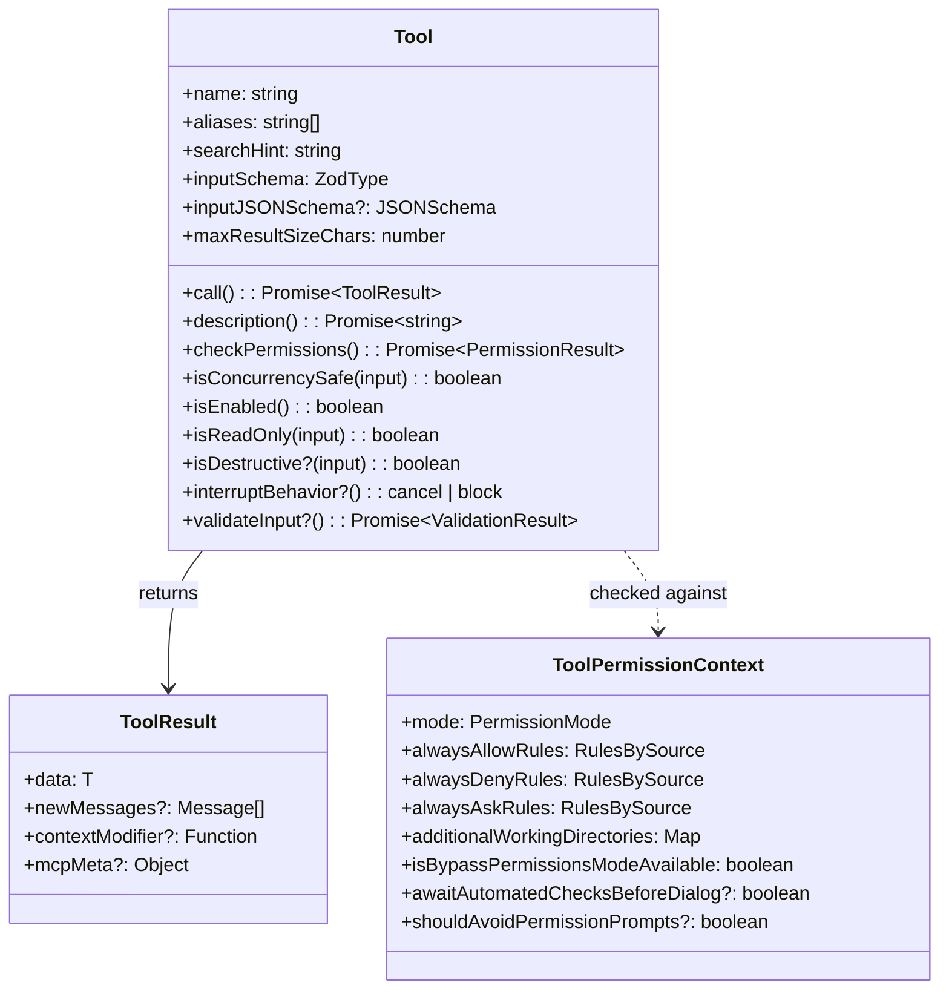
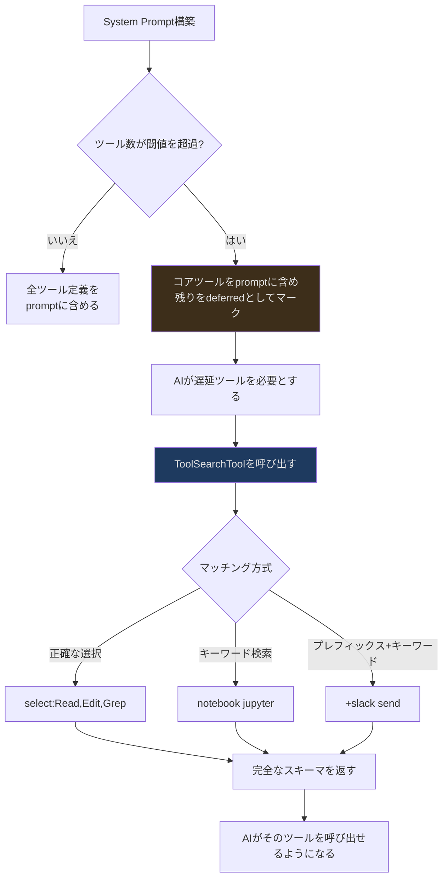
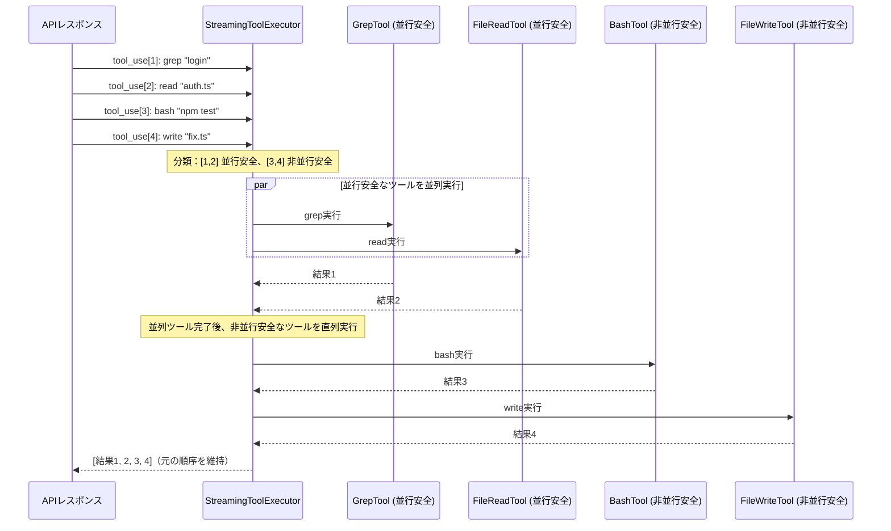
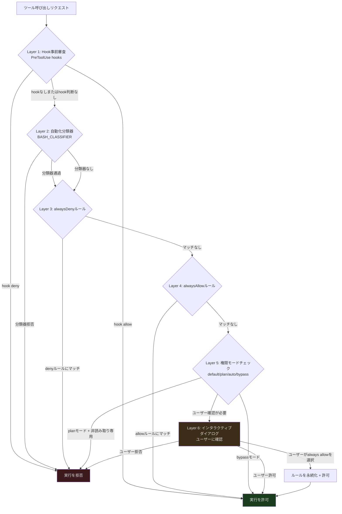
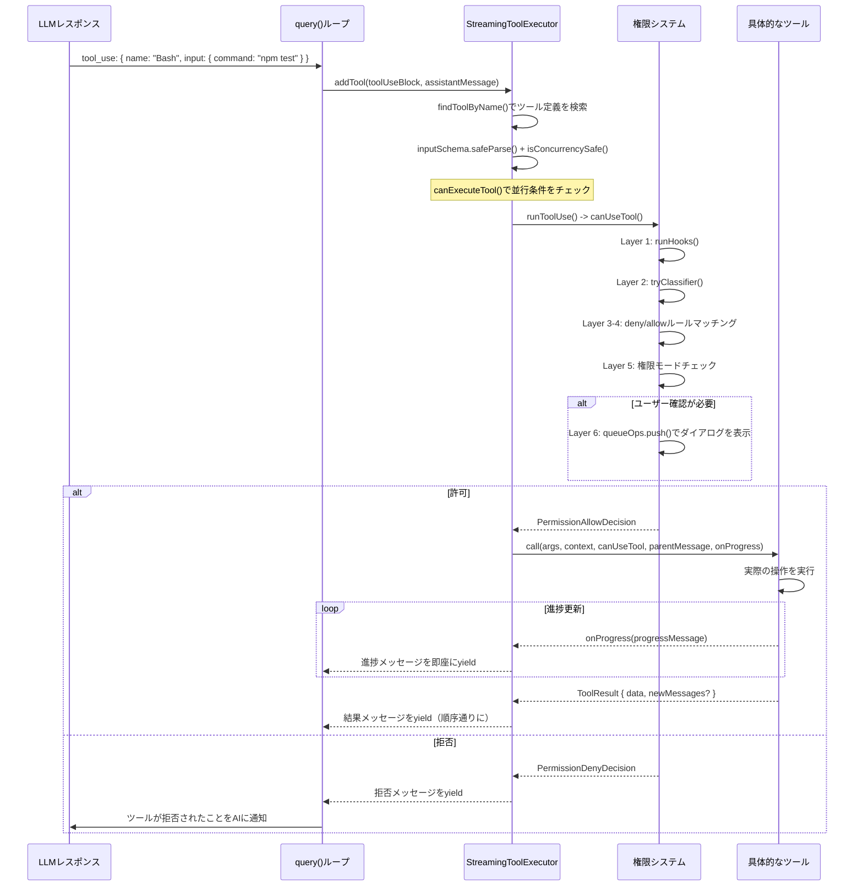
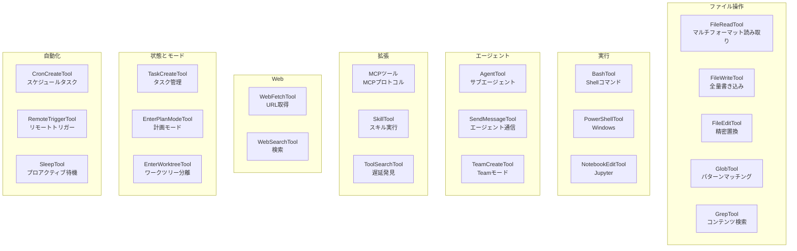

## 概要

前の2つの記事では、Claude Codeのグローバルなアーキテクチャを確立し、クエリエンジンのストリーミングループを深掘りしました。今回はアーキテクチャの3番目の重要な層であるツールシステムに踏み込みます。

クエリエンジンをClaude Codeの「脳」に例えるなら、ツールはその「手足」です。ツールがなければ、AIはテキストを生成することしかできません。ツールがあれば、AIはファイルの読み書き、Shellコマンドの実行、コード検索、Webページへのアクセス、さらにはサブエージェントの生成まで行えます。

しかし、この能力には大きなリスクが伴います。`rm -rf /` を実行できるAIは、適切な権限制御がなければ、時限爆弾のようなものです。Claude Codeのツールシステムは、強力な能力を提供するだけでなく、毎回の実行前に安全性を確保しなければなりません。

本記事では3つの次元からツールシステムを分析します：

1. **定義** — ツールとは何か、どのように宣言するのか？
2. **実行** — 複数のツールをどのように並行安全に実行するのか？
3. **権限** — ツールの実行可否を誰が決定するのか？

---

## ツールの型定義

各ツールは `Tool` 型に準拠するオブジェクトです。この型をフィールドごとに理解していきましょう：

```typescript
// src/Tool.ts:362-599
export type Tool<
  Input extends AnyObject = AnyObject,
  Output = unknown,
  P extends ToolProgressData = ToolProgressData,
> = {
  // アイデンティティ
  aliases?: string[]       // 後方互換のエイリアス
  searchHint?: string      // 遅延発見時のキーワードマッチング

  // コアメソッド
  call(args, context, canUseTool, parentMessage, onProgress?)
    : Promise<ToolResult<Output>>
  description(input, options): Promise<string>

  // スキーマ
  readonly inputSchema: Input           // Zodスキーマ
  readonly inputJSONSchema?: ToolInputJSONSchema  // JSON Schema（MCPツール用）

  // 動作宣言
  isConcurrencySafe(input): boolean     // 他のツールと並列実行可能か
  isEnabled(): boolean                  // 現在の環境で利用可能か
  isReadOnly(input): boolean            // 読み取り専用操作か
  isDestructive?(input): boolean        // 不可逆操作を実行するか
  interruptBehavior?(): 'cancel' | 'block'  // ユーザー中断時の動作

  // 権限
  checkPermissions(input, context): Promise<PermissionResult>
  validateInput?(input, context): Promise<ValidationResult>
  preparePermissionMatcher?(input): Promise<(pattern: string) => boolean>

  // 出力制御
  maxResultSizeChars: number            // 結果の最大文字数
  readonly name: string
}
```

この型定義は `src/Tool.ts` の約240行（362-599行）にまたがり、約30のフィールドとメソッドを含んでいます。上記のコードは簡略化されたコア部分です。完全な型にはUIレンダリングメソッド（`renderToolResultMessage`、`userFacingName`）、分析メソッド（`toAutoClassifierInput`）なども含まれます。



特に理解する価値のある設計に注目しましょう。

### 2種類のスキーマ：Zod vs JSON Schema

`inputSchema` と `inputJSONSchema` が共存していることに注目してください。これは冗長な設計ではなく、異なるソースのツールに異なるスキーマ形式が必要だからです：

- **組み込みツール**（BashTool、FileReadToolなど）は**Zodスキーマ**を使用 — TypeScriptネイティブで、コンパイル時の型チェックとランタイム検証を提供
- **MCPツール**（外部MCPサーバーから）は**JSON Schema**を使用 — MCPプロトコルがJSON Schemaベースでツールインターフェースを定義するため

```typescript
// 組み込みツールのZodスキーマ例
const inputSchema = z.object({
  command: z.string().describe("The shell command to execute"),
  timeout: z.number().optional().describe("Timeout in milliseconds"),
  run_in_background: z.boolean().optional(),
})

// MCPツールのJSON Schema（MCPサーバーから動的に取得）
const inputJSONSchema: ToolInputJSONSchema = {
  type: "object",
  properties: {
    query: { type: "string", description: "SQL query" }
  },
  required: ["query"]
}
```

`ToolInputJSONSchema` 型は `src/Tool.ts:15-21` で定義されており、ルート型が `object` であることを要求しています：

```typescript
export type ToolInputJSONSchema = {
  [x: string]: unknown
  type: 'object'
  properties?: {
    [x: string]: unknown
  }
}
```

ZodスキーマはAnthropic API呼び出し前に自動的にJSON Schema形式に変換されます。この変換はツール開発者にとって透過的です。デュアルトラック制により、組み込みツールはTypeScript型システムの恩恵を受けつつ、外部MCPツールはZod依存を導入せずに済みます。

### 動作宣言：ツールがシステムに自身の特性を伝える

Claude Codeのツールシステムは「宣言型」の設計を採用しています。ツールはスケジューラが属性を問い合わせるのを受動的に待つのではなく、自身の動作特性を能動的に宣言します。これにより、スケジューラはツールの具体的な実装を知らなくても、正しいスケジューリング判断を行えます。

**`isConcurrencySafe(input)`** — このツールは他のツールと並列実行できるか？

```typescript
// GrepToolは読み取り専用で、安全に並列実行可能
isConcurrencySafe() { return true }

// FileWriteToolはファイルシステムを変更するため、並列実行不可
isConcurrencySafe() { return false }

// 注意：メソッドはinputパラメータを受け取り、具体的な入力に基づく判断を可能にする
// 一部のツールは入力によって異なる並行安全性を返す場合がある
```

**`interruptBehavior()`** — ツール実行中にユーザーが新しいメッセージを送信した場合、このツールは即座にキャンセルすべきか、完了を待つべきか？

- `'cancel'` — 即座に中止（ほとんどのツールのデフォルト動作）
- `'block'` — 実行を継続し、新しいメッセージは待機（例：git commitを実行中のBashTool）

このメソッドは `input` パラメータを受け取りません。中断動作はツールレベルで、具体的な入力には依存しません。

**`isReadOnly(input)`** — 読み取り専用操作か？読み取り専用ツールは権限評価でより寛容な扱いを受けます。

**`isDestructive?(input)`** — 不可逆操作（削除、上書き、送信）を実行するか？このメソッドはオプションで、デフォルトは `false` です。権限システムに追加のリスクシグナルを提供します。

**`isEnabled()`** — ツールが現在の環境で利用可能か？`src/tools.ts` の `getToolsForDefaultPreset()` 関数は `isEnabled()` が `false` を返すツールをフィルタリングします。

### ToolResult：ツールの戻り値型

ツール実行後に返されるのは生データではなく、構造化された `ToolResult<T>` です：

```typescript
// src/Tool.ts:321-336
export type ToolResult<T> = {
  data: T                          // ツールの実際の出力
  newMessages?: (                  // 対話履歴に注入する必要があるメッセージ
    | UserMessage
    | AssistantMessage
    | AttachmentMessage
    | SystemMessage
  )[]
  contextModifier?: (context: ToolUseContext) => ToolUseContext  // 後続コンテキストの変更
  mcpMeta?: {                      // MCPプロトコルメタデータの透過
    _meta?: Record<string, unknown>
    structuredContent?: Record<string, unknown>
  }
}
```

`contextModifier` フィールドは特に興味深いものです。後続ツールの実行コンテキストを変更できます。ただし、重要な制限があります：**非並行安全なツールのみがcontext modifierを適用します**。並行ツールの実行順序は不定であり、すべてがコンテキストを変更しようとすると、結果が予測不能になるためです。

---

## ツールの登録と発見

### 静的登録

すべての組み込みツールは `src/tools.ts` に登録されています。`getAllBaseTools()` 関数（193行目）がツールのsource of truthです：

```typescript
// src/tools.ts:193-251（簡略化）
export function getAllBaseTools(): Tools {
  return [
    AgentTool,
    TaskOutputTool,
    BashTool,
    // 組み込み検索ツール使用時はGlob/Grepをスキップ
    ...(hasEmbeddedSearchTools() ? [] : [GlobTool, GrepTool]),
    ExitPlanModeV2Tool,
    FileReadTool,
    FileEditTool,
    FileWriteTool,
    NotebookEditTool,
    WebFetchTool,
    TodoWriteTool,
    WebSearchTool,
    // ... その他のツール
    ...(isToolSearchEnabledOptimistic() ? [ToolSearchTool] : []),
  ]
}
```

この関数はいくつかのツール登録パターンを示しています：

**1. コンパイル時Feature Flag**

```typescript
// src/tools.ts:29-35
const cronTools = feature('AGENT_TRIGGERS')
  ? [
      require('./tools/ScheduleCronTool/CronCreateTool.js').CronCreateTool,
      require('./tools/ScheduleCronTool/CronDeleteTool.js').CronDeleteTool,
      require('./tools/ScheduleCronTool/CronListTool.js').CronListTool,
    ]
  : []
```

`feature()` はBunのコンパイル時マクロです。`AGENT_TRIGGERS` がビルド時に `false` の場合、`require()` ブランチ全体とその推移的依存がすべて最終成果物から削除されます。

**2. 遅延requireによる循環依存の解消**

```typescript
// src/tools.ts:63-72
const getTeamCreateTool = () =>
  require('./tools/TeamCreateTool/TeamCreateTool.js')
    .TeamCreateTool as typeof import('./tools/TeamCreateTool/TeamCreateTool.js').TeamCreateTool
const getTeamDeleteTool = () =>
  require('./tools/TeamDeleteTool/TeamDeleteTool.js')
    .TeamDeleteTool
```

`getTeamCreateTool()` がトップレベルの `import` ではなく遅延 `require()` を使用していることに注目してください。これは循環依存を解消するためです。`TeamCreateTool` の実装が `tools.ts` がエクスポートする型や定数に依存している可能性があります。

**3. 環境変数による条件付き登録**

```typescript
// src/tools.ts:16-19
const REPLTool =
  process.env.USER_TYPE === 'ant'
    ? require('./tools/REPLTool/REPLTool.js').REPLTool
    : null
```

一部のツールは特定のユーザータイプ（Anthropic社内ユーザーなど）にのみ利用可能です。

### ツールプール組み立て：assembleToolPool

`getAllBaseTools()` は最初のステップに過ぎません。実際にAIに公開されるツールリストは、さらにフィルタリングとマージを経ます。`assembleToolPool()`（345行目）が最終的なツールプールを組み立てる統一エントリポイントです：

```typescript
// src/tools.ts:345-367
export function assembleToolPool(
  permissionContext: ToolPermissionContext,
  mcpTools: Tools,
): Tools {
  const builtInTools = getTools(permissionContext)
  const allowedMcpTools = filterToolsByDenyRules(mcpTools, permissionContext)
  // prompt cacheの安定性を保証するためにソート
  const byName = (a: Tool, b: Tool) => a.name.localeCompare(b.name)
  return uniqBy(
    [...builtInTools].sort(byName).concat(allowedMcpTools.sort(byName)),
    'name',
  )
}
```

この関数は3つのことを行います：

1. **組み込みツールの取得** — `getTools()` で無効化およびdenyルールでブロックされたツールをフィルタリング
2. **MCPツールのフィルタリング** — 同様にdenyルールを適用
3. **重複排除とマージ** — 組み込みツール優先、名前順にソートしてprompt cacheの安定性を保証

ソートの目的は整理だけではありません。コメントで説明されているように、Anthropic APIサーバーサイドは組み込みツールの最後の位置にcache breakpointを配置します。MCPツールが組み込みツールの間にソートされると、すべてのダウンストリームcache keyが無効になってしまいます。

### 遅延発見：ToolSearchTool

ツールが多すぎる場合（40以上）、すべてのツール定義をSystem Promptに含めると大量のトークンを消費します。Claude Codeの解決策は**遅延読み込み**です：



各ツールは2つのフィールドで遅延読み込みの動作を制御できます：

- **`shouldDefer`** — `true` に設定されたツールは、ツール数が閾値を超えた場合に遅延読み込みされます
- **`alwaysLoad`** — `true` に設定されたツールは決して遅延されず、常に初期promptに含まれます

`ToolSearchTool` は3つのクエリモードをサポートしています：

1. **正確な選択**: `"select:Read,Edit,Grep"` — 名前で特定のツールを取得
2. **キーワード検索**: `"notebook jupyter"` — ファジーマッチング、`searchHint` フィールドを使用
3. **プレフィックス+キーワード**: `"+slack send"` — 名前に "slack" を含むことを要求し、残りの語で並べ替え

各ツールの `searchHint` フィールドがキーワードマッチングをサポートしています：

```typescript
// ツールのsearchHint例
// AgentTool
searchHint: "subagent parallel background isolation worktree"

// NotebookEditTool
searchHint: "jupyter ipynb cell"

// AIが "parallel" を検索すると、AgentToolがマッチする
// searchHintの説明："3-10 words, no trailing period.
//   Prefer terms not already in the tool name"
```

### MCP動的ツール

組み込みツールと遅延発見に加えて、ツールは外部MCP（Model Context Protocol）サーバーからも提供されます。MCPサーバーが接続されると、そのサーバーが公開するすべてのツールがツールプールに動的に登録されます。MCPツールには特別な `mcpInfo` フィールドがあります：

```typescript
// src/Tool.ts:451-455
mcpInfo?: { serverName: string; toolName: string }
```

MCPツールの名前は通常 `mcp__serverName__toolName` 形式でプレフィックス化され、`mcpInfo` はプレフィックス化されていないオリジナルのサーバー名とツール名を保持します。これにより、権限システムはMCPサーバーレベルでルールを設定できます（例：`mcp__database` でそのサーバーのすべてのツールにマッチ）。

MCPツールは `_meta['anthropic/alwaysLoad']` で自身を `alwaysLoad` としてマークすることもでき、遅延読み込みモードでも常に可視であることを保証します。

---

## StreamingToolExecutor：並行安全なツールオーケストレーション

APIレスポンスに複数の `tool_use` 呼び出しが含まれている場合、`StreamingToolExecutor`（`src/services/tools/StreamingToolExecutor.ts`）がそれらの実行方法（並列か直列か）を決定します。

### TrackedTool：ツールのランタイム状態

```typescript
// src/services/tools/StreamingToolExecutor.ts:19-33
type ToolStatus = 'queued' | 'executing' | 'completed' | 'yielded'

type TrackedTool = {
  id: string
  block: ToolUseBlock
  assistantMessage: AssistantMessage
  status: ToolStatus
  isConcurrencySafe: boolean
  promise?: Promise<void>
  results?: Message[]
  pendingProgress: Message[]  // 進捗メッセージバッファ
  contextModifiers?: Array<(context: ToolUseContext) => ToolUseContext>
}
```

各ツールはエグゼキュータ内で4つの状態を経験します：`queued`（キュー待ち） → `executing`（実行中） → `completed`（実行完了、結果収集済み） → `yielded`（結果が上位に発射済み）。

### 並行スケジューリングモデル



スケジューリングロジックは `canExecuteTool()` メソッド（129行目）に実装されています：

```typescript
// src/services/tools/StreamingToolExecutor.ts:129-135
private canExecuteTool(isConcurrencySafe: boolean): boolean {
  const executingTools = this.tools.filter(t => t.status === 'executing')
  return (
    executingTools.length === 0 ||
    (isConcurrencySafe && executingTools.every(t => t.isConcurrencySafe))
  )
}
```

ルールは非常に洗練されています：

- 実行中のツールがない場合 → どのツールでも実行可能
- ツールが実行中で、現在のツールとすべての実行中ツールが並行安全な場合 → 実行可能
- それ以外 → キュー待ち

`processQueue()` メソッド（140行目）はツールがキューに入った時またはツールが完了した時に呼び出され、キューを走査して実行可能なすべてのツールを開始します。非並行安全なツールについては、実行できないものに遭遇した時点で走査を停止し、順序性を保証します。

### ツールの追加：addTool

ストリーミングAPIレスポンスに `tool_use` ブロックが現れると、`addTool()` メソッド（76行目）が呼び出されます：

```typescript
// src/services/tools/StreamingToolExecutor.ts:76-124（簡略化）
addTool(block: ToolUseBlock, assistantMessage: AssistantMessage): void {
  const toolDefinition = findToolByName(this.toolDefinitions, block.name)
  if (!toolDefinition) {
    // 未知のツール：即座にcompletedとしてマーク、結果はエラーメッセージ
    this.tools.push({
      id: block.id, block, assistantMessage,
      status: 'completed',
      isConcurrencySafe: true,
      pendingProgress: [],
      results: [/* error: "No such tool available" */],
    })
    return
  }

  // 入力を解析し並行安全性を判定
  const parsedInput = toolDefinition.inputSchema.safeParse(block.input)
  const isConcurrencySafe = parsedInput?.success
    ? (() => {
        try { return Boolean(toolDefinition.isConcurrencySafe(parsedInput.data)) }
        catch { return false }
      })()
    : false

  this.tools.push({
    id: block.id, block, assistantMessage,
    status: 'queued', isConcurrencySafe,
    pendingProgress: [],
  })

  void this.processQueue()
}
```

並行安全性の判定に注目してください。入力の解析に失敗した場合（`safeParse` が `success: false` を返す場合）、ツールは非並行安全として扱われます。これは安全なデフォルト値です。入力すら解析できないなら、直列実行の方が安全です。

### Sibling Abort：カスケードキャンセル

Bashツールの実行が失敗すると、並列実行中の他のツールがキャンセルされます。ただし、重要な詳細があります — **BashToolのエラーのみがカスケードキャンセルをトリガーします**：

```typescript
// src/services/tools/StreamingToolExecutor.ts:354-363
if (isErrorResult) {
  thisToolErrored = true
  // Only Bash errors cancel siblings. Bash commands often have implicit
  // dependency chains (e.g. mkdir fails → subsequent commands pointless).
  // Read/WebFetch/etc are independent — one failure shouldn't nuke the rest.
  if (tool.block.name === BASH_TOOL_NAME) {
    this.hasErrored = true
    this.erroredToolDescription = this.getToolDescription(tool)
    this.siblingAbortController.abort('sibling_error')
  }
}
```

なぜBashだけなのでしょうか？Bashコマンドには暗黙の依存チェーンがあることが多いからです。`mkdir` が失敗したら、後続の `cd && make` も無意味です。一方、FileReadToolやWebFetchToolの失敗は通常独立しています。一つのファイル読み取りの失敗が他のファイルの読み取りをキャンセルすべきではありません。

`siblingAbortController` は `toolUseContext.abortController` の**子コントローラ**です（59行目）：

```typescript
// src/services/tools/StreamingToolExecutor.ts:53-61
constructor(
  private readonly toolDefinitions: Tools,
  private readonly canUseTool: CanUseToolFn,
  toolUseContext: ToolUseContext,
) {
  this.toolUseContext = toolUseContext
  this.siblingAbortController = createChildAbortController(
    toolUseContext.abortController,
  )
}
```

`siblingAbortController` のキャンセルは親の `toolUseContext.abortController` をキャンセルしません。queryループは一つのBashエラーでターン全体を終了しません。キャンセルされた兄弟ツールは合成エラーメッセージを受け取ります：

```typescript
// src/services/tools/StreamingToolExecutor.ts:153-205
private createSyntheticErrorMessage(
  toolUseId: string,
  reason: 'sibling_error' | 'user_interrupted' | 'streaming_fallback',
  assistantMessage: AssistantMessage,
): Message {
  if (reason === 'user_interrupted') {
    // ユーザー中断：REJECT_MESSAGEを返す
  }
  if (reason === 'streaming_fallback') {
    // ストリーミング降格：降格エラーを返す
  }
  // sibling_error："Cancelled: parallel tool call X errored" を返す
  const desc = this.erroredToolDescription
  const msg = desc
    ? `Cancelled: parallel tool call ${desc} errored`
    : 'Cancelled: parallel tool call errored'
  // ...
}
```

### 進捗バッファリングと順序付き発射

ツール実行中に進捗メッセージ（検索進捗、ファイル読み取り進捗、サブプロセス出力など）が発行されます。これらのメッセージの処理戦略は：

- **Progressメッセージ** → 即座にyield、ユーザーにリアルタイム表示
- **Resultメッセージ** → 元のtool_use順序でyield、対話履歴の一貫性を保証

この分離は `getCompletedResults()` メソッド（412行目）に実装されています：

```typescript
// src/services/tools/StreamingToolExecutor.ts:412-440
*getCompletedResults(): Generator<MessageUpdate, void> {
  for (const tool of this.tools) {
    // 常に進捗メッセージを即座にyield（ツールの状態に関係なく）
    while (tool.pendingProgress.length > 0) {
      const progressMessage = tool.pendingProgress.shift()!
      yield { message: progressMessage, newContext: this.toolUseContext }
    }

    if (tool.status === 'yielded') continue

    if (tool.status === 'completed' && tool.results) {
      tool.status = 'yielded'
      for (const message of tool.results) {
        yield { message, newContext: this.toolUseContext }
      }
    } else if (tool.status === 'executing' && !tool.isConcurrencySafe) {
      break  // 非並行ツールは順序を維持する必要がある
    }
  }
}
```

最後の `break` に注目してください。実行中の非並行安全なツールに遭遇した場合、後続ツールの結果の発射を停止します。これにより、非並行ツールの結果が対話履歴に厳密に順序通りに現れることが保証されます。

`getRemainingResults()`（453行目）では、エグゼキュータは `Promise.race` を使用してツールの完了と進捗メッセージを同時に待機します：

```typescript
// src/services/tools/StreamingToolExecutor.ts:466-484
// いずれかのツール完了または進捗メッセージが利用可能になるのを待機
const progressPromise = new Promise<void>(resolve => {
  this.progressAvailableResolve = resolve
})
await Promise.race([...executingPromises, progressPromise])
```

ツールの `executeTool()` メソッドが進捗メッセージを受信すると、`pendingProgress` 配列にメッセージをプッシュし `progressAvailableResolve` をトリガーして、待機中の `getRemainingResults()` を起こします。

### Discard：ストリーミング降格時のクリーンアップ

`StreamingToolExecutor` には `discard()` メソッド（69行目）もあり、ストリーミング降格シナリオで使用されます：

```typescript
discard(): void {
  this.discarded = true
}
```

APIのストリーミング転送が失敗し、非ストリーミングモードへの降格が必要な場合、すでに実行を開始したツールの結果を破棄する必要があります。`discarded = true` を設定すると、`getCompletedResults()` と `getRemainingResults()` は即座にリターンし、結果の発射を行いません。キュー内のツールも起動されません。

---

## 権限システム：6層のセキュリティ防御線

ツールシステムの最も重要な設計は能力ではなく、制約です。Claude Codeは**6層の権限評価パイプライン**を実装しており、すべてのツール呼び出しはこのパイプラインを通過しなければ実行できません。

### ToolPermissionContext：イミュータブルな権限コンテキスト

```typescript
// src/Tool.ts:123-138
export type ToolPermissionContext = DeepImmutable<{
  mode: PermissionMode  // 'default' | 'plan' | 'auto' | 'bypassPermissions'

  // 3種類のルールセット、各ソースごとにグループ化
  alwaysAllowRules: ToolPermissionRulesBySource  // 自動許可
  alwaysDenyRules: ToolPermissionRulesBySource   // 自動拒否
  alwaysAskRules: ToolPermissionRulesBySource    // 常にユーザーに確認

  // ファイルシステムスコープ
  additionalWorkingDirectories: Map<string, AdditionalWorkingDirectory>

  // 高度なオプション
  isBypassPermissionsModeAvailable: boolean
  isAutoModeAvailable?: boolean
  shouldAvoidPermissionPrompts?: boolean          // バックグラウンドエージェントはダイアログを表示しない
  awaitAutomatedChecksBeforeDialog?: boolean      // Coordinatorワーカー
  prePlanMode?: PermissionMode                    // planモード終了後に復元
}>
```

**`DeepImmutable<>`** ラッパーがこの設計の核心です。`DeepImmutable` 型（`src/types/utils.ts`）はネストされたオブジェクトやMapを含む、すべてのプロパティを再帰的に `readonly` としてマークします。これは権限コンテキストが一度作成されると変更できないことを意味します。

なぜイミュータビリティがそれほど重要なのでしょうか？権限決定は一貫した状態に基づく必要があるからです。次のようなレースコンディションを考えてみてください：

1. スレッドAが `alwaysDenyRules` を読み取り、マッチなしと判断
2. スレッドBが新しいdenyルールを追加
3. スレッドAが続行し、古いルールに基づいて拒否すべき操作を許可

`DeepImmutable` はステップ2をコンパイル時に阻止します。権限コンテキストを変更しようとするコードはTypeScriptコンパイルエラーを生成します。権限を更新する必要がある場合は、まったく新しい `ToolPermissionContext` オブジェクトを作成する必要があります。

`getEmptyToolPermissionContext()`（140行目）はデフォルトの空の権限コンテキストを提供します：

```typescript
// src/Tool.ts:140-148
export const getEmptyToolPermissionContext: () => ToolPermissionContext =
  () => ({
    mode: 'default',
    additionalWorkingDirectories: new Map(),
    alwaysAllowRules: {},
    alwaysDenyRules: {},
    alwaysAskRules: {},
    isBypassPermissionsModeAvailable: false,
  })
```

### ルールのソース追跡

ルールには「許可」と「拒否」だけでなく、**ソース**もあります。`ToolPermissionRulesBySource` は各ルールがどこから来たかを記録しています：

- **ユーザールール** — ユーザーが `~/.claude/settings.json` で設定したもの
- **プロジェクトルール** — プロジェクトの `.claude/settings.json` のもの
- **ポリシールール** — 組織管理者がMDM/リモート設定で配布したもの

ソース追跡の目的は監査だけでなく、**優先順位判定**でもあります。ポリシールールはプロジェクトルールより優先され、プロジェクトルールはユーザールールより優先されます。ルールが競合する場合、より高い優先度のソースが「勝ちます」。

`filterToolsByDenyRules()` 関数（262行目）はツールプール組み立て段階でグローバルにdenyされたツールをフィルタリングします：

```typescript
// src/tools.ts:262-269
export function filterToolsByDenyRules<
  T extends { name: string; mcpInfo?: { serverName: string; toolName: string } },
>(tools: readonly T[], permissionContext: ToolPermissionContext): T[] {
  return tools.filter(tool => !getDenyRuleForTool(permissionContext, tool))
}
```

ジェネリック制約に注目してください。組み込みツール（`name` のみ）とMCPツール（`mcpInfo` あり）の両方をサポートし、同じフィルタリングロジックを2種類のツールソースに適用できます。

### 6層評価パイプライン



各層の詳細：

**Layer 1 — Hook事前審査：** PreToolUse hooks（ユーザーが `settings.json` で定義したシェルコマンド）が設定されている場合、まずhookを実行します。Hookはツール呼び出しを直接通過（`behavior: 'allow'`）または拒否（`behavior: 'deny'`）でき、`updatedInput` でツール入力を変更することもできます。`PermissionContext.ts` の `runHooks()` メソッド（216行目）がこのロジックを実装しています。

**Layer 2 — 自動化分類器（BASH_CLASSIFIER）：** BashTool固有で、分類器を使用してコマンドが安全かどうかを自動判定します。`tryClassifier()` メソッド（176行目）は `BASH_CLASSIFIER` feature flagが有効な場合にのみ存在します。分類器通過後にapproval情報が記録され、`TRANSCRIPT_CLASSIFIER` 機能に使用されます。

**Layer 3 — alwaysDenyルール：** ツール呼び出しが「常に拒否」ルールのいずれかにマッチした場合、直接拒否します。オーバーライド不可です。

**Layer 4 — alwaysAllowルール：** ツール呼び出しが「常に許可」ルールにマッチした場合、直接通過させます。

**Layer 5 — 権限モードチェック：** 現在の `PermissionMode` に基づいてユーザー確認が必要かどうかを判断します。

**Layer 6 — インタラクティブダイアログ：** ターミナルダイアログを表示してユーザーに決定を委ねます。ユーザーは「許可」、「拒否」、または「このタイプの操作を常に許可」を選択できます。「常に許可」を選択すると、システムは `persistPermissions()` メソッド（139行目）でルールを設定ファイルに永続化します。

### PermissionContext：権限処理の中核

`src/hooks/toolPermission/PermissionContext.ts` の `createPermissionContext()` 関数（96行目）が権限処理の中核コンテキストを作成します。以下の主要な機能を提供します：

```typescript
// src/hooks/toolPermission/PermissionContext.ts:96-104
function createPermissionContext(
  tool: ToolType,
  input: Record<string, unknown>,
  toolUseContext: ToolUseContext,
  assistantMessage: AssistantMessage,
  toolUseID: string,
  setToolPermissionContext: (context: ToolPermissionContext) => void,
  queueOps?: PermissionQueueOps,
)
```

このコンテキストオブジェクトには複数のヘルパーメソッドが含まれています：

- **`logDecision()`** — 権限決定を分析システムに記録
- **`logCancelled()`** — ツールキャンセルイベントを記録
- **`persistPermissions()`** — ユーザーの権限選択を設定ファイルに永続化
- **`resolveIfAborted()`** — キャンセル済みかチェック（ユーザーがCtrl+Cを押した場合など）
- **`cancelAndAbort()`** — ツールを拒否し実行を中止
- **`runHooks()`** — PreToolUse hooksを実行
- **`tryClassifier()`** — 自動化分類器を試行（条件付きで存在）
- **`buildAllow()` / `buildDeny()`** — 許可/拒否決定オブジェクトを構築
- **`handleUserAllow()`** — ユーザー承認を処理（権限永続化を含む場合あり）

`cancelAndAbort()` メソッド（154行目）の微妙なロジックに注目してください。サブエージェントかどうかによって異なる拒否メッセージを選択します：

```typescript
cancelAndAbort(feedback?, isAbort?, contentBlocks?): PermissionDecision {
  const sub = !!toolUseContext.agentId
  const baseMessage = feedback
    ? `${sub ? SUBAGENT_REJECT_MESSAGE_WITH_REASON_PREFIX : REJECT_MESSAGE_WITH_REASON_PREFIX}${feedback}`
    : sub ? SUBAGENT_REJECT_MESSAGE : REJECT_MESSAGE
  // サブエージェントは親を中止しない
  if (isAbort || (!feedback && !contentBlocks?.length && !sub)) {
    toolUseContext.abortController.abort()
  }
  return { behavior: 'ask', message, contentBlocks }
}
```

### 3種類の権限ハンドラ

権限評価の実際の実行は、現在の実行モードに応じて3つのハンドラのいずれかが担当します：

```
src/hooks/toolPermission/handlers/
├── interactiveHandler.ts    // インタラクティブモード：ダイアログを表示してユーザーに判断を委ねる
├── coordinatorHandler.ts    // Coordinatorモード：自動分類 + オプションのユーザー確認
└── swarmWorkerHandler.ts    // Swarm Workerモード：ディスパッチャーに委譲
```

- **interactiveHandler** — 最も一般的なハンドラです。ツールがユーザー承認を必要とする場合、ターミナルダイアログをレンダリングし、ツール名、パラメータ、リスクレベルを表示して、ユーザーに「許可」、「拒否」、「このタイプの操作を常に許可」の選択肢を提供します。
- **coordinatorHandler** — マルチエージェントモードでは、ワーカーのツール呼び出しはまず自動分類を経て、分類器が判断できない呼び出しのみがユーザーにエスカレーションされます。`awaitAutomatedChecksBeforeDialog` フラグが分類結果を待ってからユーザーダイアログを表示するかどうかを制御します。
- **swarmWorkerHandler** — Swarm内のワーカーは権限決定をCoordinatorに委譲し、自身は判断しません。

`PermissionQueueOps` インターフェース（57-61行目）は権限UIと権限ロジックを分離しています：

```typescript
type PermissionQueueOps = {
  push(item: ToolUseConfirm): void
  remove(toolUseID: string): void
  update(toolUseID: string, patch: Partial<ToolUseConfirm>): void
}
```

REPLモードでは、これらの操作はReactの状態で裏付けされます。SDKモードではまったく異なる実装が可能です。

### ResolveOnce：レースセーフな決定解決

権限システムは典型的なレースコンディションに直面します。ユーザーが「許可」を押すのと同時にabortシグナルも到達する場合、両方のコールバックが同じPromiseをresolveしようとすると、予測不能な動作が生じます。

`createResolveOnce<T>()`（75-93行目）はアトミックなレース保護を提供します：

```typescript
// src/hooks/toolPermission/PermissionContext.ts:75-93
function createResolveOnce<T>(resolve: (value: T) => void): ResolveOnce<T> {
  let claimed = false
  let delivered = false
  return {
    resolve(value: T) {
      if (delivered) return
      delivered = true
      claimed = true
      resolve(value)
    },
    isResolved() { return claimed },
    claim() {
      if (claimed) return false
      claimed = true
      return true
    },
  }
}
```

`claim()` メソッドは「先に宣言、後に実行」パターンを提供します。asyncコールバック内でまず `claim()` を呼んで排他権を取得し、その後に副作用のある操作を実行します。これにより `isResolved()` チェックと `resolve()` 呼び出しの間のレースウィンドウが閉じられます。

### 権限モードの比較

| モード | 動作 | 典型的なシナリオ |
|------|------|----------|
| `default` | 危険な操作はユーザーに確認、安全な操作は自動許可 | 通常のインタラクティブ使用 |
| `plan` | 読み取り専用操作のみ許可、すべての変更を禁止 | 計画段階、実行しない |
| `auto` | ほとんどの操作を自動許可、高リスクのみ確認 | バッチ自動化タスク |
| `bypassPermissions` | すべての操作を自動許可 | 信頼された自動化環境 |

`prePlanMode` フィールドはplanモードに入る前のモードを記録し、planモード終了時に復元できるようにしています。

---

## ツールの完全な実行フロー

上記のすべてのレイヤーを統合すると、ツールがAIに呼び出されてから実行完了までの完全なフローは次のようになります：



---

## ツール出力管理

ツール実行後の出力はAIに直接送信されるわけではありません。切り詰めとフォーマッティングを経ます。

### トークン予算とmaxResultSizeChars

各ツールは `maxResultSizeChars` を宣言し、出力の最大文字数を制御します。この値はツールによって異なります：

```typescript
// BashTool: maxResultSizeChars = 100_000
// GrepTool: head_limitに基づいて動的に計算
// FileReadTool: maxResultSizeChars = Infinity（特殊ケース）
```

`FileReadTool` は `maxResultSizeChars` を `Infinity` に設定しています。ソースコードのコメントがその理由を説明しています：

> Set to Infinity for tools whose output must never be persisted (e.g. Read, where persisting creates a circular Read→file→Read loop and the tool already self-bounds via its own limits).
>
> *（訳：出力を永続化してはならないツールには Infinity を設定します（例：Read。永続化すると Read→ファイル→Read の循環ループが発生し、ツール自体が独自の制限で出力サイズを制御しています）。）*

Readの出力がディスクファイルに永続化されると、AIがReadでそのファイルを再度読み取り、無限ループを形成する可能性があります。Readは既に独自の `offset`/`limit` パラメータで出力サイズを制御しているため、外部での切り詰めは不要です。

`maxResultSizeChars` 制限を超える出力は一時ファイルに保存され、AIが受け取るのは完全な内容ではなくプレビューとファイルパスです。`ContentReplacementState`（`src/utils/toolResultStorage.ts`）がこの永続化プロセスを管理します。

### 大きなファイルの読み取り戦略

`FileReadTool` は大きなファイルにページネーションパラメータを提供しています：

- **`offset`** — N行目から読み取り開始
- **`limit`** — N行を読み取り
- **`pages`** — PDFファイルのページ範囲（例："1-5"）

これにより、AIは大きなファイル全体をコンテキストに読み込むのではなく、必要に応じてファイルの特定部分を読み取ることができます。

### 出力マッピング：ツール結果からAPIフォーマットへ

各ツールは `mapToolResultToToolResultBlockParam()` メソッドを実装し、自身の出力をAnthropic APIの `ToolResultBlockParam` フォーマットに変換する必要があります：

```typescript
mapToolResultToToolResultBlockParam(
  content: Output,
  toolUseID: string,
): ToolResultBlockParam
```

このメソッドはツール固有のデータフォーマット（ファイル内容、検索結果、コマンド出力など）をAPIが理解できるテキストまたは画像ブロックにシリアライズする責任を持ちます。

---

## 45ツールの分類概要



各ツールの具体的な設計は後続の専門記事で詳しく取り上げます。第21回ではファイル操作の三銃士を、第22回ではBashToolを、第08回ではマルチエージェントオーケストレーションを展開します。

---

## ToolUseContext：ツールのランタイム環境

各ツール実行時には `ToolUseContext` オブジェクト（`src/Tool.ts:158-300`）を受け取ります。これにはツールが必要とするすべてのランタイム情報が含まれています。この型は40以上のフィールドを持ち、Claude Code内で最大のコンテキスト型の一つです。

コアフィールドはいくつかのカテゴリに分かれます：

**設定とオプション：**
```typescript
options: {
  commands: Command[]           // 利用可能なコマンドリスト
  tools: Tools                  // 利用可能なツールリスト
  mainLoopModel: string         // 現在使用中のモデル
  mcpClients: MCPServerConnection[]  // MCP接続
  thinkingConfig: ThinkingConfig     // 思考モード設定
  isNonInteractiveSession: boolean   // 非インタラクティブモードかどうか
  maxBudgetUsd?: number              // 予算制限
  refreshTools?: () => Tools         // ツールリストの動的リフレッシュ
}
```

**状態管理：**
```typescript
getAppState(): AppState              // グローバル状態の読み取り
setAppState(f: (prev) => AppState)   // グローバル状態の更新
messages: Message[]                  // 現在の対話履歴
readFileState: FileStateCache        // ファイルキャッシュ
```

**中止と制御：**
```typescript
abortController: AbortController     // 中止シグナル
setInProgressToolUseIDs: (f) => void // 実行中のツールを追跡
setHasInterruptibleToolInProgress?: (v: boolean) => void
```

**サブエージェントサポート：**
```typescript
agentId?: AgentId        // サブエージェント識別子
agentType?: string       // エージェントタイプ名
queryTracking?: QueryChainTracking  // クエリチェーン追跡
```

`setAppStateForTasks` フィールド（186行目）は特に注目に値します。これはバックグラウンドタスク専用の「常に有効」な状態アップデータです。通常の `setAppState` は非同期サブエージェントではno-opです（並行状態競合を避けるため）。しかし、インフラストラクチャ操作（バックグラウンドタスクの登録/クリーンアップなど）には、常にルートストアに到達できるチャネルが必要です。

---

## 移植可能なエンジニアリングパターン

### 1. 動作宣言型ツール設計

ツールに `isConcurrencySafe()`、`interruptBehavior()`、`isReadOnly()` などのメソッドで自身の動作特性を自己宣言させ、スケジューラが各ツールの動作をハードコーディングしないアプローチです。新しいツールがスケジューリングシステムにシームレスに統合でき、スケジューラのコードを変更する必要がありません。StreamingToolExecutorの `canExecuteTool()` メソッドはわずか6行でありながら、任意の数のツールの組み合わせを正しく処理できます。スケジューリングロジックが完全にツールの自己宣言に基づいているからです。

### 2. スキーマのデュアルトラック制

システムが内部定義と外部プロトコルの両方をサポートする必要がある場合、2つのスキーマ形式（Zod + JSON Schema）を提供するのは実用的な選択です。鍵となるのはランタイムで処理ロジックを統一することです。`safeParse()` は組み込みツールの入力検証に使用され、MCPツールのJSON SchemaはAPIシリアライゼーション時に直接使用されます。呼び出し側はスキーマのソース形式を気にする必要がありません。

### 3. 階層型権限とソース追跡

権限システムでルールのソース（ユーザー/プロジェクト/ポリシー）を記録するアプローチは参考になります。競合解決に根拠を提供するだけでなく、監査追跡も可能にします。管理者はどの権限が組織ポリシーに由来し、どの権限がユーザーの自己設定によるものかを確認できます。`filterToolsByDenyRules()` がツールプール組み立て段階で利用不可なツールをフィルタリングすることで、AIが永遠に拒否されるツールを呼び出すためにトークンを浪費するのを防ぎます。

### 4. イミュータブルな権限コンテキスト

`DeepImmutable<ToolPermissionContext>` の設計は権限評価の一貫性を保証します。セキュリティに関わる重要な決定を行うシステムにおいて、決定コンテキストのイミュータビリティはTOCTOU（Time-of-check to time-of-use）脆弱性を防ぐ効果的な手段です。権限更新時に既存のオブジェクトを変更するのではなく新しいオブジェクトを作成するこのパターンは、Reactの状態管理でも広く使用されています。

### 5. カスケードキャンセルの選択的伝播

`StreamingToolExecutor` でBashToolのエラーのみがsibling abortをトリガーし、すべてのツールのエラーではないというアプローチです。この「選択的カスケード」は「全キャンセル」や「全無視」よりも正確で、ツール間の依存関係に関するドメイン知識に基づいて判断しています。このパターンは並行キャンセルが必要なあらゆるシナリオに一般化できます。

### 6. レースセーフな決定解決

`ResolveOnce` の `claim()` パターンは非同期レースコンディションに対するエレガントな解決策を提供します。権限ダイアログでは、ユーザー操作とシステムキャンセルが同時に到達する可能性があります。`claim()` は一つのコールバックだけが決定権を「勝ち取る」ことを保証し、重複resolveと予測不能な副作用を防ぎます。

---

## シリーズの振り返りと展望

ここまでで、基礎アーキテクチャ編の3つの記事がその役目を果たしました：

1. **第01回** で5層アーキテクチャのグローバルな視点を確立
2. **第02回** でエンジン層のストリーミングクエリループを深掘り
3. **第03回**（本記事）でツール層の定義、実行、権限を分析

次回からは独立した深い主題に入ります。興味に応じて読み進めてください：

- 並行実行に興味がある方は --> [第04回：ストリーミングツールエグゼキュータ](/articles/04-streaming-tool-executor)
- 権限システムについてもっと知りたい方は --> [第05回：権限システム詳解](/articles/05-permission-system)
- AIがあなたをどのように記憶するかに興味がある方は --> [第09回：永続化メモリ](/articles/09-memory-system)
- イースターエッグを見たい方は --> [第26回：Buddyペットシステム](/articles/26-buddy-system)
