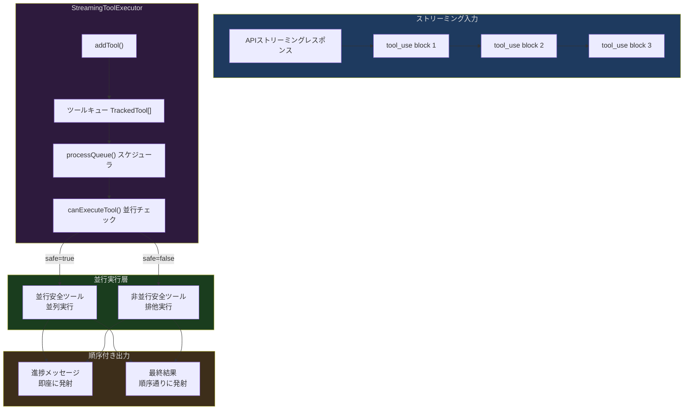
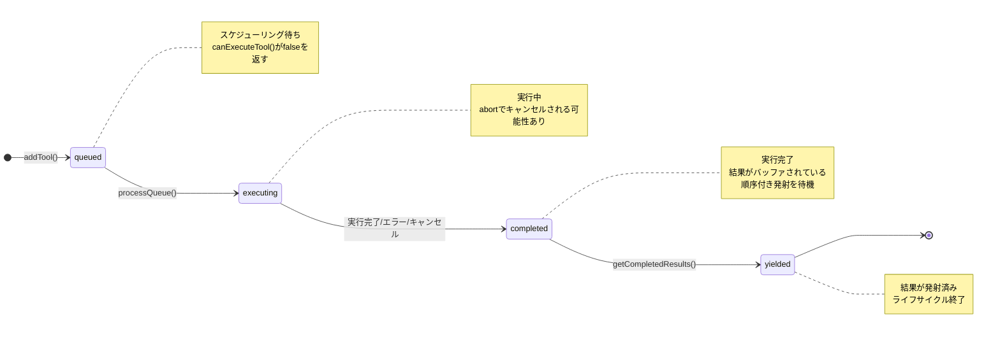
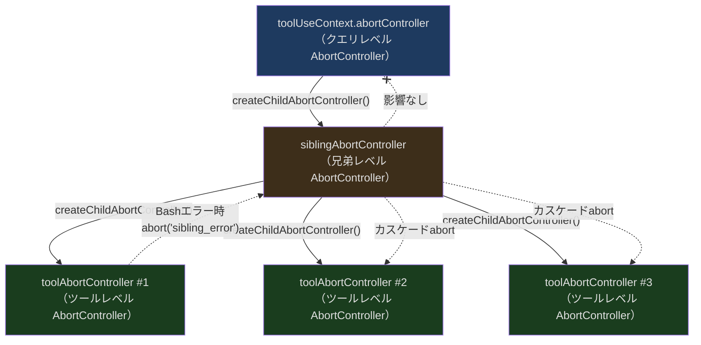

## 問題提起

次のようなシナリオを想像してみてください。Claude Codeにモジュールのリファクタリングを依頼したところ、モデルが1回のレスポンスで5つの `tool_use` 呼び出しを返しました。ファイル読み取り3つ、Bashコマンド実行1つ、ファイル書き込み1つです。ここで疑問が生じます：

1. この5つのツールは直列実行すべきか、並列実行すべきか？
2. Bashコマンドが失敗した場合、並列実行中のファイル読み取りもキャンセルすべきか？
3. ファイル書き込みはBashの結果に依存しているが、Bashの完了後に実行すべきか？
4. ユーザーがツール実行中にESCを押した場合、どのツールを停止し、どのツールを継続すべきか？
5. 複数のツールが同時に進捗メッセージを生成した場合、UIはどのように順序立てて表示すべきか？

これらの問題は一見単純ですが、それぞれが並行制御のコアとなる課題に関わっています。直列実行は遅すぎます。3つの独立したファイル読み取りが一つずつ完了するのをユーザーは待ちたくありません。全部を並列にするのは危険すぎます。書き込み操作と読み取り操作が同じファイルに同時にアクセスすると、データ競合が発生する可能性があります。

Claude Codeの解決策は `StreamingToolExecutor` です。各ツールが自身の並列実行可否を宣言し、その宣言に基づいて動的にスケジューリングする、慎重に設計された並行オーケストレータです。この記事ではその設計判断を一つ一つ詳しく分析します。

---

## なぜストリーミングツールエグゼキュータが必要なのか？

前回の記事ではツールシステムの全体アーキテクチャを紹介しました。しかし、一つの重要な問題を意図的にこの記事に残しました。モデルが1回のストリーミングレスポンスで複数のツール呼び出しを返した場合、エグゼキュータはそれらのライフサイクルをどのように管理するのでしょうか？

従来のアプローチには2つの極端があります：

**方案A：完全直列**

```mermaid
gantt
    title 完全直列実行（合計時間 4T）
    dateFormat X
    axisFormat %s
    section 実行
        Tool 1 :a, 0, 1
        Tool 2 :b, after a, 1
        Tool 3 :c, after b, 1
        Tool 4 :d, after c, 1
```



安全ですが非常に遅いです。各ツールは前のツールの完了を待つ必要があります。3つの独立したファイル読み取りの場合、3倍の待ち時間を意味します。

**方案B：完全並列**

```mermaid
gantt
    title 完全並列実行（合計時間 T）
    dateFormat X
    axisFormat %s
    section 実行
        Tool 1 :a, 0, 1
        Tool 2 :b, 0, 1
        Tool 3 :c, 0, 1
        Tool 4 :d, 0, 1
```



高速ですが危険です。Tool 1が `rm -rf build/`、Tool 2が `cat build/output.js` の場合、並列実行の結果は予測不能です。

**方案C：Claude Codeの混合スケジューリング**

```mermaid
gantt
    title 混合スケジューリング（合計時間 2T）
    dateFormat X
    axisFormat %s
    section 並列読み取り
        Tool 1 (Read)  :a, 0, 1
        Tool 2 (Read)  :b, 0, 1
        Tool 3 (Read)  :c, 0, 1
    section 排他書き込み
        Tool 4 (Bash)  :d, 1, 2
```



読み取り操作は並列、書き込み操作は排他的。安全かつ効率的です。

これが `StreamingToolExecutor` が解決すべきコアの問題です。

---

## アーキテクチャ概要

`StreamingToolExecutor` は `src/services/tools/StreamingToolExecutor.ts` にあり、約530行のクラスです。その責務は：

1. **ツール呼び出しの受信** — ストリーミングレスポンスの到着に伴い、`tool_use` ブロックを逐次受信
2. **スケジューリング戦略の決定** — ツールの並行安全宣言に基づき、即座に実行するかキュー待ちにするかを決定
3. **ライフサイクル管理** — 各ツールのキュー投入から完了までの全プロセスを追跡
4. **エラーカスケードの処理** — あるツールの失敗により、兄弟ツールのキャンセルが必要になる場合がある
5. **順序付き結果発射** — 進捗メッセージは即座に送信、最終結果は順序通りに発射

全体のアーキテクチャ図は以下の通りです：



---

## TrackedTool：ツールの完全なライフサイクル

エグゼキュータに入るすべてのツール呼び出しは `TrackedTool` オブジェクトにラップされます。この構造は `StreamingToolExecutor.ts` の21-32行目に定義されています：

```typescript
// src/services/tools/StreamingToolExecutor.ts:19-32
type ToolStatus = 'queued' | 'executing' | 'completed' | 'yielded'

type TrackedTool = {
  id: string
  block: ToolUseBlock
  assistantMessage: AssistantMessage
  status: ToolStatus
  isConcurrencySafe: boolean
  promise?: Promise<void>
  results?: Message[]
  // Progress messages are stored separately and yielded immediately
  pendingProgress: Message[]
  contextModifiers?: Array<(context: ToolUseContext) => ToolUseContext>
}
```

### 4つのライフサイクル状態

`ToolStatus` は4値の列挙型で、各ツールは厳密に `queued -> executing -> completed -> yielded` の順序で遷移します：



**queued（キュー待ち）**：ツールが `addTool()` で追加されたばかりで、まだ実行が開始されていません。他の非並行安全ツールが排他実行中である可能性があるため、待機する必要があります。

**executing（実行中）**：ツールの実行が開始されました。`promise` フィールドに実行のPromiseが保持され、進捗メッセージは `pendingProgress` 配列を通じてリアルタイムに収集されます。

**completed（完了）**：ツールの実行が終了し（成功、失敗、またはキャンセル）、結果は `results` フィールドに格納されていますが、まだ呼び出し側に発射されていません。これが順序付き発射の鍵です。Tool 3が先に完了しても、Tool 1とTool 2の結果が先に発射されるのを待つ必要があります。

**yielded（発射済み）**：結果が `getCompletedResults()` を通じて呼び出し側に発射され、このツールのライフサイクルは完全に終了しました。

### 重要フィールドの解説

`pendingProgress` は特に注目すべきフィールドです。進捗メッセージ（Bashコマンドのリアルタイム出力など）はユーザーに即座に表示する必要があり、ツールの完了を待つことはできません。そのため進捗メッセージと最終結果は別々に格納されます。進捗メッセージはいつでも発射可能で、最終結果は順序通りに発射されなければなりません。

`contextModifiers` はツールが実行コンテキストに対して行う変更を格納します。例えば、ツールがファイル履歴状態を更新する必要がある場合などです。ただし、コード内に重要な制限があることに注意してください（389-395行目）：

```typescript
// src/services/tools/StreamingToolExecutor.ts:389-395
// NOTE: we currently don't support context modifiers for concurrent
//       tools. None are actively being used, but if we want to use
//       them in concurrent tools, we need to support that here.
if (!tool.isConcurrencySafe && contextModifiers.length > 0) {
  for (const modifier of contextModifiers) {
    this.toolUseContext = modifier(this.toolUseContext)
  }
}
```

非並行安全なツールのみがコンテキストを変更できます。これは慎重な設計上の制限です。並行ツールが共有コンテキストを変更するとレースコンディションが発生するため、単純に禁止しています。

---

## isConcurrencySafe：ツール自身が並列可否を決定する

`StreamingToolExecutor` の最もコアな設計理念は**ツール自身が並行安全性を宣言する**ことです。スケジューラが推測するのでも、グローバルな設定テーブルを使うのでもなく、各ツールが定義時に `isConcurrencySafe()` メソッドを実装します。

このメソッドは `src/Tool.ts` の402行目に定義されています：

```typescript
// src/Tool.ts:402
isConcurrencySafe(input: z.infer<Input>): boolean
```

`input` パラメータを受け取ることに注目してください。同じツールでも、異なる入力に対して異なる並行安全性を持つ可能性があります。

### 各ツールの並行安全宣言

実際のコードで各ツールがどのように宣言しているか見てみましょう：

**FileReadTool（ファイル読み取り） — 常に並行安全：**

```typescript
// src/tools/FileReadTool/FileReadTool.ts:373-375
isConcurrencySafe() {
  return true
},
```

ファイル読み取りは純粋な読み取り専用操作であり、複数の読み取りが同時に行われても副作用はありません。

**GrepTool（検索） — 常に並行安全：**

```typescript
// src/tools/GrepTool/GrepTool.ts:183-185
isConcurrencySafe() {
  return true
},
```

検索操作も読み取り専用であり、本質的に並列をサポートしています。

**AgentTool（サブエージェント） — 常に並行安全：**

```typescript
// src/tools/AgentTool/AgentTool.tsx:1273-1275
isConcurrencySafe() {
  return true;
},
```

サブエージェントツールは並行安全と宣言されています。各サブエージェントが独自の分離されたコンテキスト内で実行されるためです。

**BashTool（コマンド実行） — 入力に依存：**

```typescript
// src/tools/BashTool/BashTool.tsx:434-436
isConcurrencySafe(input) {
  return this.isReadOnly?.(input) ?? false;
},
```

これが最も興味深いケースです。Bashツールの並行安全性はコマンド自体が読み取り専用かどうかに依存します。`ls`、`cat`、`grep` などのコマンドは読み取り専用で並列実行可能です。`rm`、`mv`、`git commit` などのコマンドは副作用があり、排他実行が必要です。

**デフォルト動作 — 安全でないと仮定（759行目）：**

```typescript
// src/Tool.ts:757-759
const TOOL_DEFAULTS = {
  // ...
  isConcurrencySafe: (_input?: unknown) => false,
  // ...
}
```

`buildTool()` で構築されたツールが `isConcurrencySafe` を明示的に宣言していない場合、デフォルトで `false` を返します。これは**保守的に安全**な設計です。パフォーマンスを犠牲にしても、並行のリスクは冒しません。

### addToolにおける安全性の計算

ツールがエグゼキュータに追加される際の `isConcurrencySafe` の計算プロセスは、注意深く見る価値があります。`StreamingToolExecutor.ts` の104-121行目を参照してください：

```typescript
// src/services/tools/StreamingToolExecutor.ts:104-121
const parsedInput = toolDefinition.inputSchema.safeParse(block.input)
const isConcurrencySafe = parsedInput?.success
  ? (() => {
      try {
        return Boolean(toolDefinition.isConcurrencySafe(parsedInput.data))
      } catch {
        return false
      }
    })()
  : false
this.tools.push({
  id: block.id,
  block,
  assistantMessage,
  status: 'queued',
  isConcurrencySafe,
  pendingProgress: [],
})
```

ここには3層の防御があります：

1. **入力検証**：まずZodスキーマで入力を検証します。入力形式が不正な場合、直接非並行安全としてマークします。
2. **try-catchラッパー**：入力が正当でも、`isConcurrencySafe()` 自体が例外をスロー可能です（ツール定義にバグがある場合など）。すべての例外は `false` にフォールバックします。
3. **Boolean強制変換**：結果は `Boolean()` でラップされ、ツールが意図せずtruthyな値（空でない文字列など）を返すのを防ぎます。

この「層状のフォールバック」設計パターンはClaude Code全体に見られます。並行とセキュリティに関連するコードパスでは、常に最悪のケースを想定しています。

---

## canExecuteTool：スケジューリングのコア判断

各ツールの並行安全宣言を持った上で、スケジューラはどのようにツールを即座に実行できるかを判断するのでしょうか？このロジックは非常に洗練されており、わずか6行のコードです（129-135行目）：

```typescript
// src/services/tools/StreamingToolExecutor.ts:129-135
private canExecuteTool(isConcurrencySafe: boolean): boolean {
  const executingTools = this.tools.filter(t => t.status === 'executing')
  return (
    executingTools.length === 0 ||
    (isConcurrencySafe && executingTools.every(t => t.isConcurrencySafe))
  )
}
```

自然言語に翻訳すると：**ツールが実行可能なのは、以下の2つの条件のいずれかが成立する場合のみ**です：

1. 現在実行中のツールがない（アイドル状態、どのツールでも開始可能）
2. 現在のツールが並行安全であり、**かつ**すべての実行中ツールも並行安全である

このロジックには重要な帰結が暗黙に含まれています：**非並行安全なツールが1つでも実行中であれば、他のすべてのツールは待機しなければならない**。非並行安全なツールは排他的アクセス権を得ます。

表で視覚化してみましょう：

| 現在実行中のツール | 新ツール (safe) | 新ツール (unsafe) |
|:---|:---:|:---:|
| なし（アイドル） | 実行可能 | 実行可能 |
| すべてsafe | 実行可能 | 待機 |
| unsafeを含む | 待機 | 待機 |

これは典型的な**読み書きロック**パターンです。並行安全ツールは読み取りロック（複数共存可能）に類似し、非並行安全ツールは書き込みロック（排他的でなければならない）に類似します。

---

## processQueue：キュースケジューリングの微妙な点

`processQueue()` メソッド（140-151行目）はキューを走査し、実行可能なツールを開始します：

```typescript
// src/services/tools/StreamingToolExecutor.ts:140-151
private async processQueue(): Promise<void> {
  for (const tool of this.tools) {
    if (tool.status !== 'queued') continue

    if (this.canExecuteTool(tool.isConcurrencySafe)) {
      await this.executeTool(tool)
    } else {
      // Can't execute this tool yet, and since we need to maintain
      // order for non-concurrent tools, stop here
      if (!tool.isConcurrencySafe) break
    }
  }
}
```

このコードには見落とされやすいが極めて重要な詳細があります — `break` 文です。実行できない**非並行安全**ツールに遭遇すると、スケジューラは走査を停止します。なぜでしょうか？

次のツールシーケンスを考えてみましょう：

```mermaid
gantt
    title ツールシーケンスと並行安全性
    dateFormat X
    axisFormat %s
    section safe
        Read A :a, 0, 1
        Read B :b, 0, 1
    section unsafe
        Bash "git add ." :c, 1, 2
    section safe
        Read C :d, 2, 3
    section unsafe
        Bash "git commit" :e, 3, 4
```



`break` がなければ、スケジューラは `Bash "git add ."` が実行できないと分かった後、それをスキップして `Read C` のチェックを続けます。`Read C` は並行安全なので、開始される可能性があります。しかしこれには問題があります。`Read C` が `git add .` **の前に**実行されると、まだステージングエリアに追加されていないファイルの内容を読み取る可能性があります。

`break` は**非並行安全ツール間の順序性**を保証します。キュー待ちの非並行安全ツールに遭遇したら、それ以降のすべてのツール（安全かどうかにかかわらず）は開始されません。

一方で、実行できないのが**並行安全**ツールの場合はどうでしょうか？単にスキップされ（`continue`）、後続ツールのスケジューリングは阻害されません。どのような状況で並行安全ツールが実行できないのでしょうか？非並行安全ツールが排他実行中の場合です。排他ツールが完了すれば、キュー待ちのすべての並行安全ツールが一緒に開始できます。

### processQueueのトリガータイミング

`processQueue()` は2箇所で呼び出されます：

1. **addTool()内**（123行目）：新しいツールが追加されるたびに、即座にスケジューリングを試行します。
2. **executeTool()完了時**（402-404行目）：ツール実行完了後、新たなスケジューリングをトリガーします。

```typescript
// src/services/tools/StreamingToolExecutor.ts:398-404
const promise = collectResults()
tool.promise = promise

// Process more queue when done
void promise.finally(() => {
  void this.processQueue()
})
```

これは自己駆動的なループを形成します：ツール完了 -> スケジューリング試行 -> 新ツール開始 -> 新ツール完了 -> 再スケジューリング...キューが空になるまで続きます。

---

## Sibling AbortController：エラーのカスケードキャンセル

並行実行で最も厄介な問題の一つがエラー処理です。複数のツールが並列実行中に、あるツールの失敗は他のツールにどのような影響を与えるべきでしょうか？

Claude Codeの設計は：**Bashツールのエラーのみが兄弟ツールをカスケードキャンセルする**というものです。この設計は実際の観察に基づいています。Bashコマンド間には暗黙の依存チェーンが存在することが多く（`mkdir` が失敗すれば後続の `cd` や `touch` は無意味です）、Read、Grep、WebFetchなどのツールは独立しています。あるファイルの読み取り失敗が別のファイルの読み取りに影響すべきではありません。

### 3層AbortControllerアーキテクチャ

エラーカスケードは慎重に設計された3層の `AbortController` アーキテクチャに依存しています：



**第1層：クエリレベルAbortController（`toolUseContext.abortController`）**

これはクエリターン全体のライフサイクルコントローラです。ユーザーがESCを押すか新しいメッセージを送信すると、このコントローラがabortされ、ターン全体が終了します。

**第2層：兄弟レベルAbortController（`siblingAbortController`）**

これは `StreamingToolExecutor` の構築時に作成される、クエリレベルコントローラの子コントローラです（59-61行目）：

```typescript
// src/services/tools/StreamingToolExecutor.ts:59-61
this.siblingAbortController = createChildAbortController(
  toolUseContext.abortController,
)
```

重要な特性：**兄弟レベルコントローラのabortは親レベルコントローラをabortしません**。Bashエラーですべての兄弟ツールをキャンセルできますが、クエリターン全体を終了することはありません。モデルはエラー情報を受け取り、推論を継続します。

**第3層：ツールレベルAbortController（`toolAbortController`）**

各ツール実行時に独自のコントローラが作成され、兄弟レベルコントローラの子コントローラになります（301-302行目）：

```typescript
// src/services/tools/StreamingToolExecutor.ts:301-302
const toolAbortController = createChildAbortController(
  this.siblingAbortController,
)
```

### Bashエラーのカスケードパス

Bashツールの実行が失敗した場合、完全なカスケードパスは次の通りです（354-363行目）：

```typescript
// src/services/tools/StreamingToolExecutor.ts:354-363
if (isErrorResult) {
  thisToolErrored = true
  // Only Bash errors cancel siblings. Bash commands often have implicit
  // dependency chains (e.g. mkdir fails → subsequent commands pointless).
  // Read/WebFetch/etc are independent — one failure shouldn't nuke the rest.
  if (tool.block.name === BASH_TOOL_NAME) {
    this.hasErrored = true
    this.erroredToolDescription = this.getToolDescription(tool)
    this.siblingAbortController.abort('sibling_error')
  }
}
```

実行フロー：

1. Bashツールの実行結果に `is_error: true` の `tool_result` が含まれる
2. `hasErrored` フラグが `true` に設定される
3. `erroredToolDescription` にエラーが発生したツールの説明が記録される（例：`Bash(mkdir /tmp/test...)`）
4. `siblingAbortController.abort('sibling_error')` が呼び出される
5. このabortシグナルが `createChildAbortController` の親子関係を通じて他のすべてのツールの `toolAbortController` に伝播する
6. 実行中のツールがabortシグナルを受け取り、合成エラーメッセージを生成する（189-204行目）

### ツールレベルabortの上方伝播

ツールレベルの `AbortController` には微妙なイベントリスナーがあり（304-317行目）、権限ダイアログでの拒否という特殊なケースを処理します：

```typescript
// src/services/tools/StreamingToolExecutor.ts:304-317
toolAbortController.signal.addEventListener(
  'abort',
  () => {
    if (
      toolAbortController.signal.reason !== 'sibling_error' &&
      !this.toolUseContext.abortController.signal.aborted &&
      !this.discarded
    ) {
      this.toolUseContext.abortController.abort(
        toolAbortController.signal.reason,
      )
    }
  },
  { once: true },
)
```

このコードの意味は：ツールがabortされた理由が兄弟エラー**ではない**場合（権限拒否などの他の理由の場合）、このabortはクエリレベルコントローラに**上方バブリング**する必要があり、ターン全体を終了させます。コードコメントには `#21056 regression` について言及されています。この上方バブリングロジックは具体的なリグレッションバグの修正のためのものです。

### 合成エラーメッセージ

キャンセルされたツールは単純に破棄されるのではなく、合成エラーメッセージを受け取ります。これにより、モデルはこれらのツールが正常に実行されなかったことを知ります。`createSyntheticErrorMessage` メソッド（153-205行目）はキャンセル理由に応じて異なるエラーメッセージを生成します：

```typescript
// src/services/tools/StreamingToolExecutor.ts:153-205
private createSyntheticErrorMessage(
  toolUseId: string,
  reason: 'sibling_error' | 'user_interrupted' | 'streaming_fallback',
  assistantMessage: AssistantMessage,
): Message {
  if (reason === 'user_interrupted') {
    return createUserMessage({
      content: [{
        type: 'tool_result',
        content: withMemoryCorrectionHint(REJECT_MESSAGE),
        is_error: true,
        tool_use_id: toolUseId,
      }],
      toolUseResult: 'User rejected tool use',
      // ...
    })
  }
  if (reason === 'streaming_fallback') {
    return createUserMessage({
      content: [{
        type: 'tool_result',
        content: '<tool_use_error>Error: Streaming fallback - tool execution discarded</tool_use_error>',
        is_error: true,
        tool_use_id: toolUseId,
      }],
      // ...
    })
  }
  // sibling_error
  const desc = this.erroredToolDescription
  const msg = desc
    ? `Cancelled: parallel tool call ${desc} errored`
    : 'Cancelled: parallel tool call errored'
  return createUserMessage({
    content: [{
      type: 'tool_result',
      content: `<tool_use_error>${msg}</tool_use_error>`,
      is_error: true,
      tool_use_id: toolUseId,
    }],
    // ...
  })
}
```

3つのキャンセル理由が3つの異なるメッセージを生成します：

| 理由 | メッセージ内容 | 用途 |
|:---|:---|:---|
| `sibling_error` | `Cancelled: parallel tool call Bash(mkdir...) errored` | モデルにどの兄弟ツールが失敗したかを知らせる |
| `user_interrupted` | `User rejected tool use` + メモリ修正ヒント | モデルにユーザーが能動的にキャンセルしたことを知らせる |
| `streaming_fallback` | `Streaming fallback - tool execution discarded` | ストリーミング降格時のサイレントキャンセル |

### 重複エラーメッセージの防止

コードには巧妙な重複防止ロジックがあります — `thisToolErrored` フラグ（330-345行目）：

```typescript
// src/services/tools/StreamingToolExecutor.ts:328-345
// Track if this specific tool has produced an error result.
// This prevents the tool from receiving a duplicate "sibling error"
// message when it is the one that caused the error.
let thisToolErrored = false

for await (const update of generator) {
  const abortReason = this.getAbortReason(tool)
  if (abortReason && !thisToolErrored) {
    messages.push(
      this.createSyntheticErrorMessage(
        tool.id,
        abortReason,
        tool.assistantMessage,
      ),
    )
    break
  }
  // ...
  if (isErrorResult) {
    thisToolErrored = true
    // ...
  }
}
```

Tool AがBashツールで実行エラーが発生した場合、`siblingAbortController.abort()` がトリガーされます。この時点で `getAbortReason()` はTool A自身に対しても `sibling_error` を返します。しかし `thisToolErrored` がすでに `true` に設定されているため、Tool Aは追加の合成エラーメッセージを受け取りません。自身の真のエラー結果を既に持っているからです。

---

## 進捗バッファリングと順序付き発射

並行実行は出力の順序付け問題を引き起こします。Tool 1とTool 2が並列実行中にTool 2が先に完了した場合、その結果をTool 1より先に発射すべきでしょうか？

Claude Codeの答えは2種類の出力を区別することです：

1. **進捗メッセージ（Progress）**：即座に発射、順序付けは不要
2. **最終結果（Result）**：ツール追加順序通りに発射が必須

### 進捗メッセージの即時発射

`executeTool()` メソッドの実行ループ内（366-374行目）で、進捗メッセージは `pendingProgress` 配列に格納されます：

```typescript
// src/services/tools/StreamingToolExecutor.ts:366-374
if (update.message) {
  // Progress messages go to pendingProgress for immediate yielding
  if (update.message.type === 'progress') {
    tool.pendingProgress.push(update.message)
    // Signal that progress is available
    if (this.progressAvailableResolve) {
      this.progressAvailableResolve()
      this.progressAvailableResolve = undefined
    }
  } else {
    messages.push(update.message)
  }
}
```

`progressAvailableResolve` セマフォに注目してください。新しい進捗メッセージが利用可能になると、待機中の `getRemainingResults()` を起こします。

### 結果の順序付き発射

`getCompletedResults()` メソッド（412-440行目）が順序付き発射ロジックを実装しています：

```typescript
// src/services/tools/StreamingToolExecutor.ts:412-440
*getCompletedResults(): Generator<MessageUpdate, void> {
  if (this.discarded) {
    return
  }

  for (const tool of this.tools) {
    // Always yield pending progress messages immediately,
    // regardless of tool status
    while (tool.pendingProgress.length > 0) {
      const progressMessage = tool.pendingProgress.shift()!
      yield { message: progressMessage, newContext: this.toolUseContext }
    }

    if (tool.status === 'yielded') {
      continue
    }

    if (tool.status === 'completed' && tool.results) {
      tool.status = 'yielded'

      for (const message of tool.results) {
        yield { message, newContext: this.toolUseContext }
      }

      markToolUseAsComplete(this.toolUseContext, tool.id)
    } else if (tool.status === 'executing' && !tool.isConcurrencySafe) {
      break
    }
  }
}
```

この走査ロジックは非常に巧妙です。例で説明しましょう：

| ツール | タイプ | 並行安全 | ステータス | 備考 |
|:---|:---|:---:|:---|:---|
| Tool 1 | Read | safe | `yielded` | |
| Tool 2 | Read | safe | `completed` | ← 結果発射待ち |
| Tool 3 | Read | safe | `executing` | |
| Tool 4 | Bash | unsafe | `queued` | |

走査プロセス：
1. Tool 1：`yielded`、スキップ（ただしpending progressがあれば先に発射）
2. Tool 2：`completed`、結果を発射、`yielded` にマーク
3. Tool 3：`executing`、並行安全、**breakしない**、走査を継続（pending progressを発射）
4. Tool 4：`queued`、どの条件にも合致せず、自然に終了

Tool 3が非並行安全だった場合はどうでしょうか？

| ツール | タイプ | 並行安全 | ステータス | 備考 |
|:---|:---|:---:|:---|:---|
| Tool 1 | Read | safe | `yielded` | |
| Tool 2 | Read | safe | `completed` | |
| Tool 3 | Bash | unsafe | `executing` | ← まだ実行中 |
| Tool 4 | Read | safe | `completed` | |

走査プロセス：
1. Tool 1：`yielded`、スキップ
2. Tool 2：`completed`、結果を発射
3. Tool 3：`executing` かつ `!isConcurrencySafe`、**break**！
4. Tool 4の結果は、完了していても発射されない

なぜこうするのでしょうか？非並行安全ツールの結果がコンテキストを変更する可能性があるからです（`contextModifiers` を通じて）。Tool 4の結果はこの変更後のコンテキストに依存する可能性があります。そのためTool 3が完了し、コンテキストが更新された後にTool 4の結果を発射する必要があります。

### getRemainingResultsの待機メカニズム

`getRemainingResults()` は `AsyncGenerator`（453-490行目）で、ツール実行完了前まで継続的に待機します：

```typescript
// src/services/tools/StreamingToolExecutor.ts:453-490
async *getRemainingResults(): AsyncGenerator<MessageUpdate, void> {
  if (this.discarded) {
    return
  }

  while (this.hasUnfinishedTools()) {
    await this.processQueue()

    for (const result of this.getCompletedResults()) {
      yield result
    }

    if (
      this.hasExecutingTools() &&
      !this.hasCompletedResults() &&
      !this.hasPendingProgress()
    ) {
      const executingPromises = this.tools
        .filter(t => t.status === 'executing' && t.promise)
        .map(t => t.promise!)

      const progressPromise = new Promise<void>(resolve => {
        this.progressAvailableResolve = resolve
      })

      if (executingPromises.length > 0) {
        await Promise.race([...executingPromises, progressPromise])
      }
    }
  }

  for (const result of this.getCompletedResults()) {
    yield result
  }
}
```

`Promise.race` が鍵です。2種類のイベントを同時に待機しています：

1. いずれかの実行中ツールの完了
2. いずれかのツールからの新しい進捗メッセージ

どちらが先に発生しても、ループが起動され、新しい結果や進捗を発射できます。これはイベント駆動のリアクティブループを実現しています。ポーリングではなく、受動的に通知を待っています。

---

## interruptBehavior：ユーザー中断時の戦略選択

ユーザーがツール実行中にESCを押すか新しいメッセージを送信した場合、異なるツールは異なる反応をすべきです。長時間実行される検索のようなツールは即座に停止すべきですが、ファイル書き込み中のツールは完了まで実行し続けるべきです。途中で停止するとファイルが破損する可能性があるからです。

### cancel vs block

`interruptBehavior` メソッドは `src/Tool.ts` の408-416行目に定義されています：

```typescript
// src/Tool.ts:408-416
/**
 * What should happen when the user submits a new message while this tool
 * is running.
 *
 * - 'cancel' — stop the tool and discard its result
 * - 'block'  — keep running; the new message waits
 *
 * Defaults to 'block' when not implemented.
 */
interruptBehavior?(): 'cancel' | 'block'
```

- **`cancel`**：ツールは中途で安全に停止できます。ユーザー中断時に合成エラーメッセージを生成し、部分的な結果を破棄します。
- **`block`**：ツールは中断不可能な操作を実行中です。ユーザーの新しいメッセージはこのツールの完了を待つ必要があります。

デフォルト動作は `block` であり、これもまた保守的に安全な設計です。

### StreamingToolExecutorでの実装

`getAbortReason()` メソッド（210-230行目）に `interruptBehavior` の処理があります：

```typescript
// src/services/tools/StreamingToolExecutor.ts:210-230
private getAbortReason(
  tool: TrackedTool,
): 'sibling_error' | 'user_interrupted' | 'streaming_fallback' | null {
  if (this.discarded) {
    return 'streaming_fallback'
  }
  if (this.hasErrored) {
    return 'sibling_error'
  }
  if (this.toolUseContext.abortController.signal.aborted) {
    if (this.toolUseContext.abortController.signal.reason === 'interrupt') {
      return this.getToolInterruptBehavior(tool) === 'cancel'
        ? 'user_interrupted'
        : null
    }
    return 'user_interrupted'
  }
  return null
}
```

ここでのロジック層を注目してください：

1. まず `discarded`（ストリーミング降格）をチェック — 最高優先度
2. 次に `hasErrored`（兄弟エラー）をチェック — 次の優先度
3. 最後にabortシグナルをチェック：
   - reasonが `'interrupt'`（ユーザーが新メッセージを送信）の場合、`cancel` ツールのみキャンセル
   - reasonがそれ以外の値（ユーザーがESCを押した）の場合、すべてのツールをキャンセル

### 中断可能状態の更新

`updateInterruptibleState()` メソッド（254-260行目）はグローバル状態を維持し、すべてのツールが中断可能かどうかをUIに通知します：

```typescript
// src/services/tools/StreamingToolExecutor.ts:254-260
private updateInterruptibleState(): void {
  const executing = this.tools.filter(t => t.status === 'executing')
  this.toolUseContext.setHasInterruptibleToolInProgress?.(
    executing.length > 0 &&
      executing.every(t => this.getToolInterruptBehavior(t) === 'cancel'),
  )
}
```

**すべて**の実行中ツールが `cancel` タイプの場合にのみ、UIは「中断可能」のヒントを表示します。`block` ツールが1つでも実行中であれば、ターン全体が中断不可能と見なされます。

---

## Discardableモード：ストリーミング降格時のツール破棄

Claude Codeはストリーミング転送でモデルレスポンスを受信しますが、ストリーミングは失敗する可能性があります（ネットワークエラー、サーバー側の問題など）。ストリーミング降格（fallback）が発生した場合、エグゼキュータは開始済みだが未完了のツール実行結果を破棄する必要があります。

`discard()` メソッド（69-71行目）は非常にシンプルです：

```typescript
// src/services/tools/StreamingToolExecutor.ts:64-71
/**
 * Discards all pending and in-progress tools. Called when streaming fallback
 * occurs and results from the failed attempt should be abandoned.
 * Queued tools won't start, and in-progress tools will receive synthetic errors.
 */
discard(): void {
  this.discarded = true
}
```

フラグを設定するだけです。このフラグは `getAbortReason()` を通じてすべてのツールに伝播します：

- キュー待ちのツール：`processQueue()` -> `executeTool()` -> abort reasonを検出 -> 即座に合成エラーを生成
- 実行中のツール：次のイテレーションループでabort reasonを検出 -> 合成エラーを生成してbreak
- 完了済みのツール：`getCompletedResults()` が `this.discarded` をチェックして直接return

`getRemainingResults()` も `this.discarded` をチェックします（454-456行目）：

```typescript
// src/services/tools/StreamingToolExecutor.ts:453-456
async *getRemainingResults(): AsyncGenerator<MessageUpdate, void> {
  if (this.discarded) {
    return
  }
  // ...
}
```

これにより、ストリーミング降格後に残余の結果が後続の処理フローに漏れることはありません。

---

## 完全な実行フロー

すべてのコンポーネントをエンドツーエンドの例で結びつけてみましょう。モデルが以下のツール呼び出しを返したと仮定します：

```mermaid
gantt
    title 完全な実行フロー：5つのツールのスケジューリング
    dateFormat X
    axisFormat %s
    section 並行安全（Phase 1）
        Read("src/main.ts") :a, 0, 2
        Grep("TODO") :b, 0, 2
        Read("src/utils.ts") :c, 0, 2
    section 非並行安全（Phase 4-5）
        Bash("npm test") :d, 2, 4
        Edit("src/main.ts") :e, 4, 5
```



**Phase 1-3：並行読み取り + キュー待ち**

3つの並行安全ツール `Read` と `Grep` が `addTool()` → `processQueue()` → `canExecuteTool()` を経て同時に実行を開始します。その後到着する `Bash("npm test")`（unsafe）と `Edit("src/main.ts")`（unsafe）はキュー待ち状態に入ります — `Bash` はsafeツールが実行中のため排他権を取得できず、`Edit` は `break` によりキュー内の `Bash` の後方でブロックされます。

**Phase 4：読み取り完了、Bash開始**

すべての読み取りが完了すると `processQueue()` がトリガーされます。実行キューが空になり、Bashが排他実行権を取得できます。

**Phase 5：結果の順序付き発射**

`getRemainingResults()` がツール追加順序に厳密に従って結果を発射します：Read → Grep → Read → Bash待ち → Bash結果 → Edit待ち → Edit結果。

**異常パス：Bash失敗**

`npm test` が `is_error: true` を返した場合：

```mermaid
gantt
    title 異常パス：Bash失敗後のカスケードキャンセル
    dateFormat X
    axisFormat %s
    section 完了
        Read("src/main.ts") :done, a, 0, 2
        Grep("TODO") :done, b, 0, 2
        Read("src/utils.ts") :done, c, 0, 2
    section 失敗
        Bash("npm test") :crit, d, 2, 4
    section キャンセル
        Edit("src/main.ts") :active, e, 4, 5
```



`hasErrored = true` → `siblingAbortController.abort('sibling_error')` → Editが `executeTool()` エントリでabortを検出 → 合成エラーメッセージ `"Cancelled: parallel tool call Bash(npm test) errored"` を生成。モデルは2つのエラーメッセージ — Bashの真のエラーとEditのキャンセル通知 — を受け取り、次のステップを決定します。

---

## toolOrchestrationとの比較

`src/services/tools/toolOrchestration.ts` にはもう一つのツールオーケストレーション実装 `runTools()` があります。`StreamingToolExecutor` との違いは何でしょうか？

`runTools()` は**パーティション-バッチ**モデルを使用しています（19-80行目）：

```typescript
// src/services/tools/toolOrchestration.ts:19-30
export async function* runTools(
  toolUseMessages: ToolUseBlock[],
  assistantMessages: AssistantMessage[],
  canUseTool: CanUseToolFn,
  toolUseContext: ToolUseContext,
): AsyncGenerator<MessageUpdate, void> {
  let currentContext = toolUseContext
  for (const { isConcurrencySafe, blocks } of partitionToolCalls(
    toolUseMessages,
    currentContext,
  )) {
```

すべてのツール呼び出しをまず並行安全性でパーティション分割し、バッチごとに実行します。これはよりシンプルなモデルですが、**すべてのツール呼び出しが実行開始前に既知であること**を要求します。

`StreamingToolExecutor` の優位性は**増分追加**をサポートすることです。ツール呼び出しはストリーミングレスポンスの到着に伴い逐次追加され、すべてのツール呼び出しの解析完了を待つ必要がありません。これはストリーミングシナリオで極めて重要です。モデルがまだ5番目のツール呼び出しを生成中に、最初の3つはすでに実行を開始できるからです。

| 特性 | `runTools()` | `StreamingToolExecutor` |
|:---|:---|:---|
| ツール追加タイミング | 一括追加 | 増分追加 |
| スケジューリング戦略 | パーティション-バッチ | リアルタイムキュースケジューリング |
| 進捗メッセージ | 特別な処理なし | 分離格納、即時発射 |
| エラーカスケード | なし | Sibling AbortController |
| Discardモード | なし | サポート |
| 中断動作 | なし | cancel/block戦略 |

---

## createChildAbortControllerのメモリ安全性

`StreamingToolExecutor` は `createChildAbortController()`（`src/utils/abortController.ts` で定義）を多用しています。このユーティリティメソッドは深く理解する価値があります。見落とされやすいメモリリーク問題を解決するからです。

標準的なAbortControllerの親子関係の実装は通常次のようになります：

```typescript
// ナイーブな実装
parent.signal.addEventListener('abort', () => {
  child.abort(parent.signal.reason)
})
```

問題は：`parent` がクロージャを通じて `child` を強参照していることです。アプリケーション層で `child` が破棄されても、`parent` が生きている限り `child` はガベージコレクションされません。`StreamingToolExecutor` では、各ツールが `toolAbortController`（child）を作成し、`siblingAbortController`（parent）のライフタイムはツール実行フェーズ全体にわたります。モデルが20のツール呼び出しを返すと、20のchildがparentに強保持されます。

`createChildAbortController()` は `WeakRef` でこの問題を解決しています（68-99行目）：

```typescript
// src/utils/abortController.ts:68-99
export function createChildAbortController(
  parent: AbortController,
  maxListeners?: number,
): AbortController {
  const child = createAbortController(maxListeners)

  if (parent.signal.aborted) {
    child.abort(parent.signal.reason)
    return child
  }

  const weakChild = new WeakRef(child)
  const weakParent = new WeakRef(parent)
  const handler = propagateAbort.bind(weakParent, weakChild)

  parent.signal.addEventListener('abort', handler, { once: true })

  // Auto-cleanup: remove parent listener when child is aborted
  child.signal.addEventListener(
    'abort',
    removeAbortHandler.bind(weakParent, new WeakRef(handler)),
    { once: true },
  )

  return child
}
```

主要な設計：

1. **WeakRefでchildを保持**：parentのイベントリスナーは `WeakRef` を通じてchildを参照し、GCを妨げない
2. **WeakRefでparentを保持**：childのクリーンアップロジックも `WeakRef` を通じてparentを参照し、逆方向の強参照を回避
3. **自動クリーンアップ**：childがabortされると、自動的にparentからリスナーを削除し、リスナーの蓄積を防止
4. **`{once: true}`**：イベントハンドラが一度だけ呼び出されることを保証

これらの対策により、高並行のツール実行シナリオでメモリリークが発生しないことが保証されます。

---

## 移植可能なパターン：あなたのプロジェクトで類似のアーキテクチャを実装する

`StreamingToolExecutor` の並行モデルはClaude Code固有のものではありません。本質的に**宣言型並行スケジューラ**です。あなたのプロジェクトで類似のツールオーケストレーションを実装する必要がある場合、以下が移植可能なコアパターンです：

### パターン1：自己宣言型並行安全

各操作に自身が並列実行可能かを宣言させ、スケジューラにルールをハードコーディングしないアプローチ：

```typescript
interface Operation {
  // 操作自身が並列可否を決定
  isConcurrencySafe(input: unknown): boolean
  execute(input: unknown, signal: AbortSignal): Promise<Result>
}
```

利点：スケジューラは各操作の詳細を知る必要がなく、新しい操作を追加する際にスケジューラのコードを変更する必要がありません。

### パターン2：読み書きロックスケジューリング

```typescript
function canExecute(
  newOp: Operation,
  executingOps: Operation[]
): boolean {
  // 実行中の操作なし：常に可能
  if (executingOps.length === 0) return true
  // 新操作とすべての実行中操作が並行安全：可能
  if (newOp.isSafe && executingOps.every(op => op.isSafe)) return true
  // その他：待機
  return false
}
```

### パターン3：階層型AbortController

```typescript
class OperationGroup {
  private groupController: AbortController
  private operations: Map<string, AbortController> = new Map()

  constructor(parentController: AbortController) {
    // グループコントローラはparentの子コントローラ
    this.groupController = createChild(parentController)
  }

  addOperation(id: string): AbortSignal {
    // 各操作のコントローラはグループの子コントローラ
    const opController = createChild(this.groupController)
    this.operations.set(id, opController)
    return opController.signal
  }

  cancelGroup(reason: string): void {
    // グループ内のすべての操作をキャンセル、親には影響しない
    this.groupController.abort(reason)
  }
}
```

### パターン4：進捗と結果の分離

```typescript
interface TrackedOperation {
  status: 'queued' | 'executing' | 'completed' | 'yielded'
  // 進捗メッセージは独立して格納、順序不問で発射可能
  pendingProgress: ProgressEvent[]
  // 最終結果は順序通りに発射
  results?: Result[]
}

function* yieldInOrder(operations: TrackedOperation[]) {
  for (const op of operations) {
    // 進捗は常に即時発射
    yield* op.pendingProgress.splice(0)

    if (op.status === 'completed') {
      yield* op.results!
      op.status = 'yielded'
    } else if (op.status === 'executing' && !op.isSafe) {
      // 非安全操作は後続の結果発射をブロック
      break
    }
  }
}
```

### パターン5：保守的なデフォルト値

```typescript
const DEFAULTS = {
  isConcurrencySafe: () => false,    // デフォルトは安全でない
  interruptBehavior: () => 'block',  // デフォルトは中断不可
}
```

セキュリティに関連するシナリオでは、常にデフォルト動作を最も保守的にします。ツール開発者は安全性を**能動的に宣言**する必要があり、デフォルトで安全と仮定しません。

### 完全なミニ実装

上記のパターンを組み合わせると、最小限の使用可能な並行スケジューラは約200行のコードです：

```typescript
type OperationStatus = 'queued' | 'executing' | 'completed' | 'yielded'

interface TrackedOp<T> {
  id: string
  isSafe: boolean
  status: OperationStatus
  execute: (signal: AbortSignal) => Promise<T>
  result?: T
  error?: Error
  promise?: Promise<void>
}

class ConcurrentScheduler<T> {
  private ops: TrackedOp<T>[] = []
  private groupAbort = new AbortController()

  add(op: TrackedOp<T>): void {
    this.ops.push({ ...op, status: 'queued' })
    this.processQueue()
  }

  private canExecute(isSafe: boolean): boolean {
    const executing = this.ops.filter(o => o.status === 'executing')
    return executing.length === 0 ||
      (isSafe && executing.every(o => o.isSafe))
  }

  private processQueue(): void {
    for (const op of this.ops) {
      if (op.status !== 'queued') continue
      if (this.canExecute(op.isSafe)) {
        this.executeOp(op)
      } else if (!op.isSafe) {
        break // 非安全操作の順序を維持
      }
    }
  }

  private async executeOp(op: TrackedOp<T>): Promise<void> {
    op.status = 'executing'
    try {
      op.result = await op.execute(this.groupAbort.signal)
    } catch (e) {
      op.error = e as Error
      if (!op.isSafe) {
        this.groupAbort.abort('operation_error')
      }
    }
    op.status = 'completed'
    this.processQueue()
  }

  *getResults(): Generator<{ id: string; result?: T; error?: Error }> {
    for (const op of this.ops) {
      if (op.status === 'yielded') continue
      if (op.status === 'completed') {
        op.status = 'yielded'
        yield { id: op.id, result: op.result, error: op.error }
      } else if (op.status === 'executing' && !op.isSafe) {
        break
      }
    }
  }
}
```

---

## 設計判断のトレードオフ

`StreamingToolExecutor` 全体の設計を振り返り、議論に値するいくつかのトレードオフがあります：

### なぜBashエラーのみカスケードするのか？

コードコメントが明確に述べています（357-359行目）：

> Bash commands often have implicit dependency chains (e.g. mkdir fails -> subsequent commands pointless). Read/WebFetch/etc are independent — one failure shouldn't nuke the rest.

これは実用主義的な選択です。理論的には各ツールに「自分のエラーがカスケードすべきか」を宣言させることもできますが、実際にはBashツールのみがこのような暗黙の依存関係を持ちます。過剰設計はツール開発者の認知負荷を増やすだけです。

### なぜ並行ツールのcontextModifierをサポートしないのか？

コード内のコメント（389-390行目）がこれを機能ギャップとして認めています：

> NOTE: we currently don't support context modifiers for concurrent tools. None are actively being used, but if we want to use them in concurrent tools, we need to support that here.

並行ツールが共有コンテキストを変更するにはレースコンディション問題の解決が必要です。2つのツールが同じコンテキストフィールドを同時に変更したらどうなるでしょうか？現在のアプローチは単純に禁止し、実際の需要が発生した時に解決策を設計することです。これは「YAGNI」（You Aren't Gonna Need It）の典型的な適用です。

### なぜinterruptBehaviorのデフォルトはblockなのか？

書き込み操作を途中でキャンセルするとデータ破損を引き起こす可能性があるからです。`block` は「ツールを最後まで実行させる」ことを意味し、最悪の場合でも数秒余分に待つだけです。一方 `cancel` は最悪の場合、ファイルが書き込み途中の状態になる可能性があります。安全性 > パフォーマンスです。

### なぜcallbackではなくGeneratorなのか？

`getCompletedResults()` は `Generator` を返し、`getRemainingResults()` は `AsyncGenerator` を返します。この設計により、呼び出し側は `for...of` と `for await...of` で自然に結果を消費でき、コールバックの登録は不要です。Generatorの遅延評価特性により、不要な結果は計算されません。

---

## まとめ

`StreamingToolExecutor` はClaude Code内の巧妙な並行オーケストレーションコンポーネントであり、「AIに複数のツールを同時に操作させる」という一見単純だが実際には複雑な問題を解決しています。コアの設計原則は：

1. **自己宣言型並行安全**：ツール自身が並列可否を知っており、スケジューラは宣言を実行するのみ
2. **読み書きロックスケジューリング**：並行安全ツールは共有、非並行安全ツールは排他
3. **階層型キャンセル**：3層のAbortControllerで精密なエラーカスケードを実現
4. **順序付き発射**：進捗は即時可視、結果は順序通りに出力
5. **保守的なデフォルト**：宣言なければ安全でない・中断不可と仮定

これらの原則はAIツールオーケストレーションだけでなく、混合並行戦略が必要なあらゆるシステムにも適用できます。データベース操作スケジューリング、マイクロサービスオーケストレーション、CI/CDパイプライン管理などです。`StreamingToolExecutor` の530行のコードは、プロダクションレベルの並行オーケストレーションのコアとなる知恵を凝縮しています。

次の記事では、権限システムを深掘りし、Claude Codeが6層の評価チェーンを通じてすべてのツール呼び出しがセキュリティ審査を通過することをどのように保証しているかを探ります。
