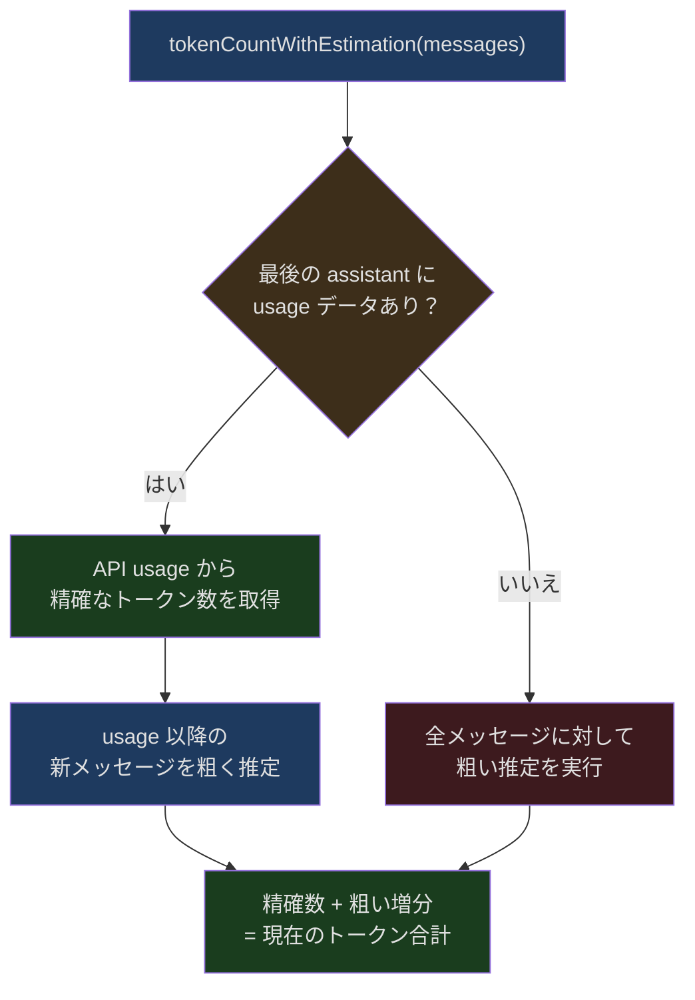
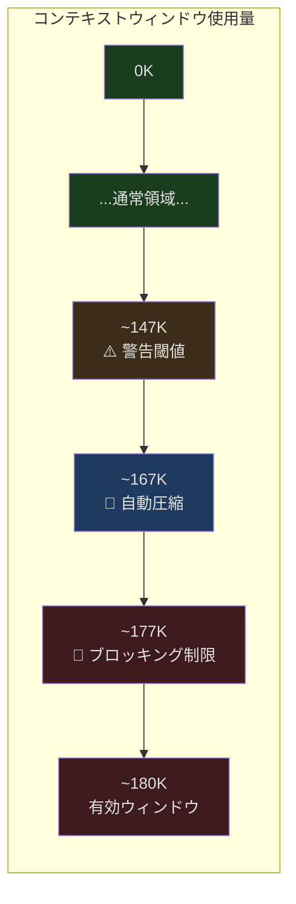
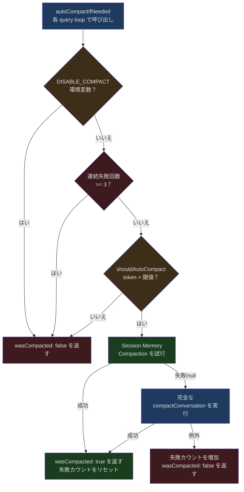
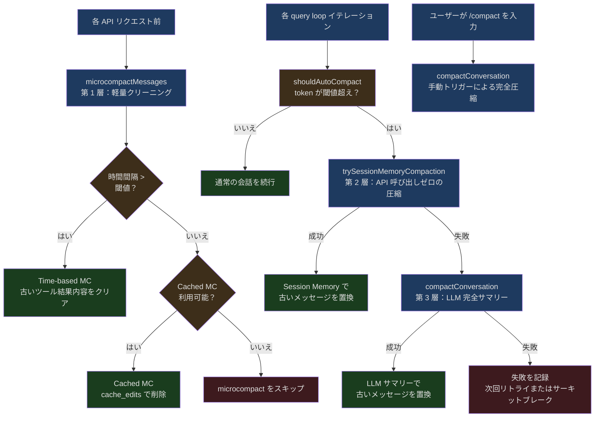

## 問題提起

典型的な Claude Code のコーディングセッションは数時間に及ぶことがあります。ユーザーがモジュールのリファクタリングを要求し、Claude が 20 ファイルを読み込み、30 回のシェルコマンドを実行し、15 回のファイル編集を行った場合、これらのインタラクションは数十万トークンの会話履歴を生成します。Claude のコンテキストウィンドウが 200K トークンに達していたとしても、密度の高いコーディングセッションでは 30-60 分でウィンドウが埋まってしまいます。

問題の核心的な矛盾は、**圧縮しなければ履歴がウィンドウを超えて会話を続けられない、しかし圧縮すれば重要な情報を失う可能性がある**ということです。例えば、ユーザーが明示的に修正したバグフィックス、特定の関数の正確なシグネチャ、あるいは「今後はこのスタイルを使って」という指示などです。

Claude Code のソリューションは単一の圧縮アルゴリズムではなく、多層・多戦略のコンテキスト管理システムです。軽量なツール結果クリーニング（microcompact）から、セッションメモリベースの高速圧縮（session memory compact）、そして完全な LLM サマリー圧縮（full compact）まで、各レイヤーが異なる圧力レベルで介入し、最小限の情報損失で会話の持続性を維持します。

本記事では、`services/compact/` ディレクトリ配下の実装を深掘りし、このシステムのエンジニアリング設計をレイヤーごとに解析します。

## トークン推定：すべての基盤

「いつ圧縮するか」を判断する前に、まず一見シンプルな問いに答える必要があります：**現在の会話はいくつのトークンを消費しているか？**

### 粗い推定 vs API の精確なカウント

Claude Code は 2 つのトークンカウント戦略を使用しています：

1. **粗い推定**：文字長をバイト/トークン比率で割る方法
2. **API 精確カウント**：Anthropic の `countTokens` API を呼び出す方法

粗い推定のコア関数は `src/services/tokenEstimation.ts` の 203-208 行にあります：

```typescript
// src/services/tokenEstimation.ts:203-208
export function roughTokenCountEstimation(
  content: string,
  bytesPerToken: number = 4,
): number {
  return Math.round(content.length / bytesPerToken)
}
```

デフォルトでは 4 バイト/トークンの比率を使用します。ただし、ファイルタイプによってこの比率を調整する必要があります。JSON ファイルには単一文字トークン（`{`、`}`、`:`、`,`、`"`）が多く含まれるため、実際の比率は 2 に近くなります：

```typescript
// src/services/tokenEstimation.ts:215-224
export function bytesPerTokenForFileType(fileExtension: string): number {
  switch (fileExtension) {
    case 'json':
    case 'jsonl':
    case 'jsonc':
      return 2
    default:
      return 4
  }
}
```

### メッセージレベルのトークン推定

完全なメッセージ配列に対する推定では、複数の content block タイプを処理する必要があります。`microCompact.ts` の `estimateMessageTokens` 関数（164-205 行）がこの複雑さを示しています：

```typescript
// src/services/compact/microCompact.ts:164-205
export function estimateMessageTokens(messages: Message[]): number {
  let totalTokens = 0

  for (const message of messages) {
    if (message.type !== 'user' && message.type !== 'assistant') {
      continue
    }

    if (!Array.isArray(message.message.content)) {
      continue
    }

    for (const block of message.message.content) {
      if (block.type === 'text') {
        totalTokens += roughTokenCountEstimation(block.text)
      } else if (block.type === 'tool_result') {
        totalTokens += calculateToolResultTokens(block)
      } else if (block.type === 'image' || block.type === 'document') {
        totalTokens += IMAGE_MAX_TOKEN_SIZE  // 固定 2000
      } else if (block.type === 'thinking') {
        totalTokens += roughTokenCountEstimation(block.thinking)
      } else if (block.type === 'tool_use') {
        totalTokens += roughTokenCountEstimation(
          block.name + jsonStringify(block.input ?? {}),
        )
      }
      // ...その他のタイプ
    }
  }

  // 4/3 を掛けて保守的な安全マージンを確保
  return Math.ceil(totalTokens * (4 / 3))
}
```

最後の `4/3` の安全係数に注目してください。粗い推定は本質的に低めに出るため、1.33 倍することで「まだ余裕があると思ったが実際にはオーバーフローしていた」という問題を回避します。

### ハイブリッド戦略：tokenCountWithEstimation

自動圧縮判断で実際に使用されるのは `tokenCountWithEstimation`（`src/utils/tokens.ts` 226 行）で、これは 2 つの戦略を組み合わせています：

1. 最後に API usage データがある assistant メッセージから精確なトークン数を取得
2. そのメッセージ以降の新しいメッセージには粗い推定を使用
3. 両者を合計して現在の合計を得る

この設計は 2 つの極端を巧みに回避しています。純粋な API カウントは遅すぎ（毎回ネットワークリクエストが必要）、純粋な粗い推定は不正確すぎます。API レスポンスに含まれる usage データをアンカーポイントとして活用し、増分部分のみを粗く推定することで、精度とパフォーマンスのバランスを実現しています。



## コンテキスト圧力検出：多段閾値体系

「いくつのトークンを使ったか」が分かったら、次の問いは：**いつ圧縮を開始すべきか？**

Claude Code は精密な多段閾値体系を定義しており、`autoCompact.ts` で実装されています。

### 有効コンテキストウィンドウ

まず、ウィンドウの全スペースが会話に使えるわけではありません。システムは出力用にスペースを確保する必要があります：

```typescript
// src/services/compact/autoCompact.ts:30-49
// p99.99 の圧縮サマリー出力が 17,387 トークンに基づく
const MAX_OUTPUT_TOKENS_FOR_SUMMARY = 20_000

export function getEffectiveContextWindowSize(model: string): number {
  const reservedTokensForSummary = Math.min(
    getMaxOutputTokensForModel(model),
    MAX_OUTPUT_TOKENS_FOR_SUMMARY,
  )
  let contextWindow = getContextWindowForModel(model, getSdkBetas())

  // テスト用に環境変数でウィンドウサイズを上書き可能
  const autoCompactWindow = process.env.CLAUDE_CODE_AUTO_COMPACT_WINDOW
  if (autoCompactWindow) {
    const parsed = parseInt(autoCompactWindow, 10)
    if (!isNaN(parsed) && parsed > 0) {
      contextWindow = Math.min(contextWindow, parsed)
    }
  }

  return contextWindow - reservedTokensForSummary
}
```

200K のコンテキストウィンドウの場合、有効スペースは約 180K になります。

### 4 段階の閾値

`calculateTokenWarningState` 関数（93-145 行）は 4 つの圧力レベルを定義しています：

```typescript
// src/services/compact/autoCompact.ts:62-65
export const AUTOCOMPACT_BUFFER_TOKENS = 13_000
export const WARNING_THRESHOLD_BUFFER_TOKENS = 20_000
export const ERROR_THRESHOLD_BUFFER_TOKENS = 20_000
export const MANUAL_COMPACT_BUFFER_TOKENS = 3_000
```

具体的な例で説明します（有効ウィンドウが 180K トークンの場合）：

| 閾値レベル | 計算方法 | 概算トークン値 | トリガー動作 |
|---------|---------|-------------|---------|
| 自動圧縮 | 有効ウィンドウ - 13,000 | ~167K | 自動圧縮フローをトリガー |
| 警告閾値 | 閾値 - 20,000 | ~147K | UI に黄色警告を表示 |
| エラー閾値 | 閾値 - 20,000 | ~147K | UI に赤色警告を表示 |
| ブロッキング制限 | 有効ウィンドウ - 3,000 | ~177K | 新規メッセージ送信をブロック、強制圧縮 |



### サーキットブレーカー

重要なエンジニアリング上の詳細として、自動圧縮は無限にリトライしません。`autoCompact.ts` の 68-70 行にサーキットブレーカーが定義されています：

```typescript
// src/services/compact/autoCompact.ts:68-70
// BQ 2026-03-10: 1,279 sessions had 50+ consecutive failures (up to 3,272)
// in a single session, wasting ~250K API calls/day globally.
const MAX_CONSECUTIVE_AUTOCOMPACT_FAILURES = 3
```

このコメントは実際の本番環境での障害を明かしています。サーキットブレーカー導入前、1,279 セッションで 50 回以上の連続圧縮失敗（最大 3,272 回！）が発生し、1 日あたり約 25 万回の API 呼び出しが無駄になっていました。現在は、3 回連続失敗でリトライを停止します：

```typescript
// src/services/compact/autoCompact.ts:257-265
if (
  tracking?.consecutiveFailures !== undefined &&
  tracking.consecutiveFailures >= MAX_CONSECUTIVE_AUTOCOMPACT_FAILURES
) {
  return { wasCompacted: false }
}
```

## /compact コマンドとリアクティブ圧縮：アクティブ vs パッシブ

Claude Code のコンテキスト圧縮には 2 つのトリガーモードがあります：

### アクティブモード：ユーザーによる手動トリガー

ユーザーが会話で `/compact` を入力し、カスタムの圧縮指示を添えることもできます（例：`/compact テスト関連のコード変更を重点的に保持`）。手動トリガー時、`compactConversation` が直接呼び出され、`isAutoCompact` パラメータは `false` です。

### パッシブモード：自動トリガー

`shouldAutoCompact` 関数（160-239 行）が自動圧縮のゲートキーパーです。複数の短絡条件があり、トリガーすべきでないシナリオでの発火を防ぎます：

```typescript
// src/services/compact/autoCompact.ts:160-239（簡略化）
export async function shouldAutoCompact(
  messages: Message[],
  model: string,
  querySource?: QuerySource,
  snipTokensFreed = 0,
): Promise<boolean> {
  // 1. 再帰防止：compact と session_memory のサブ agent はトリガーしない
  if (querySource === 'session_memory' || querySource === 'compact') {
    return false
  }

  // 2. グローバルスイッチの確認
  if (!isAutoCompactEnabled()) {
    return false
  }

  // 3. トークン計算と閾値比較
  const tokenCount = tokenCountWithEstimation(messages) - snipTokensFreed
  const threshold = getAutoCompactThreshold(model)

  const { isAboveAutoCompactThreshold } = calculateTokenWarningState(
    tokenCount, model,
  )

  return isAboveAutoCompactThreshold
}
```

最初の短絡条件は特に注目に値します。`querySource === 'compact'` は圧縮プロセス中の自己再帰を防止します。圧縮自体はフォークされた agent を通じて実行される（会話全体をコンテキストとして Claude に送信しサマリーを生成する）ため、この保護がないとフォークされた agent 自身のコンテキストも圧縮をトリガーし、無限再帰に陥る可能性があります。

### 自動圧縮の完全なフロー

`autoCompactIfNeeded` は各 query loop イテレーションで呼び出される関数です。その実行ロジックは階層的です：



優先順位に注目してください。**Session Memory Compaction が完全な LLM Compaction より優先**されます。Session Memory Compaction は追加の API 呼び出しを必要とせず、より高速で低コストだからです。

## 圧縮戦略の詳細

### 第 1 層：Microcompact——軽量なツール結果クリーニング

Microcompact は最も軽量な圧縮戦略で、LLM を一切呼び出さずに会話内の古いツール呼び出し結果を直接クリーニングします。基本的な考え方は、`FileRead`、`Bash`、`Grep` などのツールの返却結果は通常大きく（1 ファイルで数千トークンに達することも）、会話が進むにつれてこれらの結果の情報価値は減衰するということです。

#### 圧縮可能なツールタイプ

`microCompact.ts` の 41-50 行でどのツールの結果をクリーニングできるかが定義されています：

```typescript
// src/services/compact/microCompact.ts:41-50
const COMPACTABLE_TOOLS = new Set<string>([
  FILE_READ_TOOL_NAME,
  ...SHELL_TOOL_NAMES,
  GREP_TOOL_NAME,
  GLOB_TOOL_NAME,
  WEB_SEARCH_TOOL_NAME,
  WEB_FETCH_TOOL_NAME,
  FILE_EDIT_TOOL_NAME,
  FILE_WRITE_TOOL_NAME,
])
```

このセットの選択に注目してください。「読み取り型」と「出力が多い」ツールのみが含まれています。`TodoRead` や `ToolSearch` のような出力が小さく情報密度の高いツールは含まれていません。

#### 2 つの Microcompact パス

Claude Code には実際に 2 つの microcompact 実装があります：

**1. 時間ベースの Microcompact（Time-based MC）**

ユーザーがしばらく離れた後に会話を再開すると、サーバー側のプロンプトキャッシュは既に失効しており、プロンプト全体のプレフィックスが再書き込みされます。この時点で古いツール結果をクリーニングするのは「無料」です。いずれにしてもキャッシュは再構築する必要があるため、ついでにスリム化するのが得策です。

`evaluateTimeBasedTrigger` 関数（422-444 行）が時間間隔を検出します：

```typescript
// src/services/compact/microCompact.ts:438-443
const gapMinutes =
  (Date.now() - new Date(lastAssistant.timestamp).getTime()) / 60_000
if (!Number.isFinite(gapMinutes) || gapMinutes < config.gapThresholdMinutes) {
  return null
}
return { gapMinutes, config }
```

間隔が閾値を超えた場合、直近 N 個のツール結果を保持し、残りのコンテンツを `[Old tool result content cleared]` に置き換えます：

```typescript
// src/services/compact/microCompact.ts:476-483
if (
  block.type === 'tool_result' &&
  clearSet.has(block.tool_use_id) &&
  block.content !== TIME_BASED_MC_CLEARED_MESSAGE
) {
  tokensSaved += calculateToolResultTokens(block)
  touched = true
  return { ...block, content: TIME_BASED_MC_CLEARED_MESSAGE }
}
```

**2. キャッシュ編集ベースの Microcompact（Cached MC）**

これはより精巧なパスです。ローカルのメッセージ内容を変更するのではなく、API の `cache_edits` メカニズムを通じてサーバーに「キャッシュ内のこれらのツール結果を削除してください」と伝えます。これにより、プロンプトキャッシュを有効に保ちつつ、実際に送信するトークン数を削減できます。

```typescript
// src/services/compact/microCompact.ts:369-371
// Return messages unchanged - cache_reference and cache_edits
// are added at API layer
```

2 つのパスの選択ロジックは次のとおりです。時間間隔が大きい（キャッシュが冷えている）場合は time-based MC で直接内容を変更し、間隔が小さい（キャッシュがまだ温かい）場合は cached MC で API レイヤーを通じて削除します。

#### Microcompact のエントリー関数

`microcompactMessages`（253-293 行）が統合エントリーです：

```typescript
// src/services/compact/microCompact.ts:253-293（簡略化）
export async function microcompactMessages(
  messages: Message[],
  toolUseContext?: ToolUseContext,
  querySource?: QuerySource,
): Promise<MicrocompactResult> {
  // 1. まず時間トリガーのクリーニングを試行（短絡）
  const timeBasedResult = maybeTimeBasedMicrocompact(messages, querySource)
  if (timeBasedResult) {
    return timeBasedResult
  }

  // 2. 次にキャッシュ編集パスを試行
  if (feature('CACHED_MICROCOMPACT')) {
    // ...条件チェック...
    return await cachedMicrocompactPath(messages, querySource)
  }

  // 3. いずれも適用されない場合、そのまま返す
  return { messages }
}
```

### 第 2 層：Session Memory Compaction——API 呼び出しゼロの圧縮

Session Memory Compaction は巧妙な最適化です。Claude Code はバックグラウンドで「セッションメモリ」（Session Memory）を継続的に維持しており、会話中の重要な情報——ユーザーの好み、技術的な決定、エラー修正などを記録しています。圧縮が必要な場合、LLM を改めて呼び出してサマリーを生成する代わりに、この既存のメモリをサマリーとして直接使用できます。

#### 動作原理

`sessionMemoryCompact.ts` の `trySessionMemoryCompaction`（514-630 行）がコアです：

```typescript
// src/services/compact/sessionMemoryCompact.ts:514-530（簡略化）
export async function trySessionMemoryCompaction(
  messages: Message[],
  agentId?: AgentId,
  autoCompactThreshold?: number,
): Promise<CompactionResult | null> {
  if (!shouldUseSessionMemoryCompaction()) {
    return null
  }

  // 進行中のセッションメモリ抽出が完了するまで待機
  await waitForSessionMemoryExtraction()

  const lastSummarizedMessageId = getLastSummarizedMessageId()
  const sessionMemory = await getSessionMemoryContent()

  // セッションメモリがない、またはメモリが空テンプレートの場合——従来の圧縮にフォールバック
  if (!sessionMemory || await isSessionMemoryEmpty(sessionMemory)) {
    return null
  }
  // ...
}
```

#### メッセージ保持戦略

重要な設計：Session Memory Compaction はすべての古いメッセージを破棄するのではなく、最近のメッセージの一部をインテリジェントに保持します。`calculateMessagesToKeepIndex`（324-397 行）がこのロジックを実装しています：

```typescript
// src/services/compact/sessionMemoryCompact.ts:57-61
export const DEFAULT_SM_COMPACT_CONFIG: SessionMemoryCompactConfig = {
  minTokens: 10_000,        // 最低 10K トークンのメッセージを保持
  minTextBlockMessages: 5,   // 最低 5 件のテキスト内容のあるメッセージを保持
  maxTokens: 40_000,         // 最大 40K トークンを保持
}
```

保持戦略は `lastSummarizedMessageId`（前回サマリーした位置のメッセージ）から開始し、前方に拡張して最小保持条件（最低 10K トークンまたは 5 件のテキストメッセージ）を満たすまで続けますが、40K トークンの上限を超えません。

#### ツールペアの完全性保護

メッセージ保持時には微妙だが重要なエンジニアリング上の詳細があります。`tool_use`/`tool_result` のペア関係を破壊してはなりません。`adjustIndexToPreserveAPIInvariants`（232-314 行）がこの問題を処理します。

以下のシナリオを考えてみましょう：

```
Index N:   assistant, message.id: X, content: [thinking]
Index N+1: assistant, message.id: X, content: [tool_use: ORPHAN_ID]
Index N+2: assistant, message.id: X, content: [tool_use: VALID_ID]
Index N+3: user, content: [tool_result: ORPHAN_ID, tool_result: VALID_ID]
```

`startIndex = N+2` の場合、`tool_use: VALID_ID` と 2 つの `tool_result` は保持されますが、`ORPHAN_ID` の `tool_use` は破棄されたため、API は孤立した `tool_result` でエラーを返します。`adjustIndexToPreserveAPIInvariants` はこの状況を検出し、対応する `tool_use` を含めるために `startIndex` を自動的に `N+1` に調整します。

### 第 3 層：Full Compact——LLM 駆動の完全なサマリー

microcompact と session memory compaction のいずれでも問題を解決できない場合（あるいはそもそも利用できない場合）、システムは完全な LLM 圧縮を使用します。会話履歴全体を Claude に送信し、構造化されたサマリーを生成させます。

#### 圧縮プロンプトの設計

`prompt.ts` の `BASE_COMPACT_PROMPT`（61-143 行）がサマリーの構造要件を定義しています。このプロンプトは 9 つのセクションを含むサマリーの生成を要求します：

1. **Primary Request and Intent** - ユーザーの明示的なリクエストと意図
2. **Key Technical Concepts** - 重要な技術概念
3. **Files and Code Sections** - ファイルとコード断片
4. **Errors and fixes** - 遭遇したエラーと修正方法
5. **Problem Solving** - 問題解決プロセス
6. **All user messages** - すべてのユーザーメッセージ（ツール結果を除く）
7. **Pending Tasks** - 未完了のタスク
8. **Current Work** - 現在進行中の作業
9. **Optional Next Step** - オプションの次のステップ

第 6 条（「ツール結果を除くすべてのユーザーメッセージを列挙」）は特に注目に値します。その目的は、ユーザーのフィードバックや方向修正が圧縮で失われないようにすることです。これらはしばしば最も重要な情報です。

#### analysis/summary の 2 段階生成

プロンプトは巧みな 2 段階構造を使用しています。まずモデルに `<analysis>` タグ内で考えを整理させ、次に `<summary>` タグ内に最終サマリーを出力させます。`formatCompactSummary`（311-335 行）が analysis 部分を除去し、summary のみを保持します：

```typescript
// src/services/compact/prompt.ts:311-335
export function formatCompactSummary(summary: string): string {
  let formattedSummary = summary

  // analysis 部分を除去——サマリーの品質を改善するための下書きであり、
  // サマリー完成後は情報価値がない
  formattedSummary = formattedSummary.replace(
    /<analysis>[\s\S]*?<\/analysis>/,
    '',
  )

  // summary 部分を抽出してフォーマット
  const summaryMatch = formattedSummary.match(/<summary>([\s\S]*?)<\/summary>/)
  if (summaryMatch) {
    const content = summaryMatch[1] || ''
    formattedSummary = formattedSummary.replace(
      /<summary>[\s\S]*?<\/summary>/,
      `Summary:\n${content.trim()}`,
    )
  }

  return formattedSummary.trim()
}
```

この設計は LLM の特性を活用しています。先に「考える」→次に「出力する」ことで通常より高品質な結果が得られますが、思考プロセス自体は最終的なコンテキストに保持する必要はありません。

#### ツール呼び出し防止の多重保護

圧縮リクエストはフォークされた agent に送信されますが、この agent は純粋なテキストサマリーを生成し、ツールを呼び出すべきではありません。`prompt.ts` の `NO_TOOLS_PREAMBLE`（19-26 行）がツール呼び出しを防止するための厳格な指示を示しています：

```typescript
// src/services/compact/prompt.ts:19-26
const NO_TOOLS_PREAMBLE = `CRITICAL: Respond with TEXT ONLY. Do NOT call any tools.

- Do NOT use Read, Bash, Grep, Glob, Edit, Write, or ANY other tool.
- You already have all the context you need in the conversation above.
- Tool calls will be REJECTED and will waste your only turn — you will fail the task.
- Your entire response must be plain text: an <analysis> block followed by a <summary> block.

`
```

さらにプロンプトの末尾にも `NO_TOOLS_TRAILER` で再度強調しています：

```typescript
// src/services/compact/prompt.ts:269-272
const NO_TOOLS_TRAILER =
  '\n\nREMINDER: Do NOT call any tools. Respond with plain text only — ' +
  'an <analysis> block followed by a <summary> block. ' +
  'Tool calls will be rejected and you will fail the task.'
```

コメント（16-17 行）がなぜこれほど強硬な指示が必要かを説明しています。Sonnet 4.6+ の adaptive-thinking モデルでは、`maxTurns: 1` だけでは不十分で、モデルが 2.79% の確率でツール呼び出しを試みます（4.5 版の 0.01% と比較）。拒否されたツール呼び出しはテキスト出力がないことを意味し、圧縮全体が失敗します。

#### Partial Compact：部分圧縮

全量圧縮に加えて、Claude Code は部分圧縮もサポートしています。ユーザーはメッセージを分割点として選択し、その前後の一部のみを圧縮できます。`partialCompactConversation`（`compact.ts` 772 行以降）が 2 つの方向を実装しています：

- **`from`**：選択したメッセージ以降を圧縮し、それ以前を保持。プロンプトキャッシュは有効なまま。
- **`up_to`**：選択したメッセージ以前を圧縮し、それ以降を保持。プロンプトキャッシュは失効（プレフィックスが変わるため）。

#### Prompt-Too-Long リトライ

圧縮リクエスト自体もコンテキスト長超過で失敗する可能性があります（矛盾しているようですが完全にあり得ます。会話が長すぎて圧縮 agent へのリクエスト送信すら限界を超えるケースです）。`truncateHeadForPTLRetry`（243-291 行）がこの状況を処理します：

```typescript
// src/services/compact/compact.ts:243-291（簡略化）
export function truncateHeadForPTLRetry(
  messages: Message[],
  ptlResponse: AssistantMessage,
): Message[] | null {
  const groups = groupMessagesByApiRound(input)
  if (groups.length < 2) return null

  // API が返すトークンギャップに基づいて破棄するグループ数を計算
  const tokenGap = getPromptTooLongTokenGap(ptlResponse)
  let dropCount: number
  if (tokenGap !== undefined) {
    // 精確な破棄：トークンギャップに基づいて計算
    let acc = 0
    dropCount = 0
    for (const g of groups) {
      acc += roughTokenCountEstimationForMessages(g)
      dropCount++
      if (acc >= tokenGap) break
    }
  } else {
    // 保守的な破棄：グループの 20% を破棄
    dropCount = Math.max(1, Math.floor(groups.length * 0.2))
  }

  // サマリー生成のために最低 1 グループは保持
  dropCount = Math.min(dropCount, groups.length - 1)
  // ...
}
```

最大 3 回リトライ（`MAX_PTL_RETRIES = 3`）し、毎回会話の先頭部分を破棄します。これは有損ですが、少なくともユーザーは作業を続けられます。

## ファイルキャッシュと重複排除：readFileState

Claude Code は圧縮後に重要なファイルのコンテキストを復元する必要があります。`readFileState` は LRU キャッシュで、会話中に読み取ったファイルの内容とタイムスタンプを記録しています。

### FileStateCache の設計

`src/utils/fileStateCache.ts` がパス正規化付きの LRU キャッシュを実装しています：

```typescript
// src/utils/fileStateCache.ts:30-43
export class FileStateCache {
  private cache: LRUCache<string, FileState>

  constructor(maxEntries: number, maxSizeBytes: number) {
    this.cache = new LRUCache<string, FileState>({
      max: maxEntries,
      maxSize: maxSizeBytes,
      sizeCalculation: value => Math.max(1, Buffer.byteLength(value.content)),
    })
  }

  get(key: string): FileState | undefined {
    return this.cache.get(normalize(key))
  }
  // ...
}
```

重要な設計上の決定：

1. **二重制限**：最大 100 エントリー、合計サイズ最大 25MB。`sizeCalculation` はファイル内容のバイト長を基準とし、巨大ファイル 1 つでキャッシュがあふれるのを防ぎます。
2. **パス正規化**：すべての `get`/`set`/`has`/`delete` 操作が `normalize(key)` でパスを処理し、`/foo/../bar` と `/bar` が同じキャッシュエントリーにヒットすることを保証します。
3. **部分ビューマーカー**：`isPartialView` フィールドは、自動注入された（CLAUDE.md など）が内容が不完全なエントリーをマークします。HTML コメントが除去され、frontmatter が省略され、MEMORY.md が切り詰められたものです。Edit/Write ツールはこのマーカーを見ると、先に明示的な Read の実行を要求します。

### 圧縮後のファイル復元

`compactConversation` は圧縮前にファイル状態のスナップショットを保存し、圧縮後に最も重要なファイルを選択的に復元します：

```typescript
// src/services/compact/compact.ts:517-521
// 圧縮前に現在のファイル状態を保存
const preCompactReadFileState = cacheToObject(context.readFileState)

// キャッシュをクリア
context.readFileState.clear()
context.loadedNestedMemoryPaths?.clear()
```

復元時にはバジェット制限があります（`compact.ts` 122-130 行）：

```typescript
// src/services/compact/compact.ts:122-130
export const POST_COMPACT_MAX_FILES_TO_RESTORE = 5
export const POST_COMPACT_TOKEN_BUDGET = 50_000
export const POST_COMPACT_MAX_TOKENS_PER_FILE = 5_000
export const POST_COMPACT_MAX_TOKENS_PER_SKILL = 5_000
export const POST_COMPACT_SKILLS_TOKEN_BUDGET = 25_000
```

最大 5 ファイルを復元、合計バジェット 50K トークン、1 ファイルあたり 5K トークンまでです。この設計により、圧縮後のコンテキストがファイル復元で再び膨張することを防ぎます。

### FILE_UNCHANGED_STUB：重複排除の最適化

圧縮後にモデルが以前読んだファイルを再読み込みし、内容が変わっていない場合、`FileReadTool` は完全な内容を返さず、プレースホルダー `FILE_UNCHANGED_STUB` を返します。これにより、コンテキスト内に同じ大きなファイル内容が重複して現れるのを回避します。

## システムプロンプトのトークンバジェット

システムプロンプトは毎回の API リクエストで送信されるため、消費するトークンは会話に利用可能なスペースに直接影響します。Claude Code は慎重なバジェット管理でこのオーバーヘッドを制御しています。

圧縮時に出力用に確保するスペース（`autoCompact.ts` 29-30 行）は実データに基づいています：

```typescript
// src/services/compact/autoCompact.ts:29-30
// p99.99 の圧縮サマリー出力が 17,387 トークンに基づく
const MAX_OUTPUT_TOKENS_FOR_SUMMARY = 20_000
```

p99.99 は、99.99% のケースで圧縮サマリーの出力が 17,387 トークンを超えないことを意味します。20,000 トークンの確保で追加の安全マージンを提供しています。

圧縮後のサマリーフォーマットもトークン効率を考慮しています。`getCompactUserSummaryMessage`（`prompt.ts` 337-374 行）が生成するサマリーメッセージには以下が含まれます：

1. フォーマット済みのサマリー本文
2. transcript ファイルパス（必要に応じて完全な履歴を読める）
3. 最近のメッセージが保持されたかどうかのマーカー
4. 続行指示（自動圧縮時にモデルに「質問せず直接続行」と伝える）

```typescript
// src/services/compact/prompt.ts:345-349
let baseSummary = `This session is being continued from a previous conversation
that ran out of context. The summary below covers the earlier portion of the
conversation.

${formattedSummary}`
```

## 圧縮後のクリーンアップとステートリセット

圧縮は「サマリーで古いメッセージを置き換える」だけでは済みません。`runPostCompactCleanup`（`postCompactCleanup.ts`）と `compactConversation` 自身が大量のポストプロセス作業を行います：

1. **Prompt Cache Break Detection**：キャッシュ監視システムに「圧縮を行ったので、次のキャッシュミスは正常であり、アラートを出さないように」と通知
2. **Session Metadata の再追加**：セッションタイトル、タグなどのメタデータを transcript 末尾に追記し、`--resume` コマンドがセッション名を正しく表示できるようにする
3. **ツール発見状態の移行**：`preCompactDiscoveredTools` で圧縮前に発見された動的ツールリストを保存し、圧縮後もモデルがこれらのツールを使用できるようにする
4. **Hook の実行**：`PreCompact` hooks、`SessionStart` hooks、`PostCompact` hooks を順次実行
5. **Microcompact ステートのリセット**：時間トリガーの microcompact が cached MC のグローバルステートをリセットし、もう存在しないキャッシュエントリーの編集を試みることを回避

## 圧縮戦略の階層アーキテクチャ

完全な図で圧縮システム全体の階層関係をまとめましょう：



## ツール呼び出しサマリー（Tool Use Summaries）

圧縮過程において、ツール呼び出しと結果の処理は最も複雑な部分の 1 つです。典型的な Claude Code セッションでは、ツール呼び出しがトークン総量の 70-80% を占めることがあります。1 回の `FileRead` は数千行のコードを返し、1 回の `Bash` は大量のコンパイルログを出力する可能性があります。

### 画像とドキュメントの除去

`stripImagesFromMessages`（`compact.ts` 145-200 行）は、圧縮 agent に送信する前にすべての画像とドキュメントブロックを除去し、テキストマーカー `[image]` や `[document]` に置き換えます。理由は実際的です。画像はテキストサマリー生成には役立ちませんが、圧縮リクエスト自体がトークン制限を超える原因になりかねません。

```typescript
// src/services/compact/compact.ts:157-161
const newContent = content.flatMap(block => {
  if (block.type === 'image') {
    hasMediaBlock = true
    return [{ type: 'text' as const, text: '[image]' }]
  }
  // ...
})
```

### API ラウンドのグルーピング

`groupMessagesByApiRound`（`grouping.ts`）は API ラウンドごとにメッセージをグループ化します。これは「ユーザーメッセージ」でグループ化するよりきめ細かい方法です。SDK/CCR などのシナリオでは、ワークロード全体がユーザーメッセージ 1 件だけで数十の API ラウンドを持つ場合があります。グループ境界は、新しい assistant `message.id` が出現した時点で定義されます。

このグルーピングは 2 箇所で使用されます：
1. Prompt-too-long リトライ時にどれだけの履歴を破棄するか決定
2. Reactive compact でラウンドごとに段階的にコンテキストを削減

### 圧縮後のコンテキスト再構築

圧縮完了後、新しいメッセージシーケンスは以下を含みます：

1. **Compact Boundary Marker** - 圧縮が発生した位置を示すシステムメッセージ
2. **Summary Messages** - フォーマット済みのサマリー
3. **Messages to Keep** - 保持された最近のメッセージ（Session Memory Compact 独自）
4. **File Attachments** - 復元された重要なファイル
5. **Hook Results** - SessionStart hooks の出力（CLAUDE.md の内容など）

この順序は入念に設計されています。boundary marker が最前面にあることで、後続のローダーが圧縮ポイントを素早く特定できます。サマリーがその直後に続き、保持されたメッセージにコンテキストを提供します。ファイルアタッチメントと hook 結果は最後に配置され、最新の作業環境情報を提供します。

## 移植可能なパターン

Claude Code のコンテキスト管理戦略には、他の LLM アプリケーションに移植可能な汎用パターンが複数含まれています：

### 1. ハイブリッドトークンカウント

API カウントだけ（遅すぎる）やヒューリスティック推定だけ（不正確すぎる）に頼らないでください。API レスポンスに含まれる usage データをアンカーポイントとして活用し、増分部分のみ推定します。このパターンはリアルタイムのトークンバジェットが必要なあらゆるシナリオに適用可能です。

### 2. 多段閾値 + 段階的圧縮

異なる圧力レベルで異なる圧縮戦略をトリガーします：

- **低圧力**（microcompact）：古いツール出力をクリーニング、情報損失はほぼゼロ
- **中圧力**（session memory）：既存の構造化メモリを活用、追加 API コストなし
- **高圧力**（full compact）：LLM を呼び出して包括的なサマリーを生成、情報損失はあるが最も徹底的

単一の「閾値に達したら圧縮」よりもはるかに柔軟です。

### 3. サーキットブレーカーパターン

失敗する可能性のある自動化操作（圧縮に限らず）に対して、最大連続失敗回数を設定し、無効なリトライによるリソース浪費を回避します。Claude Code の 3 回失敗でのサーキットブレークは本番データ（1 日 25 万回の無効な API 呼び出し）に基づいて調整されたものです。

### 4. 分析-出力の分離

モデルにまず下書き領域で分析させ、それから最終結果を出力させます。XML タグで 2 つのフェーズを区別し、最終的には出力部分のみを保持します。このパターンは高品質な LLM 出力が必要なあらゆるシナリオに適用可能です。

### 5. ツールペアの完全性保護

メッセージのトリミングを伴うあらゆる操作で、`tool_use`/`tool_result` のペア関係が破壊されないことを保証する必要があります。これは Claude API のハードコンストレイントですが、同じ原則は function calling を使用するすべての LLM アプリケーションに当てはまります。すべての tool_result にはコンテキスト内に対応する tool_use が必要です。

### 6. 圧縮後のステート復元

圧縮はメッセージの置き換えだけではありません。以下を考慮する必要があります：
- キャッシュ失効通知（誤報アラートの回避）
- ファイル状態の復元（作業コンテキストの維持）
- Hook の再実行（環境設定の復元）
- メタデータの移行（セッション識別の維持）

### 7. キャッシュライフサイクルの活用

Time-based microcompact は次の洞察を活用しています。プロンプトキャッシュが時間経過により既に失効している場合、メッセージ内容の変更コストはゼロです（どのみち再書き込みする必要があるため）。プロンプトキャッシングを伴うシステムを設計する際は、キャッシュのコールド/ホット状態が操作コストに与える影響を常に考慮すべきです。

## まとめ

Claude Code のコンテキスト管理システムは精密な多層エンジニアリングです：

- **トークン推定**層はハイブリッド戦略で精度とパフォーマンスのバランスを取ります
- **圧力検出**層は 4 段階の閾値で段階的な対応を実現します
- **Microcompact** 層は最低コストでツール結果の膨張を処理します
- **Session Memory Compact** 層は既存の構造化メモリを活用し追加 API 呼び出しを回避します
- **Full Compact** 層は入念に設計されたプロンプトで高品質な有損圧縮を保証します
- **ステート復元**層は圧縮が作業環境の連続性を破壊しないことを保証します

各レイヤーの設計はすべて本番環境の経験から生まれています。p99.99 データ駆動のバッファサイズ、実際の障害に基づくサーキットブレーカー、モデルバージョン固有の防御措置。これは理論上のエレガントなアーキテクチャではなく、数百万ユーザー規模で磨き上げられた実用的なエンジニアリングです。

次の記事では、Claude Code の起動パフォーマンス最適化を探ります。大規模利用において同様に重要なエンジニアリングの課題です。
