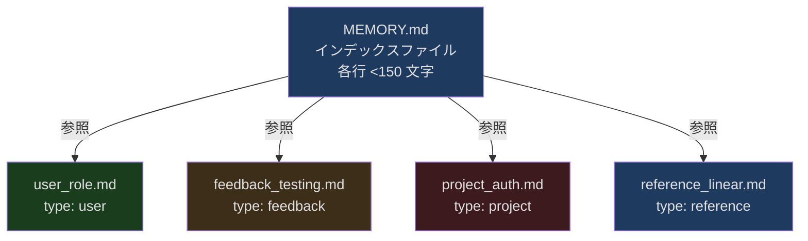
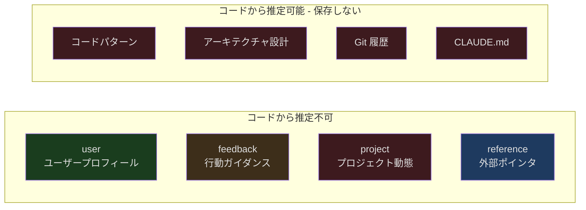
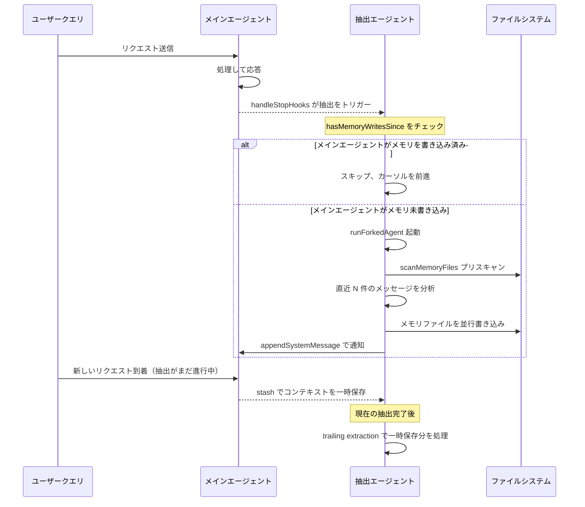
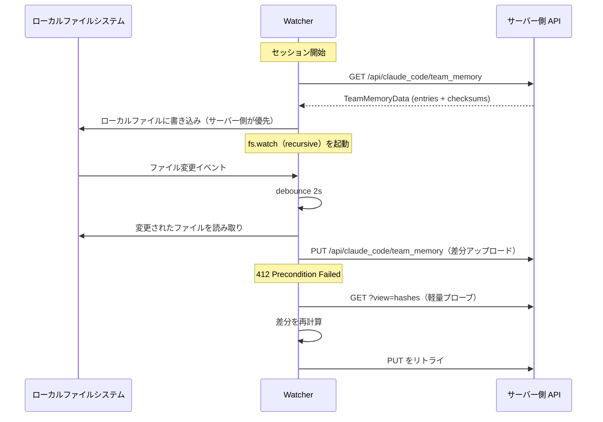
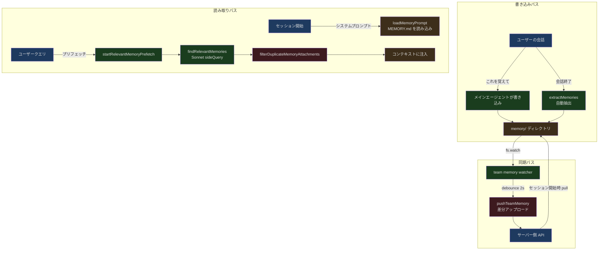

## 問題提起

新しい会話を始めるたびに、AIはゼロからスタートします。あなたが誰なのか、プロジェクトでどんな技術スタックを使っているのか、前回どんな行動を修正したのかを一切知りません。「テストで mock を使わないで」「私はバックエンドエンジニアだから、CSS 入門の話は要らない」「PR は develop ブランチに出して」と何度も繰り返し伝えなければなりません。これは対話ではなく、記憶喪失のアシスタントを毎回再教育しているようなものです。

Claude Code のメモリシステム（内部コードネーム `memdir`、つまり memory directory）は、この問題を根本的に解決します。ファイルシステム上に構造化された永続メモリを維持し、新しいセッションの開始時にあなたの好み、プロジェクトコンテキスト、過去のフィードバックを読み込めるようにします。さらに、会話中に**自動的に**記憶すべき内容を抽出する機能も備えており、「これを覚えて」と手動で指示する必要はありません。

この記事では、`src/memdir/` と `src/services/extractMemories/` のソースコードを深掘りし、このシステムの設計と実装を階層ごとに解説します。

## memdir ファイルシステム設計：二階層構造

Claude Code のメモリはデータベースに格納されているわけでも、JSON blob にシリアライズされているわけでもありません。**ファイルシステムがデータベース**という設計を採用しており、各メモリは独立した Markdown ファイルとして存在し、インデックスファイル `MEMORY.md` で連結されています。

### ディレクトリレイアウト

```
~/.claude/projects/<sanitized-project-root>/memory/
  MEMORY.md                    # インデックスファイル、各行がポインタ
  user_role.md                 # 個別メモリファイル
  feedback_testing.md           # 個別メモリファイル
  project_auth_rewrite.md      # 個別メモリファイル
  reference_linear_project.md  # 個別メモリファイル
  team/                        # チーム共有メモリ（feature flag で制御）
    MEMORY.md
    feedback_no_mocks.md
    project_merge_freeze.md
```

このパスは `src/memdir/paths.ts` の `getAutoMemPath()` で計算されます：

```typescript
// src/memdir/paths.ts, 第 223-235 行
export const getAutoMemPath = memoize(
  (): string => {
    const override = getAutoMemPathOverride() ?? getAutoMemPathSetting()
    if (override) {
      return override
    }
    const projectsDir = join(getMemoryBaseDir(), 'projects')
    return (
      join(projectsDir, sanitizePath(getAutoMemBase()), AUTO_MEM_DIRNAME) + sep
    ).normalize('NFC')
  },
  () => getProjectRoot(),
)
```

パス計算の優先順位は明確です：

1. `CLAUDE_COWORK_MEMORY_PATH_OVERRIDE` 環境変数——Cowork シナリオでのフルパスオーバーライド
2. `settings.json` の `autoMemoryDirectory`——ユーザーレベルの設定（`~/` 展開をサポート）
3. デフォルトパス `~/.claude/projects/<sanitized-git-root>/memory/`

ここで `findCanonicalGitRoot` を使用して、同じリポジトリのすべての worktree が同一のメモリディレクトリを共有するようにしている点に注目してください。これは細かいですが重要な設計判断です。

### MEMORY.md：コンテンツではなくインデックス

`MEMORY.md` はプレーンテキストのインデックスファイルで、各行が具体的なメモリファイルへのリンクです。フォーマット要件は厳格です：

```markdown
- [ユーザーロール](user_role.md) — バックエンドエンジニア、Go に精通、React 初心者
- [テスト戦略フィードバック](feedback_testing.md) — インテグレーションテストで mock を使わない
- [Auth リライトプロジェクト](project_auth_rewrite.md) — コンプライアンス駆動、技術的負債ではない
- [Linear プロジェクト追跡](reference_linear_project.md) — pipeline bugs は INGEST プロジェクトに
```

各行は約 150 文字以内で、タイトルと一行のフック説明のみを記載します。**`MEMORY.md` にメモリの内容を直接書くことは絶対にありません**——内容は個別ファイルに配置されます。

この二階層構造の設計動機は実践的なものです：`MEMORY.md` は毎回のセッション開始時に**完全にコンテキストに読み込まれる**ため、コンパクトに保つ必要があります。すべてのメモリ内容を詰め込むと、すぐにコンテキストウィンドウを圧迫してしまいます。



### MEMORY.md の制約：200 行 / 25KB

インデックスファイルは無限に成長できるわけではありません。`src/memdir/memdir.ts` に二つのハード制約が定義されています：

```typescript
// src/memdir/memdir.ts, 第 34-38 行
export const ENTRYPOINT_NAME = 'MEMORY.md'
export const MAX_ENTRYPOINT_LINES = 200
// ~125 chars/line at 200 lines. At p97 today; catches long-line indexes that
// slip past the line cap (p100 observed: 197KB under 200 lines).
export const MAX_ENTRYPOINT_BYTES = 25_000
```

200 行が行数上限、25KB がバイト上限です。両者は独立した制約です。行数が 200 未満でも、各行が非常に長く合計バイト数が 25KB を超えた場合にもトランケーションが発生します。このバイト上限のコメントは理由を明示しています：200 行以下なのに合計 197KB のインデックスファイルを作った人がいたからです（各行が非常に長かった）。

トランケーションロジックは `truncateEntrypointContent()` で実装されています：

```typescript
// src/memdir/memdir.ts, 第 57-103 行
export function truncateEntrypointContent(raw: string): EntrypointTruncation {
  const trimmed = raw.trim()
  const contentLines = trimmed.split('\n')
  const lineCount = contentLines.length
  const byteCount = trimmed.length

  const wasLineTruncated = lineCount > MAX_ENTRYPOINT_LINES
  const wasByteTruncated = byteCount > MAX_ENTRYPOINT_BYTES

  if (!wasLineTruncated && !wasByteTruncated) {
    return {
      content: trimmed,
      lineCount,
      byteCount,
      wasLineTruncated,
      wasByteTruncated,
    }
  }

  let truncated = wasLineTruncated
    ? contentLines.slice(0, MAX_ENTRYPOINT_LINES).join('\n')
    : trimmed

  if (truncated.length > MAX_ENTRYPOINT_BYTES) {
    const cutAt = truncated.lastIndexOf('\n', MAX_ENTRYPOINT_BYTES)
    truncated = truncated.slice(0, cutAt > 0 ? cutAt : MAX_ENTRYPOINT_BYTES)
  }

  // ...WARNING メッセージを構築
  return {
    content:
      truncated +
      `\n\n> WARNING: ${ENTRYPOINT_NAME} is ${reason}. Only part of it was loaded...`,
    // ...
  }
}
```

トランケーション戦略には工夫があります：まず行単位でトランケート（自然な境界）し、その後バイト数がまだ超過している場合は、上限の直前にある最後の改行文字でカットして**行の途中を切断しない**ようにします。トランケーション後には末尾に WARNING を追加し、インデックスがトランケートされたことをモデルに通知し、コンパクトに保つよう促します。

## 4 種類のメモリタイプ

メモリは区別のないテキストの塊ではありません。Claude Code は閉じた四類型分類法（closed four-type taxonomy）を定義しており、各タイプには明確な保存タイミング、使用方法、内容構造があります：

```typescript
// src/memdir/memoryTypes.ts, 第 14-19 行
export const MEMORY_TYPES = [
  'user',
  'feedback',
  'project',
  'reference',
] as const

export type MemoryType = (typeof MEMORY_TYPES)[number]
```

### user：ユーザーに関する認識

ユーザーの役割、目標、責任、知識背景を記録します。核心的な目的は、AI がユーザーのプロフィールに基づいて行動を調整できるようにすることです。熟練のバックエンドエンジニアとプログラミング初心者に対する協力の仕方はまったく異なるべきです。

**保存タイミング**：ユーザーの役割、好み、責任範囲、または知識領域を把握したとき。

**使用シナリオ**：ユーザーのプロフィールに基づいて作業を調整する必要があるとき。例えば、ユーザーがコードの説明を求めた場合、その背景知識に応じて説明の深さと角度を選択する必要があります。

**例**：
```
ユーザー: Go を10年書いてきたけど、このリポジトリの React コードに触るのは初めてです
AI: [user メモリを保存：豊富な Go 経験、React 初心者——バックエンドのアナロジーでフロントエンドの概念を説明する]
```

### feedback：行動ガイダンス

AI の作業方法に対するユーザーのフィードバックを記録します——**修正と肯定の両方**を含みます。この点は特に重要です：修正だけを記録すると、AI はますます保守的になり、ユーザーが実際に認めた手法を繰り返すことを恐れるようになります。

**保存タイミング**：ユーザーがやり方を修正したとき（「そうしないで」）、または自明でないやり方が正しいと確認したとき（「その通り、続けて」）。

**内容構造**：まずルール自体を書き、次に **Why:** 行（ユーザーが提示した理由）、さらに **How to apply:** 行（このルールがどのシナリオで有効か）を記載します。「なぜ」を知ることで、エッジケースでも正しい判断ができるようになります。

**例**：
```
ユーザー: これらのテストでデータベースを mock しないで——前四半期に mock テストは全部通ったのに、本番環境のマイグレーションが壊れた
AI: [feedback メモリを保存：インテグレーションテストでは実データベースを使用。Why: mock/本番の差異によるマイグレーション障害。How to apply: データベースに関するすべてのテストファイル]
```

### project：プロジェクトの動態

進行中の作業、目標、バグ、インシデントに関する情報を記録します——これらは**コードや git 履歴からは推定できない**情報です。

**保存タイミング**：誰が何をしているか、なぜか、締め切りはいつかを把握したとき。相対日付は絶対日付に変換する必要があります（「来週の木曜日」→「2026-04-02」）。時間が経過しても理解できるようにするためです。

**例**：
```
ユーザー: 木曜日以降、クリティカルでないマージをすべて凍結——モバイルチームが release ブランチを切る
AI: [project メモリを保存：2026-04-02 からマージ凍結。Why: モバイルの release ブランチ切り]
```

### reference：外部リソースへのポインタ

外部システム内の情報の場所を指すポインタを格納します——AI が最新情報をどこで探すべきかを知るためです。

**例**：
```
ユーザー: pipeline のバグは Linear の "INGEST" プロジェクトで追跡している
AI: [reference メモリを保存：pipeline bugs は Linear プロジェクト "INGEST" で管理]
```

### タイプ解析

タイプ情報はパーサー関数によって検証され、レガシーファイルや未知のタイプを優雅に処理します：

```typescript
// src/memdir/memoryTypes.ts, 第 28-31 行
export function parseMemoryType(raw: unknown): MemoryType | undefined {
  if (typeof raw !== 'string') return undefined
  return MEMORY_TYPES.find(t => t === raw)
}
```

無効または欠落したタイプは `undefined` を返します。古いファイルがクラッシュすることはなく、新しいファイルに誤ったタイプがあっても優雅にデグレードするだけです。



### 保存すべきでないもの

コードパターン、プロジェクト構造、アーキテクチャ設計、git 履歴、デバッグ手法、CLAUDE.md に既に記載されている内容、一時的なタスク状態——これらはすべて「現在のプロジェクト状態から推定可能な」情報であり、メモリとして保存すべきではありません。ユーザーが PR リストや活動サマリーの保存を明示的に求めた場合でも、「この中で**予想外**または**自明でない**部分は何ですか？」と尋ねるべきです。その部分だけが保存に値します。

## Frontmatter メタデータ形式

各メモリファイルは標準的な YAML frontmatter を使用します：

```markdown
---
name: {{メモリ名}}
description: {{一行の説明——将来の会話で関連性を判断するために使用されるので、具体的に}}
type: {{user, feedback, project, reference}}
---

{{メモリ内容——feedback/project タイプはルール/事実 + **Why:** + **How to apply:** の構造推奨}}
```

`description` フィールドは特に重要です。人間向けの説明であるだけでなく、メモリ検索システム（`findRelevantMemories`）が現在のクエリに対するメモリの関連性を判断するための核心的な根拠でもあります。良い description はコンテキストを区別できるほど具体的であるべきです。例えば「テストでデータベース mock を使わない——コンプライアンスマイグレーション失敗の教訓」であって「テスト関連のフィードバック」ではありません。

frontmatter の形式例は `memoryTypes.ts` で定義されています：

```typescript
// src/memdir/memoryTypes.ts, 第 261-271 行
export const MEMORY_FRONTMATTER_EXAMPLE: readonly string[] = [
  '```markdown',
  '---',
  'name: {{memory name}}',
  'description: {{one-line description — used to decide relevance...}}',
  `type: {{${MEMORY_TYPES.join(', ')}}}`,
  '---',
  '',
  '{{memory content — for feedback/project types, structure as: ...}}',
  '```',
]
```

## メモリスキャンとディレクトリ管理

### memoryScan：メモリファイルのスキャン

`src/memdir/memoryScan.ts` はディレクトリスキャンのプリミティブを提供し、検索と抽出の両方のパスで共有されます：

```typescript
// src/memdir/memoryScan.ts, 第 13-19 行
export type MemoryHeader = {
  filename: string
  filePath: string
  mtimeMs: number
  description: string | null
  type: MemoryType | undefined
}
```

`scanMemoryFiles()` はディレクトリ内のすべての `.md` ファイルを再帰的にスキャン（`MEMORY.md` は除外）し、各ファイルの先頭 30 行の frontmatter を読み取り、更新時刻の降順でソートして最大 200 件を返します：

```typescript
// src/memdir/memoryScan.ts, 第 35-77 行
export async function scanMemoryFiles(
  memoryDir: string,
  signal: AbortSignal,
): Promise<MemoryHeader[]> {
  try {
    const entries = await readdir(memoryDir, { recursive: true })
    const mdFiles = entries.filter(
      f => f.endsWith('.md') && basename(f) !== 'MEMORY.md',
    )

    const headerResults = await Promise.allSettled(
      mdFiles.map(async (relativePath): Promise<MemoryHeader> => {
        const filePath = join(memoryDir, relativePath)
        const { content, mtimeMs } = await readFileInRange(
          filePath, 0, FRONTMATTER_MAX_LINES, undefined, signal,
        )
        const { frontmatter } = parseFrontmatter(content, filePath)
        return {
          filename: relativePath,
          filePath,
          mtimeMs,
          description: frontmatter.description || null,
          type: parseMemoryType(frontmatter.type),
        }
      }),
    )

    return headerResults
      .filter((r): r is PromiseFulfilledResult<MemoryHeader> =>
        r.status === 'fulfilled')
      .map(r => r.value)
      .sort((a, b) => b.mtimeMs - a.mtimeMs)
      .slice(0, MAX_MEMORY_FILES)
  } catch {
    return []
  }
}
```

設計のハイライト：`readFileInRange` を使用して各ファイルの先頭 30 行のみを読み取り、ファイル全体を読む必要はありません。さらに `readFileInRange` は内部で `mtimeMs` を返すため、追加の `stat` 呼び出しが不要になります。一般的なケース（N <= 200）では、システムコールの数が半減します。

スキャン結果はテキストマニフェストとしてフォーマットすることもでき、検索と抽出のプロンプトで使用されます：

```typescript
// src/memdir/memoryScan.ts, 第 84-94 行
export function formatMemoryManifest(memories: MemoryHeader[]): string {
  return memories
    .map(m => {
      const tag = m.type ? `[${m.type}] ` : ''
      const ts = new Date(m.mtimeMs).toISOString()
      return m.description
        ? `- ${tag}${m.filename} (${ts}): ${m.description}`
        : `- ${tag}${m.filename} (${ts})`
    })
    .join('\n')
}
```

### ensureMemoryDirExists：ディレクトリの保証

セッションごとに一度だけ呼ばれ（`systemPromptSection` のキャッシュを通じて）、メモリディレクトリの存在を保証します。これにより、モデルがファイルを書き込む際に `mkdir` やディレクトリの存在確認を行う必要がなくなります：

```typescript
// src/memdir/memdir.ts, 第 129-147 行
export async function ensureMemoryDirExists(memoryDir: string): Promise<void> {
  const fs = getFsImplementation()
  try {
    await fs.mkdir(memoryDir)
  } catch (e) {
    const code =
      e instanceof Error && 'code' in e && typeof e.code === 'string'
        ? e.code
        : undefined
    logForDebugging(
      `ensureMemoryDirExists failed for ${memoryDir}: ${code ?? String(e)}`,
      { level: 'debug' },
    )
  }
}
```

プロンプト内ではモデルに対して「ディレクトリは既に存在します——Write ツールで直接書き込んでください。mkdir の実行や存在確認は不要です」と明示的に伝えています：

```typescript
// src/memdir/memdir.ts, 第 116-119 行
export const DIR_EXISTS_GUIDANCE =
  'This directory already exists — write to it directly with the Write tool ' +
  '(do not run mkdir or check for its existence).'
```

このコメントが説明する理由は：「Claude は以前、ファイルを書き込む前に数ターンかけて `ls` や `mkdir -p` を実行していた」からです。

## 自動メモリ抽出：extractMemories

これはメモリシステムの中で最も精巧な部分です。Claude Code は「これを覚えて」と手動で指示する必要はありません。バックグラウンドエージェントが各会話終了時に会話内容を自動分析し、永続化すべきメモリを抽出します。

### トリガータイミング

抽出エージェントは、完全なクエリサイクルの終了時（モデルが最終回答を出力し、ツール呼び出しがなくなった時点）に `handleStopHooks` を通じて実行されます：

```typescript
// src/services/extractMemories/extractMemories.ts, 第 598-603 行
export async function executeExtractMemories(
  context: REPLHookContext,
  appendSystemMessage?: AppendSystemMessageFn,
): Promise<void> {
  await extractor?.(context, appendSystemMessage)
}
```

### メインエージェントとの排他制御

重要な設計として、抽出エージェントとメインエージェントの**排他関係**があります。メインエージェントが会話中にメモリファイルを書き込んだ場合、抽出エージェントはその範囲をスキップし、カーソルのみを前進させます：

```typescript
// src/services/extractMemories/extractMemories.ts, 第 121-148 行
function hasMemoryWritesSince(
  messages: Message[],
  sinceUuid: string | undefined,
): boolean {
  let foundStart = sinceUuid === undefined
  for (const message of messages) {
    if (!foundStart) {
      if (message.uuid === sinceUuid) {
        foundStart = true
      }
      continue
    }
    if (message.type !== 'assistant') {
      continue
    }
    const content = (message as AssistantMessage).message.content
    if (!Array.isArray(content)) {
      continue
    }
    for (const block of content) {
      const filePath = getWrittenFilePath(block)
      if (filePath !== undefined && isAutoMemPath(filePath)) {
        return true
      }
    }
  }
  return false
}
```

この排他制御により重複書き込みが回避されます。メインエージェントが書いたメモリを、バックグラウンドエージェントが再度書くことはありません。

### Forked Agent モード

抽出エージェントは `runForkedAgent` で実行されます。これはメインの会話の「完全なフォーク」であり、親のプロンプトキャッシュを共有します。つまり、抽出エージェントは会話履歴全体を再送信する必要がなく、トークンコストを大幅に節約できます：

```typescript
// src/services/extractMemories/extractMemories.ts, 第 415-427 行
const result = await runForkedAgent({
  promptMessages: [createUserMessage({ content: userPrompt })],
  cacheSafeParams,
  canUseTool,
  querySource: 'extract_memories',
  forkLabel: 'extract_memories',
  skipTranscript: true,
  maxTurns: 5,
})
```

`maxTurns: 5` のハード制限に注意してください。これは抽出エージェントが「検証のウサギの穴」に陥るのを防ぎます（例えば、あるパターンが本当に存在するか確認するためにソースコードを読みに行くなど）。

### ツール権限サンドボックス

抽出エージェントには `createAutoMemCanUseTool` で定義された厳格なツール権限制限があります：

- **許可**：`FileRead`、`Grep`、`Glob`（読み取り専用）
- **許可**：読み取り専用の `Bash` コマンド（ls、find、cat、stat など）
- **許可**：`FileEdit`、`FileWrite`——ただしメモリディレクトリ内のパスに限定
- **拒否**：その他すべてのツール（MCP、Agent、書き込み系 Bash など）

```typescript
// src/services/extractMemories/extractMemories.ts, 第 171-222 行
export function createAutoMemCanUseTool(memoryDir: string): CanUseToolFn {
  return async (tool: Tool, input: Record<string, unknown>) => {
    // Read/Grep/Glob を許可
    if (tool.name === FILE_READ_TOOL_NAME ||
        tool.name === GREP_TOOL_NAME ||
        tool.name === GLOB_TOOL_NAME) {
      return { behavior: 'allow' as const, updatedInput: input }
    }

    // Bash は読み取り専用コマンドのみ許可
    if (tool.name === BASH_TOOL_NAME) {
      const parsed = tool.inputSchema.safeParse(input)
      if (parsed.success && tool.isReadOnly(parsed.data)) {
        return { behavior: 'allow' as const, updatedInput: input }
      }
      return denyAutoMemTool(tool, 'Only read-only shell commands...')
    }

    // Write/Edit はメモリディレクトリ内のパスのみ許可
    if ((tool.name === FILE_EDIT_TOOL_NAME ||
         tool.name === FILE_WRITE_TOOL_NAME) &&
        'file_path' in input) {
      const filePath = input.file_path
      if (typeof filePath === 'string' && isAutoMemPath(filePath)) {
        return { behavior: 'allow' as const, updatedInput: input }
      }
    }

    return denyAutoMemTool(tool, `only ... are allowed`)
  }
}
```

### 抽出プロンプトの設計

抽出エージェントが受け取るプロンプトは `src/services/extractMemories/prompts.ts` で構築されます。完全なタイプ分類法、保存ルール、そして重要な最適化——**既存メモリマニフェストのプリインジェクション**が含まれています：

```typescript
// src/services/extractMemories/prompts.ts, 第 29-44 行
function opener(newMessageCount: number, existingMemories: string): string {
  const manifest =
    existingMemories.length > 0
      ? `\n\n## Existing memory files\n\n${existingMemories}\n\n` +
        `Check this list before writing — update an existing file ` +
        `rather than creating a duplicate.`
      : ''
  return [
    `You are now acting as the memory extraction subagent. ` +
    `Analyze the most recent ~${newMessageCount} messages above...`,
    '',
    `Available tools: FileRead, Grep, Glob, read-only Bash, ` +
    `and FileEdit/FileWrite for paths inside the memory directory only.`,
    '',
    `You have a limited turn budget. FileEdit requires a prior FileRead, ` +
    `so the efficient strategy is: turn 1 — issue all FileRead calls in ` +
    `parallel; turn 2 — issue all FileWrite/FileEdit calls in parallel.`,
    // ...
  ].join('\n')
}
```

抽出プロンプトには厳格な制約もあります：「直近の約 N 件のメッセージの内容**のみ**を使用してメモリを更新できます。その内容を調査・検証するためにターンを消費しないでください——ソースコードを grep したり、パターンを確認するためにコードを読んだり、git コマンドを実行したりしないでください。」

### 並行制御とメッセージマージ

抽出システムには精巧な並行制御があります。抽出が進行中に新しいリクエストが到着すると、そのリクエストは一時保存（stash）され、現在の抽出完了後に「trailing extraction」として実行されます：



### 抽出頻度のスロットリング

抽出は毎ターン実行されるわけではありません。feature flag `tengu_bramble_lintel` でインターバルを制御しています（デフォルトは eligible ターンごとに 1 回）：

```typescript
// src/services/extractMemories/extractMemories.ts, 第 377-385 行
if (!isTrailingRun) {
  turnsSinceLastExtraction++
  if (
    turnsSinceLastExtraction <
    (getFeatureValue_CACHED_MAY_BE_STALE('tengu_bramble_lintel', null) ?? 1)
  ) {
    return
  }
}
turnsSinceLastExtraction = 0
```

## メモリ注入のタイミング

メモリが会話コンテキストに読み込まれるパスは二つあります：

### パス 1：システムプロンプト注入（MEMORY.md インデックス）

`loadMemoryPrompt()` はシステムプロンプト構築時に呼び出され、`MEMORY.md` の内容（トランケーション処理済み）をシステムプロンプトに注入します。これは毎回のセッション開始時の最初のメモリ読み込みです：

```typescript
// src/memdir/memdir.ts, 第 419-507 行
export async function loadMemoryPrompt(): Promise<string | null> {
  const autoEnabled = isAutoMemoryEnabled()

  // KAIROS ログモードを優先
  if (feature('KAIROS') && autoEnabled && getKairosActive()) {
    return buildAssistantDailyLogPrompt(skipIndex)
  }

  // TEAMMEM モード：プライベートとチームメモリを同時に読み込み
  if (feature('TEAMMEM')) {
    if (teamMemPaths!.isTeamMemoryEnabled()) {
      const autoDir = getAutoMemPath()
      const teamDir = teamMemPaths!.getTeamMemPath()
      await ensureMemoryDirExists(teamDir)
      return teamMemPrompts!.buildCombinedMemoryPrompt(extraGuidelines, skipIndex)
    }
  }

  // 標準モード：個人メモリのみ読み込み
  if (autoEnabled) {
    const autoDir = getAutoMemPath()
    await ensureMemoryDirExists(autoDir)
    return buildMemoryLines('auto memory', autoDir, extraGuidelines, skipIndex)
      .join('\n')
  }

  return null
}
```

### パス 2：関連メモリのプリフェッチ（個別メモリファイル）

`MEMORY.md` インデックスは常に読み込まれますが、個別メモリファイルの内容がすべて読み込まれるわけではありません。それではコンテキストが無駄になります。代わりに、ユーザーの現在のクエリに基づいて最も関連性の高いメモリを**選択的にプリフェッチ**します。

このプロセスは `startRelevantMemoryPrefetch()` によって駆動されます：

```typescript
// src/utils/attachments.ts, 第 2361-2424 行
export function startRelevantMemoryPrefetch(
  messages: ReadonlyArray<Message>,
  toolUseContext: ToolUseContext,
): MemoryPrefetch | undefined {
  if (!isAutoMemoryEnabled() || !getFeatureValue_CACHED_MAY_BE_STALE(...)) {
    return undefined
  }

  const lastUserMessage = messages.findLast(m => m.type === 'user' && !m.isMeta)
  if (!lastUserMessage) {
    return undefined
  }

  const input = getUserMessageText(lastUserMessage)
  // 単語クエリは十分なコンテキストがない
  if (!input || !/\s/.test(input.trim())) {
    return undefined
  }

  const surfaced = collectSurfacedMemories(messages)
  if (surfaced.totalBytes >= RELEVANT_MEMORIES_CONFIG.MAX_SESSION_BYTES) {
    return undefined
  }

  // 非同期プリフェッチ、メインクエリをブロックしない
  const promise = getRelevantMemoryAttachments(
    input,
    toolUseContext.options.agentDefinitions.activeAgents,
    toolUseContext.readFileState,
    collectRecentSuccessfulTools(messages, lastUserMessage),
    controller.signal,
    surfaced.paths,
  )
  // ...
}
```

プリフェッチの重要な設計ポイント：

1. **ノンブロッキング**：プリフェッチは非同期で、メインクエリループをブロックしません
2. **中断可能**：ターンレベルの AbortController にリンクされており、ユーザーが Escape を押すと即座にキャンセルできます
3. **Disposable パターン**：`using` キーワードでバインドされ、query loop のすべての終了パス（return、throw、.return()）で自動クリーンアップされます
4. **セッションレベルのバイト上限**：長いセッションでメモリが無限に注入されるのを防ぎます

### findRelevantMemories：AI 駆動のメモリ検索

メモリファイルの選択はキーワードマッチングではありません。Sonnet モデルの sideQuery を使って、どのメモリが現在のクエリに最も関連しているかを判断します：

```typescript
// src/memdir/findRelevantMemories.ts, 第 39-75 行
export async function findRelevantMemories(
  query: string,
  memoryDir: string,
  signal: AbortSignal,
  recentTools: readonly string[] = [],
  alreadySurfaced: ReadonlySet<string> = new Set(),
): Promise<RelevantMemory[]> {
  const memories = (await scanMemoryFiles(memoryDir, signal)).filter(
    m => !alreadySurfaced.has(m.filePath),
  )
  if (memories.length === 0) {
    return []
  }

  const selectedFilenames = await selectRelevantMemories(
    query, memories, signal, recentTools,
  )
  // ...
  return selected.map(m => ({ path: m.filePath, mtimeMs: m.mtimeMs }))
}
```

セレクターのシステムプロンプトは正確に定義されています：

```typescript
// src/memdir/findRelevantMemories.ts, 第 18-24 行
const SELECT_MEMORIES_SYSTEM_PROMPT = `You are selecting memories that will be
useful to Claude Code as it processes a user's query. You will be given the
user's query and a list of available memory files with their filenames and
descriptions.

Return a list of filenames for the memories that will clearly be useful
(up to 5). Only include memories that you are certain will be helpful...`
```

セレクターは「最近成功したツール」のリストも受け取り、**使用中のツールの参考ドキュメントを除外**します（ノイズになるため）。ただし、それらのツールに関する警告や既知の問題は保持します（使用中にこそ必要な情報だから）。

## メモリの重複排除

メモリ注入時には重複排除の工程があります。モデルが既に読んだメモリが重複して注入されるのを防ぐためです。これは `filterDuplicateMemoryAttachments()` で実装されています：

```typescript
// src/utils/attachments.ts, 第 2520-2541 行
export function filterDuplicateMemoryAttachments(
  attachments: Attachment[],
  readFileState: FileStateCache,
): Attachment[] {
  return attachments
    .map(attachment => {
      if (attachment.type !== 'relevant_memories') return attachment
      const filtered = attachment.memories.filter(
        m => !readFileState.has(m.path),
      )
      for (const m of filtered) {
        readFileState.set(m.path, {
          content: m.content,
          timestamp: m.mtimeMs,
          offset: undefined,
          limit: m.limit,
        })
      }
      return filtered.length > 0 ? { ...attachment, memories: filtered } : null
    })
    .filter((a): a is Attachment => a !== null)
}
```

ここにはソースコードのコメントで特に言及されている微妙なバグの修正があります：

> The mark-after-filter ordering is load-bearing: readMemoriesForSurfacing used to write to readFileState during the prefetch, which meant the filter saw every prefetch-selected path as "already in context" and dropped them all (self-referential filter).
>
> *（訳：「マーク後フィルタリング」の順序は重要です。readMemoriesForSurfacing は以前プリフェッチ中に readFileState に書き込んでいたため、フィルターがすべてのプリフェッチ選択パスを「既にコンテキストにある」と見なしてすべて除外していました（自己参照フィルター）。）*

以前の実装はプリフェッチ段階で `readFileState` に書き込んでいたため、フィルターがチェックする時にすべてのプリフェッチされたメモリが「既にコンテキストにある」と判定され、自分自身を除外してしまっていました。修正方法は、書き込みをフィルタリングの後に遅延させることです。

## メモリの鮮度と更新戦略

### 時間認識

`src/memdir/memoryAge.ts` は人間が読みやすい時間ラベルを提供します：

```typescript
// src/memdir/memoryAge.ts, 第 6-19 行
export function memoryAgeDays(mtimeMs: number): number {
  return Math.max(0, Math.floor((Date.now() - mtimeMs) / 86_400_000))
}

export function memoryAge(mtimeMs: number): string {
  const d = memoryAgeDays(mtimeMs)
  if (d === 0) return 'today'
  if (d === 1) return 'yesterday'
  return `${d} days ago`
}
```

なぜタイムスタンプを ISO 形式ではなく「47 日前」に変換するのでしょうか。モデルは日付の算術が苦手だからです。`2026-02-12T08:33:00Z` を見ても「これはずいぶん前のものだ」とは自動的に認識しませんが、「47 days ago」を見ると即座に鮮度に関する推論が始まります。

### 古さの警告注入

1 日以上前のメモリには古さの警告が付加されます：

```typescript
// src/memdir/memoryAge.ts, 第 33-42 行
export function memoryFreshnessText(mtimeMs: number): string {
  const d = memoryAgeDays(mtimeMs)
  if (d <= 1) return ''
  return (
    `This memory is ${d} days old. ` +
    `Memories are point-in-time observations, not live state — ` +
    `claims about code behavior or file:line citations may be outdated. ` +
    `Verify against current code before asserting as fact.`
  )
}
```

この警告の動機はユーザーレポートに由来します：古いコード状態のメモリ（file:line 参照を含む）が事実として断言され、参照があることで古い主張がより権威的に見えてしまう（本来はより信頼性が低いはずなのに）という問題です。

### 断言よりも検証を優先

システムプロンプトの `TRUSTING_RECALL_SECTION` は、メモリに基づいて推奨する前にまず検証するようモデルに求めます：

```typescript
// src/memdir/memoryTypes.ts, 第 240-256 行
export const TRUSTING_RECALL_SECTION: readonly string[] = [
  '## Before recommending from memory',
  '',
  'A memory that names a specific function, file, or flag is a claim that ' +
  'it existed *when the memory was written*. It may have been renamed, ' +
  'removed, or never merged. Before recommending it:',
  '',
  '- If the memory names a file path: check the file exists.',
  '- If the memory names a function or flag: grep for it.',
  '- If the user is about to act on your recommendation: verify first.',
  '',
  '"The memory says X exists" is not the same as "X exists now."',
]
```

コメントには eval 検証結果が記録されています：このテキストのタイトルを「Trusting what you recall」から「Before recommending from memory」に変更した後、eval が 0/3 から 3/3 に向上しました。**タイトルの言い回しがモデルの行動トリガーに影響した**のです。

## チームメモリ同期

`TEAMMEM` feature flag を有効にすると、メモリシステムはデュアルディレクトリ構造に拡張されます：

```
~/.claude/projects/<project>/memory/
  MEMORY.md              # プライベートインデックス
  user_role.md           # プライベートメモリ
  feedback_terse.md      # プライベートメモリ
  team/                  # チーム共有
    MEMORY.md            # チームインデックス
    feedback_no_mocks.md # チームメモリ
    project_freeze.md    # チームメモリ
```

### チームパス

チームメモリディレクトリは個人メモリディレクトリのサブディレクトリです：

```typescript
// src/memdir/teamMemPaths.ts, 第 84-86 行
export function getTeamMemPath(): string {
  return (join(getAutoMemPath(), 'team') + sep).normalize('NFC')
}
```

### デュアルディレクトリプロンプト

チームメモリが有効な場合、プロンプトには両方のディレクトリの説明が含まれ、各メモリタイプには配置先を指示する `<scope>` タグが付きます：

- `user` タイプ：**常にプライベート**（個人のプロフィールは共有すべきでない）
- `feedback` タイプ：**デフォルトはプライベート**。ただしプロジェクトレベルの規約（テスト戦略など）は明らかに例外
- `project` タイプ：**チーム寄り**
- `reference` タイプ：**通常はチーム**

### 同期メカニズム

`src/services/teamMemorySync/` が完全な同期メカニズムを実装しています：



同期セマンティクス：

- **Pull（取得）**：サーバー側の内容がキーごとにローカルファイルを上書き（server wins）
- **Push（送信）**：コンテンツハッシュがサーバーと異なるキーのみアップロード（差分アップロード）。サーバーは upsert セマンティクスを使用し、PUT に含まれないキーは保持されます
- **削除は伝播しない**：ローカルでファイルを削除してもサーバーからは削除されず、次回の pull で復元されます

### ファイル監視

watcher は `fs.watch({ recursive: true })` を使用します：

```typescript
// src/services/teamMemorySync/watcher.ts, 第 167-228 行
async function startFileWatcher(teamDir: string): Promise<void> {
  // ...
  watcher = watch(
    teamDir,
    { persistent: true, recursive: true },
    (_eventType, filename) => {
      if (pushSuppressedReason !== null) {
        // unlink のみが抑制を解除できる
        void stat(join(teamDir, filename)).catch((err) => {
          if (err.code !== 'ENOENT') return
          pushSuppressedReason = null
          schedulePush()
        })
        return
      }
      schedulePush()
    },
  )
}
```

なぜ chokidar を使わないのでしょうか。コメントで説明されています：chokidar 4+ は fsevents サポートを廃止し、Bun の `fs.watch` フォールバックは kqueue を使用します。これは監視対象のファイルごとに 1 つの fd を必要とします。500+ のチームメモリファイルがあれば、500+ のファイルディスクリプタが恒久的に占有されます。`recursive: true` は macOS では FSEvents（O(1) fd）、Linux では inotify（O(サブディレクトリ数)）を使用します。

### セキュリティ保護

チームメモリはユーザー間での共有に関わるため、セキュリティが極めて重要です。`teamMemPaths.ts` は多層のパスセキュリティチェックを実装しています：

1. **パスインジェクション防護**：`sanitizePathKey()` が null バイト、URL エンコードによるトラバーサル（`%2e%2e%2f`）、Unicode 正規化攻撃、バックスラッシュ、絶対パスをチェックします
2. **シンボリックリンク防護**：`realpathDeepestExisting()` がシンボリックリンクを実パスに解決し、シンボリックリンク経由でチームディレクトリ外に脱出するのを防ぎます
3. **ダングリングシンボリックリンク検出**：`lstat` で「本当に存在しない」と「シンボリックリンクのターゲットが存在しない」を区別します
4. **シークレットスキャン**：`scanForSecrets()` が gitleaks ルールを使用して API キー、認証情報などの機密データを検出し、プッシュをブロックします

### 永続的失敗の抑制

回復不可能な理由でプッシュが失敗した場合（OAuth なし、404、413 など）、watcher は後続のリトライを抑制し、無限リトライループを防ぎます。かつて OAuth のないデバイスが 2.5 日間で 167,000 回のプッシュイベントを生成した事例がありました。

```typescript
// src/services/teamMemorySync/watcher.ts, 第 61-73 行
export function isPermanentFailure(r: TeamMemorySyncPushResult): boolean {
  if (r.errorType === 'no_oauth' || r.errorType === 'no_repo') return true
  if (
    r.httpStatus !== undefined &&
    r.httpStatus >= 400 &&
    r.httpStatus < 500 &&
    r.httpStatus !== 409 &&  // 409 は一時的な競合
    r.httpStatus !== 429     // 429 はレート制限
  ) {
    return true
  }
  return false
}
```

## メモリシステムの完全なライフサイクル



## 移植可能なパターン

メモリシステムの設計には、暗黙的ですが重要な特性があります：**移植可能性**です。

すべてのメモリが標準的な Markdown ファイルであり、ファイルシステムの確定的なパスに格納され、統一された frontmatter 形式を持つため：

1. **デバイス間の移行**：`~/.claude/projects/` ディレクトリをコピーするだけですべてのメモリを移行できます
2. **バージョン管理**：メモリディレクトリを git 管理に含めることが可能です（デフォルトではそうしていませんが）
3. **バックアップとリストア**：標準的なファイルシステムバックアップツールで対応できます
4. **一括編集**：任意のテキストエディタで直接メモリを編集できます
5. **プログラマティックな操作**：スクリプトで frontmatter 形式のファイルを直接読み書きできます
6. **クロスツール互換性**：他のツールもこの形式を読み取って理解できます

プライベートなデータベースフォーマットも、暗号化された blob も、特定の API が必要なストレージもありません。これは意図的な設計選択です。クエリ効率（SQLite と比較して）を多少犠牲にして、透明性と操作性を得ています。

### パスの安全性と設定可能性

パスシステムの設定可能性にも注目すべきです。`paths.ts` の `validateMemoryPath()` はパスに対して厳格なセキュリティ検証を行います：

```typescript
// src/memdir/paths.ts, 第 109-150 行
function validateMemoryPath(
  raw: string | undefined,
  expandTilde: boolean,
): string | undefined {
  if (!raw) return undefined
  let candidate = raw
  if (expandTilde && (candidate.startsWith('~/') || candidate.startsWith('~\\'))) {
    const rest = candidate.slice(2)
    const restNorm = normalize(rest || '.')
    if (restNorm === '.' || restNorm === '..') {
      return undefined  // $HOME またはその親への展開を拒否
    }
    candidate = join(homedir(), rest)
  }
  const normalized = normalize(candidate).replace(/[/\\]+$/, '')
  if (
    !isAbsolute(normalized) ||
    normalized.length < 3 ||
    /^[A-Za-z]:$/.test(normalized) ||     // Windows ルートドライブ
    normalized.startsWith('\\\\') ||       // UNC パス
    normalized.startsWith('//') ||
    normalized.includes('\0')              // null バイト
  ) {
    return undefined
  }
  return (normalized + sep).normalize('NFC')
}
```

セキュリティに関するコメントが特に重要です：`projectSettings`（リポジトリにコミットされる `.claude/settings.json`）は**意図的に除外されています**。悪意のあるリポジトリが `autoMemoryDirectory: "~/.ssh"` を設定して、機密ディレクトリへの書き込み権限を取得する可能性があるからです。`policySettings`、`localSettings`、`userSettings` という信頼できるソースからの設定のみが受け入れられます。

## 特殊モード：KAIROS アシスタントログ

`feature('KAIROS')` が有効でアシスタントモードで実行している場合、メモリシステムはログモードに切り替わります。アシスタントセッションは実質的に継続実行されるため、エージェントは `MEMORY.md` インデックスを維持せず、日付で名前付けされたログファイルに追記方式で書き込みます：

```
~/.claude/projects/<project>/memory/logs/2026/03/2026-03-31.md
```

各ログエントリはタイムスタンプ付きの短い要点です。`MEMORY.md` インデックスは独立した `/dream` スキルによって夜間にログから蒸留生成されます。

このモードの設計動機は：継続実行セッションでは、リアルタイムにインデックスを維持するコストが高すぎること、そしてログは自然に時系列で並ぶため、整理にインデックスが不要であることです。蒸留プロセスは低負荷時に実行でき、より深いレベルの整理が可能です。

## メモリの無効化

メモリシステムは複数の階層で無効化できます：

```typescript
// src/memdir/paths.ts, 第 30-55 行
export function isAutoMemoryEnabled(): boolean {
  const envVal = process.env.CLAUDE_CODE_DISABLE_AUTO_MEMORY
  if (isEnvTruthy(envVal)) return false         // 環境変数で無効化
  if (isEnvDefinedFalsy(envVal)) return true     // 環境変数で明示的に有効化
  if (isEnvTruthy(process.env.CLAUDE_CODE_SIMPLE)) return false  // --bare モード
  if (isEnvTruthy(process.env.CLAUDE_CODE_REMOTE) &&
      !process.env.CLAUDE_CODE_REMOTE_MEMORY_DIR) return false   // リモートでストレージなし
  const settings = getInitialSettings()
  if (settings.autoMemoryEnabled !== undefined) {
    return settings.autoMemoryEnabled
  }
  return true  // デフォルトは有効
}
```

優先順位：環境変数 > `--bare` モード > リモートモード検出 > settings.json > デフォルト有効。

## 設計からの示唆

Claude Code のメモリシステムには、深く考える価値のある設計判断がいくつかあります。

**ファイルシステムがデータベース**。SQLite、LevelDB、その他の組み込みデータベースを使わず、ファイルシステムを直接使用しています。これは「原始的」に見えますが、デバッグ可能性（`cat` で直接確認）、移植可能性（ディレクトリのコピー）、操作性（任意のエディタで編集可能）をもたらします。メモリエントリが通常 200 個以下で、各ファイルが数 KB を超えないシステムでは、ファイルシステムのパフォーマンスで十分です。

**閉じた型分類法**。4 種類のみで、各タイプには「何を保存すべきか、何を保存すべきでないか」の明確なガイダンスがあります。これにより、モデルがあらゆる情報をメモリとして保存しようとする傾向を防いでいます。特に「コードから推定可能な内容はメモリとして保存しない」というルールがメモリの膨張を効果的に防止しています。

**AI 駆動の検索**。メモリ検索はキーワードマッチングやベクトル検索ではなく、別の AI（Sonnet）に frontmatter の description を見せて関連性を判断させています。メモリ数が比較的少ない（< 200）場合、これは非常に効果的です。各メモリの description は意味的に豊富な自然言語であり、AI はキーワードマッチングよりも正確な判断ができます。

**Eval 駆動のプロンプト反復**。コードのコメントでは、特定の言い回しの選択を説明するために eval の結果が繰り返し引用されています。例えば、セクションタイトルを「Trusting what you recall」から「Before recommending from memory」に変更するだけで eval が 0/3 から 3/3 に向上しました。メモリシステムの振る舞いはプロンプトエンジニアリングによって大きく左右され、プロンプトの言い回しの選択には定量的な検証が必要であることを示しています。

**排他的な書き込みパス**。メインエージェントと抽出エージェントの排他設計は重複メモリを防ぎますが、メインエージェントが会話中にメモリを書き込んだ場合、同じ会話内の他の記憶すべき内容を見逃していても、抽出エージェントは補完しないことも意味します。その範囲は既に処理済みと見なされるからです。これは意図的なトレードオフです：冗長と欠落の間で、欠落を選択しています。

このシステムは実際にどう機能しているのでしょうか。ソースコード中に散在するテレメトリイベントや eval への参照から見ると、大量の実験と反復を経てきたことがわかります。メモリは単なるエンジニアリングの問題ではなく、プロダクト設計の問題でもあります。何を記憶し、何を記憶せず、いつ思い出させ、いつ沈黙するか——これらの判断がユーザー体験に直接影響します。Claude Code のメモリシステムは、実戦で検証された一つの答えを提示しています。
