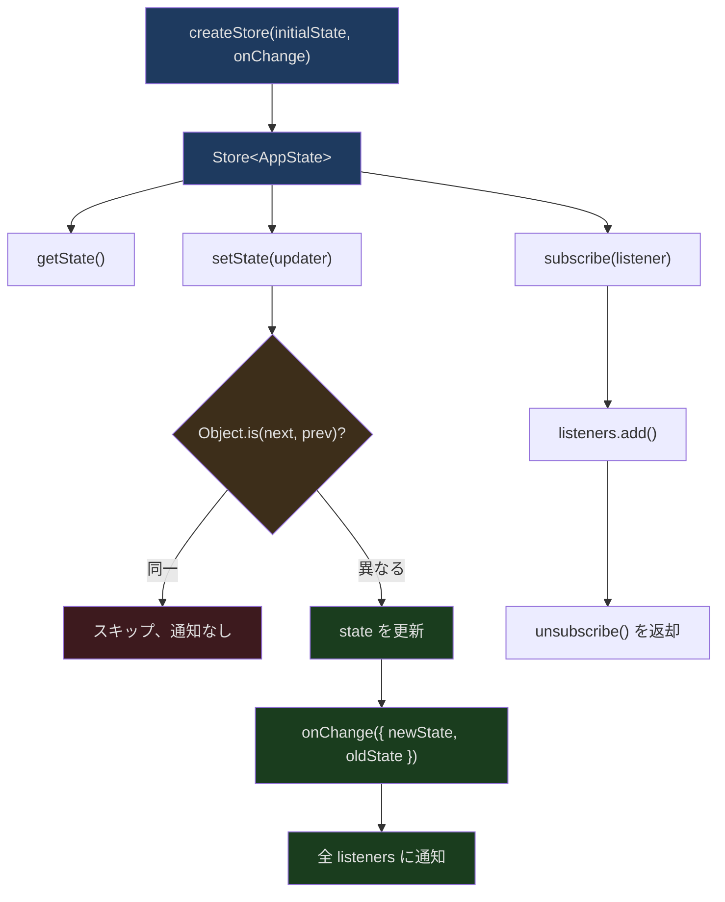
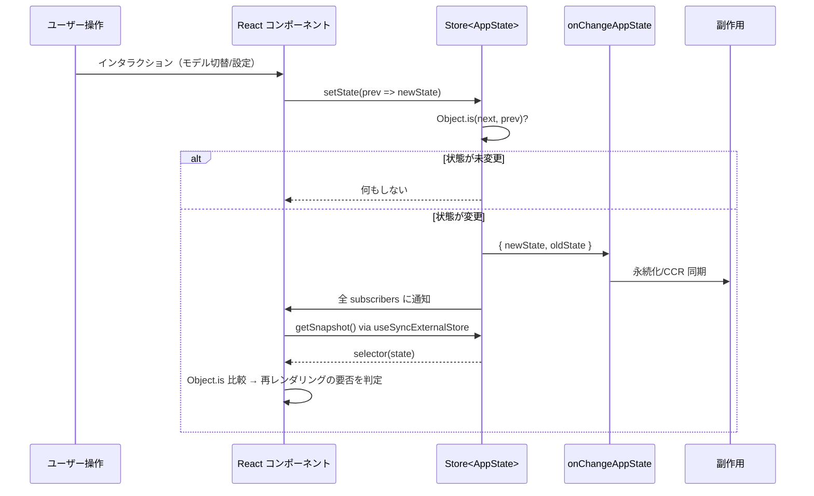
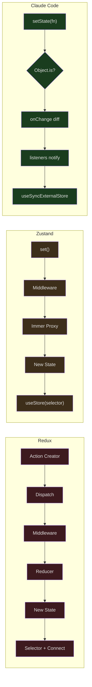

## 問題提起

React の状態管理はフロントエンドエンジニアリングにおける永遠のテーマです。Redux から MobX、Zustand から Jotai まで、状態管理ライブラリは次々と登場しています。しかし Claude Code は意外な道を選びました——サードパーティライブラリを一切導入せず、わずか 35 行未満のコードで完全な状態管理システムを実装しているのです。

これはおもちゃのコードではありません。Claude Code の `AppState` は 80 以上のフィールドを持ち、設定、MCP 接続、プラグイン、権限、ブリッジ状態、チーム連携など多岐にわたります。35 行の Store がこれほど巨大な状態ツリーをどのように支えているのか？なぜ Redux を採用しなかったのか？その背後にあるトレードオフを見ていきましょう。

## Store の完全な実装

まずコードを見てみましょう。以下が `src/state/store.ts` の全内容です：

```typescript
// src/state/store.ts
// 行 1-34
type Listener = () => void
type OnChange<T> = (args: { newState: T; oldState: T }) => void

export type Store<T> = {
  getState: () => T
  setState: (updater: (prev: T) => T) => void
  subscribe: (listener: Listener) => () => void
}

export function createStore<T>(
  initialState: T,
  onChange?: OnChange<T>,
): Store<T> {
  let state = initialState
  const listeners = new Set<Listener>()

  return {
    getState: () => state,

    setState: (updater: (prev: T) => T) => {
      const prev = state
      const next = updater(prev)
      if (Object.is(next, prev)) return
      state = next
      onChange?.({ newState: next, oldState: prev })
      for (const listener of listeners) listener()
    },

    subscribe: (listener: Listener) => {
      listeners.add(listener)
      return () => listeners.delete(listener)
    },
  }
}
```

34 行です。middleware なし、devtools なし、immer なし。なぜこれだけで十分なのか、各層を詳しく分析していきます。

## アーキテクチャ概観



### 3 つのコア API

1. **`getState()`** — 現在の状態スナップショットを同期的に取得します。オーバーヘッドはゼロです。
2. **`setState(updater)`** — 純粋関数 `(prev) => next` を受け取ります。`Object.is(next, prev)` が true の場合は何もしません。
3. **`subscribe(listener)`** — 引数なしのコールバックを登録し、購読解除関数を返します。

これは `useSyncExternalStore` のコントラクトと完璧に一致します——React 18 はまさにこのような外部 Store 向けにこの Hook を設計しました。

## Object.is による変更検知：1 行に込められた深い意味

```typescript
// src/state/store.ts 行 23
if (Object.is(next, prev)) return
```

この 1 行はシンプルに見えますが、非常に重要な意味を持っています。

`Object.is` は参照等価比較を行います——`updater` が同じオブジェクト参照を返した場合、状態は変化していないとみなされます。これが意味することは：

1. **イミュータブルな更新が強制される**。状態を変更したい場合は新しいオブジェクトを返す必要があります：`prev => ({ ...prev, verbose: true })`
2. **変更がない場合のコストはゼロ**。updater 内部で更新不要と判断した場合、`return prev` するだけで Store は一切通知を発行しません。
3. **ディープ比較のオーバーヘッドがない**。Redux の `shallowEqual` や Zustand の `Object.is` selector 比較と異なり、Claude Code はこのチェックを最上位に配置しています。

実際の最適化事例として、`src/state/teammateViewHelpers.ts` の `enterTeammateView` を見てみましょう：

```typescript
// src/state/teammateViewHelpers.ts 行 51-80
export function enterTeammateView(
  taskId: string,
  setAppState: (updater: (prev: AppState) => AppState) => void,
): void {
  logEvent('tengu_transcript_view_enter', {})
  setAppState(prev => {
    const task = prev.tasks[taskId]
    const prevId = prev.viewingAgentTaskId
    const prevTask = prevId !== undefined ? prev.tasks[prevId] : undefined
    const switching =
      prevId !== undefined &&
      prevId !== taskId &&
      isLocalAgent(prevTask) &&
      prevTask.retain
    const needsRetain =
      isLocalAgent(task) && (!task.retain || task.evictAfter !== undefined)
    const needsView =
      prev.viewingAgentTaskId !== taskId ||
      prev.viewSelectionMode !== 'viewing-agent'
    // 重要：何も変更する必要がなければ、prev をそのまま返す
    if (!needsRetain && !needsView && !switching) return prev
    // ...新しい状態を構築
  })
}
```

66 行目の `if (!needsRetain && !needsView && !switching) return prev` はよく見られるパターンです——updater 内部で条件判定を行い、不要な状態更新を回避します。`Object.is` チェックにより、`prev` を返すことは副作用ゼロを意味します。

## React Context と useSyncExternalStore

Store の消費側は `src/state/AppState.tsx` に実装されています。

### Provider 層

```typescript
// src/state/AppState.tsx 行 27-28, 37-110
export const AppStoreContext = React.createContext<AppStateStore | null>(null)

export function AppStateProvider({ children, initialState, onChangeAppState }) {
  // ネストを防止
  const hasAppStateContext = useContext(HasAppStateContext)
  if (hasAppStateContext) {
    throw new Error("AppStateProvider can not be nested within another AppStateProvider")
  }

  const [store] = useState(
    () => createStore(initialState ?? getDefaultAppState(), onChangeAppState)
  )

  // 初回マウント時に bypass permissions の状態をチェック
  useEffect(() => {
    const { toolPermissionContext } = store.getState()
    if (toolPermissionContext.isBypassPermissionsModeAvailable &&
        isBypassPermissionsModeDisabled()) {
      store.setState(prev => ({
        ...prev,
        toolPermissionContext: createDisabledBypassPermissionsContext(
          prev.toolPermissionContext
        )
      }))
    }
  }, [])

  // 設定ファイルの変更を監視
  const onSettingsChange = useEffectEvent(
    source => applySettingsChange(source, store.setState)
  )
  useSettingsChange(onSettingsChange)

  return (
    <HasAppStateContext.Provider value={true}>
      <AppStoreContext.Provider value={store}>
        <MailboxProvider>
          <VoiceProvider>{children}</VoiceProvider>
        </MailboxProvider>
      </AppStoreContext.Provider>
    </HasAppStateContext.Provider>
  )
}
```

主要な設計ポイント：

1. **Store は `useState` の遅延初期化で作成される**ため、アプリケーションのライフサイクル全体で Store インスタンスは 1 つだけです。
2. **ネスト検出** — `HasAppStateContext` が複数の Provider の意図しない作成を防ぎます。
3. **`onChangeAppState` コールバック** — 作成時に注入され、状態変更時の副作用処理に使われます。
4. **`useSettingsChange`** — 設定ファイルの外部変更（ファイルシステム、環境変数）を監視し、Store に反映します。

### useAppState Hook

```typescript
// src/state/AppState.tsx 行 117-160
function useAppStore(): AppStateStore {
  const store = useContext(AppStoreContext)
  if (!store) {
    throw new ReferenceError(
      'useAppState/useSetAppState cannot be called outside of an <AppStateProvider />'
    )
  }
  return store
}

/**
 * AppState の一部分をサブスクライブします。選択された値が
 * 変化した場合のみ再レンダリングされます（Object.is 比較）。
 */
export function useAppState(selector) {
  const store = useAppStore()
  const getSnapshot = () => {
    const state = store.getState()
    const selected = selector(state)
    return selected
  }
  return useSyncExternalStore(store.subscribe, getSnapshot, getSnapshot)
}
```

これが状態管理システム全体の中核となる消費 API です。`useSyncExternalStore` は React 18 で導入された低レベル Hook で、3 つの引数を受け取ります：

1. `subscribe` — 変更通知の登録
2. `getSnapshot` — 現在の値の取得
3. `getServerSnapshot` — SSR スナップショット（ここでは getSnapshot を再利用）

Store が通知を発行すると、React は `getSnapshot` を呼び出して新しい値を取得し、前回の値と `Object.is` で比較します。同じであればレンダリングをスキップし、異なれば再レンダリングを実行します。

これにより、きめ細かな更新が可能になります：

```typescript
// verbose が変化した場合のみ再レンダリング
const verbose = useAppState(s => s.verbose)

// モデルが変化した場合のみ再レンダリング
const model = useAppState(s => s.mainLoopModel)

// 参照が安定したサブオブジェクト——promptSuggestion の参照が変化した場合のみ再レンダリング
const { text, promptId } = useAppState(s => s.promptSuggestion)
```

## データフローの完全なパス



## onChangeAppState：状態変更の副作用レイヤー

`src/state/onChangeAppState.ts` は Store の `onChange` コールバック実装です。システム全体で状態変更の副作用を一元管理する唯一の場所です。

```typescript
// src/state/onChangeAppState.ts 行 43-171
export function onChangeAppState({
  newState,
  oldState,
}: {
  newState: AppState
  oldState: AppState
}) {
  // 権限モードを CCR と SDK に同期
  const prevMode = oldState.toolPermissionContext.mode
  const newMode = newState.toolPermissionContext.mode
  if (prevMode !== newMode) {
    const prevExternal = toExternalPermissionMode(prevMode)
    const newExternal = toExternalPermissionMode(newMode)
    if (prevExternal !== newExternal) {
      notifySessionMetadataChanged({
        permission_mode: newExternal,
        is_ultraplan_mode: isUltraplan,
      })
    }
    notifyPermissionModeChanged(newMode)
  }

  // モデル変更を設定に永続化
  if (newState.mainLoopModel !== oldState.mainLoopModel) {
    if (newState.mainLoopModel === null) {
      updateSettingsForSource('userSettings', { model: undefined })
      setMainLoopModelOverride(null)
    } else {
      updateSettingsForSource('userSettings', { model: newState.mainLoopModel })
      setMainLoopModelOverride(newState.mainLoopModel)
    }
  }

  // expandedView を永続化
  if (newState.expandedView !== oldState.expandedView) {
    saveGlobalConfig(current => ({
      ...current,
      showExpandedTodos: newState.expandedView === 'tasks',
      showSpinnerTree: newState.expandedView === 'teammates',
    }))
  }

  // verbose を永続化
  if (newState.verbose !== oldState.verbose) {
    saveGlobalConfig(current => ({ ...current, verbose: newState.verbose }))
  }

  // 設定変更時に認証キャッシュをクリア
  if (newState.settings !== oldState.settings) {
    clearApiKeyHelperCache()
    clearAwsCredentialsCache()
    clearGcpCredentialsCache()
    if (newState.settings.env !== oldState.settings.env) {
      applyConfigEnvironmentVariables()
    }
  }
}
```

このパターンの優れた点は**関心の分離**にあります：

1. Store 自体は副作用ロジックを一切知りません。
2. `onChangeAppState` は純粋な diff ハンドラーとして、状態が実際に変化した場合にのみ実行されます。
3. 各副作用ブロックは独立しています——権限モードの同期、モデルの永続化、設定キャッシュのクリアがそれぞれ干渉しません。

Redux の middleware パターンと比較すると、ここには action type 文字列も dispatch チェーンも saga/thunk もありません。直接 `oldState.x !== newState.x` を比較するだけで、明確かつ曖昧さがありません。

## AppState の構造設計

`src/state/AppStateStore.ts` で定義された `AppState` 型を見てみましょう。約 450 行にわたる巨大な型定義です：

```typescript
// src/state/AppStateStore.ts 行 89-158（抜粋）
export type AppState = DeepImmutable<{
  settings: SettingsJson
  verbose: boolean
  mainLoopModel: ModelSetting
  statusLineText: string | undefined
  expandedView: 'none' | 'tasks' | 'teammates'
  kairosEnabled: boolean
  toolPermissionContext: ToolPermissionContext
  replBridgeEnabled: boolean
  replBridgeConnected: boolean
  replBridgeSessionActive: boolean
  // ... その他の bridge 状態フィールド
}> & {
  // DeepImmutable から除外されるフィールド（関数型を含む）
  tasks: { [taskId: string]: TaskState }
  agentNameRegistry: Map<string, AgentId>
  mcp: {
    clients: MCPServerConnection[]
    tools: Tool[]
    commands: Command[]
    resources: Record<string, ServerResource[]>
    pluginReconnectKey: number
  }
  plugins: {
    enabled: LoadedPlugin[]
    disabled: LoadedPlugin[]
    commands: Command[]
    errors: PluginError[]
    installationStatus: { ... }
    needsRefresh: boolean
  }
  // ... その他のフィールド
}
```

`DeepImmutable<...> & { ... }` の構造に注目してください：

- **DeepImmutable 部分** — 単純な値型フィールドで、TypeScript コンパイラが不変性を保証します。
- **非 DeepImmutable 部分** — 関数型（`AbortController` など）や特殊なコレクション（`Map`、`Set`）を含むフィールドで、不変性を手動で管理します。

### デフォルト状態のファクトリ

```typescript
// src/state/AppStateStore.ts 行 456-569
export function getDefaultAppState(): AppState {
  const initialMode: PermissionMode =
    teammateUtils.isTeammate() && teammateUtils.isPlanModeRequired()
      ? 'plan'
      : 'default'

  return {
    settings: getInitialSettings(),
    tasks: {},
    agentNameRegistry: new Map(),
    verbose: false,
    mainLoopModel: null,
    toolPermissionContext: {
      ...getEmptyToolPermissionContext(),
      mode: initialMode,
    },
    mcp: {
      clients: [],
      tools: [],
      commands: [],
      resources: {},
      pluginReconnectKey: 0,
    },
    plugins: {
      enabled: [],
      disabled: [],
      commands: [],
      errors: [],
      installationStatus: { marketplaces: [], plugins: [] },
      needsRefresh: false,
    },
    thinkingEnabled: shouldEnableThinkingByDefault(),
    promptSuggestionEnabled: shouldEnablePromptSuggestion(),
    // ... 30 以上のデフォルト値
  }
}
```

デフォルト値はハードコードされた定数ではないことに注目してください——`getInitialSettings()` は設定システムからマージ済みの設定を読み取り、`shouldEnableThinkingByDefault()` は環境に応じて thinking mode の有効/無効を決定します。つまり、Store の初期状態自体が動的に計算されるのです。

## Selectors パターン

`src/state/selectors.ts` は AppState から派生値を計算する方法を示しています：

```typescript
// src/state/selectors.ts 行 18-40
export function getViewedTeammateTask(
  appState: Pick<AppState, 'viewingAgentTaskId' | 'tasks'>,
): InProcessTeammateTaskState | undefined {
  const { viewingAgentTaskId, tasks } = appState

  if (!viewingAgentTaskId) return undefined
  const task = tasks[viewingAgentTaskId]
  if (!task) return undefined
  if (!isInProcessTeammateTask(task)) return undefined

  return task
}

// src/state/selectors.ts 行 59-76
export function getActiveAgentForInput(appState: AppState): ActiveAgentForInput {
  const viewedTask = getViewedTeammateTask(appState)
  if (viewedTask) {
    return { type: 'viewed', task: viewedTask }
  }

  const { viewingAgentTaskId, tasks } = appState
  if (viewingAgentTaskId) {
    const task = tasks[viewingAgentTaskId]
    if (task?.type === 'local_agent') {
      return { type: 'named_agent', task }
    }
  }

  return { type: 'leader' }
}
```

Selector は `Pick<AppState, ...>` を使って依存関係を明示的に宣言しています——これは型安全であるだけでなく、ドキュメントとしても機能します。`getViewedTeammateTask` が 2 つのフィールドにしか依存していないことが一目でわかります。

## Redux/Zustand との比較



| 特性 | Redux | Zustand | Claude Code |
|------|-------|---------|-------------|
| コード量 | 約 2000 行（コア） | 約 400 行（コア） | 34 行 |
| Action 型 | 文字列定数 | 不要 | 不要 |
| Middleware | チェーン | チェーン | onChange コールバック |
| 不変性 | 手動 / Immer | Immer 任意 | 手動 + TypeScript |
| DevTools | 内蔵 | 内蔵 | なし（不要） |
| 変更検知 | shallowEqual | Object.is | Object.is |
| React 統合 | connect/useSelector | useStore | useSyncExternalStore |
| 副作用 | saga/thunk | middleware | onChangeAppState |
| 依存 | react-redux | zustand | ゼロ依存 |

### なぜ Redux を使わないのか？

1. **CLI アプリに undo/redo は不要** — Redux の action log は CLI では実用的な価値がありません。
2. **複数 Store の連携がない** — Claude Code にはグローバル Store が 1 つだけです。
3. **複雑な非同期フローがない** — saga のジェネレータや thunk のネストされた dispatch は不要です。
4. **起動パフォーマンス** — 35 行の Store は外部依存のロードが一切不要です。

### なぜ Zustand を使わないのか？

Zustand は実際には Claude Code の設計に非常に近いです。しかし詳しく比較すると違いが見えてきます：

1. **Zustand の `set` は partial state を受け付ける** — Claude Code は `prev => next` の関数型更新を強制し、意図しない上書きを防ぎます。
2. **Zustand の `subscribe` は selector 付き** — Claude Code は selector を `useSyncExternalStore` 層に配置し、React のネイティブモデルに近づけています。
3. **ゼロ依存** — Claude Code の Store はいかなるパッケージも導入しません。CLI アプリの起動速度にとって、依存が 1 つ少なければモジュールロードも 1 回少なくなります。

## 設定変更のホットリロード

`AppStateProvider` 内の `useSettingsChange` が設定ファイルの変更を監視します：

```typescript
// src/state/AppState.tsx 行 83-91
const onSettingsChange = useEffectEvent(
  source => applySettingsChange(source, store.setState)
)
useSettingsChange(onSettingsChange)
```

ユーザーが別のターミナルで `~/.claude/settings.json` を編集したり、企業管理者がリモート設定をプッシュした場合：

1. ファイルシステムウォッチャーが変更を検知
2. `useSettingsChange` がコールバックをトリガー
3. `applySettingsChange` が新しい settings オブジェクトを構築
4. `store.setState` が状態を更新
5. `onChangeAppState` が `newState.settings !== oldState.settings` を検知
6. 認証キャッシュのクリア、環境変数の再適用が実行される

このチェーン全体でイベントを手動でディスパッチする必要はありません——ファイル変更から UI 更新まで、すべて自動です。

## DCE と条件付き Provider

AppState.tsx には feature flag で制御される条件付きロードがあります：

```typescript
// src/state/AppState.tsx 行 14-19
const VoiceProvider: (props: {
  children: React.ReactNode;
}) => React.ReactNode = feature('VOICE_MODE')
  ? require('../context/voice.js').VoiceProvider
  : ({ children }) => children;
```

`VOICE_MODE` feature flag がオフの場合、`VoiceProvider` はパススルーコンポーネントに置き換えられます。Bun のコンパイラはビルド時に `feature('VOICE_MODE')` を `false` に置き換え、その後のデッドコード除去により `require('../context/voice.js')` 全体が最終成果物に含まれなくなります。

つまり `AppStateProvider` の Provider ラッピング層は可変です——ビルド設定に応じて、Voice や Mailbox などのコンテキストを含めたり除外したりできます。

## パフォーマンス特性

### バッチ更新

React 18 では自動バッチ更新がデフォルトで有効です。同一イベントループ tick 内の複数の `setState` 呼び出しは 1 回のレンダリングしかトリガーしません。Claude Code の Store はこの仕組みと自然に互換性があります——`subscribe` の listener がトリガーされた後、React のスケジューラがレンダリングをマージします。

### 選択的サブスクリプション

```typescript
// 良い例：verbose が変化した場合のみ再レンダリング
const verbose = useAppState(s => s.verbose)

// 悪い例：あらゆる状態変化で再レンダリング
// const state = useAppState(s => s) // 許可されていない
```

`useAppState` の JSDoc は、状態オブジェクト全体を返すことに対して明確に警告しています。ソースコードには（開発モードで有効化可能な）ランタイムチェックもあります：

```typescript
// src/state/AppState.tsx 行 150-152
if (false && state === selected) {
  throw new Error(
    `Your selector returned the original state, which is not allowed.`
  )
}
```

`if (false && ...)` はプロダクションビルドでこのチェックが完全に除去されることを意味しますが、開発時に条件を変更すれば有効化できます。

### 新規オブジェクト禁止ルール

`useAppState` のドキュメントは次のように強調しています：

> Do NOT return new objects from the selector -- Object.is will always see them as changed.
>
> *（訳：セレクターから新しいオブジェクトを返さないでください。Object.is は常にそれらを変更されたと見なします。）*

```typescript
// 良い例：既存のサブオブジェクト参照を選択
const { text, promptId } = useAppState(s => s.promptSuggestion)

// 悪い例：毎回新しいオブジェクトを作成
// const data = useAppState(s => ({ text: s.promptSuggestion.text }))
```

この制約は `useSyncExternalStore` の動作原理に由来します——Store が通知を発行するたびに React は `getSnapshot` を呼び出し、前回の返り値と `Object.is` で比較します。selector が新しいオブジェクトを返すと `Object.is` は常に false となり、無限の再レンダリングを引き起こします。

## 実践：状態更新の完全なパス

verbose モードの切り替えを例に、完全なパスを追跡してみましょう：

1. **ユーザー操作**：設定画面で verbose を切り替える

2. **setState 呼び出し**：
```typescript
store.setState(prev => ({ ...prev, verbose: !prev.verbose }))
```

3. **Store 内部**：
   - `Object.is(next, prev)` → false（新しいオブジェクト）
   - 内部の `state` 参照を更新
   - `onChange({ newState: next, oldState: prev })` を呼び出す
   - `listeners` を走査して通知

4. **onChangeAppState**：
```typescript
if (newState.verbose !== oldState.verbose) {
  saveGlobalConfig(current => ({ ...current, verbose: newState.verbose }))
}
```

5. **React 更新**：
   - `useSyncExternalStore` が通知を受信
   - `selector(store.getState())` を呼び出して新しい `verbose` 値を取得
   - `Object.is(true, false)` → false → 再レンダリングをトリガー

6. **UI 更新**：コンポーネントが新しい verbose 値でレンダリング

プロセス全体に action type 文字列も reducer の switch-case も middleware パイプラインもありません。1 回の setState 呼び出しですべてが完了します。

## まとめ

Claude Code の状態管理はミニマリズムの勝利です：

- **34 行のコアコード** — `createStore` がサブスクリプション/更新/検知の完全な機能を提供
- **外部依存ゼロ** — Redux、Zustand、MobX のいずれも導入しない
- **`Object.is` による短絡評価** — 最も早い段階で無効な更新をブロック
- **`useSyncExternalStore` 統合** — React 18 のネイティブ API を活用したきめ細かなサブスクリプション
- **`onChangeAppState` による副作用の一元管理** — middleware に代わり、1 つの関数で全状態同期を処理

すべてのプロジェクトが Redux を必要とするわけではありません。Store が 1 つだけで、タイムトラベルデバッグも複雑な非同期フローも不要であれば、34 行のコードこそ最良の状態管理ライブラリなのです。
