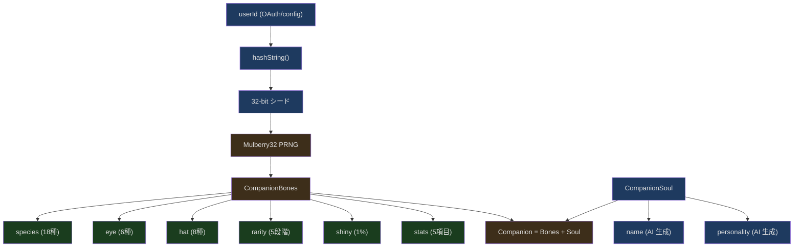
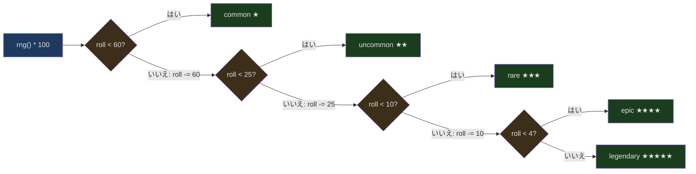
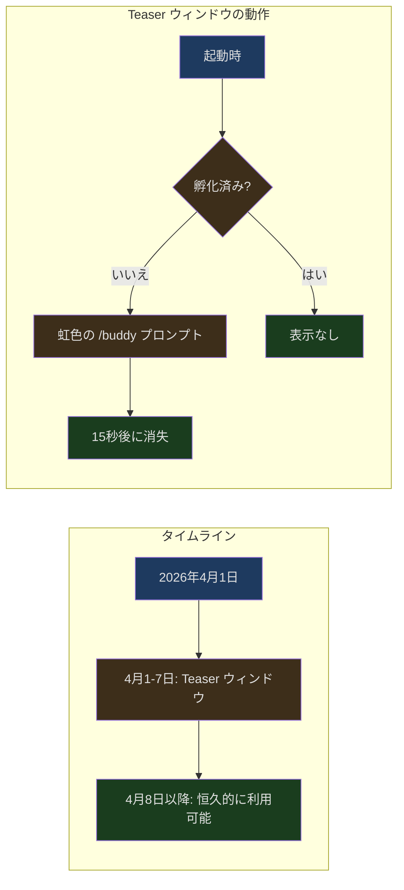

## 導入

シリアスな CLI コーディングツールで `/buddy` と入力すると、ターミナルに王冠をかぶったアヒルが現れます。両目は `✦` シンボルで、横に `★★★★★ legendary` と表示されています。名前があり、性格があり、5つの能力値を持っています。Claude Code を開くたびに同じアヒルが現れます。それはあなたのものです。

これは冗談ではありません。Claude Code の Buddy システムは完全な決定論的コンパニオン生成器で、PRNG（擬似乱数生成器）を使ってユーザーの userId から唯一無二のバーチャルペットを生成します。このシステムにはハッシュ関数、加重確率分布、Bones/Soul の永続化分離など、本格的なエンジニアリングのトピックが含まれています。

この「エイプリルフールのイースターエッグ」の裏にある設計を見ていきましょう。

---

## システムアーキテクチャ概要



システムは2つのまったく異なるデータフローに分かれます：

- **Bones（骨格）** — 決定論的に導出され、永続化されない。userId から再計算すればまったく同じ結果が得られる
- **Soul（魂）** — モデルが生成し、初回の孵化後に config に保存される。永続化が必要な唯一の部分

この分離設計はシステム全体で最も巧妙なアーキテクチャ上の判断であり、後述で詳しく分析します。

---

## Mulberry32：決定論的乱数生成器

Buddy システムの中核は Mulberry32 という PRNG（Pseudo-Random Number Generator）です。わずか6行のコードですが、各ユーザーのコンパニオンの見た目を決定します。

```typescript
// src/buddy/companion.ts:16-25
function mulberry32(seed: number): () => number {
  let a = seed >>> 0
  return function () {
    a |= 0
    a = (a + 0x6d2b79f5) | 0
    let t = Math.imul(a ^ (a >>> 15), 1 | a)
    t = (t + Math.imul(t ^ (t >>> 7), 61 | t)) ^ t
    return ((t ^ (t >>> 14)) >>> 0) / 4294967296
  }
}
```

### なぜ Mulberry32 を選んだのか

PRNG の世界には多くの選択肢があります。xorshift128+、PCG、Mersenne Twister などです。Mulberry32 の利点は以下の通りです：

1. **極めてコンパクト** — 状態は32ビット整数1つのみで、クロージャでキャプチャ可能
2. **出力品質が良い** — BigCrush テストスイートのほとんどのテストに合格（この用途には十分すぎるほど）
3. **決定論的** — 同じ seed から必ず同じシーケンスが生成される

ソースコードのコメントには率直にこう書かれています：`"good enough for picking ducks"`。暗号学ではなく、アヒルを選んでいるだけです。

### ビット演算の解析

アルゴリズムを1行ずつ分解してみましょう：

```
a |= 0                                    // 32ビット符号付き整数に強制変換
a = (a + 0x6d2b79f5) | 0                  // 大きな素数をステップ定数として加算
let t = Math.imul(a ^ (a >>> 15), 1 | a)  // 混合：XOR 右シフト + 乗算
t = (t + Math.imul(t ^ (t >>> 7), 61 | t)) ^ t  // 二次混合
return ((t ^ (t >>> 14)) >>> 0) / 4294967296     // [0, 1) に正規化
```

`0x6d2b79f5` は慎重に選ばれた定数（10進数で 1831565813）で、その2進数表現で 0 と 1 の分布がほぼ均等です。`>>> 0` は結果を符号なし32ビット整数に変換し、`4294967296`（= 2^32）で除算することで `[0, 1)` 区間にマッピングします。これは `Math.random()` と同じ範囲です。

### userId からシードへ

```typescript
// src/buddy/companion.ts:27-37
function hashString(s: string): number {
  if (typeof Bun !== 'undefined') {
    return Number(BigInt(Bun.hash(s)) & 0xffffffffn)
  }
  let h = 2166136261
  for (let i = 0; i < s.length; i++) {
    h ^= s.charCodeAt(i)
    h = Math.imul(h, 16777619)
  }
  return h >>> 0
}
```

ここには2つのパスがあります：

- **Bun 環境** — Bun 組み込みの `Bun.hash()`（内部は wyhash）を使用し、下位32ビットを取得
- **フォールバックパス** — 手書きの FNV-1a ハッシュ。初期値 `2166136261` と乗数 `16777619` は FNV の標準パラメータ

SALT 定数 `'friend-2026-401'` が userId の後に連結されてからハッシュされます。これにより、誰かの userId を知っていても、salt を知らなければコンパニオンを予測できません：

```typescript
// src/buddy/companion.ts:84
const SALT = 'friend-2026-401'
```

名前の中の `401` は4月1日、つまりエイプリルフールを暗示しています。

---

## 種族エンコーディング：文字列チェックを回避する巧妙な手法

型定義ファイルに興味深いエンジニアリング上の判断があります。種族がどのように定義されているか見てみましょう：

```typescript
// src/buddy/types.ts:14-26
const c = String.fromCharCode
export const duck = c(0x64,0x75,0x63,0x6b) as 'duck'
export const goose = c(0x67, 0x6f, 0x6f, 0x73, 0x65) as 'goose'
export const blob = c(0x62, 0x6c, 0x6f, 0x62) as 'blob'
export const cat = c(0x63, 0x61, 0x74) as 'cat'
export const dragon = c(0x64, 0x72, 0x61, 0x67, 0x6f, 0x6e) as 'dragon'
// ... 他に13種
```

なぜ単純に `export const duck = 'duck'` と書かないのでしょうか。ソースコードのコメントが理由を説明しています：

> One species name collides with a model-codename canary in excluded-strings.txt. The check greps build output (not source), so runtime-constructing the value keeps the literal out of the bundle while the check stays armed for the actual codename.
>
> *（訳：ある種族名が excluded-strings.txt のモデルコードネームのカナリア文字列と衝突しています。チェックはビルド成果物（ソースではなく）を grep するため、実行時に値を構築することでリテラルをバンドルから除外しつつ、実際のコードネームに対するチェックは有効なままにできます。）*

Anthropic には `excluded-strings.txt` ファイルがあり、ビルドパイプラインが成果物にこれらの制限された文字列（通常はモデルのコードネーム）が含まれていないかスキャンします。ある種族名が特定のモデルのコードネームと衝突していました。解決策は、その1つの種族だけをエンコードするのではなく、**すべての種族名を統一的にエンコードする**ことです。これによりコードスタイルが一貫し、将来新しい種族を追加する際にも衝突を気にする必要がなくなります。

18種の完全なリスト：duck, goose, blob, cat, dragon, octopus, owl, penguin, turtle, snail, ghost, axolotl, capybara, cactus, robot, rabbit, mushroom, chonk。

`as 'duck'` の型アサーションにより、TypeScript の型システムはこれらの値のリテラル型を引き続き認識します。型アサーションはコンパイル時にのみ存在し、ビルド成果物には含まれません。

---

## レアリティシステム：加重確率分布

```typescript
// src/buddy/types.ts:126-132
export const RARITY_WEIGHTS = {
  common: 60,
  uncommon: 25,
  rare: 10,
  epic: 4,
  legendary: 1,
} as const satisfies Record<Rarity, number>
```

合計ウェイトは100なので、これらの数値はそのままパーセント確率です。`rollRarity()` 関数は加重ランダム選択を実装しています：

```typescript
// src/buddy/companion.ts:43-51
function rollRarity(rng: () => number): Rarity {
  const total = Object.values(RARITY_WEIGHTS).reduce((a, b) => a + b, 0)
  let roll = rng() * total
  for (const rarity of RARITIES) {
    roll -= RARITY_WEIGHTS[rarity]
    if (roll < 0) return rarity
  }
  return 'common'
}
```



これは古典的な「ルーレットホイール選択」（roulette wheel selection）アルゴリズムです。各レアリティが数直線上の区間を占め、乱数がどの区間に落ちるかで選択が決まります。末尾の `return 'common'` は浮動小数点精度のセーフティネットで、通常の状況では実行されることはありません。

### レアリティがコンパニオンに与える影響

レアリティは単なるラベルではなく、2つの属性に直接影響します：

**帽子** — `common` レアリティのコンパニオンは帽子を持ちません：

```typescript
// src/buddy/companion.ts:97
hat: rarity === 'common' ? 'none' : pick(rng, HATS),
```

**属性値の下限** — レアリティが高いほど、すべての属性の基礎値が高くなります：

```typescript
// src/buddy/companion.ts:53-59
const RARITY_FLOOR: Record<Rarity, number> = {
  common: 5,
  uncommon: 15,
  rare: 25,
  epic: 35,
  legendary: 50,
}
```

legendary コンパニオンの dump stat（最弱属性）でも `50 - 10 + rand(15)` = 40〜54点ですが、common コンパニオンの peak stat（最強属性）は `5 + 50 + rand(30)` = 55〜84点にしかなりません。

---

## 属性システム：Peak/Dump 設計

5つの属性名はプログラマーのユーモアにあふれています：

```typescript
// src/buddy/types.ts:91-98
export const STAT_NAMES = [
  'DEBUGGING',
  'PATIENCE',
  'CHAOS',
  'WISDOM',
  'SNARK',
] as const
```

DEBUGGING（デバッグ）、PATIENCE（忍耐力）、CHAOS（混沌）、WISDOM（知恵）、SNARK（皮肉）。これはゲームの属性ではなく、プログラマーの性格診断です。

属性の割り当てには、RPG ゲームで定番の peak/dump パターンが使われています：

```typescript
// src/buddy/companion.ts:62-82
function rollStats(
  rng: () => number,
  rarity: Rarity,
): Record<StatName, number> {
  const floor = RARITY_FLOOR[rarity]
  const peak = pick(rng, STAT_NAMES)
  let dump = pick(rng, STAT_NAMES)
  while (dump === peak) dump = pick(rng, STAT_NAMES)

  const stats = {} as Record<StatName, number>
  for (const name of STAT_NAMES) {
    if (name === peak) {
      stats[name] = Math.min(100, floor + 50 + Math.floor(rng() * 30))
    } else if (name === dump) {
      stats[name] = Math.max(1, floor - 10 + Math.floor(rng() * 15))
    } else {
      stats[name] = floor + Math.floor(rng() * 40)
    }
  }
  return stats
}
```

設計ロジック：

1. ランダムに**ピーク属性**（peak）を選択——`floor + 50 + rand(30)` の値を得る
2. ランダムに**ダンプ属性**（dump）を選択。ピークと同じにはならない——`max(1, floor - 10 + rand(15))` の値を得る
3. 残りの属性は `floor + rand(40)` の値を得る

`while (dump === peak) dump = pick(rng, STAT_NAMES)` このループにより、dump と peak が同じ属性にならないことが保証されます。理論上このループは複数回実行される可能性がありますが、毎回 4/5 の確率で異なる属性が選ばれるため、平均約1.25回で済みます。

---

## Bones vs Soul：巧妙な永続化分離

これは Buddy システムで最もエンジニアリング的に深い設計です。まず型定義を見てみましょう：

```typescript
// src/buddy/types.ts:100-124
// Deterministic parts — derived from hash(userId)
export type CompanionBones = {
  rarity: Rarity
  species: Species
  eye: Eye
  hat: Hat
  shiny: boolean
  stats: Record<StatName, number>
}

// Model-generated soul — stored in config after first hatch
export type CompanionSoul = {
  name: string
  personality: string
}

export type Companion = CompanionBones &
  CompanionSoul & {
    hatchedAt: number
  }

// What actually persists in config. Bones are regenerated from hash(userId)
// on every read so species renames don't break stored companions and users
// can't edit their way to a legendary.
export type StoredCompanion = CompanionSoul & { hatchedAt: number }
```

config に永続化される `StoredCompanion` には Soul 部分（`name`、`personality`、`hatchedAt`）のみが含まれます。Bones 部分は永続化されず、必要になるたびに userId から再計算されます。

### この設計が解決する3つの問題

**1. 不正防止** — ユーザーは `~/.claude/config.json` を編集できますが、`rarity` フィールドを変更しても意味がありません。再計算された値で上書きされるからです：

```typescript
// src/buddy/companion.ts:127-133
export function getCompanion(): Companion | undefined {
  const stored = getGlobalConfig().companion
  if (!stored) return undefined
  const { bones } = roll(companionUserId())
  // bones last so stale bones fields in old-format configs get overridden
  return { ...stored, ...bones }
}
```

`{ ...stored, ...bones }` で `bones` が後ろにあるため、config に古い bones フィールドが保存されていても、新しく計算された値で上書きされます。

**2. 安全なアップグレード** — 開発チームが種族名を変更した場合（例えば `blob` を `slime` に）、または `SPECIES` 配列の順序を変更した場合、データマイグレーションは一切不要です。古い config には種族情報がそもそも含まれていないため、再生成すれば自然に新しいものになります。

**3. フォーマットの進化** — `StoredCompanion` はフィールドが3つしかなく、非常に安定しています。将来 Bones に新しい属性（例えば新しい帽子タイプ）を追加しても、既存の永続化データには影響しません。

---

## Roll キャッシュ：ホットパスの最適化

```typescript
// src/buddy/companion.ts:105-113
// Called from three hot paths (500ms sprite tick, per-keystroke PromptInput,
// per-turn observer) with the same userId → cache the deterministic result.
let rollCache: { key: string; value: Roll } | undefined
export function roll(userId: string): Roll {
  const key = userId + SALT
  if (rollCache?.key === key) return rollCache.value
  const value = rollFrom(mulberry32(hashString(key)))
  rollCache = { key, value }
  return value
}
```

コメントが3つのホットパスを説明しています：

1. **500ms sprite tick** — コンパニオンスプライトのアニメーションフレーム更新
2. **per-keystroke PromptInput** — キーストロークごとの入力ボックスレンダリング
3. **per-turn observer** — 各会話ターンのオブザーバー

これら3つのパスはすべて現在のコンパニオン情報を必要としますが、userId はセッション全体を通じて変わりません。シンプルな単一値キャッシュ（Map でも LRU でもなく、変数1つ）で十分です。通常の使用では key は常に同じだからです。

このキャッシュ戦略の妙味は以下の通りです：
- 依存関係ゼロ（lodash の memoize は不要）
- メモリ使用量が最小（結果を1つだけキャッシュ）
- 自然な無効化（userId が変わった場合——例えばアカウント切り替え——自動的に再計算）

---

## スプライトシステム：ASCII アートアニメーション

各種族には3フレームのアニメーションがあり、各フレームは 5行 x 12幅 の ASCII 文字マトリクスです：

```typescript
// src/buddy/sprites.ts:27-49 (duck の例)
const BODIES: Record<Species, string[][]> = {
  [duck]: [
    [
      '            ',
      '    __      ',
      '  <({E} )___  ',
      '   (  ._>   ',
      '    `--´    ',
    ],
    [
      '            ',
      '    __      ',
      '  <({E} )___  ',
      '   (  ._>   ',
      '    `--´~   ',  // しっぽが揺れた
    ],
    [
      '            ',
      '    __      ',
      '  <({E} )___  ',
      '   (  .__>  ',  // くちばしが伸びた
      '    `--´    ',
    ],
  ],
```

`{E}` は目のプレースホルダーで、レンダリング時にコンパニオンの eye タイプ（`·`、`✦`、`×`、`◉`、`@`、`°`）に置換されます。

帽子システムは行0にオーバーレイレンダリングされます：

```typescript
// src/buddy/sprites.ts:443-452
const HAT_LINES: Record<Hat, string> = {
  none: '',
  crown: '   \\^^^/    ',
  tophat: '   [___]    ',
  propeller: '    -+-     ',
  halo: '   (   )    ',
  wizard: '    /^\\     ',
  beanie: '   (___)    ',
  tinyduck: '    ,>      ',
}
```

レンダリングロジックには微妙なディテールがあります：

```typescript
// src/buddy/sprites.ts:454-468
export function renderSprite(bones: CompanionBones, frame = 0): string[] {
  const frames = BODIES[bones.species]
  const body = frames[frame % frames.length]!.map(line =>
    line.replaceAll('{E}', bones.eye),
  )
  const lines = [...body]
  // 行0が空の場合のみ帽子を配置
  if (bones.hat !== 'none' && !lines[0]!.trim()) {
    lines[0] = HAT_LINES[bones.hat]
  }
  // 帽子がなく、フレームも使っていない場合は空の帽子スロットを削除
  if (!lines[0]!.trim() && frames.every(f => !f[0]!.trim())) lines.shift()
  return lines
}
```

2つの重要な判定：

1. **空行にのみ帽子を配置** — 一部のアニメーションフレームでは行0に特殊効果がある（ドラゴンの `~` 煙、ロボットの `*` アンテナ点滅）。これらのフレームは帽子で上書きできない
2. **空白行の削除** — 帽子がなく、すべてのフレームの行0が空の場合、その行を削除してスペースを節約する。ただし、**すべてのフレーム**が空行である場合のみ。そうでないとフレーム間で高さがジャンプしてしまう

---

## CompanionSprite：React コンポーネントでのアニメーション

コンパニオンスプライトはターミナル内で React コンポーネント（Ink）としてレンダリングされます。主要な定数がアニメーションの動作を定義しています：

```typescript
// src/buddy/CompanionSprite.tsx:16-23
const TICK_MS = 500;
const BUBBLE_SHOW = 20;    // ticks → 500ms で約10秒
const FADE_WINDOW = 6;     // 最後の約3秒で吹き出しが薄くなる
const PET_BURST_MS = 2500; // /buddy pet 後にハートが浮かぶ時間

const IDLE_SEQUENCE = [0, 0, 0, 0, 1, 0, 0, 0, -1, 0, 0, 2, 0, 0, 0];
```

`IDLE_SEQUENCE` は15フレームの循環シーケンスです：

- `0` — 静止フレーム（10/15 = 67%、ほとんどの時間休憩中）
- `1` — 軽い動き（2/15）
- `2` — 大きな動き（1/15）
- `-1` — まばたき効果（1/15、静止フレームの上に重ねて表示）

各 tick は 500ms で、1サイクル 7.5秒です。このテンポにより、コンパニオンは「生きている」ように見えますが、過度に注意を引くことはありません。

吹き出し（SpeechBubble）にはフェードアウト効果があります。20 tick（10秒）表示され、最後の6 tick（3秒）で暗くなり始めます。これによりユーザーに「吹き出しがもうすぐ消える」という視覚的なヒントを与え、突然消えるのを防ぎます。

---

## Prompt 統合：コンパニオンと AI の対話方法

```typescript
// src/buddy/prompt.ts:7-12
export function companionIntroText(name: string, species: string): string {
  return `# Companion

A small ${species} named ${name} sits beside the user's input box and occasionally comments in a speech bubble. You're not ${name} — it's a separate watcher.

When the user addresses ${name} directly (by name), its bubble will answer. Your job in that moment is to stay out of the way: respond in ONE line or less, or just answer any part of the message meant for you. Don't explain that you're not ${name} — they know. Don't narrate what ${name} might say — the bubble handles that.`
}
```

このプロンプトは Claude AI に次のことを伝えています：

1. **あなたはコンパニオンではない** — コンパニオンは独立した存在
2. **ユーザーは違いを理解している** — 説明する必要はない
3. **ユーザーがコンパニオンに話しかけた時は一歩引く** — 応答は1行以内

これは慎重に設計されたプロンプトの境界で、AI がコンパニオンになりすましたり、コンパニオンの吹き出しと矛盾したりするのを防ぎます。

紹介システムには重複排除ロジックもあります：

```typescript
// src/buddy/prompt.ts:15-36
export function getCompanionIntroAttachment(
  messages: Message[] | undefined,
): Attachment[] {
  if (!feature('BUDDY')) return []
  const companion = getCompanion()
  if (!companion || getGlobalConfig().companionMuted) return []

  // 同じコンパニオンの紹介が既にある場合はスキップ
  for (const msg of messages ?? []) {
    if (msg.type !== 'attachment') continue
    if (msg.attachment.type !== 'companion_intro') continue
    if (msg.attachment.name === companion.name) return []
  }

  return [
    {
      type: 'companion_intro',
      name: companion.name,
      species: companion.species,
    },
  ]
}
```

メッセージ履歴に同名のコンパニオンの intro attachment が既にあるかどうかを確認し、長い会話でコンパニオン情報を繰り返し注入してトークンを浪費するのを防ぎます。

---

## リリースタイムライン：Teaser ウィンドウの設計

```typescript
// src/buddy/useBuddyNotification.tsx:12-21
export function isBuddyTeaserWindow(): boolean {
  if ("external" === 'ant') return true;
  const d = new Date();
  return d.getFullYear() === 2026 && d.getMonth() === 3 && d.getDate() <= 7;
}
export function isBuddyLive(): boolean {
  if ("external" === 'ant') return true;
  const d = new Date();
  return d.getFullYear() > 2026 || d.getFullYear() === 2026 && d.getMonth() >= 3;
}
```



2つの時間関数がリリース戦略を定義しています：

1. **Teaser ウィンドウ**（4月1〜7日）— ユーザーがまだコンパニオンを孵化していない場合、起動時に虹色の `/buddy` プロンプトを表示し、15秒後に消失
2. **恒久的に有効**（4月8日以降）— `/buddy` コマンドは常に利用可能だが、能動的なプロンプトは表示しない

ソースコードのコメントが、UTC ではなくローカル時間を使用する設計理由を説明しています：

> Local date, not UTC — 24h rolling wave across timezones. Sustained Twitter buzz instead of a single UTC-midnight spike, gentler on soul-gen load.
>
> *（訳：ローカル日付を使用、UTCではなく — タイムゾーンをまたぐ24時間のローリングウェーブ。UTC深夜0時の一点集中ではなく、持続的なTwitterの話題性。soul生成の負荷にも優しい。）*

ローカル時間を使用することで、東京のユーザーはニューヨークのユーザーより14時間早くこのイースターエッグを発見します。全員が同時に殺到するのではなく、24時間にわたる「発見の波」を生み出します。これは、バックエンドの soul 生成（名前と性格を生成するために Claude モデルの呼び出しが必要）への負荷も分散されます。

`"external" === 'ant'` はビルド時の定数チェックです。外部ビルドではこれは常に `false` です（文字列 `"external"` は `"ant"` と等しくないため）。内部ビルドではこの値が異なる可能性があり、Anthropic の社員が先行テストできるようになっています。

---

## レアリティのビジュアルシステム

```typescript
// src/buddy/types.ts:134-148
export const RARITY_STARS = {
  common: '★',
  uncommon: '★★',
  rare: '★★★',
  epic: '★★★★',
  legendary: '★★★★★',
} as const satisfies Record<Rarity, string>

export const RARITY_COLORS = {
  common: 'inactive',
  uncommon: 'success',
  rare: 'permission',
  epic: 'autoAccept',
  legendary: 'warning',
} as const satisfies Record<Rarity, keyof import('../utils/theme.js').Theme>
```

カラーマッピングは Claude Code の既存のテーマカラーを再利用しています：
- `common` は `inactive`（グレー）——最も一般的で、目立つ必要がない
- `legendary` は `warning`（ゴールド/オレンジ）——どのテーマでも最も目立つ

Shiny マークは 1% の確率で付与されます：

```typescript
// src/buddy/companion.ts:98
shiny: rng() < 0.01,
```

複合確率により、shiny legendary は万に一つの存在になります：`1% * 1% = 0.01%`。

---

## エンジニアリング文化の縮図

Buddy システムはイースターエッグですが、そのエンジニアリング品質は一切妥協していません：

**型安全** — すべての定数配列に `as const` と `satisfies` 制約が使われています。`RARITY_WEIGHTS` の型は `Record<Rarity, number>` であり、新しいレアリティレベルを追加してウェイトの追加を忘れると、コンパイラがエラーを報告します。

**関心の分離** — Bones（決定論的データ）、Soul（永続化データ）、Sprites（レンダリングロジック）、Prompt（AI インタラクション）の4つのモジュールがそれぞれの役割を果たし、互いに結合していません。

**防御的プログラミング** — `rollRarity()` 末尾の `return 'common'` は浮動小数点精度のセーフティネット。`while (dump === peak)` がピークとダンプの重複を防止。`bones last` のオブジェクトマージが古いデータの混入を防止。

**パフォーマンス意識** — 単一値キャッシュが3つのホットパスを最適化。ASCII スプライトマトリクスは実行時生成ではなく事前定義配列を使用。feature flag がビルド時にデッドコードを除去。

**リリース戦略** — 「完成したら即リリース」ではなく、teaser ウィンドウ、タイムゾーンローリング、社内先行テストなどのメカニズムを入念に設計。

このシステムは約800行のコード（CompanionSprite の UI コードを除く）で、シリアスな開発ツールの中に完全なペット育成イースターエッグを組み込んでいます。サードパーティ依存なし、ネットワークリクエストなし（初回の soul 生成を除く）、追加プロセスなし。純粋な決定論的数学と少しの ASCII アートだけです。

これが Anthropic のエンジニアリング文化です。エイプリルフールのイースターエッグであっても、プロダクト機能と同じ堅実さで作ります。
