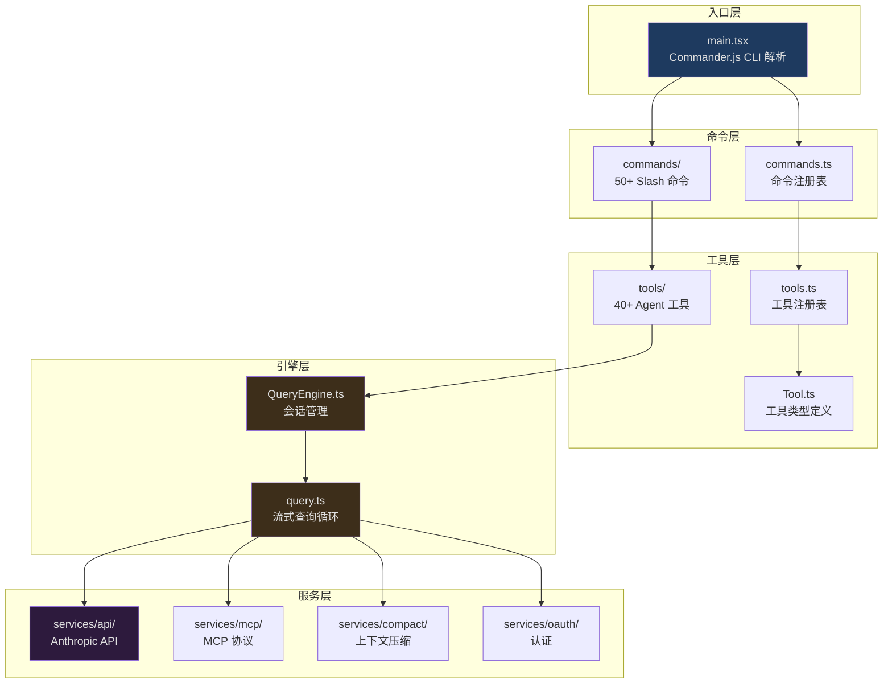
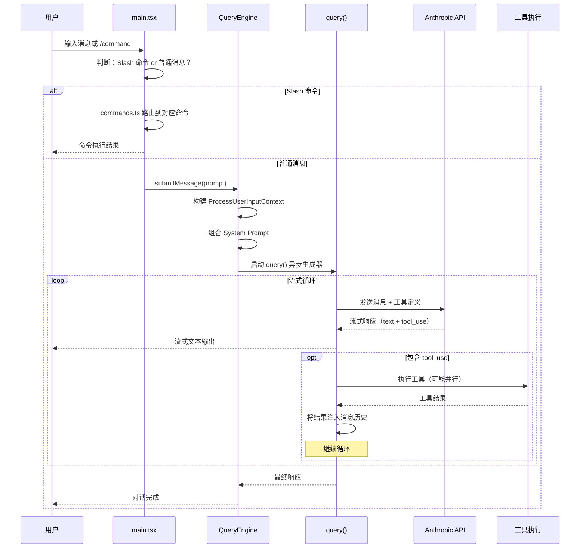
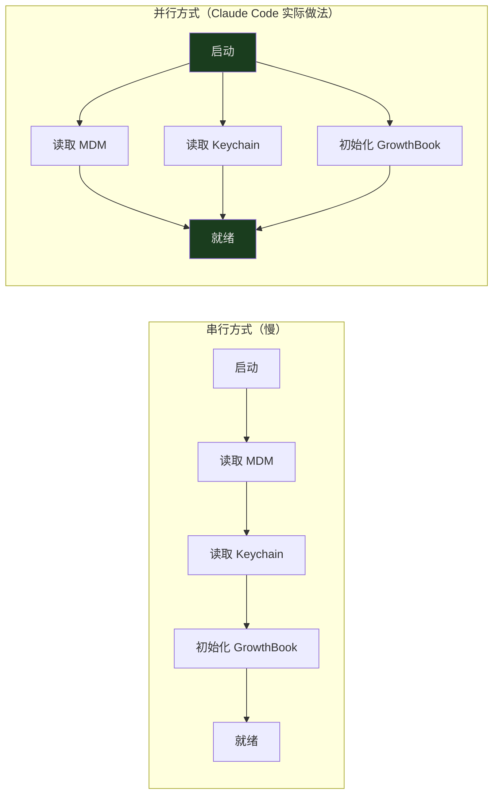

## 概览

2026 年 3 月 31 日，安全研究员 Chaofan Shou 发现 Anthropic 的 npm 注册表中暴露了一个 `.map` 文件，其中包含了 Claude Code CLI 的完整、未混淆的 TypeScript 源代码。这份源码包含约 1,900 个文件、超过 512,000 行代码——这不是一个简单的命令行工具，而是一个完整的、工程复杂度极高的 AI 代理平台。

本文是这个系列的第一篇。我们不会深入任何单一模块的实现细节（后续文章会做到这一点），而是站在最高处俯瞰整个代码库：它选择了什么技术栈？为什么做出这些选择？代码是如何组织的？一次用户交互从输入到输出经历了哪些层？理解这些全局性问题，是深入任何子系统的前提。

如果你是一个正在构建 AI 工具的开发者，这篇文章会帮你理解一个生产级 AI CLI 的架构蓝图。如果你只是好奇 Claude Code 内部是怎么运作的，这篇文章会给你一个清晰的全局图景。

---

## 技术选型：为什么是这个组合？

打开 Claude Code 的源码，第一个让人意外的发现是它的技术栈：

| 类别 | 技术选择 |
|------|----------|
| 运行时 | Bun |
| 语言 | TypeScript（严格模式） |
| 终端 UI | React + Ink |
| CLI 解析 | Commander.js（extra-typings） |
| Schema 验证 | Zod v4 |
| 代码搜索 | ripgrep |
| 协议 | MCP SDK, LSP |
| API | Anthropic SDK |
| 遥测 | OpenTelemetry + gRPC |
| 认证 | OAuth 2.0, JWT, macOS Keychain |

### 为什么是 Bun 而不是 Node.js？

Bun 在这里被选择不仅因为启动速度（对 CLI 工具至关重要），更因为一个关键特性：**编译期 Feature Flag**。

```typescript
// src/main.tsx
import { feature } from 'bun:bundle'

const coordinatorModeModule = feature('COORDINATOR_MODE')
  ? require('./coordinator/coordinatorMode.js')
  : null

const assistantModule = feature('KAIROS')
  ? require('./assistant/index.js')
  : null
```

当 `feature('COORDINATOR_MODE')` 在构建时被解析为 `false`，Bun 的打包器会将整个 `require()` 分支——以及它传递依赖的所有模块——从最终产物中彻底删除。这不是运行时的 `if` 判断，而是编译期的死代码消除（Dead Code Elimination）。对于一个需要同时支持独立 CLI 模式、IDE 集成模式（BRIDGE_MODE）、语音模式（VOICE_MODE）、后台守护模式（DAEMON）等多种形态的工具来说，这意味着每种构建产物只包含实际需要的代码。

### 为什么用 React 构建命令行界面？

这可能是最反直觉的选择。React 是为浏览器设计的——但 Claude Code 的终端界面远比典型 CLI 复杂：它需要实时渲染流式的 AI 响应、展示工具执行进度条、呈现文件 diff、显示交互式权限审批对话框。这些交互模式和 Web 应用更相似，而不是传统的命令行。

Ink 将 React 的渲染目标从浏览器 DOM 换成了终端字符。这意味着 Claude Code 可以使用 React 的组件模型、Hook 系统、状态管理来构建 UI，同时输出到终端。`src/components/` 目录下有超过 **140 个 React 组件**，从消息渲染到权限对话框，从文件 diff 展示到进度指示器。

---

## 目录结构与分层架构

Claude Code 的 `src/` 目录包含 33 个顶级子目录。乍看之下令人生畏，但它们可以清晰地映射到一个 5 层架构模型：



让我们逐层理解：

### 入口层：`main.tsx`

一切从 `main.tsx` 开始。这个文件做了三件关键的事：

1. **解析 CLI 参数**——使用 Commander.js 处理 `claude --model sonnet "fix the bug"` 这样的命令
2. **初始化运行时**——加载配置、建立 API 连接、设置遥测
3. **启动 Ink 渲染循环**——将 React 组件树挂载到终端

但最有趣的不是它做了什么，而是它**如何做**——启动序列被精心优化为并行执行：

```typescript
// src/main.tsx:12-20
// 这些调用在任何 heavy import 之前执行
profileCheckpoint('main_tsx_entry')
startMdmRawRead()      // 并行读取 MDM 配置
startKeychainPrefetch() // 并行预取 Keychain 凭证
```

在加载其余模块之前，`main.tsx` 就已经启动了 MDM（Mobile Device Management）配置读取和 macOS Keychain 凭证预取。这两个 I/O 操作并行执行，而不是等到需要时才串行调用。对于一个需要快速启动的 CLI 工具来说，这种"尽早启动、晚些消费"的模式是关键的性能优化。

### 命令层：`commands.ts` + `commands/`

当用户输入 `/commit`、`/review`、`/compact` 等斜杠命令时，`commands.ts` 负责路由到对应的实现。命令注册表使用了和工具相同的 Feature Flag 模式：

```typescript
// src/commands.ts:62-122
// 条件导入：未启用的命令在构建时被消除
import { feature } from 'bun:bundle'

// VOICE_MODE 关闭时，整个语音命令的代码不会出现在最终产物中
// BRIDGE_MODE 关闭时，IDE 集成相关命令被移除
```

注意一个有趣的惰性加载模式——对于特别重的命令（如 `insights`，单文件 113KB），Claude Code 使用了运行时动态导入来避免启动时加载：

```typescript
// src/commands.ts:190-200
const usageReport: Command = {
  type: 'prompt',
  name: 'insights',
  async getPromptForCommand(args, context) {
    // 只有用户实际执行 /insights 时才加载这个 113KB 的模块
    const real = (await import('./commands/insights.js')).default
    return real.getPromptForCommand(args, context)
  }
}
```

这是编译期消除和运行时惰性加载的组合使用：不需要的功能在编译时删除，需要但不常用的功能在运行时延迟加载。

### 工具层：`Tool.ts` + `tools.ts` + `tools/`

工具是 Claude Code 最核心的概念之一。每个工具代表 AI 可以执行的一种操作——读文件、写文件、执行 Shell 命令、搜索代码、访问网页等。工具系统将在第 03 篇文章中深入剖析，这里只需要理解它的位置和职责：

- **`Tool.ts`（792 行）** — 定义工具的类型系统和权限模型
- **`tools.ts`** — 工具注册表，是所有可用工具的 source of truth
- **`tools/`** — 45 个子目录，每个是一个工具的完整实现

```typescript
// src/tools.ts — 工具注册表
// getAllBaseTools() 是整个系统的工具清单
// 它使用条件导入和惰性 require 来管理依赖

// Feature-gated 工具示例：
const cronTools = feature('AGENT_TRIGGERS')
  ? [
      require('./tools/ScheduleCronTool/CronCreateTool.js').CronCreateTool,
      require('./tools/ScheduleCronTool/CronDeleteTool.js').CronDeleteTool,
      require('./tools/ScheduleCronTool/CronListTool.js').CronListTool,
    ]
  : []

// 惰性 require 打破循环依赖：
const getTeamCreateTool = () =>
  require('./tools/TeamCreateTool/TeamCreateTool.js').TeamCreateTool
```

### 引擎层：`QueryEngine.ts` + `query.ts`

这是 Claude Code 的心脏。`QueryEngine.ts`（1,295 行）管理整个对话会话的状态——消息历史、文件缓存、token 计数、权限记录。`query.ts`（1,729 行）实现了流式查询循环——一个异步生成器驱动的状态机，负责调用 API、处理工具调用、执行恢复策略。

引擎层将在第 02 篇文章中完整剖析。这里只需要知道：

```
用户消息 → QueryEngine.submitMessage()
         → query() 异步生成器
         → API 流式调用
         → tool_use 检测 → 工具执行 → 结果注入 → 继续生成
         → 最终响应
```

### 服务层：`services/`

服务层提供引擎和工具需要的基础设施能力：

| 服务 | 路径 | 职责 |
|------|------|------|
| API 客户端 | `services/api/` | Anthropic API 调用、流式响应、重试 |
| MCP 协议 | `services/mcp/` | Model Context Protocol 服务器连接管理 |
| 上下文压缩 | `services/compact/` | 对话历史压缩，防止超出上下文窗口 |
| 认证 | `services/oauth/` | OAuth 2.0 流程、Token 刷新 |
| 遥测 | `services/analytics/` | GrowthBook Feature Flag、用户分群 |
| LSP | `services/lsp/` | Language Server Protocol 集成 |
| 插件 | `services/plugins/` | 插件加载与管理 |

---

## 核心数据流：一次交互的旅程

理解了分层架构后，让我们追踪一次完整的用户交互——从输入到输出——看数据如何流经各层：



这个流程中有几个关键设计决策：

1. **流式输出**：AI 的文本响应在生成的同时就流式输出到终端，用户不需要等待完整响应
2. **工具调用循环**：LLM 可以在一次响应中调用多个工具，工具结果会被注入回消息历史，LLM 继续基于新信息生成
3. **并行工具执行**：多个互不冲突的工具可以并行执行（由 `StreamingToolExecutor` 管理）

---

## 关键设计哲学

在整个代码库中，有几个反复出现的设计模式，理解它们有助于你在后续文章中更快地把握各子系统的设计意图：

### 1. 并行预取（Parallel Prefetch）

启动时不等待，尽早启动 I/O：



### 2. 惰性加载（Lazy Loading）

重型模块延迟到首次使用时才加载：

- OpenTelemetry（~400KB）——首次遥测事件时加载
- gRPC（~700KB）——首次需要 gRPC 传输时加载
- 大型命令模块——用户实际执行命令时才加载

### 3. 编译期代码消除（Dead Code Elimination）

通过 `feature()` flag 在编译时彻底移除不需要的代码路径。已知的 flag 包括：

| Flag | 控制的功能 |
|------|-----------|
| `COORDINATOR_MODE` | 多 Agent 协调器 |
| `KAIROS` | 高级 Agent 能力 |
| `BRIDGE_MODE` | IDE 集成 |
| `VOICE_MODE` | 语音输入 |
| `DAEMON` | 后台守护模式 |
| `PROACTIVE` | 主动模式（SleepTool） |
| `AGENT_TRIGGERS` | 远程触发与定时任务 |
| `BUDDY` | 伴侣彩蛋 |

### 4. 极简状态管理

不用 Redux、不用 MobX、不用 Zustand。Claude Code 的全局状态管理基于一个不到 35 行的自定义 Store 实现：

```typescript
// src/state/store.ts（完整实现）
export function createStore<T>(
  initialState: T,
  onChange?: OnChange<T>,
): Store<T> {
  let state = initialState
  const listeners = new Set<Listener>()

  return {
    getState: () => state,
    setState: (updater: (prev: T) => T) => {
      const prev = state
      const next = updater(prev)
      if (Object.is(next, prev)) return
      state = next
      onChange?.({ newState: next, oldState: prev })
      for (const listener of listeners) listener()
    },
    subscribe: (listener: Listener) => {
      listeners.add(listener)
      return () => listeners.delete(listener)
    },
  }
}
```

三个方法——`getState`、`setState`、`subscribe`——加上 `Object.is()` 引用相等检查。这就够了。

---

## 还有什么？

在这个概览之外，Claude Code 的代码库中还有许多引人入胜的子系统，它们将在后续文章中逐一剖析：

| 子系统 | 路径 | 概述 |
|--------|------|------|
| Bridge | `src/bridge/` | 34 个文件、1MB+ 代码，实现 CLI 与 IDE 的双向通信 |
| Coordinator | `src/coordinator/` | 多 Agent 编排——调度者/执行者模式 |
| Memory | `src/memdir/` | 基于文件系统的持久化记忆——四种类型、自动提取 |
| Skills | `src/skills/` | Markdown frontmatter 即配置的可扩展技能系统 |
| Plugins | `src/plugins/` | 两级注册的插件架构 |
| Ink | `src/ink/` | 50 个文件的终端 UI 渲染引擎 |
| Vim | `src/vim/` | 穷举类型状态机实现的 Vim 模态编辑 |
| Buddy | `src/buddy/` | 确定性随机数驱动的虚拟伴侣彩蛋 |

---

## 下一篇

在本篇建立了全局架构认知后，[第 02 篇：查询引擎](/articles/02-query-engine) 将深入 Claude Code 最核心的引擎层——`QueryEngine.ts` 和 `query.ts`——追踪一次对话从用户输入到最终响应的完整生命周期。我们将看到异步生成器如何驱动流式查询循环，以及当事情出错时（上下文溢出、API 超时、模型拒绝），引擎如何优雅地恢复。
