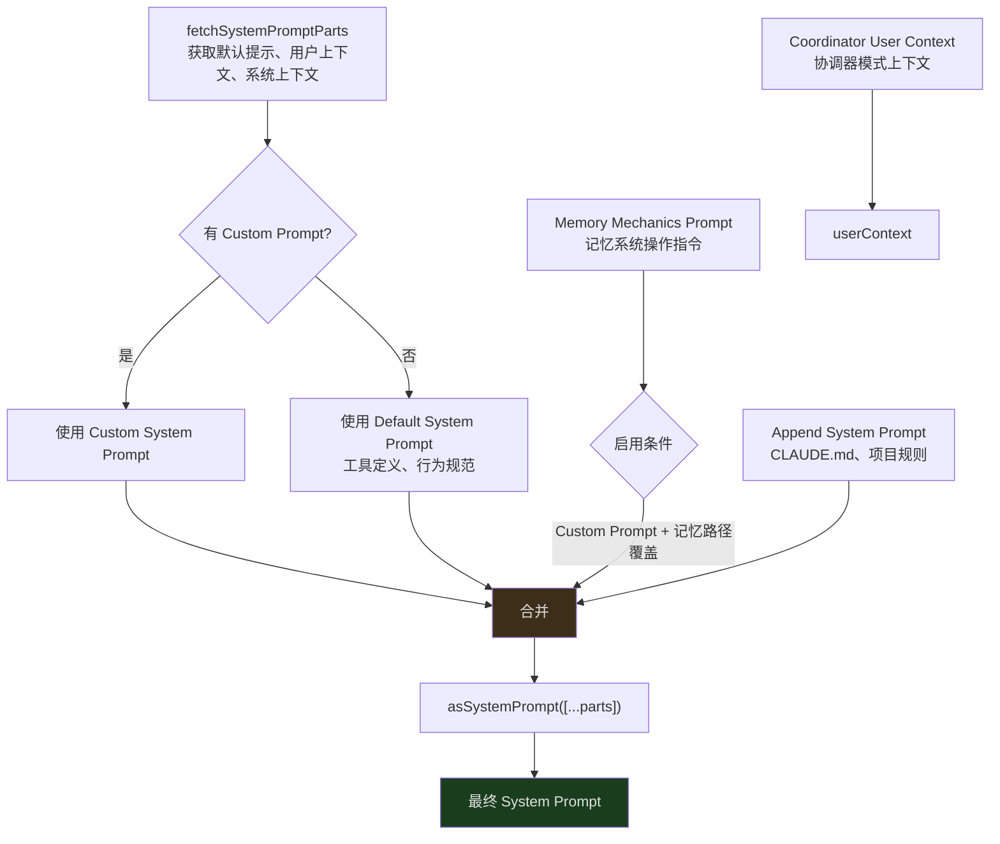
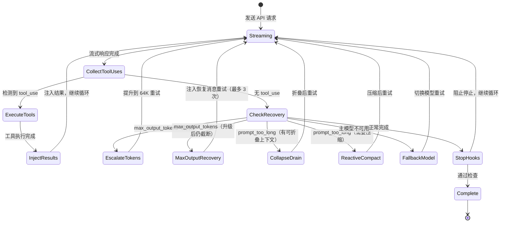
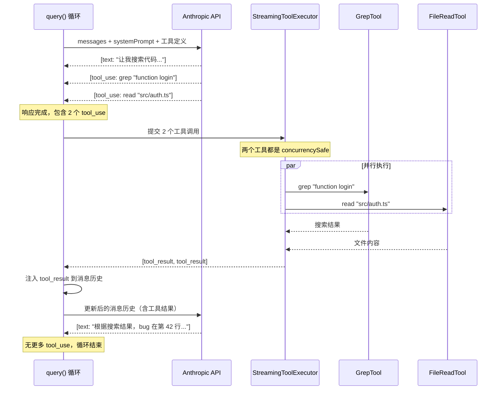
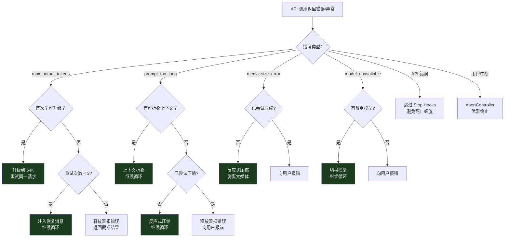
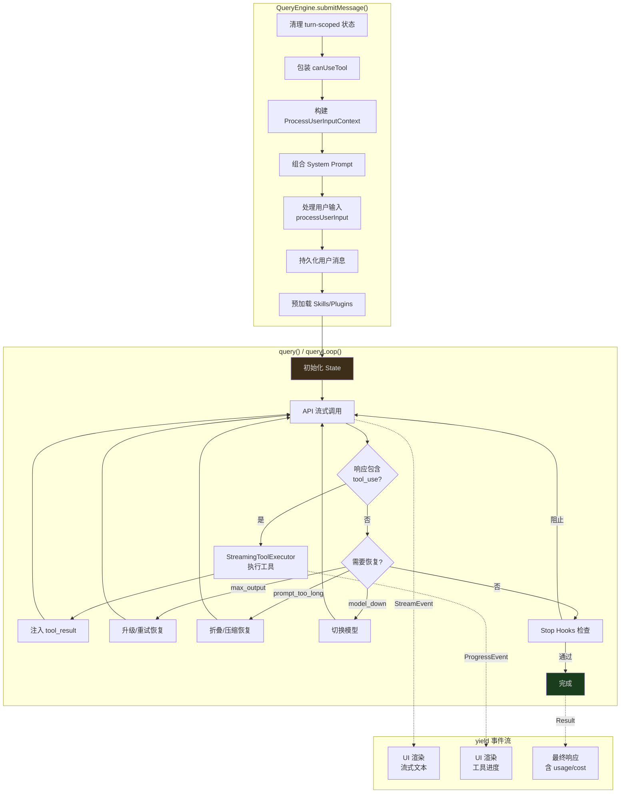

## 概览

在上一篇全景文章中，我们看到 Claude Code 的架构可以分为 5 层，而查询引擎处于最核心的位置。现在，我们要深入这一层。

当你在终端里输入一句话——"帮我修复这个 bug"——到 Claude 开始流式输出回答、执行工具、最终给你结果，中间到底发生了什么？答案藏在两个文件中：

- **`QueryEngine.ts`（约 1,295 行）** — 会话管理器，维护跨轮次的状态
- **`query.ts`（约 1,729 行）** — 流式查询循环，一个异步生成器驱动的状态机

本文将完整追踪一次对话的生命周期，从 `submitMessage()` 的入口，到 `query()` 生成器的循环执行，再到恢复策略的触发。这是理解 Claude Code 如何与 LLM 交互的关键。

---

## QueryEngine：会话的状态容器

`QueryEngine` 不是每次调用都创建的——它是一个长寿命对象，在整个对话会话期间持续存在。它的职责是管理跨轮次的状态：

```typescript
// src/QueryEngine.ts:184-207
export class QueryEngine {
  private config: QueryEngineConfig
  // 核心对话历史数组，跨轮次持续累积。这是整个引擎中为数不多的可变状态——
  // 每轮对话的用户消息、助手响应、工具结果都会追加到这里。
  // 在 Claude Code 偏爱不可变数据的整体设计中，这是一个有意的例外。
  private mutableMessages: Message[]
  // 用户中断信号控制器。当用户按下 Ctrl+C 时触发 .abort()，
  // 所有正在进行的异步操作（API 调用、工具执行）会通过 signal 感知到中断并优雅退出。
  private abortController: AbortController
  // 记录所有被用户拒绝的工具调用（工具名、调用 ID、输入参数）。
  // 这些记录最终会包含在 SDK 返回的 result 消息中，
  // 让调用方（如 Claude Desktop）知道哪些操作被用户拒绝了。
  private permissionDenials: SDKPermissionDenial[]
  // 整个会话期间的累计 API token 使用量（input_tokens + output_tokens）。
  // 每次 API 响应返回时通过 accumulateUsage() 更新，用于计费和 maxBudgetUsd 检查。
  // 在整个引擎生命周期内只增不减。
  private totalUsage: NonNullableUsage
  // 确保 orphanedPermission（孤立权限恢复）在引擎生命周期内最多处理一次。
  // 当工具调用在上一个会话中被拒绝但需要特殊恢复处理时使用，
  // 避免重复触发恢复逻辑。
  private hasHandledOrphanedPermission = false
  // 文件状态缓存，记录已读文件的修改时间、大小和内容哈希。
  // 当 AI 通过 FileReadTool 读取文件后，内容被缓存在这里。
  // 后续再次引用同一文件时，引擎可以避免重复发送完整内容到 API，节省 token。
  // 还用于检测文件是否在读取后被意外修改。
  private readFileState: FileStateCache
  // 当前轮次中发现的技能名称集合（turn-scoped）。
  // 每轮 submitMessage() 开始时通过 .clear() 清除，
  // 防止长时间 SDK 会话中集合无限增长。
  // 用于 tengu_skill_tool_invocation 遥测事件的 was_discovered 字段。
  private discoveredSkillNames = new Set<string>()
  // 记录已加载的嵌套记忆文件路径，避免同一记忆文件被重复加载。
  // 跨轮次持久化——不同于 discoveredSkillNames，不会每轮清除，
  // 因为记忆加载是全局性的，重复加载只会浪费 token。
  private loadedNestedMemoryPaths = new Set<string>()

  constructor(config: QueryEngineConfig) {
    this.config = config
    this.mutableMessages = config.initialMessages ?? []
    this.abortController = config.abortController ?? createAbortController()
    this.permissionDenials = []
    this.readFileState = config.readFileCache
    this.totalUsage = EMPTY_USAGE
  }
}
```

几个关键字段值得注意：

- **`mutableMessages`** — 这是整个对话的消息历史。每轮对话的新消息会追加到这里，工具执行的结果也会注入到这里。这个数组是"可变的"——在 Claude Code 偏爱不可变数据的整体设计中，这是一个有意的例外，因为消息历史需要高频更新且追加操作不会引起并发问题。
- **`readFileState`** — 一个文件读取缓存。当 AI 通过 `FileReadTool` 读取了一个文件后，其内容会被缓存在这里。如果 AI 后续再次引用这个文件，引擎可以避免重复发送完整内容到 API，节省 token。
- **`permissionDenials`** — 当用户拒绝了某个工具的执行权限时，这个拒绝会被记录在这里，用于后续的 SDK 上报。
- **`discoveredSkillNames`** — 跟踪当前轮次中发现的技能名称。每轮开始时会被清除，避免长会话中无限增长。
- **`loadedNestedMemoryPaths`** — 记录已加载的嵌套记忆路径，避免重复加载。

### QueryEngineConfig：引擎的配置合约

在深入 `submitMessage()` 之前，我们需要理解 `QueryEngineConfig`——它定义了创建 `QueryEngine` 时需要提供的一切：

```typescript
// src/QueryEngine.ts:130-173（关键字段）
export type QueryEngineConfig = {
  // 工作目录路径。每轮开始时通过 setCwd(cwd) 设置，
  // 决定了所有文件操作和工具执行的基准路径。
  cwd: string
  // 可用工具列表（Bash、Read、Write、Grep 等 40+ 工具）。
  // 传递给 fetchSystemPromptParts() 构建系统提示中的工具描述，
  // 同时通过 ProcessUserInputContext 传入工具执行层。
  // 还用于检查是否包含 SYNTHETIC_OUTPUT_TOOL_NAME 以启用结构化输出。
  tools: Tools
  // 斜杠命令列表（如 /help、/config、/force-snip）。
  // 由 processUserInput() 消费，用于识别和执行用户输入中的本地命令。
  commands: Command[]
  // Model Context Protocol 服务器连接数组，用于接入外部工具和资源。
  // 传递给系统提示生成和协调器模式上下文，
  // 使 Claude 能发现并使用 MCP 服务器提供的扩展工具。
  mcpClients: MCPServerConnection[]
  // 可用的 Agent 定义列表。Claude 可以通过 Agent 工具调用这些 agent，
  // 将复杂任务委托给专门的子 agent 处理（如代码审查、测试运行等）。
  agents: AgentDefinition[]
  // 工具权限检查回调。每次工具执行前调用，返回 'allow'、'deny' 等权限决策。
  // 引擎会包装此函数以追踪拒绝记录到 permissionDenials 中，
  // 但不改变原始权限判断逻辑。
  canUseTool: CanUseToolFn
  // 获取当前应用状态的 getter。包含工具权限上下文、fast mode 开关、
  // 文件历史、归因状态等。在每轮开始时被调用以捕获初始状态快照。
  getAppState: () => AppState
  // 以不可变方式更新应用状态的 setter。接受一个 (prev) => next 函数，
  // 用于在查询期间持久化权限授予、文件历史更新等状态变更。
  setAppState: (f: (prev: AppState) => AppState) => void
  // 可选的初始消息历史，用于恢复已有会话（--resume 功能）。
  // 如果提供，引擎会从这些消息的基础上继续对话，而不是从空白开始。
  initialMessages?: Message[]
  // 文件状态缓存实例，记录已读文件的元数据（修改时间、大小、内容哈希）。
  // 在 SDK 场景下可跨会话持久化，避免重复读取未变化的文件。
  readFileCache: FileStateCache
  // 自定义系统提示。如果提供，会**完全替换**默认系统提示（而非追加）。
  // 当同时设置了 CLAUDE_COWORK_MEMORY_PATH_OVERRIDE 环境变量时，
  // 还会触发记忆机制提示的加载。
  customSystemPrompt?: string
  // 追加到系统提示末尾的额外指令（如来自 CLAUDE.md 的项目级规则）。
  // 无论是否有 customSystemPrompt，这些内容始终被追加，
  // 确保项目级规则不会被自定义提示覆盖。
  appendSystemPrompt?: string
  // 用户通过 SDK 指定的模型 ID（如 "claude-sonnet-4-20250514"）。
  // 通过 parseUserSpecifiedModel() 解析后覆盖默认模型选择。
  // 可通过 setModel() 方法在后续查询中动态更新。
  userSpecifiedModel?: string
  // 备用模型 ID。当主模型不可用或遇到 FallbackTriggeredError 时，
  // 引擎自动切换到此模型继续工作，实现优雅降级。
  fallbackModel?: string
  // 思考模式配置：{ type: 'adaptive' | 'disabled' }。
  // 'adaptive' 启用 Claude 的扩展思考能力（thinking tokens），
  // 让模型在复杂推理时使用额外的思考空间。
  thinkingConfig?: ThinkingConfig
  // 最大工具调用轮次限制。超过此数值后引擎停止循环，
  // yield 错误结果 "Reached maximum number of turns"。
  // 用于防止 agent 陷入无限工具调用循环。
  maxTurns?: number
  // 单次会话的最大 USD 花费限制。每次 API 响应后检查累计花费，
  // 超限则 yield "Reached maximum budget ($X)" 并终止。
  // 为 SDK 使用场景提供成本控制。
  maxBudgetUsd?: number
  // 任务级预算对象，用于多 agent 场景下的独立预算管理。
  // 每个子 agent 可以有自己的预算上限，不影响全局预算。
  taskBudget?: { total: number }
  // JSON Schema 定义，用于结构化输出验证。
  // 提供后引擎会通过 registerStructuredOutputEnforcement() 注册验证逻辑，
  // 确保 Claude 的响应符合预期的 JSON 结构。验证失败最多重试 5 次。
  jsonSchema?: Record<string, unknown>
  // 启用详细日志和调试输出，影响工具执行和 hook 的日志级别。
  verbose?: boolean
  // 是否将处理后的用户消息作为"回放"事件 yield 回 SDK 调用方。
  // 用于需要确认用户输入已被接收和处理的 SDK 场景。
  replayUserMessages?: boolean
  // URL 引出（elicitation）处理器。当 MCP 服务器返回 -32042 错误码时触发，
  // 用于打开浏览器进行 OAuth 认证等需要用户交互的流程。
  // 允许 SDK 自定义如何处理这类交互请求。
  handleElicitation?: ToolUseContext['handleElicitation']
  // 历史消息裁剪（snip）处理器，仅在 HISTORY_SNIP feature flag 启用时生效。
  // 当 yield 到系统消息（压缩边界标记）时被调用，
  // 判断是否需要裁剪历史消息以控制长时间 headless/SDK 会话的内存占用。
  // 返回 undefined 表示不需要裁剪，否则返回裁剪后的消息数组。
  snipReplay?: (
    yieldedSystemMsg: Message,
    store: Message[],
  ) => { messages: Message[]; executed: boolean } | undefined
}
```

这个配置对象体现了一个重要的设计决策：**将所有外部依赖在创建时一次性注入**。`QueryEngine` 不会自己去获取工具列表或 MCP 客户端——一切都由调用者提供。这使得引擎在不同的使用场景（SDK 模式、REPL 模式、测试模式）中可以灵活配置。

---

### submitMessage()：每轮对话的入口

每当用户输入新消息时，`submitMessage()` 被调用。它是一个**异步生成器**（`async *`），这意味着它不是返回一个结果，而是逐步 yield 流式事件：

```typescript
// src/QueryEngine.ts:209-212
async *submitMessage(
  // 用户输入内容：可以是纯文本字符串，也可以是结构化的内容块数组
  // （如包含图片、文件引用等多模态输入）
  prompt: string | ContentBlockParam[],
  options?: {
    uuid?: string      // 消息的唯一标识符，用于会话持久化和恢复时关联消息
    isMeta?: boolean   // 标记为元消息（如恢复消息），不计入用户实际输入的统计
  }
  // 返回异步生成器，逐步 yield SDKMessage 事件（助手文本、工具调用、错误等），
  // 调用者通过 for await...of 消费这些事件来驱动 UI 渲染
): AsyncGenerator<SDKMessage, void, unknown>
```

`submitMessage()` 的执行分为几个清晰的阶段。让我们逐一追踪。

#### 阶段 1：Turn 级别的初始化

```typescript
// src/QueryEngine.ts:238-241
// 清除上一轮发现的技能名称集合，确保技能发现是 turn-scoped 的——
// 长时间运行的 SDK 会话不会因为集合无限增长而浪费内存
this.discoveredSkillNames.clear()
// 将全局工作目录设置为配置中的 cwd，后续所有文件操作和工具执行以此为基准
setCwd(cwd)
// 检查是否启用了会话持久化（默认启用，可通过环境变量或 --bare 模式禁用）。
// 启用时，用户消息和助手响应会写入磁盘，支持 --resume 恢复功能
const persistSession = !isSessionPersistenceDisabled()
// 记录本轮开始时间，用于后续计算响应延迟和遥测事件
const startTime = Date.now()
```

每轮对话开始时，引擎会先做一些清理工作。`discoveredSkillNames.clear()` 确保技能发现是 turn-scoped 的——长时间运行的会话不会因为技能名称集合的无限增长而浪费内存。

#### 阶段 2：权限追踪包装

```typescript
// src/QueryEngine.ts:244-271（简化）
// 包装原始的 canUseTool 回调，在不改变权限判断逻辑的前提下，
// 增加一层拒绝记录追踪。这是装饰器模式的典型应用。
const wrappedCanUseTool: CanUseToolFn = async (tool, input, ...) => {
  // 调用原始的权限检查函数，返回 'allow'、'deny'、'ask' 等行为决策
  const result = await canUseTool(tool, input, ...)

  // 当工具被拒绝时，记录拒绝详情（工具名、调用 ID、输入参数）。
  // 这些记录最终包含在 SDK 返回的 result 消息中，
  // 让调用方（如 Claude Desktop）知道哪些操作被用户拒绝了，
  // 可用于审计、日志或向用户展示。
  if (result.behavior !== 'allow') {
    this.permissionDenials.push({
      tool_name: sdkCompatToolName(tool.name), // 转换为 SDK 兼容的工具名格式
      tool_use_id: toolUseID,                  // 关联到具体的 tool_use 块
      tool_input: input,                       // 保留原始输入以供审计
    })
  }

  return result
}
```

引擎不是直接使用配置中的 `canUseTool` 函数，而是包装了一层。这个包装在不改变权限判断逻辑的前提下，记录了所有被拒绝的工具调用。这些记录最终会出现在 SDK 返回的 `result` 消息中，让调用方知道哪些操作被用户拒绝了。

#### 阶段 3：构建 ProcessUserInputContext

这是 `submitMessage()` 最大的一步——构建一个庞大的配置对象，包含了当前轮次所需的一切：

```typescript
// src/QueryEngine.ts:335-395（关键字段）
let processUserInputContext: ProcessUserInputContext = {
  // 引用 mutableMessages 数组，query() 通过此引用读取和追加消息
  messages: this.mutableMessages,
  // 闭包式 setter：允许斜杠命令（如 /force-snip）替换整个消息数组。
  // 通过捕获 this 引用，确保替换后 QueryEngine 的内部状态也同步更新。
  setMessages: fn => {
    this.mutableMessages = fn(this.mutableMessages)
  },
  // SDK/headless 模式下无需处理 API Key 变更，所以用空函数占位
  onChangeAPIKey: () => {},
  // URL 引出处理器，用于 MCP 服务器触发的 OAuth 等浏览器交互流程
  handleElicitation: this.config.handleElicitation,
  options: {
    commands,                    // 可用斜杠命令列表
    tools,                       // 可用工具列表（含 MCP 工具）
    verbose,                     // 是否启用详细日志
    mainLoopModel: initialMainLoopModel,     // 主循环使用的模型
    thinkingConfig: initialThinkingConfig,   // 扩展思考配置
    mcpClients,                  // MCP 服务器连接
    isNonInteractiveSession: true, // SDK 模式始终为非交互式
    customSystemPrompt,          // 自定义系统提示（替换默认）
    appendSystemPrompt,          // 追加系统提示（CLAUDE.md 等）
    // activeAgents：当前可用的 agent 定义；allAgents 在 SDK 模式下为空
    agentDefinitions: { activeAgents: agents, allAgents: [] },
    maxBudgetUsd,                // 最大花费限制（美元）
  },
  getAppState,                   // 应用状态 getter
  setAppState,                   // 应用状态 setter（不可变更新）
  abortController: this.abortController, // 中断信号，用于取消进行中的操作
  readFileState: this.readFileState,     // 文件读取缓存
  // 嵌套记忆附件触发器：记录哪些模式可以触发自动加载嵌套记忆文件。
  // 每轮重新创建（turn-scoped），因为触发条件可能因斜杠命令而变化。
  nestedMemoryAttachmentTriggers: new Set<string>(),
  // 已加载的嵌套记忆路径集合（跨轮次持久化），防止重复加载
  loadedNestedMemoryPaths: this.loadedNestedMemoryPaths,
  // 动态技能目录触发器：记录哪些目录变化应触发技能重新发现
  dynamicSkillDirTriggers: new Set<string>(),
  // 当前轮次发现的技能名称集合（turn-scoped），用于遥测
  discoveredSkillNames: this.discoveredSkillNames,
  // ...更多字段
}
```

`ProcessUserInputContext` 是查询引擎和 `query()` 生成器之间的"合约"——它定义了 `query()` 可以使用的所有能力和状态。注意 `setMessages` 的实现：它通过一个闭包捕获 `this.mutableMessages` 的引用，使得斜杠命令（如 `/force-snip`）可以直接修改消息数组。

值得注意的是，`processUserInputContext` 在 `submitMessage()` 中被创建了**两次**。第一次用于处理用户输入（斜杠命令、附件等），第二次在斜杠命令处理完成后，使用更新后的消息和模型重新创建。这确保了斜杠命令对状态的修改能被后续的 `query()` 调用看到。

---

## System Prompt 的多层组合

在调用 API 之前，引擎需要组装 System Prompt。这不是简单的一个字符串，而是多层内容的组合：



看看实际的代码如何实现这个组合：

```typescript
// src/QueryEngine.ts:289-325（简化）
// 获取系统提示的各个组成部分：默认提示、用户上下文、系统上下文。
// 这个函数会根据工具列表和模型能力动态生成提示内容。
const {
  defaultSystemPrompt,       // 默认系统提示数组（包含工具描述、安全规范、行为指令）
  userContext: baseUserContext, // 动态用户上下文（工作目录、平台、时间等），每次请求可能变化
  systemContext,             // 静态系统上下文（已安装的 MCP 服务器列表等），整个会话期间稳定
} = await fetchSystemPromptParts({
  tools,
  mainLoopModel: initialMainLoopModel,
  mcpClients,
  customSystemPrompt: customPrompt,
})

// 合并协调器模式的用户上下文。
// getCoordinatorUserContext() 添加 scratchpad 目录路径等协调器特有的上下文信息，
// 使 Claude 在协调器模式下能正确使用共享工作空间。
const userContext = {
  ...baseUserContext,
  ...getCoordinatorUserContext(mcpClients, scratchpadDir),
}

// 条件性加载记忆机制提示。只有同时满足两个条件才启用：
// 1. 存在自定义系统提示（customPrompt !== undefined）
// 2. 设置了 CLAUDE_COWORK_MEMORY_PATH_OVERRIDE 环境变量
// 这确保记忆系统操作指令只在 cowork 等特定场景下注入。
const memoryMechanicsPrompt =
  customPrompt !== undefined && hasAutoMemPathOverride()
    ? await loadMemoryPrompt()
    : null

// 最终组合：按优先级拼接各层提示。
// 如果有自定义提示，它替换（而非追加）默认提示；
// 记忆机制和追加提示始终在末尾，确保不被覆盖。
const systemPrompt = asSystemPrompt([
  ...(customPrompt !== undefined ? [customPrompt] : defaultSystemPrompt),
  ...(memoryMechanicsPrompt ? [memoryMechanicsPrompt] : []),
  ...(appendSystemPrompt ? [appendSystemPrompt] : []),
])
```

各层的作用：

1. **Default System Prompt** — 基础行为规范，包括可用工具的定义、安全指令、输出格式要求。由 `fetchSystemPromptParts()` 生成，其中用户上下文和系统上下文的收集逻辑位于 `src/context.ts` 和 `src/utils/queryContext.ts`。
2. **Custom System Prompt** — 用户通过配置提供的自定义指令。如果存在，会**替换**默认提示（而不是追加）。
3. **Memory Mechanics** — 记忆系统的操作指令（如何读写 MEMORY.md）。只在同时满足两个条件时启用：存在自定义提示 + 设置了记忆路径覆盖环境变量。
4. **Append System Prompt** — 来自 CLAUDE.md 文件的项目级规则。这些**始终追加**在最后，不论是否有自定义提示。

每一层都可能包含数千 token 的内容。当 System Prompt 本身就消耗了大量上下文窗口时，留给实际对话的空间就会减少——这也是为什么上下文管理如此重要。

### User Context 与 System Context

除了 System Prompt 本身，`fetchSystemPromptParts()` 还返回两个 context 对象：

- **`userContext`** — 以 `[key: value]` 格式注入到每次 API 请求的用户消息前面。包含工作目录、平台信息、时间等动态上下文。
- **`systemContext`** — 以类似格式注入到系统消息的末尾。包含已安装的 MCP 服务器列表等静态上下文。

这种分离是有意为之的：`userContext` 在每次请求时可能变化（比如当前工作目录），而 `systemContext` 在整个会话期间相对稳定。

---

## query()：异步生成器驱动的流式状态机

`query()` 函数是整个查询引擎的核心循环。它的签名揭示了它的本质——一个异步生成器：

```typescript
// src/query.ts:219-228
export async function* query(params: QueryParams): AsyncGenerator<
  | StreamEvent           // API 流式响应事件（token 级别），驱动 UI 实时渲染文本
  | RequestStartEvent     // 每次 API 请求开始时触发，携带请求参数用于调试和遥测
  | Message               // 完整的助手/系统消息，包含 content blocks 和元数据
  | TombstoneMessage      // 墓碑消息：标记已被压缩/折叠的历史消息，用于 UI 显示"已压缩"提示
  | ToolUseSummaryMessage, // 工具调用摘要：异步生成的工具执行结果概要，用于 SDK 上报
  Terminal                // 生成器的最终返回值，包含终止原因（completed/error/budget_exceeded 等）
>
```

为什么用异步生成器？因为流式 AI 对话本质上是一个**多阶段、可中断、有状态的过程**：

1. 发送请求到 API
2. 接收流式响应（token by token）
3. 检测到工具调用 -> 暂停流式输出 -> 执行工具 -> 注入结果 -> 继续请求
4. 检测到需要恢复 -> 执行恢复策略 -> 重试
5. 最终完成

生成器模式让调用者（UI 层）可以逐步消费这些事件，在每个 `yield` 点渲染最新状态，而不需要等待整个过程完成。

### query() 的两层结构

`query()` 本身只是一个薄包装。它把实际工作委托给 `queryLoop()`，然后在正常完成时通知命令生命周期：

```typescript
// src/query.ts:219-239
export async function* query(params: QueryParams): AsyncGenerator<...> {
  // 收集本次查询中消费的斜杠命令 UUID，用于在查询正常完成后通知命令生命周期
  const consumedCommandUuids: string[] = []
  // yield* 将 queryLoop() 的所有 yield 值"透传"给 query() 的调用者，
  // 同时也透传 throw（异常冒泡）和 .return()（双层生成器都被关闭）。
  // 这是生成器组合的核心模式——queryLoop 负责实际循环，query 负责善后。
  const terminal = yield* queryLoop(params, consumedCommandUuids)
  // 只有正常完成时才会执行到这里。
  // 如果 queryLoop() 抛出异常，异常直接传播到调用者，不会到达此处；
  // 如果调用者调用 .return()，两个生成器都被优雅关闭。
  for (const uuid of consumedCommandUuids) {
    // 通知每个被消费的命令已完成，触发命令级别的清理和状态更新
    notifyCommandLifecycle(uuid, 'completed')
  }
  return terminal
}
```

`yield*` 是关键——它将 `queryLoop()` 的所有 yield 值直接"透传"给 `query()` 的调用者，同时也传播错误和取消信号。这种模式让错误处理和资源清理变得自然：如果 `queryLoop()` 抛出异常，异常直接冒泡到调用者；如果调用者调用 `.return()`，两个生成器都会被正确关闭。

### State：查询循环的内部状态

```typescript
// src/query.ts:204-217
type State = {
  // 当前迭代的消息数组。注意：这不是 QueryEngine.mutableMessages 的引用，
  // 而是每次迭代可能被替换的副本（如恢复策略注入消息后创建新数组）。
  messages: Message[]
  // 工具执行上下文，包含权限检查、中断控制器、应用状态等工具运行时所需的一切
  toolUseContext: ToolUseContext
  // 自动压缩跟踪状态：记录 token 使用量的警告阈值和已触发的压缩次数。
  // undefined 表示自动压缩未启用（如 maxTurns 场景下禁用以避免干扰）。
  autoCompactTracking: AutoCompactTrackingState | undefined
  // max_output_tokens 错误的已重试次数。上限为 MAX_OUTPUT_TOKENS_RECOVERY_LIMIT = 3，
  // 超过后停止重试，将暂扣的错误消息 yield 给调用者。
  maxOutputTokensRecoveryCount: number
  // 是否已尝试过反应式压缩（prompt_too_long 恢复）。
  // 设为 true 后不会再次尝试——如果压缩后仍然溢出，说明有更根本的问题。
  hasAttemptedReactiveCompact: boolean
  // 输出 token 上限覆盖值。首次遇到 max_output_tokens 时从 undefined 升级到
  // ESCALATED_MAX_TOKENS (64K)，实现"零成本"恢复——不注入消息，只提升上限。
  maxOutputTokensOverride: number | undefined
  // 异步生成的工具调用摘要 Promise。工具执行完成后在后台生成摘要，
  // 在下一次循环迭代时检查是否完成并 yield 给调用者。
  pendingToolUseSummary: Promise<ToolUseSummaryMessage | null> | undefined
  // Stop Hook 是否正在活跃执行。用于防止 hook 执行期间的竞态条件，
  // 确保同一时间只有一个 stop hook 在运行。
  stopHookActive: boolean | undefined
  // 当前轮次计数（从 0 开始）。每次循环迭代递增，
  // 用于 maxTurns 检查和遥测事件中的轮次追踪。
  turnCount: number
  // 上一次循环迭代继续的原因。值为 Continue 类型，
  // 如 { reason: 'max_output_tokens_recovery', attempt: 2 }。
  // 双重作用：控制恢复流程走向 + 为测试提供可观测性（断言 transition.reason）。
  transition: Continue | undefined
}
```

这个 `State` 类型是理解查询循环行为的关键。几个重要字段：

- **`maxOutputTokensRecoveryCount`** — 当 API 返回 `max_output_tokens` 错误时（AI 的输出被截断），引擎会自动重试。这个计数器跟踪已重试次数，上限由 `MAX_OUTPUT_TOKENS_RECOVERY_LIMIT = 3` 定义。
- **`hasAttemptedReactiveCompact`** — 当上下文接近极限时，引擎会尝试"反应式压缩"——自动压缩历史消息以腾出空间。这个标志确保压缩只尝试一次，避免无限循环。
- **`transition`** — 记录上一次迭代为何继续。它的值是 `Continue` 类型（如 `{ reason: 'max_output_tokens_recovery', attempt: 2 }`），让测试可以断言恢复路径是否触发，而不需要检查消息内容。
- **`maxOutputTokensOverride`** — 当首次遇到输出截断时，引擎会先尝试将输出 token 上限从默认的 8K 升级到 64K（`ESCALATED_MAX_TOKENS`），再考虑多轮恢复。
- **`autoCompactTracking`** — 跟踪自动压缩的状态，包括 token 使用量的警告阈值计算。

### 主循环结构



查询循环的核心是一个 `while(true)` 结构（概念上的），每次迭代：

1. **Stream** — 向 API 发送当前消息历史，接收流式响应
2. **Collect** — 从响应中收集文本内容和 `tool_use` 调用
3. **Execute** — 如果有 `tool_use`，通过 `StreamingToolExecutor` 执行工具
4. **Inject** — 将工具执行结果作为 `tool_result` 消息注入历史
5. **Decide** — 判断是继续循环（有新工具结果或需要恢复）还是结束（无更多操作）

---

## QueryParams：query() 的输入合约

在进入工具调用循环之前，让我们看看 `query()` 接收的参数：

```typescript
// src/query.ts:181-199
export type QueryParams = {
  // 完整的消息历史数组，包含之前所有轮次的用户消息、助手响应和工具结果
  messages: Message[]
  // 组合后的系统提示（默认/自定义 + 记忆机制 + 追加提示），定义 Claude 的行为规范
  systemPrompt: SystemPrompt
  // 动态用户上下文（工作目录、平台、时间等），以 key-value 格式注入到每次请求的用户消息前
  userContext: { [k: string]: string }
  // 静态系统上下文（MCP 服务器列表等），以 key-value 格式注入到系统消息末尾
  systemContext: { [k: string]: string }
  // 权限检查函数（已被 QueryEngine 包装过，含拒绝追踪逻辑）
  canUseTool: CanUseToolFn
  // 工具执行上下文：包含中断控制器、应用状态访问、文件缓存等工具运行时依赖
  toolUseContext: ToolUseContext
  // 备用模型 ID，当主模型不可用时自动切换
  fallbackModel?: string
  // 查询来源标识（'repl' | 'sdk' | 'task' 等），影响恢复策略和遥测分类
  querySource: QuerySource
  // 输出 token 上限覆盖值，用于 max_output_tokens 恢复时提升到 64K
  maxOutputTokensOverride?: number
  // 最大工具调用轮次限制，防止 agent 陷入无限循环
  maxTurns?: number
  // 是否跳过 prompt cache 写入。在恢复/重试场景下设为 true，
  // 避免因消息微调而浪费缓存写入配额
  skipCacheWrite?: boolean
  // 任务级预算对象，用于多 agent 场景下的独立成本控制
  taskBudget?: { total: number }
  // 依赖注入点：生产环境使用 productionDeps，测试中可替换为模拟实现。
  // 包含 API 调用、工具执行等核心能力的具体实现。
  deps?: QueryDeps
}
```

注意 `deps?: QueryDeps` 参数。这是一个**依赖注入点**——在生产环境中使用 `productionDeps`，在测试中可以替换为模拟实现。`QueryDeps` 包含了 API 调用、工具执行等核心能力的具体实现，使得 `query()` 本身可以不依赖任何外部模块进行测试。

```typescript
// src/query/deps.ts
export type QueryDeps = {
  // 封装了 query() 循环中所有外部副作用的接口：
  // - streamChat: 调用 Anthropic API 的流式聊天接口
  // - runTool: 执行单个工具调用并返回结果
  // - handleToolResult: 处理工具执行结果（预算控制、缓存等）
  // - logEvent: 发送遥测事件
  // 将这些副作用抽象为接口，使 query() 的核心逻辑可以独立于具体实现进行测试。
}
// 生产环境的具体实现，连接真实的 API 和工具执行层
export const productionDeps: QueryDeps = { ... }
```

---

## 工具调用循环：AI 如何使用工具

当 API 响应中包含 `tool_use` content block 时，查询循环进入工具执行阶段。这是 Claude Code 作为 AI agent 的核心能力——AI 不只是生成文本，它还能执行操作。

一次典型的工具调用循环：



注意关键细节：

- **并行执行**：`GrepTool` 和 `FileReadTool` 都声明了 `isConcurrencySafe() = true`（它们是只读操作），所以 `StreamingToolExecutor` 会并行执行它们
- **结果注入**：工具结果以 `tool_result` 消息的形式追加到消息历史，然后整个历史重新发送给 API
- **循环继续**：API 基于工具结果生成新响应，如果新响应中又包含 `tool_use`，循环继续
- **权限检查**：在工具执行之前，`wrappedCanUseTool` 会检查用户是否授权了这个操作。被拒绝的操作会返回错误消息给 AI，并记录在 `permissionDenials` 中

### 工具结果的存储优化

每个工具的执行结果可能很大（比如一个大文件的全部内容），直接存储在消息历史中会快速消耗上下文窗口。Claude Code 通过 `applyToolResultBudget`（来自 `src/utils/toolResultStorage.ts`）对工具结果进行预算控制——超出预算的结果会被截断或摘要化，确保消息历史不会因为单次工具调用而爆炸。

### 缺失工具结果的处理

当 API 响应包含 `tool_use` 但执行被中断时（比如用户按了 Ctrl+C），需要为每个未完成的工具调用生成错误类型的 `tool_result`。这是 Anthropic API 的要求——每个 `tool_use` 必须有对应的 `tool_result`：

```typescript
// src/query.ts:123-149
// 为所有未完成的工具调用生成错误类型的 tool_result 消息。
// Anthropic API 要求每个 tool_use 必须有对应的 tool_result，
// 否则后续 API 调用会返回格式错误。
// 典型触发场景：用户按 Ctrl+C 中断、进程崩溃、超时等。
function* yieldMissingToolResultBlocks(
  assistantMessages: AssistantMessage[], // 包含未完成 tool_use 的助手消息
  errorMessage: string,                  // 错误描述（如 "Tool execution was aborted"）
) {
  for (const assistantMessage of assistantMessages) {
    // 从助手消息的 content 数组中筛选出所有 tool_use 块
    const toolUseBlocks = assistantMessage.message.content.filter(
      content => content.type === 'tool_use',
    ) as ToolUseBlock[]

    for (const toolUse of toolUseBlocks) {
      // 为每个 tool_use 生成一条对应的 tool_result 用户消息
      yield createUserMessage({
        content: [{
          type: 'tool_result',
          content: errorMessage,    // 错误描述文本
          is_error: true,           // 标记为错误结果，AI 会据此调整后续行为
          tool_use_id: toolUse.id,  // 通过 ID 关联到对应的 tool_use 块
        }],
        toolUseResult: errorMessage,
        // 关联到产生此 tool_use 的助手消息，用于 UI 渲染时的消息分组
        sourceToolAssistantUUID: assistantMessage.uuid,
      })
    }
  }
}
```

这个函数遍历所有助手消息中的 `tool_use` 块，为每一个生成一条包含错误信息的 `tool_result` 用户消息。

---

## 恢复策略：当事情出错时

真实世界中，API 调用不总是成功的。网络可能中断，上下文可能溢出，模型可能无法完成输出。`query.ts` 为多种错误类型实现了自动恢复策略。

### 错误的"暂扣"机制

在深入具体策略之前，需要理解一个关键设计：**错误消息的暂扣（withholding）**。

当流式循环检测到 `max_output_tokens` 或 `prompt_too_long` 错误时，它**不会立即 yield 这个错误消息给调用者**。为什么？因为 SDK 调用者（如 Claude Desktop）可能会在收到 `error` 类型消息时立即终止会话。如果引擎 yield 了错误，然后又通过恢复策略成功继续了，调用者已经不在监听了——恢复毫无意义。

所以引擎会"暂扣"错误消息，尝试恢复。只有在恢复失败后，才会 yield 错误消息。

```typescript
// src/query.ts:175-179
// 类型守卫函数：检查一条消息是否是被"暂扣"的 max_output_tokens 错误。
// 暂扣机制的核心——引擎不会立即 yield 此错误给调用者，
// 而是先尝试恢复（升级 token 上限 / 注入恢复消息）。
// 只有恢复失败后，才释放这条错误消息。
// 返回 true 时，TypeScript 将 msg 的类型收窄为 AssistantMessage。
function isWithheldMaxOutputTokens(
  msg: Message | StreamEvent | undefined,
): msg is AssistantMessage {
  // assistant 类型 + apiError 为 'max_output_tokens' = 被暂扣的截断错误
  return msg?.type === 'assistant' && msg.apiError === 'max_output_tokens'
}
```

### 策略 1：输出 Token 升级（max_output_tokens 首次恢复）

当 AI 的输出被截断时，引擎首先尝试一种"零成本"恢复——提升输出 token 上限：

```typescript
// src/query.ts:1188-1221（简化）
// 检测到被暂扣的 max_output_tokens 错误——AI 的输出被截断了
if (isWithheldMaxOutputTokens(lastMessage)) {
  // 第一步：尝试"零成本"恢复——将输出 token 上限从默认 8K 升级到 64K。
  // 条件：capEnabled（功能开关启用）且 maxOutputTokensOverride 尚未设置（首次尝试）。
  // 这是最优先的恢复策略，因为它不注入任何消息、不增加历史长度。
  if (capEnabled && maxOutputTokensOverride === undefined) {
    // 发送遥测事件记录升级行为，用于监控此恢复路径的触发频率
    logEvent('tengu_max_tokens_escalate', {
      escalatedTo: ESCALATED_MAX_TOKENS, // 64K
    })
    // 创建新状态：只修改 maxOutputTokensOverride 和 transition，
    // 消息历史保持不变——重试的是完全相同的请求，只是输出上限更高
    const next: State = {
      ...state,
      maxOutputTokensOverride: ESCALATED_MAX_TOKENS,
      transition: { reason: 'max_output_tokens_escalate' },
    }
    state = next
    continue  // 用更大的输出上限重试同一个请求
  }
```

这个策略的巧妙之处在于：它**重试同一个请求**，只是提升了输出 token 上限。不需要注入任何恢复消息，不增加消息历史的长度。如果 8K 不够但 64K 够了，问题就无声无息地解决了。

### 策略 2：多轮恢复（max_output_tokens 后续恢复）

如果升级到 64K 后仍然被截断，引擎进入多轮恢复模式——注入一条恢复消息，让 AI 从断点处继续：

```typescript
// src/query.ts:1223-1252
// 第二步：升级到 64K 后仍然被截断，进入多轮恢复模式。
// 最多重试 MAX_OUTPUT_TOKENS_RECOVERY_LIMIT (3) 次。
if (maxOutputTokensRecoveryCount < MAX_OUTPUT_TOKENS_RECOVERY_LIMIT) {
  // 构造恢复消息——经过精心设计的 prompt，指示 AI：
  // 1. 不要道歉或重述上下文（节省输出 token）
  // 2. 直接从断点处继续（即使是在一个句子/代码块中间）
  // 3. 将剩余工作拆分为更小的片段（降低再次截断的概率）
  const recoveryMessage = createUserMessage({
    content:
      `Output token limit hit. Resume directly — no apology, ` +
      `no recap of what you were doing. Pick up mid-thought ` +
      `if that is where the cut happened. Break remaining ` +
      `work into smaller pieces.`,
    isMeta: true, // 标记为元消息，不计入用户实际输入的统计
  })

  // 构造新状态：将截断的助手响应和恢复消息追加到消息历史，
  // 这样 AI 能看到自己上次输出到哪里被截断了
  const next: State = {
    messages: [
      ...messagesForQuery,     // 原始消息历史
      ...assistantMessages,    // 被截断的助手响应（保留已有输出）
      recoveryMessage,         // 恢复指令
    ],
    maxOutputTokensRecoveryCount: maxOutputTokensRecoveryCount + 1,
    transition: {
      reason: 'max_output_tokens_recovery',
      attempt: maxOutputTokensRecoveryCount + 1, // 供测试断言的重试次数
    },
    // ...其他字段
  }
  state = next
  continue
}
```

注意恢复消息的措辞：**"Resume directly - no apology, no recap"**。这是经过精心设计的 prompt，告诉 AI 不要浪费 token 道歉或重述上下文，直接从断点处继续。这最大化了有限输出 token 的利用率。

`MAX_OUTPUT_TOKENS_RECOVERY_LIMIT = 3`，意味着最多重试 3 次。如果 3 次后仍然截断，错误消息被 yield 给调用者。

### 策略 3：上下文折叠与反应式压缩（prompt_too_long）

当消息历史太长导致 API 返回 `prompt_too_long` 错误时，引擎有两级恢复策略。

**第一级：上下文折叠（Context Collapse）**

```typescript
// src/query.ts:1089-1117
// 第一级恢复：上下文折叠（Context Collapse）——轻量级压缩。
// 三个前置条件：
// 1. CONTEXT_COLLAPSE feature flag 已启用
// 2. contextCollapse 实例存在（已初始化）
// 3. 上一次迭代不是 collapse_drain_retry（防止折叠→溢出→再折叠的无限循环）
if (
  feature('CONTEXT_COLLAPSE') &&
  contextCollapse &&
  state.transition?.reason !== 'collapse_drain_retry'
) {
  // recoverFromOverflow 折叠已"阶段化"的上下文块（如已完成的工具调用链），
  // 将详细内容替换为摘要，释放 token 空间同时保留关键信息。
  const drained = contextCollapse.recoverFromOverflow(
    messagesForQuery, querySource,
  )
  // committed > 0 表示成功折叠了至少一个上下文块
  if (drained.committed > 0) {
    const next: State = {
      messages: drained.messages, // 折叠后的消息数组（更短）
      transition: { reason: 'collapse_drain_retry', committed: drained.committed },
      // ...
    }
    state = next
    continue // 用折叠后的消息重试 API 调用
  }
  // 如果 committed === 0，说明没有可折叠的内容，fall through 到反应式压缩
}
```

上下文折叠是一种轻量级压缩——它折叠已经"阶段化"的上下文块，保留细粒度信息。注意 `state.transition?.reason !== 'collapse_drain_retry'` 这个条件——如果上一次迭代已经尝试了折叠但仍然溢出，就不会再次尝试，而是 fall through 到反应式压缩。

**第二级：反应式压缩（Reactive Compact）**

```typescript
// src/query.ts:1119-1166
// 第二级恢复：反应式压缩（Reactive Compact）——重量级压缩。
// 触发条件：被暂扣的 413 错误（prompt_too_long）或媒体大小错误 + 压缩实例可用
if ((isWithheld413 || isWithheldMedia) && reactiveCompact) {
  // 调用 services/compact/ 中的压缩逻辑，将历史消息摘要化。
  // tryReactiveCompact 内部会：
  // 1. 检查 hasAttempted 标志（只允许一次尝试）
  // 2. 检查是否被用户中断（aborted）
  // 3. 调用 LLM 生成消息摘要，替换原始历史
  const compacted = await reactiveCompact.tryReactiveCompact({
    hasAttempted: hasAttemptedReactiveCompact, // 确保只尝试一次
    querySource,
    aborted: toolUseContext.abortController.signal.aborted,
    messages: messagesForQuery,
    // cacheSafeParams 用于在压缩后重建可缓存的请求参数
    cacheSafeParams: {
      systemPrompt,
      userContext,
      systemContext,
      toolUseContext,
      forkContextMessages: messagesForQuery,
    },
  })

  if (compacted) {
    // 构建压缩后的消息数组（包含摘要消息和压缩边界标记）
    const postCompactMessages = buildPostCompactMessages(compacted)
    // yield 压缩后的消息给调用者，让 UI 显示"对话已压缩"提示
    for (const msg of postCompactMessages) {
      yield msg
    }
    const next: State = {
      messages: postCompactMessages,  // 使用压缩后的（更短的）消息历史
      hasAttemptedReactiveCompact: true, // 标记已尝试，不会再次触发
      transition: { reason: 'reactive_compact_retry' },
      // ...
    }
    state = next
    continue // 用压缩后的消息重试 API 调用
  }

  // 压缩失败（可能是 LLM 摘要调用本身失败）——
  // 恢复无望，释放之前暂扣的错误消息给调用者
  yield lastMessage
  return { reason: isWithheldMedia ? 'image_error' : 'prompt_too_long' }
}
```

反应式压缩调用 `services/compact/` 中的压缩逻辑，将历史消息摘要化，释放上下文空间。`hasAttemptedReactiveCompact` 标志确保这个操作只执行一次——如果压缩后仍然溢出，说明有更根本的问题。

注意这里还处理了 **media size errors**（图片/PDF 太大）——反应式压缩可以通过剥离大媒体内容来恢复。

### 策略 4：降级模型（Fallback Model）

当主模型（如 Opus）暂时不可用或遇到特定错误时，引擎可以切换到备用模型（如 Sonnet）继续工作。这通过 `FallbackTriggeredError`（来自 `src/services/api/withRetry.ts`）触发。

### 恢复策略决策树



### 避免死亡螺旋

代码中有一个反复出现的设计关注点：**避免死亡螺旋**。当 API 错误发生时，如果引擎运行 Stop Hooks（用于验证 AI 输出的质量），Hook 可能注入更多 token，导致上下文更加溢出，触发更多错误，形成无限循环。

```typescript
// src/query.ts:1258-1264
// 死亡螺旋防护：当最后一条消息是 API 错误时，跳过正常的 Stop Hooks 评估。
// 正常流程中，Stop Hooks 会评估 AI 输出质量，可能注入反馈消息触发重试。
// 但如果模型从未产生有效响应（只有错误），hook 评估它会创造死亡螺旋：
// error → hook 注入更多 token → 上下文更溢出 → error → hook → …
// 所以这里只执行 failure hooks（错误通知/日志），然后直接终止。
if (lastMessage?.isApiErrorMessage) {
  // executeStopFailureHooks 是 fire-and-forget 的（void），
  // 它只做错误通知和日志记录，不会注入消息或触发重试
  void executeStopFailureHooks(lastMessage, toolUseContext)
  return { reason: 'completed' } // 优雅终止，不再尝试恢复
}
```

---

## Turn 管理：Skill 发现与清理

每轮对话不只是发送和接收消息。在每轮开始时，引擎还会执行一些内务管理：

```typescript
// src/QueryEngine.ts:238
// 每轮 submitMessage() 开始时清除上一轮发现的技能名称集合。
// 这是 turn-scoped cleanup 模式的体现——技能发现状态只在当前轮次内有效。
// 在 SDK 模式下，一个会话可能持续数小时、数百轮，
// 如果不清除，集合会无限增长，浪费内存。
// 但注意：集合需要在 submitMessage() 内的两次 processUserInputContext 构建之间持久化，
// 所以不能用局部变量——它是实例字段，在每轮开始时手动清除。
this.discoveredSkillNames.clear()
```

`discoveredSkillNames` 跟踪当前轮次中发现的技能名称（用于 `tengu_skill_tool_invocation` 分析事件中的 `was_discovered` 字段）。为什么要每轮清除？因为在长时间运行的会话中（SDK 模式下可能持续数小时），如果不清除，这个集合会持续增长。源码注释明确说明了这个设计意图：

> Must persist across the two processUserInputContext rebuilds inside submitMessage, but is cleared at the start of each submitMessage to avoid unbounded growth across many turns in SDK mode.

这是一个细小但重要的设计决策——**turn-scoped cleanup**。

### 技能和插件的预加载

在调用 `query()` 之前，`submitMessage()` 还会并行预加载技能和插件：

```typescript
// src/QueryEngine.ts:534-538
// 并行预加载技能和插件，避免串行等待造成的延迟。
// Promise.all 确保两个异步操作同时进行。
const [skills, { enabled: enabledPlugins }] = await Promise.all([
  // 从当前工作目录扫描可用的斜杠命令工具技能（.skill 文件）
  getSlashCommandToolSkills(getCwd()),
  // 只从缓存加载插件，不发起网络请求。
  // 在 headless/SDK 模式下避免阻塞等待——如果缓存为空，
  // 插件列表就为空，不会影响核心功能。
  // 需要最新数据时可通过 /reload-plugins 命令手动刷新。
  loadAllPluginsCacheOnly(),
])
```

注意 `loadAllPluginsCacheOnly()` 的使用——在 headless/SDK 模式下，不会阻塞等待网络请求来获取插件。只使用缓存中已有的插件数据。如果需要最新数据，调用者可以通过 `/reload-plugins` 命令手动刷新。

---

## 会话持久化与恢复

`submitMessage()` 在整个执行过程中精心管理会话的持久化。这使得 `--resume` 功能成为可能——即使进程在中途被杀死，下次启动时也能从断点处恢复。

### 用户消息的提前持久化

```typescript
// src/QueryEngine.ts:450-463（关键逻辑）
// 在进入 query() 循环之前，先将用户消息持久化到磁盘。
// 这是 --resume 恢复功能的关键保障：如果进程在 API 响应之前被杀死，
// 没有提前持久化的用户消息，下次恢复时 getLastSessionLog 会返回 null。
if (persistSession && messagesFromUserInput.length > 0) {
  const transcriptPromise = recordTranscript(messages)
  if (isBareMode()) {
    // --bare 模式（极简输出）下不等待持久化完成，优先保证响应速度
    void transcriptPromise
  } else {
    // 正常模式下同步等待持久化完成，确保在 API 调用前数据已落盘。
    // 这牺牲了少量延迟（通常 <10ms），但保证了会话的可恢复性。
    await transcriptPromise
  }
}
```

用户消息在进入 `query()` 循环**之前**就被持久化了。源码注释解释了为什么：

> If the process is killed before [the API responds], the transcript is left with only queue-operation entries; getLastSessionLog filters those out, returns null, and --resume fails with "No conversation found".

### 助手消息的异步持久化

相比之下，助手消息的持久化是 fire-and-forget 的：

```typescript
// src/QueryEngine.ts:727-729
// 助手消息采用 fire-and-forget 异步持久化——不等待写入完成。
// 原因：流式处理期间助手消息被频繁 yield（每个 content block 一条），
// 且后续 message_delta 事件会修改最后一条消息的 usage 和 stop_reason。
// 如果每次都 await，会严重阻塞流式管道。
// 安全性保障：底层的 enqueueWrite 是顺序保持的（FIFO 队列），
// 即使不 await，写入顺序也与消息顺序一致。
if (message.type === 'assistant') {
  void recordTranscript(messages)
}
```

为什么？因为 `claude.ts` 的流式处理会频繁 yield 助手消息（每个 content block 一条），然后在 `message_delta` 事件中修改最后一条消息的 `usage` 和 `stop_reason`。如果每次都等待持久化完成，会阻塞流式处理管道。`enqueueWrite` 是顺序保持的，所以 fire-and-forget 在这里是安全的。

---

## 整体数据流回顾

让我们用一张图总结 `QueryEngine` 和 `query()` 的完整协作：



---

## 可迁移的工程模式

从 Claude Code 的查询引擎设计中，我们可以提取几个通用的工程模式：

### 1. 异步生成器作为流式处理的抽象

当你的系统需要处理流式数据（如 SSE 事件流、WebSocket 消息），`async function*` 是一个强大的抽象。它让生产者可以按自己的节奏 `yield` 事件，消费者可以用 `for await...of` 按自己的节奏消费。

Claude Code 更进一步使用了 `yield*` 来组合多个生成器——`query()` 委托给 `queryLoop()`，`submitMessage()` 消费 `query()` 的输出并追加额外逻辑。这种模式让复杂的流式管道保持了良好的模块化。

### 2. 状态机 + 恢复计数器模式

对于需要自动恢复的长时间运行任务，在状态中维护恢复计数器（`maxOutputTokensRecoveryCount`）和尝试标志（`hasAttemptedReactiveCompact`）是一个简洁有效的模式。它避免了无限重试，同时允许多次有序恢复。

`transition` 字段的设计更是巧妙——它不仅控制流程，还为调试和测试提供了可观测性。测试可以断言 `transition.reason === 'max_output_tokens_recovery'` 而不需要深入检查消息内容。

### 3. Context 对象作为层间合约

`ProcessUserInputContext` 模式——将当前轮次所需的所有依赖打包成一个上下文对象——是依赖注入的一种轻量级实现。它让 `query()` 函数不需要直接依赖 `QueryEngine` 的内部状态，便于测试和重用。

### 4. 错误暂扣与分级恢复

先暂扣错误消息、尝试恢复、失败后再释放——这个模式适用于任何需要优雅降级的流式系统。它避免了调用者因为中间状态的错误而过早终止。

### 5. 持久化的时机选择

用户消息同步持久化（确保可恢复），助手消息异步持久化（确保不阻塞流式管道），不同类型的数据采用不同的持久化策略。这是在可靠性和性能之间的精心权衡。

---

## 下一篇

查询引擎驱动了整个对话循环，但它的能力受限于可用的工具。[第 03 篇：工具系统](/articles/03-tool-system) 将深入 Claude Code 的 40+ 工具——它们是如何定义的？如何被发现和执行？最关键的是：AI 执行操作时，权限系统如何确保安全？
