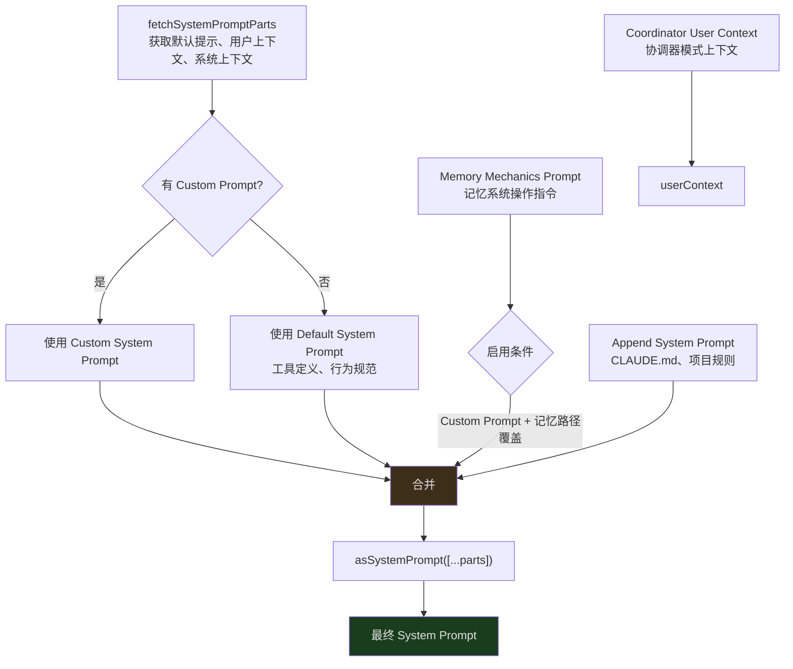
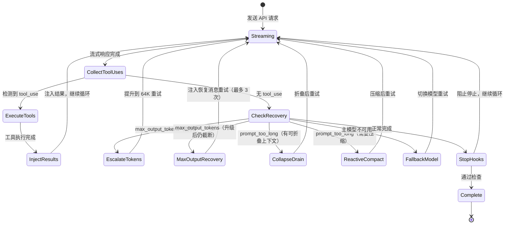
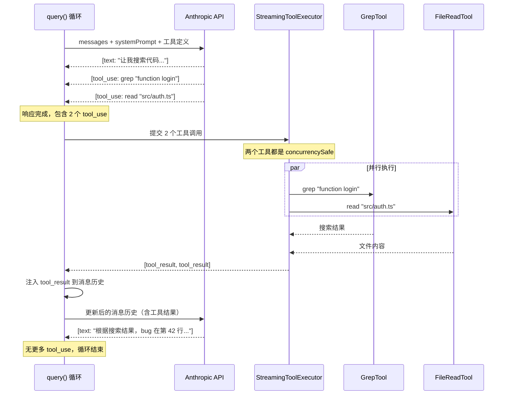
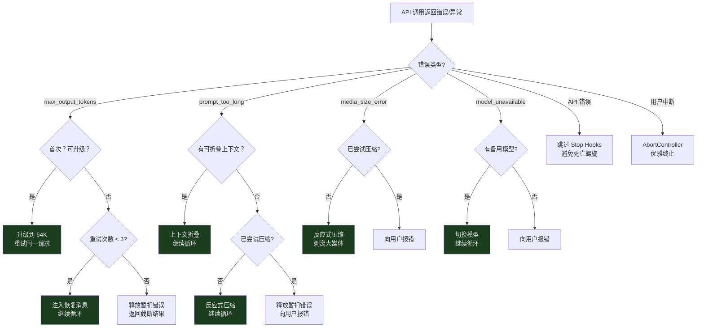
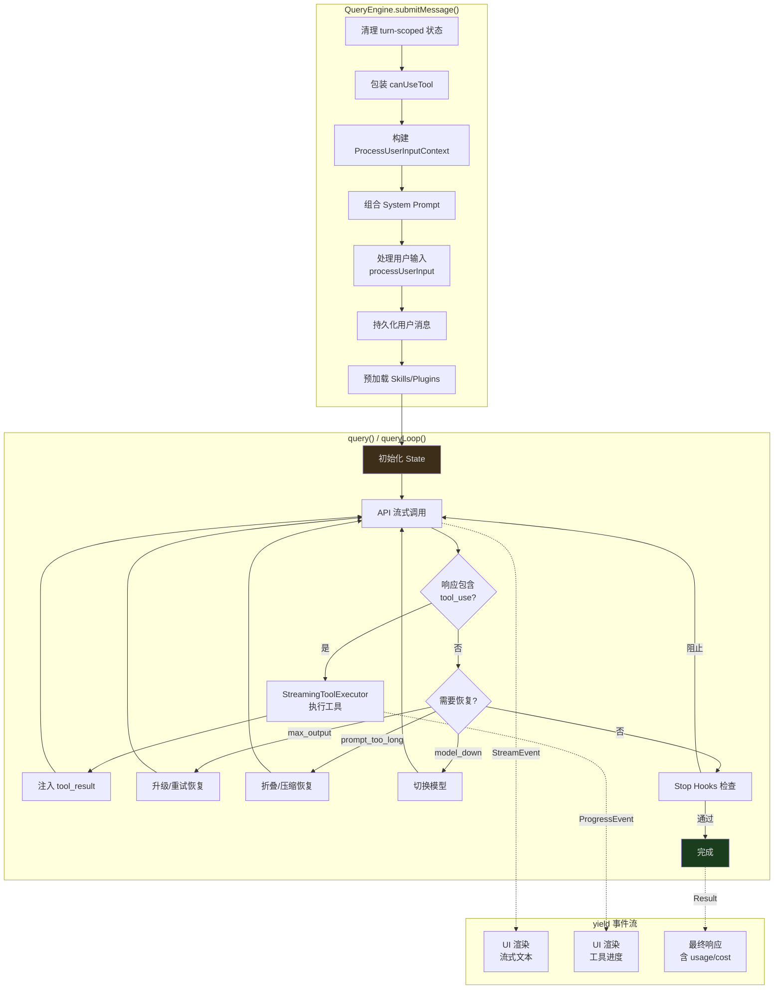

## 概览

在上一篇全景文章中，我们看到 Claude Code 的架构可以分为 5 层，而查询引擎处于最核心的位置。现在，我们要深入这一层。

当你在终端里输入一句话——"帮我修复这个 bug"——到 Claude 开始流式输出回答、执行工具、最终给你结果，中间到底发生了什么？答案藏在两个文件中：

- **`QueryEngine.ts`（约 1,295 行）** — 会话管理器，维护跨轮次的状态
- **`query.ts`（约 1,729 行）** — 流式查询循环，一个异步生成器驱动的状态机

本文将完整追踪一次对话的生命周期，从 `submitMessage()` 的入口，到 `query()` 生成器的循环执行，再到恢复策略的触发。这是理解 Claude Code 如何与 LLM 交互的关键。

---

## QueryEngine：会话的状态容器

`QueryEngine` 不是每次调用都创建的——它是一个长寿命对象，在整个对话会话期间持续存在。它的职责是管理跨轮次的状态：

```typescript
// src/QueryEngine.ts:184-207
export class QueryEngine {
  private config: QueryEngineConfig
  private mutableMessages: Message[]      // 跨轮次的完整消息历史
  private abortController: AbortController // 用户中断信号
  private permissionDenials: SDKPermissionDenial[] // 权限拒绝记录
  private totalUsage: NonNullableUsage     // 累计 token 使用量
  private hasHandledOrphanedPermission = false
  private readFileState: FileStateCache    // 已读文件缓存（避免重复读取）
  private discoveredSkillNames = new Set<string>()
  private loadedNestedMemoryPaths = new Set<string>()

  constructor(config: QueryEngineConfig) {
    this.config = config
    this.mutableMessages = config.initialMessages ?? []
    this.abortController = config.abortController ?? createAbortController()
    this.permissionDenials = []
    this.readFileState = config.readFileCache
    this.totalUsage = EMPTY_USAGE
  }
}
```

几个关键字段值得注意：

- **`mutableMessages`** — 这是整个对话的消息历史。每轮对话的新消息会追加到这里，工具执行的结果也会注入到这里。这个数组是"可变的"——在 Claude Code 偏爱不可变数据的整体设计中，这是一个有意的例外，因为消息历史需要高频更新且追加操作不会引起并发问题。
- **`readFileState`** — 一个文件读取缓存。当 AI 通过 `FileReadTool` 读取了一个文件后，其内容会被缓存在这里。如果 AI 后续再次引用这个文件，引擎可以避免重复发送完整内容到 API，节省 token。
- **`permissionDenials`** — 当用户拒绝了某个工具的执行权限时，这个拒绝会被记录在这里，用于后续的 SDK 上报。
- **`discoveredSkillNames`** — 跟踪当前轮次中发现的技能名称。每轮开始时会被清除，避免长会话中无限增长。
- **`loadedNestedMemoryPaths`** — 记录已加载的嵌套记忆路径，避免重复加载。

### QueryEngineConfig：引擎的配置合约

在深入 `submitMessage()` 之前，我们需要理解 `QueryEngineConfig`——它定义了创建 `QueryEngine` 时需要提供的一切：

```typescript
// src/QueryEngine.ts:130-173（关键字段）
export type QueryEngineConfig = {
  cwd: string                    // 工作目录
  tools: Tools                   // 可用工具列表
  commands: Command[]            // 斜杠命令列表
  mcpClients: MCPServerConnection[] // MCP 客户端连接
  agents: AgentDefinition[]      // Agent 定义
  canUseTool: CanUseToolFn       // 工具权限检查函数
  getAppState: () => AppState    // 获取应用状态
  setAppState: (f: (prev: AppState) => AppState) => void
  initialMessages?: Message[]    // 初始消息历史（恢复会话时使用）
  readFileCache: FileStateCache  // 文件状态缓存
  customSystemPrompt?: string    // 自定义系统提示
  appendSystemPrompt?: string    // 追加系统提示
  userSpecifiedModel?: string    // 用户指定模型
  fallbackModel?: string         // 备用模型
  thinkingConfig?: ThinkingConfig // 思考模式配置
  maxTurns?: number              // 最大轮次限制
  maxBudgetUsd?: number          // 预算限制（美元）
  taskBudget?: { total: number } // 任务预算
  jsonSchema?: Record<string, unknown> // 结构化输出 schema
  verbose?: boolean
  replayUserMessages?: boolean
  handleElicitation?: ToolUseContext['handleElicitation']
  snipReplay?: (            // Snip 边界处理器
    yieldedSystemMsg: Message,
    store: Message[],
  ) => { messages: Message[]; executed: boolean } | undefined
}
```

这个配置对象体现了一个重要的设计决策：**将所有外部依赖在创建时一次性注入**。`QueryEngine` 不会自己去获取工具列表或 MCP 客户端——一切都由调用者提供。这使得引擎在不同的使用场景（SDK 模式、REPL 模式、测试模式）中可以灵活配置。

---

### submitMessage()：每轮对话的入口

每当用户输入新消息时，`submitMessage()` 被调用。它是一个**异步生成器**（`async *`），这意味着它不是返回一个结果，而是逐步 yield 流式事件：

```typescript
// src/QueryEngine.ts:209-212
async *submitMessage(
  prompt: string | ContentBlockParam[],
  options?: { uuid?: string; isMeta?: boolean }
): AsyncGenerator<SDKMessage, void, unknown>
```

`submitMessage()` 的执行分为几个清晰的阶段。让我们逐一追踪。

#### 阶段 1：Turn 级别的初始化

```typescript
// src/QueryEngine.ts:238-241
this.discoveredSkillNames.clear()  // 清除上一轮发现的技能
setCwd(cwd)                        // 设置工作目录
const persistSession = !isSessionPersistenceDisabled()
const startTime = Date.now()
```

每轮对话开始时，引擎会先做一些清理工作。`discoveredSkillNames.clear()` 确保技能发现是 turn-scoped 的——长时间运行的会话不会因为技能名称集合的无限增长而浪费内存。

#### 阶段 2：权限追踪包装

```typescript
// src/QueryEngine.ts:244-271（简化）
const wrappedCanUseTool: CanUseToolFn = async (tool, input, ...) => {
  const result = await canUseTool(tool, input, ...)

  // 追踪拒绝，用于 SDK 上报
  if (result.behavior !== 'allow') {
    this.permissionDenials.push({
      tool_name: sdkCompatToolName(tool.name),
      tool_use_id: toolUseID,
      tool_input: input,
    })
  }

  return result
}
```

引擎不是直接使用配置中的 `canUseTool` 函数，而是包装了一层。这个包装在不改变权限判断逻辑的前提下，记录了所有被拒绝的工具调用。这些记录最终会出现在 SDK 返回的 `result` 消息中，让调用方知道哪些操作被用户拒绝了。

#### 阶段 3：构建 ProcessUserInputContext

这是 `submitMessage()` 最大的一步——构建一个庞大的配置对象，包含了当前轮次所需的一切：

```typescript
// src/QueryEngine.ts:335-395（关键字段）
let processUserInputContext: ProcessUserInputContext = {
  messages: this.mutableMessages,
  setMessages: fn => {
    this.mutableMessages = fn(this.mutableMessages)
  },
  onChangeAPIKey: () => {},
  handleElicitation: this.config.handleElicitation,
  options: {
    commands,
    tools,
    verbose,
    mainLoopModel: initialMainLoopModel,
    thinkingConfig: initialThinkingConfig,
    mcpClients,
    isNonInteractiveSession: true,
    customSystemPrompt,
    appendSystemPrompt,
    agentDefinitions: { activeAgents: agents, allAgents: [] },
    maxBudgetUsd,
  },
  getAppState,
  setAppState,
  abortController: this.abortController,
  readFileState: this.readFileState,
  nestedMemoryAttachmentTriggers: new Set<string>(),
  loadedNestedMemoryPaths: this.loadedNestedMemoryPaths,
  dynamicSkillDirTriggers: new Set<string>(),
  discoveredSkillNames: this.discoveredSkillNames,
  // ...更多字段
}
```

`ProcessUserInputContext` 是查询引擎和 `query()` 生成器之间的"合约"——它定义了 `query()` 可以使用的所有能力和状态。注意 `setMessages` 的实现：它通过一个闭包捕获 `this.mutableMessages` 的引用，使得斜杠命令（如 `/force-snip`）可以直接修改消息数组。

值得注意的是，`processUserInputContext` 在 `submitMessage()` 中被创建了**两次**。第一次用于处理用户输入（斜杠命令、附件等），第二次在斜杠命令处理完成后，使用更新后的消息和模型重新创建。这确保了斜杠命令对状态的修改能被后续的 `query()` 调用看到。

---

## System Prompt 的多层组合

在调用 API 之前，引擎需要组装 System Prompt。这不是简单的一个字符串，而是多层内容的组合：



看看实际的代码如何实现这个组合：

```typescript
// src/QueryEngine.ts:289-325（简化）
const {
  defaultSystemPrompt,
  userContext: baseUserContext,
  systemContext,
} = await fetchSystemPromptParts({
  tools,
  mainLoopModel: initialMainLoopModel,
  mcpClients,
  customSystemPrompt: customPrompt,
})

// 合并协调器模式的用户上下文
const userContext = {
  ...baseUserContext,
  ...getCoordinatorUserContext(mcpClients, scratchpadDir),
}

// 条件性加载记忆机制提示
const memoryMechanicsPrompt =
  customPrompt !== undefined && hasAutoMemPathOverride()
    ? await loadMemoryPrompt()
    : null

// 最终组合
const systemPrompt = asSystemPrompt([
  ...(customPrompt !== undefined ? [customPrompt] : defaultSystemPrompt),
  ...(memoryMechanicsPrompt ? [memoryMechanicsPrompt] : []),
  ...(appendSystemPrompt ? [appendSystemPrompt] : []),
])
```

各层的作用：

1. **Default System Prompt** — 基础行为规范，包括可用工具的定义、安全指令、输出格式要求。由 `fetchSystemPromptParts()` 生成，其中用户上下文和系统上下文的收集逻辑位于 `src/context.ts` 和 `src/utils/queryContext.ts`。
2. **Custom System Prompt** — 用户通过配置提供的自定义指令。如果存在，会**替换**默认提示（而不是追加）。
3. **Memory Mechanics** — 记忆系统的操作指令（如何读写 MEMORY.md）。只在同时满足两个条件时启用：存在自定义提示 + 设置了记忆路径覆盖环境变量。
4. **Append System Prompt** — 来自 CLAUDE.md 文件的项目级规则。这些**始终追加**在最后，不论是否有自定义提示。

每一层都可能包含数千 token 的内容。当 System Prompt 本身就消耗了大量上下文窗口时，留给实际对话的空间就会减少——这也是为什么上下文管理如此重要。

### User Context 与 System Context

除了 System Prompt 本身，`fetchSystemPromptParts()` 还返回两个 context 对象：

- **`userContext`** — 以 `[key: value]` 格式注入到每次 API 请求的用户消息前面。包含工作目录、平台信息、时间等动态上下文。
- **`systemContext`** — 以类似格式注入到系统消息的末尾。包含已安装的 MCP 服务器列表等静态上下文。

这种分离是有意为之的：`userContext` 在每次请求时可能变化（比如当前工作目录），而 `systemContext` 在整个会话期间相对稳定。

---

## query()：异步生成器驱动的流式状态机

`query()` 函数是整个查询引擎的核心循环。它的签名揭示了它的本质——一个异步生成器：

```typescript
// src/query.ts:219-228
export async function* query(params: QueryParams): AsyncGenerator<
  | StreamEvent
  | RequestStartEvent
  | Message
  | TombstoneMessage
  | ToolUseSummaryMessage,
  Terminal
>
```

为什么用异步生成器？因为流式 AI 对话本质上是一个**多阶段、可中断、有状态的过程**：

1. 发送请求到 API
2. 接收流式响应（token by token）
3. 检测到工具调用 -> 暂停流式输出 -> 执行工具 -> 注入结果 -> 继续请求
4. 检测到需要恢复 -> 执行恢复策略 -> 重试
5. 最终完成

生成器模式让调用者（UI 层）可以逐步消费这些事件，在每个 `yield` 点渲染最新状态，而不需要等待整个过程完成。

### query() 的两层结构

`query()` 本身只是一个薄包装。它把实际工作委托给 `queryLoop()`，然后在正常完成时通知命令生命周期：

```typescript
// src/query.ts:219-239
export async function* query(params: QueryParams): AsyncGenerator<...> {
  const consumedCommandUuids: string[] = []
  const terminal = yield* queryLoop(params, consumedCommandUuids)
  // 只在正常完成时到达这里
  // throw 时错误通过 yield* 传播
  // .return() 时两个生成器都被关闭
  for (const uuid of consumedCommandUuids) {
    notifyCommandLifecycle(uuid, 'completed')
  }
  return terminal
}
```

`yield*` 是关键——它将 `queryLoop()` 的所有 yield 值直接"透传"给 `query()` 的调用者，同时也传播错误和取消信号。这种模式让错误处理和资源清理变得自然：如果 `queryLoop()` 抛出异常，异常直接冒泡到调用者；如果调用者调用 `.return()`，两个生成器都会被正确关闭。

### State：查询循环的内部状态

```typescript
// src/query.ts:204-217
type State = {
  messages: Message[]
  toolUseContext: ToolUseContext
  autoCompactTracking: AutoCompactTrackingState | undefined
  maxOutputTokensRecoveryCount: number   // 已重试次数（最多 3 次）
  hasAttemptedReactiveCompact: boolean   // 是否已尝试反应式压缩
  maxOutputTokensOverride: number | undefined
  pendingToolUseSummary: Promise<ToolUseSummaryMessage | null> | undefined
  stopHookActive: boolean | undefined
  turnCount: number                     // 当前轮次计数
  transition: Continue | undefined       // 上一次循环为何继续
}
```

这个 `State` 类型是理解查询循环行为的关键。几个重要字段：

- **`maxOutputTokensRecoveryCount`** — 当 API 返回 `max_output_tokens` 错误时（AI 的输出被截断），引擎会自动重试。这个计数器跟踪已重试次数，上限由 `MAX_OUTPUT_TOKENS_RECOVERY_LIMIT = 3` 定义。
- **`hasAttemptedReactiveCompact`** — 当上下文接近极限时，引擎会尝试"反应式压缩"——自动压缩历史消息以腾出空间。这个标志确保压缩只尝试一次，避免无限循环。
- **`transition`** — 记录上一次迭代为何继续。它的值是 `Continue` 类型（如 `{ reason: 'max_output_tokens_recovery', attempt: 2 }`），让测试可以断言恢复路径是否触发，而不需要检查消息内容。
- **`maxOutputTokensOverride`** — 当首次遇到输出截断时，引擎会先尝试将输出 token 上限从默认的 8K 升级到 64K（`ESCALATED_MAX_TOKENS`），再考虑多轮恢复。
- **`autoCompactTracking`** — 跟踪自动压缩的状态，包括 token 使用量的警告阈值计算。

### 主循环结构



查询循环的核心是一个 `while(true)` 结构（概念上的），每次迭代：

1. **Stream** — 向 API 发送当前消息历史，接收流式响应
2. **Collect** — 从响应中收集文本内容和 `tool_use` 调用
3. **Execute** — 如果有 `tool_use`，通过 `StreamingToolExecutor` 执行工具
4. **Inject** — 将工具执行结果作为 `tool_result` 消息注入历史
5. **Decide** — 判断是继续循环（有新工具结果或需要恢复）还是结束（无更多操作）

---

## QueryParams：query() 的输入合约

在进入工具调用循环之前，让我们看看 `query()` 接收的参数：

```typescript
// src/query.ts:181-199
export type QueryParams = {
  messages: Message[]
  systemPrompt: SystemPrompt
  userContext: { [k: string]: string }
  systemContext: { [k: string]: string }
  canUseTool: CanUseToolFn
  toolUseContext: ToolUseContext
  fallbackModel?: string
  querySource: QuerySource
  maxOutputTokensOverride?: number
  maxTurns?: number
  skipCacheWrite?: boolean
  taskBudget?: { total: number }
  deps?: QueryDeps
}
```

注意 `deps?: QueryDeps` 参数。这是一个**依赖注入点**——在生产环境中使用 `productionDeps`，在测试中可以替换为模拟实现。`QueryDeps` 包含了 API 调用、工具执行等核心能力的具体实现，使得 `query()` 本身可以不依赖任何外部模块进行测试。

```typescript
// src/query/deps.ts
export type QueryDeps = {
  // API 调用、工具运行等核心依赖
}
export const productionDeps: QueryDeps = { ... }
```

---

## 工具调用循环：AI 如何使用工具

当 API 响应中包含 `tool_use` content block 时，查询循环进入工具执行阶段。这是 Claude Code 作为 AI agent 的核心能力——AI 不只是生成文本，它还能执行操作。

一次典型的工具调用循环：



注意关键细节：

- **并行执行**：`GrepTool` 和 `FileReadTool` 都声明了 `isConcurrencySafe() = true`（它们是只读操作），所以 `StreamingToolExecutor` 会并行执行它们
- **结果注入**：工具结果以 `tool_result` 消息的形式追加到消息历史，然后整个历史重新发送给 API
- **循环继续**：API 基于工具结果生成新响应，如果新响应中又包含 `tool_use`，循环继续
- **权限检查**：在工具执行之前，`wrappedCanUseTool` 会检查用户是否授权了这个操作。被拒绝的操作会返回错误消息给 AI，并记录在 `permissionDenials` 中

### 工具结果的存储优化

每个工具的执行结果可能很大（比如一个大文件的全部内容），直接存储在消息历史中会快速消耗上下文窗口。Claude Code 通过 `applyToolResultBudget`（来自 `src/utils/toolResultStorage.ts`）对工具结果进行预算控制——超出预算的结果会被截断或摘要化，确保消息历史不会因为单次工具调用而爆炸。

### 缺失工具结果的处理

当 API 响应包含 `tool_use` 但执行被中断时（比如用户按了 Ctrl+C），需要为每个未完成的工具调用生成错误类型的 `tool_result`。这是 Anthropic API 的要求——每个 `tool_use` 必须有对应的 `tool_result`：

```typescript
// src/query.ts:123-149
function* yieldMissingToolResultBlocks(
  assistantMessages: AssistantMessage[],
  errorMessage: string,
) {
  for (const assistantMessage of assistantMessages) {
    const toolUseBlocks = assistantMessage.message.content.filter(
      content => content.type === 'tool_use',
    ) as ToolUseBlock[]

    for (const toolUse of toolUseBlocks) {
      yield createUserMessage({
        content: [{
          type: 'tool_result',
          content: errorMessage,
          is_error: true,
          tool_use_id: toolUse.id,
        }],
        toolUseResult: errorMessage,
        sourceToolAssistantUUID: assistantMessage.uuid,
      })
    }
  }
}
```

这个函数遍历所有助手消息中的 `tool_use` 块，为每一个生成一条包含错误信息的 `tool_result` 用户消息。

---

## 恢复策略：当事情出错时

真实世界中，API 调用不总是成功的。网络可能中断，上下文可能溢出，模型可能无法完成输出。`query.ts` 为多种错误类型实现了自动恢复策略。

### 错误的"暂扣"机制

在深入具体策略之前，需要理解一个关键设计：**错误消息的暂扣（withholding）**。

当流式循环检测到 `max_output_tokens` 或 `prompt_too_long` 错误时，它**不会立即 yield 这个错误消息给调用者**。为什么？因为 SDK 调用者（如 Claude Desktop）可能会在收到 `error` 类型消息时立即终止会话。如果引擎 yield 了错误，然后又通过恢复策略成功继续了，调用者已经不在监听了——恢复毫无意义。

所以引擎会"暂扣"错误消息，尝试恢复。只有在恢复失败后，才会 yield 错误消息。

```typescript
// src/query.ts:175-179
// isWithheldMaxOutputTokens 检查一条消息是否是被暂扣的 max_output_tokens 错误
function isWithheldMaxOutputTokens(
  msg: Message | StreamEvent | undefined,
): msg is AssistantMessage {
  return msg?.type === 'assistant' && msg.apiError === 'max_output_tokens'
}
```

### 策略 1：输出 Token 升级（max_output_tokens 首次恢复）

当 AI 的输出被截断时，引擎首先尝试一种"零成本"恢复——提升输出 token 上限：

```typescript
// src/query.ts:1188-1221（简化）
if (isWithheldMaxOutputTokens(lastMessage)) {
  // 第一步：升级到 64K
  if (capEnabled && maxOutputTokensOverride === undefined) {
    logEvent('tengu_max_tokens_escalate', {
      escalatedTo: ESCALATED_MAX_TOKENS,
    })
    const next: State = {
      ...state,
      maxOutputTokensOverride: ESCALATED_MAX_TOKENS,
      transition: { reason: 'max_output_tokens_escalate' },
    }
    state = next
    continue  // 用更大的输出上限重试同一个请求
  }
```

这个策略的巧妙之处在于：它**重试同一个请求**，只是提升了输出 token 上限。不需要注入任何恢复消息，不增加消息历史的长度。如果 8K 不够但 64K 够了，问题就无声无息地解决了。

### 策略 2：多轮恢复（max_output_tokens 后续恢复）

如果升级到 64K 后仍然被截断，引擎进入多轮恢复模式——注入一条恢复消息，让 AI 从断点处继续：

```typescript
// src/query.ts:1223-1252
if (maxOutputTokensRecoveryCount < MAX_OUTPUT_TOKENS_RECOVERY_LIMIT) {
  const recoveryMessage = createUserMessage({
    content:
      `Output token limit hit. Resume directly — no apology, ` +
      `no recap of what you were doing. Pick up mid-thought ` +
      `if that is where the cut happened. Break remaining ` +
      `work into smaller pieces.`,
    isMeta: true,
  })

  const next: State = {
    messages: [
      ...messagesForQuery,
      ...assistantMessages,
      recoveryMessage,
    ],
    maxOutputTokensRecoveryCount: maxOutputTokensRecoveryCount + 1,
    transition: {
      reason: 'max_output_tokens_recovery',
      attempt: maxOutputTokensRecoveryCount + 1,
    },
    // ...其他字段
  }
  state = next
  continue
}
```

注意恢复消息的措辞：**"Resume directly - no apology, no recap"**。这是经过精心设计的 prompt，告诉 AI 不要浪费 token 道歉或重述上下文，直接从断点处继续。这最大化了有限输出 token 的利用率。

`MAX_OUTPUT_TOKENS_RECOVERY_LIMIT = 3`，意味着最多重试 3 次。如果 3 次后仍然截断，错误消息被 yield 给调用者。

### 策略 3：上下文折叠与反应式压缩（prompt_too_long）

当消息历史太长导致 API 返回 `prompt_too_long` 错误时，引擎有两级恢复策略。

**第一级：上下文折叠（Context Collapse）**

```typescript
// src/query.ts:1089-1117
if (
  feature('CONTEXT_COLLAPSE') &&
  contextCollapse &&
  state.transition?.reason !== 'collapse_drain_retry'
) {
  const drained = contextCollapse.recoverFromOverflow(
    messagesForQuery, querySource,
  )
  if (drained.committed > 0) {
    const next: State = {
      messages: drained.messages,
      transition: { reason: 'collapse_drain_retry', committed: drained.committed },
      // ...
    }
    state = next
    continue
  }
}
```

上下文折叠是一种轻量级压缩——它折叠已经"阶段化"的上下文块，保留细粒度信息。注意 `state.transition?.reason !== 'collapse_drain_retry'` 这个条件——如果上一次迭代已经尝试了折叠但仍然溢出，就不会再次尝试，而是 fall through 到反应式压缩。

**第二级：反应式压缩（Reactive Compact）**

```typescript
// src/query.ts:1119-1166
if ((isWithheld413 || isWithheldMedia) && reactiveCompact) {
  const compacted = await reactiveCompact.tryReactiveCompact({
    hasAttempted: hasAttemptedReactiveCompact,
    querySource,
    aborted: toolUseContext.abortController.signal.aborted,
    messages: messagesForQuery,
    cacheSafeParams: {
      systemPrompt,
      userContext,
      systemContext,
      toolUseContext,
      forkContextMessages: messagesForQuery,
    },
  })

  if (compacted) {
    const postCompactMessages = buildPostCompactMessages(compacted)
    for (const msg of postCompactMessages) {
      yield msg
    }
    const next: State = {
      messages: postCompactMessages,
      hasAttemptedReactiveCompact: true,
      transition: { reason: 'reactive_compact_retry' },
      // ...
    }
    state = next
    continue
  }

  // 压缩失败 — 释放暂扣的错误消息并退出
  yield lastMessage
  return { reason: isWithheldMedia ? 'image_error' : 'prompt_too_long' }
}
```

反应式压缩调用 `services/compact/` 中的压缩逻辑，将历史消息摘要化，释放上下文空间。`hasAttemptedReactiveCompact` 标志确保这个操作只执行一次——如果压缩后仍然溢出，说明有更根本的问题。

注意这里还处理了 **media size errors**（图片/PDF 太大）——反应式压缩可以通过剥离大媒体内容来恢复。

### 策略 4：降级模型（Fallback Model）

当主模型（如 Opus）暂时不可用或遇到特定错误时，引擎可以切换到备用模型（如 Sonnet）继续工作。这通过 `FallbackTriggeredError`（来自 `src/services/api/withRetry.ts`）触发。

### 恢复策略决策树



### 避免死亡螺旋

代码中有一个反复出现的设计关注点：**避免死亡螺旋**。当 API 错误发生时，如果引擎运行 Stop Hooks（用于验证 AI 输出的质量），Hook 可能注入更多 token，导致上下文更加溢出，触发更多错误，形成无限循环。

```typescript
// src/query.ts:1258-1264
// 当最后一条消息是 API 错误时，跳过 stop hooks
// 模型从未产生有效响应 — hooks 评估它会创造死亡螺旋：
// error → hook blocking → retry → error → …
if (lastMessage?.isApiErrorMessage) {
  void executeStopFailureHooks(lastMessage, toolUseContext)
  return { reason: 'completed' }
}
```

---

## Turn 管理：Skill 发现与清理

每轮对话不只是发送和接收消息。在每轮开始时，引擎还会执行一些内务管理：

```typescript
// src/QueryEngine.ts:238
// 每轮开始时清除 discoveredSkillNames
// 防止长会话中技能名称集合无限增长
this.discoveredSkillNames.clear()
```

`discoveredSkillNames` 跟踪当前轮次中发现的技能名称（用于 `tengu_skill_tool_invocation` 分析事件中的 `was_discovered` 字段）。为什么要每轮清除？因为在长时间运行的会话中（SDK 模式下可能持续数小时），如果不清除，这个集合会持续增长。源码注释明确说明了这个设计意图：

> Must persist across the two processUserInputContext rebuilds inside submitMessage, but is cleared at the start of each submitMessage to avoid unbounded growth across many turns in SDK mode.

这是一个细小但重要的设计决策——**turn-scoped cleanup**。

### 技能和插件的预加载

在调用 `query()` 之前，`submitMessage()` 还会并行预加载技能和插件：

```typescript
// src/QueryEngine.ts:534-538
const [skills, { enabled: enabledPlugins }] = await Promise.all([
  getSlashCommandToolSkills(getCwd()),
  loadAllPluginsCacheOnly(),
])
```

注意 `loadAllPluginsCacheOnly()` 的使用——在 headless/SDK 模式下，不会阻塞等待网络请求来获取插件。只使用缓存中已有的插件数据。如果需要最新数据，调用者可以通过 `/reload-plugins` 命令手动刷新。

---

## 会话持久化与恢复

`submitMessage()` 在整个执行过程中精心管理会话的持久化。这使得 `--resume` 功能成为可能——即使进程在中途被杀死，下次启动时也能从断点处恢复。

### 用户消息的提前持久化

```typescript
// src/QueryEngine.ts:450-463（关键逻辑）
if (persistSession && messagesFromUserInput.length > 0) {
  const transcriptPromise = recordTranscript(messages)
  if (isBareMode()) {
    void transcriptPromise  // --bare 模式下不等待
  } else {
    await transcriptPromise
  }
}
```

用户消息在进入 `query()` 循环**之前**就被持久化了。源码注释解释了为什么：

> If the process is killed before [the API responds], the transcript is left with only queue-operation entries; getLastSessionLog filters those out, returns null, and --resume fails with "No conversation found".

### 助手消息的异步持久化

相比之下，助手消息的持久化是 fire-and-forget 的：

```typescript
// src/QueryEngine.ts:727-729
if (message.type === 'assistant') {
  void recordTranscript(messages)  // 不等待
}
```

为什么？因为 `claude.ts` 的流式处理会频繁 yield 助手消息（每个 content block 一条），然后在 `message_delta` 事件中修改最后一条消息的 `usage` 和 `stop_reason`。如果每次都等待持久化完成，会阻塞流式处理管道。`enqueueWrite` 是顺序保持的，所以 fire-and-forget 在这里是安全的。

---

## 整体数据流回顾

让我们用一张图总结 `QueryEngine` 和 `query()` 的完整协作：



---

## 可迁移的工程模式

从 Claude Code 的查询引擎设计中，我们可以提取几个通用的工程模式：

### 1. 异步生成器作为流式处理的抽象

当你的系统需要处理流式数据（如 SSE 事件流、WebSocket 消息），`async function*` 是一个强大的抽象。它让生产者可以按自己的节奏 `yield` 事件，消费者可以用 `for await...of` 按自己的节奏消费。

Claude Code 更进一步使用了 `yield*` 来组合多个生成器——`query()` 委托给 `queryLoop()`，`submitMessage()` 消费 `query()` 的输出并追加额外逻辑。这种模式让复杂的流式管道保持了良好的模块化。

### 2. 状态机 + 恢复计数器模式

对于需要自动恢复的长时间运行任务，在状态中维护恢复计数器（`maxOutputTokensRecoveryCount`）和尝试标志（`hasAttemptedReactiveCompact`）是一个简洁有效的模式。它避免了无限重试，同时允许多次有序恢复。

`transition` 字段的设计更是巧妙——它不仅控制流程，还为调试和测试提供了可观测性。测试可以断言 `transition.reason === 'max_output_tokens_recovery'` 而不需要深入检查消息内容。

### 3. Context 对象作为层间合约

`ProcessUserInputContext` 模式——将当前轮次所需的所有依赖打包成一个上下文对象——是依赖注入的一种轻量级实现。它让 `query()` 函数不需要直接依赖 `QueryEngine` 的内部状态，便于测试和重用。

### 4. 错误暂扣与分级恢复

先暂扣错误消息、尝试恢复、失败后再释放——这个模式适用于任何需要优雅降级的流式系统。它避免了调用者因为中间状态的错误而过早终止。

### 5. 持久化的时机选择

用户消息同步持久化（确保可恢复），助手消息异步持久化（确保不阻塞流式管道），不同类型的数据采用不同的持久化策略。这是在可靠性和性能之间的精心权衡。

---

## 下一篇

查询引擎驱动了整个对话循环，但它的能力受限于可用的工具。[第 03 篇：工具系统](/articles/03-tool-system) 将深入 Claude Code 的 40+ 工具——它们是如何定义的？如何被发现和执行？最关键的是：AI 执行操作时，权限系统如何确保安全？
