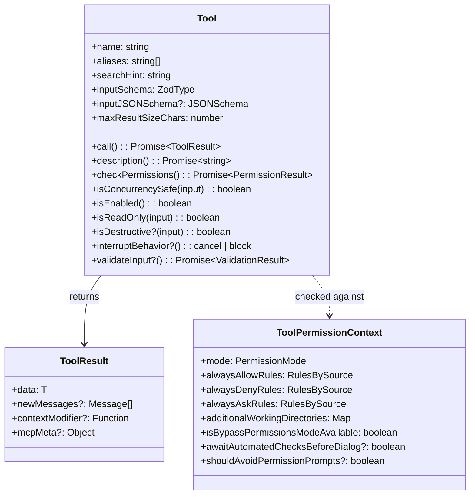
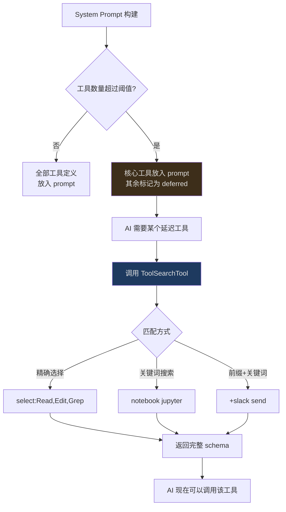
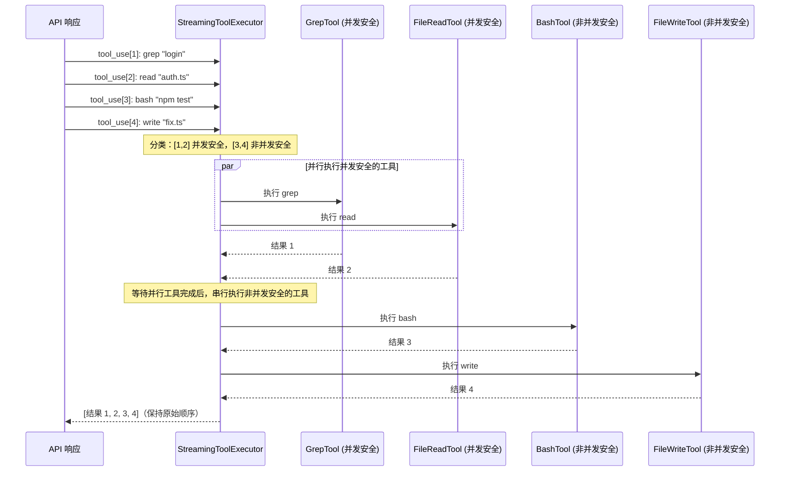
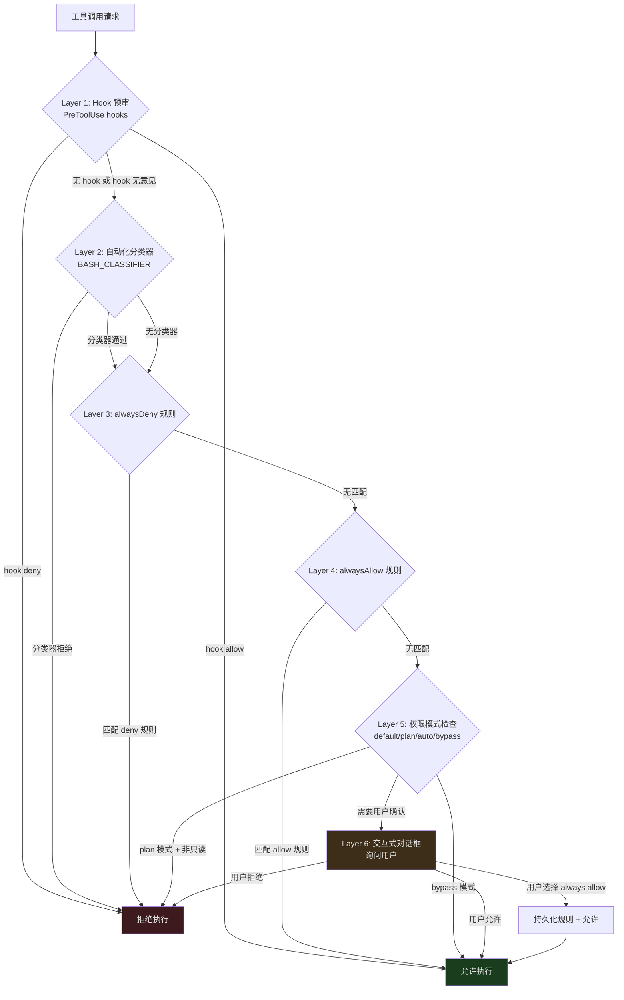
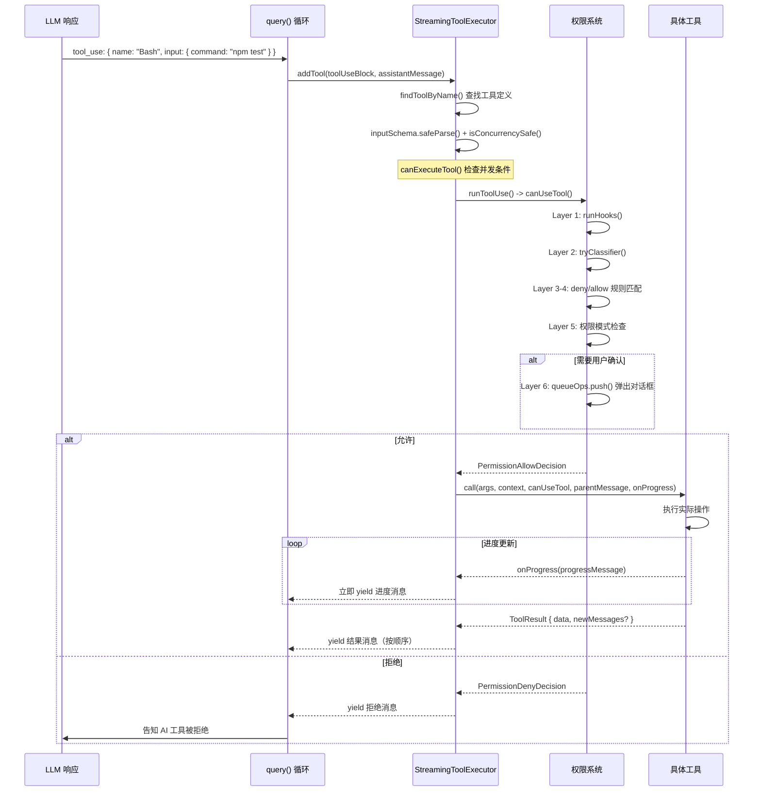
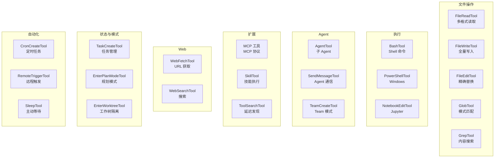

## 概览

在前两篇文章中，我们建立了 Claude Code 的全局架构认知，并深入了查询引擎的流式循环。现在我们来到了架构的第三个关键层——工具系统。

如果把查询引擎比作 Claude Code 的"大脑"，那工具就是它的"手脚"。没有工具，AI 只能生成文本。有了工具，AI 可以读写文件、执行 Shell 命令、搜索代码、访问网页、甚至生成子 Agent。

但这种能力伴随着巨大的风险。一个可以执行 `rm -rf /` 的 AI，如果没有适当的权限控制，就是一颗定时炸弹。Claude Code 的工具系统不仅要提供强大的能力，还要在每次执行前确保安全。

本文将从三个维度剖析工具系统：

1. **定义**——工具是什么，如何声明？
2. **执行**——多个工具如何并发安全地执行？
3. **权限**——谁来决定一个工具是否可以执行？

---

## 工具的类型定义

每个工具都是一个符合 `Tool` 类型的对象。让我们逐字段理解这个类型：

```typescript
// src/Tool.ts:362-599
export type Tool<
  Input extends AnyObject = AnyObject,
  Output = unknown,
  P extends ToolProgressData = ToolProgressData,
> = {
  // 身份
  aliases?: string[]       // 向后兼容的别名
  searchHint?: string      // 延迟发现时的关键词匹配

  // 核心方法
  call(args, context, canUseTool, parentMessage, onProgress?)
    : Promise<ToolResult<Output>>
  description(input, options): Promise<string>

  // Schema
  readonly inputSchema: Input           // Zod schema
  readonly inputJSONSchema?: ToolInputJSONSchema  // JSON Schema（MCP 工具用）

  // 行为声明
  isConcurrencySafe(input): boolean     // 是否可以与其他工具并行
  isEnabled(): boolean                  // 是否在当前环境中可用
  isReadOnly(input): boolean            // 是否是只读操作
  isDestructive?(input): boolean        // 是否执行不可逆操作
  interruptBehavior?(): 'cancel' | 'block'  // 用户中断时的行为

  // 权限
  checkPermissions(input, context): Promise<PermissionResult>
  validateInput?(input, context): Promise<ValidationResult>
  preparePermissionMatcher?(input): Promise<(pattern: string) => boolean>

  // 输出控制
  maxResultSizeChars: number            // 结果最大字符数
  readonly name: string
}
```

这个类型定义跨越了 `src/Tool.ts` 的近 240 行（362-599），包含了约 30 个字段和方法。上面的代码是经过简化的核心部分——完整类型还包括 UI 渲染方法（`renderToolResultMessage`、`userFacingName`）、分析方法（`toAutoClassifierInput`）等。



让我们关注几个特别值得理解的设计。

### 两种 Schema：Zod vs JSON Schema

注意 `inputSchema` 和 `inputJSONSchema` 的共存。这不是冗余设计，而是两种不同来源的工具需要不同的 schema 格式：

- **内置工具**（BashTool, FileReadTool 等）使用 **Zod schema** — TypeScript 原生，提供编译时类型检查和运行时验证
- **MCP 工具**（来自外部 MCP server）使用 **JSON Schema** — 因为 MCP 协议基于 JSON Schema 定义工具接口

```typescript
// 内置工具的 Zod schema 示例
const inputSchema = z.object({
  command: z.string().describe("The shell command to execute"),
  timeout: z.number().optional().describe("Timeout in milliseconds"),
  run_in_background: z.boolean().optional(),
})

// MCP 工具的 JSON Schema（从 MCP server 动态获取）
const inputJSONSchema: ToolInputJSONSchema = {
  type: "object",
  properties: {
    query: { type: "string", description: "SQL query" }
  },
  required: ["query"]
}
```

`ToolInputJSONSchema` 类型定义在 `src/Tool.ts:15-21`，要求根类型必须是 `object`：

```typescript
export type ToolInputJSONSchema = {
  [x: string]: unknown
  type: 'object'
  properties?: {
    [x: string]: unknown
  }
}
```

Zod schema 在 Anthropic API 调用前会被自动转换为 JSON Schema 格式——这个转换对工具开发者是透明的。双轨制让内置工具享受 TypeScript 类型系统的好处，同时让外部 MCP 工具无需引入 Zod 依赖。

### 行为声明：工具告诉系统自己的特性

Claude Code 的工具系统采用了一种"声明式"设计——工具不是被动地等待调度器查询它的属性，而是主动声明自己的行为特性。这让调度器可以在不了解工具具体实现的情况下，做出正确的调度决策。

**`isConcurrencySafe(input)`** — 这个工具是否可以与其他工具并行执行？

```typescript
// GrepTool 是只读的，可以安全并行
isConcurrencySafe() { return true }

// FileWriteTool 修改文件系统，不能并行
isConcurrencySafe() { return false }

// 注意：方法接收 input 参数，允许基于具体输入做决策
// 某些工具可能根据不同的输入返回不同的并发安全性
```

**`interruptBehavior()`** — 用户在工具执行期间提交新消息时，这个工具应该立即取消还是等待完成？

- `'cancel'` — 立即中止（大多数工具的默认行为）
- `'block'` — 继续运行，新消息等待（如正在执行 git commit 的 BashTool）

注意这个方法不接受 `input` 参数——中断行为是工具级别的，不依赖于具体输入。

**`isReadOnly(input)`** — 是否是只读操作？只读工具在权限评估中通常获得更宽松的待遇。

**`isDestructive?(input)`** — 是否执行不可逆操作（删除、覆盖、发送）？这个方法是可选的，默认为 `false`。它为权限系统提供了额外的风险信号。

**`isEnabled()`** — 工具是否在当前环境中可用？`src/tools.ts` 的 `getToolsForDefaultPreset()` 函数会过滤掉 `isEnabled()` 返回 `false` 的工具。

### ToolResult：工具的返回类型

工具执行后返回的不是原始数据，而是一个结构化的 `ToolResult<T>`：

```typescript
// src/Tool.ts:321-336
export type ToolResult<T> = {
  data: T                          // 工具的实际输出
  newMessages?: (                  // 需要注入到对话历史的消息
    | UserMessage
    | AssistantMessage
    | AttachmentMessage
    | SystemMessage
  )[]
  contextModifier?: (context: ToolUseContext) => ToolUseContext  // 修改后续上下文
  mcpMeta?: {                      // MCP 协议元数据透传
    _meta?: Record<string, unknown>
    structuredContent?: Record<string, unknown>
  }
}
```

`contextModifier` 字段特别有趣——它允许工具修改后续工具的执行上下文。但这个功能有一个重要限制：**只有非并发安全的工具才会应用 context modifier**。这是因为并发工具的执行顺序不确定，如果它们都试图修改上下文，结果将不可预测。

---

## 工具注册与发现

### 静态注册

所有内置工具在 `src/tools.ts` 中注册。`getAllBaseTools()` 函数（第 193 行）是工具的 source of truth：

```typescript
// src/tools.ts:193-251（简化）
export function getAllBaseTools(): Tools {
  return [
    AgentTool,
    TaskOutputTool,
    BashTool,
    // 嵌入式搜索工具时跳过 Glob/Grep
    ...(hasEmbeddedSearchTools() ? [] : [GlobTool, GrepTool]),
    ExitPlanModeV2Tool,
    FileReadTool,
    FileEditTool,
    FileWriteTool,
    NotebookEditTool,
    WebFetchTool,
    TodoWriteTool,
    WebSearchTool,
    // ... 更多工具
    ...(isToolSearchEnabledOptimistic() ? [ToolSearchTool] : []),
  ]
}
```

这个函数展示了几种工具注册模式：

**1. 编译期 Feature Flag**

```typescript
// src/tools.ts:29-35
const cronTools = feature('AGENT_TRIGGERS')
  ? [
      require('./tools/ScheduleCronTool/CronCreateTool.js').CronCreateTool,
      require('./tools/ScheduleCronTool/CronDeleteTool.js').CronDeleteTool,
      require('./tools/ScheduleCronTool/CronListTool.js').CronListTool,
    ]
  : []
```

`feature()` 是 Bun 的编译期宏——当 `AGENT_TRIGGERS` 在构建时为 `false`，整个 `require()` 分支及其传递依赖会从最终产物中删除。

**2. 惰性 require 打破循环依赖**

```typescript
// src/tools.ts:63-72
const getTeamCreateTool = () =>
  require('./tools/TeamCreateTool/TeamCreateTool.js')
    .TeamCreateTool as typeof import('./tools/TeamCreateTool/TeamCreateTool.js').TeamCreateTool
const getTeamDeleteTool = () =>
  require('./tools/TeamDeleteTool/TeamDeleteTool.js')
    .TeamDeleteTool
```

注意 `getTeamCreateTool()` 使用了惰性 `require()` 而不是顶层 `import`。这是为了打破循环依赖——`TeamCreateTool` 的实现可能依赖了 `tools.ts` 导出的某些类型或常量。

**3. 环境变量条件注册**

```typescript
// src/tools.ts:16-19
const REPLTool =
  process.env.USER_TYPE === 'ant'
    ? require('./tools/REPLTool/REPLTool.js').REPLTool
    : null
```

某些工具只对特定用户类型可用（如 Anthropic 内部用户）。

### 工具池组装：assembleToolPool

`getAllBaseTools()` 只是第一步。实际暴露给 AI 的工具列表还要经过过滤和合并。`assembleToolPool()`（第 345 行）是组装最终工具池的统一入口：

```typescript
// src/tools.ts:345-367
export function assembleToolPool(
  permissionContext: ToolPermissionContext,
  mcpTools: Tools,
): Tools {
  const builtInTools = getTools(permissionContext)
  const allowedMcpTools = filterToolsByDenyRules(mcpTools, permissionContext)
  // 排序以保证 prompt cache 稳定性
  const byName = (a: Tool, b: Tool) => a.name.localeCompare(b.name)
  return uniqBy(
    [...builtInTools].sort(byName).concat(allowedMcpTools.sort(byName)),
    'name',
  )
}
```

这个函数做了三件事：

1. **获取内置工具**——通过 `getTools()` 过滤已禁用和被 deny 规则阻止的工具
2. **过滤 MCP 工具**——同样应用 deny 规则
3. **去重合并**——内置工具优先，按名称排序以保证 prompt cache 稳定性

排序的目的不仅仅是整洁——注释中解释道，Anthropic API 服务端会在内置工具的最后一个位置放置 cache breakpoint。如果 MCP 工具被排序到内置工具中间，会导致所有下游 cache key 失效。

### 延迟发现：ToolSearchTool

当工具太多（40+），将所有工具定义放入 System Prompt 会消耗大量 token。Claude Code 的解决方案是**延迟加载**：



每个工具可以通过两个字段控制延迟加载行为：

- **`shouldDefer`** — 设为 `true` 的工具在工具数量超过阈值时会被延迟加载
- **`alwaysLoad`** — 设为 `true` 的工具永远不会被延迟，始终出现在初始 prompt 中

`ToolSearchTool` 支持三种查询模式：

1. **精确选择**: `"select:Read,Edit,Grep"` — 按名称获取特定工具
2. **关键词搜索**: `"notebook jupyter"` — 模糊匹配，使用 `searchHint` 字段辅助
3. **前缀+关键词**: `"+slack send"` — 要求名称包含 "slack"，再按其余词排序

每个工具的 `searchHint` 字段提供了关键词匹配支持：

```typescript
// 工具的 searchHint 示例
// AgentTool
searchHint: "subagent parallel background isolation worktree"

// NotebookEditTool
searchHint: "jupyter ipynb cell"

// 当 AI 搜索 "parallel" 时，AgentTool 会被匹配到
// searchHint 描述说明："3-10 words, no trailing period.
//   Prefer terms not already in the tool name"
```

### MCP 动态工具

除了内置工具和延迟发现，工具还可以来自外部 MCP（Model Context Protocol）server。当一个 MCP server 连接后，它暴露的所有 tool 会被动态注册到工具池。MCP 工具有一个特殊的 `mcpInfo` 字段：

```typescript
// src/Tool.ts:451-455
mcpInfo?: { serverName: string; toolName: string }
```

MCP 工具的名称通常被前缀化为 `mcp__serverName__toolName` 格式，而 `mcpInfo` 保存了原始的、未前缀化的服务器名和工具名。这让权限系统可以按 MCP 服务器级别配置规则（如 `mcp__database` 匹配该服务器的所有工具）。

MCP 工具也可以通过 `_meta['anthropic/alwaysLoad']` 标记自己为 `alwaysLoad`，确保在延迟加载模式下仍然始终可见。

---

## StreamingToolExecutor：并发安全的工具编排

当 API 响应包含多个 `tool_use` 调用时，`StreamingToolExecutor`（`src/services/tools/StreamingToolExecutor.ts`）负责决定如何执行它们——并行还是串行。

### TrackedTool：工具的运行时状态

```typescript
// src/services/tools/StreamingToolExecutor.ts:19-33
type ToolStatus = 'queued' | 'executing' | 'completed' | 'yielded'

type TrackedTool = {
  id: string
  block: ToolUseBlock
  assistantMessage: AssistantMessage
  status: ToolStatus
  isConcurrencySafe: boolean
  promise?: Promise<void>
  results?: Message[]
  pendingProgress: Message[]  // 进度消息缓冲区
  contextModifiers?: Array<(context: ToolUseContext) => ToolUseContext>
}
```

每个工具在执行器中经历四个状态：`queued`（排队等待）→ `executing`（执行中）→ `completed`（执行完成，结果已收集）→ `yielded`（结果已发射到上层）。

### 并发调度模型



调度逻辑在 `canExecuteTool()` 方法（第 129 行）中实现：

```typescript
// src/services/tools/StreamingToolExecutor.ts:129-135
private canExecuteTool(isConcurrencySafe: boolean): boolean {
  const executingTools = this.tools.filter(t => t.status === 'executing')
  return (
    executingTools.length === 0 ||
    (isConcurrencySafe && executingTools.every(t => t.isConcurrencySafe))
  )
}
```

规则非常精炼：

- 如果没有工具在执行 → 可以执行任何工具
- 如果有工具在执行，且当前工具和所有正在执行的工具都是并发安全的 → 可以执行
- 否则 → 排队等待

`processQueue()` 方法（第 140 行）在工具入队或工具完成时被调用，它遍历队列并启动所有可以执行的工具。对于非并发安全的工具，一旦遇到无法执行的就停止遍历——保证顺序性。

### 工具入队：addTool

当流式 API 响应中出现一个 `tool_use` block 时，`addTool()` 方法（第 76 行）被调用：

```typescript
// src/services/tools/StreamingToolExecutor.ts:76-124（简化）
addTool(block: ToolUseBlock, assistantMessage: AssistantMessage): void {
  const toolDefinition = findToolByName(this.toolDefinitions, block.name)
  if (!toolDefinition) {
    // 未知工具：立即标记为 completed，结果是错误消息
    this.tools.push({
      id: block.id, block, assistantMessage,
      status: 'completed',
      isConcurrencySafe: true,
      pendingProgress: [],
      results: [/* error: "No such tool available" */],
    })
    return
  }

  // 解析输入并判断并发安全性
  const parsedInput = toolDefinition.inputSchema.safeParse(block.input)
  const isConcurrencySafe = parsedInput?.success
    ? (() => {
        try { return Boolean(toolDefinition.isConcurrencySafe(parsedInput.data)) }
        catch { return false }
      })()
    : false

  this.tools.push({
    id: block.id, block, assistantMessage,
    status: 'queued', isConcurrencySafe,
    pendingProgress: [],
  })

  void this.processQueue()
}
```

注意并发安全性的判断：如果输入解析失败（`safeParse` 返回 `success: false`），工具被视为非并发安全的。这是一个安全的默认值——如果连输入都无法解析，串行执行更安全。

### Sibling Abort：级联取消

当一个 Bash 工具执行失败时，正在并行执行的其他工具会被取消。但这里有一个重要的细节——**只有 BashTool 的错误会触发级联取消**：

```typescript
// src/services/tools/StreamingToolExecutor.ts:354-363
if (isErrorResult) {
  thisToolErrored = true
  // Only Bash errors cancel siblings. Bash commands often have implicit
  // dependency chains (e.g. mkdir fails → subsequent commands pointless).
  // Read/WebFetch/etc are independent — one failure shouldn't nuke the rest.
  if (tool.block.name === BASH_TOOL_NAME) {
    this.hasErrored = true
    this.erroredToolDescription = this.getToolDescription(tool)
    this.siblingAbortController.abort('sibling_error')
  }
}
```

为什么只有 Bash？因为 Bash 命令通常有隐含的依赖链——如果 `mkdir` 失败了，后续的 `cd && make` 也没有意义。而 FileReadTool 或 WebFetchTool 的失败通常是独立的——一个文件读取失败不应该取消其他文件的读取。

`siblingAbortController` 是 `toolUseContext.abortController` 的**子控制器**（第 59 行）：

```typescript
// src/services/tools/StreamingToolExecutor.ts:53-61
constructor(
  private readonly toolDefinitions: Tools,
  private readonly canUseTool: CanUseToolFn,
  toolUseContext: ToolUseContext,
) {
  this.toolUseContext = toolUseContext
  this.siblingAbortController = createChildAbortController(
    toolUseContext.abortController,
  )
}
```

取消 `siblingAbortController` 不会取消父级的 `toolUseContext.abortController`——query 循环不会因为一个 Bash 错误而结束整个 turn。被取消的兄弟工具会收到一个合成的错误消息：

```typescript
// src/services/tools/StreamingToolExecutor.ts:153-205
private createSyntheticErrorMessage(
  toolUseId: string,
  reason: 'sibling_error' | 'user_interrupted' | 'streaming_fallback',
  assistantMessage: AssistantMessage,
): Message {
  if (reason === 'user_interrupted') {
    // 用户中断：返回 REJECT_MESSAGE
  }
  if (reason === 'streaming_fallback') {
    // 流式降级：返回降级错误
  }
  // sibling_error：返回 "Cancelled: parallel tool call X errored"
  const desc = this.erroredToolDescription
  const msg = desc
    ? `Cancelled: parallel tool call ${desc} errored`
    : 'Cancelled: parallel tool call errored'
  // ...
}
```

### 进度缓冲与有序发射

工具执行期间会发出进度消息（如搜索进度、文件读取进度、子进程输出）。这些消息的处理策略是：

- **Progress messages** → 立即 yield，实时显示给用户
- **Result messages** → 按原始 tool_use 顺序 yield，保证对话历史一致

这个分离在 `getCompletedResults()` 方法（第 412 行）中实现：

```typescript
// src/services/tools/StreamingToolExecutor.ts:412-440
*getCompletedResults(): Generator<MessageUpdate, void> {
  for (const tool of this.tools) {
    // 始终立即 yield 进度消息，不管工具状态
    while (tool.pendingProgress.length > 0) {
      const progressMessage = tool.pendingProgress.shift()!
      yield { message: progressMessage, newContext: this.toolUseContext }
    }

    if (tool.status === 'yielded') continue

    if (tool.status === 'completed' && tool.results) {
      tool.status = 'yielded'
      for (const message of tool.results) {
        yield { message, newContext: this.toolUseContext }
      }
    } else if (tool.status === 'executing' && !tool.isConcurrencySafe) {
      break  // 非并发工具必须保持顺序
    }
  }
}
```

注意最后的 `break`——当遇到一个正在执行的非并发安全工具时，停止发射后续工具的结果。这保证了非并发工具的结果严格按顺序出现在对话历史中。

在 `getRemainingResults()`（第 453 行）中，执行器使用 `Promise.race` 同时等待工具完成和进度消息：

```typescript
// src/services/tools/StreamingToolExecutor.ts:466-484
// 等待任一工具完成或进度消息可用
const progressPromise = new Promise<void>(resolve => {
  this.progressAvailableResolve = resolve
})
await Promise.race([...executingPromises, progressPromise])
```

当工具的 `executeTool()` 方法接收到进度消息时，它会将消息推入 `pendingProgress` 数组并触发 `progressAvailableResolve`，唤醒等待中的 `getRemainingResults()`。

### Discard：流式降级时的清理

`StreamingToolExecutor` 还有一个 `discard()` 方法（第 69 行），用于流式降级场景：

```typescript
discard(): void {
  this.discarded = true
}
```

当 API 流式传输失败需要降级到非流式模式时，之前已经开始执行的工具结果需要被丢弃。设置 `discarded = true` 后，`getCompletedResults()` 和 `getRemainingResults()` 会立即返回，不再发射任何结果。排队中的工具也不会启动。

---

## 权限系统：六层安全防线

工具系统最关键的设计不是能力，而是约束。Claude Code 实现了一个**六层权限评估流水线**，每个工具调用都必须通过这个流水线才能执行。

### ToolPermissionContext：不可变的权限上下文

```typescript
// src/Tool.ts:123-138
export type ToolPermissionContext = DeepImmutable<{
  mode: PermissionMode  // 'default' | 'plan' | 'auto' | 'bypassPermissions'

  // 三种规则集，每种按来源分组
  alwaysAllowRules: ToolPermissionRulesBySource  // 自动允许
  alwaysDenyRules: ToolPermissionRulesBySource   // 自动拒绝
  alwaysAskRules: ToolPermissionRulesBySource    // 总是询问用户

  // 文件系统作用域
  additionalWorkingDirectories: Map<string, AdditionalWorkingDirectory>

  // 高级选项
  isBypassPermissionsModeAvailable: boolean
  isAutoModeAvailable?: boolean
  shouldAvoidPermissionPrompts?: boolean          // 后台 agent 不弹对话框
  awaitAutomatedChecksBeforeDialog?: boolean      // Coordinator worker
  prePlanMode?: PermissionMode                    // plan 模式退出后恢复
}>
```

**`DeepImmutable<>`** 包装是这个设计的核心。`DeepImmutable` 类型（来自 `src/types/utils.ts`）递归地将所有属性标记为 `readonly`，包括嵌套对象和 Map。这意味着权限上下文一旦创建就不能被修改。

为什么不可变性如此重要？因为权限决策必须基于一致的状态。考虑一个竞态条件：

1. 线程 A 读取 `alwaysDenyRules`，发现没有匹配
2. 线程 B 添加了一条新的 deny 规则
3. 线程 A 继续执行，基于过时的规则允许了一个应该被拒绝的操作

`DeepImmutable` 在编译时阻止了步骤 2 的发生——任何尝试修改权限上下文的代码都会产生 TypeScript 编译错误。需要更新权限时，必须创建一个全新的 `ToolPermissionContext` 对象。

`getEmptyToolPermissionContext()`（第 140 行）提供了默认的空权限上下文：

```typescript
// src/Tool.ts:140-148
export const getEmptyToolPermissionContext: () => ToolPermissionContext =
  () => ({
    mode: 'default',
    additionalWorkingDirectories: new Map(),
    alwaysAllowRules: {},
    alwaysDenyRules: {},
    alwaysAskRules: {},
    isBypassPermissionsModeAvailable: false,
  })
```

### 规则来源追踪

规则不只有"允许"和"拒绝"，它们还有**来源**。`ToolPermissionRulesBySource` 记录了每条规则来自哪里：

- **用户规则** — 用户在 `~/.claude/settings.json` 中配置的
- **项目规则** — 项目 `.claude/settings.json` 中的
- **策略规则** — 组织管理员通过 MDM/远程配置下发的

来源追踪的目的不只是审计，更是**优先级判断**：策略规则优先于项目规则，项目规则优先于用户规则。当规则冲突时，高优先级的来源"赢"。

`filterToolsByDenyRules()` 函数（第 262 行）在工具池组装阶段就过滤掉被全局 deny 的工具：

```typescript
// src/tools.ts:262-269
export function filterToolsByDenyRules<
  T extends { name: string; mcpInfo?: { serverName: string; toolName: string } },
>(tools: readonly T[], permissionContext: ToolPermissionContext): T[] {
  return tools.filter(tool => !getDenyRuleForTool(permissionContext, tool))
}
```

注意泛型约束——它同时支持内置工具（只有 `name`）和 MCP 工具（有 `mcpInfo`），让同一个过滤逻辑适用于两种工具来源。

### 六层评估流水线



各层详解：

**Layer 1 — Hook 预审：** 如果配置了 PreToolUse hooks（用户在 `settings.json` 中定义的 shell 命令），先执行 hook。Hook 可以直接通过（`behavior: 'allow'`）或拒绝（`behavior: 'deny'`）工具调用，还可以通过 `updatedInput` 修改工具输入。`PermissionContext.ts` 中的 `runHooks()` 方法（第 216 行）实现了这个逻辑。

**Layer 2 — 自动化分类器（BASH_CLASSIFIER）：** 特定于 BashTool，使用分类器自动判断命令是否安全。`tryClassifier()` 方法（第 176 行）仅在 `BASH_CLASSIFIER` feature flag 启用时存在。分类器通过后会记录 approval 信息，用于 `TRANSCRIPT_CLASSIFIER` 功能。

**Layer 3 — alwaysDeny 规则：** 如果工具调用匹配了任何"总是拒绝"规则，直接拒绝。不可覆盖。

**Layer 4 — alwaysAllow 规则：** 如果工具调用匹配了"总是允许"规则，直接放行。

**Layer 5 — 权限模式检查：** 根据当前 `PermissionMode` 决定是否需要用户确认。

**Layer 6 — 交互式对话框：** 弹出终端对话框让用户决定。用户可以选择"允许"、"拒绝"或"总是允许此类操作"。选择"总是允许"时，系统会通过 `persistPermissions()` 方法（第 139 行）将规则持久化到配置文件中。

### PermissionContext：权限处理的核心

`src/hooks/toolPermission/PermissionContext.ts` 中的 `createPermissionContext()` 函数（第 96 行）创建了权限处理的核心上下文。它提供了以下关键能力：

```typescript
// src/hooks/toolPermission/PermissionContext.ts:96-104
function createPermissionContext(
  tool: ToolType,
  input: Record<string, unknown>,
  toolUseContext: ToolUseContext,
  assistantMessage: AssistantMessage,
  toolUseID: string,
  setToolPermissionContext: (context: ToolPermissionContext) => void,
  queueOps?: PermissionQueueOps,
)
```

这个上下文对象包含了多个辅助方法：

- **`logDecision()`** — 记录权限决策到分析系统
- **`logCancelled()`** — 记录工具取消事件
- **`persistPermissions()`** — 将用户的权限选择持久化到配置文件
- **`resolveIfAborted()`** — 检查是否已被取消（如用户按 Ctrl+C）
- **`cancelAndAbort()`** — 拒绝工具并中止执行
- **`runHooks()`** — 执行 PreToolUse hooks
- **`tryClassifier()`** — 尝试自动化分类器（条件存在）
- **`buildAllow()` / `buildDeny()`** — 构造允许/拒绝决策对象
- **`handleUserAllow()`** — 处理用户批准（可能包含权限持久化）

注意 `cancelAndAbort()` 方法（第 154 行）的微妙逻辑——它会根据是否是 subagent 选择不同的拒绝消息：

```typescript
cancelAndAbort(feedback?, isAbort?, contentBlocks?): PermissionDecision {
  const sub = !!toolUseContext.agentId
  const baseMessage = feedback
    ? `${sub ? SUBAGENT_REJECT_MESSAGE_WITH_REASON_PREFIX : REJECT_MESSAGE_WITH_REASON_PREFIX}${feedback}`
    : sub ? SUBAGENT_REJECT_MESSAGE : REJECT_MESSAGE
  // subagent 不中止父级
  if (isAbort || (!feedback && !contentBlocks?.length && !sub)) {
    toolUseContext.abortController.abort()
  }
  return { behavior: 'ask', message, contentBlocks }
}
```

### 三种权限处理器

权限评估的实际执行由三种处理器之一完成，取决于当前的运行模式：

```
src/hooks/toolPermission/handlers/
├── interactiveHandler.ts    // 交互模式：弹出对话框让用户决定
├── coordinatorHandler.ts    // Coordinator 模式：自动化分类 + 可选用户确认
└── swarmWorkerHandler.ts    // Swarm Worker 模式：委托给调度者
```

- **interactiveHandler** — 最常见的处理器。当工具需要用户批准时，渲染一个终端对话框，显示工具名称、参数、风险级别，让用户选择"允许"、"拒绝"或"总是允许此类操作"。
- **coordinatorHandler** — 在多 Agent 模式下，Worker 的工具调用先经过自动化分类，只有分类器无法确定的调用才提升到用户。`awaitAutomatedChecksBeforeDialog` 标志控制是否等待分类结果再弹出用户对话框。
- **swarmWorkerHandler** — Swarm 中的 Worker 将权限决策委托给 Coordinator，自己不做判断。

`PermissionQueueOps` 接口（第 57-61 行）解耦了权限 UI 和权限逻辑：

```typescript
type PermissionQueueOps = {
  push(item: ToolUseConfirm): void
  remove(toolUseID: string): void
  update(toolUseID: string, patch: Partial<ToolUseConfirm>): void
}
```

在 REPL 模式下，这些操作由 React 状态支撑；在 SDK 模式下可能有完全不同的实现。

### ResolveOnce：竞态安全的决策解析

权限系统面临一个典型的竞态条件：用户按"允许"的同时，abort 信号也到达了。如果两个回调都尝试 resolve 同一个 Promise，会产生不可预期的行为。

`createResolveOnce<T>()`（第 75-93 行）提供了原子级的竞态保护：

```typescript
// src/hooks/toolPermission/PermissionContext.ts:75-93
function createResolveOnce<T>(resolve: (value: T) => void): ResolveOnce<T> {
  let claimed = false
  let delivered = false
  return {
    resolve(value: T) {
      if (delivered) return
      delivered = true
      claimed = true
      resolve(value)
    },
    isResolved() { return claimed },
    claim() {
      if (claimed) return false
      claimed = true
      return true
    },
  }
}
```

`claim()` 方法提供了"先声明，后执行"的模式——在 async 回调中，先调用 `claim()` 获取独占权，再执行可能有副作用的操作。这关闭了 `isResolved()` 检查和 `resolve()` 调用之间的竞态窗口。

### 权限模式对比

| 模式 | 行为 | 典型场景 |
|------|------|----------|
| `default` | 危险操作询问用户，安全操作自动允许 | 正常交互使用 |
| `plan` | 只允许只读操作，禁止一切修改 | 规划阶段，不执行 |
| `auto` | 大部分操作自动允许，高风险仍询问 | 批量自动化任务 |
| `bypassPermissions` | 所有操作自动允许 | 受信任的自动化环境 |

`prePlanMode` 字段记录了进入 plan 模式前的模式，以便退出 plan 模式时恢复。

---

## 工具的完整执行流程

将上面所有层面整合，一个工具从被 AI 调用到执行完成的完整流程：



---

## 工具输出管理

工具执行后的输出不是直接发给 AI 的——它经过截断和格式化。

### Token 预算与 maxResultSizeChars

每个工具声明 `maxResultSizeChars`，控制输出的最大字符数。这个值因工具而异：

```typescript
// BashTool: maxResultSizeChars = 100_000
// GrepTool: 根据 head_limit 动态计算
// FileReadTool: maxResultSizeChars = Infinity（特殊情况）
```

`FileReadTool` 将 `maxResultSizeChars` 设为 `Infinity`——源码注释解释了原因：

> Set to Infinity for tools whose output must never be persisted (e.g. Read, where persisting creates a circular Read→file→Read loop and the tool already self-bounds via its own limits).

如果 Read 的输出被持久化到磁盘文件，AI 可能再次用 Read 读取这个文件，形成无限循环。Read 已经通过自己的 `offset`/`limit` 参数控制了输出大小，不需要外部截断。

超出 `maxResultSizeChars` 限制的输出会被保存到临时文件，AI 收到的是一个预览加上文件路径——而不是完整内容。`ContentReplacementState`（`src/utils/toolResultStorage.ts`）管理这个持久化过程。

### 大文件读取策略

`FileReadTool` 对大文件提供了分页参数：

- **`offset`** — 从第 N 行开始读取
- **`limit`** — 读取 N 行
- **`pages`** — PDF 文件的页码范围（如 "1-5"）

这让 AI 可以按需读取文件的特定部分，而不是将整个大文件加载到上下文中。

### 输出映射：从工具结果到 API 格式

每个工具必须实现 `mapToolResultToToolResultBlockParam()` 方法，将自己的输出转换为 Anthropic API 的 `ToolResultBlockParam` 格式：

```typescript
mapToolResultToToolResultBlockParam(
  content: Output,
  toolUseID: string,
): ToolResultBlockParam
```

这个方法负责将工具特定的数据格式（如文件内容、搜索结果、命令输出）序列化为 API 可以理解的文本或图片 block。

---

## 45 个工具的分类总览



每个工具的具体设计将在后续的专题文章中深入。第 21 篇将剖析文件操作三剑客，第 22 篇深入 BashTool，第 08 篇展开多 Agent 编排。

---

## ToolUseContext：工具的运行时环境

每个工具执行时都会收到一个 `ToolUseContext` 对象（`src/Tool.ts:158-300`），它包含了工具需要的一切运行时信息。这个类型有 40+ 个字段，是 Claude Code 中最大的上下文类型之一。

核心字段分为几类：

**配置与选项：**
```typescript
options: {
  commands: Command[]           // 可用命令列表
  tools: Tools                  // 可用工具列表
  mainLoopModel: string         // 当前使用的模型
  mcpClients: MCPServerConnection[]  // MCP 连接
  thinkingConfig: ThinkingConfig     // 思考模式配置
  isNonInteractiveSession: boolean   // 是否是非交互模式
  maxBudgetUsd?: number              // 预算限制
  refreshTools?: () => Tools         // 动态刷新工具列表
}
```

**状态管理：**
```typescript
getAppState(): AppState              // 读取全局状态
setAppState(f: (prev) => AppState)   // 更新全局状态
messages: Message[]                  // 当前对话历史
readFileState: FileStateCache        // 文件缓存
```

**中止与控制：**
```typescript
abortController: AbortController     // 中止信号
setInProgressToolUseIDs: (f) => void // 追踪正在执行的工具
setHasInterruptibleToolInProgress?: (v: boolean) => void
```

**子 Agent 支持：**
```typescript
agentId?: AgentId        // 子 agent 标识
agentType?: string       // agent 类型名
queryTracking?: QueryChainTracking  // 查询链追踪
```

`setAppStateForTasks` 字段（第 186 行）值得特别注意——它是专门为后台任务设计的"总是生效"的状态更新器。普通的 `setAppState` 在 async subagent 中是 no-op（为了避免并发状态冲突），但基础设施操作（如注册/清理后台任务）需要一个始终能到达根 store 的通道。

---

## 可迁移的工程模式

### 1. 行为声明式工具设计

让工具通过 `isConcurrencySafe()`、`interruptBehavior()`、`isReadOnly()` 等方法自我声明行为特性，而不是由调度器硬编码每个工具的行为。这让新工具可以无缝接入调度系统，不需要修改调度器代码。StreamingToolExecutor 的 `canExecuteTool()` 方法只有 6 行，却能正确处理任意数量的工具组合——因为调度逻辑完全基于工具的自我声明。

### 2. Schema 双轨制

当系统需要同时支持内部定义和外部协议时，提供两种 schema 格式（Zod + JSON Schema）是一个务实的选择。关键是在运行时统一处理逻辑——`safeParse()` 用于内置工具的输入验证，而 MCP 工具的 JSON Schema 在 API 序列化时直接使用。调用方不需要关心 schema 的来源格式。

### 3. 分层权限与来源追踪

权限系统中记录规则来源（用户/项目/策略）的做法值得借鉴。它不仅让冲突解决有据可循，还让审计追踪成为可能——管理员可以看到哪些权限来自组织策略，哪些是用户自行配置的。`filterToolsByDenyRules()` 在工具池组装阶段就过滤掉不可用的工具，避免了 AI 浪费 token 去调用一个永远会被拒绝的工具。

### 4. 不可变权限上下文

`DeepImmutable<ToolPermissionContext>` 的设计确保了权限评估的一致性。在任何需要安全关键决策的系统中，决策上下文的不可变性是防止 TOCTOU（Time-of-check to time-of-use）漏洞的有效手段。更新权限时创建新对象而不是修改现有对象，这个模式在 React 的状态管理中也广泛使用。

### 5. 级联取消的选择性传播

`StreamingToolExecutor` 中只有 BashTool 的错误会触发 sibling abort，而不是所有工具的错误。这种"选择性级联"比"全部取消"或"全不取消"更精确——它基于对工具间依赖关系的领域知识做出判断。这个模式可以推广到任何需要并发取消的场景。

### 6. 竞态安全的决策解析

`ResolveOnce` 的 `claim()` 模式为异步竞态条件提供了一个优雅的解决方案。在权限对话框中，用户操作和系统取消可能同时到达——`claim()` 确保只有一个回调"赢得"决策权，避免了重复 resolve 和不可预期的副作用。

---

## 系列回顾与展望

至此，基础架构篇的三篇文章完成了它的使命：

1. **第 01 篇** 建立了 5 层架构的全局视角
2. **第 02 篇** 深入了引擎层的流式查询循环
3. **第 03 篇**（本篇）剖析了工具层的定义、执行与权限

从下一篇开始，我们进入独立的深度主题。你可以按兴趣跳读：

- 对并发执行感兴趣？ --> [第 04 篇：流式工具执行器](/articles/04-streaming-tool-executor)
- 对权限系统想了解更多？ --> [第 05 篇：权限系统深入](/articles/05-permission-system)
- 对 AI 如何记住你感兴趣？ --> [第 09 篇：持久化记忆](/articles/09-memory-system)
- 想看彩蛋？ --> [第 26 篇：Buddy 宠物系统](/articles/26-buddy-system)
