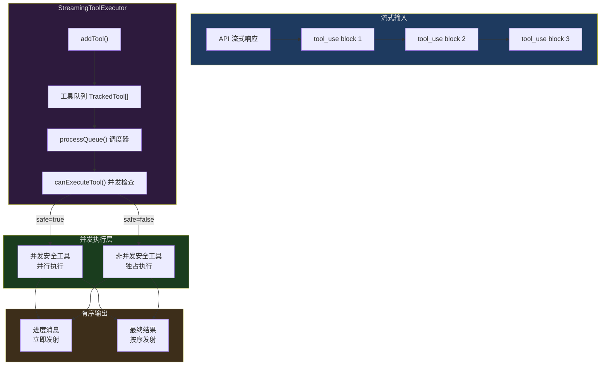
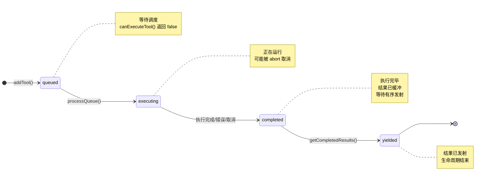
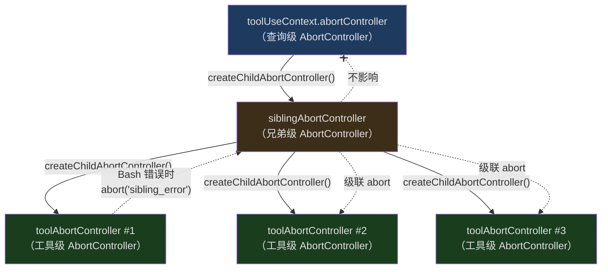

## 问题引入

想象一个场景：你让 Claude Code 重构一个模块。模型在一次响应中返回了 5 个 `tool_use` 调用——3 个文件读取、1 个 Bash 命令执行、1 个文件写入。现在问题来了：

1. 这 5 个工具应该串行执行还是并行执行？
2. 如果 Bash 命令失败了，正在并行运行的文件读取要不要取消？
3. 文件写入依赖 Bash 的结果，它应该等 Bash 完成后再执行吗？
4. 用户在工具执行过程中按了 ESC，哪些工具应该停止，哪些应该继续？
5. 多个工具同时产生进度消息，UI 应该如何有序地展示？

这些问题看似简单，但每一个都涉及并发控制的核心挑战。串行执行太慢——用户不想等 3 个独立的文件读取一个接一个地完成。全部并行又太危险——一个写入操作和一个读取操作同时访问同一个文件，可能导致数据竞争。

Claude Code 的解决方案是 `StreamingToolExecutor`——一个精心设计的并发编排器，它让每个工具自己声明是否可以并行，然后根据这些声明动态调度执行。这篇文章将深入剖析它的每一个设计决策。

---

## 为什么需要流式工具执行器？

在上一篇文章中，我们介绍了工具系统的整体架构。但有一个关键问题被有意留到了这篇文章：当模型在一次流式响应中返回多个工具调用时，执行器如何管理它们的生命周期？

传统的做法有两种极端：

**方案 A：完全串行**

```mermaid
gantt
    title 完全串行执行（总耗时 4T）
    dateFormat X
    axisFormat %s
    section 执行
        Tool 1 :a, 0, 1
        Tool 2 :b, after a, 1
        Tool 3 :c, after b, 1
        Tool 4 :d, after c, 1
```



安全但极慢。每个工具要等前一个完成才能开始。对于 3 个独立的文件读取，这意味着 3 倍的等待时间。

**方案 B：完全并行**

```mermaid
gantt
    title 完全并行执行（总耗时 T）
    dateFormat X
    axisFormat %s
    section 执行
        Tool 1 :a, 0, 1
        Tool 2 :b, 0, 1
        Tool 3 :c, 0, 1
        Tool 4 :d, 0, 1
```



快但危险。如果 Tool 1 是 `rm -rf build/`，Tool 2 是 `cat build/output.js`，并行执行的结果不可预测。

**方案 C：Claude Code 的混合调度**

```mermaid
gantt
    title 混合调度（总耗时 2T）
    dateFormat X
    axisFormat %s
    section 并行读取
        Tool 1 (Read)  :a, 0, 1
        Tool 2 (Read)  :b, 0, 1
        Tool 3 (Read)  :c, 0, 1
    section 独占写入
        Tool 4 (Bash)  :d, 1, 2
```



读操作并行，写操作独占。安全且高效。

这就是 `StreamingToolExecutor` 要解决的核心问题。

---

## 架构概览

`StreamingToolExecutor` 位于 `src/services/tools/StreamingToolExecutor.ts`，是一个约 530 行的类。它的职责是：

1. **接收工具调用**——随着流式响应的到达，逐个接收 `tool_use` block
2. **决定调度策略**——根据工具的并发安全声明，决定立即执行还是排队等待
3. **管理生命周期**——跟踪每个工具从排队到完成的全过程
4. **处理错误级联**——一个工具的失败可能需要取消其兄弟工具
5. **有序发射结果**——进度消息立即发送，最终结果按顺序发射

下面是整体架构图：



---

## TrackedTool：工具的完整生命周期

每一个进入执行器的工具调用都会被包装成一个 `TrackedTool` 对象。这个结构定义在 `StreamingToolExecutor.ts` 的第 21-32 行：

```typescript
// src/services/tools/StreamingToolExecutor.ts:19-32
// 工具生命周期的四个状态：排队 → 执行中 → 已完成 → 已发射
type ToolStatus = 'queued' | 'executing' | 'completed' | 'yielded'

// TrackedTool 是执行器对每个工具调用的内部跟踪结构
// 它将工具调用的原始信息与执行状态、结果等运行时信息封装在一起
type TrackedTool = {
  id: string                    // 工具调用的唯一标识符，来自 API 响应
  block: ToolUseBlock           // 原始的 tool_use 块，包含工具名称和输入参数
  assistantMessage: AssistantMessage  // 包含此工具调用的助手消息（用于生成合成错误时关联上下文）
  status: ToolStatus            // 当前生命周期状态
  isConcurrencySafe: boolean    // 在 addTool 时预计算的并发安全性（避免重复计算）
  promise?: Promise<void>       // 工具执行的 Promise，用于 await 等待完成
  results?: Message[]           // 工具执行的最终结果消息（成功或错误）
  // Progress messages are stored separately and yielded immediately
  // 进度消息与最终结果分开存储——进度需要实时展示给用户，不受有序发射约束
  pendingProgress: Message[]
  // 上下文修改器：工具执行后可能需要更新共享上下文（如文件历史状态）
  // 注意：目前仅非并发安全的工具支持此功能，以避免并发竞态条件
  contextModifiers?: Array<(context: ToolUseContext) => ToolUseContext>
}
```

### 四个生命周期状态

`ToolStatus` 是一个四值枚举，每个工具严格按照 `queued -> executing -> completed -> yielded` 的顺序流转：



**queued（排队中）**：工具刚被 `addTool()` 添加，还没有开始执行。当前可能有其他非并发安全的工具正在独占执行，所以它必须等待。

**executing（执行中）**：工具已经开始执行。它的 `promise` 字段持有执行的 Promise，进度消息通过 `pendingProgress` 数组实时收集。

**completed（已完成）**：工具执行结束（成功、失败、或被取消），结果已经存储在 `results` 字段中，但还没有被发射给调用者。这是有序发射的关键——即使 Tool 3 先完成，它也要等 Tool 1 和 Tool 2 的结果先发射。

**yielded（已发射）**：结果已经通过 `getCompletedResults()` 发射给调用者，这个工具的生命周期彻底结束。

### 关键字段解析

`pendingProgress` 是一个值得特别关注的字段。进度消息（比如 Bash 命令的实时输出）需要立即展示给用户，不能等到工具完成后才发送。所以进度消息和最终结果分开存储——进度消息随时可以发射，最终结果必须按顺序发射。

`contextModifiers` 存储工具对执行上下文的修改。例如，一个工具可能需要更新文件历史状态。但请注意代码中的一个重要限制（第 391-395 行）：

```typescript
// src/services/tools/StreamingToolExecutor.ts:389-395
// NOTE: we currently don't support context modifiers for concurrent
//       tools. None are actively being used, but if we want to use
//       them in concurrent tools, we need to support that here.
// 只有非并发安全的工具才允许修改共享上下文
// 原因：并发工具同时修改上下文会产生竞态条件，结果不可预测
// 这是一个有意为之的设计限制，而非遗漏
if (!tool.isConcurrencySafe && contextModifiers.length > 0) {
  // 依次应用所有上下文修改器，每个修改器接收当前上下文并返回新上下文
  for (const modifier of contextModifiers) {
    this.toolUseContext = modifier(this.toolUseContext)
  }
}
```

只有非并发安全的工具才能修改上下文。这是一个精心的设计限制——并发工具修改共享上下文会引入竞态条件，所以干脆禁止。

---

## isConcurrencySafe：工具自己决定是否可以并行

`StreamingToolExecutor` 最核心的设计理念是**工具自己声明并发安全性**。不是由调度器猜测，也不是用一个全局配置表，而是每个工具在定义时实现 `isConcurrencySafe()` 方法。

这个方法定义在 `src/Tool.ts` 的第 402 行：

```typescript
// src/Tool.ts:402
// 工具接口中的并发安全声明方法
// 接收经过 Zod schema 验证后的输入参数，返回布尔值
// 注意：input 参数使得同一工具可以根据不同输入返回不同的并发安全性
// 例如 BashTool：只读命令返回 true，写入命令返回 false
isConcurrencySafe(input: z.infer<Input>): boolean
```

注意它接受 `input` 参数——这意味着同一个工具，不同的输入可能有不同的并发安全性。

### 各工具的并发安全声明

让我们看看实际代码中各工具是如何声明的：

**FileReadTool（文件读取）——始终并发安全：**

```typescript
// src/tools/FileReadTool/FileReadTool.ts:373-375
// 文件读取是纯只读操作，多个读取之间不会互相干扰，因此始终返回 true
isConcurrencySafe() {
  return true
},
```

文件读取是纯只读操作，多个读取同时进行不会产生副作用。

**GrepTool（搜索）——始终并发安全：**

```typescript
// src/tools/GrepTool/GrepTool.ts:183-185
// 搜索操作只读取文件内容，不产生任何副作用，天然支持并行
isConcurrencySafe() {
  return true
},
```

搜索操作同样是只读的，天然支持并行。

**AgentTool（子 Agent）——始终并发安全：**

```typescript
// src/tools/AgentTool/AgentTool.tsx:1273-1275
// 子 Agent 在各自隔离的上下文中运行，互不影响，可以安全并行
isConcurrencySafe() {
  return true;
},
```

子 Agent 工具声明为并发安全，因为每个子 Agent 在自己的隔离上下文中运行。

**BashTool（命令执行）——取决于输入：**

```typescript
// src/tools/BashTool/BashTool.tsx:434-436
// Bash 工具的并发安全性取决于命令内容：只读命令（ls、cat、grep）可并行，
// 有副作用的命令（rm、mv、git commit）必须独占执行
// 如果 isReadOnly 方法不存在或返回 undefined，则默认为 false（保守策略）
isConcurrencySafe(input) {
  return this.isReadOnly?.(input) ?? false;
},
```

这是最有趣的情况。Bash 工具的并发安全性取决于命令本身是否只读。`ls`、`cat`、`grep` 等命令是只读的，可以并行；`rm`、`mv`、`git commit` 等命令有副作用，必须独占执行。

**默认行为——假设不安全（第 759 行）：**

```typescript
// src/Tool.ts:757-759
// 工具的默认配置——保守安全原则
// 未显式声明 isConcurrencySafe 的工具一律视为不安全，必须独占执行
// 这确保了新增工具时不会因为遗忘声明而意外并行，避免潜在的数据竞争
const TOOL_DEFAULTS = {
  // ...
  isConcurrencySafe: (_input?: unknown) => false,
  // ...
}
```

通过 `buildTool()` 构建的工具，如果没有显式声明 `isConcurrencySafe`，默认返回 `false`。这是一个**保守安全**的设计——宁可牺牲性能，也不冒并发风险。

### addTool 中的安全性计算

当一个工具被添加到执行器时，`isConcurrencySafe` 的计算过程值得仔细审视。参见 `StreamingToolExecutor.ts` 的第 104-121 行：

```typescript
// src/services/tools/StreamingToolExecutor.ts:104-121
// 第一层防御：用 Zod schema 验证输入格式，解析失败则视为不安全
const parsedInput = toolDefinition.inputSchema.safeParse(block.input)
// 三层防御计算并发安全性：输入验证 → try-catch → Boolean 强转
const isConcurrencySafe = parsedInput?.success
  ? (() => {
      try {
        // 第二层防御：即使输入合法，isConcurrencySafe() 本身也可能抛异常
        return Boolean(toolDefinition.isConcurrencySafe(parsedInput.data))
      } catch {
        // 任何异常都回退到 false，确保安全
        return false
      }
    })()
  : false // 输入解析失败 → 直接标记为非并发安全
// 将工具封装为 TrackedTool 并加入队列，初始状态为 queued
this.tools.push({
  id: block.id,
  block,
  assistantMessage,
  status: 'queued',        // 所有工具都从排队状态开始
  isConcurrencySafe,       // 预计算的并发安全性，后续不再重复计算
  pendingProgress: [],     // 初始化空的进度消息数组
})
```

这里有三层防御：

1. **输入验证**：先用 Zod schema 验证输入。如果输入格式不合法，直接标记为非并发安全。
2. **try-catch 包装**：即使输入合法，`isConcurrencySafe()` 自身也可能抛异常（比如工具定义有 bug）。任何异常都回退到 `false`。
3. **Boolean 强制转换**：结果被 `Boolean()` 包装，防止工具意外返回 truthy 值（如非空字符串）。

这种"层层兜底"的设计模式在 Claude Code 中随处可见——在并发和安全相关的代码路径上，永远假设最坏情况。

---

## canExecuteTool：调度的核心判断

有了每个工具的并发安全声明，调度器如何决定一个工具能否立即执行？这个逻辑非常精炼，只有 6 行代码（第 129-135 行）：

```typescript
// src/services/tools/StreamingToolExecutor.ts:129-135
// 调度核心：判断一个工具是否可以立即执行
// 本质上实现了一个读写锁：safe = 读锁（可共存），unsafe = 写锁（必须独占）
private canExecuteTool(isConcurrencySafe: boolean): boolean {
  // 获取当前所有正在执行的工具
  const executingTools = this.tools.filter(t => t.status === 'executing')
  return (
    // 条件 1：当前无工具在执行（空闲状态），任何工具都可以启动
    executingTools.length === 0 ||
    // 条件 2：新工具是并发安全的，且所有正在执行的工具也是并发安全的
    // 即：只有"读锁 + 读锁"的组合才允许共存
    (isConcurrencySafe && executingTools.every(t => t.isConcurrencySafe))
  )
}
```

翻译成自然语言：**一个工具可以执行，当且仅当以下两个条件之一成立**：

1. 当前没有任何工具在执行（空闲状态，任何工具都可以开始）
2. 当前工具是并发安全的，**并且**所有正在执行的工具也都是并发安全的

这个逻辑隐含了一个重要推论：**只要有一个非并发安全的工具在执行，所有其他工具都必须等待**。非并发安全的工具获得独占访问权。

让我们用表格可视化：

| 当前执行中的工具 | 新工具 (safe) | 新工具 (unsafe) |
|:---|:---:|:---:|
| 无（空闲） | 可执行 | 可执行 |
| 全部 safe | 可执行 | 等待 |
| 包含 unsafe | 等待 | 等待 |

这就是一个经典的**读写锁**模式：并发安全工具类似读锁（多个可共存），非并发安全工具类似写锁（必须独占）。

---

## processQueue：队列调度的微妙之处

`processQueue()` 方法（第 140-151 行）负责遍历队列并启动可执行的工具：

```typescript
// src/services/tools/StreamingToolExecutor.ts:140-151
// 队列调度方法：遍历工具队列，将可执行的工具启动
private async processQueue(): Promise<void> {
  for (const tool of this.tools) {
    // 跳过非排队状态的工具（已在执行、已完成、已发射）
    if (tool.status !== 'queued') continue

    if (this.canExecuteTool(tool.isConcurrencySafe)) {
      // 满足执行条件，立即启动（注意 await 只等待启动，不等待完成）
      await this.executeTool(tool)
    } else {
      // Can't execute this tool yet, and since we need to maintain
      // order for non-concurrent tools, stop here
      // 关键逻辑：遇到无法执行的 unsafe 工具时必须 break
      // 原因：unsafe 工具之间存在顺序依赖，如果跳过它继续调度后面的工具，
      // 可能破坏执行顺序（例如跳过 git add 去执行后面的 git commit）
      // 而 safe 工具被跳过是安全的——它只是暂时无法执行（因为有 unsafe 在独占），
      // 等独占工具完成后它自然会被调度
      if (!tool.isConcurrencySafe) break
    }
  }
}
```

这段代码有一个容易被忽视但极为关键的细节——`break` 语句。当遇到一个不能执行的**非并发安全**工具时，调度器会停止遍历。为什么？

考虑以下工具序列：

```mermaid
gantt
    title 工具序列与并发安全性
    dateFormat X
    axisFormat %s
    section safe
        Read A :a, 0, 1
        Read B :b, 0, 1
    section unsafe
        Bash "git add ." :c, 1, 2
    section safe
        Read C :d, 2, 3
    section unsafe
        Bash "git commit" :e, 3, 4
```



如果没有 `break`，调度器在发现 `Bash "git add ."` 无法执行时会跳过它，继续检查 `Read C`。`Read C` 是并发安全的，可能会被启动。但这有问题——`Read C` 在 `git add .` **之前**执行，可能读到还没有被添加到暂存区的文件内容。

`break` 确保了**非并发安全工具之间的顺序性**。一旦遇到排队中的非并发安全工具，后面的所有工具（无论安全与否）都不会被启动。

但反过来看：如果不能执行的是一个**并发安全**工具呢？它只是被跳过（`continue`），不会阻止后续工具的调度。什么场景下并发安全工具无法执行？当前有非并发安全工具在独占执行时。一旦独占工具完成，所有排队的并发安全工具就可以一起启动。

### processQueue 的触发时机

`processQueue()` 在两个地方被调用：

1. **addTool() 中**（第 123 行）：每添加一个新工具，立即尝试调度。
2. **executeTool() 完成时**（第 402-404 行）：工具执行完毕后，触发新一轮调度。

```typescript
// src/services/tools/StreamingToolExecutor.ts:398-404
// collectResults() 返回工具执行的 Promise（包含结果收集逻辑）
const promise = collectResults()
// 将 Promise 存储到 TrackedTool 上，供 getRemainingResults() 中 Promise.race 使用
tool.promise = promise

// Process more queue when done
// 工具完成后自动触发新一轮调度——这构成了自驱动循环：
// 工具完成 → processQueue() → 启动新工具 → 新工具完成 → processQueue() → ...
// void 前缀表示有意忽略返回的 Promise（fire-and-forget 模式）
void promise.finally(() => {
  void this.processQueue()
})
```

这构成了一个自驱动的循环：工具完成 -> 尝试调度 -> 新工具开始 -> 新工具完成 -> 再次调度...直到队列清空。

---

## Sibling AbortController：错误的级联取消

并发执行最棘手的问题之一是错误处理。当多个工具并行运行时，一个工具的失败应该如何影响其他工具？

Claude Code 的设计是：**只有 Bash 工具的错误会级联取消兄弟工具**。这个设计源于一个实际观察——Bash 命令之间往往存在隐式依赖链（`mkdir` 失败了，后续的 `cd` 和 `touch` 就没有意义了），而 Read、Grep、WebFetch 等工具则是独立的——一个文件读取失败不应该影响另一个文件的读取。

### 三层 AbortController 架构

错误级联依赖一个精心设计的三层 `AbortController` 架构：



**第一层：查询级 AbortController（`toolUseContext.abortController`）**

这是整个查询轮次的生命周期控制器。用户按 ESC 或提交新消息时，这个控制器会被 abort，导致整个轮次结束。

**第二层：兄弟级 AbortController（`siblingAbortController`）**

这是 `StreamingToolExecutor` 在构造时创建的，是查询级控制器的子控制器（第 59-61 行）：

```typescript
// src/services/tools/StreamingToolExecutor.ts:59-61
// 创建兄弟级 AbortController，作为查询级控制器的子控制器
// 关键特性：abort 子控制器不会向上传播到父控制器
// 因此 Bash 错误取消兄弟工具时，不会终止整个查询轮次
this.siblingAbortController = createChildAbortController(
  toolUseContext.abortController,
)
```

关键特性：**abort 兄弟级控制器不会 abort 父级控制器**。这意味着 Bash 错误可以取消所有兄弟工具，但不会终止整个查询轮次——模型仍然会收到错误信息并继续推理。

**第三层：工具级 AbortController（`toolAbortController`）**

每个工具执行时创建自己的控制器，作为兄弟级控制器的子控制器（第 301-302 行）：

```typescript
// src/services/tools/StreamingToolExecutor.ts:301-302
// 为每个工具创建独立的 AbortController，作为兄弟级控制器的子控制器
// 层级关系：查询级 → 兄弟级 → 工具级
// 当兄弟级被 abort 时，所有工具级控制器都会收到信号
const toolAbortController = createChildAbortController(
  this.siblingAbortController,
)
```

### Bash 错误的级联路径

当一个 Bash 工具执行失败时，完整的级联路径如下（第 354-363 行）：

```typescript
// src/services/tools/StreamingToolExecutor.ts:354-363
// 检测到工具执行结果包含错误
if (isErrorResult) {
  // 标记当前工具已出错，防止后续收到重复的合成错误消息
  thisToolErrored = true
  // Only Bash errors cancel siblings. Bash commands often have implicit
  // dependency chains (e.g. mkdir fails → subsequent commands pointless).
  // Read/WebFetch/etc are independent — one failure shouldn't nuke the rest.
  // 只有 Bash 工具的错误才触发级联取消
  // 设计理由：Bash 命令之间常有隐式依赖（mkdir 失败 → cd 无意义）
  // 而 Read/Grep 等只读工具彼此独立，一个失败不应影响其他
  if (tool.block.name === BASH_TOOL_NAME) {
    this.hasErrored = true  // 全局错误标志，阻止后续工具启动
    this.erroredToolDescription = this.getToolDescription(tool)  // 记录出错工具描述，用于合成错误消息
    this.siblingAbortController.abort('sibling_error')  // 触发级联取消所有兄弟工具
  }
}
```

执行流程：

1. Bash 工具的执行结果中包含 `is_error: true` 的 `tool_result`
2. `hasErrored` 标志被设置为 `true`
3. `erroredToolDescription` 记录了出错工具的描述（例如 `Bash(mkdir /tmp/test…)`）
4. `siblingAbortController.abort('sibling_error')` 被调用
5. 这个 abort 信号通过 `createChildAbortController` 的父子关系传播到所有其他工具的 `toolAbortController`
6. 正在执行的工具收到 abort 信号后，生成合成错误消息（第 189-204 行）

### 工具级 abort 的向上传播

工具级 `AbortController` 有一个微妙的事件监听器（第 304-317 行），它处理一种特殊情况——当权限对话框拒绝时：

```typescript
// src/services/tools/StreamingToolExecutor.ts:304-317
// 工具级 abort 的向上冒泡逻辑
// 场景：当用户在权限对话框中拒绝工具执行时，需要终止整个查询轮次
toolAbortController.signal.addEventListener(
  'abort',
  () => {
    // 三个过滤条件，全部满足时才向上冒泡：
    if (
      // 1. abort 原因不是兄弟错误（兄弟错误只取消同级，不影响父级）
      toolAbortController.signal.reason !== 'sibling_error' &&
      // 2. 父级控制器尚未被 abort（避免重复触发）
      !this.toolUseContext.abortController.signal.aborted &&
      // 3. 执行器未被 discard（流式降级时无需冒泡）
      !this.discarded
    ) {
      // 将 abort 原因（如权限拒绝）传播到查询级控制器，终止整个轮次
      this.toolUseContext.abortController.abort(
        toolAbortController.signal.reason,
      )
    }
  },
  { once: true },  // 只监听一次，避免重复触发
)
```

这段代码的意思是：如果工具被 abort 的原因**不是**兄弟错误（而是权限拒绝等其他原因），那么这个 abort 需要**向上冒泡**到查询级控制器，终止整个轮次。代码注释中提到了 `#21056 regression`——这个向上冒泡的逻辑是为了修复一个具体的回归 bug。

### 合成错误消息

被取消的工具不是简单地被丢弃——它们会收到一个合成的错误消息，这样模型知道这些工具没有成功执行。`createSyntheticErrorMessage` 方法（第 153-205 行）根据取消原因生成不同的错误消息：

```typescript
// src/services/tools/StreamingToolExecutor.ts:153-205
// 为被取消的工具生成合成错误消息
// 这些消息会被发送回模型，让模型知道哪些工具未能成功执行及原因
private createSyntheticErrorMessage(
  toolUseId: string,
  reason: 'sibling_error' | 'user_interrupted' | 'streaming_fallback',
  assistantMessage: AssistantMessage,
): Message {
  // 用户主动中断（按 ESC 或提交新消息）
  if (reason === 'user_interrupted') {
    return createUserMessage({
      content: [{
        type: 'tool_result',
        // withMemoryCorrectionHint 会附加提示，帮助模型记住用户偏好
        content: withMemoryCorrectionHint(REJECT_MESSAGE),
        is_error: true,
        tool_use_id: toolUseId,
      }],
      toolUseResult: 'User rejected tool use',
      // ...
    })
  }
  // 流式降级——网络错误导致需要丢弃当前执行结果
  if (reason === 'streaming_fallback') {
    return createUserMessage({
      content: [{
        type: 'tool_result',
        content: '<tool_use_error>Error: Streaming fallback - tool execution discarded</tool_use_error>',
        is_error: true,
        tool_use_id: toolUseId,
      }],
      // ...
    })
  }
  // sibling_error：兄弟 Bash 工具出错导致的级联取消
  // 消息中包含出错工具的描述，帮助模型理解失败原因
  const desc = this.erroredToolDescription
  // 构造错误消息：如果有出错工具的描述，则包含在消息中
  // 例如："Cancelled: parallel tool call Bash(mkdir /tmp/test…) errored"
  const msg = desc
    ? `Cancelled: parallel tool call ${desc} errored`
    : 'Cancelled: parallel tool call errored'
  return createUserMessage({
    content: [{
      type: 'tool_result',
      // 用 XML 标签包装错误信息，便于模型解析
      content: `<tool_use_error>${msg}</tool_use_error>`,
      is_error: true,
      tool_use_id: toolUseId,
    }],
    // ...
  })
}
```

三种取消原因产生三种不同的消息：

| 原因 | 消息内容 | 用途 |
|:---|:---|:---|
| `sibling_error` | `Cancelled: parallel tool call Bash(mkdir…) errored` | 模型知道哪个兄弟工具失败了 |
| `user_interrupted` | `User rejected tool use` + 记忆纠正提示 | 模型知道用户主动取消 |
| `streaming_fallback` | `Streaming fallback - tool execution discarded` | 流式降级时的静默取消 |

### 防止重复错误消息

代码中有一个精妙的防重复逻辑——`thisToolErrored` 标志（第 330-345 行）：

```typescript
// src/services/tools/StreamingToolExecutor.ts:328-345
// Track if this specific tool has produced an error result.
// This prevents the tool from receiving a duplicate "sibling error"
// message when it is the one that caused the error.
// 防重复标志：跟踪当前工具是否已经产生了错误结果
// 场景：Bash 工具出错 → 触发 siblingAbortController.abort() →
// 自身也会检测到 abort 信号 → 但不应该再收到额外的合成错误消息
let thisToolErrored = false

// 从工具执行的异步生成器中逐步消费更新
for await (const update of generator) {
  // 每次迭代都检查是否有 abort 原因（兄弟错误、用户中断、流式降级）
  const abortReason = this.getAbortReason(tool)
  // 如果存在 abort 原因，且当前工具不是错误的始作俑者，则生成合成错误消息
  if (abortReason && !thisToolErrored) {
    messages.push(
      this.createSyntheticErrorMessage(
        tool.id,
        abortReason,
        tool.assistantMessage,
      ),
    )
    break  // 立即停止消费此工具的后续输出
  }
  // ...
  if (isErrorResult) {
    // 标记当前工具已出错——后续即使检测到 abort 信号也不会生成重复的错误消息
    thisToolErrored = true
    // ...
  }
}
```

如果 Tool A 是 Bash 工具且执行出错，它会触发 `siblingAbortController.abort()`。此时 `getAbortReason()` 也会对 Tool A 自身返回 `sibling_error`。但因为 `thisToolErrored` 已经被设为 `true`，Tool A 不会收到额外的合成错误消息——它已经有了自己真实的错误结果。

---

## 进度缓冲与有序发射

并发执行引入了一个输出排序问题。假设 Tool 1 和 Tool 2 并行执行，Tool 2 先完成——它的结果应该在 Tool 1 之前发射吗？

Claude Code 的答案是区别对待两种输出：

1. **进度消息（Progress）**：立即发射，不等排序
2. **最终结果（Result）**：必须按工具添加顺序发射

### 进度消息的即时发射

在 `executeTool()` 方法的执行循环中（第 366-374 行），进度消息被存入 `pendingProgress` 数组：

```typescript
// src/services/tools/StreamingToolExecutor.ts:366-374
if (update.message) {
  // Progress messages go to pendingProgress for immediate yielding
  // 区分两种消息类型：进度消息 vs 最终结果消息
  if (update.message.type === 'progress') {
    // 进度消息（如 Bash 命令的实时输出）存入独立数组，可以立即发射给 UI
    tool.pendingProgress.push(update.message)
    // Signal that progress is available
    // 通知等待中的 getRemainingResults()：有新的进度消息可以发射了
    // 这里使用了 Promise resolve 作为简单的信号量机制
    if (this.progressAvailableResolve) {
      this.progressAvailableResolve()
      this.progressAvailableResolve = undefined  // 重置信号量，等待下一次创建
    }
  } else {
    // 非进度消息（最终结果）存入 messages 数组，后续按序发射
    messages.push(update.message)
  }
}
```

注意 `progressAvailableResolve` 信号量——当有新的进度消息时，它会唤醒正在等待的 `getRemainingResults()`。

### 结果的有序发射

`getCompletedResults()` 方法（第 412-440 行）实现了有序发射逻辑：

```typescript
// src/services/tools/StreamingToolExecutor.ts:412-440
// 有序发射已完成工具的结果（同步 Generator）
// 核心原则：进度消息立即发射，最终结果严格按工具添加顺序发射
*getCompletedResults(): Generator<MessageUpdate, void> {
  // 流式降级后，不再发射任何结果
  if (this.discarded) {
    return
  }

  // 按工具添加顺序遍历——这保证了结果的有序性
  for (const tool of this.tools) {
    // Always yield pending progress messages immediately,
    // regardless of tool status
    // 无论工具处于什么状态，进度消息都立即发射（不受排序约束）
    while (tool.pendingProgress.length > 0) {
      const progressMessage = tool.pendingProgress.shift()!  // shift() 取出并移除第一个元素
      yield { message: progressMessage, newContext: this.toolUseContext }
    }

    // 已发射过结果的工具直接跳过
    if (tool.status === 'yielded') {
      continue
    }

    if (tool.status === 'completed' && tool.results) {
      // 工具已完成：发射结果并标记为 yielded
      tool.status = 'yielded'

      for (const message of tool.results) {
        yield { message, newContext: this.toolUseContext }
      }

      // 通知上下文：该工具的执行已彻底完成
      markToolUseAsComplete(this.toolUseContext, tool.id)
    } else if (tool.status === 'executing' && !tool.isConcurrencySafe) {
      // 关键：遇到正在执行的非并发安全工具时必须停止发射
      // 原因：该工具可能通过 contextModifiers 修改共享上下文，
      // 后续工具的结果可能依赖修改后的上下文，必须等它完成
      break
    }
  }
}
```

这段代码的遍历逻辑非常精妙。让我们用一个例子说明：

| 工具 | 类型 | 并发安全 | 状态 | 备注 |
|:---|:---|:---:|:---|:---|
| Tool 1 | Read | safe | `yielded` | |
| Tool 2 | Read | safe | `completed` | ← 结果待发射 |
| Tool 3 | Read | safe | `executing` | |
| Tool 4 | Bash | unsafe | `queued` | |

遍历过程：
1. Tool 1：`yielded`，跳过（但先发射任何 pending progress）
2. Tool 2：`completed`，发射结果，标记为 `yielded`
3. Tool 3：`executing`，并发安全，**不 break**，继续遍历（发射 pending progress）
4. Tool 4：`queued`，不满足任何条件，自然结束

如果 Tool 3 是非并发安全的呢？

| 工具 | 类型 | 并发安全 | 状态 | 备注 |
|:---|:---|:---:|:---|:---|
| Tool 1 | Read | safe | `yielded` | |
| Tool 2 | Read | safe | `completed` | |
| Tool 3 | Bash | unsafe | `executing` | ← 还在运行 |
| Tool 4 | Read | safe | `completed` | |

遍历过程：
1. Tool 1：`yielded`，跳过
2. Tool 2：`completed`，发射结果
3. Tool 3：`executing` 且 `!isConcurrencySafe`，**break**！
4. Tool 4 的结果不会被发射，即使它已经完成

为什么要这样？因为非并发安全工具的结果可能改变了上下文（通过 `contextModifiers`），Tool 4 的结果可能依赖这个修改后的上下文。所以必须等 Tool 3 完成后，上下文更新后，再发射 Tool 4 的结果。

### getRemainingResults 的等待机制

`getRemainingResults()` 是一个 `AsyncGenerator`（第 453-490 行），它在工具执行完毕前持续等待：

```typescript
// src/services/tools/StreamingToolExecutor.ts:453-490
// 异步生成器：持续等待并发射所有工具的结果，直到队列完全清空
// 调用者通过 for await...of 消费此生成器
async *getRemainingResults(): AsyncGenerator<MessageUpdate, void> {
  // 流式降级后立即返回，不产生任何输出
  if (this.discarded) {
    return
  }

  // 主循环：只要还有未完成的工具，就持续等待和发射
  while (this.hasUnfinishedTools()) {
    // 尝试调度队列中等待的工具
    await this.processQueue()

    // 发射所有已完成的结果（按序）和进度消息（立即）
    for (const result of this.getCompletedResults()) {
      yield result
    }

    // 如果有工具在执行，但没有可发射的结果或进度，则需要等待
    if (
      this.hasExecutingTools() &&
      !this.hasCompletedResults() &&
      !this.hasPendingProgress()
    ) {
      // 收集所有执行中工具的 Promise
      const executingPromises = this.tools
        .filter(t => t.status === 'executing' && t.promise)
        .map(t => t.promise!)

      // 创建一个进度消息的 Promise，当有新进度时会被 resolve
      const progressPromise = new Promise<void>(resolve => {
        this.progressAvailableResolve = resolve
      })

      if (executingPromises.length > 0) {
        // Promise.race：任意一个工具完成或产生新进度，都会唤醒循环
        // 这是事件驱动模型的核心——不轮询，而是被动等待通知
        await Promise.race([...executingPromises, progressPromise])
      }
    }
  }

  // 循环结束后的最终发射：确保所有剩余结果都被输出
  for (const result of this.getCompletedResults()) {
    yield result
  }
}
```

`Promise.race` 是关键——它同时等待两类事件：

1. 任何执行中的工具完成
2. 任何工具产生新的进度消息

无论哪个先发生，都会唤醒循环，让它可以发射新的结果或进度。这实现了一个事件驱动的响应式循环——不是轮询，而是被动等待通知。

---

## interruptBehavior：用户中断时的策略选择

当用户在工具执行过程中按下 ESC 或提交新消息时，不同的工具应该有不同的反应。有些工具应该立即停止（比如一个长时间运行的搜索），有些工具应该继续运行直到完成（比如一个正在写入的文件操作——中途停止可能导致文件损坏）。

### cancel vs block

`interruptBehavior` 方法定义在 `src/Tool.ts` 的第 408-416 行：

```typescript
// src/Tool.ts:408-416
/**
 * What should happen when the user submits a new message while this tool
 * is running.
 *
 * - 'cancel' — stop the tool and discard its result
 * - 'block'  — keep running; the new message waits
 *
 * Defaults to 'block' when not implemented.
 */
// 中断行为声明：工具在用户中断时应该如何反应
// cancel：可安全中途停止（如搜索操作）
// block：必须运行完成（如文件写入——中途停止可能导致数据损坏）
// 默认 block，体现保守安全原则：宁可多等几秒，也不冒数据损坏的风险
interruptBehavior?(): 'cancel' | 'block'
```

- **`cancel`**：工具可以安全地中途停止。用户中断时，生成合成错误消息，丢弃部分结果。
- **`block`**：工具正在执行不可中断的操作。用户的新消息必须等这个工具完成后才能发送。

默认行为是 `block`，这又是一个保守安全的设计。

### 在 StreamingToolExecutor 中的实现

`getAbortReason()` 方法（第 210-230 行）中有对 `interruptBehavior` 的处理：

```typescript
// src/services/tools/StreamingToolExecutor.ts:210-230
// 检查工具是否应该被 abort，以及 abort 的原因
// 返回 null 表示工具应该继续执行
// 优先级从高到低：流式降级 > 兄弟错误 > 用户中断
private getAbortReason(
  tool: TrackedTool,
): 'sibling_error' | 'user_interrupted' | 'streaming_fallback' | null {
  // 最高优先级：流式降级，所有工具都必须停止
  if (this.discarded) {
    return 'streaming_fallback'
  }
  // 次高优先级：Bash 兄弟工具出错，级联取消
  if (this.hasErrored) {
    return 'sibling_error'
  }
  // 最后检查用户中断信号
  if (this.toolUseContext.abortController.signal.aborted) {
    // 区分两种用户中断方式
    if (this.toolUseContext.abortController.signal.reason === 'interrupt') {
      // 'interrupt' = 用户提交了新消息
      // 此时尊重工具的 interruptBehavior 声明：
      // cancel 工具被取消，block 工具继续运行（返回 null）
      return this.getToolInterruptBehavior(tool) === 'cancel'
        ? 'user_interrupted'
        : null  // block 工具不受新消息中断的影响
    }
    // 其他 abort 原因（如用户按 ESC）：所有工具都被取消
    return 'user_interrupted'
  }
  // 无 abort 原因，工具继续正常执行
  return null
}
```

注意这里的逻辑层次：

1. 首先检查 `discarded`（流式降级）——优先级最高
2. 然后检查 `hasErrored`（兄弟错误）——次高优先级
3. 最后检查 abort signal：
   - 如果 reason 是 `'interrupt'`（用户提交新消息），只有 `cancel` 工具才会被取消
   - 如果 reason 是其他值（用户按 ESC），所有工具都会被取消

### 可中断状态的更新

`updateInterruptibleState()` 方法（第 254-260 行）维护了一个全局状态，告诉 UI 当前是否所有工具都可以被中断：

```typescript
// src/services/tools/StreamingToolExecutor.ts:254-260
// 更新 UI 的"可中断"状态提示
// 只有当所有执行中的工具都是 cancel 类型时，才显示为可中断
private updateInterruptibleState(): void {
  const executing = this.tools.filter(t => t.status === 'executing')
  this.toolUseContext.setHasInterruptibleToolInProgress?.(
    // 条件：有工具在执行 且 所有执行中的工具都可以被安全取消
    // 只要有一个 block 工具在运行，整个轮次就被视为不可中断
    executing.length > 0 &&
      executing.every(t => this.getToolInterruptBehavior(t) === 'cancel'),
  )
}
```

只有当**所有**执行中的工具都是 `cancel` 类型时，UI 才会显示"可中断"的提示。如果有任何一个 `block` 工具在运行，整个轮次都被认为是不可中断的。

---

## Discardable 模式：流式降级的工具丢弃

Claude Code 使用流式传输接收模型响应，但流式传输可能失败（网络错误、服务端问题等）。当发生流式降级（fallback）时，执行器需要丢弃当前已经开始但尚未完成的工具执行结果。

`discard()` 方法（第 69-71 行）非常简单：

```typescript
// src/services/tools/StreamingToolExecutor.ts:64-71
/**
 * Discards all pending and in-progress tools. Called when streaming fallback
 * occurs and results from the failed attempt should be abandoned.
 * Queued tools won't start, and in-progress tools will receive synthetic errors.
 */
// 流式降级时调用：仅设置标志位，不直接操作工具
// 这个标志通过 getAbortReason() 间接传播到所有工具：
// - 排队中的工具：启动时立即检测到 → 生成合成错误
// - 执行中的工具：下一次循环迭代检测到 → 生成合成错误并退出
// - 已完成的工具：getCompletedResults() 检测到 → 不发射结果
discard(): void {
  this.discarded = true
}
```

它只设置了一个标志。这个标志通过 `getAbortReason()` 传播到所有工具：

- 排队中的工具：`processQueue()` -> `executeTool()` -> 检测到 abort reason -> 立即生成合成错误
- 执行中的工具：在下一次迭代循环中检测到 abort reason -> 生成合成错误并 break
- 已完成的工具：`getCompletedResults()` 检查 `this.discarded` 后直接 return

`getRemainingResults()` 也检查 `this.discarded`（第 454-456 行）：

```typescript
// src/services/tools/StreamingToolExecutor.ts:453-456
async *getRemainingResults(): AsyncGenerator<MessageUpdate, void> {
  // 流式降级后立即返回空结果，确保没有残余数据泄漏到后续处理流程
  if (this.discarded) {
    return
  }
  // ...
}
```

这保证了流式降级后，没有任何残余结果会泄漏到后续的处理流程中。

---

## 完整的执行流程

让我们用一个端到端的例子串联所有组件。假设模型返回了以下工具调用：

```mermaid
gantt
    title 完整执行流程：5 个工具的调度与执行
    dateFormat X
    axisFormat %s
    section 并发安全（Phase 1）
        Read("src/main.ts") :a, 0, 2
        Grep("TODO") :b, 0, 2
        Read("src/utils.ts") :c, 0, 2
    section 非并发安全（Phase 4-5）
        Bash("npm test") :d, 2, 4
        Edit("src/main.ts") :e, 4, 5
```



**Phase 1-3：并发读取 + 排队**

三个并发安全工具 `Read` 和 `Grep` 通过 `addTool()` → `processQueue()` → `canExecuteTool()` 判断后同时开始执行。随后到达的 `Bash("npm test")`（unsafe）和 `Edit("src/main.ts")`（unsafe）进入排队状态——`Bash` 因为当前有 safe 工具在执行而无法获得独占权，`Edit` 因 `break` 被阻塞在队列中的 `Bash` 之后。

**Phase 4：读取完成，Bash 开始**

所有读取完成后触发 `processQueue()`。此时执行队列为空，Bash 可以获得独占执行权。

**Phase 5：结果有序发射**

`getRemainingResults()` 严格按工具添加顺序发射结果：Read → Grep → Read → 等待 Bash → Bash 结果 → 等待 Edit → Edit 结果。

**异常路径：Bash 失败**

如果 `npm test` 返回 `is_error: true`：

```mermaid
gantt
    title 异常路径：Bash 失败后的级联取消
    dateFormat X
    axisFormat %s
    section 已完成
        Read("src/main.ts") :done, a, 0, 2
        Grep("TODO") :done, b, 0, 2
        Read("src/utils.ts") :done, c, 0, 2
    section 失败
        Bash("npm test") :crit, d, 2, 4
    section 已取消
        Edit("src/main.ts") :active, e, 4, 5
```



`hasErrored = true` → `siblingAbortController.abort('sibling_error')` → Edit 在 `executeTool()` 入口检测到 abort → 生成合成错误消息 `"Cancelled: parallel tool call Bash(npm test) errored"`。模型会收到两个错误消息——一个是 Bash 的真实错误，一个是 Edit 的取消通知，据此决定下一步操作。

---

## 与 toolOrchestration 的对比

在 `src/services/tools/toolOrchestration.ts` 中还有另一个工具编排实现 `runTools()`。它和 `StreamingToolExecutor` 有什么区别？

`runTools()` 使用的是**分区-批次**模型（第 19-80 行）：

```typescript
// src/services/tools/toolOrchestration.ts:19-30
// 另一种工具编排实现：分区-批次模型
// 与 StreamingToolExecutor 的区别在于：要求所有工具调用在执行前就已全部已知
// 适用于非流式场景，实现更简单但不支持增量添加
export async function* runTools(
  toolUseMessages: ToolUseBlock[],       // 所有工具调用（一次性传入）
  assistantMessages: AssistantMessage[],
  canUseTool: CanUseToolFn,              // 权限检查函数
  toolUseContext: ToolUseContext,
): AsyncGenerator<MessageUpdate, void> {
  let currentContext = toolUseContext
  // partitionToolCalls 将工具调用按并发安全性分成多个批次
  // 例如 [Read, Read, Bash, Read] → [{safe: [Read, Read]}, {unsafe: [Bash]}, {safe: [Read]}]
  // 然后逐批执行：同一批内并行，不同批之间串行
  for (const { isConcurrencySafe, blocks } of partitionToolCalls(
    toolUseMessages,
    currentContext,
  )) {
```

它先把所有工具调用按并发安全性分区，然后一批一批地执行。这是一个更简单的模型——但它要求**所有工具调用在开始执行前就已知**。

`StreamingToolExecutor` 的优势在于它支持**增量添加**——工具调用随着流式响应到达而逐个被添加，不需要等所有工具调用都解析完毕。这在流式场景中至关重要，因为模型可能还在生成第 5 个工具调用时，前 3 个已经可以开始执行了。

| 特性 | `runTools()` | `StreamingToolExecutor` |
|:---|:---|:---|
| 工具添加时机 | 一次性全部添加 | 增量添加 |
| 调度策略 | 分区-批次 | 实时队列调度 |
| 进度消息 | 无特殊处理 | 分离存储、立即发射 |
| 错误级联 | 无 | Sibling AbortController |
| Discard 模式 | 无 | 支持 |
| 中断行为 | 无 | cancel/block 策略 |

---

## createChildAbortController 的内存安全

`StreamingToolExecutor` 大量使用 `createChildAbortController()`（定义在 `src/utils/abortController.ts`）。这个工具方法值得深入理解，因为它解决了一个容易被忽视的内存泄漏问题。

标准的 AbortController 父子关系实现通常是这样的：

```typescript
// 天真的实现——存在内存泄漏问题
// parent 的事件监听器闭包中强引用了 child，阻止 child 被垃圾回收
parent.signal.addEventListener('abort', () => {
  child.abort(parent.signal.reason)
})
```

问题在于：`parent` 通过闭包强引用 `child`。即使 `child` 在应用层被丢弃，只要 `parent` 还活着，`child` 就无法被垃圾回收。在 `StreamingToolExecutor` 中，每个工具创建一个 `toolAbortController`（child），而 `siblingAbortController`（parent）的生命周期贯穿整个工具执行阶段。如果模型返回 20 个工具调用，就有 20 个 child 被 parent 强持有。

`createChildAbortController()` 使用 `WeakRef` 解决了这个问题（第 68-99 行）：

```typescript
// src/utils/abortController.ts:68-99
// 创建父子关系的 AbortController，使用 WeakRef 避免内存泄漏
export function createChildAbortController(
  parent: AbortController,
  maxListeners?: number,
): AbortController {
  const child = createAbortController(maxListeners)

  // 边界情况：如果父控制器已经被 abort，立即 abort 子控制器
  if (parent.signal.aborted) {
    child.abort(parent.signal.reason)
    return child
  }

  // 关键：使用 WeakRef 持有 child 和 parent，不阻止垃圾回收
  // 当 child 在应用层不再被引用时，即使 parent 还存活，child 也能被 GC 回收
  const weakChild = new WeakRef(child)
  const weakParent = new WeakRef(parent)
  // propagateAbort 通过 WeakRef 解引用 child，如果已被 GC 则静默忽略
  const handler = propagateAbort.bind(weakParent, weakChild)

  // 父级 abort 时，通过 handler 传播到子级
  parent.signal.addEventListener('abort', handler, { once: true })

  // Auto-cleanup: remove parent listener when child is aborted
  // 反向清理：当子控制器被 abort 时，自动从父控制器移除监听器
  // 防止大量已完成工具的监听器在父控制器上积累
  child.signal.addEventListener(
    'abort',
    removeAbortHandler.bind(weakParent, new WeakRef(handler)),
    { once: true },  // 只执行一次，避免重复清理
  )

  return child
}
```

关键设计：

1. **WeakRef 持有 child**：parent 的事件监听器通过 `WeakRef` 引用 child，不阻止 GC
2. **WeakRef 持有 parent**：child 的清理逻辑也通过 `WeakRef` 引用 parent，避免反向强引用
3. **auto-cleanup**：child 被 abort 时，自动从 parent 移除监听器，防止监听器积累
4. **`{once: true}`**：确保事件处理函数只被调用一次

这些措施确保了在高并发工具执行场景下，不会出现内存泄漏。

---

## 可迁移模式：在你的项目中实现类似架构

`StreamingToolExecutor` 的并发模型并不是 Claude Code 特有的——它本质上是一个**声明式并发调度器**。如果你需要在自己的项目中实现类似的工具编排，以下是可以迁移的核心模式：

### 模式一：自声明并发安全

让每个操作自己声明是否可以并行，而不是在调度器中硬编码规则：

```typescript
// 模式一的核心接口：让操作自身声明并发安全性
// 好处：调度器无需了解每个操作的内部逻辑，实现了关注点分离
interface Operation {
  // 操作自己决定是否可以并行
  isConcurrencySafe(input: unknown): boolean
  // 接收 AbortSignal 支持外部取消（与分层 AbortController 配合使用）
  execute(input: unknown, signal: AbortSignal): Promise<Result>
}
```

好处：调度器不需要了解每个操作的细节，新增操作时不需要修改调度器代码。

### 模式二：读写锁调度

```typescript
// 模式二：读写锁调度的最简实现
// 与 StreamingToolExecutor.canExecuteTool() 逻辑完全一致
function canExecute(
  newOp: Operation,
  executingOps: Operation[]
): boolean {
  // 无操作在执行：始终可以（空闲状态，任何操作都可以启动）
  if (executingOps.length === 0) return true
  // 新操作和所有执行中的操作都是并发安全的：可以（多个读锁共存）
  if (newOp.isSafe && executingOps.every(op => op.isSafe)) return true
  // 其他情况：等待（涉及写锁时必须独占）
  return false
}
```

### 模式三：分层 AbortController

```typescript
// 模式三：分层 AbortController 的简化实现
// 对应 StreamingToolExecutor 中的三层架构：查询级 → 兄弟级 → 工具级
class OperationGroup {
  private groupController: AbortController              // 对应兄弟级控制器
  private operations: Map<string, AbortController> = new Map()  // 对应工具级控制器集合

  constructor(parentController: AbortController) {
    // group controller 是 parent 的子控制器
    // 取消 group 不会影响 parent（错误不向上传播）
    this.groupController = createChild(parentController)
  }

  addOperation(id: string): AbortSignal {
    // 每个操作的控制器是 group 的子控制器
    // 取消 group 会级联取消所有操作
    const opController = createChild(this.groupController)
    this.operations.set(id, opController)
    return opController.signal  // 返回 signal 供操作内部监听取消事件
  }

  cancelGroup(reason: string): void {
    // 取消组内所有操作，不影响父级
    // 对应 siblingAbortController.abort('sibling_error')
    this.groupController.abort(reason)
  }
}
```

### 模式四：进度与结果分离

```typescript
// 模式四：进度与结果分离的数据结构
// 进度消息实时性优先（用户需要看到 Bash 命令的实时输出）
// 最终结果正确性优先（必须按工具添加顺序发射）
interface TrackedOperation {
  status: 'queued' | 'executing' | 'completed' | 'yielded'
  // 进度消息独立存储，可以乱序发射
  pendingProgress: ProgressEvent[]
  // 最终结果按序发射
  results?: Result[]
}

// 有序发射的核心逻辑——对应 getCompletedResults()
function* yieldInOrder(operations: TrackedOperation[]) {
  for (const op of operations) {
    // 进度总是立即发射（不受排序约束）
    // splice(0) 取出并清空数组，避免重复发射
    yield* op.pendingProgress.splice(0)

    if (op.status === 'completed') {
      // 按序发射最终结果
      yield* op.results!
      op.status = 'yielded'  // 标记为已发射，下次遍历时跳过
    } else if (op.status === 'executing' && !op.isSafe) {
      // 非安全操作阻塞后续结果发射
      // 原因：它可能修改共享上下文，后续结果可能依赖修改后的上下文
      break
    }
  }
}
```

### 模式五：保守默认值

```typescript
// 模式五：保守默认值——安全相关配置的黄金法则
// 新增操作时如果忘记声明，系统自动选择最安全的行为
const DEFAULTS = {
  isConcurrencySafe: () => false,    // 默认不安全——强制独占执行，避免并发风险
  interruptBehavior: () => 'block',  // 默认不可中断——确保操作完整性，避免数据损坏
}
```

在安全相关的场景中，永远让默认行为是最保守的。工具开发者必须**主动声明**安全性，而不是默认假设安全。

### 完整的迷你实现

将上述模式组合，一个最小可用的并发调度器大约 200 行代码：

```typescript
// 完整的迷你并发调度器——将上述五个模式组合为可运行的实现
// 这是 StreamingToolExecutor 核心逻辑的简化版，约 60 行代码

// 操作的四个生命周期状态（与 TrackedTool 的 ToolStatus 一致）
type OperationStatus = 'queued' | 'executing' | 'completed' | 'yielded'

// 被跟踪的操作——简化版的 TrackedTool
interface TrackedOp<T> {
  id: string
  isSafe: boolean                              // 对应 isConcurrencySafe
  status: OperationStatus
  execute: (signal: AbortSignal) => Promise<T> // 接收 abort signal 支持外部取消
  result?: T                                   // 执行成功的结果
  error?: Error                                // 执行失败的错误
  promise?: Promise<void>                      // 用于等待执行完成
}

// 泛型并发调度器——T 是操作结果的类型
class ConcurrentScheduler<T> {
  private ops: TrackedOp<T>[] = []
  private groupAbort = new AbortController()   // 对应 siblingAbortController

  // 添加操作并立即尝试调度（对应 addTool + processQueue）
  add(op: TrackedOp<T>): void {
    this.ops.push({ ...op, status: 'queued' })
    this.processQueue()  // 添加后立即尝试调度
  }

  // 读写锁判断（对应 canExecuteTool）
  private canExecute(isSafe: boolean): boolean {
    const executing = this.ops.filter(o => o.status === 'executing')
    return executing.length === 0 ||
      (isSafe && executing.every(o => o.isSafe))
  }

  // 队列调度（对应 processQueue）
  private processQueue(): void {
    for (const op of this.ops) {
      if (op.status !== 'queued') continue
      if (this.canExecute(op.isSafe)) {
        this.executeOp(op)
      } else if (!op.isSafe) {
        break // 保持非安全操作的顺序——不能跳过 unsafe 去执行后面的操作
      }
    }
  }

  // 执行单个操作（对应 executeTool）
  private async executeOp(op: TrackedOp<T>): Promise<void> {
    op.status = 'executing'
    try {
      // 传入 groupAbort.signal，使操作可以被外部取消
      op.result = await op.execute(this.groupAbort.signal)
    } catch (e) {
      op.error = e as Error
      // 只有非安全操作的错误才级联取消（对应"只有 Bash 错误级联"的设计）
      if (!op.isSafe) {
        this.groupAbort.abort('operation_error')
      }
    }
    op.status = 'completed'
    this.processQueue()  // 自驱动循环：完成后触发新一轮调度
  }

  // 有序发射结果（对应 getCompletedResults）
  *getResults(): Generator<{ id: string; result?: T; error?: Error }> {
    for (const op of this.ops) {
      if (op.status === 'yielded') continue  // 已发射的跳过
      if (op.status === 'completed') {
        op.status = 'yielded'  // 标记为已发射
        yield { id: op.id, result: op.result, error: op.error }
      } else if (op.status === 'executing' && !op.isSafe) {
        // 非安全操作还在执行时，阻塞后续结果发射
        break
      }
    }
  }
}
```

---

## 设计决策的权衡

回顾整个 `StreamingToolExecutor` 的设计，有几个值得讨论的权衡：

### 为什么只有 Bash 错误级联？

代码注释说得很清楚（第 357-359 行）：

> Bash commands often have implicit dependency chains (e.g. mkdir fails -> subsequent commands pointless). Read/WebFetch/etc are independent — one failure shouldn't nuke the rest.
>
> *（译：Bash 命令之间往往存在隐式依赖链（例如 mkdir 失败 → 后续命令毫无意义）。Read/WebFetch 等工具则是独立的——一个失败不应该连带摧毁其余的。）*

这是一个实用主义的选择。理论上可以让每个工具声明"我的错误是否应该级联"，但在实践中，只有 Bash 工具有这种隐式依赖关系。过度设计反而增加了工具开发者的认知负担。

### 为什么不支持并发工具的 contextModifier？

代码中的注释（第 389-390 行）承认这是一个功能缺口：

> NOTE: we currently don't support context modifiers for concurrent tools. None are actively being used, but if we want to use them in concurrent tools, we need to support that here.
>
> *（译：注意：我们目前不支持并发工具的上下文修改器。目前没有在使用中的，但如果将来要在并发工具中使用，需要在这里添加支持。）*

并发工具修改共享上下文需要解决竞态条件问题——两个工具同时修改同一个上下文字段怎么办？目前的做法是直接禁止，等到有实际需求时再设计解决方案。这是一个"YAGNI"（You Aren't Gonna Need It）的典型应用。

### 为什么 interruptBehavior 默认是 block？

因为中途取消一个写操作可能导致数据损坏。`block` 意味着"让工具跑完"，这在最坏情况下只是多等几秒钟。而 `cancel` 在最坏情况下可能导致文件被写了一半。安全 > 性能。

### 为什么用 Generator 而不是 callback？

`getCompletedResults()` 返回 `Generator`，`getRemainingResults()` 返回 `AsyncGenerator`。这种设计让调用者可以用 `for...of` 和 `for await...of` 自然地消费结果，而不需要注册回调。Generator 的懒惰求值特性也意味着不需要的结果不会被计算。

---

## 总结

`StreamingToolExecutor` 是 Claude Code 中一个精巧的并发编排组件，它解决了"让 AI 同时操作多个工具"这个看似简单但实际复杂的问题。核心设计原则包括：

1. **自声明并发安全**：工具自己知道是否可以并行，调度器只是执行声明
2. **读写锁调度**：并发安全工具共享，非并发安全工具独占
3. **分层取消**：三层 AbortController 实现精确的错误级联
4. **有序发射**：进度立即可见，结果按序输出
5. **保守默认**：不声明就假设不安全、不可中断

这些原则不仅适用于 AI 工具编排，也适用于任何需要混合并发策略的系统——数据库操作调度、微服务编排、CI/CD 流水线管理等。`StreamingToolExecutor` 的 530 行代码，浓缩了生产级并发编排的核心智慧。

在下一篇文章中，我们将深入权限系统——探索 Claude Code 如何通过六层评估链确保每一个工具调用都经过安全审查。
