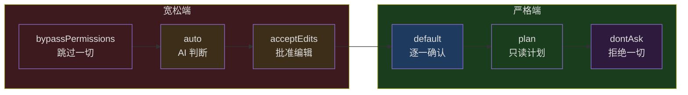
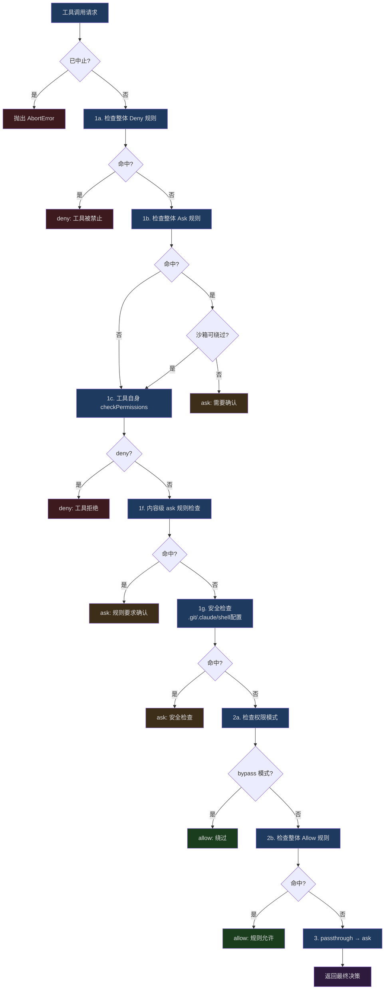
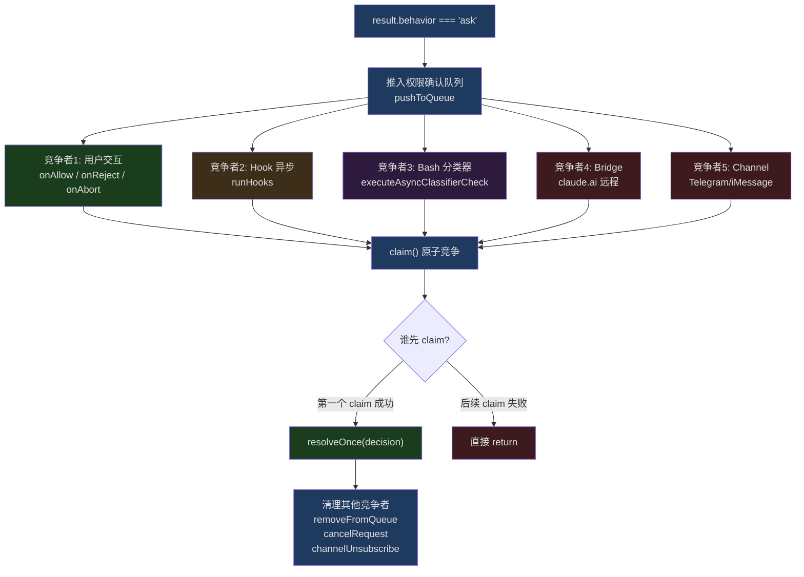

## 问题引入

你愿意让 AI 不经询问就执行 `rm -rf /` 吗？大概没人愿意。那 `git push` 呢？这个答案就没那么统一了——有人觉得推送到自己的开发分支完全没问题，有人觉得推送到 `main` 绝对需要确认。那 `cat package.json` 呢？如果每次读文件都要点"允许"，用户体验会让人抓狂。

每个操作的风险不同，权限边界应该画在哪里？

这不是一个新问题。Unix 的 rwx 权限模型、Android 的运行时权限、浏览器的同源策略——每个平台都在"能力"和"安全"之间找平衡。但 AI 编码工具面临的挑战更复杂：

1. **操作空间巨大**：不只是读写文件，还有执行命令、网络请求、调用外部服务
2. **风险评估需要语义理解**：`rm -rf node_modules` 和 `rm -rf /` 在语法上很像，但风险天壤之别
3. **用户期望矛盾**：既要"自动化"又要"安全"，既要"快"又要"问我"
4. **多角色协作**：主 agent、coordinator worker、swarm worker 的权限需求完全不同

Claude Code 的权限系统用了一个精巧的多层评估流水线来解决这个问题。这篇文章将从源码层面完整剖析它的设计。

---

## 权限模式全景

在进入评估流水线之前，我们先看看 Claude Code 定义了哪些权限模式。这些模式决定了系统的"默认姿态"。

### 模式定义

权限模式在 `src/types/permissions.ts` 中定义：

```typescript
// src/types/permissions.ts, lines 16-38
export const EXTERNAL_PERMISSION_MODES = [
  'acceptEdits',
  'bypassPermissions',
  'default',
  'dontAsk',
  'plan',
] as const

export type ExternalPermissionMode = (typeof EXTERNAL_PERMISSION_MODES)[number]

export type InternalPermissionMode = ExternalPermissionMode | 'auto' | 'bubble'
export type PermissionMode = InternalPermissionMode

export const INTERNAL_PERMISSION_MODES = [
  ...EXTERNAL_PERMISSION_MODES,
  ...(feature('TRANSCRIPT_CLASSIFIER') ? (['auto'] as const) : ([] as const)),
] as const satisfies readonly PermissionMode[]
```

注意 `auto` 模式被 `feature('TRANSCRIPT_CLASSIFIER')` 守卫——这是一个仅限内部的特性门控。`bubble` 模式则是完全内部的，永远不会出现在用户可配置的选项中。

### 模式行为矩阵

每个模式的具体行为在 `src/utils/permissions/PermissionMode.ts` 中配置：

```typescript
// src/utils/permissions/PermissionMode.ts, lines 42-91
const PERMISSION_MODE_CONFIG: Partial<
  Record<PermissionMode, PermissionModeConfig>
> = {
  default: {
    title: 'Default',
    shortTitle: 'Default',
    symbol: '',
    color: 'text',
    external: 'default',
  },
  plan: {
    title: 'Plan Mode',
    shortTitle: 'Plan',
    symbol: PAUSE_ICON,
    color: 'planMode',
    external: 'plan',
  },
  acceptEdits: {
    title: 'Accept edits',
    shortTitle: 'Accept',
    symbol: '⏵⏵',
    color: 'autoAccept',
    external: 'acceptEdits',
  },
  bypassPermissions: {
    title: 'Bypass Permissions',
    shortTitle: 'Bypass',
    symbol: '⏵⏵',
    color: 'error',
    external: 'bypassPermissions',
  },
  // ...
}
```

各模式的语义总结如下：

| 模式 | 语义 | 典型场景 |
|------|------|----------|
| `default` | 所有非只读操作都需要用户确认 | 日常交互使用 |
| `plan` | 只生成计划，不执行修改操作 | 代码审查、架构讨论 |
| `acceptEdits` | 自动批准文件编辑，但 Bash 命令仍需确认 | 信任模型的编辑能力 |
| `bypassPermissions` | 跳过几乎所有权限检查 | CI/CD 环境、完全信任场景 |
| `dontAsk` | 将所有 `ask` 转换为 `deny` | 非交互式环境 |
| `auto` | 使用 AI 分类器自动判断风险 | 内部高级用户 |



这个频谱设计很优雅：从"完全信任"到"完全不信任"，用户可以根据场景选择合适的位置。但模式只是第一层——它决定了"默认姿态"，具体的权限判断还需要经过多层评估。

---

## 多层评估流水线

权限评估的核心入口是 `hasPermissionsToUseTool` 函数，定义在 `src/utils/permissions/permissions.ts`。整个流水线可以分为两个大的阶段：**静态规则评估**（同步、快速）和 **动态交互评估**（异步、可能涉及用户交互）。

### 第一阶段：静态规则评估（hasPermissionsToUseToolInner）

```typescript
// src/utils/permissions/permissions.ts, lines 1158-1319
async function hasPermissionsToUseToolInner(
  tool: Tool,
  input: { [key: string]: unknown },
  context: ToolUseContext,
): Promise<PermissionDecision> {
  if (context.abortController.signal.aborted) {
    throw new AbortError()
  }

  let appState = context.getAppState()

  // 1. Check if the tool is denied
  // 1a. Entire tool is denied
  const denyRule = getDenyRuleForTool(appState.toolPermissionContext, tool)
  if (denyRule) {
    return {
      behavior: 'deny',
      decisionReason: { type: 'rule', rule: denyRule },
      message: `Permission to use ${tool.name} has been denied.`,
    }
  }
  // ...
}
```

完整的静态评估流程按优先级排列如下：



这个顺序的设计有深意：

**Deny 优先**：无论当前是什么模式，deny 规则总是最先检查。这保证了安全底线——即使你在 `bypassPermissions` 模式下，显式的 deny 规则依然有效。

**安全检查绕过豁免**：步骤 1f 和 1g 确保了某些安全检查即使在 `bypassPermissions` 模式下也无法绕过。对 `.git/`、`.claude/`、shell 配置文件的修改始终需要确认。这是"trust but verify"思想的体现——你信任 AI 的能力，但某些操作的后果太严重了。

**模式检查在中间**：bypassPermissions 模式的检查放在 deny 规则和安全检查之后、allow 规则之前。这意味着 bypass 模式是"跳过正常权限"，而不是"跳过一切"。

**Passthrough 兜底**：如果工具自身的 `checkPermissions` 返回 `passthrough`（表示"我不关心这个权限判断"），系统将其转换为 `ask`，确保没有操作在静默中被允许。

### 第二阶段：动态交互评估（useCanUseTool 及后续）

当第一阶段返回 `ask` 时，控制流进入 `useCanUseTool` 钩子。这里是真正的复杂性所在：

```typescript
// src/hooks/useCanUseTool.tsx, lines 28-33
function useCanUseTool(setToolUseConfirmQueue, setToolPermissionContext) {
  // ...
  return async (tool, input, toolUseContext, assistantMessage, toolUseID) =>
    new Promise(resolve => {
      const ctx = createPermissionContext(/* ... */)
      // ...
      const result = await hasPermissionsToUseTool(tool, input, toolUseContext, ...)
      // 根据 result.behavior 分流处理
    })
}
```

当 `result.behavior === 'ask'` 时，系统进入多竞争者模式——Hook、分类器、用户、Bridge（claude.ai 远程）、Channel（Telegram 等渠道）五个来源同时竞争"谁先做出决策"。这部分我们在后续章节详细展开。

---

## 规则系统深度解析

### 三类规则

权限规则分为三类，每类都有独立的来源追踪：

```typescript
// src/Tool.ts, lines 123-148
export type ToolPermissionContext = DeepImmutable<{
  mode: PermissionMode
  additionalWorkingDirectories: Map<string, AdditionalWorkingDirectory>
  alwaysAllowRules: ToolPermissionRulesBySource
  alwaysDenyRules: ToolPermissionRulesBySource
  alwaysAskRules: ToolPermissionRulesBySource
  isBypassPermissionsModeAvailable: boolean
  isAutoModeAvailable?: boolean
  strippedDangerousRules?: ToolPermissionRulesBySource
  shouldAvoidPermissionPrompts?: boolean
  awaitAutomatedChecksBeforeDialog?: boolean
  prePlanMode?: PermissionMode
}>
```

`ToolPermissionRulesBySource` 的类型本质上是 `Record<PermissionRuleSource, string[]>`。每个来源对应一组规则字符串。规则的来源在 `src/utils/permissions/permissions.ts` 中定义：

```typescript
// src/utils/permissions/permissions.ts, lines 109-114
const PERMISSION_RULE_SOURCES = [
  ...SETTING_SOURCES,   // localSettings, userSettings, projectSettings, policySettings, flagSettings
  'cliArg',             // 命令行参数
  'command',            // 命令级别
  'session',            // 会话级别
] as const satisfies readonly PermissionRuleSource[]
```

七种来源按优先级从高到低：

1. **policySettings**：企业策略（管理员配置，不可覆盖）
2. **flagSettings**：特性标志
3. **projectSettings**：项目级配置（`.claude/settings.json`）
4. **localSettings**：本地配置（`.claude/settings.local.json`）
5. **userSettings**：用户全局配置（`~/.claude/settings.json`）
6. **cliArg**：命令行参数传入
7. **session**：当前会话中用户的临时选择

### 规则匹配机制

规则的匹配逻辑支持两种粒度：

```typescript
// src/utils/permissions/permissions.ts, lines 238-269
function toolMatchesRule(
  tool: Pick<Tool, 'name' | 'mcpInfo'>,
  rule: PermissionRule,
): boolean {
  // Rule must not have content to match the entire tool
  if (rule.ruleValue.ruleContent !== undefined) {
    return false
  }

  const nameForRuleMatch = getToolNameForPermissionCheck(tool)

  // Direct tool name match
  if (rule.ruleValue.toolName === nameForRuleMatch) {
    return true
  }

  // MCP server-level permission: rule "mcp__server1" matches tool "mcp__server1__tool1"
  const ruleInfo = mcpInfoFromString(rule.ruleValue.toolName)
  const toolInfo = mcpInfoFromString(nameForRuleMatch)

  return (
    ruleInfo !== null &&
    toolInfo !== null &&
    (ruleInfo.toolName === undefined || ruleInfo.toolName === '*') &&
    ruleInfo.serverName === toolInfo.serverName
  )
}
```

**工具级匹配**：规则 `"Bash"` 匹配所有 Bash 工具调用。
**内容级匹配**：规则 `"Bash(prefix:npm install)"` 只匹配以 `npm install` 开头的 Bash 命令。
**MCP 服务器级匹配**：规则 `"mcp__server1"` 匹配该服务器下的所有工具。

内容级匹配通过 `getRuleByContentsForTool` 实现：

```typescript
// src/utils/permissions/permissions.ts, lines 362-389
export function getRuleByContentsForToolName(
  context: ToolPermissionContext,
  toolName: string,
  behavior: PermissionBehavior,
): Map<string, PermissionRule> {
  const ruleByContents = new Map<string, PermissionRule>()
  let rules: PermissionRule[] = []
  switch (behavior) {
    case 'allow': rules = getAllowRules(context); break
    case 'deny':  rules = getDenyRules(context); break
    case 'ask':   rules = getAskRules(context); break
  }
  for (const rule of rules) {
    if (
      rule.ruleValue.toolName === toolName &&
      rule.ruleValue.ruleContent !== undefined &&
      rule.ruleBehavior === behavior
    ) {
      ruleByContents.set(rule.ruleValue.ruleContent, rule)
    }
  }
  return ruleByContents
}
```

这个设计的精妙之处在于：它不是简单的"全允许/全拒绝"，而是允许用户对同一个工具的不同操作设置不同的权限级别。你可以允许 `Bash(prefix:npm test)` 但拒绝 `Bash(prefix:npm publish)`，允许 `Bash(prefix:git status)` 但要求确认 `Bash(prefix:git push)`。

### 规则来源追踪示例

实际运行时，一个规则的生命周期可能是这样的：

```
用户在交互对话中选择 "Always allow for this project"
  → 生成 PermissionUpdate: { type: 'addRules', destination: 'projectSettings', ... }
  → persistPermissionUpdates 写入 .claude/settings.json
  → applyPermissionUpdates 更新内存中的 ToolPermissionContext
  → 下次匹配时，该规则通过 projectSettings 来源被查找到
```

---

## ToolPermissionContext 的 DeepImmutable 设计

仔细看 `ToolPermissionContext` 的类型定义：

```typescript
// src/Tool.ts, line 123
export type ToolPermissionContext = DeepImmutable<{
  mode: PermissionMode
  additionalWorkingDirectories: Map<string, AdditionalWorkingDirectory>
  alwaysAllowRules: ToolPermissionRulesBySource
  alwaysDenyRules: ToolPermissionRulesBySource
  alwaysAskRules: ToolPermissionRulesBySource
  // ...
}>
```

`DeepImmutable` 是一个递归类型工具，它将对象的所有层级都标记为 `readonly`。这不是偶然的设计选择——它解决了权限系统中最危险的一类 bug：**运行时权限被意外修改**。

想象一个场景：

```typescript
// 危险的可变设计（Claude Code 不使用这种方式）
const context = getToolPermissionContext()
context.mode = 'bypassPermissions'  // 直接修改了全局权限模式！
```

通过 `DeepImmutable`，任何尝试修改权限上下文的代码都会在编译期报错。要修改权限状态，必须通过 `setToolPermissionContext` 创建新对象——这保证了权限状态的变更是可追踪的、原子的。

同时，初始化时也有明确的空状态工厂函数：

```typescript
// src/Tool.ts, lines 140-148
export const getEmptyToolPermissionContext: () => ToolPermissionContext =
  () => ({
    mode: 'default',
    additionalWorkingDirectories: new Map(),
    alwaysAllowRules: {},
    alwaysDenyRules: {},
    alwaysAskRules: {},
    isBypassPermissionsModeAvailable: false,
  })
```

默认模式是 `default`，所有规则为空，bypass 不可用。这是一个"安全默认值"设计——系统启动时处于最严格的状态，需要显式放宽。

---

## 文件系统作用域

权限系统不仅检查"你能用什么工具"，还检查"你能操作哪些文件"。`additionalWorkingDirectories` 是这个机制的关键组件。

### 工作目录边界

默认情况下，Claude Code 的文件操作被限制在当前工作目录（`cwd`）内。但实际开发中，项目可能跨越多个目录——monorepo 中的多个子项目、共享库目录等。`additionalWorkingDirectories` 允许用户扩展这个边界。

### 危险文件和目录保护

即使在工作目录内，某些文件也受到额外保护：

```typescript
// src/utils/permissions/filesystem.ts, lines 57-79
export const DANGEROUS_FILES = [
  '.gitconfig',
  '.gitmodules',
  '.bashrc',
  '.bash_profile',
  '.zshrc',
  '.zprofile',
  '.profile',
  '.ripgreprc',
  '.mcp.json',
  '.claude.json',
] as const

export const DANGEROUS_DIRECTORIES = [
  '.git',
  '.vscode',
  '.idea',
  '.claude',
] as const
```

这些文件的共同特点是：**修改它们可能导致代码执行或数据泄露**。`.bashrc` 被修改意味着下次打开终端时会执行恶意代码；`.gitconfig` 被修改可能导致凭证泄露；`.mcp.json` 被修改可能引入恶意的 MCP 服务器。

即使在 `bypassPermissions` 或 `auto` 模式下，对这些路径的修改也必须经过用户确认（步骤 1g 的安全检查）。这是整个权限系统中唯一不可配置的硬约束。

---

## PermissionContext 与 ResolveOnce 原子性模式

当权限评估进入交互阶段，系统面临一个经典的并发问题：多个异步来源可能同时做出权限决策。`PermissionContext` 和 `ResolveOnce` 模式是解决这个问题的核心机制。

### createPermissionContext

`createPermissionContext` 在 `src/hooks/toolPermission/PermissionContext.ts` 中定义，它创建一个封装了所有权限操作的上下文对象：

```typescript
// src/hooks/toolPermission/PermissionContext.ts, lines 96-347
function createPermissionContext(
  tool: ToolType,
  input: Record<string, unknown>,
  toolUseContext: ToolUseContext,
  assistantMessage: AssistantMessage,
  toolUseID: string,
  setToolPermissionContext: (context: ToolPermissionContext) => void,
  queueOps?: PermissionQueueOps,
) {
  const ctx = {
    tool,
    input,
    toolUseContext,
    assistantMessage,
    messageId: assistantMessage.message.id,
    toolUseID,
    logDecision(args, opts?) { /* ... */ },
    logCancelled() { /* ... */ },
    async persistPermissions(updates) { /* ... */ },
    resolveIfAborted(resolve) { /* ... */ },
    cancelAndAbort(feedback?, isAbort?, contentBlocks?) { /* ... */ },
    async tryClassifier(pendingClassifierCheck, updatedInput) { /* ... */ },
    async runHooks(permissionMode, suggestions, updatedInput?, startMs?) { /* ... */ },
    buildAllow(updatedInput, opts?) { /* ... */ },
    buildDeny(message, decisionReason) { /* ... */ },
    async handleUserAllow(updatedInput, permissionUpdates, ...) { /* ... */ },
    async handleHookAllow(finalInput, permissionUpdates, ...) { /* ... */ },
    pushToQueue(item) { queueOps?.push(item) },
    removeFromQueue() { queueOps?.remove(toolUseID) },
    updateQueueItem(patch) { queueOps?.update(toolUseID, patch) },
  }
  return Object.freeze(ctx)
}
```

注意最后一行 `Object.freeze(ctx)`——上下文对象被冻结，不可修改。这与 `DeepImmutable` 的设计哲学一脉相承：权限相关的对象应该是不可变的。

### ResolveOnce：原子性决策保证

多个来源竞争做出权限决策时，最危险的是"双重决策"——Hook 批准了操作，与此同时用户也点了"拒绝"。如果两个决策都被执行，系统状态会混乱。

`ResolveOnce` 通过一个简洁的原子性模式解决了这个问题：

```typescript
// src/hooks/toolPermission/PermissionContext.ts, lines 63-94
type ResolveOnce<T> = {
  resolve(value: T): void
  isResolved(): boolean
  claim(): boolean
}

function createResolveOnce<T>(resolve: (value: T) => void): ResolveOnce<T> {
  let claimed = false
  let delivered = false
  return {
    resolve(value: T) {
      if (delivered) return
      delivered = true
      claimed = true
      resolve(value)
    },
    isResolved() {
      return claimed
    },
    claim() {
      if (claimed) return false
      claimed = true
      return true
    },
  }
}
```

这里有两个标志位 `claimed` 和 `delivered`，它们的区别很重要：

- `claimed`：表示"有人声称了决策权"。一旦被设置，其他竞争者的 `claim()` 调用会返回 `false`。
- `delivered`：表示"Promise 已经被 resolve"。防止 `resolve` 被多次调用。

为什么需要两个标志而不是一个？因为在异步回调中，`claim()` 和 `resolve()` 之间可能有 `await`：

```typescript
// src/hooks/toolPermission/handlers/interactiveHandler.ts, lines 159-161
async onAllow(updatedInput, permissionUpdates, feedback?, contentBlocks?) {
  if (!claim()) return // 原子检查：如果其他来源已决策，立即退出
  // ↑ 从这里到下面的 resolveOnce 之间有 await
  resolveOnce(
    await ctx.handleUserAllow(updatedInput, permissionUpdates, ...)
  )
}
```

如果只用 `delivered` 一个标志，两个回调可能都通过 `!delivered` 检查，然后都执行 `await ctx.handleUserAllow`，导致双重处理。`claim()` 的原子性检查关闭了这个窗口。

---

## 三种权限处理器

权限系统的交互阶段由三个专门的处理器负责，分别对应三种不同的运行场景。

### interactiveHandler：主 agent 的交互式处理

这是最复杂的处理器，因为它需要协调最多的竞争来源。定义在 `src/hooks/toolPermission/handlers/interactiveHandler.ts`。

```typescript
// src/hooks/toolPermission/handlers/interactiveHandler.ts, lines 57-60
function handleInteractivePermission(
  params: InteractivePermissionParams,
  resolve: (decision: PermissionDecision) => void,
): void {
```

注意返回类型是 `void`，不是 `Promise`。这个函数不等待决策完成——它设置好所有回调后立即返回。决策通过回调异步发生。

竞争来源包括：

1. **用户交互**（onAllow / onReject / onAbort）
2. **Hook 异步执行**（runHooks）
3. **Bash 分类器**（executeAsyncClassifierCheck）
4. **Bridge 远程响应**（来自 claude.ai 的批准/拒绝）
5. **Channel 响应**（来自 Telegram/iMessage 等渠道的批准/拒绝）



一个值得注意的细节是分类器的用户交互保护机制：

```typescript
// src/hooks/toolPermission/handlers/interactiveHandler.ts, lines 108-122
onUserInteraction() {
  // Grace period: ignore interactions in the first 200ms to prevent
  // accidental keypresses from canceling the classifier prematurely
  const GRACE_PERIOD_MS = 200
  if (Date.now() - permissionPromptStartTimeMs < GRACE_PERIOD_MS) {
    return
  }
  userInteracted = true
  clearClassifierChecking(ctx.toolUseID)
  clearClassifierIndicator()
},
```

当用户开始与权限对话框交互（按方向键、Tab 键、打字）时，分类器的自动批准会被取消。但有一个 200ms 的宽限期——防止用户在对话框刚弹出时的无意按键取消了分类器。这种对用户体验的精细打磨体现了工程团队的经验。

### coordinatorHandler：coordinator worker 的串行预检

Coordinator worker（协调器子 agent）的处理逻辑更简单。由于它运行在主 agent 的上下文中但不能直接显示 UI，它先串行执行自动化检查，只有都不能决策时才回退到交互式对话：

```typescript
// src/hooks/toolPermission/handlers/coordinatorHandler.ts, lines 26-62
async function handleCoordinatorPermission(
  params: CoordinatorPermissionParams,
): Promise<PermissionDecision | null> {
  const { ctx, updatedInput, suggestions, permissionMode } = params

  try {
    // 1. Try permission hooks first (fast, local)
    const hookResult = await ctx.runHooks(
      permissionMode, suggestions, updatedInput,
    )
    if (hookResult) return hookResult

    // 2. Try classifier (slow, inference -- bash only)
    const classifierResult = feature('BASH_CLASSIFIER')
      ? await ctx.tryClassifier?.(params.pendingClassifierCheck, updatedInput)
      : null
    if (classifierResult) return classifierResult
  } catch (error) {
    if (error instanceof Error) {
      logError(error)
    } else {
      logError(new Error(`Automated permission check failed: ${String(error)}`))
    }
  }

  // 3. Neither resolved -- fall through to dialog.
  return null
}
```

关键区别：interactive handler 让 Hook 和分类器与用户**并行竞争**；coordinator handler 让它们**串行执行，在展示对话框之前完成**。这是因为 coordinator worker 的 `awaitAutomatedChecksBeforeDialog` 标志为 `true`——它的设计哲学是"先让自动化系统尝试解决，解决不了再打扰用户"。

### swarmWorkerHandler：swarm worker 的邮箱转发

Swarm worker（集群工作节点）是最特殊的角色——它们不能直接与用户交互，也不能直接显示权限对话框。它们的策略是：先尝试分类器自动批准，不行就把权限请求转发给 leader：

```typescript
// src/hooks/toolPermission/handlers/swarmWorkerHandler.ts, lines 40-156
async function handleSwarmWorkerPermission(
  params: SwarmWorkerPermissionParams,
): Promise<PermissionDecision | null> {
  if (!isAgentSwarmsEnabled() || !isSwarmWorker()) {
    return null  // 不是 swarm 环境，返回 null 让调用者回退到交互式处理
  }

  // 先尝试分类器自动批准
  const classifierResult = feature('BASH_CLASSIFIER')
    ? await ctx.tryClassifier?.(params.pendingClassifierCheck, updatedInput)
    : null
  if (classifierResult) return classifierResult

  // 转发权限请求到 leader
  const decision = await new Promise<PermissionDecision>(resolve => {
    const { resolve: resolveOnce, claim } = createResolveOnce(resolve)

    const request = createPermissionRequest({
      toolName: ctx.tool.name,
      toolUseId: ctx.toolUseID,
      input: ctx.input,
      description,
      permissionSuggestions: suggestions,
    })

    // 先注册回调，再发送请求——避免竞态条件
    registerPermissionCallback({
      requestId: request.id,
      toolUseId: ctx.toolUseID,
      async onAllow(allowedInput, permissionUpdates, feedback?, contentBlocks?) {
        if (!claim()) return
        // ...
      },
      onReject(feedback?, contentBlocks?) {
        if (!claim()) return
        // ...
      },
    })

    // 发送请求
    void sendPermissionRequestViaMailbox(request)

    // 显示等待指示器
    ctx.toolUseContext.setAppState(prev => ({
      ...prev,
      pendingWorkerRequest: { toolName: ctx.tool.name, toolUseId: ctx.toolUseID, description },
    }))

    // abort 信号处理
    ctx.toolUseContext.abortController.signal.addEventListener('abort', () => {
      if (!claim()) return
      resolveOnce(ctx.cancelAndAbort(undefined, true))
    }, { once: true })
  })

  return decision
}
```

这里有一个很优雅的竞态条件防护：**先注册回调，再发送请求**。如果顺序反过来，可能出现这样的场景：

1. Worker 发送权限请求到 leader
2. Leader 瞬间响应
3. 响应到达时回调还没注册
4. 响应被丢弃

通过先注册后发送，即使 leader 的响应在 `sendPermissionRequestViaMailbox` 返回之前就到达，回调也已经就位，可以处理响应。

### 三种处理器的调度逻辑

在 `useCanUseTool.tsx` 中，三种处理器按如下顺序被调度：

```typescript
// src/hooks/useCanUseTool.tsx, lines 94-168
case "ask": {
  // 1. Coordinator 预检（如果 awaitAutomatedChecksBeforeDialog）
  if (appState.toolPermissionContext.awaitAutomatedChecksBeforeDialog) {
    const coordinatorDecision = await handleCoordinatorPermission({...})
    if (coordinatorDecision) {
      resolve(coordinatorDecision)
      return
    }
  }

  // 2. Swarm worker 处理（如果是 swarm 环境）
  const swarmDecision = await handleSwarmWorkerPermission({...})
  if (swarmDecision) {
    resolve(swarmDecision)
    return
  }

  // 3. 交互式处理（主 agent 的兜底）
  handleInteractivePermission({
    ctx, description, result,
    awaitAutomatedChecksBeforeDialog: ...,
    bridgeCallbacks: ...,
    channelCallbacks: ...,
  }, resolve)
  return
}
```

这是一个经典的责任链模式：每个处理器要么返回一个决策（非 null），要么返回 null 让下一个处理器接手。最后的 `handleInteractivePermission` 是兜底——它总是能处理请求（通过显示 UI）。

---

## Auto 模式与 AI 分类器

`auto` 模式是权限系统中最前沿的部分。它不是简单地允许或拒绝所有操作，而是使用 AI 分类器来评估每个操作的风险。

### 分类器评估流程

当模式为 `auto` 时，`hasPermissionsToUseTool` 在返回 `ask` 之前会经过一系列快速路径检查：

```typescript
// src/utils/permissions/permissions.ts, lines 519-648（简化）
if (appState.toolPermissionContext.mode === 'auto') {
  // 快速路径 1: 安全检查不可被分类器绕过
  if (result.decisionReason?.type === 'safetyCheck' && !result.decisionReason.classifierApprovable) {
    return result  // 保持 ask
  }

  // 快速路径 2: 需要用户交互的工具
  if (tool.requiresUserInteraction?.()) {
    return result
  }

  // 快速路径 3: acceptEdits 模式下会允许的操作
  const acceptEditsResult = await tool.checkPermissions(parsedInput, {
    ...context,
    getAppState: () => ({
      ...state,
      toolPermissionContext: { ...state.toolPermissionContext, mode: 'acceptEdits' },
    }),
  })
  if (acceptEditsResult.behavior === 'allow') {
    return { behavior: 'allow', ... }  // 直接允许，无需分类器
  }

  // 快速路径 4: 安全工具白名单
  if (classifierDecisionModule.isAutoModeAllowlistedTool(tool.name)) {
    return { behavior: 'allow', ... }
  }

  // 最后: 调用分类器 API
  // ...
}
```

这个设计体现了"渐进式信任"的理念：

1. 硬安全检查永远不可绕过
2. 如果 `acceptEdits` 模式认为安全，那 `auto` 模式也应该认为安全——避免了不必要的分类器 API 调用
3. 白名单工具（如只读工具）直接放行
4. 只有真正需要判断的操作才发送给分类器

### 连续拒绝追踪

`auto` 模式还有一个连续拒绝追踪机制（`denialTracking`），当分类器连续拒绝多个操作时，系统会回退到交互式提示。这防止了分类器过于保守导致工作流完全卡住的情况。

---

## 钩子（Hook）预审机制

权限钩子是 Claude Code 可扩展性的关键。用户可以配置自定义的 `PermissionRequest` 钩子，在标准权限检查之外添加额外的逻辑。

### 钩子在流水线中的位置

钩子的执行时机取决于运行模式：

- **交互式模式**：钩子与用户对话框并行竞争（fire-and-forget 异步）
- **Coordinator 模式**：钩子在对话框显示之前串行执行
- **Swarm 模式**：钩子不直接参与（由 leader 侧执行）

```typescript
// src/hooks/toolPermission/PermissionContext.ts, lines 216-263
async runHooks(
  permissionMode, suggestions, updatedInput?, permissionPromptStartTimeMs?,
): Promise<PermissionDecision | null> {
  for await (const hookResult of executePermissionRequestHooks(
    tool.name, toolUseID, input, toolUseContext,
    permissionMode, suggestions, toolUseContext.abortController.signal,
  )) {
    if (hookResult.permissionRequestResult) {
      const decision = hookResult.permissionRequestResult
      if (decision.behavior === 'allow') {
        return await this.handleHookAllow(finalInput, decision.updatedPermissions ?? [], ...)
      } else if (decision.behavior === 'deny') {
        // Hook 还可以选择 interrupt: true 来中止整个会话
        if (decision.interrupt) {
          toolUseContext.abortController.abort()
        }
        return this.buildDeny(decision.message || 'Permission denied by hook', ...)
      }
    }
  }
  return null  // 没有 hook 做出决策
}
```

钩子可以做三件事：

1. **允许**（`behavior: 'allow'`）：跳过用户确认，直接执行。可以附带 `updatedPermissions` 持久化新的规则。
2. **拒绝**（`behavior: 'deny'`）：阻止执行。可以设置 `interrupt: true` 来中止整个会话。
3. **不做决策**（不返回或跳过）：让其他机制继续处理。

### 无头 agent 的钩子处理

对于 `shouldAvoidPermissionPrompts` 为 `true` 的无头 agent（后台运行、没有 UI 的 agent），钩子是唯一的自动化批准途径。如果钩子不做决策，操作会被自动拒绝：

```typescript
// src/utils/permissions/permissions.ts, lines 400-470
async function runPermissionRequestHooksForHeadlessAgent(
  tool, input, toolUseID, context, permissionMode, suggestions,
): Promise<PermissionDecision | null> {
  try {
    for await (const hookResult of executePermissionRequestHooks(
      tool.name, toolUseID, input, context,
      permissionMode, suggestions, context.abortController.signal,
    )) {
      if (!hookResult.permissionRequestResult) continue
      const decision = hookResult.permissionRequestResult
      if (decision.behavior === 'allow') {
        // 持久化更新、返回 allow
        return { behavior: 'allow', updatedInput: finalInput, decisionReason: { type: 'hook', ... } }
      }
      if (decision.behavior === 'deny') {
        return { behavior: 'deny', message: ..., decisionReason: { type: 'hook', ... } }
      }
    }
  } catch (error) {
    logError(new Error('PermissionRequest hook failed for headless agent', { cause: toError(error) }))
  }
  return null  // 调用者会执行 auto-deny
}
```

---

## 权限队列与 React 状态桥接

权限对话框不是简单的 `window.confirm`——它是一个完整的 React 组件，支持编辑输入、选择持久化选项、提供反馈等。权限系统通过 `PermissionQueueOps` 接口与 React 状态对接：

```typescript
// src/hooks/toolPermission/PermissionContext.ts, lines 357-379
function createPermissionQueueOps(
  setToolUseConfirmQueue: React.Dispatch<React.SetStateAction<ToolUseConfirm[]>>,
): PermissionQueueOps {
  return {
    push(item: ToolUseConfirm) {
      setToolUseConfirmQueue(queue => [...queue, item])
    },
    remove(toolUseID: string) {
      setToolUseConfirmQueue(queue =>
        queue.filter(item => item.toolUseID !== toolUseID),
      )
    },
    update(toolUseID: string, patch: Partial<ToolUseConfirm>) {
      setToolUseConfirmQueue(queue =>
        queue.map(item =>
          item.toolUseID === toolUseID ? { ...item, ...patch } : item,
        ),
      )
    },
  }
}
```

这是一个优雅的"桥接"设计——权限逻辑完全不依赖 React。`PermissionQueueOps` 是一个泛型接口，任何能提供 `push`/`remove`/`update` 操作的系统都可以替换 React 实现。这也意味着权限系统可以被移植到其他 UI 框架或完全无 UI 的环境中。

### recheckPermission：权限热更新

权限对话框还有一个特殊的回调 `recheckPermission`，允许在对话框显示期间重新评估权限：

```typescript
// src/hooks/toolPermission/handlers/interactiveHandler.ts, lines 204-231
async recheckPermission() {
  if (isResolved()) return
  const freshResult = await hasPermissionsToUseTool(
    ctx.tool, ctx.input, ctx.toolUseContext, ctx.assistantMessage, ctx.toolUseID,
  )
  if (freshResult.behavior === 'allow') {
    if (!claim()) return
    if (bridgeCallbacks && bridgeRequestId) {
      bridgeCallbacks.cancelRequest(bridgeRequestId)
    }
    channelUnsubscribe?.()
    ctx.removeFromQueue()
    ctx.logDecision({ decision: 'accept', source: 'config' })
    resolveOnce(ctx.buildAllow(freshResult.updatedInput ?? ctx.input))
  }
},
```

这解决了一个实际场景：用户在 claude.ai（Bridge）上切换了权限模式（比如从 `default` 切到 `bypassPermissions`），CLI 端正在显示的权限对话框应该立即消失，操作自动继续。`recheckPermission` 在 mode switch 事件触发时被调用，重新评估权限，如果新模式允许该操作，就自动批准并关闭对话框。

---

## 分类器自动批准的视觉反馈

当分类器在用户做出决策之前自动批准了操作，交互式处理器会显示一个短暂的对号标记：

```typescript
// src/hooks/toolPermission/handlers/interactiveHandler.ts, lines 469-521
onAllow: decisionReason => {
  if (!claim()) return
  // ...

  // 显示自动批准的过渡动画
  if (feature('TRANSCRIPT_CLASSIFIER')) {
    ctx.updateQueueItem({
      classifierCheckInProgress: false,
      classifierAutoApproved: true,
      classifierMatchedRule: matchedRule,
    })
  }

  // 保持对号可见一段时间，然后移除对话框
  // 终端聚焦时 3 秒，不聚焦时 1 秒
  // 用户可以按 Esc 提前关闭（通过 onDismissCheckmark）
  const checkmarkMs = getTerminalFocused() ? 3000 : 1000
  checkmarkTransitionTimer = setTimeout(() => {
    ctx.removeFromQueue()
  }, checkmarkMs)
},
```

这个设计考虑了用户感知：

- **终端聚焦时**：用户可能在看屏幕，给 3 秒让他们注意到操作被自动批准了
- **终端不聚焦时**：用户不在看，1 秒就够了
- **可手动关闭**：按 Esc 立即关闭，不阻塞工作流
- **abort 安全**：如果在对号显示期间发生了 sibling abort（比如另一个工具失败），对号对话框也会被正确清理

---

## 可迁移模式：为 AI 应用构建分层权限系统

Claude Code 的权限系统设计可以被提炼为一套通用的 AI 应用权限架构模式。以下是关键的设计原则及其对应的实现策略。

### 原则 1：分层评估，Deny 优先

```
Deny 规则 → 安全检查 → 模式检查 → Allow 规则 → 工具自身判断 → 默认 Ask
```

每一层只做一件事，评估顺序固定。deny 规则在最前面确保安全底线不可被绕过。这个模式可以直接应用到任何需要权限控制的 AI 应用中。

### 原则 2：不可变状态 + 原子性决策

权限状态用 `DeepImmutable` 保护，决策过程用 `ResolveOnce` 保证原子性。当你的系统有多个异步来源可能同时做出决策时（用户、自动化系统、远程审批），`claim()` 模式是一个轻量级但可靠的解决方案。

### 原则 3：安全默认值 + 显式放宽

```typescript
// 默认状态：最严格
const empty = {
  mode: 'default',
  alwaysAllowRules: {},
  alwaysDenyRules: {},
  alwaysAskRules: {},
  isBypassPermissionsModeAvailable: false,
}
```

系统启动时处于"最安全"状态。每一次放宽都需要显式操作——用户点击"Always allow"、管理员配置策略、命令行参数传入。这确保了安全性不会因为配置遗漏而被意外降低。

### 原则 4：规则来源追踪

每条规则都携带来源信息（哪个配置文件、哪个层级）。这不仅用于优先级排序，更用于审计——当出现权限问题时，你可以准确知道"这条规则是从哪里来的"。

```typescript
type PermissionRule = {
  source: PermissionRuleSource  // 'projectSettings' | 'userSettings' | ...
  ruleBehavior: 'allow' | 'deny' | 'ask'
  ruleValue: PermissionRuleValue  // { toolName: string, ruleContent?: string }
}
```

### 原则 5：处理器分离

不同的运行环境有不同的权限需求。Claude Code 的三种处理器模式——交互式（竞争式）、coordinator（串行预检）、swarm（邮箱转发）——展示了如何为同一套规则系统适配不同的执行环境。

核心抽象是 `PermissionContext`：它封装了所有权限操作（日志、持久化、队列管理），让处理器只关注流程控制。新增一种运行环境时，只需要实现一个新的处理器函数，而不需要修改规则评估逻辑。

### 原则 6：渐进式信任

`auto` 模式的分类器不是直接对所有操作调用 AI 评估——它先用快速路径过滤掉明显安全和明显危险的操作：

```
安全检查（不可绕过）→ acceptEdits 快速路径 → 白名单快速路径 → 分类器 API
```

每增加一层快速路径，就减少一批不必要的 API 调用。这个模式对任何使用 AI 做运行时决策的系统都适用。

### 实际架构建议

如果你在构建一个 AI 应用的权限系统，可以从以下最小架构开始：

```typescript
// 最小权限系统骨架
type PermissionDecision = { behavior: 'allow' | 'deny' | 'ask' }

type PermissionRule = {
  source: string
  behavior: 'allow' | 'deny' | 'ask'
  pattern: string  // 匹配工具名或操作内容
}

// 1. 静态评估
function evaluateStaticRules(
  action: string,
  rules: PermissionRule[],
): PermissionDecision | null {
  // Deny 优先
  const denyMatch = rules.find(r => r.behavior === 'deny' && matches(action, r.pattern))
  if (denyMatch) return { behavior: 'deny' }

  // Allow 匹配
  const allowMatch = rules.find(r => r.behavior === 'allow' && matches(action, r.pattern))
  if (allowMatch) return { behavior: 'allow' }

  return null  // 没有规则匹配，交给动态评估
}

// 2. 动态评估（可扩展）
async function evaluateDynamic(
  action: string,
  handlers: PermissionHandler[],
): Promise<PermissionDecision> {
  for (const handler of handlers) {
    const decision = await handler.evaluate(action)
    if (decision) return decision
  }
  return { behavior: 'ask' }  // 兜底：询问用户
}
```

然后根据需求逐步添加：

- **不可变状态保护**：防止运行时修改
- **原子性竞争**：当有多个异步决策源时
- **来源追踪**：当需要审计或调试时
- **分类器集成**：当操作空间太大无法用规则覆盖时
- **处理器分离**：当有多种运行环境时

---

## 总结

Claude Code 的权限系统是一个多层防御体系，它的核心洞察是：**权限不是一个二元选择（允许/拒绝），而是一个在多个维度上的连续频谱**。

- **模式维度**：从 `bypassPermissions` 到 `dontAsk`，用户选择自己的风险偏好
- **规则维度**：从整体工具级到内容级，支持精细的权限控制
- **来源维度**：从策略到会话，多层配置互相叠加
- **角色维度**：主 agent、coordinator、swarm worker 各有不同的处理流程
- **时间维度**：分类器、Hook、用户交互在时间轴上竞争，第一个做出决策的获胜

这个系统的工程实现中有很多值得学习的模式：`DeepImmutable` 保护状态安全、`ResolveOnce` 保证原子性、处理器分离保证可扩展性、渐进式快速路径减少不必要的计算。这些模式并不局限于权限系统——任何涉及多来源异步决策的系统都可以借鉴。

最后，回到开头的问题：权限边界应该画在哪里？Claude Code 的答案是——**不画一条固定的线，而是提供一套工具让每个用户画自己的线**。这也许是目前 AI 工具安全领域最务实的解法。
