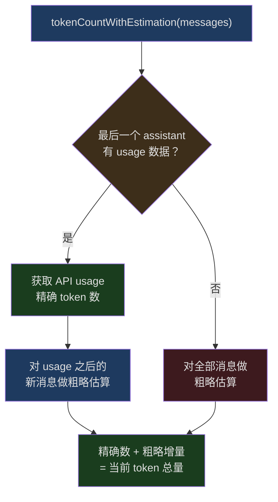
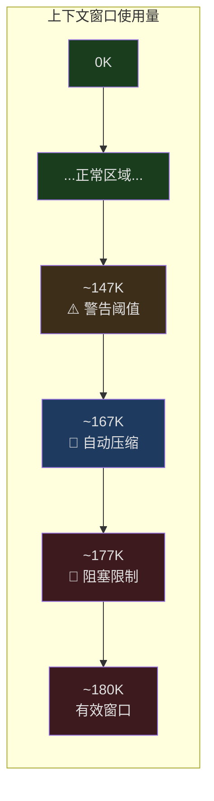
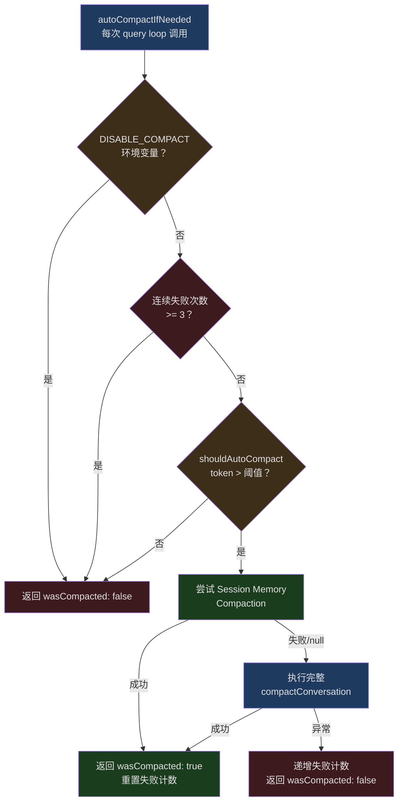
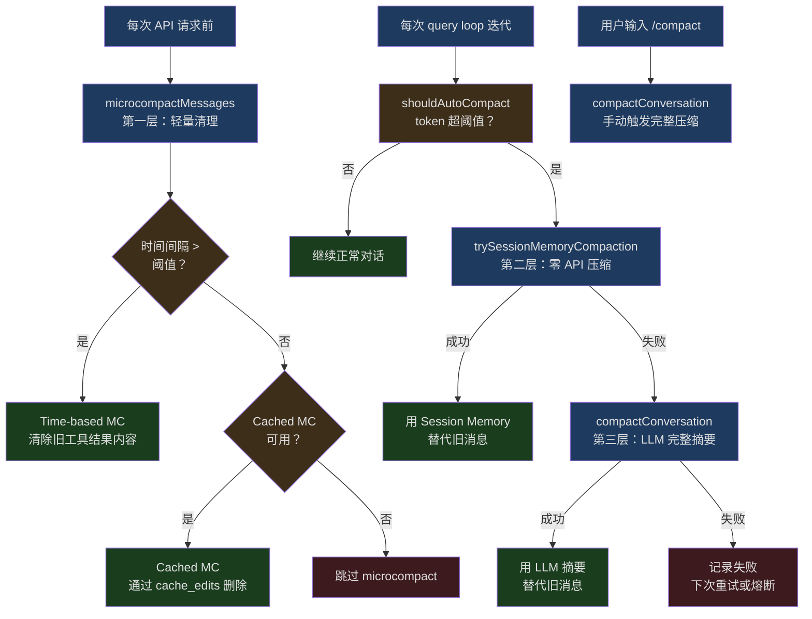

## 问题引入

一个典型的 Claude Code 编码会话可以持续数小时。用户要求重构一个模块，Claude 读取了 20 个文件、执行了 30 次 shell 命令、做了 15 次文件编辑——这些交互产生了数十万 token 的对话历史。即便 Claude 的上下文窗口已经达到 200K token，在密集的编码会话中，窗口也会在 30-60 分钟内被填满。

问题的核心矛盾是：**不压缩，历史超出窗口无法继续；压缩，又可能丢失关键信息**——比如用户明确纠正的一个 bug fix、某个函数的精确签名、或者一条"以后都用这种风格"的指令。

Claude Code 的解决方案不是一个单一的压缩算法，而是一套多层次、多策略的上下文管理系统。从轻量级的工具结果清理（microcompact），到基于会话记忆的快速压缩（session memory compact），再到完整的 LLM 摘要压缩（full compact），每一层在不同的压力水平下介入，以最小的信息损失维持对话的可持续性。

本文将深入 `services/compact/` 目录下的实现，逐层解析这套系统的工程设计。

## Token 估算：一切的基础

在决定"何时压缩"之前，首先要回答一个看似简单的问题：**当前对话消耗了多少 token？**

### 粗略估算 vs API 精确计数

Claude Code 使用两种 token 计数策略：

1. **粗略估算**：基于字符长度除以一个字节/token 比率
2. **API 精确计数**：调用 Anthropic 的 `countTokens` API

粗略估算的核心函数在 `src/services/tokenEstimation.ts` 第 203-208 行：

```typescript
// src/services/tokenEstimation.ts:203-208
export function roughTokenCountEstimation(
  content: string,
  bytesPerToken: number = 4,
): number {
  return Math.round(content.length / bytesPerToken)
}
```

默认使用 4 字节/token 的比率。但对于不同文件类型，这个比率需要调整——JSON 文件中有大量单字符 token（`{`、`}`、`:`、`,`、`"`），真实比率更接近 2：

```typescript
// src/services/tokenEstimation.ts:215-224
export function bytesPerTokenForFileType(fileExtension: string): number {
  switch (fileExtension) {
    case 'json':
    case 'jsonl':
    case 'jsonc':
      return 2
    default:
      return 4
  }
}
```

### 消息级别的 Token 估算

对于完整的消息数组，估算需要处理多种 content block 类型。`microCompact.ts` 中的 `estimateMessageTokens` 函数（第 164-205 行）展示了这种复杂性：

```typescript
// src/services/compact/microCompact.ts:164-205
export function estimateMessageTokens(messages: Message[]): number {
  let totalTokens = 0

  for (const message of messages) {
    if (message.type !== 'user' && message.type !== 'assistant') {
      continue
    }

    if (!Array.isArray(message.message.content)) {
      continue
    }

    for (const block of message.message.content) {
      if (block.type === 'text') {
        totalTokens += roughTokenCountEstimation(block.text)
      } else if (block.type === 'tool_result') {
        totalTokens += calculateToolResultTokens(block)
      } else if (block.type === 'image' || block.type === 'document') {
        totalTokens += IMAGE_MAX_TOKEN_SIZE  // 固定 2000
      } else if (block.type === 'thinking') {
        totalTokens += roughTokenCountEstimation(block.thinking)
      } else if (block.type === 'tool_use') {
        totalTokens += roughTokenCountEstimation(
          block.name + jsonStringify(block.input ?? {}),
        )
      }
      // ...其他类型
    }
  }

  // 乘以 4/3 作为保守估计的安全余量
  return Math.ceil(totalTokens * (4 / 3))
}
```

注意最后的 `4/3` 安全系数——由于粗略估算天然偏低，乘以 1.33 来避免低估导致的"以为还有空间但实际已经溢出"的问题。

### 混合策略：tokenCountWithEstimation

真正在自动压缩判断中使用的是 `tokenCountWithEstimation`（`src/utils/tokens.ts` 第 226 行），它结合了两种策略：

1. 从最后一个有 API usage 数据的 assistant 消息获取精确的 token 数
2. 对该消息之后的新消息使用粗略估算
3. 将两者相加得到当前总量

这个设计巧妙地避免了两个极端：纯 API 计数太慢（每次需要一个网络请求），纯粗略估算太不准确。通过利用 API 响应中已有的 usage 数据作为锚点，只对增量部分做粗略估算，实现了精度和性能的平衡。



## 上下文压力检测：多级阈值体系

知道了"用了多少 token"之后，下一个问题是：**什么时候该开始压缩？**

Claude Code 定义了一套精密的多级阈值体系，在 `autoCompact.ts` 中实现。

### 有效上下文窗口

首先，不是所有窗口空间都能用于对话。系统需要为输出预留空间：

```typescript
// src/services/compact/autoCompact.ts:30-49
// 基于 p99.99 的压缩摘要输出为 17,387 token
const MAX_OUTPUT_TOKENS_FOR_SUMMARY = 20_000

export function getEffectiveContextWindowSize(model: string): number {
  const reservedTokensForSummary = Math.min(
    getMaxOutputTokensForModel(model),
    MAX_OUTPUT_TOKENS_FOR_SUMMARY,
  )
  let contextWindow = getContextWindowForModel(model, getSdkBetas())

  // 支持通过环境变量覆盖窗口大小（用于测试）
  const autoCompactWindow = process.env.CLAUDE_CODE_AUTO_COMPACT_WINDOW
  if (autoCompactWindow) {
    const parsed = parseInt(autoCompactWindow, 10)
    if (!isNaN(parsed) && parsed > 0) {
      contextWindow = Math.min(contextWindow, parsed)
    }
  }

  return contextWindow - reservedTokensForSummary
}
```

对于一个 200K 的上下文窗口，有效空间约为 180K。

### 四级阈值

`calculateTokenWarningState` 函数（第 93-145 行）定义了四个压力级别：

```typescript
// src/services/compact/autoCompact.ts:62-65
export const AUTOCOMPACT_BUFFER_TOKENS = 13_000
export const WARNING_THRESHOLD_BUFFER_TOKENS = 20_000
export const ERROR_THRESHOLD_BUFFER_TOKENS = 20_000
export const MANUAL_COMPACT_BUFFER_TOKENS = 3_000
```

用一个具体例子来说明（假设有效窗口为 180K token）：

| 阈值级别 | 计算方式 | 大约 Token 值 | 触发行为 |
|---------|---------|-------------|---------|
| 自动压缩 | 有效窗口 - 13,000 | ~167K | 触发自动压缩流程 |
| 警告阈值 | 阈值 - 20,000 | ~147K | UI 显示黄色警告 |
| 错误阈值 | 阈值 - 20,000 | ~147K | UI 显示红色警告 |
| 阻塞限制 | 有效窗口 - 3,000 | ~177K | 阻止发送新消息，强制压缩 |



### 熔断机制

一个关键的工程细节：自动压缩不是无限重试的。`autoCompact.ts` 第 68-70 行定义了熔断器：

```typescript
// src/services/compact/autoCompact.ts:68-70
// BQ 2026-03-10: 1,279 sessions had 50+ consecutive failures (up to 3,272)
// in a single session, wasting ~250K API calls/day globally.
const MAX_CONSECUTIVE_AUTOCOMPACT_FAILURES = 3
```

这个注释揭示了一个真实的生产事故：在引入熔断器之前，有 1,279 个会话出现了 50 次以上的连续压缩失败（最多达到 3,272 次！），每天浪费约 25 万次 API 调用。现在，连续失败 3 次后就停止重试：

```typescript
// src/services/compact/autoCompact.ts:257-265
if (
  tracking?.consecutiveFailures !== undefined &&
  tracking.consecutiveFailures >= MAX_CONSECUTIVE_AUTOCOMPACT_FAILURES
) {
  return { wasCompacted: false }
}
```

## /compact 命令与反应式压缩：主动 vs 被动

Claude Code 的上下文压缩有两种触发模式：

### 主动模式：用户手动触发

用户在对话中输入 `/compact`，可以选择附带自定义的压缩指令（例如 `/compact 重点保留测试相关的代码修改`）。手动触发时，`compactConversation` 被直接调用，`isAutoCompact` 参数为 `false`。

### 被动模式：自动触发

`shouldAutoCompact` 函数（第 160-239 行）是自动压缩的守门人。它有多个短路条件，防止在不该触发的场景下触发：

```typescript
// src/services/compact/autoCompact.ts:160-239（简化）
export async function shouldAutoCompact(
  messages: Message[],
  model: string,
  querySource?: QuerySource,
  snipTokensFreed = 0,
): Promise<boolean> {
  // 1. 递归保护：compact 和 session_memory 子 agent 不触发
  if (querySource === 'session_memory' || querySource === 'compact') {
    return false
  }

  // 2. 全局开关检查
  if (!isAutoCompactEnabled()) {
    return false
  }

  // 3. Token 计算与阈值比较
  const tokenCount = tokenCountWithEstimation(messages) - snipTokensFreed
  const threshold = getAutoCompactThreshold(model)

  const { isAboveAutoCompactThreshold } = calculateTokenWarningState(
    tokenCount, model,
  )

  return isAboveAutoCompactThreshold
}
```

第一个短路条件特别值得注意：`querySource === 'compact'` 防止了压缩过程中的自我递归。因为压缩本身是通过一个 forked agent 执行的（将整个对话作为上下文发送给 Claude 生成摘要），如果不加这个保护，forked agent 自身的上下文也可能触发压缩，导致无限递归。

### 自动压缩的完整流程

`autoCompactIfNeeded` 是每个 query loop 迭代中都会调用的函数。它的执行逻辑是分层的：



注意优先级：**Session Memory Compaction 优先于完整的 LLM Compaction**。这是因为 Session Memory Compaction 不需要额外的 API 调用，速度更快，成本更低。

## 压缩策略详解

### 第一层：Microcompact——轻量级工具结果清理

Microcompact 是最轻量的压缩策略，它不调用任何 LLM，而是直接清理对话中旧的工具调用结果。核心思路：`FileRead`、`Bash`、`Grep` 等工具的返回结果通常很大（一个文件可能有数千 token），但在对话进行一段时间后，这些结果的信息价值会递减。

#### 可压缩的工具类型

`microCompact.ts` 第 41-50 行定义了哪些工具的结果可以被清理：

```typescript
// src/services/compact/microCompact.ts:41-50
const COMPACTABLE_TOOLS = new Set<string>([
  FILE_READ_TOOL_NAME,
  ...SHELL_TOOL_NAMES,
  GREP_TOOL_NAME,
  GLOB_TOOL_NAME,
  WEB_SEARCH_TOOL_NAME,
  WEB_FETCH_TOOL_NAME,
  FILE_EDIT_TOOL_NAME,
  FILE_WRITE_TOOL_NAME,
])
```

注意这个集合的选择：只包含"读取类"和"输出密集型"的工具。像 `TodoRead`、`ToolSearch` 这类输出较小、信息密度高的工具不在其中。

#### 两种 Microcompact 路径

Claude Code 实际有两种 microcompact 实现：

**1. 基于时间的 Microcompact（Time-based MC）**

当用户离开一段时间后回来继续对话时，服务端的 prompt cache 已经失效，整个 prompt 前缀都会被重新写入。这时清理旧的工具结果是"免费的"——反正 cache 都要重建，不如趁机瘦身。

`evaluateTimeBasedTrigger` 函数（第 422-444 行）检测时间间隔：

```typescript
// src/services/compact/microCompact.ts:438-443
const gapMinutes =
  (Date.now() - new Date(lastAssistant.timestamp).getTime()) / 60_000
if (!Number.isFinite(gapMinutes) || gapMinutes < config.gapThresholdMinutes) {
  return null
}
return { gapMinutes, config }
```

当间隔超过阈值时，保留最近 N 个工具结果，将其余的内容替换为 `[Old tool result content cleared]`：

```typescript
// src/services/compact/microCompact.ts:476-483
if (
  block.type === 'tool_result' &&
  clearSet.has(block.tool_use_id) &&
  block.content !== TIME_BASED_MC_CLEARED_MESSAGE
) {
  tokensSaved += calculateToolResultTokens(block)
  touched = true
  return { ...block, content: TIME_BASED_MC_CLEARED_MESSAGE }
}
```

**2. 基于缓存编辑的 Microcompact（Cached MC）**

这是更精巧的路径。它不修改本地消息内容，而是通过 API 的 `cache_edits` 机制告诉服务端"请在缓存中删除这些工具结果"。这样可以在保持 prompt cache 有效的同时，减少实际发送的 token 数。

```typescript
// src/services/compact/microCompact.ts:369-371
// Return messages unchanged - cache_reference and cache_edits
// are added at API layer
```

这两种路径的选择逻辑：时间间隔大（cache 已冷）用 time-based MC 直接修改内容；间隔小（cache 还热）用 cached MC 通过 API 层面删除。

#### Microcompact 的入口函数

`microcompactMessages`（第 253-293 行）是统一入口：

```typescript
// src/services/compact/microCompact.ts:253-293（简化）
export async function microcompactMessages(
  messages: Message[],
  toolUseContext?: ToolUseContext,
  querySource?: QuerySource,
): Promise<MicrocompactResult> {
  // 1. 先尝试时间触发的清理（短路）
  const timeBasedResult = maybeTimeBasedMicrocompact(messages, querySource)
  if (timeBasedResult) {
    return timeBasedResult
  }

  // 2. 再尝试缓存编辑路径
  if (feature('CACHED_MICROCOMPACT')) {
    // ...条件检查...
    return await cachedMicrocompactPath(messages, querySource)
  }

  // 3. 都不适用，原样返回
  return { messages }
}
```

### 第二层：Session Memory Compaction——零 API 调用压缩

Session Memory Compaction 是一种巧妙的优化。Claude Code 在后台持续维护一份"会话记忆"（Session Memory），记录对话中的关键信息——用户的偏好、技术决策、错误修复等。当需要压缩时，可以直接使用这份已有的记忆作为摘要，而不需要再调用 LLM 来生成摘要。

#### 工作原理

`sessionMemoryCompact.ts` 中的 `trySessionMemoryCompaction`（第 514-630 行）是核心：

```typescript
// src/services/compact/sessionMemoryCompact.ts:514-530（简化）
export async function trySessionMemoryCompaction(
  messages: Message[],
  agentId?: AgentId,
  autoCompactThreshold?: number,
): Promise<CompactionResult | null> {
  if (!shouldUseSessionMemoryCompaction()) {
    return null
  }

  // 等待正在进行的会话记忆提取完成
  await waitForSessionMemoryExtraction()

  const lastSummarizedMessageId = getLastSummarizedMessageId()
  const sessionMemory = await getSessionMemoryContent()

  // 没有会话记忆，或者记忆为空模板——回退到传统压缩
  if (!sessionMemory || await isSessionMemoryEmpty(sessionMemory)) {
    return null
  }
  // ...
}
```

#### 消息保留策略

关键设计：Session Memory Compaction 不是丢弃所有旧消息，而是智能地保留一部分近期消息。`calculateMessagesToKeepIndex`（第 324-397 行）实现了这个逻辑：

```typescript
// src/services/compact/sessionMemoryCompact.ts:57-61
export const DEFAULT_SM_COMPACT_CONFIG: SessionMemoryCompactConfig = {
  minTokens: 10_000,        // 至少保留 10K token 的消息
  minTextBlockMessages: 5,   // 至少保留 5 条有文本内容的消息
  maxTokens: 40_000,         // 最多保留 40K token
}
```

保留策略从 `lastSummarizedMessageId`（上次总结到哪条消息）开始，向前扩展，直到满足最低保留条件（至少 10K token 或 5 条文本消息），但不超过 40K token 的上限。

#### 工具对完整性保护

保留消息时有一个微妙但关键的工程细节：不能破坏 `tool_use`/`tool_result` 的配对关系。`adjustIndexToPreserveAPIInvariants`（第 232-314 行）处理了这个问题。

考虑这个场景：

```
Index N:   assistant, message.id: X, content: [thinking]
Index N+1: assistant, message.id: X, content: [tool_use: ORPHAN_ID]
Index N+2: assistant, message.id: X, content: [tool_use: VALID_ID]
Index N+3: user, content: [tool_result: ORPHAN_ID, tool_result: VALID_ID]
```

如果 `startIndex = N+2`，我们保留了 `tool_use: VALID_ID` 和两个 `tool_result`，但 `ORPHAN_ID` 的 `tool_use` 被丢弃了，API 会因为孤儿 `tool_result` 报错。`adjustIndexToPreserveAPIInvariants` 会检测到这种情况，自动将 `startIndex` 调整到 `N+1` 来包含匹配的 `tool_use`。

### 第三层：Full Compact——LLM 驱动的完整摘要

当 microcompact 和 session memory compaction 都不足以解决问题时（或者根本不可用时），系统使用完整的 LLM 压缩：将整个对话历史发送给 Claude，让它生成一份结构化的摘要。

#### 压缩 Prompt 的设计

`prompt.ts` 中的 `BASE_COMPACT_PROMPT`（第 61-143 行）定义了摘要的结构要求。这个 prompt 要求生成包含 9 个部分的摘要：

1. **Primary Request and Intent** - 用户的明确请求和意图
2. **Key Technical Concepts** - 关键技术概念
3. **Files and Code Sections** - 文件和代码片段
4. **Errors and fixes** - 遇到的错误和修复方法
5. **Problem Solving** - 问题解决过程
6. **All user messages** - 所有用户消息（非工具结果）
7. **Pending Tasks** - 待完成的任务
8. **Current Work** - 当前正在进行的工作
9. **Optional Next Step** - 可选的下一步

第 6 条（"列出所有非工具结果的用户消息"）特别值得注意。它的目的是确保用户的反馈和方向修正不会在压缩中丢失——这些往往是最关键的信息。

#### analysis/summary 两阶段生成

prompt 使用了一个巧妙的两阶段结构：先让模型在 `<analysis>` 标签中整理思路，然后在 `<summary>` 标签中输出最终摘要。`formatCompactSummary`（第 311-335 行）会剥离 analysis 部分，只保留 summary：

```typescript
// src/services/compact/prompt.ts:311-335
export function formatCompactSummary(summary: string): string {
  let formattedSummary = summary

  // 剥离 analysis 部分——它是改善摘要质量的草稿，
  // 摘要写完后就没有信息价值了
  formattedSummary = formattedSummary.replace(
    /<analysis>[\s\S]*?<\/analysis>/,
    '',
  )

  // 提取并格式化 summary 部分
  const summaryMatch = formattedSummary.match(/<summary>([\s\S]*?)<\/summary>/)
  if (summaryMatch) {
    const content = summaryMatch[1] || ''
    formattedSummary = formattedSummary.replace(
      /<summary>[\s\S]*?<\/summary>/,
      `Summary:\n${content.trim()}`,
    )
  }

  return formattedSummary.trim()
}
```

这个设计利用了 LLM 的一个特性：先"思考"再"输出"通常能产生更高质量的结果，但思考过程本身不需要保留在最终的上下文中。

#### 防止工具调用的多重保护

压缩请求被发送到一个 forked agent，这个 agent 需要生成纯文本摘要而不是调用工具。`prompt.ts` 中的 `NO_TOOLS_PREAMBLE`（第 19-26 行）展示了防止模型调用工具的严格指令：

```typescript
// src/services/compact/prompt.ts:19-26
const NO_TOOLS_PREAMBLE = `CRITICAL: Respond with TEXT ONLY. Do NOT call any tools.

- Do NOT use Read, Bash, Grep, Glob, Edit, Write, or ANY other tool.
- You already have all the context you need in the conversation above.
- Tool calls will be REJECTED and will waste your only turn — you will fail the task.
- Your entire response must be plain text: an <analysis> block followed by a <summary> block.

`
```

并且在 prompt 末尾还有一个 `NO_TOOLS_TRAILER` 再次强调：

```typescript
// src/services/compact/prompt.ts:269-272
const NO_TOOLS_TRAILER =
  '\n\nREMINDER: Do NOT call any tools. Respond with plain text only — ' +
  'an <analysis> block followed by a <summary> block. ' +
  'Tool calls will be rejected and you will fail the task.'
```

注释（第 16-17 行）解释了为什么需要这么强硬：在 Sonnet 4.6+ 的 adaptive-thinking 模型上，仅依靠 `maxTurns: 1` 不够——模型有 2.79% 的概率会尝试工具调用（对比 4.5 版本的 0.01%），而被拒绝的工具调用意味着没有文本输出，整个压缩就失败了。

#### Partial Compact：部分压缩

除了全量压缩，Claude Code 还支持部分压缩——用户可以选择一条消息作为分割点，只压缩前面或后面的部分。`partialCompactConversation`（`compact.ts` 第 772 行起）实现了两种方向：

- **`from`**：压缩选定消息之后的部分，保留之前的部分。Prompt cache 可以保持有效。
- **`up_to`**：压缩选定消息之前的部分，保留之后的部分。Prompt cache 会失效（因为前缀变了）。

#### Prompt-Too-Long 重试

压缩请求本身也可能因为上下文过长而失败（这看似矛盾但完全可能——对话太长导致连发送给压缩 agent 的请求都超限了）。`truncateHeadForPTLRetry`（第 243-291 行）处理这种情况：

```typescript
// src/services/compact/compact.ts:243-291（简化）
export function truncateHeadForPTLRetry(
  messages: Message[],
  ptlResponse: AssistantMessage,
): Message[] | null {
  const groups = groupMessagesByApiRound(input)
  if (groups.length < 2) return null

  // 根据 API 返回的 token gap 计算需要丢弃多少组
  const tokenGap = getPromptTooLongTokenGap(ptlResponse)
  let dropCount: number
  if (tokenGap !== undefined) {
    // 精确丢弃：按 token gap 计算
    let acc = 0
    dropCount = 0
    for (const g of groups) {
      acc += roughTokenCountEstimationForMessages(g)
      dropCount++
      if (acc >= tokenGap) break
    }
  } else {
    // 保守丢弃：丢弃 20% 的组
    dropCount = Math.max(1, Math.floor(groups.length * 0.2))
  }

  // 至少保留一个组来生成摘要
  dropCount = Math.min(dropCount, groups.length - 1)
  // ...
}
```

最多重试 3 次（`MAX_PTL_RETRIES = 3`），每次丢弃对话最开头的部分。这是有损的，但至少能让用户继续工作。

## 文件缓存与去重：readFileState

Claude Code 在压缩后需要恢复关键文件的上下文。`readFileState` 是一个 LRU 缓存，记录了对话期间读取过的文件内容和时间戳。

### FileStateCache 的设计

`src/utils/fileStateCache.ts` 实现了一个带路径规范化的 LRU 缓存：

```typescript
// src/utils/fileStateCache.ts:30-43
export class FileStateCache {
  private cache: LRUCache<string, FileState>

  constructor(maxEntries: number, maxSizeBytes: number) {
    this.cache = new LRUCache<string, FileState>({
      max: maxEntries,
      maxSize: maxSizeBytes,
      sizeCalculation: value => Math.max(1, Buffer.byteLength(value.content)),
    })
  }

  get(key: string): FileState | undefined {
    return this.cache.get(normalize(key))
  }
  // ...
}
```

关键设计决策：

1. **双重限制**：最多 100 个条目，总大小最多 25MB。`sizeCalculation` 以文件内容的字节长度为基准，防止一个巨大文件撑爆缓存。
2. **路径规范化**：所有 `get`/`set`/`has`/`delete` 操作都通过 `normalize(key)` 处理路径，确保 `/foo/../bar` 和 `/bar` 命中同一个缓存条目。
3. **部分视图标记**：`isPartialView` 字段标记那些被自动注入（如 CLAUDE.md）但内容不完整的条目——HTML 注释被剥离、frontmatter 被去掉、MEMORY.md 被截断。Edit/Write 工具看到这个标记时，会要求先执行一次显式 Read。

### 压缩后的文件恢复

`compactConversation` 在压缩前保存文件状态快照，压缩后选择性恢复最重要的文件：

```typescript
// src/services/compact/compact.ts:517-521
// 压缩前保存当前文件状态
const preCompactReadFileState = cacheToObject(context.readFileState)

// 清空缓存
context.readFileState.clear()
context.loadedNestedMemoryPaths?.clear()
```

恢复时有预算限制（`compact.ts` 第 122-130 行）：

```typescript
// src/services/compact/compact.ts:122-130
export const POST_COMPACT_MAX_FILES_TO_RESTORE = 5
export const POST_COMPACT_TOKEN_BUDGET = 50_000
export const POST_COMPACT_MAX_TOKENS_PER_FILE = 5_000
export const POST_COMPACT_MAX_TOKENS_PER_SKILL = 5_000
export const POST_COMPACT_SKILLS_TOKEN_BUDGET = 25_000
```

最多恢复 5 个文件，总预算 50K token，单文件不超过 5K token。这个设计确保压缩后的上下文不会因为文件恢复而再次膨胀。

### FILE_UNCHANGED_STUB：去重优化

当模型在压缩后重新读取一个之前读过且内容没变的文件时，`FileReadTool` 不会返回完整内容，而是返回一个占位符 `FILE_UNCHANGED_STUB`。这避免了在上下文中重复出现相同的大文件内容。

## System Prompt 的 Token 预算

System prompt 在每次 API 请求中都会被发送，它消耗的 token 直接影响可用于对话的空间。Claude Code 通过精心的预算管理来控制这个开销。

压缩时为输出预留的空间（`autoCompact.ts` 第 29-30 行）是基于真实数据的：

```typescript
// src/services/compact/autoCompact.ts:29-30
// 基于 p99.99 的压缩摘要输出为 17,387 token
const MAX_OUTPUT_TOKENS_FOR_SUMMARY = 20_000
```

p99.99 意味着在 99.99% 的情况下，压缩摘要的输出不超过 17,387 token。预留 20,000 token 提供了额外的安全余量。

压缩后的摘要格式也考虑了 token 效率。`getCompactUserSummaryMessage`（`prompt.ts` 第 337-374 行）生成的摘要消息包含：

1. 格式化后的摘要正文
2. transcript 文件路径（用户可以在需要时读取完整历史）
3. 是否保留了近期消息的标记
4. 续作指令（自动压缩时告诉模型"不要问问题，直接继续"）

```typescript
// src/services/compact/prompt.ts:345-349
let baseSummary = `This session is being continued from a previous conversation
that ran out of context. The summary below covers the earlier portion of the
conversation.

${formattedSummary}`
```

## 压缩后清理与状态重置

压缩不仅是"用摘要替换旧消息"那么简单。`runPostCompactCleanup`（`postCompactCleanup.ts`）和 `compactConversation` 本身做了大量的善后工作：

1. **Prompt Cache Break Detection**：通知缓存监测系统"刚刚做了压缩，接下来的 cache miss 是正常的，不要告警"
2. **Session Metadata 重追加**：将会话标题、标签等元数据追加到 transcript 末尾，确保 `--resume` 命令能正确显示会话名称
3. **工具发现状态迁移**：通过 `preCompactDiscoveredTools` 保存压缩前发现的动态工具列表，确保压缩后模型仍然可以使用这些工具
4. **Hook 执行**：依次执行 `PreCompact` hooks、`SessionStart` hooks 和 `PostCompact` hooks
5. **Microcompact 状态重置**：时间触发的 microcompact 会重置 cached MC 的全局状态，避免尝试编辑已不存在的 cache 条目

## 压缩策略的层级架构

让我们用一张完整的图来总结整个压缩系统的层级关系：



## 工具调用摘要（Tool Use Summaries）

在压缩过程中，工具调用和结果的处理是最复杂的部分之一。一个典型的 Claude Code 会话中，工具调用可能占据 70-80% 的 token 总量——一次 `FileRead` 可能返回几千行代码，一次 `Bash` 可能输出大量编译日志。

### 图片和文档的剥离

`stripImagesFromMessages`（`compact.ts` 第 145-200 行）在发送给压缩 agent 之前剥离所有图片和文档块，替换为文本标记 `[image]` 或 `[document]`。原因很实际：图片对生成文本摘要没用，但可能导致压缩请求本身超出 token 限制。

```typescript
// src/services/compact/compact.ts:157-161
const newContent = content.flatMap(block => {
  if (block.type === 'image') {
    hasMediaBlock = true
    return [{ type: 'text' as const, text: '[image]' }]
  }
  // ...
})
```

### API 轮次分组

`groupMessagesByApiRound`（`grouping.ts`）按 API 轮次将消息分组。这比按"用户消息"分组更细粒度——在 SDK/CCR 等场景下，整个工作负载可能只有一条用户消息但有数十个 API 轮次。分组边界定义为：当出现一个新的 assistant `message.id` 时，开始新的一组。

这个分组被用于两个地方：
1. Prompt-too-long 重试时决定丢弃多少历史
2. Reactive compact 中按轮次逐步减少上下文

### 压缩后的上下文重建

压缩完成后，新的消息序列包含：

1. **Compact Boundary Marker** - 系统消息，标记压缩发生的位置
2. **Summary Messages** - 格式化后的摘要
3. **Messages to Keep** - 保留的近期消息（Session Memory Compact 独有）
4. **File Attachments** - 恢复的关键文件
5. **Hook Results** - SessionStart hooks 的输出（如 CLAUDE.md 内容）

这个顺序是经过精心设计的：boundary marker 在最前面，让后续的加载器能快速定位压缩点；摘要紧随其后，为保留的消息提供上下文；文件附件和 hook 结果在最后，提供最新的工作环境信息。

## 可迁移模式

Claude Code 的上下文管理策略包含多个可以迁移到其他 LLM 应用中的通用模式：

### 1. 混合 Token 计数

不要只用 API 计数（太慢）或只用启发式估算（太不准确）。利用 API 响应中已有的 usage 数据作为锚点，只对增量部分做估算。这个模式适用于任何需要实时 token 预算的场景。

### 2. 多级阈值 + 渐进式压缩

不同压力水平触发不同的压缩策略：

- **低压力**（microcompact）：清理旧工具输出，几乎无信息损失
- **中压力**（session memory）：利用已有的结构化记忆，无额外 API 成本
- **高压力**（full compact）：调用 LLM 生成全面摘要，有信息损失但最彻底

这比单一的"到了阈值就压缩"灵活得多。

### 3. 熔断器模式

对于可能失败的自动化操作（不仅限于压缩），设置最大连续失败次数来避免无效重试浪费资源。Claude Code 的 3 次失败熔断是基于生产数据（每天 25 万次无效 API 调用）校准的。

### 4. 分析-输出分离

让模型先在草稿区分析，再输出最终结果。通过 XML 标签区分两个阶段，最终只保留输出部分。这个模式在任何需要高质量 LLM 输出的场景中都适用。

### 5. 工具配对完整性保护

在任何涉及消息修剪的操作中，都需要确保 `tool_use`/`tool_result` 的配对关系不被破坏。这是 Claude API 的硬性约束，但同样的原则适用于任何使用 function calling 的 LLM 应用——任何 tool_result 都必须有对应的 tool_use 在上下文中。

### 6. 压缩后状态恢复

压缩不仅是替换消息。需要考虑：
- 缓存失效通知（避免误告警）
- 文件状态恢复（保持工作上下文）
- Hook 重执行（恢复环境配置）
- 元数据迁移（保持会话标识）

### 7. 利用缓存生命周期

Time-based microcompact 利用了一个洞察：当 prompt cache 已经因为时间过期而失效时，修改消息内容的成本为零（反正都要重写）。在设计任何涉及 prompt caching 的系统时，都应该考虑缓存冷/热状态对操作成本的影响。

## 总结

Claude Code 的上下文管理系统是一个精密的多层工程：

- **Token 估算**层用混合策略平衡精度和性能
- **压力检测**层用四级阈值实现渐进式响应
- **Microcompact**层以最低成本处理工具结果膨胀
- **Session Memory Compact**层利用已有的结构化记忆避免额外 API 调用
- **Full Compact**层用精心设计的 prompt 确保高质量的有损压缩
- **状态恢复**层确保压缩不会破坏工作环境的连续性

每一层的设计都来自生产环境的经验：p99.99 数据驱动的缓冲区大小、基于真实事故的熔断器、模型版本特定的防护措施。这不是理论上的优雅架构，而是在百万用户规模下打磨出来的实用工程。

下一篇，我们将探讨 Claude Code 的启动性能优化——另一个在大规模使用中至关重要的工程挑战。
