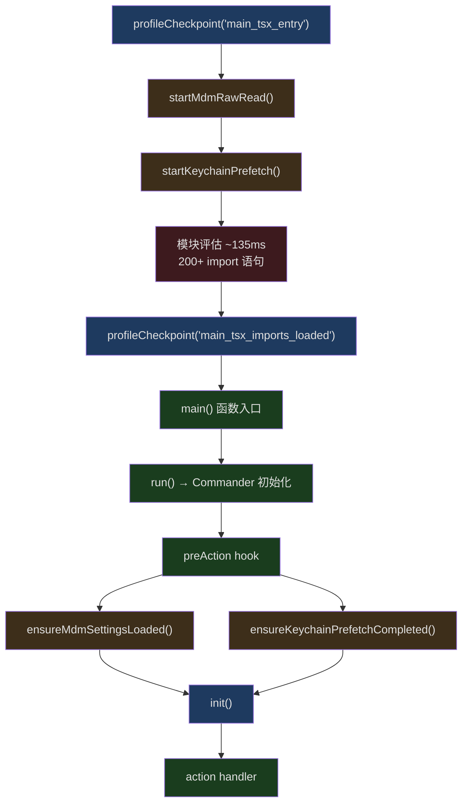
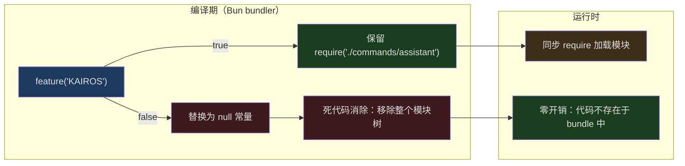

## 问题引入

Claude Code 是一个庞大的 TypeScript CLI 应用。它依赖 OpenTelemetry（约 400KB）、gRPC（通过 `@grpc/grpc-js` 约 700KB）等重型模块，拥有超过 1900 个源文件，注册了 60 多个斜杠命令和 30 多个工具。当用户在终端输入 `claude` 并按下回车，它需要：

1. 解析并评估（evaluate）所有顶层模块导入
2. 读取多层配置（MDM 企业策略、macOS Keychain、用户设置、项目设置……）
3. 初始化遥测、权限、GrowthBook 特性开关
4. 连接 MCP 服务器、加载插件和技能
5. 恢复或创建会话，渲染交互式 TUI

这个过程如果按朴素的顺序执行，冷启动很容易超过一秒。但实际体验中，`claude` 的响应是相当快的。它是怎么做到的？

本文将深入 Claude Code 的启动路径，从 `main.tsx` 的第一行代码开始，逐层剖析它所使用的每一项优化技术：并行预取、Bun 编译期死代码消除、动态惰性加载、性能剖析基础设施，以及处理循环依赖的延迟 require 模式。

## main.tsx 的分阶段初始化

Claude Code 的入口文件 `src/main.tsx` 是整个启动流程的"编排中心"。它的设计哲学是将启动拆分成多个阶段，每个阶段尽可能并行，并通过 `profileCheckpoint()` 精确测量每个阶段的耗时。

```typescript
// src/main.tsx:1-20
// These side-effects must run before all other imports:
// 1. profileCheckpoint marks entry before heavy module evaluation begins
// 2. startMdmRawRead fires MDM subprocesses (plutil/reg query) so they run in
//    parallel with the remaining ~135ms of imports below
// 3. startKeychainPrefetch fires both macOS keychain reads (OAuth + legacy API
//    key) in parallel — isRemoteManagedSettingsEligible() otherwise reads them
//    sequentially via sync spawn inside applySafeConfigEnvironmentVariables()
//    (~65ms on every macOS startup)
import { profileCheckpoint, profileReport } from './utils/startupProfiler.js';

// eslint-disable-next-line custom-rules/no-top-level-side-effects
profileCheckpoint('main_tsx_entry');
import { startMdmRawRead } from './utils/settings/mdm/rawRead.js';

// eslint-disable-next-line custom-rules/no-top-level-side-effects
startMdmRawRead();
import { ensureKeychainPrefetchCompleted, startKeychainPrefetch } from './utils/secureStorage/keychainPrefetch.js';

// eslint-disable-next-line custom-rules/no-top-level-side-effects
startKeychainPrefetch();
```

这三行顶层副作用（side-effects）的位置是经过精心设计的——它们被放在所有其他 `import` 语句之前。在 JavaScript/TypeScript 中，`import` 语句是静态的，模块会在导入时被同步评估（evaluate）。`main.tsx` 有接近 200 行 `import` 语句，模块评估大约需要 135ms。通过在第一行就打下时间戳（`profileCheckpoint('main_tsx_entry')`），然后立即启动两个异步子进程，这些子进程就可以和后续 135ms 的模块评估并行运行。

当所有 `import` 完成后，代码立刻记录：

```typescript
// src/main.tsx:209
profileCheckpoint('main_tsx_imports_loaded');
```

这个分阶段模型可以用下图来概括：



注意 `main()` 函数本身（第 585 行）并非做所有事情的地方。它设置信号处理器和安全检查后，调用 `run()` 函数（第 884 行），后者创建 Commander 实例并通过 `preAction` 钩子来延迟初始化——只有在真正执行命令时（而非仅仅显示 `--help`）才运行 `init()`：

```typescript
// src/main.tsx:905-917
// Use preAction hook to run initialization only when executing a command,
// not when displaying help. This avoids the need for env variable signaling.
program.hook('preAction', async thisCommand => {
    profileCheckpoint('preAction_start');
    // Await async subprocess loads started at module evaluation (lines 12-20).
    // Nearly free — subprocesses complete during the ~135ms of imports above.
    await Promise.all([ensureMdmSettingsLoaded(), ensureKeychainPrefetchCompleted()]);
    profileCheckpoint('preAction_after_mdm');
    await init();
    profileCheckpoint('preAction_after_init');
    // ...
});
```

`preAction` 钩子首先等待前面启动的异步子进程——但因为它们和 135ms 的 import 并行运行，到这里通常已经完成，所以 `await` 基本上是零开销。

## 并行预取：startMdmRawRead() 与 startKeychainPrefetch()

这两个函数是 Claude Code 启动优化中最精妙的设计之一。它们的核心思想是：**在模块评估的同步阻塞期间，启动异步子进程来执行耗时的 I/O 操作**。

### MDM 原始读取

`startMdmRawRead()` 负责读取企业 MDM（Mobile Device Management）配置。在 macOS 上，这意味着通过 `plutil` 子进程读取 plist 文件；在 Windows 上则是通过 `reg query` 读取注册表。

```typescript
// src/utils/settings/mdm/rawRead.ts:55-60
export function fireRawRead(): Promise<RawReadResult> {
  return (async (): Promise<RawReadResult> => {
    if (process.platform === 'darwin') {
      const plistPaths = getMacOSPlistPaths()
      const allResults = await Promise.all(
        // ... 对每个 plist 路径并行执行 plutil
```

关键点在于 `fireRawRead()` 返回一个 `Promise`，它在模块评估期间被立即调用，子进程在后台运行。结果通过一个模块级变量 `rawReadPromise` 缓存：

```typescript
// src/utils/settings/mdm/rawRead.ts:30
let rawReadPromise: Promise<RawReadResult> | null = null
```

### Keychain 预取

`startKeychainPrefetch()` 更加精细。macOS 上读取 Keychain 需要调用系统的 `security` 命令行工具，每次调用约需 32-33ms。Claude Code 需要读取两个条目：

1. **OAuth 凭证**（`"Claude Code-credentials"`）—— 约 32ms
2. **旧版 API 密钥**（`"Claude Code"`）—— 约 33ms

如果顺序执行，这将在每次 macOS 启动时浪费约 65ms。预取把这两个读取并行化：

```typescript
// src/utils/secureStorage/keychainPrefetch.ts:45-60
function spawnSecurity(serviceName: string): Promise<SpawnResult> {
  return new Promise(resolve => {
    execFile(
      'security',
      ['find-generic-password', '-a', getUsername(), '-w', '-s', serviceName],
      { encoding: 'utf-8', timeout: KEYCHAIN_PREFETCH_TIMEOUT_MS },
      (err, stdout) => {
        resolve({
          stdout: err ? null : stdout?.trim() || null,
          timedOut: Boolean(err && 'killed' in err && err.killed),
        })
      },
    )
  })
}
```

注意这个模块的导入链是经过刻意精简的——它直接导入 `child_process` 和一个轻量的 `macOsKeychainHelpers.ts`，而不是完整的 `macOsKeychainStorage.ts`。源代码注释中明确说明了原因：

```
// Imports stay minimal: child_process + macOsKeychainHelpers.ts (NOT
// macOsKeychainStorage.ts — that pulls in execa → human-signals →
// cross-spawn, ~58ms of synchronous module init).
```

导入完整的 keychain 存储模块会引入 `execa`、`human-signals`、`cross-spawn` 等依赖，光同步模块初始化就需要约 58ms——这完全违背了预取的初衷。

### 并行时序图

下面的时序图展示了这种"在同步阻塞期间并行执行异步 I/O"的模式：

```mermaid
gantt
    title 启动阶段并行时序
    dateFormat X
    axisFormat %L ms

    section 主线程（同步）
    profileCheckpoint entry     :a1, 0, 1
    startMdmRawRead()           :a2, 1, 2
    startKeychainPrefetch()     :a3, 2, 3
    模块评估 200+ imports       :a4, 3, 138

    section MDM 子进程（异步）
    plutil/reg query            :b1, 2, 50

    section Keychain 子进程（异步）
    security OAuth              :c1, 3, 35
    security API key            :c2, 3, 36

    section preAction
    ensureMdmSettingsLoaded     :d1, 138, 140
    ensureKeychainPrefetchCompleted :d2, 138, 140
    init()                      :d3, 140, 180
```



到 `preAction` 阶段 await 这些 Promise 时，子进程早就完成了。`await` 只是从缓存中取出结果，几乎零开销。这就是"fire-and-forget + late-collect"模式的精髓。

### --bare 模式的特殊处理

值得注意的是，`startKeychainPrefetch()` 会在 `--bare` 模式下跳过：

```typescript
// src/utils/secureStorage/keychainPrefetch.ts（概念）
if (isBareMode()) return  // --bare 模式不读 keychain
```

`--bare` 是一个极简模式，跳过 hooks、LSP、插件同步、auto-memory、后台预取、Keychain 读取和 CLAUDE.md 自动发现。认证严格限制为 `ANTHROPIC_API_KEY` 或通过 `--settings` 配置的 `apiKeyHelper`。这是为脚本化和 CI/CD 场景设计的，追求最快的启动速度。

## feature() 与 Bun 编译期死代码消除

Claude Code 使用 Bun 进行构建和打包。Bun 提供了一个特殊的模块 `bun:bundle`，其中的 `feature()` 函数实现了编译期的条件编译——这不是运行时的特性开关，而是在构建时就决定了代码是否被包含在最终产物中。

```typescript
// src/commands.ts:59
import { feature } from 'bun:bundle';
```

### 工作原理

`feature()` 在编译时被求值为 `true` 或 `false` 常量。Bun 的构建器（或 JavaScript 引擎的死代码消除）随后移除永远不会执行的分支。这意味着未启用的功能不仅不会执行，它们的**整个模块树**都不会被加载。

在 `src/commands.ts` 中，这种模式被大量使用：

```typescript
// src/commands.ts:62-122
const proactive =
  feature('PROACTIVE') || feature('KAIROS')
    ? require('./commands/proactive.js').default
    : null
const briefCommand =
  feature('KAIROS') || feature('KAIROS_BRIEF')
    ? require('./commands/brief.js').default
    : null
const assistantCommand = feature('KAIROS')
  ? require('./commands/assistant/index.js').default
  : null
const bridge = feature('BRIDGE_MODE')
  ? require('./commands/bridge/index.js').default
  : null
const remoteControlServerCommand =
  feature('DAEMON') && feature('BRIDGE_MODE')
    ? require('./commands/remoteControlServer/index.js').default
    : null
const voiceCommand = feature('VOICE_MODE')
  ? require('./commands/voice/index.js').default
  : null
const forceSnip = feature('HISTORY_SNIP')
  ? require('./commands/force-snip.js').default
  : null
const workflowsCmd = feature('WORKFLOW_SCRIPTS')
  ? (require('./commands/workflows/index.js') as typeof import('./commands/workflows/index.js')).default
  : null
const webCmd = feature('CCR_REMOTE_SETUP')
  ? (require('./commands/remote-setup/index.js') as typeof import('./commands/remote-setup/index.js')).default
  : null
```

注意这里使用的是 `require()` 而非 `import`——这是有意为之的。`import` 是静态的，无论外面包裹什么条件，它都会在模块评估时执行。而 `require()` 是动态的，只有当 `feature()` 返回 `true` 时才会执行。在编译期 `feature()` 为 `false` 的情况下，整个 `require()` 调用（及其依赖树）都被消除。

### 在工具系统中的应用

同样的模式在 `src/tools.ts` 中被广泛使用来控制工具的加载：

```typescript
// src/tools.ts:26-53
const SleepTool =
  feature('PROACTIVE') || feature('KAIROS')
    ? require('./tools/SleepTool/SleepTool.js').SleepTool
    : null
const cronTools = feature('AGENT_TRIGGERS')
  ? [
      require('./tools/ScheduleCronTool/CronCreateTool.js').CronCreateTool,
      require('./tools/ScheduleCronTool/CronDeleteTool.js').CronDeleteTool,
      require('./tools/ScheduleCronTool/CronListTool.js').CronListTool,
    ]
  : []
const MonitorTool = feature('MONITOR_TOOL')
  ? require('./tools/MonitorTool/MonitorTool.js').MonitorTool
  : null
const WebBrowserTool = feature('WEB_BROWSER_TOOL')
  ? require('./tools/WebBrowserTool/WebBrowserTool.js').WebBrowserTool
  : null
const SnipTool = feature('HISTORY_SNIP')
  ? require('./tools/SnipTool/SnipTool.js').SnipTool
  : null
```

### 性能影响分析

假设一个外部发布版本没有启用 `PROACTIVE`、`KAIROS`、`BRIDGE_MODE`、`VOICE_MODE`、`WORKFLOW_SCRIPTS` 等特性标志。仅在 `commands.ts` 中，就有 **16 个** 条件加载点。如果每个模块及其依赖树平均 50KB，这意味着在外部构建中，通过编译期消除节省了约 800KB 的模块加载——这不仅节省了磁盘空间和内存，更重要的是节省了模块评估时间。

这里体现了一个重要的架构决策：**特性开关不应该只在运行时判断，而应该在编译时就排除不需要的代码**。



### process.env 条件 vs feature() 条件

Claude Code 中还有另一类条件加载使用 `process.env` 而非 `feature()`：

```typescript
// src/tools.ts:16-24
const REPLTool =
  process.env.USER_TYPE === 'ant'
    ? require('./tools/REPLTool/REPLTool.js').REPLTool
    : null
const SuggestBackgroundPRTool =
  process.env.USER_TYPE === 'ant'
    ? require('./tools/SuggestBackgroundPRTool/SuggestBackgroundPRTool.js')
        .SuggestBackgroundPRTool
    : null
```

`process.env.USER_TYPE` 的值在编译时也可以被 Bun 内联（如果在构建配置中指定了 `define`），从而实现同样的死代码消除效果。在外部发布版本中，`USER_TYPE` 被设为 `"external"`，所有 `=== 'ant'` 的分支都被消除，因此内部专用工具（REPLTool、SuggestBackgroundPRTool 等）不会出现在外部产物中。

## 动态 import() 惰性加载重型模块

即使通过 `feature()` 消除了未使用的功能模块，仍然有一些大型模块是必需的但并非启动即用的。对于这些模块，Claude Code 使用动态 `import()` 来延迟加载。

### OpenTelemetry 的延迟加载

`init.ts` 中的注释非常直白：

```typescript
// src/entrypoints/init.ts:44-46
// initializeTelemetry is loaded lazily via import() in setMeterState() to defer
// ~400KB of OpenTelemetry + protobuf modules until telemetry is actually initialized.
// gRPC exporters (~700KB via @grpc/grpc-js) are further lazy-loaded within instrumentation.ts.
```

OpenTelemetry SDK 约 400KB，gRPC 约 700KB——合计超过 1MB 的模块如果在启动时同步加载，会显著拖慢冷启动。通过动态 `import()`，这些模块只在遥测实际初始化时才被加载，而且是在 `init()` 函数内部异步执行，不会阻塞主启动路径。

类似地，1P 事件日志也是异步初始化的：

```typescript
// src/entrypoints/init.ts:94-99
void Promise.all([
  import('../services/analytics/firstPartyEventLogger.js'),
  import('../services/analytics/growthbook.js'),
]).then(([fp, gb]) => {
  fp.initialize1PEventLogging()
  // ...
```

注意 `void` 前缀——这表明这个 Promise 是"fire-and-forget"的，不会阻塞 `init()` 的返回。

### insights 命令的惰性 shim

`src/commands.ts` 中有一个特别优雅的惰性加载案例——`/insights` 命令。`insights.ts` 是一个 113KB、3200 行的大文件，包含 diff 渲染和 HTML 生成：

```typescript
// src/commands.ts:188-202
// insights.ts is 113KB (3200 lines, includes diffLines/html rendering). Lazy
// shim defers the heavy module until /insights is actually invoked.
const usageReport: Command = {
  type: 'prompt',
  name: 'insights',
  description: 'Generate a report analyzing your Claude Code sessions',
  contentLength: 0,
  progressMessage: 'analyzing your sessions',
  source: 'builtin',
  async getPromptForCommand(args, context) {
    const real = (await import('./commands/insights.js')).default
    if (real.type !== 'prompt') throw new Error('unreachable')
    return real.getPromptForCommand(args, context)
  },
}
```

这个 shim 对象有和真实命令相同的接口（type、name、description 等），但 `getPromptForCommand` 方法内部通过动态 `import()` 加载真正的模块。只有当用户实际输入 `/insights` 时，113KB 的代码才会被加载。这种模式可以推广到任何"注册时轻量、调用时加载"的场景。

### setup.js 的动态加载

甚至 `setup.js` 也是动态加载的：

```typescript
// src/main.tsx:1908-1909
const { setup } = await import('./setup.js');
```

这确保了只有在真正需要设置工作目录和权限时才加载 setup 模块。

### print 模式的子命令跳过

对于 `-p/--print` 模式（非交互式），Claude Code 跳过了所有 52 个子命令的注册：

```typescript
// src/main.tsx:3875-3889
// -p/--print mode: skip subcommand registration. The 52 subcommands
// (mcp, auth, plugin, skill, task, config, doctor, update, etc.) are
// never dispatched in print mode — commander routes the prompt to the
// default action. The subcommand registration path was measured at ~65ms
// on baseline — mostly the isBridgeEnabled() call (25ms settings Zod parse
// + 40ms sync keychain subprocess)...
const isPrintMode = process.argv.includes('-p') || process.argv.includes('--print');
const isCcUrl = process.argv.some(a => a.startsWith('cc://') || a.startsWith('cc+unix://'));
if (isPrintMode && !isCcUrl) {
    profileCheckpoint('run_before_parse');
    await program.parseAsync(process.argv);
    profileCheckpoint('run_after_parse');
    return program;
```

通过一个简单的 `process.argv.includes('-p')` 检查，省下了约 65ms 的子命令注册开销。这对于被频繁调用的脚本模式（如管道中的 `echo "fix bug" | claude -p`）意义重大。

## profileCheckpoint() 性能剖析系统

Claude Code 内建了一套完整的启动性能剖析系统，定义在 `src/utils/startupProfiler.ts` 中。这个系统有两种模式：

1. **采样日志模式**：100% 的内部用户 + 0.5% 的外部用户，将各阶段耗时上报到 Statsig
2. **详细剖析模式**：通过 `CLAUDE_CODE_PROFILE_STARTUP=1` 环境变量启用，输出完整报告含内存快照

```typescript
// src/utils/startupProfiler.ts:26-36
const DETAILED_PROFILING = isEnvTruthy(process.env.CLAUDE_CODE_PROFILE_STARTUP)
const STATSIG_SAMPLE_RATE = 0.005
const STATSIG_LOGGING_SAMPLED =
  process.env.USER_TYPE === 'ant' || Math.random() < STATSIG_SAMPLE_RATE
const SHOULD_PROFILE = DETAILED_PROFILING || STATSIG_LOGGING_SAMPLED
```

### 零开销设计

当 `SHOULD_PROFILE` 为 `false` 时（约 99.5% 的外部用户），`profileCheckpoint()` 是一个空函数——完全零开销：

```typescript
// src/utils/startupProfiler.ts:65-75
export function profileCheckpoint(name: string): void {
  if (!SHOULD_PROFILE) return

  const perf = getPerformance()
  perf.mark(name)

  // Only capture memory when detailed profiling enabled (env var)
  if (DETAILED_PROFILING) {
    memorySnapshots.push(process.memoryUsage())
  }
}
```

使用 Node.js 内建的 `performance.mark()` API 做时间标记，只在详细模式下才收集 `process.memoryUsage()` 快照（因为内存使用信息的获取本身就有开销）。

### 预定义的阶段

系统预定义了几个关键阶段用于 Statsig 上报：

```typescript
// src/utils/startupProfiler.ts:48-54
const PHASE_DEFINITIONS = {
  import_time: ['cli_entry', 'main_tsx_imports_loaded'],
  init_time: ['init_function_start', 'init_function_end'],
  settings_time: ['eagerLoadSettings_start', 'eagerLoadSettings_end'],
  total_time: ['cli_entry', 'main_after_run'],
} as const
```

这让团队可以在 Statsig 仪表板上监控启动性能的趋势，及时发现回退。

### 检查点分布

通过搜索 `main.tsx` 中所有的 `profileCheckpoint()` 调用，我们可以看到检查点覆盖了启动的每个关键节点：

| 检查点 | 位置（行号） | 含义 |
|--------|-------------|------|
| `main_tsx_entry` | 12 | 入口，模块评估前 |
| `main_tsx_imports_loaded` | 209 | 所有 import 完成 |
| `main_function_start` | 586 | main() 入口 |
| `main_warning_handler_initialized` | 607 | 警告处理器就绪 |
| `run_function_start` | 885 | run() 入口 |
| `run_commander_initialized` | 903 | Commander 实例创建 |
| `preAction_start` | 908 | preAction 钩子开始 |
| `preAction_after_mdm` | 915 | MDM/Keychain 等待完成 |
| `preAction_after_init` | 917 | init() 完成 |
| `preAction_after_sinks` | 935 | 日志 sinks 附加 |
| `preAction_after_migrations` | 951 | 数据迁移完成 |
| `preAction_after_remote_settings` | 959 | 远程设置加载启动 |
| `action_handler_start` | 1007 | action 处理器开始 |
| `action_after_input_prompt` | 1862 | 输入提示处理完成 |
| `action_tools_loaded` | 1878 | 工具加载完成 |
| `action_before_setup` | 1904 | setup() 之前 |
| `action_after_setup` | 1936 | setup() 之后 |
| `action_commands_loaded` | 2031 | 命令加载完成 |
| `action_mcp_configs_loaded` | 2402 | MCP 配置加载完成 |
| `before_connectMcp` / `after_connectMcp` | 2728/2730 | MCP 连接耗时 |
| `action_after_hooks` | 3766 | SessionStart hooks 完成 |
| `run_main_options_built` | 3873 | Commander 选项定义完成 |

这个密集的检查点网络让团队可以精确定位任何性能回退的来源。

## 循环依赖的延迟 require 模式

在一个 1900+ 文件的大型项目中，循环依赖几乎不可避免。Claude Code 使用延迟 `require()` 函数来打破循环：

```typescript
// src/tools.ts:61-72
// Lazy require to break circular dependency: tools.ts -> TeamCreateTool/TeamDeleteTool -> ... -> tools.ts
const getTeamCreateTool = () =>
  require('./tools/TeamCreateTool/TeamCreateTool.js')
    .TeamCreateTool as typeof import('./tools/TeamCreateTool/TeamCreateTool.js').TeamCreateTool
const getTeamDeleteTool = () =>
  require('./tools/TeamDeleteTool/TeamDeleteTool.js')
    .TeamDeleteTool as typeof import('./tools/TeamDeleteTool/TeamDeleteTool.js').TeamDeleteTool
const getSendMessageTool = () =>
  require('./tools/SendMessageTool/SendMessageTool.js')
    .SendMessageTool as typeof import('./tools/SendMessageTool/SendMessageTool.js').SendMessageTool
```

在 `main.tsx` 中也有同样的模式：

```typescript
// src/main.tsx:69-73
// Lazy require to avoid circular dependency: teammate.ts -> AppState.tsx -> ... -> main.tsx
const getTeammateUtils = () => require('./utils/teammate.js') as typeof import('./utils/teammate.js');
const getTeammatePromptAddendum = () => require('./utils/swarm/teammatePromptAddendum.js') as typeof import('./utils/swarm/teammatePromptAddendum.js');
const getTeammateModeSnapshot = () => require('./utils/swarm/backends/teammateModeSnapshot.js') as typeof import('./utils/swarm/backends/teammateModeSnapshot.js');
```

这个模式有几个巧妙之处：

1. **函数包装**：`const getX = () => require('...')` 确保 `require()` 只在函数被调用时执行，而非模块评估时
2. **类型安全**：通过 `as typeof import('...')` 保持完整的 TypeScript 类型推导
3. **缓存**：Node.js/Bun 的 `require()` 自带模块缓存，多次调用 `getTeamCreateTool()` 只会加载一次模块

与 `feature()` 模式的区别在于：`feature()` 是编译期决策——代码要么存在要么不存在；延迟 `require()` 是运行时策略——代码总是存在于 bundle 中，但推迟到首次使用时才加载。

## 多来源配置加载优先级

Claude Code 的配置系统支持五个来源，优先级从低到高：

```typescript
// src/utils/settings/constants.ts:7-22
export const SETTING_SOURCES = [
  // User settings (global)
  'userSettings',

  // Project settings (shared per-directory)
  'projectSettings',

  // Local settings (gitignored)
  'localSettings',

  // Flag settings (from --settings flag)
  'flagSettings',

  // Policy settings (managed-settings.json or remote settings from API)
  'policySettings',
] as const
```

这个优先级链意味着企业策略（`policySettings`）可以覆盖所有其他设置，而命令行标志（`flagSettings`）可以覆盖项目和用户设置。

### 配置加载时序

配置加载本身也遵循"尽早启动、延迟收集"的模式：

```typescript
// src/main.tsx:502-515
function eagerLoadSettings(): void {
  profileCheckpoint('eagerLoadSettings_start');
  // Parse --settings flag early to ensure settings are loaded before init()
  const settingsFile = eagerParseCliFlag('--settings');
  if (settingsFile) {
    loadSettingsFromFlag(settingsFile);
  }

  const settingSourcesArg = eagerParseCliFlag('--setting-sources');
  if (settingSourcesArg !== undefined) {
    loadSettingSourcesFromFlag(settingSourcesArg);
  }
  profileCheckpoint('eagerLoadSettings_end');
}
```

`eagerParseCliFlag()` 是一个极简的 argv 解析器——它不使用 Commander 的完整解析，而是直接扫描 `process.argv` 来找到 `--settings` 标志的值。这确保了设置在 `init()` 之前就已经可用。

远程管理设置和策略限制则是异步加载的：

```typescript
// src/main.tsx:953-958
// Load remote managed settings for enterprise customers (non-blocking)
void loadRemoteManagedSettings();
void loadPolicyLimits();
profileCheckpoint('preAction_after_remote_settings');
```

`void` 前缀再次表明这些是非阻塞的。远程设置通过热重载（hot-reload）机制在到达后自动生效。

### 命令列表的延迟求值与记忆化

命令列表的构建也体现了相同的理念——声明为函数以延迟到首次调用时求值：

```typescript
// src/commands.ts:257-258
// Declared as a function so that we don't run this until getCommands is called,
// since underlying functions read from config, which can't be read at module initialization time
const COMMANDS = memoize((): Command[] => [
  addDir,
  advisor,
  agents,
  // ... 60+ commands
])
```

`memoize()` 确保命令列表只构建一次。这很重要，因为一些命令（如 `login()`）在初始化时需要读取配置——如果在模块评估阶段就构建列表，配置系统还没准备好。

## Session 恢复路径：teleport、remote、resume

Claude Code 有三种会话恢复模式，每种都有不同的启动路径和性能特征。

### --continue / --resume：本地恢复

最简单的模式。`--continue` 恢复当前目录最近的对话，`--resume` 通过会话 ID 或交互式选择器恢复指定对话：

```typescript
// src/main.tsx:3355-3363
} else if (options.resume || options.fromPr || teleport || remote !== null) {
  // Clear stale caches before resuming to ensure fresh file/skill discovery
  const { clearSessionCaches } = await import('./commands/clear/caches.js');
  clearSessionCaches();
  let messages: MessageType[] | null = null;
  let processedResume: ProcessedResume | undefined = undefined;
  let maybeSessionId = validateUuid(options.resume);
```

注意恢复前会清理缓存——这确保了恢复的会话能看到最新的文件和技能变化。

### --remote：远程会话

`--remote` 创建一个 Claude Code Web (CCR) 远程会话：

```typescript
// src/main.tsx:3401-3440
// --remote and --teleport both create/resume Claude Code Web (CCR) sessions.
if (remote !== null || teleport) {
    await waitForPolicyLimitsToLoad();
    if (!isPolicyAllowed('allow_remote_sessions')) {
      return await exitWithError(root, "Error: Remote sessions are disabled by your organization's policy.", () => gracefulShutdown(1));
    }
}
```

远程模式需要额外等待策略限制加载完成（`waitForPolicyLimitsToLoad()`），因为企业可能禁止远程会话。这是少数需要阻塞等待的地方之一。

### --teleport：跨设备恢复

Teleport 是最复杂的恢复路径，支持跨设备恢复会话。它需要：

1. 从 API 获取会话数据
2. 验证 Git 仓库匹配
3. 切换到正确的分支
4. 处理消息历史

```typescript
// src/main.tsx:3504-3519
} else if (teleport) {
    if (teleport === true || teleport === '') {
      // 交互式选择
      logEvent('tengu_teleport_interactive_mode', {});
      const teleportResult = await launchTeleportResumeWrapper(root);
      if (!teleportResult) {
        // 用户取消
      }
      } = await checkOutTeleportedSessionBranch(teleportResult.branch);
      messages = processMessagesForTeleportResume(teleportResult.log, branchError);
    } else if (typeof teleport === 'string') {
      // 通过 session ID 直接恢复
      const sessionData = await fetchSession(teleport);
```

Teleport 的进度 UI 是动态导入的（`teleportWithProgress dynamically imported at call site`，第 187 行注释），避免在不使用 teleport 时加载相关模块。

### 恢复路径与启动 Hooks 的交互

一个微妙但重要的细节：恢复路径跳过了 startup hooks：

```typescript
// src/main.tsx:2602-2607
// continue/resume/teleport paths don't fire startup hooks (or fire them
// with a different trigger)
const sessionStartHooksPromise = options.continue || options.resume || teleport || setupTrigger
  ? undefined
  : processSessionStartHooks('startup');
```

这是因为恢复会话时，`conversationRecovery.ts` 会触发 `'resume'` 类型的 hook，避免和 startup hook 重复执行。

## setup() 与命令加载的并行化

在 action handler 中，`setup()` 和命令/agent 加载被并行化：

```typescript
// src/main.tsx:1913-1934
// Parallelize setup() with commands+agents loading. setup()'s ~28ms is
// mostly startUdsMessaging (socket bind, ~20ms) — not disk-bound, so it
// doesn't contend with getCommands' file reads.
const preSetupCwd = getCwd();
// Register bundled skills/plugins before kicking getCommands()
if (process.env.CLAUDE_CODE_ENTRYPOINT !== 'local-agent') {
  initBuiltinPlugins();
  initBundledSkills();
}
const setupPromise = setup(preSetupCwd, permissionMode, ...);
const commandsPromise = worktreeEnabled ? null : getCommands(preSetupCwd);
const agentDefsPromise = worktreeEnabled ? null : getAgentDefinitionsWithOverrides(preSetupCwd);
// Suppress transient unhandledRejection if these reject during the
// ~28ms setupPromise await before Promise.all joins them below.
commandsPromise?.catch(() => {});
agentDefsPromise?.catch(() => {});
await setupPromise;
```

几个值得注意的设计决策：

1. `initBuiltinPlugins()` 和 `initBundledSkills()` 在并行启动前同步执行——它们是纯内存操作（<1ms，零 I/O），但 `getCommands()` 内部的 `getBundledSkills()` 会同步读取它们的结果。如果放在 `setup()` 内部（之前的做法），并行的 `getCommands()` 会记忆化一个空列表。

2. `commandsPromise?.catch(() => {})` 抑制瞬态的 `unhandledRejection`——在 `setupPromise` 的 28ms 等待期间，如果 `commandsPromise` 抛出异常但还没被 `await`，Node.js 会报告未处理的 rejection。空 `catch` 解决了这个问题。

3. Worktree 模式下（`worktreeEnabled`）不能并行——因为 `setup()` 会 `process.chdir()`，命令和 agent 需要 chdir 后的工作目录。

## 可迁移模式：大型 CLI 冷启动优化清单

从 Claude Code 的启动优化中，我们可以提炼出一套通用的大型 CLI 冷启动优化清单：

### 1. 分阶段初始化 + 检查点标记

将启动过程拆分为明确的阶段，每个阶段打上检查点，建立可量化的性能基线：

```
cli_entry → imports_loaded → init_start → init_end → action_start → setup → ready
```

不要猜测哪里慢——用数据说话。Claude Code 的 `profileCheckpoint()` 系统在 99.5% 的情况下是零开销的，只对采样用户收集数据。

### 2. "Fire early, collect late" 并行 I/O

识别启动路径中的 I/O 操作（文件读取、子进程调用、网络请求），在最早的时机启动它们，在最晚需要结果的时刻收集：

```
| 操作 | 启动时机 | 收集时机 | 并行窗口 |
|------|---------|---------|---------|
| MDM 读取 | 模块评估前 | preAction | ~135ms |
| Keychain 读取 | 模块评估前 | preAction | ~135ms |
| 远程设置 | init() 后 | 热重载 | 无限 |
| MCP 连接 | action handler | REPL 渲染后 | ~500ms |
```

### 3. 编译期消除 > 运行时判断

如果你知道某个功能在特定构建配置中不会使用，在编译时就消除它，而非在运行时跳过。Bun 的 `feature()` 是一种实现，Webpack 的 `DefinePlugin` + `NormalModuleReplacementPlugin` 是另一种。关键是让打包器的 tree-shaking 能够移除整个未使用的模块树。

### 4. 惰性 Shim 模式

对于注册时需要元数据但执行时才需要完整代码的组件（命令、路由、插件），创建轻量的 shim 对象：

```typescript
const heavyCommand: Command = {
  name: 'heavy',
  description: 'Does heavy work',
  async execute() {
    const real = (await import('./heavy-impl.js')).default;
    return real.execute();
  }
}
```

### 5. 延迟 require 打破循环依赖

在大型代码库中，循环依赖通过重构来彻底解决往往代价巨大。用函数包装的 `require()` 可以以最小的侵入性打破循环，同时保持类型安全：

```typescript
const getHeavyDep = () =>
  require('./heavy-dep.js') as typeof import('./heavy-dep.js');
```

### 6. 模式感知的快速路径

根据运行模式跳过不必要的初始化。Claude Code 在 `-p/--print` 模式下跳过 52 个子命令的注册（省 65ms），在 `--bare` 模式下跳过 hooks、LSP、插件等一切非必要组件：

```typescript
if (isPrintMode && !isCcUrl) {
  // 跳过所有子命令注册
  await program.parseAsync(process.argv);
  return program;
}
```

### 7. 记忆化昂贵的计算

命令列表、工具列表、技能列表等一旦计算完成，通过 `lodash/memoize` 缓存结果：

```typescript
const loadAllCommands = memoize(async (cwd: string): Promise<Command[]> => {
  // ... 昂贵的加载逻辑
});
```

当缓存需要失效时（如动态添加了新技能），提供显式的 `clearCache()` 方法：

```typescript
export function clearCommandMemoizationCaches(): void {
  loadAllCommands.cache?.clear?.()
  getSkillToolCommands.cache?.clear?.()
  getSlashCommandToolSkills.cache?.clear?.()
  clearSkillIndexCache?.()
}
```

### 8. 导入链最小化

预取模块（如 `keychainPrefetch.ts`）必须保持最小的导入链。如果预取模块本身引入了大量依赖，预取的并行优势就被同步的模块评估开销抵消了。明确注释为什么选择 `child_process` 而非 `execa`，为什么导入 `helpers` 而非 `storage`。

### 9. 非阻塞后台任务

将清理、同步、预取等非关键任务放在后台：

```typescript
// 非阻塞
void loadRemoteManagedSettings();
void loadPolicyLimits();

// 更晚启动的后台任务
if (!isBareMode()) {
  startDeferredPrefetches();
  void import('./utils/backgroundHousekeeping.js')
    .then(m => m.startBackgroundHousekeeping());
}
```

### 10. 可观测性先行

在优化之前，先建立可观测性。Claude Code 的做法是：

- 采样上报到 Statsig（生产环境监控）
- `CLAUDE_CODE_PROFILE_STARTUP=1` 详细报告（本地调试）
- 每个阶段的持续时间和内存使用量
- 自动检测和报告性能回退

没有度量就没有优化。没有持续监控，优化会随着新功能的添加而退化。

## 总结

Claude Code 的冷启动优化不是某个单一的银弹，而是一系列精心设计的技术的组合：

- **并行预取**将异步 I/O 隐藏在同步模块评估的背后
- **编译期死代码消除**在构建时就移除了未使用的功能模块树
- **动态 import() 惰性加载**将重型模块的代价推迟到首次使用
- **profileCheckpoint() 剖析系统**提供了零开销的性能可观测性
- **延迟 require 模式**以最小侵入性解决了循环依赖
- **模式感知快速路径**根据使用场景跳过不必要的初始化

每一项技术单独来看都不新颖，但它们的组合——以及贯穿始终的"先度量、再优化、持续监控"原则——使得一个拥有 1900 个源文件、依赖 OpenTelemetry 和 gRPC 等重型库的 CLI 应用实现了快速的冷启动体验。

对于构建自己的大型 CLI 或桌面应用的开发者来说，这些模式是高度可迁移的。核心思想只有一个：**将启动路径上的每一毫秒都视为稀缺资源，用并行化、延迟化和消除化来争取它们**。
