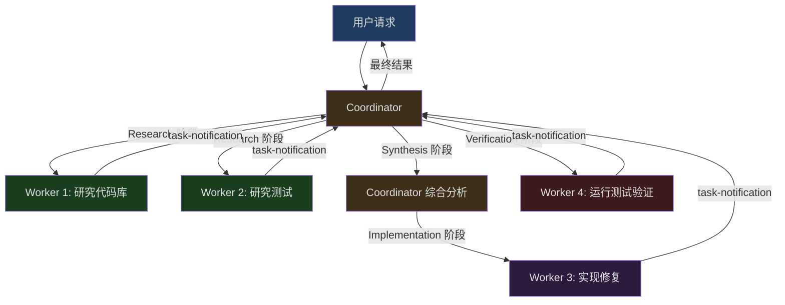
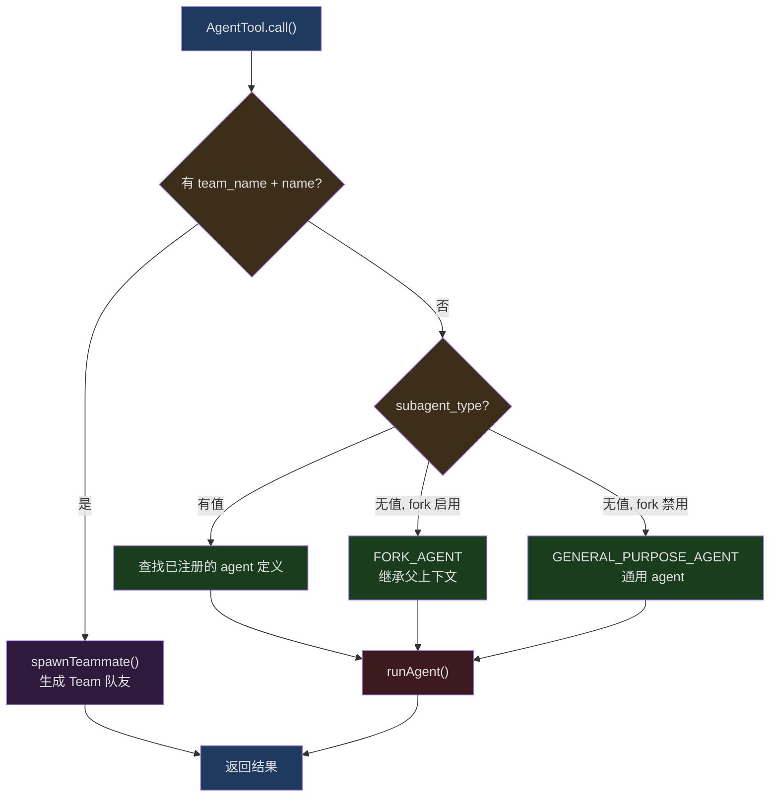
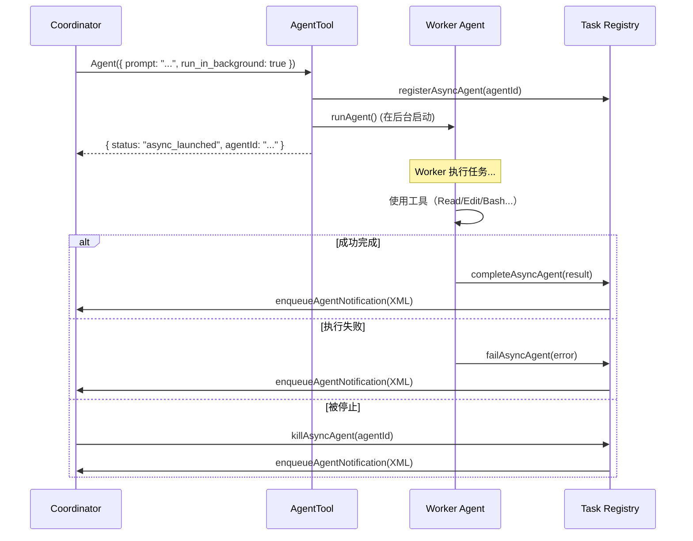
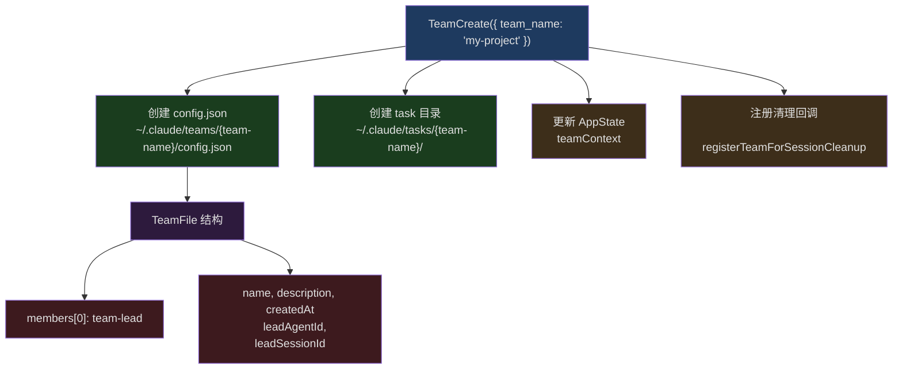
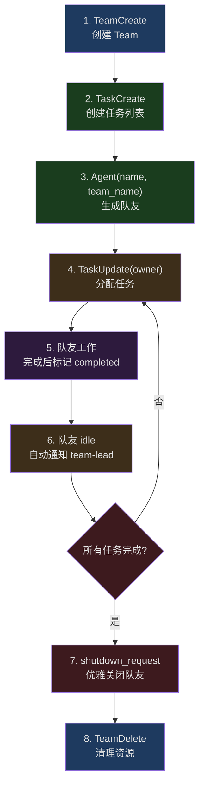

## 问题引入

当一个 AI agent 不够用时怎么办？直觉的答案是：生成更多 agent。但问题远没有这么简单。多个 agent 如何分工？它们之间如何通信？怎样共享上下文而不产生冲突？当一个 worker 完成任务后，如何将结果汇报给协调者？如果某个 worker 走错了方向，如何及时终止它？

这些问题的核心是一个经典的分布式系统设计挑战——只不过这里的"节点"不是服务器，而是 LLM 实例。Claude Code 用一套精巧的多 Agent 架构回答了这些问题，它的核心模式叫做 **Coordinator/Worker**。

本文将深入 Claude Code 的多 Agent 系统，从 Coordinator 模式的整体架构出发，逐层剖析 `AgentTool` 的 agent 生成机制、Worker 的受限工具集、任务通知的 XML 协议、`SendMessageTool` 的跨 agent 通信、Scratchpad 目录的持久化状态共享、后台执行与进度追踪、Team swarm 模式，以及 MCP Server 在 agent 间的继承与隔离。

## Coordinator 模式的整体架构

Claude Code 的多 Agent 系统建立在一个清晰的角色分离模型上：**Coordinator** 负责理解用户意图、分解任务、综合结果；**Worker** 负责执行具体工作（研究、实现、验证）。Coordinator 本身不直接操作文件或运行命令——它只拥有极少量的"管理工具"。

### 角色分离的设计哲学

这个设计背后的哲学很简单：让 Coordinator 专注于"思考"，让 Worker 专注于"执行"。Coordinator 的工具集被严格限制为四个：

```typescript
// src/constants/tools.ts:107-112
export const COORDINATOR_MODE_ALLOWED_TOOLS = new Set([
  AGENT_TOOL_NAME,        // 'Agent' — 生成新 worker
  TASK_STOP_TOOL_NAME,    // 'TaskStop' — 停止运行中的 worker
  SEND_MESSAGE_TOOL_NAME, // 'SendMessage' — 向已有 worker 发送消息
  SYNTHETIC_OUTPUT_TOOL_NAME, // 'SyntheticOutput' — 内部输出工具
])
```

Coordinator 不能读写文件、不能执行 shell 命令、不能搜索代码。它能做的只有三件事：生成 worker、停止 worker、向 worker 发消息。这种极端的约束迫使 Coordinator 成为一个纯粹的"指挥官"。

### Coordinator 模式的启用与检测

Coordinator 模式通过环境变量 `CLAUDE_CODE_COORDINATOR_MODE` 控制：

```typescript
// src/coordinator/coordinatorMode.ts:36-41
export function isCoordinatorMode(): boolean {
  if (feature('COORDINATOR_MODE')) {
    return isEnvTruthy(process.env.CLAUDE_CODE_COORDINATOR_MODE)
  }
  return false
}
```

这里有一个双重门控：首先需要 `COORDINATOR_MODE` 编译期特性标志开启（通过 Bun 的 `feature()` 宏实现死代码消除），然后需要环境变量为 truthy 值。这确保了在不支持 Coordinator 模式的构建中，相关代码被完全剔除。

当恢复一个之前以 Coordinator 模式运行的会话时，系统会自动匹配模式：

```typescript
// src/coordinator/coordinatorMode.ts:49-78
export function matchSessionMode(
  sessionMode: 'coordinator' | 'normal' | undefined,
): string | undefined {
  if (!sessionMode) {
    return undefined
  }
  const currentIsCoordinator = isCoordinatorMode()
  const sessionIsCoordinator = sessionMode === 'coordinator'

  if (currentIsCoordinator === sessionIsCoordinator) {
    return undefined
  }

  // Flip the env var — isCoordinatorMode() reads it live, no caching
  if (sessionIsCoordinator) {
    process.env.CLAUDE_CODE_COORDINATOR_MODE = '1'
  } else {
    delete process.env.CLAUDE_CODE_COORDINATOR_MODE
  }

  return sessionIsCoordinator
    ? 'Entered coordinator mode to match resumed session.'
    : 'Exited coordinator mode to match resumed session.'
}
```

这段代码展示了一个有趣的设计选择：模式状态存储在 `process.env` 中而非某个状态对象里，因为 `isCoordinatorMode()` 被大量调用，直接读环境变量避免了引入任何额外的状态管理层。

### Coordinator 的系统提示与任务工作流

Coordinator 的系统提示定义了一套完整的任务工作流，包含四个阶段：



系统提示中定义的并发规则非常务实：

```typescript
// src/coordinator/coordinatorMode.ts:213-219 (系统提示片段)
// Manage concurrency:
// - **Read-only tasks** (research) — run in parallel freely
// - **Write-heavy tasks** (implementation) — one at a time per set of files
// - **Verification** can sometimes run alongside implementation on different file areas
```

这不是通过代码强制实施的——它依赖 LLM 自身理解并遵循这些规则。这是一个值得注意的架构决策：在"硬编码并发控制"和"信任 LLM 判断"之间，Claude Code 选择了后者，因为文件冲突的情况复杂多变，硬编码规则很难覆盖所有场景。

## AgentTool 的 Agent 生成机制

`AgentTool` 是整个多 Agent 系统的入口——所有 worker 的创建都通过它完成。它的实现在 `src/tools/AgentTool/AgentTool.tsx` 中，是整个代码库中最复杂的工具之一（超过 4000 行）。

### 输入 Schema 与模式路由

AgentTool 的输入 schema 根据编译期特性标志动态组合：

```typescript
// src/tools/AgentTool/AgentTool.tsx:82-101
const baseInputSchema = lazySchema(() => z.object({
  description: z.string().describe('A short (3-5 word) description of the task'),
  prompt: z.string().describe('The task for the agent to perform'),
  subagent_type: z.string().optional()
    .describe('The type of specialized agent to use for this task'),
  model: z.enum(['sonnet', 'opus', 'haiku']).optional()
    .describe("Optional model override for this agent."),
  run_in_background: z.boolean().optional()
    .describe('Set to true to run this agent in the background.')
}));

const fullInputSchema = lazySchema(() => {
  const multiAgentInputSchema = z.object({
    name: z.string().optional()
      .describe('Name for the spawned agent.'),
    team_name: z.string().optional()
      .describe('Team name for spawning.'),
    mode: permissionModeSchema().optional()
      .describe('Permission mode for spawned teammate.'),
  });
  return baseInputSchema().merge(multiAgentInputSchema).extend({
    isolation: z.enum(['worktree']).optional()
      .describe('Isolation mode. "worktree" creates a temporary git worktree.'),
    cwd: z.string().optional()
      .describe('Absolute path to run the agent in.')
  });
});
```

这里使用了 `lazySchema()` 包装，确保 Zod schema 只在首次使用时才实例化。注意 `isolation` 字段的枚举值根据构建类型不同而不同——内部构建支持 `'worktree' | 'remote'`，外部构建只支持 `'worktree'`。

### Agent 类型解析与路由

当 `AgentTool.call()` 被调用时，首先需要解析出目标 agent 的类型。这里有三条路径：



关键的路由逻辑如下：

```typescript
// src/tools/AgentTool/AgentTool.tsx:322-356
const effectiveType = subagent_type
  ?? (isForkSubagentEnabled() ? undefined : GENERAL_PURPOSE_AGENT.agentType);
const isForkPath = effectiveType === undefined;

let selectedAgent: AgentDefinition;
if (isForkPath) {
  // 递归 fork 防护：fork 子进程不能再次 fork
  if (toolUseContext.options.querySource ===
      `agent:builtin:${FORK_AGENT.agentType}`
      || isInForkChild(toolUseContext.messages)) {
    throw new Error(
      'Fork is not available inside a forked worker.'
    );
  }
  selectedAgent = FORK_AGENT;
} else {
  const allAgents = toolUseContext.options.agentDefinitions.activeAgents;
  const agents = filterDeniedAgents(allAgents,
    appState.toolPermissionContext, AGENT_TOOL_NAME);
  const found = agents.find(agent => agent.agentType === effectiveType);
  if (!found) {
    // 区分"不存在"和"被权限规则拒绝"
    const agentExistsButDenied = allAgents.find(
      agent => agent.agentType === effectiveType
    );
    if (agentExistsButDenied) {
      const denyRule = getDenyRuleForAgent(
        appState.toolPermissionContext, AGENT_TOOL_NAME, effectiveType
      );
      throw new Error(
        `Agent type '${effectiveType}' has been denied by permission rule.`
      );
    }
    throw new Error(`Agent type '${effectiveType}' not found.`);
  }
  selectedAgent = found;
}
```

这里有几个重要的设计细节：

1. **递归 fork 防护**：使用双重检测——`querySource`（抗压缩，因为它在 spawn 时设置）和消息扫描（回退路径），确保 fork 子进程不会无限递归。

2. **权限过滤**：agent 类型可以被权限规则拒绝（通过 `Agent(AgentName)` 语法在设置中配置），错误信息区分了"不存在"和"被拒绝"两种情况。

3. **模型覆盖**：在 Coordinator 模式下，`model` 参数被强制忽略（设为 `undefined`），因为 worker 需要默认的高能力模型来完成实质性任务。

### Worker 工具集的组装

Worker 的工具集不是简单地继承自 Coordinator——它是独立组装的：

```typescript
// src/tools/AgentTool/AgentTool.tsx:573-577
const workerPermissionContext = {
  ...appState.toolPermissionContext,
  mode: selectedAgent.permissionMode ?? 'acceptEdits'
};
const workerTools = assembleToolPool(
  workerPermissionContext, appState.mcp.tools
);
```

Worker 获得自己的权限模式（默认 `'acceptEdits'`），然后从全局工具池中独立组装可用工具。这意味着 Worker 的工具集与 Coordinator 的限制完全无关——即使 Coordinator 只有 4 个管理工具，Worker 仍然可以使用完整的文件操作、代码搜索等工具。

### Worktree 隔离

当 `isolation: 'worktree'` 时，AgentTool 会创建一个临时的 git worktree，让 Worker 在代码库的隔离副本上工作：

```typescript
// src/tools/AgentTool/AgentTool.tsx:590-593
if (effectiveIsolation === 'worktree') {
  const slug = `agent-${earlyAgentId.slice(0, 8)}`;
  worktreeInfo = await createAgentWorktree(slug);
}
```

Worktree 隔离带来了两个重要好处：Worker 可以自由修改代码而不影响主工作区；多个 Worker 可以同时在不同的 worktree 中并行修改代码。当 Worker 完成后，如果 worktree 中没有变更，它会被自动清理；如果有变更，worktree 路径和分支名会返回给 Coordinator。

## Worker 的受限工具集

Worker 作为异步运行的子 agent，它的工具集受到精心设计的限制。这些限制定义在 `ASYNC_AGENT_ALLOWED_TOOLS` 集合中：

```typescript
// src/constants/tools.ts:55-71
export const ASYNC_AGENT_ALLOWED_TOOLS = new Set([
  FILE_READ_TOOL_NAME,      // 读取文件
  WEB_SEARCH_TOOL_NAME,     // 网络搜索
  TODO_WRITE_TOOL_NAME,     // 写入待办
  GREP_TOOL_NAME,           // 内容搜索
  WEB_FETCH_TOOL_NAME,      // 获取网页
  GLOB_TOOL_NAME,           // 文件模式匹配
  ...SHELL_TOOL_NAMES,      // Bash / PowerShell
  FILE_EDIT_TOOL_NAME,      // 编辑文件
  FILE_WRITE_TOOL_NAME,     // 写入文件
  NOTEBOOK_EDIT_TOOL_NAME,  // 编辑 Notebook
  SKILL_TOOL_NAME,          // 技能调用
  SYNTHETIC_OUTPUT_TOOL_NAME,
  TOOL_SEARCH_TOOL_NAME,    // 工具搜索
  ENTER_WORKTREE_TOOL_NAME, // 进入 worktree
  EXIT_WORKTREE_TOOL_NAME,  // 退出 worktree
])
```

被明确排除的工具包括：

```typescript
// src/constants/tools.ts:36-46
export const ALL_AGENT_DISALLOWED_TOOLS = new Set([
  TASK_OUTPUT_TOOL_NAME,      // 防止递归
  EXIT_PLAN_MODE_V2_TOOL_NAME, // Plan 模式是主线程抽象
  ENTER_PLAN_MODE_TOOL_NAME,
  AGENT_TOOL_NAME,            // 防止 agent 递归生成（ant 用户除外）
  ASK_USER_QUESTION_TOOL_NAME, // 异步 worker 不能向用户提问
  TASK_STOP_TOOL_NAME,        // 需要主线程任务状态
  WORKFLOW_TOOL_NAME,         // 防止工作流递归
])
```

工具过滤的实际逻辑在 `filterToolsForAgent` 中实现：

```typescript
// src/tools/AgentTool/agentToolUtils.ts:70-116
export function filterToolsForAgent({
  tools, isBuiltIn, isAsync = false, permissionMode,
}: { tools: Tools; isBuiltIn: boolean; isAsync?: boolean;
     permissionMode?: PermissionMode }): Tools {
  return tools.filter(tool => {
    // MCP 工具始终允许
    if (tool.name.startsWith('mcp__')) {
      return true
    }
    // Plan 模式下允许 ExitPlanMode
    if (toolMatchesName(tool, EXIT_PLAN_MODE_V2_TOOL_NAME)
        && permissionMode === 'plan') {
      return true
    }
    // 全局禁止列表
    if (ALL_AGENT_DISALLOWED_TOOLS.has(tool.name)) {
      return false
    }
    // 自定义 agent 额外禁止列表
    if (!isBuiltIn && CUSTOM_AGENT_DISALLOWED_TOOLS.has(tool.name)) {
      return false
    }
    // 异步 agent 白名单过滤
    if (isAsync && !ASYNC_AGENT_ALLOWED_TOOLS.has(tool.name)) {
      // 特例：in-process teammate 可以使用 AgentTool 和任务工具
      if (isAgentSwarmsEnabled() && isInProcessTeammate()) {
        if (toolMatchesName(tool, AGENT_TOOL_NAME)) {
          return true
        }
        if (IN_PROCESS_TEAMMATE_ALLOWED_TOOLS.has(tool.name)) {
          return true
        }
      }
      return false
    }
    return true
  })
}
```

这里有一个特别有趣的分层设计。对于 in-process teammate（Team 模式中的队友），额外允许了一组任务管理工具：

```typescript
// src/constants/tools.ts:77-88
export const IN_PROCESS_TEAMMATE_ALLOWED_TOOLS = new Set([
  TASK_CREATE_TOOL_NAME,
  TASK_GET_TOOL_NAME,
  TASK_LIST_TOOL_NAME,
  TASK_UPDATE_TOOL_NAME,
  SEND_MESSAGE_TOOL_NAME,
])
```

这使得 Team 中的队友可以创建任务、更新任务状态、向其他队友发消息——这些都是 swarm 协作所必需的能力。

## 任务通知机制

Worker 完成任务后，不是通过函数调用返回结果，而是通过一种精心设计的 **XML 格式通知** 将结果发送给 Coordinator。这个通知以 `user-role message` 的形式注入到 Coordinator 的对话中。

### 通知格式

```xml
<task-notification>
  <task-id>{agentId}</task-id>
  <status>completed|failed|killed</status>
  <summary>{human-readable status summary}</summary>
  <result>{agent's final text response}</result>
  <usage>
    <total_tokens>N</total_tokens>
    <tool_uses>N</tool_uses>
    <duration_ms>N</duration_ms>
  </usage>
</task-notification>
```

为什么选择 XML 而不是 JSON？因为 `<task-notification>` 开头标签提供了一个清晰的、易于 LLM 识别的信号——Coordinator 的系统提示明确指出"通过 `<task-notification>` 开头标签区分通知和用户消息"。XML 的标签结构比 JSON 的花括号更容易被 LLM 在流式生成中识别和解析。

### 通知的注入路径

通知通过 `enqueueAgentNotification` 注入到 Coordinator 的消息流中。整个异步 agent 的生命周期管理在 `runAsyncAgentLifecycle` 函数中：



当 Worker 在后台运行时，Coordinator 可以继续与用户交互或启动更多 Worker。通知以 user-role 消息的形式到达，Coordinator 在下一个 turn 开始时处理它们。

### One-shot 优化

对于某些内建 agent（如 `Explore` 和 `Plan`），它们只运行一次，Coordinator 不会用 `SendMessage` 继续它们。对于这些 agent，通知中省略了 `agentId` 和 `SendMessage` 使用说明，以节省 token：

```typescript
// src/tools/AgentTool/constants.ts:9-12
export const ONE_SHOT_BUILTIN_AGENT_TYPES: ReadonlySet<string> = new Set([
  'Explore',
  'Plan',
])
```

注释中提到这个优化"saves ~135 chars x 34M Explore runs/week"——在大规模运行中，每个 token 都很重要。

## SendMessageTool：跨 Agent 通信

`SendMessageTool` 是 Agent 间通信的核心工具。它不仅用于 Coordinator 向 Worker 发送后续指令，还支持 Team 模式中队友之间的直接通信。

### 消息路由逻辑

SendMessageTool 的消息路由非常精细，处理多种目标类型：

```typescript
// src/tools/SendMessageTool/SendMessageTool.ts:67-87
const inputSchema = lazySchema(() =>
  z.object({
    to: z.string().describe(
      'Recipient: teammate name, or "*" for broadcast to all teammates'
    ),
    summary: z.string().optional().describe(
      'A 5-10 word summary shown as a preview in the UI'
    ),
    message: z.union([
      z.string().describe('Plain text message content'),
      StructuredMessage(),
    ]),
  }),
)
```

`to` 字段可以是：
- 队友名称（如 `"researcher"`）——发送给特定队友
- `"*"`——广播给所有队友
- `"uds:/path/to.sock"`——跨进程通信（通过 Unix Domain Socket）
- `"bridge:session_..."`——跨机器通信（通过 Remote Control）

### 向已有 Worker 发送消息

当 Coordinator 使用 `SendMessage` 向一个已完成或正在运行的 Worker 发送消息时，处理逻辑有三种分支：

```typescript
// src/tools/SendMessageTool/SendMessageTool.ts:802-873
if (typeof input.message === 'string' && input.to !== '*') {
  const appState = context.getAppState()
  const registered = appState.agentNameRegistry.get(input.to)
  const agentId = registered ?? toAgentId(input.to)

  if (agentId) {
    const task = appState.tasks[agentId]
    if (isLocalAgentTask(task) && !isMainSessionTask(task)) {
      if (task.status === 'running') {
        // Worker 仍在运行：队列化消息，在下一个工具轮次交付
        queuePendingMessage(agentId, input.message, ...)
        return { data: {
          success: true,
          message: `Message queued for delivery to ${input.to}.`
        }}
      }
      // Worker 已停止：自动恢复
      const result = await resumeAgentBackground({
        agentId, prompt: input.message, ...
      })
      return { data: {
        success: true,
        message: `Agent "${input.to}" was stopped; resumed it in background.`
      }}
    }
  }
}
```

这里有两个重要的行为：

1. **运行中的 Worker**：消息被队列化（`queuePendingMessage`），在 Worker 的下一个工具调用轮次中交付。这避免了中断 Worker 当前的工作。

2. **已停止的 Worker**：Worker 被自动恢复（`resumeAgentBackground`），从磁盘上的 transcript 加载之前的对话上下文，然后以新消息作为续接提示继续执行。这使得 Coordinator 可以反复利用同一个 Worker 的已有上下文。

### 结构化消息协议

除了纯文本消息，SendMessageTool 还支持结构化消息，用于 Team 模式中的协调操作：

```typescript
// src/tools/SendMessageTool/SendMessageTool.ts:46-65
const StructuredMessage = lazySchema(() =>
  z.discriminatedUnion('type', [
    z.object({
      type: z.literal('shutdown_request'),
      reason: z.string().optional(),
    }),
    z.object({
      type: z.literal('shutdown_response'),
      request_id: z.string(),
      approve: semanticBoolean(),
      reason: z.string().optional(),
    }),
    z.object({
      type: z.literal('plan_approval_response'),
      request_id: z.string(),
      approve: semanticBoolean(),
      feedback: z.string().optional(),
    }),
  ]),
)
```

这些结构化消息实现了三种协调协议：

- **关闭协议**：Team lead 向队友发送 `shutdown_request`，队友回复 `shutdown_response`（批准或拒绝）。批准关闭会触发队友进程的 `gracefulShutdown`。
- **计划审批协议**：在 plan 权限模式下，队友需要 Team lead 审批计划后才能执行实现。
- **广播**：`to: "*"` 广播消息给所有队友，遍历 team file 中的所有成员（排除发送者自身）。

### Mailbox 通信模型

Team 模式中的消息传递基于 **mailbox 模型**——消息被写入接收方的 mailbox 文件，而非直接推送：

```typescript
// src/tools/SendMessageTool/SendMessageTool.ts:161-170
await writeToMailbox(
  recipientName,
  {
    from: senderName,
    text: content,
    summary,
    timestamp: new Date().toISOString(),
    color: senderColor,
  },
  teamName,
)
```

这个设计的好处是完全解耦了发送方和接收方——发送方不需要等待接收方在线，消息会在接收方下次轮询 mailbox 时被交付。

## Scratchpad 目录：跨 Worker 的持久化状态共享

多个 Worker 之间如何共享信息？Claude Code 提供了一个叫做 **Scratchpad** 的机制——一个会话级别的临时目录，所有 Worker 可以自由读写，无需权限提示。

### Scratchpad 的位置与权限

```typescript
// src/utils/permissions/filesystem.ts:384-386
export function getScratchpadDir(): string {
  return join(getProjectTempDir(), getSessionId(), 'scratchpad')
}
```

路径格式为 `/tmp/claude-{uid}/{sanitized-cwd}/{sessionId}/scratchpad/`。目录以 `0o700` 权限创建（仅所有者可访问），确保安全性。

### Coordinator 如何告知 Worker Scratchpad 的存在

Scratchpad 目录信息通过 user context 注入到 Coordinator 的上下文中：

```typescript
// src/coordinator/coordinatorMode.ts:80-108
export function getCoordinatorUserContext(
  mcpClients: ReadonlyArray<{ name: string }>,
  scratchpadDir?: string,
): { [k: string]: string } {
  if (!isCoordinatorMode()) {
    return {}
  }

  let content = `Workers spawned via the ${AGENT_TOOL_NAME} tool have ` +
    `access to these tools: ${workerTools}`

  if (mcpClients.length > 0) {
    const serverNames = mcpClients.map(c => c.name).join(', ')
    content += `\n\nWorkers also have access to MCP tools from ` +
      `connected MCP servers: ${serverNames}`
  }

  if (scratchpadDir && isScratchpadGateEnabled()) {
    content += `\n\nScratchpad directory: ${scratchpadDir}\n` +
      `Workers can read and write here without permission prompts. ` +
      `Use this for durable cross-worker knowledge — ` +
      `structure files however fits the work.`
  }

  return { workerToolsContext: content }
}
```

注意提示词中的关键短语："structure files however fits the work"——系统没有规定 Scratchpad 中的文件结构，而是让 Coordinator 和 Worker 根据任务需要自行组织。这是一种有意的灵活性。

### 安全：路径遍历防护

Scratchpad 的路径检测包含了路径遍历防护：

```typescript
// src/utils/permissions/filesystem.ts:410-423
function isScratchpadPath(absolutePath: string): boolean {
  if (!isScratchpadEnabled()) {
    return false
  }
  const scratchpadDir = getScratchpadDir()
  // SECURITY: Normalize the path to resolve .. segments before checking
  const normalizedPath = normalize(absolutePath)
  return (
    normalizedPath === scratchpadDir ||
    normalizedPath.startsWith(scratchpadDir + sep)
  )
}
```

注释中明确警告了攻击向量：不进行规范化的话，类似 `/tmp/claude-0/proj/session/scratchpad/../../../etc/passwd` 的路径会通过 `startsWith` 检查但实际写入 `/etc/passwd`。`normalize()` 调用消除了 `..` 段，堵住了这个漏洞。

## 后台执行与进度追踪

### 同步 vs 异步执行

AgentTool 支持两种执行模式：同步（前台）和异步（后台）。决定使用哪种模式的逻辑综合了多个信号：

```typescript
// src/tools/AgentTool/AgentTool.tsx:557-567
const shouldRunAsync = (
  run_in_background === true ||        // 显式请求后台运行
  selectedAgent.background === true ||   // agent 定义要求后台运行
  isCoordinator ||                       // Coordinator 模式下全部异步
  forceAsync ||                          // Fork 实验模式下全部异步
  assistantForceAsync ||                 // Assistant 模式下强制异步
  (proactiveModule?.isProactiveActive() ?? false)  // 主动模式
) && !isBackgroundTasksDisabled;         // 全局禁用开关
```

在 Coordinator 模式下，**所有** agent 都异步运行。这是因为 Coordinator 的核心价值在于并行编排——如果 Worker 同步运行，Coordinator 就无法同时启动多个 Worker。

### 自动后台化

还有一个自动后台化机制——当 Worker 运行超过一定时间（120 秒）时，它会自动转入后台：

```typescript
// src/tools/AgentTool/AgentTool.tsx:72-77
function getAutoBackgroundMs(): number {
  if (isEnvTruthy(process.env.CLAUDE_AUTO_BACKGROUND_TASKS)
      || getFeatureValue_CACHED_MAY_BE_STALE(
           'tengu_auto_background_agents', false)) {
    return 120_000;
  }
  return 0;
}
```

### Agent 恢复机制

当一个已停止的 agent 需要被恢复时，`resumeAgentBackground` 函数负责从磁盘 transcript 重建对话上下文：

```typescript
// src/tools/AgentTool/resumeAgent.ts:42-60
export async function resumeAgentBackground({
  agentId,
  prompt,
  toolUseContext,
  canUseTool,
  invokingRequestId,
}: {
  agentId: string
  prompt: string
  toolUseContext: ToolUseContext
  canUseTool: CanUseToolFn
  invokingRequestId?: string
}): Promise<ResumeAgentResult> {
  const startTime = Date.now()
  const appState = toolUseContext.getAppState()
  const rootSetAppState =
    toolUseContext.setAppStateForTasks ?? toolUseContext.setAppState
  // ...
}
```

恢复过程读取 agent 之前的 transcript（包括所有工具调用和结果），重建消息历史，然后将新的 prompt 作为 user message 添加到末尾。这使得恢复后的 agent 拥有完整的之前执行上下文。

## runAgent：Worker 的执行引擎

`runAgent` 是 Worker 的核心执行函数，它是一个异步生成器，负责初始化 MCP 服务器、构建上下文、运行查询循环。

### MCP Server 的继承与隔离

Agent 定义可以声明自己的 MCP 服务器，这些服务器是父上下文 MCP 客户端的**增量扩展**：

```typescript
// src/tools/AgentTool/runAgent.ts:95-110
async function initializeAgentMcpServers(
  agentDefinition: AgentDefinition,
  parentClients: MCPServerConnection[],
): Promise<{
  clients: MCPServerConnection[]
  tools: Tools
  cleanup: () => Promise<void>
}> {
  if (!agentDefinition.mcpServers?.length) {
    return {
      clients: parentClients,  // 无自定义 MCP 时直接继承父客户端
      tools: [],
      cleanup: async () => {},
    }
  }
  // ...
}
```

MCP 服务器的引用有两种方式：

1. **字符串引用**：引用已配置的 MCP 服务器名称，使用 memoized 的 `connectToServer` 共享连接。
2. **内联定义**：`{ [name]: config }` 格式的全新 MCP 服务器配置，agent 结束时需要清理。

```typescript
// src/tools/AgentTool/runAgent.ts:135-175
for (const spec of agentDefinition.mcpServers) {
  if (typeof spec === 'string') {
    // 按名称引用——使用 memoized connectToServer 共享连接
    name = spec
    config = getMcpConfigByName(spec)
  } else {
    // 内联定义——agent 专属，需要在结束时清理
    const [serverName, serverConfig] = Object.entries(spec)[0]!
    name = serverName
    config = { ...serverConfig, scope: 'dynamic' }
    isNewlyCreated = true
  }

  const client = await connectToServer(name, config)
  agentClients.push(client)
  if (isNewlyCreated) {
    newlyCreatedClients.push(client)
  }
}
```

关键的安全约束：当 MCP 被锁定为 plugin-only 模式时，**用户控制的 agent** 的 frontmatter MCP 服务器会被跳过，但 plugin、built-in 和 policySettings agent 的 MCP 不受影响，因为它们是管理员信任的来源：

```typescript
// src/tools/AgentTool/runAgent.ts:117-127
const agentIsAdminTrusted = isSourceAdminTrusted(agentDefinition.source)
if (isRestrictedToPluginOnly('mcp') && !agentIsAdminTrusted) {
  logForDebugging(
    `[Agent: ${agentDefinition.agentType}] Skipping MCP servers: ` +
    `strictPluginOnlyCustomization locks MCP to plugin-only`
  )
  return { clients: parentClients, tools: [], cleanup: async () => {} }
}
```

清理函数只清理新创建的客户端，共享客户端由父上下文管理：

```typescript
// src/tools/AgentTool/runAgent.ts:197-210
const cleanup = async () => {
  for (const client of newlyCreatedClients) {
    if (client.type === 'connected') {
      try {
        await client.cleanup()
      } catch (error) {
        logForDebugging(
          `Error cleaning up MCP server '${client.name}': ${error}`
        )
      }
    }
  }
}

return {
  clients: [...parentClients, ...agentClients],  // 合并父 + agent 专属
  tools: agentTools,
  cleanup,
}
```

### Agent 定义与工具控制

每个 agent 的能力由 `AgentDefinition` 控制。以内建的 general-purpose agent 为例：

```typescript
// src/tools/AgentTool/built-in/generalPurposeAgent.ts:25-34
export const GENERAL_PURPOSE_AGENT: BuiltInAgentDefinition = {
  agentType: 'general-purpose',
  whenToUse: 'General-purpose agent for researching complex questions...',
  tools: ['*'],          // 使用所有可用工具
  source: 'built-in',
  baseDir: 'built-in',
  // model 故意省略——使用 getDefaultSubagentModel()
  getSystemPrompt: getGeneralPurposeSystemPrompt,
}
```

`tools: ['*']` 表示使用所有可用工具（经过过滤后的）。自定义 agent 可以指定具体的工具列表或 disallowed 列表。`resolveAgentTools` 函数处理这些复杂的工具解析逻辑：

```typescript
// src/tools/AgentTool/agentToolUtils.ts:122-173
export function resolveAgentTools(
  agentDefinition, availableTools, isAsync = false, isMainThread = false,
): ResolvedAgentTools {
  const filteredAvailableTools = isMainThread
    ? availableTools
    : filterToolsForAgent({
        tools: availableTools,
        isBuiltIn: source === 'built-in',
        isAsync,
        permissionMode,
      })

  // 创建禁用工具集
  const disallowedToolSet = new Set(
    disallowedTools?.map(toolSpec => {
      const { toolName } = permissionRuleValueFromString(toolSpec)
      return toolName
    }) ?? [],
  )

  // 过滤
  const allowedAvailableTools = filteredAvailableTools.filter(
    tool => !disallowedToolSet.has(tool.name),
  )

  // 通配符处理
  const hasWildcard = agentTools === undefined
    || (agentTools.length === 1 && agentTools[0] === '*')
  if (hasWildcard) {
    return {
      hasWildcard: true,
      validTools: [],
      invalidTools: [],
      resolvedTools: allowedAvailableTools,
    }
  }
  // ...
}
```

## Team 系统：Swarm 模式

除了 Coordinator/Worker 模式，Claude Code 还支持一种更松散的多 Agent 协作方式——**Team（Swarm）模式**。在这种模式下，多个 agent 作为"队友"并行工作，通过共享任务列表和消息系统协作。

### TeamCreateTool：创建 Team

```typescript
// src/tools/TeamCreateTool/TeamCreateTool.ts:37-49
const inputSchema = lazySchema(() =>
  z.strictObject({
    team_name: z.string()
      .describe('Name for the new team to create.'),
    description: z.string().optional()
      .describe('Team description/purpose.'),
    agent_type: z.string().optional()
      .describe('Type/role of the team lead.'),
  }),
)
```

创建 Team 会做以下几件事：



Team 与 Task List 是 1:1 对应的——每个 Team 拥有自己的任务列表目录，任务编号从 1 开始：

```typescript
// src/tools/TeamCreateTool/TeamCreateTool.ts:182-191
const taskListId = sanitizeName(finalTeamName)
await resetTaskList(taskListId)
await ensureTasksDir(taskListId)

// 注册 team name 使 getTaskListId() 返回它
setLeaderTeamName(sanitizeName(finalTeamName))
```

### TeamFile 结构

```typescript
// src/tools/TeamCreateTool/TeamCreateTool.ts:157-175
const teamFile: TeamFile = {
  name: finalTeamName,
  description: _description,
  createdAt: Date.now(),
  leadAgentId,
  leadSessionId: getSessionId(),
  members: [
    {
      agentId: leadAgentId,
      name: TEAM_LEAD_NAME,  // 'team-lead'
      agentType: leadAgentType,
      model: leadModel,
      joinedAt: Date.now(),
      tmuxPaneId: '',
      cwd: getCwd(),
      subscriptions: [],
    },
  ],
}
```

Team lead 的 ID 是确定性的——由 `formatAgentId(TEAM_LEAD_NAME, finalTeamName)` 生成，而非随机 UUID。这使得其他队友可以在不查询任何注册表的情况下推导出 Team lead 的 ID。

### 生成队友

在 Team 模式下，通过 `AgentTool` 传入 `team_name` 和 `name` 参数来生成队友。这会触发 `spawnTeammate()` 路径：

```typescript
// src/tools/AgentTool/AgentTool.tsx:284-316
if (teamName && name) {
  const result = await spawnTeammate({
    name,
    prompt,
    description,
    team_name: teamName,
    use_splitpane: true,
    plan_mode_required: spawnMode === 'plan',
    model: model ?? agentDef?.model,
    agent_type: subagent_type,
    invokingRequestId: assistantMessage?.requestId
  }, toolUseContext);

  const spawnResult: TeammateSpawnedOutput = {
    status: 'teammate_spawned' as const,
    prompt,
    ...result.data
  };
  // ...
}
```

注意一个重要的约束——**队友不能生成队友**：

```typescript
// src/tools/AgentTool/AgentTool.tsx:272-274
if (isTeammate() && teamName && name) {
  throw new Error(
    'Teammates cannot spawn other teammates — the team roster is flat.'
  );
}
```

Team 的成员列表是**扁平的**——只有 Team lead 可以添加成员。这避免了队友关系的无限嵌套，简化了通信和生命周期管理。

### TeamDeleteTool：清理 Team

Team 完成后，`TeamDeleteTool` 负责清理所有资源：

```typescript
// src/tools/TeamDeleteTool/TeamDeleteTool.ts:71-135
async call(_input, context) {
  const appState = getAppState()
  const teamName = appState.teamContext?.teamName

  if (teamName) {
    const teamFile = readTeamFile(teamName)
    if (teamFile) {
      // 只检查真正活跃的成员（过滤掉 idle/dead）
      const nonLeadMembers = teamFile.members.filter(
        m => m.name !== TEAM_LEAD_NAME
      )
      const activeMembers = nonLeadMembers.filter(
        m => m.isActive !== false
      )
      if (activeMembers.length > 0) {
        throw new Error(
          `Cannot cleanup team with ${activeMembers.length} active member(s).`
        )
      }
    }
    await cleanupTeamDirectories(teamName)
    unregisterTeamForSessionCleanup(teamName)
    clearTeammateColors()
    clearLeaderTeamName()
  }

  // 清除 AppState 中的 team 上下文和 inbox
  setAppState(prev => ({
    ...prev,
    teamContext: undefined,
    inbox: { messages: [] },
  }))
}
```

重要的安全检查：不能在还有活跃成员时删除 Team。必须先通过 `SendMessage` 的 `shutdown_request` 协议优雅终止所有队友。

### Team 工作流

Team 的完整工作流如系统提示所描述：



## Fork 子 Agent：上下文继承

除了 Coordinator/Worker 和 Team swarm 之外，还有第三种多 Agent 模式——**Fork**。Fork 子 agent 继承父 agent 的完整对话上下文（包括系统提示和所有历史消息），适用于不需要将中间工具输出保留在父上下文中的任务。

```typescript
// src/tools/AgentTool/forkSubagent.ts:32-39
export function isForkSubagentEnabled(): boolean {
  if (feature('FORK_SUBAGENT')) {
    if (isCoordinatorMode()) return false     // 与 Coordinator 模式互斥
    if (getIsNonInteractiveSession()) return false  // 非交互式不支持
    return true
  }
  return false
}
```

Fork 与 Coordinator 模式是**互斥的**——因为 Coordinator 已经拥有自己的编排模型。Fork 的优势在于：

1. **缓存友好**：Fork 子 agent 使用父 agent 的完整系统提示和工具集（`useExactTools: true`），API 请求前缀与父 agent 完全一致，因此可以复用 prompt cache。
2. **上下文继承**：不需要在 prompt 中重复解释背景——子 agent 已经"知道"一切。
3. **指令式 prompt**：因为上下文已继承，prompt 只需要是一个"做什么"的指令，而非"情况是什么+做什么"的完整描述。

## Agent 持久化记忆

Worker agent 可以拥有持久化记忆（persistent memory），跨会话保存学到的知识。记忆系统支持三种作用域：

```typescript
// src/tools/AgentTool/agentMemory.ts:13
export type AgentMemoryScope = 'user' | 'project' | 'local'
```

每种作用域的存储位置不同：

```typescript
// src/tools/AgentTool/agentMemory.ts:52-65
export function getAgentMemoryDir(
  agentType: string, scope: AgentMemoryScope,
): string {
  const dirName = sanitizeAgentTypeForPath(agentType)
  switch (scope) {
    case 'project':
      return join(getCwd(), '.claude', 'agent-memory', dirName) + sep
    case 'local':
      return getLocalAgentMemoryDir(dirName)
    case 'user':
      return join(getMemoryBaseDir(), 'agent-memory', dirName) + sep
  }
}
```

- **user**：`~/.claude/agent-memory/{agentType}/`——跨项目通用知识
- **project**：`.claude/agent-memory/{agentType}/`——项目特定知识（可通过版本控制共享）
- **local**：`.claude/agent-memory-local/{agentType}/`——本机专属知识（不入版本控制）

记忆的入口文件始终是 `MEMORY.md`：

```typescript
// src/tools/AgentTool/agentMemory.ts:109-114
export function getAgentMemoryEntrypoint(
  agentType: string, scope: AgentMemoryScope,
): string {
  return join(getAgentMemoryDir(agentType, scope), 'MEMORY.md')
}
```

## 可迁移模式：构建多 Agent 系统的架构要点

从 Claude Code 的多 Agent 实现中，我们可以提炼出几个通用的架构模式，适用于构建任何多 Agent 系统。

### 模式 1：角色分离与工具约束

Coordinator 只有管理工具，Worker 只有执行工具。这种硬性分离避免了角色混淆——Coordinator 不会"手痒"去直接修改文件，Worker 不会试图编排其他 Worker。

实现这种分离的关键是**工具集过滤**：在 agent 启动时就确定它能使用哪些工具，而非依赖系统提示中的指令。LLM 可能不遵循"不要使用 X 工具"的指令，但如果工具根本不在可用列表中，它就物理上无法使用。

### 模式 2：异步通知而非同步等待

Worker 的结果通过异步通知（`<task-notification>`）返回，而非阻塞 Coordinator 等待。这使得 Coordinator 可以同时编排多个 Worker。

通知格式使用 XML 而非 JSON，因为 XML 标签更容易被 LLM 在流式处理中识别。`<task-notification>` 开头标签提供了一个确定性的信号，避免了 LLM 将 Worker 结果与用户消息混淆。

### 模式 3：共享无锁状态

Scratchpad 目录提供了跨 Worker 的状态共享，但没有任何锁机制。这在实践中工作良好，因为 Coordinator 通常会确保读写同一区域的 Worker 不会同时运行。

这种设计比引入文件锁要简单得多，也更不容易出错——死锁在多 Agent 系统中尤其危险，因为 LLM 没有"检测并恢复死锁"的能力。

### 模式 4：消息信箱模型

Team 模式中的 mailbox 通信模型——发送者写入接收者的信箱文件——是一种经典的异步消息模式。它完全解耦了发送方和接收方的执行时机，天然支持离线消息。

### 模式 5：扁平成员结构

Team 的成员列表是扁平的——只有 lead 可以添加成员，队友不能生成队友。这避免了组织结构的失控增长，简化了通信拓扑（从任意图退化为星形），降低了系统复杂度。

## 总结

Claude Code 的多 Agent 系统展示了一种务实的分布式 AI 系统设计方法。它没有追求理论上的完美——没有分布式事务、没有共识算法、没有形式化验证——而是用简单的机制解决实际问题：

- **角色分离**通过工具集过滤实现，而非仅依赖提示词
- **任务通知**用 XML 格式注入 user-role 消息，让 LLM 自然处理
- **状态共享**通过文件系统中的 Scratchpad 目录，无锁、无协议
- **生命周期管理**通过结构化消息协议（shutdown_request/response）实现优雅关闭
- **MCP 继承**用合并+独立清理的方式，让子 agent 增量扩展父 agent 的能力

这些设计选择的共同特点是：它们都在"足够好"和"过度工程"之间找到了平衡点。在 AI agent 系统这个快速演进的领域，这种务实的工程哲学可能比追求完美的架构更有价值。
