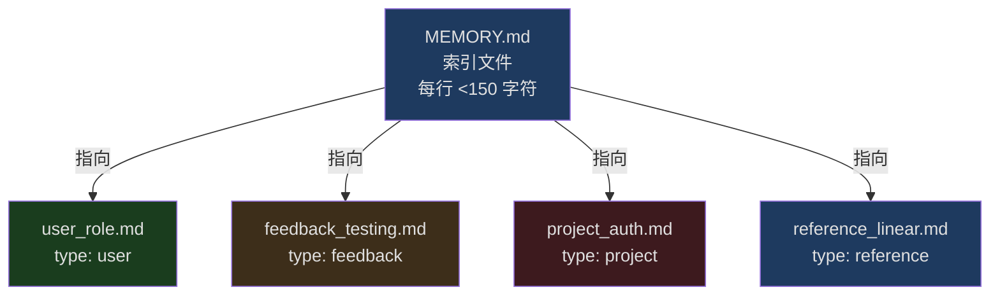
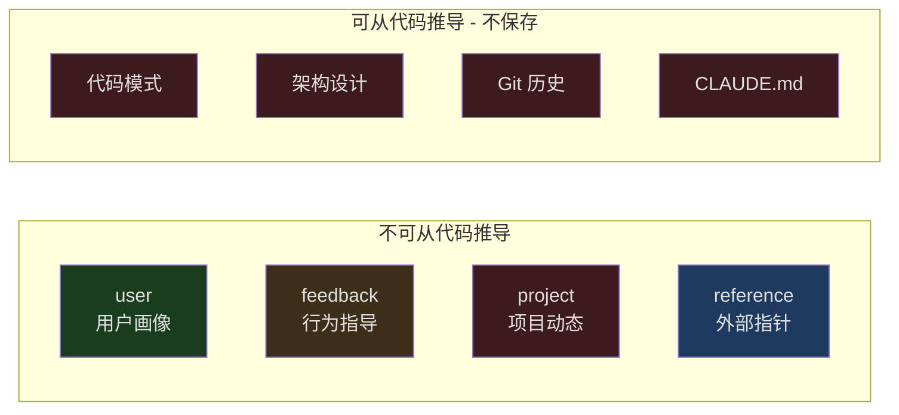
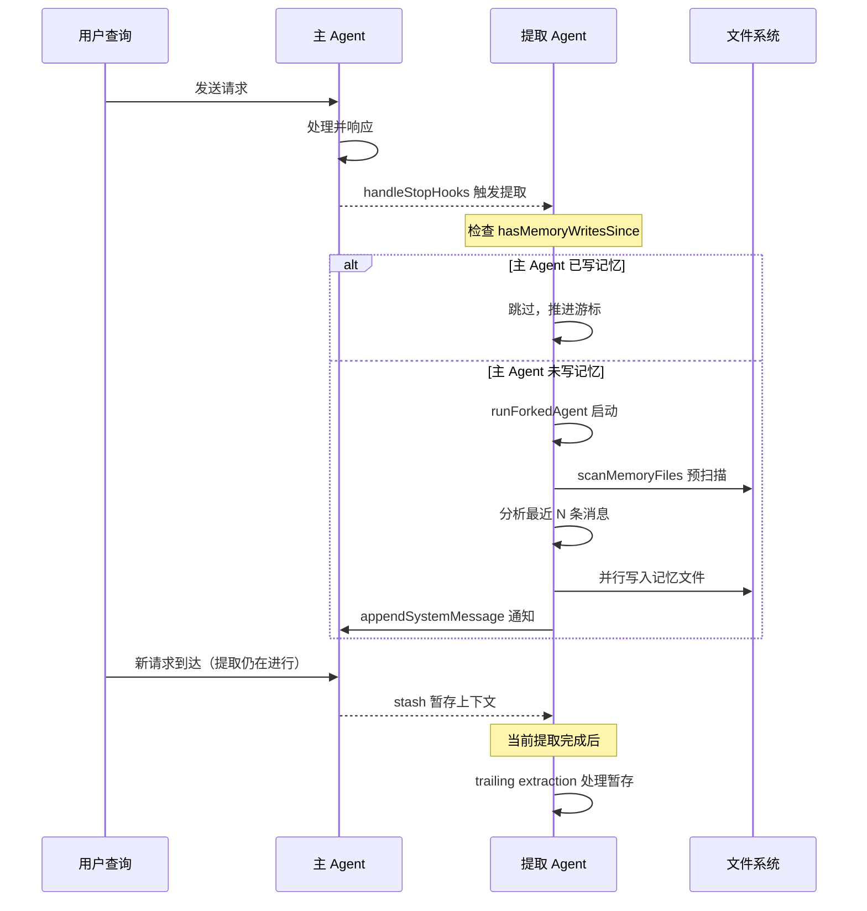
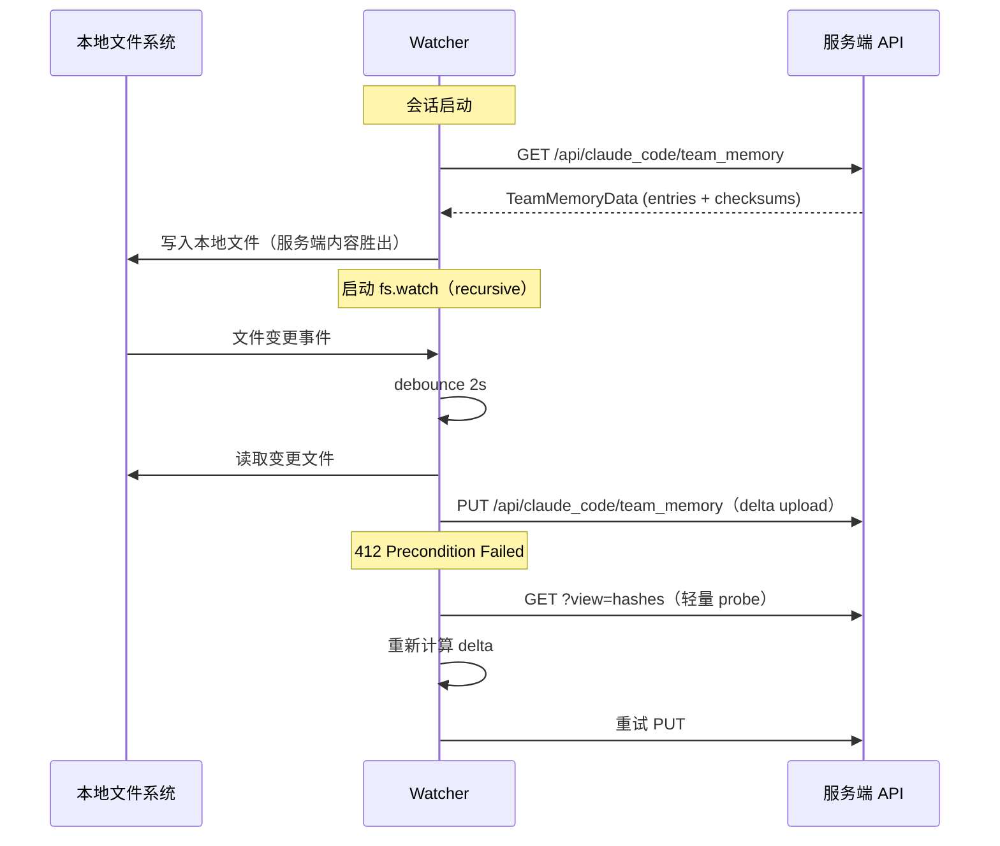
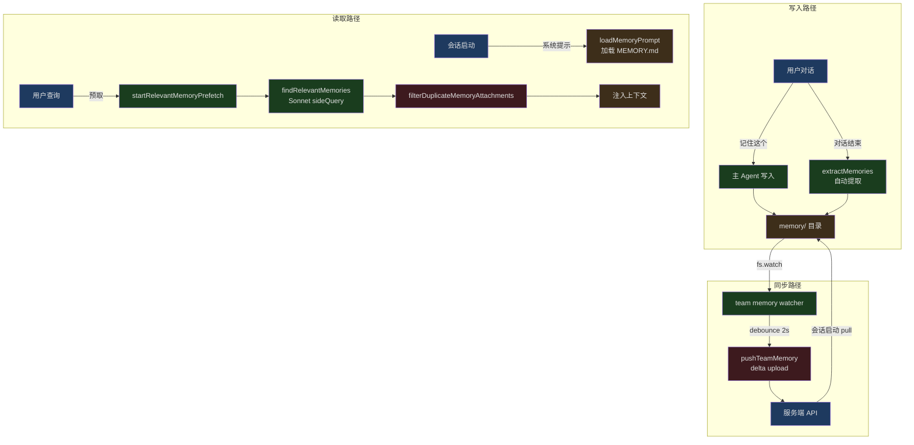

## 问题引入

你每次开新对话，AI 都从零开始。它不知道你是谁、你的项目用什么技术栈、上次你纠正了它哪些行为。你得反复告诉它"别在测试里用 mock"、"我是后端工程师，别给我讲 CSS 入门"、"PR 请发到 develop 分支"。这不是对话，而是每次重新培训一个失忆的助手。

Claude Code 的记忆系统（内部代号 `memdir`，即 memory directory）从根本上解决了这个问题。它在文件系统中维护一套结构化的持久化记忆，让 AI 在每次新会话启动时都能加载你的偏好、项目上下文和历史反馈。更进一步，它还能在对话过程中**自动提取**值得记住的内容，不需要你手动执行"请记住这个"。

这篇文章将深入 `src/memdir/` 和 `src/services/extractMemories/` 的源码，逐层拆解这个系统的设计与实现。

## memdir 文件系统设计：两级结构

Claude Code 的记忆不是存在数据库里的，也不是序列化到某个 JSON blob 里。它采用了一种**文件系统即数据库**的设计——每条记忆是一个独立的 Markdown 文件，由一个索引文件 `MEMORY.md` 串联起来。

### 目录布局

```
~/.claude/projects/<sanitized-project-root>/memory/
  MEMORY.md                    # 索引文件，每行一条指针
  user_role.md                 # 独立记忆文件
  feedback_testing.md           # 独立记忆文件
  project_auth_rewrite.md      # 独立记忆文件
  reference_linear_project.md  # 独立记忆文件
  team/                        # 团队共享记忆（feature flag 控制）
    MEMORY.md
    feedback_no_mocks.md
    project_merge_freeze.md
```

这个路径是由 `src/memdir/paths.ts` 中的 `getAutoMemPath()` 计算的：

```typescript
// src/memdir/paths.ts, 第 223-235 行
export const getAutoMemPath = memoize(
  (): string => {
    const override = getAutoMemPathOverride() ?? getAutoMemPathSetting()
    if (override) {
      return override
    }
    const projectsDir = join(getMemoryBaseDir(), 'projects')
    return (
      join(projectsDir, sanitizePath(getAutoMemBase()), AUTO_MEM_DIRNAME) + sep
    ).normalize('NFC')
  },
  () => getProjectRoot(),
)
```

路径计算的优先级链很清晰：

1. `CLAUDE_COWORK_MEMORY_PATH_OVERRIDE` 环境变量——Cowork 场景下的全路径覆盖
2. `settings.json` 中的 `autoMemoryDirectory`——用户级配置（支持 `~/` 展开）
3. 默认路径 `~/.claude/projects/<sanitized-git-root>/memory/`

注意这里用了 `findCanonicalGitRoot` 来确保同一仓库的所有 worktree 共享同一个记忆目录——这是一个细节但重要的设计决策。

### MEMORY.md：索引而非内容

`MEMORY.md` 是一个纯文本索引文件，每行是一条指向具体记忆文件的链接。它的格式要求很严格：

```markdown
- [用户角色](user_role.md) — 后端工程师，精通 Go，React 新手
- [测试策略反馈](feedback_testing.md) — 不要在集成测试中用 mock
- [Auth 重写项目](project_auth_rewrite.md) — 合规驱动，非技术债
- [Linear 项目跟踪](reference_linear_project.md) — pipeline bugs 在 INGEST 项目
```

每行不超过 ~150 字符，只放标题和一行钩子描述。**绝不在 `MEMORY.md` 中直接写记忆内容**——内容放在独立文件中。

这种两级结构的设计动机很实际：`MEMORY.md` 在每次会话启动时被**完整加载到上下文中**，所以它必须保持精简。如果把所有记忆内容都塞进来，很快就会撑爆上下文窗口。



### MEMORY.md 的约束：200 行 / 25KB

索引文件不是可以无限增长的。`src/memdir/memdir.ts` 中定义了两道硬约束：

```typescript
// src/memdir/memdir.ts, 第 34-38 行
export const ENTRYPOINT_NAME = 'MEMORY.md'
export const MAX_ENTRYPOINT_LINES = 200
// ~125 chars/line at 200 lines. At p97 today; catches long-line indexes that
// slip past the line cap (p100 observed: 197KB under 200 lines).
export const MAX_ENTRYPOINT_BYTES = 25_000
```

200 行是行数上限，25KB 是字节上限。两者是独立的约束——即使行数不到 200，如果某些行特别长导致总字节超过 25KB，也会触发截断。这个字节上限的注释特别说明了原因：有人写了不到 200 行但总共 197KB 的索引文件，因为每行都超长。

截断逻辑由 `truncateEntrypointContent()` 实现：

```typescript
// src/memdir/memdir.ts, 第 57-103 行
export function truncateEntrypointContent(raw: string): EntrypointTruncation {
  const trimmed = raw.trim()
  const contentLines = trimmed.split('\n')
  const lineCount = contentLines.length
  const byteCount = trimmed.length

  const wasLineTruncated = lineCount > MAX_ENTRYPOINT_LINES
  const wasByteTruncated = byteCount > MAX_ENTRYPOINT_BYTES

  if (!wasLineTruncated && !wasByteTruncated) {
    return {
      content: trimmed,
      lineCount,
      byteCount,
      wasLineTruncated,
      wasByteTruncated,
    }
  }

  let truncated = wasLineTruncated
    ? contentLines.slice(0, MAX_ENTRYPOINT_LINES).join('\n')
    : trimmed

  if (truncated.length > MAX_ENTRYPOINT_BYTES) {
    const cutAt = truncated.lastIndexOf('\n', MAX_ENTRYPOINT_BYTES)
    truncated = truncated.slice(0, cutAt > 0 ? cutAt : MAX_ENTRYPOINT_BYTES)
  }

  // ...构造 WARNING 消息
  return {
    content:
      truncated +
      `\n\n> WARNING: ${ENTRYPOINT_NAME} is ${reason}. Only part of it was loaded...`,
    // ...
  }
}
```

截断策略有讲究：先按行截断（自然边界），然后如果字节仍然超限，找到上限之前的最后一个换行符截断，**避免切断一行的中间**。截断后还会在末尾追加一条 WARNING，告诉模型索引被截断了、应该保持精简。

## 四种记忆类型

记忆不是一堆无差别的文本。Claude Code 定义了一个封闭的四类型分类法（closed four-type taxonomy），每种类型有明确的保存时机、使用方式和内容结构：

```typescript
// src/memdir/memoryTypes.ts, 第 14-19 行
export const MEMORY_TYPES = [
  'user',
  'feedback',
  'project',
  'reference',
] as const

export type MemoryType = (typeof MEMORY_TYPES)[number]
```

### user：关于用户的认知

记录用户的角色、目标、职责和知识背景。核心目的是让 AI 能根据用户画像调整行为——对资深后端工程师和编程新手的协作方式应该截然不同。

**保存时机**：当你了解到用户的角色、偏好、职责或知识领域时。

**使用场景**：当工作需要根据用户画像来调整时。比如用户问你解释某段代码，你应该根据他们的背景知识来选择解释的深度和角度。

**示例**：
```
用户: 我写了十年 Go，但这是我第一次碰这个仓库的 React 代码
AI: [保存 user 记忆：深厚 Go 经验，React 新手——用后端类比来解释前端概念]
```

### feedback：行为指导

记录用户对 AI 工作方式的反馈——**包括纠正和肯定**。这一点特别重要：如果只记录纠正，AI 会越来越保守，不敢重复那些用户其实已经认可的做法。

**保存时机**：用户纠正你的做法（"别那样做"），或确认一个非显而易见的做法可行（"就是这样，继续"）。

**内容结构**：先写规则本身，然后写 **Why:** 行（用户给出的原因），再写 **How to apply:** 行（这条规则在什么场景生效）。知道"为什么"才能在边缘情况下做出正确判断。

**示例**：
```
用户: 别在这些测试里 mock 数据库——上季度 mock 测试全过了，结果生产环境的迁移挂了
AI: [保存 feedback 记忆：集成测试必须用真实数据库。Why: mock/prod 差异导致迁移故障。How to apply: 所有涉及数据库的测试文件]
```

### project：项目动态

记录关于正在进行的工作、目标、Bug、事故的信息——这些是**无法从代码或 git 历史推导出来的**。

**保存时机**：了解到谁在做什么、为什么、截止日期是什么。注意要将相对日期转为绝对日期（"下周四" -> "2026-04-02"），让记忆在时间流逝后仍可理解。

**示例**：
```
用户: 周四之后冻结所有非关键合并——移动团队要切 release 分支
AI: [保存 project 记忆：2026-04-02 开始合并冻结。Why: 移动端 release 切分支]
```

### reference：外部资源指针

存储指向外部系统中信息位置的指针——让 AI 知道去哪里找最新信息。

**示例**：
```
用户: pipeline 的 bug 都在 Linear 的 "INGEST" 项目里跟踪
AI: [保存 reference 记忆：pipeline bugs 在 Linear 项目 "INGEST" 中]
```

### 类型解析

类型信息通过解析器函数进行校验，优雅地处理遗留文件和未知类型：

```typescript
// src/memdir/memoryTypes.ts, 第 28-31 行
export function parseMemoryType(raw: unknown): MemoryType | undefined {
  if (typeof raw !== 'string') return undefined
  return MEMORY_TYPES.find(t => t === raw)
}
```

无效或缺失的类型返回 `undefined`——旧文件不会炸，新文件带错误类型也只是优雅降级。



### 什么不该保存

代码模式、项目结构、架构设计、git 历史、调试方案、CLAUDE.md 中已有的内容、临时任务状态——这些都属于"可从当前项目状态推导"的信息，不应存为记忆。即使用户明确要求保存 PR 列表或活动摘要，也应该追问"这里面有什么**出乎意料**或**非显而易见**的部分？"——只有那部分值得保存。

## Frontmatter 元数据格式

每个独立记忆文件都使用标准的 YAML frontmatter：

```markdown
---
name: {{记忆名称}}
description: {{一行描述——用于在未来对话中判断相关性，所以要具体}}
type: {{user, feedback, project, reference}}
---

{{记忆内容——feedback/project 类型建议结构化为：规则/事实 + **Why:** + **How to apply:**}}
```

`description` 字段特别关键——它不仅是给人看的说明，更是记忆检索系统（`findRelevantMemories`）用来判断一条记忆是否与当前查询相关的核心依据。一个好的 description 应该具体到足以区分上下文，比如"测试中不要用数据库 mock——合规性迁移失败教训"而不是"测试相关反馈"。

frontmatter 的格式示例定义在 `memoryTypes.ts` 中：

```typescript
// src/memdir/memoryTypes.ts, 第 261-271 行
export const MEMORY_FRONTMATTER_EXAMPLE: readonly string[] = [
  '```markdown',
  '---',
  'name: {{memory name}}',
  'description: {{one-line description — used to decide relevance...}}',
  `type: {{${MEMORY_TYPES.join(', ')}}}`,
  '---',
  '',
  '{{memory content — for feedback/project types, structure as: ...}}',
  '```',
]
```

## 记忆扫描与目录管理

### memoryScan：扫描记忆文件

`src/memdir/memoryScan.ts` 提供了目录扫描原语，被检索和提取两个路径共享：

```typescript
// src/memdir/memoryScan.ts, 第 13-19 行
export type MemoryHeader = {
  filename: string
  filePath: string
  mtimeMs: number
  description: string | null
  type: MemoryType | undefined
}
```

`scanMemoryFiles()` 递归扫描目录中的所有 `.md` 文件（排除 `MEMORY.md`），读取每个文件的前 30 行 frontmatter，然后按修改时间倒序排列，最多返回 200 条：

```typescript
// src/memdir/memoryScan.ts, 第 35-77 行
export async function scanMemoryFiles(
  memoryDir: string,
  signal: AbortSignal,
): Promise<MemoryHeader[]> {
  try {
    const entries = await readdir(memoryDir, { recursive: true })
    const mdFiles = entries.filter(
      f => f.endsWith('.md') && basename(f) !== 'MEMORY.md',
    )

    const headerResults = await Promise.allSettled(
      mdFiles.map(async (relativePath): Promise<MemoryHeader> => {
        const filePath = join(memoryDir, relativePath)
        const { content, mtimeMs } = await readFileInRange(
          filePath, 0, FRONTMATTER_MAX_LINES, undefined, signal,
        )
        const { frontmatter } = parseFrontmatter(content, filePath)
        return {
          filename: relativePath,
          filePath,
          mtimeMs,
          description: frontmatter.description || null,
          type: parseMemoryType(frontmatter.type),
        }
      }),
    )

    return headerResults
      .filter((r): r is PromiseFulfilledResult<MemoryHeader> =>
        r.status === 'fulfilled')
      .map(r => r.value)
      .sort((a, b) => b.mtimeMs - a.mtimeMs)
      .slice(0, MAX_MEMORY_FILES)
  } catch {
    return []
  }
}
```

设计亮点：使用 `readFileInRange` 只读每个文件的前 30 行而非整个文件，并且 `readFileInRange` 内部会返回 `mtimeMs`，省掉了额外的 `stat` 调用——在常见情况下（N <= 200），这把系统调用数量减半。

扫描结果还可以被格式化为文本清单（manifest），供检索和提取的 prompt 使用：

```typescript
// src/memdir/memoryScan.ts, 第 84-94 行
export function formatMemoryManifest(memories: MemoryHeader[]): string {
  return memories
    .map(m => {
      const tag = m.type ? `[${m.type}] ` : ''
      const ts = new Date(m.mtimeMs).toISOString()
      return m.description
        ? `- ${tag}${m.filename} (${ts}): ${m.description}`
        : `- ${tag}${m.filename} (${ts})`
    })
    .join('\n')
}
```

### ensureMemoryDirExists：目录保证

每次会话只调用一次（通过 `systemPromptSection` 缓存），保证记忆目录存在，这样模型写文件时不需要先 `mkdir` 或检查目录是否存在：

```typescript
// src/memdir/memdir.ts, 第 129-147 行
export async function ensureMemoryDirExists(memoryDir: string): Promise<void> {
  const fs = getFsImplementation()
  try {
    await fs.mkdir(memoryDir)
  } catch (e) {
    const code =
      e instanceof Error && 'code' in e && typeof e.code === 'string'
        ? e.code
        : undefined
    logForDebugging(
      `ensureMemoryDirExists failed for ${memoryDir}: ${code ?? String(e)}`,
      { level: 'debug' },
    )
  }
}
```

prompt 中甚至显式告诉模型"目录已经存在——直接用 Write 工具写入，不要跑 mkdir 或检查存在性"：

```typescript
// src/memdir/memdir.ts, 第 116-119 行
export const DIR_EXISTS_GUIDANCE =
  'This directory already exists — write to it directly with the Write tool ' +
  '(do not run mkdir or check for its existence).'
```

这个注释解释了为什么要这么做："Claude 之前会在写文件之前先花几个 turn 跑 `ls` 和 `mkdir -p`。"

## 自动记忆提取：extractMemories

这是记忆系统中最精妙的部分。Claude Code 不需要你手动说"记住这个"——它有一个后台 agent 在每次对话结束时自动分析对话内容，提取值得持久化的记忆。

### 触发时机

提取 agent 在每次完整的查询循环结束时运行（模型产出最终回复、没有更多工具调用时），通过 `handleStopHooks` 触发：

```typescript
// src/services/extractMemories/extractMemories.ts, 第 598-603 行
export async function executeExtractMemories(
  context: REPLHookContext,
  appendSystemMessage?: AppendSystemMessageFn,
): Promise<void> {
  await extractor?.(context, appendSystemMessage)
}
```

### 与主 Agent 的互斥

一个关键的设计是提取 agent 和主 agent 的**互斥关系**：如果主 agent 在对话中已经写了记忆文件，提取 agent 就跳过这段范围，只推进游标：

```typescript
// src/services/extractMemories/extractMemories.ts, 第 121-148 行
function hasMemoryWritesSince(
  messages: Message[],
  sinceUuid: string | undefined,
): boolean {
  let foundStart = sinceUuid === undefined
  for (const message of messages) {
    if (!foundStart) {
      if (message.uuid === sinceUuid) {
        foundStart = true
      }
      continue
    }
    if (message.type !== 'assistant') {
      continue
    }
    const content = (message as AssistantMessage).message.content
    if (!Array.isArray(content)) {
      continue
    }
    for (const block of content) {
      const filePath = getWrittenFilePath(block)
      if (filePath !== undefined && isAutoMemPath(filePath)) {
        return true
      }
    }
  }
  return false
}
```

这个互斥避免了重复写入——主 agent 写了的记忆，后台 agent 不会再写一遍。

### Forked Agent 模式

提取 agent 使用 `runForkedAgent` 运行——这是主对话的一个"完美分叉"，共享父级的 prompt cache。这意味着提取 agent 不需要重新发送整个对话历史，大幅节省 token 成本：

```typescript
// src/services/extractMemories/extractMemories.ts, 第 415-427 行
const result = await runForkedAgent({
  promptMessages: [createUserMessage({ content: userPrompt })],
  cacheSafeParams,
  canUseTool,
  querySource: 'extract_memories',
  forkLabel: 'extract_memories',
  skipTranscript: true,
  maxTurns: 5,
})
```

注意 `maxTurns: 5` 的硬限制——防止提取 agent 陷入"验证兔子洞"（比如去读源码确认某个模式是否真的存在）。

### 工具权限沙箱

提取 agent 有严格的工具权限限制，由 `createAutoMemCanUseTool` 定义：

- **允许**：`FileRead`、`Grep`、`Glob`（只读）
- **允许**：只读的 `Bash` 命令（ls、find、cat、stat 等）
- **允许**：`FileEdit`、`FileWrite`——但仅限记忆目录内的路径
- **拒绝**：所有其他工具（MCP、Agent、写入类 Bash 等）

```typescript
// src/services/extractMemories/extractMemories.ts, 第 171-222 行
export function createAutoMemCanUseTool(memoryDir: string): CanUseToolFn {
  return async (tool: Tool, input: Record<string, unknown>) => {
    // 允许 Read/Grep/Glob
    if (tool.name === FILE_READ_TOOL_NAME ||
        tool.name === GREP_TOOL_NAME ||
        tool.name === GLOB_TOOL_NAME) {
      return { behavior: 'allow' as const, updatedInput: input }
    }

    // Bash 只允许只读命令
    if (tool.name === BASH_TOOL_NAME) {
      const parsed = tool.inputSchema.safeParse(input)
      if (parsed.success && tool.isReadOnly(parsed.data)) {
        return { behavior: 'allow' as const, updatedInput: input }
      }
      return denyAutoMemTool(tool, 'Only read-only shell commands...')
    }

    // Write/Edit 只允许记忆目录内的路径
    if ((tool.name === FILE_EDIT_TOOL_NAME ||
         tool.name === FILE_WRITE_TOOL_NAME) &&
        'file_path' in input) {
      const filePath = input.file_path
      if (typeof filePath === 'string' && isAutoMemPath(filePath)) {
        return { behavior: 'allow' as const, updatedInput: input }
      }
    }

    return denyAutoMemTool(tool, `only ... are allowed`)
  }
}
```

### 提取 Prompt 的设计

提取 agent 收到的 prompt 由 `src/services/extractMemories/prompts.ts` 构建。它包含了完整的类型分类法、保存规则和一个关键优化——**预注入现有记忆清单**：

```typescript
// src/services/extractMemories/prompts.ts, 第 29-44 行
function opener(newMessageCount: number, existingMemories: string): string {
  const manifest =
    existingMemories.length > 0
      ? `\n\n## Existing memory files\n\n${existingMemories}\n\n` +
        `Check this list before writing — update an existing file ` +
        `rather than creating a duplicate.`
      : ''
  return [
    `You are now acting as the memory extraction subagent. ` +
    `Analyze the most recent ~${newMessageCount} messages above...`,
    '',
    `Available tools: FileRead, Grep, Glob, read-only Bash, ` +
    `and FileEdit/FileWrite for paths inside the memory directory only.`,
    '',
    `You have a limited turn budget. FileEdit requires a prior FileRead, ` +
    `so the efficient strategy is: turn 1 — issue all FileRead calls in ` +
    `parallel; turn 2 — issue all FileWrite/FileEdit calls in parallel.`,
    // ...
  ].join('\n')
}
```

提取 prompt 还有一条严格约束："你**只能**使用最近 ~N 条消息的内容来更新记忆。不要花 turn 去调查或验证这些内容——不要 grep 源码、不要读代码确认模式、不要跑 git 命令。"

### 并发控制与消息合并

提取系统有精巧的并发控制。当一次提取正在进行时，新到的请求会被暂存（stash），等当前提取完成后执行一次"trailing extraction"：



### 提取频率节流

提取不是每个 turn 都跑的——通过 feature flag `tengu_bramble_lintel` 控制间隔（默认每 1 个 eligible turn）：

```typescript
// src/services/extractMemories/extractMemories.ts, 第 377-385 行
if (!isTrailingRun) {
  turnsSinceLastExtraction++
  if (
    turnsSinceLastExtraction <
    (getFeatureValue_CACHED_MAY_BE_STALE('tengu_bramble_lintel', null) ?? 1)
  ) {
    return
  }
}
turnsSinceLastExtraction = 0
```

## 记忆注入时机

记忆被加载到对话上下文中有两个路径：

### 路径一：系统提示注入（MEMORY.md 索引）

`loadMemoryPrompt()` 在系统提示构建时调用，将 `MEMORY.md` 的内容（经过截断处理）注入到系统提示中。这是每次会话启动时的第一道记忆加载：

```typescript
// src/memdir/memdir.ts, 第 419-507 行
export async function loadMemoryPrompt(): Promise<string | null> {
  const autoEnabled = isAutoMemoryEnabled()

  // KAIROS 日志模式优先
  if (feature('KAIROS') && autoEnabled && getKairosActive()) {
    return buildAssistantDailyLogPrompt(skipIndex)
  }

  // TEAMMEM 模式：同时加载私有和团队记忆
  if (feature('TEAMMEM')) {
    if (teamMemPaths!.isTeamMemoryEnabled()) {
      const autoDir = getAutoMemPath()
      const teamDir = teamMemPaths!.getTeamMemPath()
      await ensureMemoryDirExists(teamDir)
      return teamMemPrompts!.buildCombinedMemoryPrompt(extraGuidelines, skipIndex)
    }
  }

  // 标准模式：只加载个人记忆
  if (autoEnabled) {
    const autoDir = getAutoMemPath()
    await ensureMemoryDirExists(autoDir)
    return buildMemoryLines('auto memory', autoDir, extraGuidelines, skipIndex)
      .join('\n')
  }

  return null
}
```

### 路径二：相关记忆预取（独立记忆文件）

`MEMORY.md` 索引总是被加载，但独立记忆文件的内容不会全部加载——那样会浪费上下文。相反，系统会根据用户的当前查询**选择性地预取**最相关的记忆。

这个过程由 `startRelevantMemoryPrefetch()` 驱动：

```typescript
// src/utils/attachments.ts, 第 2361-2424 行
export function startRelevantMemoryPrefetch(
  messages: ReadonlyArray<Message>,
  toolUseContext: ToolUseContext,
): MemoryPrefetch | undefined {
  if (!isAutoMemoryEnabled() || !getFeatureValue_CACHED_MAY_BE_STALE(...)) {
    return undefined
  }

  const lastUserMessage = messages.findLast(m => m.type === 'user' && !m.isMeta)
  if (!lastUserMessage) {
    return undefined
  }

  const input = getUserMessageText(lastUserMessage)
  // 单词查询缺乏足够上下文
  if (!input || !/\s/.test(input.trim())) {
    return undefined
  }

  const surfaced = collectSurfacedMemories(messages)
  if (surfaced.totalBytes >= RELEVANT_MEMORIES_CONFIG.MAX_SESSION_BYTES) {
    return undefined
  }

  // 异步预取，不阻塞主查询
  const promise = getRelevantMemoryAttachments(
    input,
    toolUseContext.options.agentDefinitions.activeAgents,
    toolUseContext.readFileState,
    collectRecentSuccessfulTools(messages, lastUserMessage),
    controller.signal,
    surfaced.paths,
  )
  // ...
}
```

预取的关键设计：

1. **非阻塞**：预取是异步的，不阻塞主查询循环
2. **可中断**：链接到 turn 级别的 AbortController，用户按 Escape 可以立即取消
3. **Disposable 模式**：使用 `using` 关键字绑定，在 query loop 的所有退出路径（return、throw、.return()）上自动清理
4. **会话级字节上限**：防止在长会话中无限注入记忆

### findRelevantMemories：AI 驱动的记忆检索

记忆文件的选择不是靠关键词匹配——它用一个 Sonnet 模型做 sideQuery 来判断哪些记忆与当前查询最相关：

```typescript
// src/memdir/findRelevantMemories.ts, 第 39-75 行
export async function findRelevantMemories(
  query: string,
  memoryDir: string,
  signal: AbortSignal,
  recentTools: readonly string[] = [],
  alreadySurfaced: ReadonlySet<string> = new Set(),
): Promise<RelevantMemory[]> {
  const memories = (await scanMemoryFiles(memoryDir, signal)).filter(
    m => !alreadySurfaced.has(m.filePath),
  )
  if (memories.length === 0) {
    return []
  }

  const selectedFilenames = await selectRelevantMemories(
    query, memories, signal, recentTools,
  )
  // ...
  return selected.map(m => ({ path: m.filePath, mtimeMs: m.mtimeMs }))
}
```

选择器的 system prompt 很精确：

```typescript
// src/memdir/findRelevantMemories.ts, 第 18-24 行
const SELECT_MEMORIES_SYSTEM_PROMPT = `You are selecting memories that will be
useful to Claude Code as it processes a user's query. You will be given the
user's query and a list of available memory files with their filenames and
descriptions.

Return a list of filenames for the memories that will clearly be useful
(up to 5). Only include memories that you are certain will be helpful...`
```

选择器还接收"最近成功使用的工具"列表，**排除已在使用的工具的参考文档**（因为那是噪声），但保留关于那些工具的警告和已知问题（因为在使用中正好需要）。

## 记忆去重

记忆注入时有一个去重环节——避免模型读过的记忆被重复注入。这由 `filterDuplicateMemoryAttachments()` 实现：

```typescript
// src/utils/attachments.ts, 第 2520-2541 行
export function filterDuplicateMemoryAttachments(
  attachments: Attachment[],
  readFileState: FileStateCache,
): Attachment[] {
  return attachments
    .map(attachment => {
      if (attachment.type !== 'relevant_memories') return attachment
      const filtered = attachment.memories.filter(
        m => !readFileState.has(m.path),
      )
      for (const m of filtered) {
        readFileState.set(m.path, {
          content: m.content,
          timestamp: m.mtimeMs,
          offset: undefined,
          limit: m.limit,
        })
      }
      return filtered.length > 0 ? { ...attachment, memories: filtered } : null
    })
    .filter((a): a is Attachment => a !== null)
}
```

这里有一个源码注释中特别提到的微妙 bug 的修复：

> The mark-after-filter ordering is load-bearing: readMemoriesForSurfacing used to write to readFileState during the prefetch, which meant the filter saw every prefetch-selected path as "already in context" and dropped them all (self-referential filter).

之前的实现在预取阶段就写入了 `readFileState`，结果过滤器检查时发现所有预取的记忆都"已在上下文中"——自己过滤掉了自己。修复方法是把写入延迟到过滤之后。

## 记忆过期与更新策略

### 时间感知

`src/memdir/memoryAge.ts` 提供了人类可读的时间标注：

```typescript
// src/memdir/memoryAge.ts, 第 6-19 行
export function memoryAgeDays(mtimeMs: number): number {
  return Math.max(0, Math.floor((Date.now() - mtimeMs) / 86_400_000))
}

export function memoryAge(mtimeMs: number): string {
  const d = memoryAgeDays(mtimeMs)
  if (d === 0) return 'today'
  if (d === 1) return 'yesterday'
  return `${d} days ago`
}
```

为什么要把时间戳转成"47 天前"而不是 ISO 格式？因为模型在日期算术上表现很差——看到 `2026-02-12T08:33:00Z` 不会自动意识到"这是很久以前的"，但看到"47 days ago"会立即触发过时性推理。

### 过时警告注入

超过 1 天的记忆会被标注过时警告：

```typescript
// src/memdir/memoryAge.ts, 第 33-42 行
export function memoryFreshnessText(mtimeMs: number): string {
  const d = memoryAgeDays(mtimeMs)
  if (d <= 1) return ''
  return (
    `This memory is ${d} days old. ` +
    `Memories are point-in-time observations, not live state — ` +
    `claims about code behavior or file:line citations may be outdated. ` +
    `Verify against current code before asserting as fact.`
  )
}
```

这个警告的动机来自用户报告：过时的代码状态记忆（包含 file:line 引用）被当作事实断言，而引用让过时的声明看起来更权威而非更不可靠。

### 验证优先于断言

系统提示中的 `TRUSTING_RECALL_SECTION` 要求模型在基于记忆推荐之前先验证：

```typescript
// src/memdir/memoryTypes.ts, 第 240-256 行
export const TRUSTING_RECALL_SECTION: readonly string[] = [
  '## Before recommending from memory',
  '',
  'A memory that names a specific function, file, or flag is a claim that ' +
  'it existed *when the memory was written*. It may have been renamed, ' +
  'removed, or never merged. Before recommending it:',
  '',
  '- If the memory names a file path: check the file exists.',
  '- If the memory names a function or flag: grep for it.',
  '- If the user is about to act on your recommendation: verify first.',
  '',
  '"The memory says X exists" is not the same as "X exists now."',
]
```

注释中记录了 eval 验证结果：这段文字从"Trusting what you recall"改名为"Before recommending from memory"后，eval 从 0/3 提升到 3/3——**标题措辞影响了模型的行为触发**。

## 团队记忆同步

当启用 `TEAMMEM` feature flag 后，记忆系统扩展为双目录结构：

```
~/.claude/projects/<project>/memory/
  MEMORY.md              # 私有索引
  user_role.md           # 私有记忆
  feedback_terse.md      # 私有记忆
  team/                  # 团队共享
    MEMORY.md            # 团队索引
    feedback_no_mocks.md # 团队记忆
    project_freeze.md    # 团队记忆
```

### 团队路径

团队记忆目录是个人记忆目录的子目录：

```typescript
// src/memdir/teamMemPaths.ts, 第 84-86 行
export function getTeamMemPath(): string {
  return (join(getAutoMemPath(), 'team') + sep).normalize('NFC')
}
```

### 双目录 Prompt

启用团队记忆后，prompt 会包含两个目录的说明，每种记忆类型都标注了 `<scope>` 标签指导放置：

- `user` 类型：**总是私有**（你的个人画像不该共享）
- `feedback` 类型：**默认私有**，除非明显是项目级公约（如测试策略）
- `project` 类型：**偏向团队**
- `reference` 类型：**通常团队**

### 同步机制

`src/services/teamMemorySync/` 实现了完整的同步机制：



同步语义：

- **Pull（拉取）**：服务端内容按 key 覆盖本地文件（server wins）
- **Push（推送）**：只上传内容哈希与服务端不同的 key（delta upload）。服务端使用 upsert 语义——未在 PUT 中出现的 key 会被保留
- **删除不传播**：本地删除文件不会从服务端删除，下次 pull 会恢复

### 文件监控

watcher 使用 `fs.watch({ recursive: true })`：

```typescript
// src/services/teamMemorySync/watcher.ts, 第 167-228 行
async function startFileWatcher(teamDir: string): Promise<void> {
  // ...
  watcher = watch(
    teamDir,
    { persistent: true, recursive: true },
    (_eventType, filename) => {
      if (pushSuppressedReason !== null) {
        // 只有 unlink 能清除抑制
        void stat(join(teamDir, filename)).catch((err) => {
          if (err.code !== 'ENOENT') return
          pushSuppressedReason = null
          schedulePush()
        })
        return
      }
      schedulePush()
    },
  )
}
```

为什么不用 chokidar？注释解释了：chokidar 4+ 移除了 fsevents 支持，Bun 的 `fs.watch` fallback 用 kqueue——每个被监控的文件需要一个 fd。如果有 500+ 团队记忆文件，那就是 500+ 个永久占用的文件描述符。`recursive: true` 在 macOS 上用 FSEvents（O(1) fd），在 Linux 上用 inotify（O(子目录数)）。

### 安全防护

团队记忆涉及跨用户共享，安全至关重要。`teamMemPaths.ts` 实现了多层路径安全检查：

1. **路径注入防护**：`sanitizePathKey()` 检查 null 字节、URL 编码遍历（`%2e%2e%2f`）、Unicode 标准化攻击、反斜杠、绝对路径
2. **符号链接防护**：`realpathDeepestExisting()` 解析符号链接到真实路径，防止通过符号链接逃逸到团队目录之外
3. **悬挂符号链接检测**：用 `lstat` 区分"真正不存在"和"符号链接目标不存在"
4. **密钥扫描**：`scanForSecrets()` 使用 gitleaks 规则检测 API key、凭证等敏感数据，阻止推送

### 永久失败抑制

当推送因不可恢复的原因失败（没有 OAuth、404、413 等），watcher 会抑制后续重试，避免无限重试循环。曾经有一个案例：一个没有 OAuth 的设备在 2.5 天内产生了 167,000 次推送事件。

```typescript
// src/services/teamMemorySync/watcher.ts, 第 61-73 行
export function isPermanentFailure(r: TeamMemorySyncPushResult): boolean {
  if (r.errorType === 'no_oauth' || r.errorType === 'no_repo') return true
  if (
    r.httpStatus !== undefined &&
    r.httpStatus >= 400 &&
    r.httpStatus < 500 &&
    r.httpStatus !== 409 &&  // 409 是暂时冲突
    r.httpStatus !== 429     // 429 是限流
  ) {
    return true
  }
  return false
}
```

## 记忆系统的完整生命周期



## 可迁移模式

记忆系统的设计有一个隐含但重要的属性：**可迁移性**。

因为所有记忆都是标准 Markdown 文件，存储在文件系统的确定路径下，具有统一的 frontmatter 格式，所以：

1. **跨设备迁移**：复制 `~/.claude/projects/` 目录即可迁移所有记忆
2. **版本控制**：可以把记忆目录纳入 git 管理（虽然默认没有这么做）
3. **备份与恢复**：标准文件系统备份工具即可
4. **批量编辑**：任何文本编辑器都能直接修改记忆
5. **程序化操作**：脚本可以直接读写 frontmatter 格式的文件
6. **跨工具兼容**：其他工具可以读取和理解这个格式

没有私有数据库格式，没有加密的 blob，没有需要特定 API 才能访问的存储。这是一个刻意的设计选择——它牺牲了一些查询效率（相比 SQLite），换来了透明性和可操作性。

### 路径安全与可配置性

路径系统的可配置性也值得关注。`paths.ts` 中的 `validateMemoryPath()` 对路径做了严格的安全校验：

```typescript
// src/memdir/paths.ts, 第 109-150 行
function validateMemoryPath(
  raw: string | undefined,
  expandTilde: boolean,
): string | undefined {
  if (!raw) return undefined
  let candidate = raw
  if (expandTilde && (candidate.startsWith('~/') || candidate.startsWith('~\\'))) {
    const rest = candidate.slice(2)
    const restNorm = normalize(rest || '.')
    if (restNorm === '.' || restNorm === '..') {
      return undefined  // 拒绝展开为 $HOME 或其父目录
    }
    candidate = join(homedir(), rest)
  }
  const normalized = normalize(candidate).replace(/[/\\]+$/, '')
  if (
    !isAbsolute(normalized) ||
    normalized.length < 3 ||
    /^[A-Za-z]:$/.test(normalized) ||     // Windows 根盘符
    normalized.startsWith('\\\\') ||       // UNC 路径
    normalized.startsWith('//') ||
    normalized.includes('\0')              // null 字节
  ) {
    return undefined
  }
  return (normalized + sep).normalize('NFC')
}
```

安全注释特别说明：`projectSettings`（提交到仓库的 `.claude/settings.json`）被**刻意排除在外**——恶意仓库可能设置 `autoMemoryDirectory: "~/.ssh"` 来获取写入敏感目录的权限。只有 `policySettings`、`localSettings` 和 `userSettings` 这些受信任来源的配置才被接受。

## 特殊模式：KAIROS 助理日志

当启用 `feature('KAIROS')` 且在助理模式下运行时，记忆系统切换为日志模式。助理会话实际上是持续运行的，所以 agent 不维护 `MEMORY.md` 索引，而是以追加方式写入日期命名的日志文件：

```
~/.claude/projects/<project>/memory/logs/2026/03/2026-03-31.md
```

每条日志是一个带时间戳的简短要点。`MEMORY.md` 索引由独立的 `/dream` 技能在夜间从日志中蒸馏生成。

这种模式的设计动机是：在持续运行的会话中，实时维护索引的成本太高，而且日志天然按时间排列，不需要索引来组织。蒸馏过程可以在低负载时运行，做更深层的整理。

## 禁用记忆

记忆系统可以通过多个层级禁用：

```typescript
// src/memdir/paths.ts, 第 30-55 行
export function isAutoMemoryEnabled(): boolean {
  const envVal = process.env.CLAUDE_CODE_DISABLE_AUTO_MEMORY
  if (isEnvTruthy(envVal)) return false         // 环境变量禁用
  if (isEnvDefinedFalsy(envVal)) return true     // 环境变量显式启用
  if (isEnvTruthy(process.env.CLAUDE_CODE_SIMPLE)) return false  // --bare 模式
  if (isEnvTruthy(process.env.CLAUDE_CODE_REMOTE) &&
      !process.env.CLAUDE_CODE_REMOTE_MEMORY_DIR) return false   // 远程无存储
  const settings = getInitialSettings()
  if (settings.autoMemoryEnabled !== undefined) {
    return settings.autoMemoryEnabled
  }
  return true  // 默认启用
}
```

优先级链：环境变量 > `--bare` 模式 > 远程模式检测 > settings.json > 默认启用。

## 设计启示

Claude Code 的记忆系统有几个值得深入思考的设计决策：

**文件系统即数据库**。没有用 SQLite、LevelDB 或任何嵌入式数据库，直接用文件系统。这看起来"原始"，但它带来了可调试性（直接 `cat` 查看）、可迁移性（直接复制目录）和可操作性（任何编辑器都能改）。对于一个记忆条目通常不超过 200 个、每个文件不超过几 KB 的系统，文件系统的性能完全够用。

**封闭类型分类法**。只有四种类型，而且每种都有明确的"什么该存、什么不该存"的指导。这避免了模型把所有东西都存成记忆的倾向——特别是"可以从代码推导的内容不该存为记忆"这条规则，有效防止了记忆膨胀。

**AI 驱动的检索**。记忆检索不是靠关键词匹配或向量搜索，而是直接让另一个 AI（Sonnet）看 frontmatter 描述来判断相关性。这在记忆数量较小（< 200）时非常有效——每个记忆的描述都是语义丰富的自然语言，AI 能做出比关键词匹配更准确的判断。

**Eval 驱动的 Prompt 迭代**。代码注释中多次引用 eval 结果来解释特定措辞的选择——比如 section 标题从"Trusting what you recall"改为"Before recommending from memory"就让 eval 从 0/3 提升到 3/3。这说明记忆系统的行为很大程度上是由 prompt 工程决定的，而 prompt 的措辞选择需要定量验证。

**互斥的写入路径**。主 agent 和提取 agent 的互斥设计避免了重复记忆，但也意味着如果主 agent 在对话中写了一条记忆，即使它遗漏了同一段对话中的其他值得记忆的内容，提取 agent 也不会补充——它会认为整个范围已经被处理过了。这是一个有意的 trade-off：在冗余和遗漏之间，选择了遗漏。

这套系统在实际使用中表现如何？从源码中散布的 telemetry 事件和 eval 引用来看，它经历了大量的实验和迭代。记忆不仅是一个工程问题，更是一个产品设计问题——什么该记、什么不该记、什么时候提醒、什么时候沉默，这些决策直接影响用户体验。Claude Code 的记忆系统给出了一个经过实战验证的答案。
