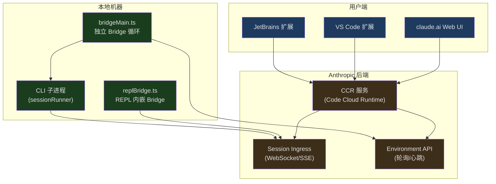
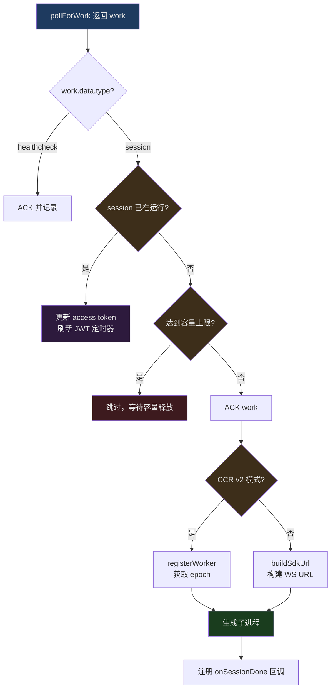
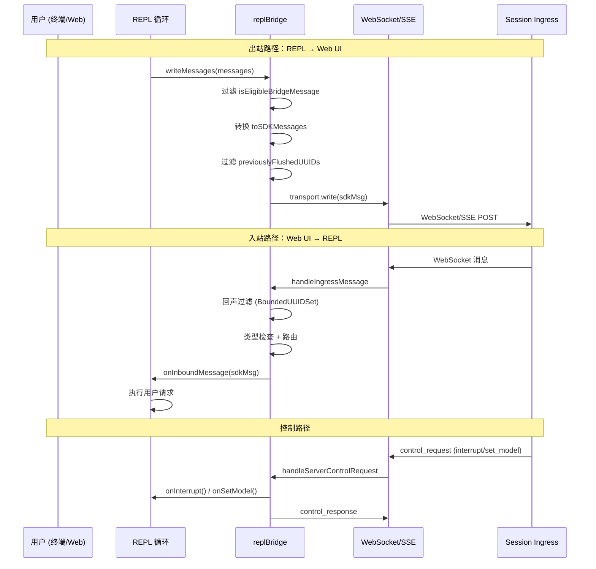

## 问题引入

Claude Code 既是独立的终端工具，又能嵌入 VS Code 和 JetBrains。一个进程如何同时服务于两种完全不同的交互界面？

当你在终端敲下 `claude` 命令时，一个 Node.js 进程启动，加载 REPL 循环，通过 stdin/stdout 与你交互。但当你在 VS Code 的侧边栏点击 Claude 图标，或者在 claude.ai 网页上打开一个 Remote Control 会话时，背后却是同一个 CLI 进程在响应。这意味着：

- 终端里运行的 Claude Code 需要与远程的 Web UI 实时同步消息
- Web UI 上的用户操作（发送提示、中断、切换模型）需要传递到本地 CLI 进程
- 权限请求需要跨进程、跨网络传递并等待响应
- 会话的 JWT 令牌需要自动刷新，避免长时间运行的任务因认证过期而中断
- 文件附件需要从 Web 端下载到本地，供 CLI 进程的工具使用

这一切的核心就是 **Bridge 系统**——一套完整的双向通信架构，将 CLI 进程作为"后端"，将 IDE 扩展或 Web UI 作为"前端"，通过轮询、WebSocket 和 SSE 实现实时交互。

## 整体架构概览

Bridge 系统的架构可以用一句话概括：**CLI 进程注册为一个 Environment，通过轮询获取 Work Item，通过 WebSocket/SSE 与 Session Ingress 双向通信**。



系统有两种运行模式：

1. **独立 Bridge 模式**（`bridgeMain.ts`）：`claude remote-control` 命令启动，作为常驻进程轮询服务器，为每个会话 fork 子进程。支持多会话并发、worktree 隔离。
2. **REPL 内嵌 Bridge 模式**（`replBridge.ts`）：在交互式 REPL 运行时自动连接，将当前会话暴露给 Web UI，实现"一边在终端写代码，一边在手机上监控"。

## bridgeMain.ts：独立 Bridge 的主循环

`bridgeMain.ts` 是独立 Bridge 模式的核心。`runBridgeLoop` 函数实现了一个完整的轮询-分派-管理循环，负责：环境注册、工作轮询、会话生成、心跳维持、错误恢复。

### BackoffConfig 与退避策略

在网络环境中，瞬时故障是常态。Bridge 系统定义了精细的退避配置：

```typescript
// src/bridge/bridgeMain.ts, 第 59-79 行
export type BackoffConfig = {
  connInitialMs: number
  connCapMs: number
  connGiveUpMs: number
  generalInitialMs: number
  generalCapMs: number
  generalGiveUpMs: number
  shutdownGraceMs?: number
  stopWorkBaseDelayMs?: number
}

const DEFAULT_BACKOFF: BackoffConfig = {
  connInitialMs: 2_000,
  connCapMs: 120_000,      // 2 分钟
  connGiveUpMs: 600_000,   // 10 分钟
  generalInitialMs: 500,
  generalCapMs: 30_000,
  generalGiveUpMs: 600_000, // 10 分钟
}
```

退避配置分为两类：**连接错误**（`conn*`）和**一般错误**（`general*`）。连接错误起始 2 秒，上限 2 分钟，10 分钟后放弃；一般错误更快开始（500ms），上限 30 秒。`shutdownGraceMs` 控制 SIGTERM 到 SIGKILL 的宽限期（默认 30 秒），确保子进程有时间清理。

### 主循环的核心结构

`runBridgeLoop` 函数签名本身就揭示了系统的依赖注入设计：

```typescript
// src/bridge/bridgeMain.ts, 第 141-152 行
export async function runBridgeLoop(
  config: BridgeConfig,
  environmentId: string,
  environmentSecret: string,
  api: BridgeApiClient,
  spawner: SessionSpawner,
  logger: BridgeLogger,
  signal: AbortSignal,
  backoffConfig: BackoffConfig = DEFAULT_BACKOFF,
  initialSessionId?: string,
  getAccessToken?: () => string | undefined | Promise<string | undefined>,
): Promise<void> {
```

函数内部维护了大量的状态 Map，这些数据结构共同构成了会话管理的核心：

```typescript
// src/bridge/bridgeMain.ts, 第 163-194 行
const activeSessions = new Map<string, SessionHandle>()
const sessionStartTimes = new Map<string, number>()
const sessionWorkIds = new Map<string, string>()
const sessionCompatIds = new Map<string, string>()
const sessionIngressTokens = new Map<string, string>()
const sessionTimers = new Map<string, ReturnType<typeof setTimeout>>()
const completedWorkIds = new Set<string>()
const sessionWorktrees = new Map<string, {
  worktreePath: string
  worktreeBranch?: string
  gitRoot?: string
  hookBased?: boolean
}>()
const timedOutSessions = new Set<string>()
const titledSessions = new Set<string>()
```

这里值得注意的是 `sessionCompatIds` 的存在。CCR v2 的基础设施层使用 `cse_*` 前缀的 ID，而 claude.ai 前端和兼容 API 使用 `session_*` 前缀。两者底层是相同的 UUID，但在不同的 API 端点需要不同的格式。`sessionCompatIds` 在 spawn 时计算一次并缓存，确保清理和状态更新始终使用一致的 key。

### 工作轮询与分派

主循环的核心是一个 `while (!loopSignal.aborted)` 循环，每次迭代都通过 `pollForWork` 查询是否有新的工作项：

```typescript
// src/bridge/bridgeMain.ts, 第 600-612 行
while (!loopSignal.aborted) {
  const pollConfig = getPollIntervalConfig()

  try {
    const work = await api.pollForWork(
      environmentId,
      environmentSecret,
      loopSignal,
      pollConfig.reclaim_older_than_ms,
    )
    // ... 处理工作结果
```

当收到会话类型的工作项时，系统需要做一系列决策：



对于已运行的会话，系统不会重复生成进程，而是将新的 access token 传递给现有子进程——这是 JWT 刷新的关键路径。服务器在 JWT 过期前重新分派工作项，携带新的 `session_ingress_token`，Bridge 通过 `existingHandle.updateAccessToken()` 将新令牌注入子进程。

### 心跳机制

心跳是维持工作租约的关键。`heartbeatActiveWorkItems` 函数遍历所有活跃会话，向服务器发送心跳：

```typescript
// src/bridge/bridgeMain.ts, 第 202-270 行
async function heartbeatActiveWorkItems(): Promise<
  'ok' | 'auth_failed' | 'fatal' | 'failed'
> {
  let anySuccess = false
  let anyFatal = false
  const authFailedSessions: string[] = []
  for (const [sessionId] of activeSessions) {
    const workId = sessionWorkIds.get(sessionId)
    const ingressToken = sessionIngressTokens.get(sessionId)
    if (!workId || !ingressToken) continue
    try {
      await api.heartbeatWork(environmentId, workId, ingressToken)
      anySuccess = true
    } catch (err) {
      // ... 错误分类处理
      if (err.status === 401 || err.status === 403) {
        authFailedSessions.push(sessionId)
      } else {
        anyFatal = true  // 404/410 = 环境过期
      }
    }
  }
  // JWT 过期 → 触发服务端重新分派
  for (const sessionId of authFailedSessions) {
    await api.reconnectSession(environmentId, sessionId)
  }
  // ...
}
```

心跳返回四种状态：`ok`（至少一个成功）、`auth_failed`（JWT 过期，已触发重连）、`fatal`（环境不存在）、`failed`（全部失败）。主循环根据心跳结果决定下一步：`auth_failed` 触发重新轮询以获取新令牌，`fatal` 可能导致环境重建。

### 容量管理与轮询节奏

Bridge 的轮询频率不是固定的，而是根据当前状态动态调整。`PollIntervalConfig` 定义了多个维度的间隔：

```typescript
// src/bridge/pollConfigDefaults.ts, 第 55-82 行
export const DEFAULT_POLL_CONFIG: PollIntervalConfig = {
  poll_interval_ms_not_at_capacity: 2000,       // 有空闲时：2 秒
  poll_interval_ms_at_capacity: 600_000,         // 满载时：10 分钟
  non_exclusive_heartbeat_interval_ms: 0,        // 心跳独立间隔（默认禁用）
  multisession_poll_interval_ms_not_at_capacity: 2000,
  multisession_poll_interval_ms_partial_capacity: 2000,
  multisession_poll_interval_ms_at_capacity: 600_000,
  reclaim_older_than_ms: 5000,                   // 回收超时未确认的工作
  session_keepalive_interval_v2_ms: 120_000,     // SSE keep-alive
}
```

这些配置通过 GrowthBook 实时下发，运维团队可以在不发版本的情况下调整全局轮询速率。代码中 `pollConfig.ts` 使用 Zod schema 严格校验配置值：

```typescript
// src/bridge/pollConfig.ts, 第 102-110 行
export function getPollIntervalConfig(): PollIntervalConfig {
  const raw = getFeatureValue_CACHED_WITH_REFRESH<unknown>(
    'tengu_bridge_poll_interval_config',
    DEFAULT_POLL_CONFIG,
    5 * 60 * 1000,  // 5 分钟刷新缓存
  )
  const parsed = pollIntervalConfigSchema().safeParse(raw)
  return parsed.success ? parsed.data : DEFAULT_POLL_CONFIG
}
```

当所有会话槽位都被占满时，Bridge 进入"满载心跳模式"：不再轮询新工作，只发送心跳维持租约。一旦某个会话结束释放槽位，容量唤醒机制立即打断休眠，让 Bridge 重新开始轮询：

```typescript
// src/bridge/bridgeMain.ts, 第 650-687 行
while (
  !loopSignal.aborted &&
  activeSessions.size >= config.maxSessions &&
  (pollDeadline === null || Date.now() < pollDeadline)
) {
  const hbConfig = getPollIntervalConfig()
  if (hbConfig.non_exclusive_heartbeat_interval_ms <= 0) break

  const cap = capacityWake.signal()
  hbResult = await heartbeatActiveWorkItems()
  if (hbResult === 'auth_failed' || hbResult === 'fatal') {
    cap.cleanup()
    break
  }
  hbCycles++
  await sleep(hbConfig.non_exclusive_heartbeat_interval_ms, cap.signal)
  cap.cleanup()
}
```

## 容量唤醒机制

容量唤醒（`capacityWake`）是一个精巧的信号合并原语，定义在 `capacityWake.ts`：

```typescript
// src/bridge/capacityWake.ts, 第 28-56 行
export function createCapacityWake(outerSignal: AbortSignal): CapacityWake {
  let wakeController = new AbortController()

  function wake(): void {
    wakeController.abort()
    wakeController = new AbortController()
  }

  function signal(): CapacitySignal {
    const merged = new AbortController()
    const abort = (): void => merged.abort()
    if (outerSignal.aborted || wakeController.signal.aborted) {
      merged.abort()
      return { signal: merged.signal, cleanup: () => {} }
    }
    outerSignal.addEventListener('abort', abort, { once: true })
    const capSig = wakeController.signal
    capSig.addEventListener('abort', abort, { once: true })
    return {
      signal: merged.signal,
      cleanup: () => {
        outerSignal.removeEventListener('abort', abort)
        capSig.removeEventListener('abort', abort)
      },
    }
  }

  return { signal, wake }
}
```

设计思路：每次进入"满载休眠"前，调用 `signal()` 获取一个合并信号。这个信号在三种情况下会触发：

1. 外层循环被 abort（进程关闭）
2. 容量控制器被 abort（`wake()` 被调用）
3. 休眠超时自然到期

当会话结束时，`onSessionDone` 回调调用 `capacityWake.wake()`，立即唤醒正在 `sleep(interval, cap.signal)` 中等待的主循环。`wake()` 不仅 abort 当前的控制器，还会创建新的控制器——这确保了下一轮循环可以再次休眠。`cleanup()` 函数移除事件监听器，防止 `AbortSignal` 对象上积累过多的监听器。

`replBridge.ts` 和 `bridgeMain.ts` 使用完全相同的 `createCapacityWake` 原语，消除了之前两份重复代码的维护负担。

## bridgeMessaging.ts：消息协议层

消息协议层是 Bridge 系统的"翻译官"，负责：类型判定、入站路由、回声消除、控制请求处理。

### 类型守卫与消息过滤

系统定义了严格的类型守卫来区分不同类型的消息：

```typescript
// src/bridge/bridgeMessaging.ts, 第 36-70 行
export function isSDKMessage(value: unknown): value is SDKMessage {
  return (
    value !== null &&
    typeof value === 'object' &&
    'type' in value &&
    typeof value.type === 'string'
  )
}

export function isSDKControlResponse(
  value: unknown,
): value is SDKControlResponse {
  return (
    value !== null &&
    typeof value === 'object' &&
    'type' in value &&
    value.type === 'control_response' &&
    'response' in value
  )
}

export function isSDKControlRequest(
  value: unknown,
): value is SDKControlRequest {
  return (
    value !== null &&
    typeof value === 'object' &&
    'type' in value &&
    value.type === 'control_request' &&
    'request_id' in value &&
    'request' in value
  )
}
```

不是所有 REPL 内部消息都应该发送到 Bridge。`isEligibleBridgeMessage` 做了精确过滤：

```typescript
// src/bridge/bridgeMessaging.ts, 第 77-88 行
export function isEligibleBridgeMessage(m: Message): boolean {
  if ((m.type === 'user' || m.type === 'assistant') && m.isVirtual) {
    return false
  }
  return (
    m.type === 'user' ||
    m.type === 'assistant' ||
    (m.type === 'system' && m.subtype === 'local_command')
  )
}
```

虚拟消息（REPL 内部调用产生的）不会发送——Bridge/SDK 消费者看到的是汇总后的 `tool_use/result`，而不是中间过程。

### 入站消息路由与回声消除

`handleIngressMessage` 是入站消息的总入口，实现了一个关键的回声消除机制：

```typescript
// src/bridge/bridgeMessaging.ts, 第 132-208 行
export function handleIngressMessage(
  data: string,
  recentPostedUUIDs: BoundedUUIDSet,
  recentInboundUUIDs: BoundedUUIDSet,
  onInboundMessage: ((msg: SDKMessage) => void | Promise<void>) | undefined,
  onPermissionResponse?: ((response: SDKControlResponse) => void) | undefined,
  onControlRequest?: ((request: SDKControlRequest) => void) | undefined,
): void {
  try {
    const parsed: unknown = normalizeControlMessageKeys(jsonParse(data))

    // control_response 不是 SDKMessage，需要先检查
    if (isSDKControlResponse(parsed)) {
      onPermissionResponse?.(parsed)
      return
    }

    if (isSDKControlRequest(parsed)) {
      onControlRequest?.(parsed)
      return
    }

    if (!isSDKMessage(parsed)) return

    const uuid = 'uuid' in parsed && typeof parsed.uuid === 'string'
      ? parsed.uuid : undefined

    // 回声过滤：忽略自己发出去又弹回来的消息
    if (uuid && recentPostedUUIDs.has(uuid)) return

    // 重复投递过滤：忽略已处理的入站消息
    if (uuid && recentInboundUUIDs.has(uuid)) return

    if (parsed.type === 'user') {
      if (uuid) recentInboundUUIDs.add(uuid)
      void onInboundMessage?.(parsed)
    }
  } catch (err) {
    // 解析失败静默忽略
  }
}
```

**为什么需要回声消除？** 因为 WebSocket 是双向的——CLI 发出的消息可能被服务器广播回来。没有回声消除，一条用户消息可能被 CLI 执行两次。系统使用两个独立的 `BoundedUUIDSet`：`recentPostedUUIDs` 过滤自己发出的消息，`recentInboundUUIDs` 过滤重复投递的入站消息。

### BoundedUUIDSet：环形缓冲区

回声消除的数据结构不是简单的 `Set<string>`，而是一个容量有限的环形缓冲区：

```typescript
// src/bridge/bridgeMessaging.ts, 第 429-461 行
export class BoundedUUIDSet {
  private readonly capacity: number
  private readonly ring: (string | undefined)[]
  private readonly set = new Set<string>()
  private writeIdx = 0

  constructor(capacity: number) {
    this.capacity = capacity
    this.ring = new Array<string | undefined>(capacity)
  }

  add(uuid: string): void {
    if (this.set.has(uuid)) return
    const evicted = this.ring[this.writeIdx]
    if (evicted !== undefined) {
      this.set.delete(evicted)
    }
    this.ring[this.writeIdx] = uuid
    this.set.add(uuid)
    this.writeIdx = (this.writeIdx + 1) % this.capacity
  }

  has(uuid: string): boolean {
    return this.set.has(uuid)
  }
}
```

这个设计保证内存使用恒定在 O(capacity)。消息按时间顺序添加，被逐出的总是最老的条目。默认容量 2000，远超实际的回声窗口（回声通常在毫秒级内到达）。

### 服务端控制请求处理

服务器可以向 CLI 发送控制请求（初始化、切换模型、中断、设置权限模式），CLI 必须在 10-14 秒内响应，否则服务器会断开 WebSocket：

```typescript
// src/bridge/bridgeMessaging.ts, 第 243-391 行
export function handleServerControlRequest(
  request: SDKControlRequest,
  handlers: ServerControlRequestHandlers,
): void {
  const { transport, sessionId, outboundOnly } = handlers
  if (!transport) return

  // Outbound-only 模式：拒绝所有可变请求（但 initialize 必须成功）
  if (outboundOnly && request.request.subtype !== 'initialize') {
    // 返回错误响应而非假成功
    response = { type: 'control_response', response: {
      subtype: 'error', request_id: request.request_id,
      error: 'This session is outbound-only...'
    }}
    void transport.write(event)
    return
  }

  switch (request.request.subtype) {
    case 'initialize':
      // 返回最小能力集——REPL 自己处理命令、模型和账户信息
      response = { type: 'control_response', response: {
        subtype: 'success', request_id: request.request_id,
        response: { commands: [], models: [], account: {}, pid: process.pid }
      }}
      break
    case 'set_model':
      onSetModel?.(request.request.model)
      // ... 返回 success
      break
    case 'interrupt':
      onInterrupt?.()
      // ... 返回 success
      break
    case 'set_permission_mode':
      // 权限模式切换需要策略检查
      const verdict = onSetPermissionMode?.(request.request.mode)
      // 根据 verdict 返回 success 或 error
      break
    default:
      // 未知类型也要响应，否则服务器挂起
      response = { type: 'control_response', response: {
        subtype: 'error', request_id: request.request_id,
        error: `REPL bridge does not handle: ${request.request.subtype}`
      }}
  }

  void transport.write(event)
}
```

这段代码有几个值得注意的设计：

1. **Outbound-only 模式**：当 Bridge 只做输出镜像时（不接受远程控制），所有可变请求都返回错误——但 `initialize` 仍然返回成功，因为服务器在 initialize 失败时会直接断开连接。
2. **权限模式的安全边界**：`set_permission_mode` 不直接调用 `transitionPermissionMode`，而是通过回调让调用方决策。这是因为 `auto` 模式和 `bypassPermissions` 模式需要额外的安全检查，而这些检查的依赖不能引入到 Bridge 模块中（启动隔离约束）。

## JWT 认证系统

Bridge 的认证基于短时效的 JWT（JSON Web Token）。每个会话的 `session_ingress_token` 都有过期时间，系统需要在过期前主动刷新。

### Token 解码

`jwtUtils.ts` 提供了不验签的 JWT 解码——Bridge 只需要读取 `exp` 字段来调度刷新，验签由服务端完成：

```typescript
// src/bridge/jwtUtils.ts, 第 21-49 行
export function decodeJwtPayload(token: string): unknown | null {
  // 剥离 sk-ant-si- 前缀（Session Ingress 令牌特有的前缀）
  const jwt = token.startsWith('sk-ant-si-')
    ? token.slice('sk-ant-si-'.length)
    : token
  const parts = jwt.split('.')
  if (parts.length !== 3 || !parts[1]) return null
  try {
    return jsonParse(Buffer.from(parts[1], 'base64url').toString('utf8'))
  } catch {
    return null
  }
}

export function decodeJwtExpiry(token: string): number | null {
  const payload = decodeJwtPayload(token)
  if (payload !== null && typeof payload === 'object'
    && 'exp' in payload && typeof payload.exp === 'number') {
    return payload.exp
  }
  return null
}
```

### createTokenRefreshScheduler：刷新调度器

刷新调度器是整个认证系统的核心。它是一个工厂函数，返回 `schedule`、`scheduleFromExpiresIn`、`cancel`、`cancelAll` 四个方法：

```typescript
// src/bridge/jwtUtils.ts, 第 72-256 行
export function createTokenRefreshScheduler({
  getAccessToken,
  onRefresh,
  label,
  refreshBufferMs = TOKEN_REFRESH_BUFFER_MS,  // 默认 5 分钟
}: {
  getAccessToken: () => string | undefined | Promise<string | undefined>
  onRefresh: (sessionId: string, oauthToken: string) => void
  label: string
  refreshBufferMs?: number
}) {
  const timers = new Map<string, ReturnType<typeof setTimeout>>()
  const failureCounts = new Map<string, number>()
  const generations = new Map<string, number>()
```

**代际计数器**是一个精巧的并发控制机制。每次调用 `schedule()` 或 `cancel()` 都会递增代际号。异步的 `doRefresh()` 在 `await getAccessToken()` 返回后检查代际号是否变化：

```typescript
// src/bridge/jwtUtils.ts, 第 165-230 行
async function doRefresh(sessionId: string, gen: number): Promise<void> {
  let oauthToken: string | undefined
  try {
    oauthToken = await getAccessToken()
  } catch (err) { /* ... */ }

  // 如果在 await 期间会话被取消或重新调度，代际号会变化
  if (generations.get(sessionId) !== gen) {
    logForDebugging(`... stale (gen ${gen} vs ${generations.get(sessionId)})`)
    return  // 放弃，避免孤立定时器
  }

  if (!oauthToken) {
    const failures = (failureCounts.get(sessionId) ?? 0) + 1
    failureCounts.set(sessionId, failures)
    // 最多重试 3 次，每次间隔 60 秒
    if (failures < MAX_REFRESH_FAILURES) {
      const retryTimer = setTimeout(doRefresh, REFRESH_RETRY_DELAY_MS,
        sessionId, gen)
      timers.set(sessionId, retryTimer)
    }
    return
  }

  failureCounts.delete(sessionId)
  onRefresh(sessionId, oauthToken)

  // 安排后续刷新，确保长期会话持续认证
  const timer = setTimeout(doRefresh, FALLBACK_REFRESH_INTERVAL_MS,  // 30 分钟
    sessionId, gen)
  timers.set(sessionId, timer)
}
```

刷新策略的核心参数：

| 常量 | 值 | 用途 |
|------|------|------|
| `TOKEN_REFRESH_BUFFER_MS` | 5 分钟 | 在 JWT 过期前多久触发刷新 |
| `FALLBACK_REFRESH_INTERVAL_MS` | 30 分钟 | 成功刷新后的后续刷新间隔 |
| `MAX_REFRESH_FAILURES` | 3 | 最大连续失败次数 |
| `REFRESH_RETRY_DELAY_MS` | 60 秒 | 失败后的重试间隔 |

`bridgeMain.ts` 中，刷新调度器根据会话类型选择不同的刷新策略：

```typescript
// src/bridge/bridgeMain.ts, 第 284-313 行
const tokenRefresh = getAccessToken
  ? createTokenRefreshScheduler({
      getAccessToken,
      onRefresh: (sessionId, oauthToken) => {
        const handle = activeSessions.get(sessionId)
        if (!handle) return
        if (v2Sessions.has(sessionId)) {
          // v2 会话：不能直接传 OAuth token，通过 reconnectSession 触发重新分派
          void api.reconnectSession(environmentId, sessionId)
            .catch(/* ... */)
        } else {
          // v1 会话：直接传递 OAuth token
          handle.updateAccessToken(oauthToken)
        }
      },
      label: 'bridge',
    })
  : null
```

v1 和 v2 会话的差异很关键：v2 使用 CCR 的 worker 端点，这些端点验证 JWT 中的 `session_id` claim——一个通用的 OAuth token 不包含这个 claim，所以 v2 会话需要通过 `reconnectSession` 让服务器重新分派，携带新的 JWT。

## bridgePermissionCallbacks.ts：权限回调跨进程传递

在 Bridge 模式下，权限决策可能发生在远端（用户在 claude.ai 的 Web UI 上点击"允许"或"拒绝"）。权限回调系统定义了跨进程传递的接口：

```typescript
// src/bridge/bridgePermissionCallbacks.ts, 第 1-43 行
type BridgePermissionResponse = {
  behavior: 'allow' | 'deny'
  updatedInput?: Record<string, unknown>
  updatedPermissions?: PermissionUpdate[]
  message?: string
}

type BridgePermissionCallbacks = {
  sendRequest(
    requestId: string,
    toolName: string,
    input: Record<string, unknown>,
    toolUseId: string,
    description: string,
    permissionSuggestions?: PermissionUpdate[],
    blockedPath?: string,
  ): void
  sendResponse(requestId: string, response: BridgePermissionResponse): void
  cancelRequest(requestId: string): void
  onResponse(
    requestId: string,
    handler: (response: BridgePermissionResponse) => void,
  ): () => void  // 返回 unsubscribe 函数
}
```

这个接口的设计体现了几个重要考量：

1. **请求-响应模式**：每个权限请求都有唯一的 `requestId`，通过 `sendRequest` 发出，通过 `onResponse` 订阅响应。`cancelRequest` 用于在 CLI 端取消时通知 Web UI 撤销提示。

2. **可修改的输入**：`updatedInput` 允许用户在授权时修改工具参数（例如修改文件路径），`updatedPermissions` 允许用户在授权时同时添加持久化规则（"总是允许读取这个目录"）。

3. **类型安全的验证**：`isBridgePermissionResponse` 类型守卫避免了 `as` 强转的风险：

```typescript
// src/bridge/bridgePermissionCallbacks.ts, 第 32-41 行
function isBridgePermissionResponse(
  value: unknown,
): value is BridgePermissionResponse {
  if (!value || typeof value !== 'object') return false
  return (
    'behavior' in value &&
    (value.behavior === 'allow' || value.behavior === 'deny')
  )
}
```

在独立 Bridge 模式中，`sessionRunner.ts` 通过子进程的 stdout 捕获 `control_request`（`subtype: 'can_use_tool'`），将其转发到服务器，等待用户在 Web UI 上的决策，再通过子进程的 stdin 将响应传回。

## sessionRunner.ts：会话生命周期

`sessionRunner.ts` 负责子进程的完整生命周期：spawn、监控、通信、清理。

### 子进程生成

```typescript
// src/bridge/sessionRunner.ts, 第 248-340 行
export function createSessionSpawner(deps: SessionSpawnerDeps): SessionSpawner {
  return {
    spawn(opts: SessionSpawnOpts, dir: string): SessionHandle {
      const args = [
        ...deps.scriptArgs,
        '--print',
        '--sdk-url', opts.sdkUrl,
        '--session-id', opts.sessionId,
        '--input-format', 'stream-json',
        '--output-format', 'stream-json',
        '--replay-user-messages',
        ...(deps.verbose ? ['--verbose'] : []),
        ...(debugFile ? ['--debug-file', debugFile] : []),
        ...(deps.permissionMode
          ? ['--permission-mode', deps.permissionMode] : []),
      ]

      const env: NodeJS.ProcessEnv = {
        ...deps.env,
        CLAUDE_CODE_OAUTH_TOKEN: undefined,  // 子进程使用会话令牌
        CLAUDE_CODE_ENVIRONMENT_KIND: 'bridge',
        ...(deps.sandbox && { CLAUDE_CODE_FORCE_SANDBOX: '1' }),
        CLAUDE_CODE_SESSION_ACCESS_TOKEN: opts.accessToken,
        ...(opts.useCcrV2 && {
          CLAUDE_CODE_USE_CCR_V2: '1',
          CLAUDE_CODE_WORKER_EPOCH: String(opts.workerEpoch),
        }),
      }

      const child: ChildProcess = spawn(deps.execPath, args, {
        cwd: dir,
        stdio: ['pipe', 'pipe', 'pipe'],
        env,
        windowsHide: true,
      })
```

几个关键决策：

- `CLAUDE_CODE_OAUTH_TOKEN: undefined` 明确清除父进程的 OAuth token，确保子进程使用 `CLAUDE_CODE_SESSION_ACCESS_TOKEN`。
- `--input-format stream-json` 和 `--output-format stream-json` 使子进程以 NDJSON 格式通信，每行一个 JSON 对象。
- `--replay-user-messages` 让子进程重放用户消息，用于提取首条消息文本（标题推导）。
- 三个管道全部使用 `'pipe'` 模式：stdin 用于控制指令（令牌刷新、权限响应），stdout 用于 NDJSON 解析，stderr 用于错误诊断。

### 活动追踪

子进程的每一行 stdout 输出都会被解析为活动事件：

```typescript
// src/bridge/sessionRunner.ts, 第 107-200 行
function extractActivities(
  line: string, sessionId: string, onDebug: (msg: string) => void,
): SessionActivity[] {
  let parsed: unknown
  try { parsed = jsonParse(line) } catch { return [] }

  const msg = parsed as Record<string, unknown>
  const activities: SessionActivity[] = []

  switch (msg.type) {
    case 'assistant': {
      const content = (msg.message as any)?.content
      if (!Array.isArray(content)) break
      for (const block of content) {
        if (block.type === 'tool_use') {
          const summary = toolSummary(block.name, block.input ?? {})
          activities.push({ type: 'tool_start', summary, timestamp: Date.now() })
        } else if (block.type === 'text' && block.text?.length > 0) {
          activities.push({ type: 'text', summary: block.text.slice(0, 80),
            timestamp: Date.now() })
        }
      }
      break
    }
    case 'result':
      // 记录完成或错误
      break
  }
  return activities
}
```

工具名到动词的映射表让状态展示更加友好：

```typescript
// src/bridge/sessionRunner.ts, 第 70-89 行
const TOOL_VERBS: Record<string, string> = {
  Read: 'Reading',
  Write: 'Writing',
  Edit: 'Editing',
  Bash: 'Running',
  Glob: 'Searching',
  Grep: 'Searching',
  WebFetch: 'Fetching',
  // ...
}
```

### Token 热更新

子进程的 `updateAccessToken` 方法通过 stdin 注入新令牌，无需重启子进程：

```typescript
// src/bridge/sessionRunner.ts, 第 527-543 行
updateAccessToken(token: string): void {
  handle.accessToken = token
  handle.writeStdin(
    jsonStringify({
      type: 'update_environment_variables',
      variables: { CLAUDE_CODE_SESSION_ACCESS_TOKEN: token },
    }) + '\n',
  )
}
```

子进程的 `StructuredIO` 处理器收到 `update_environment_variables` 消息后，直接修改 `process.env`，使得下一次 `getSessionIngressAuthToken()` 调用自动拾取新令牌。

## replBridge.ts：REPL 会话的 Bridge 暴露

与独立 Bridge 不同，REPL 内嵌的 Bridge 不生成子进程——它直接连接 Session Ingress，将当前 REPL 的消息流双向同步到 Web UI。

### initBridgeCore：启动流程

`initBridgeCore` 是 REPL Bridge 的核心初始化函数。它通过依赖注入接收所有外部依赖：

```typescript
// src/bridge/replBridge.ts, 第 260-296 行
export async function initBridgeCore(
  params: BridgeCoreParams,
): Promise<BridgeCoreHandle | null> {
  const {
    dir, machineName, branch, gitRepoUrl, title,
    baseUrl, sessionIngressUrl, workerType,
    getAccessToken, createSession, archiveSession,
    toSDKMessages, onAuth401,
    getPollIntervalConfig, initialHistoryCap,
    initialMessages, previouslyFlushedUUIDs,
    onInboundMessage, onPermissionResponse,
    onInterrupt, onSetModel, onSetPermissionMode,
    onStateChange, onUserMessage,
    perpetual, initialSSESequenceNum,
  } = params
```

初始化流程涉及多个步骤：

1. **检查崩溃恢复指针**：读取 `bridgePointer` 文件，如果存在先前的会话状态且处于 perpetual 模式，尝试恢复。
2. **注册环境**：调用 `registerBridgeEnvironment` 在服务器上注册。
3. **创建或恢复会话**：perpetual 模式尝试 `reconnectSession`，否则创建新会话。
4. **写入崩溃恢复指针**：保存当前状态供 kill -9 后恢复。
5. **启动轮询循环**：等待服务器分派工作项（用户在 Web UI 发消息）。

### 环境重建策略

当轮询返回 404（环境被服务端回收），系统启动环境重建流程，尝试两种策略：

```typescript
// src/bridge/replBridge.ts, 第 605-800 行
async function doReconnect(): Promise<boolean> {
  environmentRecreations++
  v2Generation++  // 使任何进行中的 v2 握手失效

  // 策略 1：原地重连
  // 用原始 environmentId 重新注册，如果服务端返回相同 ID，
  // 则 reconnectSession 重新排队现有会话
  bridgeConfig.reuseEnvironmentId = requestedEnvId
  const reg = await api.registerBridgeEnvironment(bridgeConfig)
  environmentId = reg.environment_id

  if (await tryReconnectInPlace(requestedEnvId, currentSessionId)) {
    return true  // 会话 URL 不变，用户无感
  }

  // 策略 2：全新会话
  // 归档旧会话，在新注册的环境上创建新会话
  await archiveSession(currentSessionId)
  const newSessionId = await createSession({ environmentId, ... })
  currentSessionId = newSessionId
  // 重置 SSE 序列号——新会话的事件流从 1 开始
  lastTransportSequenceNum = 0
  return true
}
```

策略 1 是"无感恢复"——用户在手机上看到的 URL 不变，会话状态（包括 `previouslyFlushedUUIDs`）保留，不会重发历史消息。策略 2 是"降级恢复"——旧会话被归档，新会话创建，但上下文可能丢失。

并发重建通过 promise 守卫实现：

```typescript
// src/bridge/replBridge.ts, 第 605-615 行
async function reconnectEnvironmentWithSession(): Promise<boolean> {
  if (reconnectPromise) {
    return reconnectPromise  // 共享同一个重连尝试
  }
  reconnectPromise = doReconnect()
  try {
    return await reconnectPromise
  } finally {
    reconnectPromise = null
  }
}
```

### 消息双向同步

REPL Bridge 的消息流转如下图所示：



## Inbound Attachments：文件从 Web 流入 CLI

当用户在 claude.ai 上传文件或图片时，这些附件需要传递到本地 CLI 进程。`inboundAttachments.ts` 实现了这个流程：

```typescript
// src/bridge/inboundAttachments.ts, 第 68-117 行
async function resolveOne(att: InboundAttachment): Promise<string | undefined> {
  const token = getBridgeAccessToken()
  if (!token) return undefined

  let data: Buffer
  try {
    const url = `${getBridgeBaseUrl()}/api/oauth/files/` +
      `${encodeURIComponent(att.file_uuid)}/content`
    const response = await axios.get(url, {
      headers: { Authorization: `Bearer ${token}` },
      responseType: 'arraybuffer',
      timeout: DOWNLOAD_TIMEOUT_MS,  // 30 秒
      validateStatus: () => true,
    })
    if (response.status !== 200) return undefined
    data = Buffer.from(response.data)
  } catch (e) {
    return undefined
  }

  // UUID 前缀确保文件名不冲突
  const safeName = sanitizeFileName(att.file_name)
  const prefix = (att.file_uuid.slice(0, 8) || randomUUID().slice(0, 8))
    .replace(/[^a-zA-Z0-9_-]/g, '_')
  const dir = uploadsDir()  // ~/.claude/uploads/{sessionId}/
  const outPath = join(dir, `${prefix}-${safeName}`)

  await mkdir(dir, { recursive: true })
  await writeFile(outPath, data)
  return outPath
}
```

流程是：
1. Web composer 上传文件到 Anthropic 服务器，获得 `file_uuid`
2. 用户消息中携带 `file_attachments` 数组
3. CLI 收到入站消息后，用 OAuth token 从 `/api/oauth/files/{uuid}/content` 下载文件
4. 写入 `~/.claude/uploads/{sessionId}/` 目录
5. 将 `@"filepath"` 引用前缀添加到消息文本中

`prependPathRefs` 特别处理了多块内容的情况——引用被添加到**最后一个**文本块，因为 `processUserInputBase` 从 `processedBlocks` 的末尾读取 `inputString`：

```typescript
// src/bridge/inboundAttachments.ts, 第 142-161 行
export function prependPathRefs(
  content: string | Array<ContentBlockParam>,
  prefix: string,
): string | Array<ContentBlockParam> {
  if (!prefix) return content
  if (typeof content === 'string') return prefix + content
  // 找到最后一个文本块
  const i = content.findLastIndex(b => b.type === 'text')
  if (i !== -1) {
    const b = content[i]!
    if (b.type === 'text') {
      return [
        ...content.slice(0, i),
        { ...b, text: prefix + b.text },
        ...content.slice(i + 1),
      ]
    }
  }
  return [...content, { type: 'text', text: prefix.trimEnd() }]
}
```

这是一种优雅的容错设计——文件名使用 `sanitizeFileName` 防止路径穿越攻击，使用引号包裹路径防止空格导致的解析错误（`@"path"` 而非 `@path`），所有网络和 IO 操作都是 best-effort 的，失败只跳过附件而不中断消息处理。

## BRIDGE_MODE Feature Flag

Bridge 系统的入口由编译时的 feature flag 控制。`bridgeEnabled.ts` 定义了多层门控：

```typescript
// src/bridge/bridgeEnabled.ts, 第 28-36 行
export function isBridgeEnabled(): boolean {
  return feature('BRIDGE_MODE')
    ? isClaudeAISubscriber() &&
        getFeatureValue_CACHED_MAY_BE_STALE('tengu_ccr_bridge', false)
    : false
}
```

这里 `feature('BRIDGE_MODE')` 是编译时常量——在外部构建中，整个三元表达式的 true 分支被 dead-code elimination 移除，包括 GrowthBook 字符串字面量。这确保了：

- **外部构建**：Bridge 代码完全不存在
- **内部构建**：需要满足两个运行时条件
  - `isClaudeAISubscriber()` —— 排除 Bedrock/Vertex/Foundry 和 API key 用户
  - GrowthBook `tengu_ccr_bridge` gate —— 渐进式灰度发布

阻塞版本 `isBridgeEnabledBlocking` 用于入口门控（`claude remote-control` 命令），非阻塞版本用于 UI 渲染（侧边栏是否显示 Remote Control 按钮）。

更高级的门控还包括版本检查：

```typescript
// src/bridge/bridgeEnabled.ts, 第 160-173 行
export function checkBridgeMinVersion(): string | null {
  if (feature('BRIDGE_MODE')) {
    const config = getDynamicConfig_CACHED_MAY_BE_STALE<{
      minVersion: string
    }>('tengu_bridge_min_version', { minVersion: '0.0.0' })
    if (config.minVersion && lt(MACRO.VERSION, config.minVersion)) {
      return `Your version of Claude Code (${MACRO.VERSION}) is too old...`
    }
  }
  return null
}
```

这使得运维团队可以在不发新版本的情况下强制用户更新——只需在 GrowthBook 中提升 `tengu_bridge_min_version`。

## 可迁移模式（Perpetual Mode）

普通模式下，Bridge 会话随进程退出而结束。Perpetual 模式允许会话跨进程生存——CLI 退出后再重启，可以接续同一个 Web 端会话。

实现依赖 `bridgePointer`——一个写入磁盘的状态指针：

```typescript
// src/bridge/replBridge.ts, 第 302-312 行
// Perpetual 模式：读取崩溃恢复指针
const rawPrior = perpetual ? await readBridgePointer(dir) : null
const prior = rawPrior?.source === 'repl' ? rawPrior : null
```

指针包含 `sessionId`、`environmentId` 和 `source`（区分 REPL 和 standalone）。当 CLI 重启时：

1. 读取指针文件
2. 用 `reuseEnvironmentId` 注册环境（幂等操作）
3. 如果注册返回相同的 `environmentId`，调用 `reconnectSession` 重新排队
4. 如果环境已过期（返回不同 ID），降级到新会话创建

关键细节：perpetual 模式下会话恢复时，`initialMessages` 被标记为已发送（加入 `previouslyFlushedUUIDs`），避免服务端收到重复消息导致 WebSocket 被断开。同时 `lastTransportSequenceNum` 从上次保存的值恢复，让 SSE 连接从断点续传而不是重放全部历史。

## SpawnMode：多会话管理策略

独立 Bridge 支持三种生成模式，通过 `BridgeConfig.spawnMode` 控制：

```typescript
// src/bridge/types.ts, 第 64-69 行
export type SpawnMode = 'single-session' | 'worktree' | 'same-dir'
```

| 模式 | 行为 | 适用场景 |
|------|------|----------|
| `single-session` | 一个会话结束后 Bridge 退出 | 默认行为，`claude remote-control` |
| `worktree` | 每个会话创建独立的 git worktree | 并发多会话，互不干扰 |
| `same-dir` | 所有会话共享工作目录 | 多会话但不需要文件隔离 |

`worktree` 模式在 spawn 时调用 `createAgentWorktree`：

```typescript
// src/bridge/bridgeMain.ts, 第 977-993 行
if (spawnModeAtDecision === 'worktree' &&
  (initialSessionId === undefined ||
   !sameSessionId(sessionId, initialSessionId))) {
  const wt = await createAgentWorktree(
    `bridge-${safeFilenameId(sessionId)}`)
  sessionWorktrees.set(sessionId, {
    worktreePath: wt.worktreePath,
    worktreeBranch: wt.worktreeBranch,
    gitRoot: wt.gitRoot,
    hookBased: wt.hookBased,
  })
  sessionDir = wt.worktreePath
}
```

会话结束后，`onSessionDone` 自动清理 worktree：

```typescript
// src/bridge/bridgeMain.ts, 第 537-551 行
const wt = sessionWorktrees.get(sessionId)
if (wt) {
  sessionWorktrees.delete(sessionId)
  trackCleanup(
    removeAgentWorktree(
      wt.worktreePath, wt.worktreeBranch, wt.gitRoot, wt.hookBased
    ).catch((err) =>
      logger.logVerbose(`Failed to remove worktree: ${errorMessage(err)}`)
    ),
  )
}
```

注意 `trackCleanup` 的使用——所有清理操作的 Promise 都被追踪，shutdown 序列会 `await` 它们完成后再 `process.exit()`，避免遗留孤立的 worktree。

## 系统睡眠检测

长时间运行的 Bridge 需要处理系统休眠/唤醒事件。当笔记本合盖时，`setTimeout` 和 `setInterval` 的定时器会暂停，唤醒后可能触发大量积压的回调。Bridge 使用一种简单有效的检测方法：

```typescript
// src/bridge/bridgeMain.ts, 第 107-109 行
function pollSleepDetectionThresholdMs(backoff: BackoffConfig): number {
  return backoff.connCapMs * 2  // 2x 连接退避上限
}
```

如果两次轮询之间的实际间隔超过 `connCapMs * 2`（默认 4 分钟），系统判定发生了休眠。此时重置错误计数器——因为之前的超时不是真正的网络错误，而是系统休眠导致的假象。

## 设计总结

Bridge 系统的架构体现了几个核心设计原则：

**1. 依赖注入与启动隔离**。`initBridgeCore` 不导入 `commands.ts`、`config.ts` 或任何 React 组件。所有这些依赖通过参数传入。这使得 Agent SDK 和 Daemon 可以复用核心逻辑而不引入 REPL 的全部依赖树（~1300 模块）。

**2. Best-effort 降级**。附件下载失败不阻塞消息处理。环境重建失败不崩溃进程。令牌刷新失败有上限的重试。每个操作都有明确的降级路径。

**3. 幂等与去重**。环境注册是幂等的（`reuseEnvironmentId`）。消息发送通过 `BoundedUUIDSet` 去重。工作确认（ack）失败不会丢失工作——服务器会重新投递。`completedWorkIds` 防止已完成的工作被重复处理。

**4. 编译时消除**。`feature('BRIDGE_MODE')` 的三元表达式模式确保外部构建不包含任何 Bridge 代码，甚至不包含 GrowthBook flag 的字符串字面量。

**5. 并发安全**。代际计数器（`generations` in token refresh）、Promise 守卫（`reconnectPromise`）、abort signal 合并（`capacityWake`）——每个并发场景都有对应的安全机制，防止孤立定时器、重复重连和信号丢失。

Bridge 系统是 Claude Code 从"终端工具"进化为"跨平台 AI 开发环境"的基础设施。它解决的核心问题——如何让一个本地进程安全、可靠、高效地与远程 UI 双向通信——是所有分布式开发工具都需要面对的挑战。
