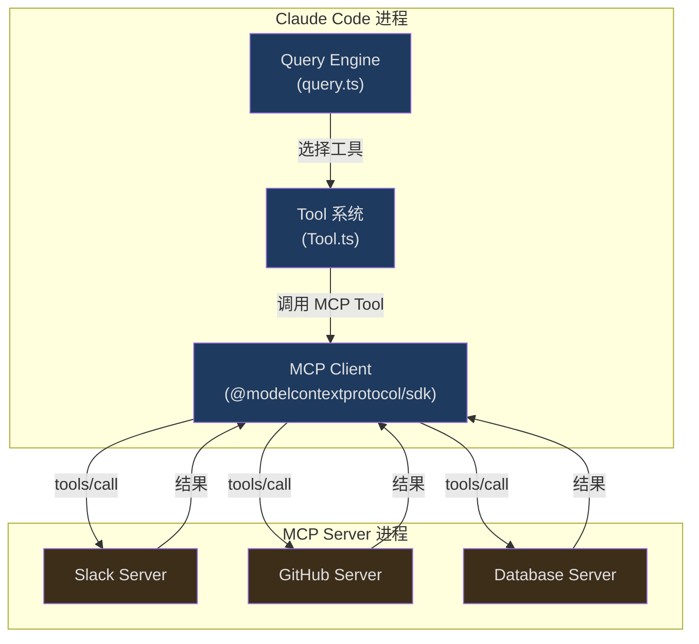
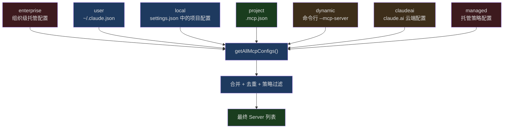
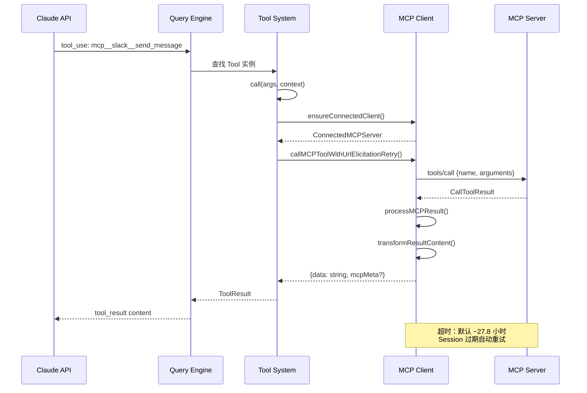

## 问题引入

Claude Code 能调用数据库、访问 API、操作 Figma——这些能力不是硬编码的，而是通过 MCP 动态加载的。

当你在 `.mcp.json` 中配置一个 Slack Server，Claude Code 会自动连接到它，发现它提供的所有工具（搜索消息、发送消息、列出频道），然后把这些工具注册为 Claude 可调用的 Tool，就好像它们是内置工具一样。当你说"帮我在 #general 频道发一条消息"，Claude 选择调用 `mcp__slack__send_message`，将参数序列化为 JSON，通过 stdio 管道发送给 Slack Server 进程，等待响应，再把结果呈现给你。

这套机制不仅仅是简单的 RPC 调用。它涉及：

- 多种传输协议（stdio、SSE、HTTP Streamable、WebSocket、SDK 内嵌）的统一抽象
- 连接池与 memoize 缓存，避免重复握手
- 动态工具发现：Server 声明能力后，Claude Code 自动将 MCP Tool 转换为内部 `Tool` 接口
- JSON Schema 直传：MCP 工具不走 Zod 解析，而是将 `inputSchema` 以 JSON Schema 形式直接传递给 API
- Resource 和 Prompt 两种辅助原语的集成
- OAuth 认证、URL Elicitation、Session 过期重连等边缘情况的处理
- Agent 子进程间的 MCP Server 共享与隔离

本文将从协议概览开始，逐层深入 Claude Code 的 MCP 集成实现。

## MCP 协议概述

Model Context Protocol（MCP）是 Anthropic 提出的开放协议，旨在标准化 AI 模型与外部工具/数据源的交互方式。它的核心设计理念是：**模型不需要知道工具的实现细节，只需要知道工具的名字、描述和输入 Schema**。



MCP 协议定义了五个核心概念：

| 概念 | 角色 | 说明 |
|------|------|------|
| **Client** | 消费者 | Claude Code 进程内的 MCP 客户端，负责连接 Server、发现工具、发起调用 |
| **Server** | 提供者 | 独立进程或远程服务，暴露 tools/resources/prompts |
| **Tool** | 可执行操作 | Server 提供的函数，有名字、描述、JSON Schema 定义的输入参数 |
| **Resource** | 上下文数据 | Server 提供的只读数据（文件内容、API 响应等），可注入对话上下文 |
| **Prompt** | 预设模板 | Server 提供的 prompt 模板，可被用户作为斜杠命令调用 |

### 传输层多样性

Claude Code 支持的传输类型远超基本规范。从 `types.ts` 的 Schema 定义可以看到完整的类型列表：

```typescript
// src/services/mcp/types.ts (第 23-26 行)
export const TransportSchema = lazySchema(() =>
  z.enum(['stdio', 'sse', 'sse-ide', 'http', 'ws', 'sdk']),
)
```

每种传输类型对应不同的使用场景：

| 传输类型 | 场景 | 特点 |
|----------|------|------|
| `stdio` | 本地 CLI 工具 | 启动子进程，通过 stdin/stdout 通信 |
| `sse` | 远程 HTTP 服务 | Server-Sent Events，支持 OAuth |
| `http` | Streamable HTTP | MCP 2025-03-26 规范的新传输 |
| `ws` | WebSocket | 双向实时通信 |
| `sse-ide` | IDE 扩展 | VS Code/JetBrains 内部使用 |
| `sdk` | 进程内 Server | Agent SDK 场景，无需子进程 |

其中 `sdk` 类型使用了一个精巧的 `InProcessTransport`：

```typescript
// src/services/mcp/InProcessTransport.ts (第 11-49 行)
class InProcessTransport implements Transport {
  private peer: InProcessTransport | undefined
  private closed = false

  onclose?: () => void
  onerror?: (error: Error) => void
  onmessage?: (message: JSONRPCMessage) => void

  /** @internal */
  _setPeer(peer: InProcessTransport): void {
    this.peer = peer
  }

  async start(): Promise<void> {}

  async send(message: JSONRPCMessage): Promise<void> {
    if (this.closed) {
      throw new Error('Transport is closed')
    }
    // 异步投递，避免同步请求/响应导致栈深度问题
    queueMicrotask(() => {
      this.peer?.onmessage?.(message)
    })
  }

  async close(): Promise<void> {
    if (this.closed) {
      return
    }
    this.closed = true
    this.onclose?.()
    if (this.peer && !this.peer.closed) {
      this.peer.closed = true
      this.peer.onclose?.()
    }
  }
}
```

`createLinkedTransportPair()` 创建一对互联的 Transport，一端给 Client，一端给 Server。`send()` 内部使用 `queueMicrotask` 异步投递消息，避免同步 RPC 调用导致的栈溢出——这在高频工具调用场景下至关重要。

## Server 配置与发现

### 配置层级

MCP Server 的配置来源有多个层级，每个层级有不同的作用域：



每个配置来源的 `ConfigScope` 类型定义如下：

```typescript
// src/services/mcp/types.ts (第 10-20 行)
export const ConfigScopeSchema = lazySchema(() =>
  z.enum([
    'local',
    'user',
    'project',
    'dynamic',
    'enterprise',
    'claudeai',
    'managed',
  ]),
)
```

`project` 作用域来自项目根目录的 `.mcp.json` 文件——这是最常用的配置方式。由于项目配置可能包含恶意 Server，Claude Code 引入了审批机制：

```typescript
// src/services/mcp/utils.ts (第 351-406 行)
export function getProjectMcpServerStatus(
  serverName: string,
): 'approved' | 'rejected' | 'pending' {
  const settings = getSettings_DEPRECATED()
  const normalizedName = normalizeNameForMCP(serverName)

  if (
    settings?.disabledMcpjsonServers?.some(
      name => normalizeNameForMCP(name) === normalizedName,
    )
  ) {
    return 'rejected'
  }

  if (
    settings?.enabledMcpjsonServers?.some(
      name => normalizeNameForMCP(name) === normalizedName,
    ) ||
    settings?.enableAllProjectMcpServers
  ) {
    return 'approved'
  }

  // 非交互模式且启用了 projectSettings 时自动审批
  if (
    getIsNonInteractiveSession() &&
    isSettingSourceEnabled('projectSettings')
  ) {
    return 'approved'
  }

  return 'pending'
}
```

注意安全边界：`--dangerously-skip-permissions` 模式下的自动审批只检查 `hasSkipDangerousModePermissionPrompt()`——该函数刻意排除了 projectSettings，防止恶意仓库通过项目配置自行批准 bypass 模式。

### 名称规范化

MCP 协议要求工具名必须匹配 `^[a-zA-Z0-9_-]{1,64}$`。由于 Server 名称可能包含空格、点号等特殊字符（尤其是 claude.ai 的 Server），需要规范化处理：

```typescript
// src/services/mcp/normalization.ts (第 17-23 行)
export function normalizeNameForMCP(name: string): string {
  let normalized = name.replace(/[^a-zA-Z0-9_-]/g, '_')
  if (name.startsWith(CLAUDEAI_SERVER_PREFIX)) {
    // claude.ai Server 额外压缩连续下划线，避免与 __ 分隔符冲突
    normalized = normalized.replace(/_+/g, '_').replace(/^_|_$/g, '')
  }
  return normalized
}
```

工具的完全限定名格式为 `mcp__<serverName>__<toolName>`：

```typescript
// src/services/mcp/mcpStringUtils.ts (第 50-52 行)
export function buildMcpToolName(serverName: string, toolName: string): string {
  return `${getMcpPrefix(serverName)}${normalizeNameForMCP(toolName)}`
}
```

这种命名约定有一个已知限制：如果 Server 名称本身包含 `__`，解析会出错。代码注释中明确记录了这一点——在实践中这种情况极为罕见。

## Server 生命周期管理

### 连接流程

`connectToServer` 是整个 MCP 集成的入口函数。它被 `memoize` 包装，以 `name + JSON(config)` 作为缓存键，确保相同配置的 Server 不会重复连接：

```typescript
// src/services/mcp/client.ts (第 595-607 行)
export const connectToServer = memoize(
  async (
    name: string,
    serverRef: ScopedMcpServerConfig,
    serverStats?: {
      totalServers: number
      stdioCount: number
      sseCount: number
      httpCount: number
      sseIdeCount: number
      wsIdeCount: number
    },
  ): Promise<MCPServerConnection> => {
    // ...连接逻辑
  },
  getServerCacheKey,
)
```

连接结果是一个联合类型，精确表达了五种可能状态：

```typescript
// src/services/mcp/types.ts (第 221-227 行)
export type MCPServerConnection =
  | ConnectedMCPServer    // 连接成功，持有 Client 实例
  | FailedMCPServer       // 连接失败，保留错误信息
  | NeedsAuthMCPServer    // 需要 OAuth 认证
  | PendingMCPServer      // 等待连接（含重连尝试计数）
  | DisabledMCPServer     // 被用户/策略禁用
```

`ConnectedMCPServer` 持有连接的核心状态：

```typescript
// src/services/mcp/types.ts (第 180-193 行)
export type ConnectedMCPServer = {
  client: Client                    // MCP SDK Client 实例
  name: string
  type: 'connected'
  capabilities: ServerCapabilities  // Server 声明的能力
  serverInfo?: {
    name: string
    version: string
  }
  instructions?: string            // Server 提供的指令（注入 system prompt）
  config: ScopedMcpServerConfig
  cleanup: () => Promise<void>      // 清理函数
}
```

### 批量连接策略

Claude Code 不会一次性连接所有 Server。它区分本地 Server（stdio/sdk）和远程 Server，分别使用不同的并发限制：

```typescript
// src/services/mcp/client.ts (第 552-561 行)
export function getMcpServerConnectionBatchSize(): number {
  return parseInt(process.env.MCP_SERVER_CONNECTION_BATCH_SIZE || '', 10) || 3
}

function getRemoteMcpServerConnectionBatchSize(): number {
  return (
    parseInt(process.env.MCP_REMOTE_SERVER_CONNECTION_BATCH_SIZE || '', 10) ||
    20
  )
}
```

本地 Server 默认并发 3（进程启动开销大），远程 Server 默认并发 20（仅网络连接）。在 `getMcpToolsCommandsAndResources` 中，两组 Server 并行处理：

```typescript
// src/services/mcp/client.ts (第 2391-2402 行)
await Promise.all([
  processBatched(
    localServers,
    getMcpServerConnectionBatchSize(),
    processServer,
  ),
  processBatched(
    remoteServers,
    getRemoteMcpServerConnectionBatchSize(),
    processServer,
  ),
])
```

### 清理与重连

每个 stdio Server 连接时都会注册清理函数到全局清理注册表，确保进程退出时所有子进程都被正确终止：

```typescript
// src/services/mcp/client.ts (第 1572-1578 行)
// 所有传输类型都注册清理——即使网络传输也可能需要清理
const cleanupUnregister = registerCleanup(cleanup)

// 创建包含注销的包装清理函数
const wrappedCleanup = async () => {
  cleanupUnregister?.()
  await cleanup()
}
```

清理过程对 stdio Server 尤其重要——它会先发送 SIGTERM，等待进程退出，如果超时则升级到 SIGKILL：

```typescript
// src/services/mcp/client.ts (第 1520-1531 行)
logMCPDebug(
  name,
  'SIGTERM failed, sending SIGKILL to MCP server process',
)
try {
  process.kill(childPid, 'SIGKILL')
} catch (killError) {
  logMCPDebug(
    name,
    `Error sending SIGKILL: ${killError}`,
  )
}
```

缓存失效时通过 `clearServerCache` 清除所有关联缓存：

```typescript
// src/services/mcp/client.ts (第 1648-1673 行)
export async function clearServerCache(
  name: string,
  serverRef: ScopedMcpServerConfig,
): Promise<void> {
  const key = getServerCacheKey(name, serverRef)

  try {
    const wrappedClient = await connectToServer(name, serverRef)
    if (wrappedClient.type === 'connected') {
      await wrappedClient.cleanup()
    }
  } catch {
    // 忽略——Server 可能连接失败
  }

  // 清除连接缓存和所有 fetch 缓存，确保重连获取最新数据
  connectToServer.cache.delete(key)
  fetchToolsForClient.cache.delete(name)
  fetchResourcesForClient.cache.delete(name)
  fetchCommandsForClient.cache.delete(name)
}
```

注意这里清除了四个独立的缓存——连接缓存和三个数据获取缓存。如果只清除连接缓存而保留 fetch 缓存，重连后会使用过时的工具列表。

### Session 过期重连

对于 HTTP Streamable 传输，MCP 规范定义了 Session 过期机制（HTTP 404 + JSON-RPC error code -32001）。Claude Code 有专门的检测逻辑：

```typescript
// src/services/mcp/client.ts (第 193-206 行)
export function isMcpSessionExpiredError(error: Error): boolean {
  const httpStatus =
    'code' in error ? (error as Error & { code?: number }).code : undefined
  if (httpStatus !== 404) {
    return false
  }
  // 检查 JSON-RPC 错误码以区分通用 404
  return (
    error.message.includes('"code":-32001') ||
    error.message.includes('"code": -32001')
  )
}
```

工具调用时如果遇到 Session 过期，会自动重试一次：

```typescript
// src/services/mcp/client.ts (第 1859-1922 行)
const MAX_SESSION_RETRIES = 1
for (let attempt = 0; ; attempt++) {
  try {
    const connectedClient = await ensureConnectedClient(client)
    const mcpResult = await callMCPToolWithUrlElicitationRetry({
      client: connectedClient,
      // ...
    })
    return { data: mcpResult.content, /* ... */ }
  } catch (error) {
    if (
      error instanceof McpSessionExpiredError &&
      attempt < MAX_SESSION_RETRIES
    ) {
      logMCPDebug(
        client.name,
        `Retrying tool '${tool.name}' after session recovery`,
      )
      continue
    }
    // ...错误处理
  }
}
```

## 动态工具生成

这是 MCP 集成最核心的部分：如何将 MCP Server 声明的工具转换为 Claude Code 内部的 `Tool` 接口。

### MCPTool 模板

`MCPTool.ts` 定义了一个"模板"对象，包含所有 MCP 工具共享的基础行为：

```typescript
// src/tools/MCPTool/MCPTool.ts (第 27-77 行)
export const MCPTool = buildTool({
  isMcp: true,
  // 在 mcpClient.ts 中被真实的 MCP 工具名 + 参数覆盖
  isOpenWorld() {
    return false
  },
  name: 'mcp',                      // 被覆盖
  maxResultSizeChars: 100_000,
  async description() {
    return DESCRIPTION                // 被覆盖
  },
  async prompt() {
    return PROMPT                     // 被覆盖
  },
  get inputSchema(): InputSchema {
    return inputSchema()              // 通用的 z.object({}).passthrough()
  },
  async call() {
    return { data: '' }               // 被覆盖
  },
  async checkPermissions(): Promise<PermissionResult> {
    return {
      behavior: 'passthrough',
      message: 'MCPTool requires permission.',
    }
  },
  userFacingName: () => 'mcp',       // 被覆盖
  // ...渲染函数
} satisfies ToolDef<InputSchema, Output>)
```

注意这里的设计模式：MCPTool 使用 `z.object({}).passthrough()` 作为 inputSchema——这是一个"接受任意对象"的 Zod Schema，因为 MCP 工具的实际 Schema 通过 `inputJSONSchema` 传递。

### fetchToolsForClient：从 Server 到 Tool

`fetchToolsForClient` 是工具发现的核心函数。它调用 MCP 协议的 `tools/list` 方法，然后将每个 MCP Tool 映射为内部 `Tool` 对象：

```typescript
// src/services/mcp/client.ts (第 1743-1813 行)
export const fetchToolsForClient = memoizeWithLRU(
  async (client: MCPServerConnection): Promise<Tool[]> => {
    if (client.type !== 'connected') return []

    const result = (await client.client.request(
      { method: 'tools/list' },
      ListToolsResultSchema,
    )) as ListToolsResult

    // 清理 Unicode 控制字符
    const toolsToProcess = recursivelySanitizeUnicode(result.tools)

    // SDK 模式下是否跳过 mcp__ 前缀
    const skipPrefix =
      client.config.type === 'sdk' &&
      isEnvTruthy(process.env.CLAUDE_AGENT_SDK_MCP_NO_PREFIX)

    return toolsToProcess.map((tool): Tool => {
      const fullyQualifiedName = buildMcpToolName(client.name, tool.name)
      return {
        ...MCPTool,                         // 展开模板
        name: skipPrefix ? tool.name : fullyQualifiedName,
        mcpInfo: { serverName: client.name, toolName: tool.name },
        isMcp: true,
        // 从 _meta 读取搜索提示
        searchHint:
          typeof tool._meta?.['anthropic/searchHint'] === 'string'
            ? tool._meta['anthropic/searchHint']
                .replace(/\s+/g, ' ').trim() || undefined
            : undefined,
        alwaysLoad: tool._meta?.['anthropic/alwaysLoad'] === true,
        // 使用 MCP 工具的原始描述
        async description() {
          return tool.description ?? ''
        },
        // 截断过长的描述（2048 字符上限）
        async prompt() {
          const desc = tool.description ?? ''
          return desc.length > MAX_MCP_DESCRIPTION_LENGTH
            ? desc.slice(0, MAX_MCP_DESCRIPTION_LENGTH) + '... [truncated]'
            : desc
        },
        // 从 annotations 推导行为特征
        isConcurrencySafe() {
          return tool.annotations?.readOnlyHint ?? false
        },
        isReadOnly() {
          return tool.annotations?.readOnlyHint ?? false
        },
        isDestructive() {
          return tool.annotations?.destructiveHint ?? false
        },
        isOpenWorld() {
          return tool.annotations?.openWorldHint ?? false
        },
        // 直接传递 JSON Schema，不转 Zod
        inputJSONSchema: tool.inputSchema as Tool['inputJSONSchema'],
        // ...call 实现, checkPermissions 等
      }
    }).filter(isIncludedMcpTool)
  },
  { maxSize: MCP_FETCH_CACHE_SIZE, getCacheKey: client => client.name },
)
```

这段代码揭示了几个关键设计决策：

**1. 对象展开覆盖模式**：`{ ...MCPTool, ...overrides }` 用模板对象作为基础，逐字段覆盖。这比继承更灵活，也更符合 TypeScript 的结构类型系统。

**2. MCP Annotations 映射**：MCP 2025-03-26 规范引入了 Tool Annotations（`readOnlyHint`、`destructiveHint`、`openWorldHint`），Claude Code 将它们直接映射为内部 Tool 接口的对应方法。

**3. 描述长度限制**：`MAX_MCP_DESCRIPTION_LENGTH = 2048`。部分 OpenAPI 自动生成的 MCP Server 会产出 15-60KB 的工具描述，不加限制会浪费大量 token。

**4. IDE 工具过滤**：`isIncludedMcpTool` 函数过滤掉非白名单的 IDE 工具，只允许 `executeCode` 和 `getDiagnostics`。

### 工具调用链路

当模型决定调用一个 MCP 工具时，调用链如下：



`call` 方法中的重试逻辑分为两层：

1. **Session 过期重试**：最多 1 次，清除连接缓存后重新获取 Client
2. **URL Elicitation 重试**：最多 3 次，处理 MCP -32042 错误码（Server 要求用户打开 URL 进行授权）

## JSON Schema vs Zod：双轨参数验证

这是 Claude Code 工具系统中一个有趣的设计分歧。内置工具使用 Zod Schema，MCP 工具使用 JSON Schema——两套体系并行运行。

### 内置工具的 Zod 路径

内置工具（如 Read、Write、Bash）定义 `inputSchema` 为 Zod Schema：

```typescript
// 典型的内置工具 inputSchema
const inputSchema = z.object({
  file_path: z.string().describe('Absolute path to the file'),
  offset: z.number().optional().describe('Line offset'),
  limit: z.number().optional().describe('Number of lines'),
})
```

Zod Schema 在发送给 API 前被自动转换为 JSON Schema。

### MCP 工具的 JSON Schema 直传

MCP 工具则绕过了 Zod 层。`Tool` 接口专门定义了 `inputJSONSchema` 字段：

```typescript
// src/Tool.ts (第 15-21 行)
export type ToolInputJSONSchema = {
  [x: string]: unknown
  type: 'object'
  properties?: {
    [x: string]: unknown
  }
}
```

```typescript
// src/Tool.ts (第 396-397 行)
// MCP 工具可以直接以 JSON Schema 格式指定输入 Schema，
// 而不是从 Zod Schema 转换
readonly inputJSONSchema?: ToolInputJSONSchema
```

在 `fetchToolsForClient` 中，MCP 工具的 `inputSchema`（来自 Server 的 JSON Schema）被直接赋值给 `inputJSONSchema`：

```typescript
// src/services/mcp/client.ts (第 1813 行)
inputJSONSchema: tool.inputSchema as Tool['inputJSONSchema'],
```

为什么不将 JSON Schema 转换为 Zod？原因有三：

1. **性能**：JSON Schema 到 Zod 的运行时转换有开销，且 MCP Server 可能提供复杂的嵌套 Schema
2. **保真度**：JSON Schema 的某些特性（如 `patternProperties`、`additionalProperties`、`oneOf` 组合）在 Zod 中没有直接对等物
3. **不必要**：Claude API 本身接受 JSON Schema，无需中间转换

这就是为什么 MCPTool 的 `inputSchema` 是一个宽松的 `z.object({}).passthrough()`——它在运行时不做实际验证，真正的 Schema 通过 `inputJSONSchema` 直传给 API。

## Resource 与 Prompt 集成

### Resource：上下文数据注入

MCP Resource 允许 Server 暴露只读数据。Claude Code 为此提供了两个内置工具：

- `ListMcpResourcesTool`：列出所有 MCP Server 提供的 Resource
- `ReadMcpResourceTool`：读取特定 Resource 的内容

Resource 的类型定义继承自 MCP SDK 并扩展了 Server 归属信息：

```typescript
// src/services/mcp/types.ts (第 229 行)
export type ServerResource = Resource & { server: string }
```

在 `getMcpToolsCommandsAndResources` 中，Resource 工具只在有 Server 声明了 `resources` capability 时才添加，且全局只添加一次：

```typescript
// src/services/mcp/client.ts (第 2360-2364 行)
const resourceTools: Tool[] = []
if (supportsResources && !resourceToolsAdded) {
  resourceToolsAdded = true
  resourceTools.push(ListMcpResourcesTool, ReadMcpResourceTool)
}
```

这个 `resourceToolsAdded` 标志确保即使有 10 个 Server 都声明了 Resource capability，List 和 Read 工具也只注册一次——它们能访问所有 Server 的 Resource。

Resource 获取也使用 LRU 缓存和并发处理。`prefetchAllMcpResources` 在启动时预取所有 Server 的工具、命令和 Resource，避免首次对话时的延迟。

### Prompt：预设命令模板

MCP Prompt 被转换为 Claude Code 的 `Command`（斜杠命令）。当 Server 声明了 `prompts` capability 时，`fetchCommandsForClient` 调用 `prompts/list` 获取列表：

```typescript
// Prompt 命令的命名遵循 mcp__<server>__<prompt> 格式
// 与 Tool 命名一致，使用双下划线分隔
```

Prompt 和 Skill 的区分很微妙：MCP Prompt 设置 `isMcp: true`，而 MCP Skill（从 `skill://` Resource 发现的）设置 `loadedFrom: 'mcp'`。这种区分影响 `/mcp` 菜单的能力显示：

```typescript
// src/services/mcp/utils.ts (第 85-94 行)
export function filterMcpPromptsByServer(
  commands: Command[],
  serverName: string,
): Command[] {
  return commands.filter(
    c =>
      commandBelongsToServer(c, serverName) &&
      !(c.type === 'prompt' && c.loadedFrom === 'mcp'),
  )
}
```

## Agent 间的 MCP Server 共享与隔离

Claude Code 的多 Agent 架构（主线程 + 子 Agent）引入了 MCP Server 的共享问题。

### 共享机制

当主线程连接到 MCP Server 后，子 Agent 通过 `ToolUseContext.options.mcpClients` 继承父进程的连接：

```typescript
// src/Tool.ts (第 167 行)
mcpClients: MCPServerConnection[]
```

子 Agent 不需要重新连接 MCP Server——它们共享父进程已建立的连接。这是因为 `connectToServer` 的 memoize 缓存在进程内全局共享。

### 隔离机制

但是，Server 配置的变更不会自动传播。`excludeStalePluginClients` 负责检测过期的连接：

```typescript
// src/services/mcp/utils.ts (第 185-224 行)
export function excludeStalePluginClients(
  mcp: {
    clients: MCPServerConnection[]
    tools: Tool[]
    commands: Command[]
    resources: Record<string, ServerResource[]>
  },
  configs: Record<string, ScopedMcpServerConfig>,
): {
  clients: MCPServerConnection[]
  tools: Tool[]
  commands: Command[]
  resources: Record<string, ServerResource[]>
  stale: MCPServerConnection[]
} {
  const stale = mcp.clients.filter(c => {
    const fresh = configs[c.name]
    if (!fresh) return c.config.scope === 'dynamic'
    return hashMcpConfig(c.config) !== hashMcpConfig(fresh)
  })
  // ...移除过期的 tools/commands/resources
}
```

过期检测使用配置的 SHA-256 哈希比较，排除 `scope` 字段（因为 scope 是元数据，不影响连接参数）。

### 变更通知

MCP 协议支持 Server 端推送变更通知。`useManageMCPConnections` 监听三种通知：

```typescript
// 来自 useManageMCPConnections.ts 的通知订阅
ToolListChangedNotificationSchema    // 工具列表变更
ResourceListChangedNotificationSchema // 资源列表变更
PromptListChangedNotificationSchema   // Prompt 列表变更
```

收到通知后，Claude Code 清除对应的 fetch 缓存并重新获取数据。这使得 Server 可以在运行时动态添加/移除工具——例如，一个数据库 Server 可能在用户切换数据库连接后更新可用的查询工具。

### 重连与指数退避

断线重连使用指数退避策略：

```typescript
// src/services/mcp/useManageMCPConnections.ts (第 87-89 行)
const MAX_RECONNECT_ATTEMPTS = 5
const INITIAL_BACKOFF_MS = 1000
const MAX_BACKOFF_MS = 30000
```

每次重连尝试间隔翻倍，直到 30 秒上限，最多尝试 5 次。

## OAuth 与 Elicitation

### 认证缓存

对于需要 OAuth 的远程 Server（SSE、HTTP），Claude Code 维护一个认证缓存以避免重复探测：

```typescript
// src/services/mcp/client.ts (第 257-278 行)
const MCP_AUTH_CACHE_TTL_MS = 15 * 60 * 1000 // 15 分钟

type McpAuthCacheData = Record<string, { timestamp: number }>

// 使用 memoize 确保并发的 isMcpAuthCached() 共享同一次文件读取
let authCachePromise: Promise<McpAuthCacheData> | null = null

function getMcpAuthCache(): Promise<McpAuthCacheData> {
  if (!authCachePromise) {
    authCachePromise = readFile(getMcpAuthCachePath(), 'utf-8')
      .then(data => jsonParse(data) as McpAuthCacheData)
      .catch(() => ({}))
  }
  return authCachePromise
}
```

缓存写入通过 promise chain 串行化，防止并发 read-modify-write 竞态：

```typescript
// src/services/mcp/client.ts (第 291-309 行)
let writeChain = Promise.resolve()

function setMcpAuthCacheEntry(serverId: string): void {
  writeChain = writeChain
    .then(async () => {
      const cache = await getMcpAuthCache()
      cache[serverId] = { timestamp: Date.now() }
      // ...写入文件
      // 写入后使读缓存失效
      authCachePromise = null
    })
    .catch(() => {
      // 尽力而为
    })
}
```

### URL Elicitation

MCP 规范的 `-32042` 错误码表示 Server 需要用户打开 URL 完成授权。Claude Code 对此有完整的处理流程：

```typescript
// src/services/mcp/client.ts (第 2850-2860 行)
const MAX_URL_ELICITATION_RETRIES = 3
for (let attempt = 0; ; attempt++) {
  try {
    return await callToolFn({
      client: connectedClient,
      tool, args, meta, signal, onProgress,
    })
  } catch (error) {
    if (
      !(error instanceof McpError) ||
      error.code !== ErrorCode.UrlElicitationRequired
    ) {
      throw error
    }
    // ...处理 Elicitation
  }
}
```

Elicitation 的处理分三层：
1. **Hook 优先**：`runElicitationHooks` 允许自定义逻辑自动处理
2. **SDK/Print 模式**：通过 `handleElicitation` 回调委托给结构化 IO
3. **REPL 模式**：通过 AppState 队列展示 UI 对话框

## 大结果处理

MCP 工具可能返回大量数据。`processMCPResult` 实现了分层处理策略：

```typescript
// src/services/mcp/client.ts (第 2720-2799 行)
export async function processMCPResult(
  result: unknown,
  tool: string,
  name: string,
): Promise<MCPToolResult> {
  const { content, type, schema } = await transformMCPResult(result, tool, name)

  // IDE 工具不发给模型，跳过大小检查
  if (name === 'ide') {
    return content
  }

  // 检查是否需要截断
  if (!(await mcpContentNeedsTruncation(content))) {
    return content
  }

  // 包含图片时回退到截断（保持图片压缩和可查看性）
  if (contentContainsImages(content)) {
    return await truncateMcpContentIfNeeded(content)
  }

  // 大文本结果：持久化到文件，返回路径和读取指令
  const persistId = `mcp-${normalizeNameForMCP(name)}-${normalizeNameForMCP(tool)}-${timestamp}`
  const persistResult = await persistToolResult(contentStr, persistId)
  // ...返回读取指令
}
```

处理策略的优先级：
1. 小结果：直接返回
2. 大图片结果：截断（保持可查看性）
3. 大文本结果：持久化到文件，返回 Read 指令让模型按需读取
4. 持久化失败：回退到截断

`inferCompactSchema` 函数为结构化内容生成紧凑的 Schema 描述，帮助模型理解输出格式：

```typescript
// src/services/mcp/client.ts (第 2644-2659 行)
export function inferCompactSchema(value: unknown, depth = 2): string {
  // 推断值的简要结构描述
  // 例如：{name: string, items: [{id: number, ...}]}
}
```

## Claude.ai 代理连接

Claude Code 可以访问在 claude.ai 上配置的 MCP Server，使用特殊的 `claudeai-proxy` 传输类型。代理连接需要处理 OAuth token 的刷新：

```typescript
// src/services/mcp/client.ts (第 372-422 行)
export function createClaudeAiProxyFetch(innerFetch: FetchLike): FetchLike {
  return async (url, init) => {
    const doRequest = async () => {
      await checkAndRefreshOAuthTokenIfNeeded()
      const currentTokens = getClaudeAIOAuthTokens()
      if (!currentTokens) {
        throw new Error('No claude.ai OAuth token available')
      }
      const headers = new Headers(init?.headers)
      headers.set('Authorization', `Bearer ${currentTokens.accessToken}`)
      const response = await innerFetch(url, { ...init, headers })
      // 返回发送时使用的 token，而非当前 token
      return { response, sentToken: currentTokens.accessToken }
    }

    const { response, sentToken } = await doRequest()
    if (response.status !== 401) {
      return response
    }
    // 401 时尝试刷新 token 并重试一次
    const tokenChanged = await handleOAuth401Error(sentToken).catch(() => false)
    if (!tokenChanged) {
      return response
    }
    try {
      return (await doRequest()).response
    } catch {
      return response
    }
  }
}
```

注意 `sentToken` 的使用——代码特意记录了发送请求时使用的 token，而不是在 401 响应后重新读取当前 token。这是因为并发的 connector 可能在此期间已经通过 `handleOAuth401Error` 刷新了 token，重新读取会得到新 token，传给 `handleOAuth401Error` 后会判断"token 未变"从而跳过刷新。

## 超时与请求包装

### 工具调用超时

MCP 工具调用的默认超时约为 27.8 小时（实际上是"无限"）：

```typescript
// src/services/mcp/client.ts (第 211 行)
const DEFAULT_MCP_TOOL_TIMEOUT_MS = 100_000_000
```

这个看似离谱的值是故意的——某些 MCP 工具（如数据库迁移、大规模分析）确实需要很长时间。用户可通过 `MCP_TOOL_TIMEOUT` 环境变量自定义。

### 请求级超时包装

与工具超时不同，每个 HTTP 请求有 60 秒超时。`wrapFetchWithTimeout` 为每个请求创建独立的 AbortController：

```typescript
// src/services/mcp/client.ts (第 492-549 行)
export function wrapFetchWithTimeout(baseFetch: FetchLike): FetchLike {
  return async (url: string | URL, init?: RequestInit) => {
    const method = (init?.method ?? 'GET').toUpperCase()

    // GET 请求跳过超时——MCP 的 GET 是长连接 SSE 流
    if (method === 'GET') {
      return baseFetch(url, init)
    }

    // 使用 setTimeout 而非 AbortSignal.timeout()
    // 因为 Bun 中 AbortSignal.timeout 的内部计时器
    // 要到 GC 时才释放，每个请求占 ~2.4KB 原生内存
    const controller = new AbortController()
    const timer = setTimeout(
      c => c.abort(new DOMException('The operation timed out.', 'TimeoutError')),
      MCP_REQUEST_TIMEOUT_MS,
      controller,
    )
    timer.unref?.()

    // 关联父信号
    const parentSignal = init?.signal
    const abort = () => controller.abort(parentSignal?.reason)
    parentSignal?.addEventListener('abort', abort)
    // ...
  }
}
```

代码注释揭示了一个有趣的 Bun 运行时细节：`AbortSignal.timeout()` 创建的内部计时器只在 GC 时释放，导致每个请求泄漏约 2.4KB 原生内存。因此改用 `setTimeout` + `clearTimeout` 手动管理生命周期。

## 序列化状态与 CLI 集成

MCP 状态可以序列化为 JSON，用于 `/mcp` 命令和 CLI 状态导出：

```typescript
// src/services/mcp/types.ts (第 232-258 行)
export interface SerializedTool {
  name: string
  description: string
  inputJSONSchema?: {
    [x: string]: unknown
    type: 'object'
    properties?: { [x: string]: unknown }
  }
  isMcp?: boolean
  originalToolName?: string  // 原始未规范化的工具名
}

export interface MCPCliState {
  clients: SerializedClient[]
  configs: Record<string, ScopedMcpServerConfig>
  tools: SerializedTool[]
  resources: Record<string, ServerResource[]>
  normalizedNames?: Record<string, string>  // 规范化名到原始名的映射
}
```

`normalizedNames` 映射解决了一个实际问题：用户在权限规则中使用原始名称，但系统内部使用规范化名称。这个映射使得权限检查能正确关联。

## 可迁移模式与最佳实践

### 配置组织建议

基于 Claude Code 的配置层级设计，推荐以下组织方式：

| 场景 | 推荐配置位置 | 原因 |
|------|-------------|------|
| 团队共享的项目工具 | `.mcp.json`（project scope） | 随代码版本控制，新成员自动获取 |
| 个人偏好的通用工具 | `~/.claude.json`（user scope） | 跨项目可用 |
| CI/CD 环境 | `--mcp-server` 参数（dynamic scope） | 临时注入，不修改配置文件 |
| 企业合规工具 | managed 配置（enterprise scope） | 组织统一管理，用户不可修改 |

### 工具设计原则

从 Claude Code 的 MCP 集成代码中，可以提炼出几条 MCP Server 工具设计原则：

1. **使用 annotations**：声明 `readOnlyHint` 让工具可并发执行；声明 `destructiveHint` 触发额外确认
2. **控制描述长度**：超过 2048 字符会被截断，把核心用法放在前面
3. **支持分页**：大结果会被截断或持久化到文件，提供分页参数让模型按需获取
4. **使用 searchHint**：通过 `_meta['anthropic/searchHint']` 帮助 ToolSearch 找到被延迟加载的工具
5. **使用 alwaysLoad**：对于模型必须在第一轮就看到的关键工具，设置 `_meta['anthropic/alwaysLoad']` 跳过 ToolSearch

### 安全边界

MCP 集成的安全模型值得特别关注：

- **Project Server 审批**：`.mcp.json` 中的 Server 需要用户显式批准（除非在非交互模式且启用了 projectSettings）
- **权限隔离**：MCP 工具使用 `passthrough` 权限模式，意味着每次调用都会检查全局权限规则
- **名称空间隔离**：`mcp__` 前缀确保 MCP 工具不会与内置工具冲突（SDK 模式下可选择关闭）
- **描述截断**：防止恶意 Server 通过超长描述注入提示
- **Unicode 清理**：`recursivelySanitizeUnicode` 清除可能干扰模型行为的控制字符

## 架构总结

Claude Code 的 MCP 集成是一个精心设计的可扩展架构。它将"连接管理"与"工具适配"清晰分离：`client.ts` 负责建立和维护与 MCP Server 的连接，`MCPTool.ts` 提供工具模板，`fetchToolsForClient` 将两者桥接——从 Server 的原始能力声明到 Claude 可调用的 Tool 对象，中间经过名称规范化、描述截断、Schema 直传、权限配置等一系列处理。

整体设计的几个核心理念：

1. **惰性发现**：只在需要时连接 Server、获取工具列表，用 memoize 缓存避免重复操作
2. **优雅降级**：连接失败不阻塞整个系统，只是该 Server 的工具不可用；需要认证的 Server 会注册一个 `McpAuthTool` 引导用户完成认证
3. **双轨 Schema**：内置工具走 Zod 获得类型安全和验证，MCP 工具走 JSON Schema 直传保持灵活和高效
4. **防御性设计**：从 Unicode 清理到描述截断，从配置哈希比较到认证缓存串行化，处处体现对边缘情况的考量

对于想构建类似扩展系统的项目，MCP 集成提供了一个可参考的模式：使用模板对象 + 对象展开实现动态工具注册，用 memoize 缓存管理连接生命周期，用联合类型精确表达连接状态，用配置层级实现灵活的作用域管理。
