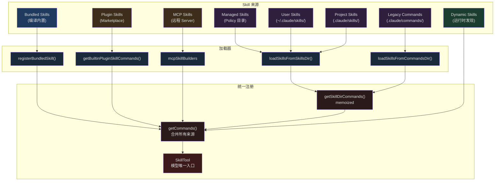
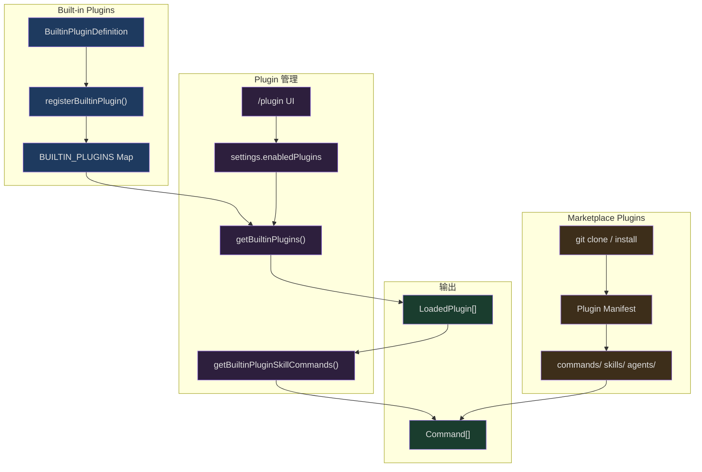

## 问题引入

当你在 Claude Code 中输入 `/simplify`，它会自动对你最近修改的代码进行三维度审查——代码复用、质量和效率。当你安装一个 Plugin，它提供的 Skill 会自动出现在可用列表中。当 MCP Server 暴露 Prompt 并附带特定的 frontmatter 标记时，这些 Prompt 也会被转化为 Skill 供模型调用。

这背后是一套三层可扩展性架构：

- **Skill 层**：以 Markdown 文件为载体的技能定义，通过 frontmatter 声明元数据，支持多来源加载、参数替换、条件激活
- **Plugin 层**：将多个 Skill、Hooks、MCP Server 打包为可安装的扩展单元，分为 Built-in 和 Marketplace 两级
- **MCP 层**：通过 MCP 协议从远程 Server 动态发现并加载 Skill

三层各有独立的注册机制，但最终统一汇聚到一个 `Command[]` 数组中，由 `SkillTool` 作为唯一入口向模型暴露。本文将从 Skill 系统的文件加载开始，逐层深入这套可扩展性架构的设计与实现。

## Skill 系统全景

### 核心数据结构：Command

所有 Skill 最终都被表示为 `Command` 类型。理解这个类型是理解整个系统的基础：

```typescript
// src/types/command.ts (L25-55)
export type PromptCommand = {
  type: 'prompt'
  progressMessage: string
  contentLength: number
  argNames?: string[]
  allowedTools?: string[]
  model?: string
  source: SettingSource | 'builtin' | 'mcp' | 'plugin' | 'bundled'
  pluginInfo?: {
    pluginManifest: PluginManifest
    repository: string
  }
  hooks?: HooksSettings
  skillRoot?: string
  context?: 'inline' | 'fork'
  agent?: string
  effort?: EffortValue
  paths?: string[]
  getPromptForCommand(
    args: string,
    context: ToolUseContext,
  ): Promise<ContentBlockParam[]>
}

export type Command = CommandBase &
  (PromptCommand | LocalCommand | LocalJSXCommand)
```

`source` 字段标记了 Skill 的来源——`'bundled'` 表示编译进 CLI 的内置技能，`'plugin'` 来自 Plugin，`'mcp'` 来自 MCP Server，而 `SettingSource`（`'userSettings'`、`'projectSettings'`、`'policySettings'`）对应不同目录加载的文件 Skill。

`getPromptForCommand` 是核心方法：它接收用户参数和工具上下文，返回注入到对话中的 prompt 内容。不同来源的 Skill 在这个方法中实现各自的参数替换、shell 命令执行和安全策略。

### 多来源加载架构



加载优先级按此顺序执行，遇到同名 Skill 时先加载的胜出。

### 文件 Skill 的加载：loadSkillsDir.ts

文件 Skill 的核心加载逻辑在 `loadSkillsDir.ts` 中。这个文件超过 1000 行，是整个 Skill 系统最复杂的模块。

#### 目录结构约定

Skills 目录只支持**目录格式**：每个 Skill 是一个目录，内含 `SKILL.md` 文件。

```
.claude/skills/
├── review-code/
│   └── SKILL.md          # Skill 定义
├── deploy/
│   ├── SKILL.md          # Skill 定义
│   └── scripts/
│       └── deploy.sh     # 辅助文件
└── frontend:lint/        # 命名空间 → "frontend:lint"
    └── SKILL.md
```

加载函数 `loadSkillsFromSkillsDir` 遍历目录，逐个读取 `SKILL.md`：

```typescript
// src/skills/loadSkillsDir.ts (L407-480)
async function loadSkillsFromSkillsDir(
  basePath: string,
  source: SettingSource,
): Promise<SkillWithPath[]> {
  const fs = getFsImplementation()

  let entries
  try {
    entries = await fs.readdir(basePath)
  } catch (e: unknown) {
    if (!isFsInaccessible(e)) logError(e)
    return []
  }

  const results = await Promise.all(
    entries.map(async (entry): Promise<SkillWithPath | null> => {
      try {
        // 只支持目录格式：skill-name/SKILL.md
        if (!entry.isDirectory() && !entry.isSymbolicLink()) {
          return null
        }

        const skillDirPath = join(basePath, entry.name)
        const skillFilePath = join(skillDirPath, 'SKILL.md')

        let content: string
        try {
          content = await fs.readFile(skillFilePath, { encoding: 'utf-8' })
        } catch (e: unknown) {
          if (!isENOENT(e)) {
            logForDebugging(
              `[skills] failed to read ${skillFilePath}: ${e}`,
              { level: 'warn' },
            )
          }
          return null
        }

        const { frontmatter, content: markdownContent } = parseFrontmatter(
          content, skillFilePath,
        )

        const skillName = entry.name
        const parsed = parseSkillFrontmatterFields(
          frontmatter, markdownContent, skillName,
        )
        const paths = parseSkillPaths(frontmatter)

        return {
          skill: createSkillCommand({
            ...parsed,
            skillName,
            markdownContent,
            source,
            baseDir: skillDirPath,
            loadedFrom: 'skills',
            paths,
          }),
          filePath: skillFilePath,
        }
      } catch (error) {
        logError(error)
        return null
      }
    }),
  )

  return results.filter((r): r is SkillWithPath => r !== null)
}
```

注意几个设计要点：

1. **只支持目录格式**。单个 `.md` 文件在 `/skills/` 目录下会被忽略，这确保每个 Skill 可以携带辅助文件（脚本、模板等）。
2. **符号链接支持**。`isSymbolicLink()` 检查使得 Skill 可以通过 symlink 共享。
3. **并行加载**。使用 `Promise.all` 同时读取所有 Skill 文件。
4. **优雅降级**。单个 Skill 的加载失败不影响其他 Skill。

#### Frontmatter 元数据解析

SKILL.md 文件的 frontmatter 是 Skill 行为的完整声明。`parseSkillFrontmatterFields` 函数处理所有可能的字段：

```typescript
// src/skills/loadSkillsDir.ts (L185-265)
export function parseSkillFrontmatterFields(
  frontmatter: FrontmatterData,
  markdownContent: string,
  resolvedName: string,
  descriptionFallbackLabel: 'Skill' | 'Custom command' = 'Skill',
): {
  displayName: string | undefined
  description: string
  hasUserSpecifiedDescription: boolean
  allowedTools: string[]
  argumentHint: string | undefined
  argumentNames: string[]
  whenToUse: string | undefined
  version: string | undefined
  model: ReturnType<typeof parseUserSpecifiedModel> | undefined
  disableModelInvocation: boolean
  userInvocable: boolean
  hooks: HooksSettings | undefined
  executionContext: 'fork' | undefined
  agent: string | undefined
  effort: EffortValue | undefined
  shell: FrontmatterShell | undefined
} {
  // ...解析逻辑
}
```

一个完整的 SKILL.md frontmatter 示例：

```markdown
---
name: "代码审查助手"
description: "对 Git 变更进行多维度代码审查"
when_to_use: "当用户要求审查代码或提交 PR 时触发"
allowed-tools:
  - Bash(git:*)
  - Read
  - Grep
arguments:
  - branch
  - focus_area
argument-hint: "<branch> [focus_area]"
model: sonnet
effort: high
context: fork
agent: general-purpose
user-invocable: true
disable-model-invocation: false
paths:
  - "src/**"
  - "lib/**"
hooks:
  PreToolUse:
    - matcher: Bash
      hooks:
        - type: command
          command: echo "Reviewing..."
shell:
  type: bash
  command: /bin/bash
---

## 审查流程

对 $ARGUMENTS 分支的变更进行以下审查...

当前 Session ID: ${CLAUDE_SESSION_ID}
Skill 目录: ${CLAUDE_SKILL_DIR}
```

这些 frontmatter 字段的语义值得逐一解释：

| 字段 | 类型 | 用途 |
|------|------|------|
| `name` | string | 显示名（不影响命令名） |
| `description` | string | 简短描述，用于 Skill 列表 |
| `when_to_use` | string | 告诉模型何时应该调用此 Skill |
| `allowed-tools` | string[] | Skill 执行期间额外允许的工具 |
| `arguments` | string/string[] | 命名参数列表 |
| `model` | string | 模型覆盖（如 `sonnet`、`opus`、`inherit`） |
| `effort` | EffortValue | 推理努力级别 |
| `context` | 'fork' | 是否在子 Agent 中执行 |
| `paths` | string[] | 条件激活的文件路径模式 |
| `hooks` | HooksSettings | Skill 级别的 Hook 配置 |
| `user-invocable` | boolean | 用户是否可以通过 `/name` 调用 |
| `disable-model-invocation` | boolean | 禁止模型主动调用 |

### 参数替换机制

Skill 的 prompt 内容支持多种参数替换：

```typescript
// src/skills/loadSkillsDir.ts (L344-369)
async getPromptForCommand(args, toolUseContext) {
  let finalContent = baseDir
    ? `Base directory for this skill: ${baseDir}\n\n${markdownContent}`
    : markdownContent

  // 1. 用户参数替换：$ARGUMENTS, $1, $2, 或命名参数
  finalContent = substituteArguments(
    finalContent, args, true, argumentNames,
  )

  // 2. 内置变量替换
  if (baseDir) {
    const skillDir =
      process.platform === 'win32' ? baseDir.replace(/\\/g, '/') : baseDir
    finalContent = finalContent.replace(/\$\{CLAUDE_SKILL_DIR\}/g, skillDir)
  }

  finalContent = finalContent.replace(
    /\$\{CLAUDE_SESSION_ID\}/g,
    getSessionId(),
  )

  // 3. Shell 命令执行（仅非 MCP Skill）
  if (loadedFrom !== 'mcp') {
    finalContent = await executeShellCommandsInPrompt(
      finalContent, toolUseContext, `/${skillName}`, shell,
    )
  }

  return [{ type: 'text', text: finalContent }]
}
```

这里有三层替换：

1. **用户参数**：`$ARGUMENTS` 被替换为完整的参数字符串，`$1`/`$2` 被替换为位置参数，命名参数 `${branch}` 被替换为对应的值。
2. **内置变量**：`${CLAUDE_SKILL_DIR}` 指向 Skill 所在目录，`${CLAUDE_SESSION_ID}` 是当前会话 ID。
3. **Shell 命令**：Skill 内容中的 `` !`command` `` 和 ` ```! command ``` ` 语法会被实际执行，输出替换到 prompt 中。这是 Skill 与环境交互的关键能力——但出于安全考虑，MCP 来源的 Skill 禁止执行 shell 命令。

### 多级来源聚合与去重

`getSkillDirCommands` 是文件 Skill 的聚合入口。它使用 `memoize` 缓存结果，从五个来源并行加载 Skill：

```typescript
// src/skills/loadSkillsDir.ts (L638-714)
export const getSkillDirCommands = memoize(
  async (cwd: string): Promise<Command[]> => {
    const userSkillsDir = join(getClaudeConfigHomeDir(), 'skills')
    const managedSkillsDir = join(getManagedFilePath(), '.claude', 'skills')
    const projectSkillsDirs = getProjectDirsUpToHome('skills', cwd)

    const [
      managedSkills,
      userSkills,
      projectSkillsNested,
      additionalSkillsNested,
      legacyCommands,
    ] = await Promise.all([
      loadSkillsFromSkillsDir(managedSkillsDir, 'policySettings'),
      loadSkillsFromSkillsDir(userSkillsDir, 'userSettings'),
      Promise.all(
        projectSkillsDirs.map(dir =>
          loadSkillsFromSkillsDir(dir, 'projectSettings'),
        ),
      ),
      Promise.all(
        additionalDirs.map(dir =>
          loadSkillsFromSkillsDir(
            join(dir, '.claude', 'skills'), 'projectSettings',
          ),
        ),
      ),
      loadSkillsFromCommandsDir(cwd),
    ])

    // 合并所有来源
    const allSkillsWithPaths = [
      ...managedSkills,
      ...userSkills,
      ...projectSkillsNested.flat(),
      ...additionalSkillsNested.flat(),
      ...legacyCommands,
    ]

    // ... 去重和条件 Skill 分离
  },
)
```

注意来源的优先级顺序：Managed（企业策略）> User（用户全局）> Project（项目级）> Additional（`--add-dir`）> Legacy（旧版 `/commands/`）。

#### 基于 realpath 的去重

多个来源可能通过不同路径指向同一个文件（如 symlink）。系统使用 `realpath` 解析到规范路径来去重：

```typescript
// src/skills/loadSkillsDir.ts (L118-124)
async function getFileIdentity(filePath: string): Promise<string | null> {
  try {
    return await realpath(filePath)
  } catch {
    return null
  }
}
```

去重过程先并行计算所有文件的 identity，然后同步扫描去除重复：

```typescript
// src/skills/loadSkillsDir.ts (L728-763)
const fileIds = await Promise.all(
  allSkillsWithPaths.map(({ skill, filePath }) =>
    skill.type === 'prompt'
      ? getFileIdentity(filePath)
      : Promise.resolve(null),
  ),
)

const seenFileIds = new Map<string, SettingSource | ...>()
const deduplicatedSkills: Command[] = []

for (let i = 0; i < allSkillsWithPaths.length; i++) {
  const entry = allSkillsWithPaths[i]
  if (entry === undefined || entry.skill.type !== 'prompt') continue
  const { skill } = entry

  const fileId = fileIds[i]
  if (fileId === null || fileId === undefined) {
    deduplicatedSkills.push(skill)
    continue
  }

  const existingSource = seenFileIds.get(fileId)
  if (existingSource !== undefined) {
    logForDebugging(
      `Skipping duplicate skill '${skill.name}' from ${skill.source}`,
    )
    continue
  }

  seenFileIds.set(fileId, skill.source)
  deduplicatedSkills.push(skill)
}
```

这个设计选择了 `realpath` 而非 inode 比较，因为某些文件系统（NFS、ExFAT、容器内虚拟 FS）报告的 inode 值不可靠。先并行做 IO（`Promise.all` 获取 identity），再同步做逻辑判断（遍历去重），是性能和正确性兼顾的典型模式。

### Paths 条件激活

Skill 可以通过 `paths` frontmatter 声明自己只在特定文件路径下生效：

```yaml
---
paths:
  - "src/components/**"
  - "src/styles/**"
---
```

当 Skill 带有 `paths` 字段时，它不会立即加载到可用列表，而是存储在 `conditionalSkills` Map 中。只有当模型操作匹配路径的文件时，Skill 才被激活：

```typescript
// src/skills/loadSkillsDir.ts (L997-1058)
export function activateConditionalSkillsForPaths(
  filePaths: string[],
  cwd: string,
): string[] {
  if (conditionalSkills.size === 0) {
    return []
  }

  const activated: string[] = []

  for (const [name, skill] of conditionalSkills) {
    if (skill.type !== 'prompt' || !skill.paths || skill.paths.length === 0) {
      continue
    }

    const skillIgnore = ignore().add(skill.paths)
    for (const filePath of filePaths) {
      const relativePath = isAbsolute(filePath)
        ? relative(cwd, filePath)
        : filePath

      if (
        !relativePath ||
        relativePath.startsWith('..') ||
        isAbsolute(relativePath)
      ) {
        continue
      }

      if (skillIgnore.ignores(relativePath)) {
        dynamicSkills.set(name, skill)
        conditionalSkills.delete(name)
        activatedConditionalSkillNames.add(name)
        activated.push(name)
        break
      }
    }
  }

  if (activated.length > 0) {
    skillsLoaded.emit()
  }

  return activated
}
```

这里使用了 `ignore` 库（与 `.gitignore` 相同的 glob 匹配规则），匹配后将 Skill 从 `conditionalSkills` 移到 `dynamicSkills`，并通过信号通知其他模块清除缓存。`activatedConditionalSkillNames` Set 确保重新加载 Skill（缓存清除后）时已激活的 Skill 不会被重新降级为条件 Skill。

这种"懒激活"设计有明确的性能目的：一个项目可能有大量 Skill，但不是所有 Skill 都与当前工作相关。通过路径过滤，Skill 列表保持精简，减少系统提示词中的 token 消耗。

### 动态 Skill 发现

除了条件激活，系统还支持从文件操作中动态发现新的 Skill 目录：

```typescript
// src/skills/loadSkillsDir.ts (L861-915)
export async function discoverSkillDirsForPaths(
  filePaths: string[],
  cwd: string,
): Promise<string[]> {
  const fs = getFsImplementation()
  const resolvedCwd = cwd.endsWith(pathSep) ? cwd.slice(0, -1) : cwd
  const newDirs: string[] = []

  for (const filePath of filePaths) {
    let currentDir = dirname(filePath)

    // 从文件位置向上遍历到 cwd，检查每级是否存在 .claude/skills/
    while (currentDir.startsWith(resolvedCwd + pathSep)) {
      const skillDir = join(currentDir, '.claude', 'skills')

      if (!dynamicSkillDirs.has(skillDir)) {
        dynamicSkillDirs.add(skillDir)
        try {
          await fs.stat(skillDir)
          // 检查是否被 gitignore
          if (await isPathGitignored(currentDir, resolvedCwd)) {
            continue
          }
          newDirs.push(skillDir)
        } catch {
          // 目录不存在，继续
        }
      }

      const parent = dirname(currentDir)
      if (parent === currentDir) break
      currentDir = parent
    }
  }

  // 按深度排序，越深的目录优先级越高
  return newDirs.sort(
    (a, b) => b.split(pathSep).length - a.split(pathSep).length,
  )
}
```

当模型 Read 或 Edit 一个 `src/modules/payments/handler.ts` 文件时，系统会向上检查 `src/modules/payments/.claude/skills/`、`src/modules/.claude/skills/` 等目录是否存在。如果发现了新的 Skill 目录，它们会被加载并合并到可用 Skill 中。

值得注意的是 `dynamicSkillDirs` Set 同时记录了已检查的目录（无论成功或失败），避免对同一目录的重复 `stat` 调用。此外，位于 `.gitignore` 路径下的 Skill 目录会被跳过，防止 `node_modules` 中的恶意 Skill 被加载。

### Effort Level

Skill 可以通过 `effort` frontmatter 控制模型的推理努力级别：

```typescript
// src/skills/loadSkillsDir.ts (L228-235)
const effortRaw = frontmatter['effort']
const effort =
  effortRaw !== undefined ? parseEffortValue(effortRaw) : undefined
if (effortRaw !== undefined && effort === undefined) {
  logForDebugging(
    `Skill ${resolvedName} has invalid effort '${effortRaw}'.` +
    ` Valid options: ${EFFORT_LEVELS.join(', ')} or an integer`,
  )
}
```

当 Skill 以 `context: fork` 方式运行时，`effort` 会被注入到子 Agent 的定义中：

```typescript
// src/tools/SkillTool/SkillTool.ts (L209-212)
const agentDefinition =
  command.effort !== undefined
    ? { ...baseAgent, effort: command.effort }
    : baseAgent
```

这允许特定 Skill 要求更高或更低的推理强度——例如代码审查 Skill 设置 `effort: high`，而简单的格式化 Skill 设置 `effort: low` 以加速执行。

## Bundled Skill 系统

### registerBundledSkill 注册模式

Bundled Skill 是编译进 CLI 二进制的技能，不依赖文件系统。它们通过 `registerBundledSkill` 函数在启动时注册：

```typescript
// src/skills/bundledSkills.ts (L53-100)
export function registerBundledSkill(definition: BundledSkillDefinition): void {
  const { files } = definition

  let skillRoot: string | undefined
  let getPromptForCommand = definition.getPromptForCommand

  if (files && Object.keys(files).length > 0) {
    skillRoot = getBundledSkillExtractDir(definition.name)
    let extractionPromise: Promise<string | null> | undefined
    const inner = definition.getPromptForCommand
    getPromptForCommand = async (args, ctx) => {
      extractionPromise ??= extractBundledSkillFiles(definition.name, files)
      const extractedDir = await extractionPromise
      const blocks = await inner(args, ctx)
      if (extractedDir === null) return blocks
      return prependBaseDir(blocks, extractedDir)
    }
  }

  const command: Command = {
    type: 'prompt',
    name: definition.name,
    description: definition.description,
    aliases: definition.aliases,
    hasUserSpecifiedDescription: true,
    allowedTools: definition.allowedTools ?? [],
    // ...其他字段
    source: 'bundled',
    loadedFrom: 'bundled',
    getPromptForCommand,
  }
  bundledSkills.push(command)
}
```

这里有一个精巧的 **延迟文件提取** 机制：当 Bundled Skill 声明了 `files`（参考文件），这些文件不会在注册时写入磁盘，而是在第一次调用时才提取。`extractionPromise ??= ...` 使用了 nullish 赋值操作符来实现 memoize——多个并发调用共享同一个 Promise，不会重复提取。

### 安全的文件写入

提取文件到磁盘时，系统使用了多层安全措施：

```typescript
// src/skills/bundledSkills.ts (L176-193)
const O_NOFOLLOW = fsConstants.O_NOFOLLOW ?? 0
const SAFE_WRITE_FLAGS =
  process.platform === 'win32'
    ? 'wx'
    : fsConstants.O_WRONLY |
      fsConstants.O_CREAT |
      fsConstants.O_EXCL |
      O_NOFOLLOW

async function safeWriteFile(p: string, content: string): Promise<void> {
  const fh = await open(p, SAFE_WRITE_FLAGS, 0o600)
  try {
    await fh.writeFile(content, 'utf8')
  } finally {
    await fh.close()
  }
}
```

- `O_EXCL`：如果文件已存在则失败，防止覆盖预创建的恶意文件
- `O_NOFOLLOW`：不跟随符号链接，防止 symlink 攻击
- `0o600`：文件权限仅限所有者读写
- `0o700`：目录权限仅限所有者

路径验证也很严格：

```typescript
// src/skills/bundledSkills.ts (L196-206)
function resolveSkillFilePath(baseDir: string, relPath: string): string {
  const normalized = normalize(relPath)
  if (
    isAbsolute(normalized) ||
    normalized.split(pathSep).includes('..') ||
    normalized.split('/').includes('..')
  ) {
    throw new Error(`bundled skill file path escapes skill dir: ${relPath}`)
  }
  return join(baseDir, normalized)
}
```

### Bundled Skill 注册流程

所有 Bundled Skill 在 `initBundledSkills` 中统一注册：

```typescript
// src/skills/bundled/index.ts (L24-79)
export function initBundledSkills(): void {
  registerUpdateConfigSkill()
  registerKeybindingsSkill()
  registerVerifySkill()
  registerDebugSkill()
  registerLoremIpsumSkill()
  registerSkillifySkill()
  registerRememberSkill()
  registerSimplifySkill()
  registerBatchSkill()
  registerStuckSkill()

  // Feature-gated skills
  if (feature('KAIROS') || feature('KAIROS_DREAM')) {
    const { registerDreamSkill } = require('./dream.js')
    registerDreamSkill()
  }
  if (feature('AGENT_TRIGGERS')) {
    const { registerLoopSkill } = require('./loop.js')
    registerLoopSkill()
  }
  // ...更多 feature-gated skills
}
```

有两种注册模式：

1. **无条件注册**：`registerSimplifySkill()` 等始终可用的 Skill 在模块顶层 import
2. **Feature-gated 注册**：通过 `feature()` 检查 feature flag，使用 `require()` 延迟加载

使用 `require()` 而非 `import()` 是因为 Bun 打包后动态 `import()` 的路径解析会指向 `/$bunfs/root/...`，而 `require()` 可以正常工作。

### 实战示例：simplify Skill

让我们看一个实际的 Bundled Skill 如何工作：

```typescript
// src/skills/bundled/simplify.ts (L55-69)
export function registerSimplifySkill(): void {
  registerBundledSkill({
    name: 'simplify',
    description:
      'Review changed code for reuse, quality, and efficiency, ' +
      'then fix any issues found.',
    userInvocable: true,
    async getPromptForCommand(args) {
      let prompt = SIMPLIFY_PROMPT
      if (args) {
        prompt += `\n\n## Additional Focus\n\n${args}`
      }
      return [{ type: 'text', text: prompt }]
    },
  })
}
```

`SIMPLIFY_PROMPT` 是一个精心设计的多阶段 prompt，指示模型：
1. 运行 `git diff` 识别变更
2. 启动三个并行 Agent 分别审查代码复用、代码质量和效率
3. 汇总发现并直接修复问题

这展示了 Bundled Skill 的核心价值：将专家级的多步骤工作流封装为一条命令。

## Plugin 系统

### 两级 Plugin 架构



### Built-in Plugin

Built-in Plugin 与 Bundled Skill 的核心区别在于：**用户可以启用/禁用 Built-in Plugin**。

```typescript
// src/types/plugin.ts (L18-35)
export type BuiltinPluginDefinition = {
  name: string
  description: string
  version?: string
  skills?: BundledSkillDefinition[]
  hooks?: HooksSettings
  mcpServers?: Record<string, McpServerConfig>
  isAvailable?: () => boolean
  defaultEnabled?: boolean
}
```

一个 Built-in Plugin 可以包含多个组件：
- **skills**：通过 `BundledSkillDefinition` 定义的技能列表
- **hooks**：生命周期钩子配置
- **mcpServers**：MCP Server 配置

Plugin ID 使用 `{name}@builtin` 格式，与 Marketplace Plugin 的 `{name}@{marketplace}` 区分。

### 启用/禁用状态管理

```typescript
// src/plugins/builtinPlugins.ts (L57-101)
export function getBuiltinPlugins(): {
  enabled: LoadedPlugin[]
  disabled: LoadedPlugin[]
} {
  const settings = getSettings_DEPRECATED()
  const enabled: LoadedPlugin[] = []
  const disabled: LoadedPlugin[] = []

  for (const [name, definition] of BUILTIN_PLUGINS) {
    // 可用性检查（如平台限制）
    if (definition.isAvailable && !definition.isAvailable()) {
      continue
    }

    const pluginId = `${name}@${BUILTIN_MARKETPLACE_NAME}`
    const userSetting = settings?.enabledPlugins?.[pluginId]
    // 优先级：用户设置 > Plugin 默认值 > true
    const isEnabled =
      userSetting !== undefined
        ? userSetting === true
        : (definition.defaultEnabled ?? true)

    const plugin: LoadedPlugin = {
      name,
      manifest: {
        name,
        description: definition.description,
        version: definition.version,
      },
      path: BUILTIN_MARKETPLACE_NAME,
      source: pluginId,
      repository: pluginId,
      enabled: isEnabled,
      isBuiltin: true,
      hooksConfig: definition.hooks,
      mcpServers: definition.mcpServers,
    }

    if (isEnabled) {
      enabled.push(plugin)
    } else {
      disabled.push(plugin)
    }
  }

  return { enabled, disabled }
}
```

状态判断链：`isAvailable()` → `userSetting` → `defaultEnabled` → `true`。如果 `isAvailable()` 返回 false，Plugin 完全不可见；否则用户在 `/plugin` UI 中的设置优先，没有用户设置则看 Plugin 的默认值，最终兜底为启用。

### Skill 从 Plugin 到 Command 的转换

Plugin 的 Skill 通过 `skillDefinitionToCommand` 转换为标准 `Command`：

```typescript
// src/plugins/builtinPlugins.ts (L132-159)
function skillDefinitionToCommand(definition: BundledSkillDefinition): Command {
  return {
    type: 'prompt',
    name: definition.name,
    description: definition.description,
    hasUserSpecifiedDescription: true,
    allowedTools: definition.allowedTools ?? [],
    // 关键点：source 设为 'bundled' 而非 'builtin'
    // 'builtin' 在 Command.source 中表示硬编码的 /help, /clear 等
    // 使用 'bundled' 确保 Plugin Skill 出现在 SkillTool 列表中
    source: 'bundled',
    loadedFrom: 'bundled',
    hooks: definition.hooks,
    context: definition.context,
    agent: definition.agent,
    isEnabled: definition.isEnabled ?? (() => true),
    isHidden: !(definition.userInvocable ?? true),
    progressMessage: 'running',
    getPromptForCommand: definition.getPromptForCommand,
  }
}
```

这里 `source: 'bundled'` 的选择是刻意的——代码注释解释了原因：`'builtin'` 在 `Command.source` 的语义中表示硬编码的 CLI 命令（`/help`、`/clear`），如果 Plugin Skill 使用 `'builtin'`，它们会从 SkillTool 列表中消失。

### Marketplace Plugin

Marketplace Plugin 通过 `LoadedPlugin` 类型表示，拥有更丰富的结构：

```typescript
// src/types/plugin.ts (L48-70)
export type LoadedPlugin = {
  name: string
  manifest: PluginManifest
  path: string
  source: string
  repository: string
  enabled?: boolean
  isBuiltin?: boolean
  sha?: string               // Git commit SHA 版本锁定
  commandsPath?: string
  commandsPaths?: string[]    // manifest 中的额外命令路径
  agentsPath?: string
  agentsPaths?: string[]
  skillsPath?: string
  skillsPaths?: string[]
  outputStylesPath?: string
  outputStylesPaths?: string[]
  hooksConfig?: HooksSettings
  mcpServers?: Record<string, McpServerConfig>
  lspServers?: Record<string, LspServerConfig>
  settings?: Record<string, unknown>
}
```

Marketplace Plugin 通过 Git 仓库分发。安装过程 clone 仓库到本地，读取 manifest 文件，然后根据 manifest 中声明的路径加载各种组件。Skill 文件使用与项目级 Skill 相同的目录格式（`skill-name/SKILL.md`），由同一套 `loadSkillsFromSkillsDir` 加载器处理。

Plugin 的命名空间使用冒号分隔：如果一个名为 `ralph-loop` 的 Plugin 提供了 `help` 和 `cancel-ralph` 两个 Skill，它们的完整名称是 `ralph-loop:help` 和 `ralph-loop:cancel-ralph`。

## MCP Skill 桥接

### mcpSkillBuilders 注册

MCP Server 可以通过 Prompt 原语暴露 Skill。当 MCP Prompt 的 frontmatter 包含特定字段时，它会被转化为 Skill 而不是普通的 Prompt：

```typescript
// src/skills/mcpSkillBuilders.ts (L26-44)
export type MCPSkillBuilders = {
  createSkillCommand: typeof createSkillCommand
  parseSkillFrontmatterFields: typeof parseSkillFrontmatterFields
}

let builders: MCPSkillBuilders | null = null

export function registerMCPSkillBuilders(b: MCPSkillBuilders): void {
  builders = b
}

export function getMCPSkillBuilders(): MCPSkillBuilders {
  if (!builders) {
    throw new Error(
      'MCP skill builders not registered — ' +
      'loadSkillsDir.ts has not been evaluated yet',
    )
  }
  return builders
}
```

这个模块解决了一个微妙的循环依赖问题。MCP 代码需要调用 `createSkillCommand` 和 `parseSkillFrontmatterFields`，但直接导入 `loadSkillsDir.ts` 会引入巨大的传递依赖树，在 dependency-cruiser 检查中产生大量循环警告。

解决方案是**运行时注册**：`mcpSkillBuilders.ts` 只导入类型（`typeof`），不产生运行时依赖。`loadSkillsDir.ts` 在模块初始化时注册实际函数，这发生在任何 MCP Server 连接之前。

### MCP Skill 与文件 Skill 的差异

MCP 来源的 Skill 有两个重要限制：

1. **禁止 Shell 命令执行**：

```typescript
// src/skills/loadSkillsDir.ts (L372-396)
// Security: MCP skills are remote and untrusted — never execute inline
// shell commands (!`…` / ```! … ```) from their markdown body.
if (loadedFrom !== 'mcp') {
  finalContent = await executeShellCommandsInPrompt(
    finalContent, toolUseContext, `/${skillName}`, shell,
  )
}
```

2. **`${CLAUDE_SKILL_DIR}` 无意义**：MCP Skill 没有本地目录，因此 Skill 目录变量不做替换。

MCP Skill 在 `SkillTool.call()` 中通过 `getAllCommands` 获取，它从 `AppState.mcp.commands` 中筛选 `loadedFrom === 'mcp'` 的命令：

```typescript
// src/tools/SkillTool/SkillTool.ts (L81-94)
async function getAllCommands(context: ToolUseContext): Promise<Command[]> {
  const mcpSkills = context
    .getAppState()
    .mcp.commands.filter(
      cmd => cmd.type === 'prompt' && cmd.loadedFrom === 'mcp',
    )
  if (mcpSkills.length === 0) return getCommands(getProjectRoot())
  const localCommands = await getCommands(getProjectRoot())
  return uniqBy([...localCommands, ...mcpSkills], 'name')
}
```

`uniqBy` 按 name 去重，本地命令优先（出现在数组前面）。

## SkillTool 执行流程

### 执行模式

SkillTool 是模型调用 Skill 的唯一工具接口。它支持两种执行模式：

```mermaid
sequenceDiagram
    participant M as 模型
    participant ST as SkillTool
    participant V as validateInput
    participant P as checkPermissions
    participant C as call()

    M->>ST: { skill: "simplify", args: "" }
    ST->>V: 验证 Skill 存在
    V-->>ST: result: true

    ST->>P: 权限检查
    alt 安全属性 Skill
        P-->>ST: allow (auto)
    else 有 allow 规则
        P-->>ST: allow (rule)
    else 需要用户确认
        P-->>ST: ask
    end

    ST->>C: 执行 Skill

    alt context: 'fork'
        C->>C: executeForkedSkill()
        Note over C: 在子 Agent 中运行<br/>独立的 token 预算
        C-->>ST: { status: 'forked', result: "..." }
    else context: 'inline'（默认）
        C->>C: processPromptSlashCommand()
        Note over C: 展开 prompt 到<br/>当前对话上下文
        C-->>ST: { status: 'inline', newMessages: [...] }
    end

    ST-->>M: ToolResult

    style M fill:#1e3a5f,color:#e0e0e0
    style ST fill:#2d1f3d,color:#e0e0e0
    style V fill:#1a3d2e,color:#e0e0e0
    style P fill:#3d2e1a,color:#e0e0e0
    style C fill:#3d1a1a,color:#e0e0e0
```

#### Inline 模式（默认）

Inline 模式将 Skill 的 prompt 内容展开到当前对话上下文中：

```typescript
// src/tools/SkillTool/SkillTool.ts (L635-643)
const processedCommand = await processPromptSlashCommand(
  commandName,
  args || '',
  commands,
  context,
)

if (!processedCommand.shouldQuery) {
  throw new Error('Command processing failed')
}
```

结果以 `newMessages` 的形式返回，这些消息被插入到当前对话流中。同时通过 `contextModifier` 修改上下文——添加 `allowedTools` 和传递 `effort` 级别。

#### Fork 模式

当 Skill 声明 `context: 'fork'` 时，它在独立的子 Agent 中执行：

```typescript
// src/tools/SkillTool/SkillTool.ts (L122-289)
async function executeForkedSkill(
  command: Command & { type: 'prompt' },
  commandName: string,
  args: string | undefined,
  context: ToolUseContext,
  canUseTool: CanUseToolFn,
  parentMessage: AssistantMessage,
  onProgress?: ToolCallProgress<Progress>,
): Promise<ToolResult<Output>> {
  const agentId = createAgentId()

  const { modifiedGetAppState, baseAgent, promptMessages, skillContent } =
    await prepareForkedCommandContext(command, args || '', context)

  const agentDefinition =
    command.effort !== undefined
      ? { ...baseAgent, effort: command.effort }
      : baseAgent

  const agentMessages: Message[] = []

  for await (const message of runAgent({
    agentDefinition,
    promptMessages,
    toolUseContext: {
      ...context,
      getAppState: modifiedGetAppState,
    },
    canUseTool,
    isAsync: false,
    querySource: 'agent:custom',
    model: command.model as ModelAlias | undefined,
    availableTools: context.options.tools,
    override: { agentId },
  })) {
    agentMessages.push(message)
    // 向父级报告工具调用进度
  }

  const resultText = extractResultText(
    agentMessages,
    'Skill execution completed',
  )
  agentMessages.length = 0  // 释放消息内存

  return {
    data: {
      success: true,
      commandName,
      status: 'forked',
      agentId,
      result: resultText,
    },
  }
}
```

Fork 模式的优势：
- **独立 token 预算**：子 Agent 有自己的上下文窗口，不消耗主对话的 token
- **隔离性**：Skill 执行期间的工具调用和中间结果不污染主对话
- **内存管理**：执行完成后 `agentMessages.length = 0` 主动释放消息内存，`clearInvokedSkillsForAgent(agentId)` 清理 Skill 状态

### 权限检查

SkillTool 的权限检查区分了多种场景：

1. **Deny 规则优先检查**：如果用户或策略配置了拒绝规则（如 `Skill(deploy)`），直接拒绝
2. **安全属性自动放行**：如果 Skill 只有安全属性（无 `allowedTools`、无 `hooks`、无 `context: fork`），自动允许
3. **Allow 规则匹配**：匹配用户配置的允许规则，支持前缀通配（`review:*` 匹配所有 `review:` 开头的 Skill）
4. **Ask 兜底**：默认询问用户，同时提供"允许此 Skill"和"允许此前缀"两种快捷建议

```typescript
// src/tools/SkillTool/SkillTool.ts (L542-567)
const suggestions = [
  {
    type: 'addRules' as const,
    rules: [{ toolName: SKILL_TOOL_NAME, ruleContent: commandName }],
    behavior: 'allow' as const,
    destination: 'localSettings' as const,
  },
  {
    type: 'addRules' as const,
    rules: [{ toolName: SKILL_TOOL_NAME, ruleContent: `${commandName}:*` }],
    behavior: 'allow' as const,
    destination: 'localSettings' as const,
  },
]
```

### Skill 列表与 Token 预算管理

Skill 的发现信息通过 system-reminder 消息暴露给模型。但 Skill 数量可能很多，直接列出所有 Skill 的完整描述会浪费宝贵的 context window token。`prompt.ts` 中实现了一套预算管理机制：

```typescript
// src/tools/SkillTool/prompt.ts (L21-23)
export const SKILL_BUDGET_CONTEXT_PERCENT = 0.01  // 上下文窗口的 1%
export const CHARS_PER_TOKEN = 4
export const DEFAULT_CHAR_BUDGET = 8_000  // 兜底：200K × 4 × 1%
```

当 Skill 总描述超出预算时，系统采用分级截断策略：

```typescript
// src/tools/SkillTool/prompt.ts (L70-171)
export function formatCommandsWithinBudget(
  commands: Command[],
  contextWindowTokens?: number,
): string {
  if (commands.length === 0) return ''

  const budget = getCharBudget(contextWindowTokens)

  // 尝试完整描述
  const fullTotal = fullEntries.reduce(
    (sum, e) => sum + stringWidth(e.full), 0,
  )
  if (fullTotal <= budget) {
    return fullEntries.map(e => e.full).join('\n')
  }

  // 分区：bundled（永不截断）vs 其他
  // Bundled Skill 始终保留完整描述
  // 其他 Skill 按比例截断描述

  if (maxDescLen < MIN_DESC_LENGTH) {
    // 极端情况：其他 Skill 只显示名字
    return commands.map((cmd, i) =>
      bundledIndices.has(i) ? fullEntries[i]!.full : `- ${cmd.name}`,
    ).join('\n')
  }

  // 正常截断：非 bundled 的描述截断到 maxDescLen
  return commands.map((cmd, i) => {
    if (bundledIndices.has(i)) return fullEntries[i]!.full
    const description = getCommandDescription(cmd)
    return `- ${cmd.name}: ${truncate(description, maxDescLen)}`
  }).join('\n')
}
```

设计原则：
- **Bundled Skill 永不截断**：它们是核心能力，描述质量直接影响模型的调用决策
- **渐进降级**：先截断描述长度，极端情况下只保留名字
- **每条描述上限 250 字符**：`MAX_LISTING_DESC_CHARS` 硬限制，即使预算充足也不浪费

## 三层的统一与交互

### 统一 Command 注册

三层最终通过 `getCommands()` 函数统一：

```typescript
// 伪代码，展示合并逻辑
async function getCommands(cwd: string): Promise<Command[]> {
  const fileSkills = await getSkillDirCommands(cwd)
  const bundledSkills = getBundledSkills()
  const pluginSkills = getBuiltinPluginSkillCommands()
  const dynamicSkills = getDynamicSkills()

  return [...fileSkills, ...bundledSkills, ...pluginSkills, ...dynamicSkills]
}
```

`SkillTool.getAllCommands()` 进一步加入 MCP Skill：

```typescript
const localCommands = await getCommands(getProjectRoot())
return uniqBy([...localCommands, ...mcpSkills], 'name')
```

### 名称冲突解决

各层之间可能出现同名 Skill。解决策略是：**先注册者胜出**。

- 文件 Skill 内部：Managed > User > Project（由 `getSkillDirCommands` 中的 flatten 顺序决定）
- 文件 vs Bundled：`getCommands` 中文件 Skill 在前
- 本地 vs MCP：`uniqBy([...localCommands, ...mcpSkills], 'name')` 本地优先

Plugin Skill 通过命名空间（`plugin-name:skill-name`）避免与其他来源的冲突。

### Hooks 统一

Skill 和 Plugin 都可以声明 Hooks。Skill 的 Hooks 在调用时注册，Plugin 的 Hooks 在加载时就生效：

```typescript
// Skill hooks - 仅在 Skill 被调用时激活
command.hooks = parseHooksFromFrontmatter(frontmatter, skillName)

// Plugin hooks - Plugin 启用后始终生效
plugin.hooksConfig = definition.hooks
```

两者都使用相同的 `HooksSettings` Schema，可以配置 `PreToolUse`、`PostToolUse`、`PreCompact` 等生命周期钩子。

### 缓存与失效

文件 Skill 的加载结果被 `memoize` 缓存，但动态 Skill 发现和条件 Skill 激活需要触发缓存失效：

```typescript
// src/skills/loadSkillsDir.ts (L806-811)
export function clearSkillCaches() {
  getSkillDirCommands.cache?.clear?.()
  loadMarkdownFilesForSubdir.cache?.clear?.()
  conditionalSkills.clear()
  activatedConditionalSkillNames.clear()
}
```

动态 Skill 加载完成后通过信号通知订阅者：

```typescript
// src/skills/loadSkillsDir.ts (L839-851)
export function onDynamicSkillsLoaded(callback: () => void): () => void {
  return skillsLoaded.subscribe(() => {
    try {
      callback()
    } catch (error) {
      logError(error)
    }
  })
}
```

这个信号机制使用了与 GrowthBook 特性标志相同的 `createSignal` 工具——一个轻量的观察者模式实现。订阅者的错误被捕获并记录，不会中断信号传播。

## Bare Mode 与策略锁定

### Bare Mode

`--bare` 模式跳过所有自动发现逻辑，只加载通过 `--add-dir` 显式指定的 Skill：

```typescript
// src/skills/loadSkillsDir.ts (L654-675)
if (isBareMode()) {
  if (additionalDirs.length === 0 || !projectSettingsEnabled) {
    return []
  }
  const additionalSkillsNested = await Promise.all(
    additionalDirs.map(dir =>
      loadSkillsFromSkillsDir(
        join(dir, '.claude', 'skills'), 'projectSettings',
      ),
    ),
  )
  return additionalSkillsNested.flat().map(s => s.skill)
}
```

这对 CI/CD 环境很有用：确保只运行预定义的 Skill，不受项目目录结构影响。

### Plugin-Only 策略

企业可以通过 `isRestrictedToPluginOnly('skills')` 锁定 Skill 来源为仅限 Plugin：

```typescript
// src/skills/loadSkillsDir.ts (L650-651)
const skillsLocked = isRestrictedToPluginOnly('skills')
const projectSettingsEnabled =
  isSettingSourceEnabled('projectSettings') && !skillsLocked
```

当 `skillsLocked` 为 true 时：
- 项目级 Skill（`.claude/skills/`）不加载
- 用户级 Skill（`~/.claude/skills/`）不加载
- 旧版 commands 目录不加载
- 只有 Managed（策略）级 Skill 和 Bundled/Plugin Skill 可用

## 可迁移模式

Claude Code 的三层可扩展性架构蕴含了几个可复用的设计模式：

### 1. Markdown-as-Config 模式

使用 Markdown 文件（带 YAML frontmatter）作为配置载体：

```markdown
---
description: "..."
allowed-tools: [...]
paths: ["src/**"]
---

实际的 prompt 内容...
```

这个模式的优势：
- **人类可读**：非开发者也能编写和维护 Skill
- **版本控制友好**：Markdown diff 清晰直观
- **自文档化**：frontmatter 是配置，body 是文档
- **IDE 支持**：标准 Markdown 格式，有丰富的编辑器支持

### 2. 多层级目录合并模式

从多个目录层级加载配置，按优先级合并去重：

```
Managed (策略) > User (全局) > Project (项目) > Dynamic (运行时)
```

这个模式适用于任何需要"全局默认 + 项目覆盖"语义的系统。去重使用 `realpath` 而非路径字符串比较，正确处理了 symlink 场景。

### 3. 条件激活模式

资源（Skill、规则等）不立即加载，而是声明激活条件，在运行时匹配后才生效：

```
声明 → 存储到 conditionalMap → 运行时触发 → 移到 activeMap → 通知订阅者
```

这个模式在大型项目中特别有价值。它将 O(N) 的 Skill 列表压缩到 O(active) 级别，同时保持了按需发现的能力。

### 4. 注册-而非-导入模式

Bundled Skill 和 MCP Skill Builder 都使用了"在模块初始化时注册到全局 Map，而非直接导入"的模式：

```typescript
// 注册
export function registerBundledSkill(def: BundledSkillDefinition): void {
  bundledSkills.push(skillDefToCommand(def))
}

// 获取
export function getBundledSkills(): Command[] {
  return [...bundledSkills]
}
```

这个模式的好处：
- **打破循环依赖**：注册模块只导入类型，不导入实现
- **支持延迟加载**：feature-gated Skill 使用 `require()` 按需加载
- **测试友好**：`clearBundledSkills()` 可以重置状态

### 5. 安全写入模式

Bundled Skill 的文件提取展示了安全写入的最佳实践：

```
Per-process nonce dir → O_EXCL | O_NOFOLLOW → 0o600 权限 → 路径遍历检查
```

四层防御：
1. 随机目录名防止预创建攻击
2. `O_EXCL` 防止覆盖已有文件
3. `O_NOFOLLOW` 防止符号链接攻击
4. 路径规范化 + `..` 检查防止目录遍历

## 小结

Claude Code 的三层可扩展性架构——Skill、Plugin、MCP——看似复杂，但底层逻辑清晰：

1. **统一表示**：所有可扩展能力最终都是 `Command` 类型
2. **统一入口**：`SkillTool` 是模型调用 Skill 的唯一接口
3. **统一调度**：无论来源如何，Skill 执行都经过相同的验证、权限检查和 inline/fork 决策
4. **差异化安全**：不同来源有不同的信任级别（MCP 禁止 shell 命令，Plugin 需要权限确认，Bundled 自动放行）

这套架构的设计哲学是：**让用户通过 Markdown 文件就能定义新能力，让第三方通过 Plugin 和 MCP 扩展生态，同时在每一层都有明确的安全边界**。文件 Skill 的路径条件激活和动态发现保证了大型项目中的性能，Bundled Skill 的延迟提取和安全写入保证了二进制分发的可靠性，Plugin 的两级架构（Built-in + Marketplace）兼顾了开箱即用和自由扩展。

下一篇文章我们将深入 OAuth 与认证系统，探索 Claude Code 如何安全地管理 API Key、OAuth Token 和 Session 凭证。
