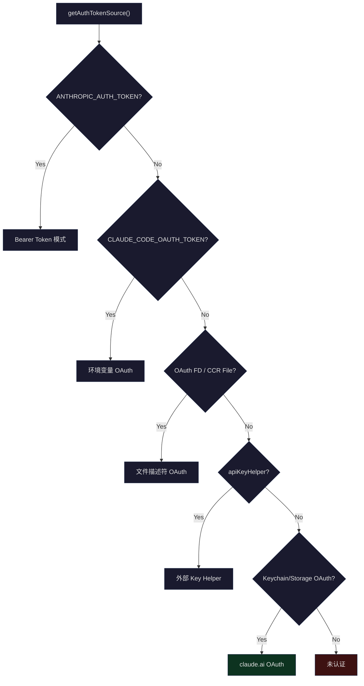
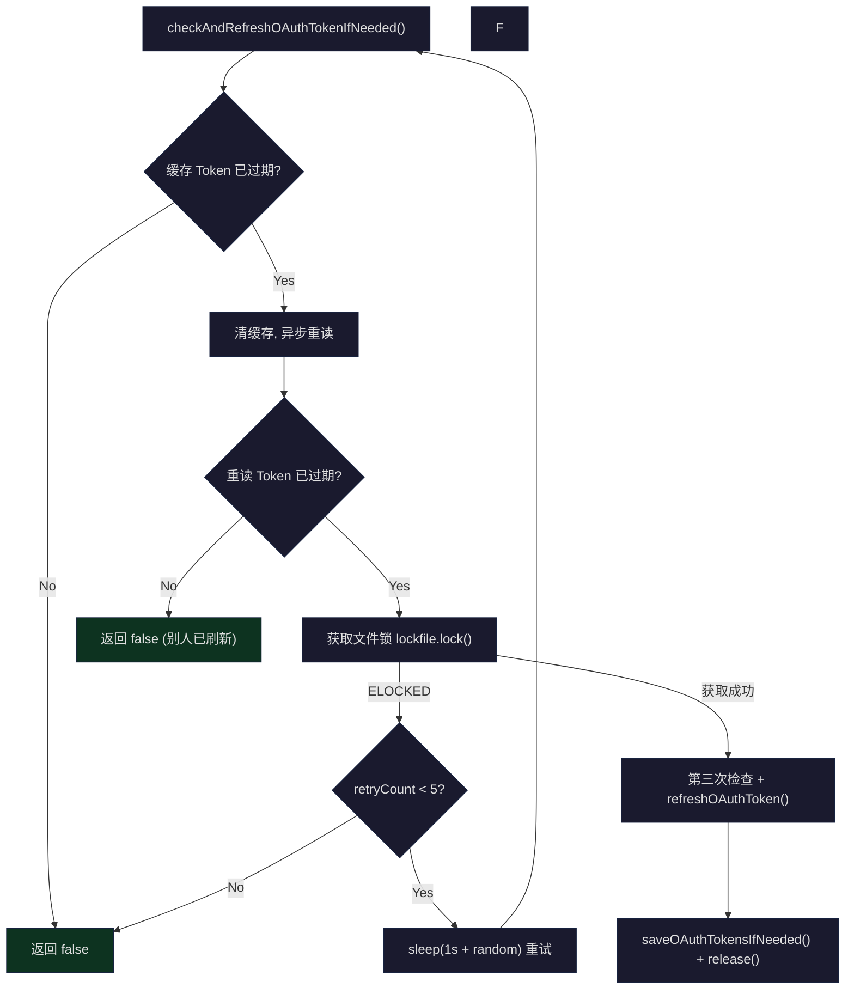

## 问题引入

当你第一次运行 `claude` 命令时，系统弹出浏览器引导你完成 OAuth 登录。几秒后终端显示"Login successful"，你开始愉快地编码。几小时后，Token 到期了，但你毫无感觉——系统在后台静默刷新了 Token。当你切换到远程 Bridge 模式时，JWT 被自动解码、调度、在过期前 5 分钟刷新。这一切的背后，是一套覆盖 API Key、OAuth 2.0、JWT 三种认证方式的全链路架构。

这套架构需要回答的核心问题是：

1. **凭证来源多样性**：如何统一处理环境变量 API Key、OAuth Token、文件描述符传递的 Token、Bridge 模式下的 JWT？
2. **安全存储**：Token 存在哪里？macOS 用 Keychain，Linux 用明文文件——如何抽象这一差异？
3. **生命周期管理**：Token 过期怎么办？多进程同时刷新怎么避免竞争？
4. **冷启动优化**：macOS Keychain 读取需要 ~32ms/次，两次顺序读取就是 ~65ms——如何优化？

本文将从认证方式全景开始，逐层深入到 Keychain 集成、OAuth 流程、Token 刷新调度、Bridge 模式下的 JWT 管理，最终勾勒出 Claude Code 认证系统的完整图景。

## 认证方式全景

Claude Code 支持多种认证方式，优先级从高到低如下：



认证来源的判定逻辑在 `src/utils/auth.ts` 的 `getAuthTokenSource()` 函数中：

```typescript
// src/utils/auth.ts (L153-206)
export function getAuthTokenSource() {
  // --bare: API-key-only. apiKeyHelper 是唯一允许的 bearer-token 来源
  if (isBareMode()) {
    if (getConfiguredApiKeyHelper()) {
      return { source: 'apiKeyHelper' as const, hasToken: true }
    }
    return { source: 'none' as const, hasToken: false }
  }

  if (process.env.ANTHROPIC_AUTH_TOKEN && !isManagedOAuthContext()) {
    return { source: 'ANTHROPIC_AUTH_TOKEN' as const, hasToken: true }
  }

  if (process.env.CLAUDE_CODE_OAUTH_TOKEN) {
    return { source: 'CLAUDE_CODE_OAUTH_TOKEN' as const, hasToken: true }
  }

  // 检查文件描述符传递的 OAuth Token（或 CCR 磁盘回退）
  const oauthTokenFromFd = getOAuthTokenFromFileDescriptor()
  if (oauthTokenFromFd) {
    if (process.env.CLAUDE_CODE_OAUTH_TOKEN_FILE_DESCRIPTOR) {
      return { source: 'CLAUDE_CODE_OAUTH_TOKEN_FILE_DESCRIPTOR', hasToken: true }
    }
    return { source: 'CCR_OAUTH_TOKEN_FILE', hasToken: true }
  }

  const oauthTokens = getClaudeAIOAuthTokens()
  if (shouldUseClaudeAIAuth(oauthTokens?.scopes) && oauthTokens?.accessToken) {
    return { source: 'claude.ai' as const, hasToken: true }
  }

  return { source: 'none' as const, hasToken: false }
}
```

这个函数的设计有一个关键约束：**管理上下文隔离**。当 Claude Desktop 或 CCR（Claude Code Remote）通过 OAuth 启动 CLI 时，系统会检测 `isManagedOAuthContext()` 来阻止回退到用户本地的 `apiKeyHelper` 或环境变量 API Key，防止跨上下文凭证泄漏。

### 三种核心认证模式

| 模式 | 来源 | 是否可刷新 | 使用场景 |
|------|------|-----------|---------|
| **API Key** | `ANTHROPIC_API_KEY` 环境变量或 `apiKeyHelper` | 否 | CI/CD、第三方集成、`--bare` 模式 |
| **OAuth 2.0** | 浏览器授权流程 + Keychain 存储 | 是 | 交互式终端、Claude.ai 订阅用户 |
| **JWT** | Bridge `/bridge` 端点签发 | 是（调度刷新） | 远程 Bridge 模式、Claude Desktop |

其中 OAuth 2.0 是最核心的认证方式，也是本文的重点。Anthropic 的 OAuth 实现遵循 RFC 7636（PKCE）扩展，支持自动（浏览器回调）和手动（粘贴代码）两种授权码获取方式。

## macOS Keychain 集成

### 存储架构

Token 存储通过 `SecureStorage` 接口抽象了平台差异：

```typescript
// src/utils/secureStorage/index.ts (L9-17)
export function getSecureStorage(): SecureStorage {
  if (process.platform === 'darwin') {
    return createFallbackStorage(macOsKeychainStorage, plainTextStorage)
  }
  // TODO: add libsecret support for Linux
  return plainTextStorage
}
```

macOS 上使用"Keychain 优先、明文文件回退"的 `FallbackStorage` 策略。这不是简单的"A 失败了试 B"——`createFallbackStorage` 还处理了跨存储后端的数据迁移：

```typescript
// src/utils/secureStorage/fallbackStorage.ts (L27-60)
update(data: SecureStorageData): { success: boolean; warning?: string } {
  const primaryDataBefore = primary.read()
  const result = primary.update(data)

  if (result.success) {
    // 首次成功迁移到 primary 时删除 secondary
    // 这保留了 host 和容器共享 .claude 时的凭证
    if (primaryDataBefore === null) {
      secondary.delete()
    }
    return result
  }

  const fallbackResult = secondary.update(data)
  if (fallbackResult.success) {
    // primary 写入失败但 primary 可能仍持有旧条目
    // read() 优先读 primary，旧条目会遮蔽刚写入 secondary 的新数据
    // 导致使用已被服务器轮换的旧 refresh token -> /login 死循环
    if (primaryDataBefore !== null) {
      primary.delete()
    }
    return { success: true, warning: fallbackResult.warning }
  }

  return { success: false }
}
```

这段代码中有一个精妙的 bug fix（#30337）：当 Keychain 写入失败、回退到文件存储时，如果不删除 Keychain 中的旧条目，`read()` 会优先返回 Keychain 中已过期的 refresh token，导致用户陷入反复 `/login` 的死循环。

### Keychain 的读写实现

macOS Keychain 的读写通过 `security` CLI 工具完成。写入时有一个 4096 字节的 stdin 缓冲区限制：

```typescript
// src/utils/secureStorage/macOsKeychainStorage.ts (L23-24)
const SECURITY_STDIN_LINE_LIMIT = 4096 - 64

// L97-146 update 方法
update(data: SecureStorageData): { success: boolean; warning?: string } {
  clearKeychainCache()
  const jsonString = jsonStringify(data)
  const hexValue = Buffer.from(jsonString, 'utf-8').toString('hex')

  const command = `add-generic-password -U -a "${username}" -s "${storageServiceName}" -X "${hexValue}"\n`

  if (command.length <= SECURITY_STDIN_LINE_LIMIT) {
    // 优先使用 stdin 传递，防止进程监控工具（如 CrowdStrike）看到凭证
    result = execaSync('security', ['-i'], { input: command, ... })
  } else {
    // 超出 stdin 限制时回退到 argv
    result = execaSync('security', ['add-generic-password', '-U', '-a', ...], ...)
  }
}
```

注意凭证被编码为十六进制再传入——这不是加密，而是为了避免 JSON 中的特殊字符在 shell 层面引起解析问题。使用 `security -i`（stdin 模式）是安全考量：CrowdStrike 等端点安全软件会监控进程命令行参数，stdin 传递让它们只看到 `security -i` 而非实际凭证。

### 缓存与 Stale-While-Error

Keychain 读取的同步路径每次约需 ~500ms（`security` CLI spawn）。当大量 MCP connector 同时认证时，不做缓存会导致事件循环阻塞数秒。因此系统实现了带 TTL 的缓存和 stale-while-error 策略：

```typescript
// src/utils/secureStorage/macOsKeychainHelpers.ts (L69)
export const KEYCHAIN_CACHE_TTL_MS = 30_000

// src/utils/secureStorage/macOsKeychainStorage.ts (L28-66)
read(): SecureStorageData | null {
  const prev = keychainCacheState.cache
  if (Date.now() - prev.cachedAt < KEYCHAIN_CACHE_TTL_MS) {
    return prev.data  // 30s 内直接返回缓存
  }

  try {
    // ...执行 security find-generic-password...
  } catch (_e) {
    // Stale-while-error: 如果有旧数据且刷新失败，继续使用旧数据
    // 防止单次 security spawn 失败导致"未登录"状态
    if (prev.data !== null) {
      keychainCacheState.cache = { data: prev.data, cachedAt: Date.now() }
      return prev.data
    }
    keychainCacheState.cache = { data: null, cachedAt: Date.now() }
    return null
  }
}
```

30 秒的 TTL 是经过权衡的：OAuth Token 通常以小时为单位过期，唯一的跨进程写入者是另一个 Claude Code 实例的 `/login` 或 token 刷新。30 秒的陈旧性在这个场景下完全可接受。

### startKeychainPrefetch：冷启动优化

macOS 上每次启动都需要读取两个 Keychain 条目：OAuth Token (~32ms) 和 Legacy API Key (~33ms)。顺序读取意味着 ~65ms 的阻塞。`startKeychainPrefetch()` 将这两个读取并行化，并与 `main.tsx` 的模块加载并行执行：

```typescript
// src/utils/secureStorage/keychainPrefetch.ts (L69-89)
export function startKeychainPrefetch(): void {
  if (process.platform !== 'darwin' || prefetchPromise || isBareMode()) return

  // 两个子进程立即并行启动，与 main.tsx 的 import 并行运行
  const oauthSpawn = spawnSecurity(
    getMacOsKeychainStorageServiceName(CREDENTIALS_SERVICE_SUFFIX),
  )
  const legacySpawn = spawnSecurity(getMacOsKeychainStorageServiceName())

  prefetchPromise = Promise.all([oauthSpawn, legacySpawn]).then(
    ([oauth, legacy]) => {
      if (!oauth.timedOut) primeKeychainCacheFromPrefetch(oauth.stdout)
      if (!legacy.timedOut) legacyApiKeyPrefetch = { stdout: legacy.stdout }
    },
  )
}
```

这段代码在 `main.tsx` 的顶部被调用——甚至早于大部分 import：

```typescript
// src/main.tsx (L5-20)
// 这些副作用必须在所有其他 import 之前运行：
// 1. profileCheckpoint 标记入口时间
// 2. startMdmRawRead 启动 MDM 子进程
// 3. startKeychainPrefetch 启动两个 macOS Keychain 读取
import { profileCheckpoint } from './utils/startupProfiler.js';
profileCheckpoint('main_tsx_entry');
import { startMdmRawRead } from './utils/settings/mdm/rawRead.js';
startMdmRawRead();
import { ensureKeychainPrefetchCompleted, startKeychainPrefetch }
  from './utils/secureStorage/keychainPrefetch.js';
startKeychainPrefetch();
```

这里有一个精妙的模块设计约束：`keychainPrefetch.ts` **不能** 导入 `execa`。因为 Bun 的 ESM wrapper 在访问任何 symbol 时会执行整个模块的初始化链——`execa -> human-signals -> cross-spawn` 这条链就需要 ~58ms 的同步初始化，会完全抵消预取的收益。因此 prefetch 模块使用原生的 `child_process.execFile`。

```mermaid
sequenceDiagram
  participant M as main.tsx
  participant P as keychainPrefetch
  participant K1 as security CLI (OAuth)
  participant K2 as security CLI (Legacy)
  participant I as Module Imports (~65ms)

  M->>P: startKeychainPrefetch()
  P->>K1: execFile('security', [...]) 非阻塞
  P->>K2: execFile('security', [...]) 非阻塞

  rect rgb(30, 30, 50)
    Note over M,I: 并行执行
    M->>I: import 模块链 (~65ms)
    K1-->>P: OAuth Token (~32ms)
    K2-->>P: Legacy API Key (~33ms)
  end

  P->>P: primeKeychainCacheFromPrefetch()
  M->>P: ensureKeychainPrefetchCompleted() (几乎零成本)
```



`primeKeychainCacheFromPrefetch` 只在缓存未被触碰时写入——如果 sync `read()` 或 `update()` 已经执行，预取结果会被丢弃，以保证权威性：

```typescript
// src/utils/secureStorage/macOsKeychainHelpers.ts (L98-111)
export function primeKeychainCacheFromPrefetch(stdout: string | null): void {
  if (keychainCacheState.cache.cachedAt !== 0) return  // 缓存已被触碰
  let data: SecureStorageData | null = null
  if (stdout) {
    try {
      data = JSON.parse(stdout)  // 注意：这里故意不用 jsonParse()
    } catch {
      return  // 格式错误的预取结果——让 sync read() 重新获取
    }
  }
  keychainCacheState.cache = { data, cachedAt: Date.now() }
}
```

## OAuth 2.0 流程

### PKCE 授权码流程

Claude Code 实现了完整的 OAuth 2.0 Authorization Code Flow with PKCE (RFC 7636)。核心实现在 `src/services/oauth/` 目录下，由四个文件组成：

- `crypto.ts` — PKCE 密码学原语（code_verifier, code_challenge, state）
- `client.ts` — OAuth 客户端（URL 构建、Token 交换、刷新、Profile 获取）
- `auth-code-listener.ts` — 本地 HTTP 服务器捕获授权码回调
- `index.ts` — `OAuthService` 类编排整个流程

PKCE 的密码学部分非常简洁：

```typescript
// src/services/oauth/crypto.ts (L1-23)
import { createHash, randomBytes } from 'crypto'

function base64URLEncode(buffer: Buffer): string {
  return buffer
    .toString('base64')
    .replace(/\+/g, '-')
    .replace(/\//g, '_')
    .replace(/=/g, '')
}

export function generateCodeVerifier(): string {
  return base64URLEncode(randomBytes(32))
}

export function generateCodeChallenge(verifier: string): string {
  const hash = createHash('sha256')
  hash.update(verifier)
  return base64URLEncode(hash.digest())
}

export function generateState(): string {
  return base64URLEncode(randomBytes(32))
}
```

`code_verifier` 是 32 字节的随机数，`code_challenge` 是其 SHA-256 哈希。这确保了即使授权码被截获，攻击者也无法完成 Token 交换——因为他们没有原始的 `code_verifier`。

### 双路授权：自动 vs 手动

`OAuthService.startOAuthFlow()` 同时支持两种授权码获取方式：

```typescript
// src/services/oauth/index.ts (L32-131)
async startOAuthFlow(
  authURLHandler: (url: string, automaticUrl?: string) => Promise<void>,
  options?: { loginWithClaudeAi?: boolean; skipBrowserOpen?: boolean; ... },
): Promise<OAuthTokens> {
  // 1. 启动本地 HTTP 服务器
  this.authCodeListener = new AuthCodeListener()
  this.port = await this.authCodeListener.start()

  // 2. 生成 PKCE 值和 state
  const codeChallenge = crypto.generateCodeChallenge(this.codeVerifier)
  const state = crypto.generateState()

  // 3. 构建两个 URL：手动和自动
  const manualFlowUrl = client.buildAuthUrl({ ...opts, isManual: true })
  const automaticFlowUrl = client.buildAuthUrl({ ...opts, isManual: false })

  // 4. 等待授权码（自动或手动先到先用）
  const authorizationCode = await this.waitForAuthorizationCode(
    state,
    async () => {
      if (options?.skipBrowserOpen) {
        await authURLHandler(manualFlowUrl, automaticFlowUrl)
      } else {
        await authURLHandler(manualFlowUrl)  // 向用户展示手动选项
        await openBrowser(automaticFlowUrl)  // 尝试自动流程
      }
    },
  )

  // 5. 用授权码交换 Token
  const tokenResponse = await client.exchangeCodeForTokens(
    authorizationCode, state, this.codeVerifier, this.port!,
    !isAutomaticFlow, options?.expiresIn,
  )

  // 6. 获取用户 Profile（订阅类型、速率限制等级）
  const profileInfo = await client.fetchProfileInfo(tokenResponse.access_token)

  return this.formatTokens(tokenResponse, profileInfo.subscriptionType, ...)
}
```

自动流程和手动流程的关键差异在于 `redirect_uri`：

```typescript
// src/services/oauth/client.ts (L76-79)
authUrl.searchParams.append(
  'redirect_uri',
  isManual
    ? getOauthConfig().MANUAL_REDIRECT_URL    // 显示授权码供用户复制
    : `http://localhost:${port}/callback`,     // 本地服务器自动捕获
)
```

自动流程中，OAuth 提供者将用户重定向到 `http://localhost:{port}/callback?code=AUTH_CODE&state=STATE`，本地 `AuthCodeListener` 捕获这个请求。

### AuthCodeListener：本地回调服务器

`AuthCodeListener` 是一个临时的 HTTP 服务器，生命周期仅覆盖一次授权流程：

```typescript
// src/services/oauth/auth-code-listener.ts (L18-53)
export class AuthCodeListener {
  private localServer: Server
  private pendingResponse: ServerResponse | null = null  // 延迟响应用于重定向

  async start(port?: number): Promise<number> {
    return new Promise((resolve, reject) => {
      // 监听 OS 分配的端口以避免端口冲突
      this.localServer.listen(port ?? 0, 'localhost', () => {
        const address = this.localServer.address() as AddressInfo
        this.port = address.port
        resolve(this.port)
      })
    })
  }
}
```

一个重要的设计细节：服务器不会立即响应 `/callback` 请求。它先提取授权码，然后将 `ServerResponse` 存储在 `pendingResponse` 中。这样，外层的 `OAuthService` 可以在完成 Token 交换后，根据结果决定重定向到成功页面还是错误页面：

```typescript
// src/services/oauth/auth-code-listener.ts (L80-105)
handleSuccessRedirect(scopes: string[]): void {
  if (!this.pendingResponse) return
  const successUrl = shouldUseClaudeAIAuth(scopes)
    ? getOauthConfig().CLAUDEAI_SUCCESS_URL
    : getOauthConfig().CONSOLE_SUCCESS_URL
  this.pendingResponse.writeHead(302, { Location: successUrl })
  this.pendingResponse.end()
  this.pendingResponse = null
}
```

### OAuth Scope 体系

Claude Code 的 OAuth scope 定义了分层的权限模型：

```typescript
// src/constants/oauth.ts (L33-58)
export const CLAUDE_AI_INFERENCE_SCOPE = 'user:inference' as const
export const CLAUDE_AI_PROFILE_SCOPE = 'user:profile' as const
const CONSOLE_SCOPE = 'org:create_api_key' as const

// Console OAuth scopes - API Key 创建
export const CONSOLE_OAUTH_SCOPES = [
  CONSOLE_SCOPE,
  CLAUDE_AI_PROFILE_SCOPE,
] as const

// Claude.ai OAuth scopes - 订阅用户
export const CLAUDE_AI_OAUTH_SCOPES = [
  CLAUDE_AI_PROFILE_SCOPE,
  CLAUDE_AI_INFERENCE_SCOPE,
  'user:sessions:claude_code',
  'user:mcp_servers',
  'user:file_upload',
] as const

// 登录时请求所有 scope 的并集
export const ALL_OAUTH_SCOPES = Array.from(
  new Set([...CONSOLE_OAUTH_SCOPES, ...CLAUDE_AI_OAUTH_SCOPES]),
)
```

`user:inference` scope 是判断用户是否为 Claude.ai 订阅者（Pro/Max/Team/Enterprise）的关键。`shouldUseClaudeAIAuth()` 函数通过检查这个 scope 来决定认证路径：

```typescript
// src/services/oauth/client.ts (L38-40)
export function shouldUseClaudeAIAuth(scopes: string[] | undefined): boolean {
  return Boolean(scopes?.includes(CLAUDE_AI_INFERENCE_SCOPE))
}
```

## Token 存储与刷新

### Token 的读取路径

`getClaudeAIOAuthTokens()` 是系统中读取 OAuth Token 的唯一入口，被 `memoize` 包装以避免重复的 Keychain 读取：

```typescript
// src/utils/auth.ts (L1255-1300)
export const getClaudeAIOAuthTokens = memoize((): OAuthTokens | null => {
  if (isBareMode()) return null

  // 优先级 1：环境变量（推理专用 Token，无刷新能力）
  if (process.env.CLAUDE_CODE_OAUTH_TOKEN) {
    return {
      accessToken: process.env.CLAUDE_CODE_OAUTH_TOKEN,
      refreshToken: null,
      expiresAt: null,
      scopes: ['user:inference'],
      subscriptionType: null,
      rateLimitTier: null,
    }
  }

  // 优先级 2：文件描述符（CCR / Claude Desktop）
  const oauthTokenFromFd = getOAuthTokenFromFileDescriptor()
  if (oauthTokenFromFd) {
    return { accessToken: oauthTokenFromFd, refreshToken: null, ... }
  }

  // 优先级 3：安全存储（Keychain / 文件）
  try {
    const secureStorage = getSecureStorage()
    const storageData = secureStorage.read()
    const oauthData = storageData?.claudeAiOauth
    if (!oauthData?.accessToken) return null
    return oauthData
  } catch (error) {
    logError(error)
    return null
  }
})
```

注意环境变量和文件描述符传入的 Token 没有 `refreshToken` 和 `expiresAt`——它们是"推理专用"的短期 Token，由外部系统管理生命周期。

### Token 过期检测

过期检测使用 5 分钟缓冲区，确保在 Token 真正过期前就触发刷新：

```typescript
// src/services/oauth/client.ts (L344-353)
export function isOAuthTokenExpired(expiresAt: number | null): boolean {
  if (expiresAt === null) return false
  const bufferTime = 5 * 60 * 1000  // 5 分钟
  const now = Date.now()
  return (now + bufferTime) >= expiresAt
}
```

### 多进程安全的 Token 刷新

Token 刷新是整个认证系统中最复杂的部分。考虑这个场景：用户同时运行了 3 个 `claude` 进程，它们的 Token 同时过期。如果三个进程都去刷新，refresh token 只有一个有效（服务器端会轮换），其他两个会失败。

解决方案是文件锁 + 双重检查：

```typescript
// src/utils/auth.ts (L1447-1559)
async function checkAndRefreshOAuthTokenIfNeededImpl(
  retryCount: number,
  force: boolean,
): Promise<boolean> {
  const MAX_RETRIES = 5

  // 第一次检查：缓存中的 Token 是否过期
  const tokens = getClaudeAIOAuthTokens()
  if (!force && (!tokens?.refreshToken || !isOAuthTokenExpired(tokens.expiresAt))) {
    return false
  }

  // 第二次检查：异步重读（另一个进程可能已经刷新）
  getClaudeAIOAuthTokens.cache?.clear?.()
  clearKeychainCache()
  const freshTokens = await getClaudeAIOAuthTokensAsync()
  if (!freshTokens?.refreshToken || !isOAuthTokenExpired(freshTokens.expiresAt)) {
    return false  // 另一个进程已经完成刷新
  }

  // 获取文件锁
  const claudeDir = getClaudeConfigHomeDir()
  let release
  try {
    release = await lockfile.lock(claudeDir)
  } catch (err) {
    if ((err as { code?: string }).code === 'ELOCKED') {
      if (retryCount < MAX_RETRIES) {
        await sleep(1000 + Math.random() * 1000)  // 随机退避
        return checkAndRefreshOAuthTokenIfNeededImpl(retryCount + 1, force)
      }
      return false
    }
  }

  try {
    // 第三次检查：获取锁后再次验证
    const lockedTokens = await getClaudeAIOAuthTokensAsync()
    if (!lockedTokens?.refreshToken || !isOAuthTokenExpired(lockedTokens.expiresAt)) {
      return false  // 获取锁期间另一个进程完成了刷新
    }

    // 实际刷新
    const refreshedTokens = await refreshOAuthToken(lockedTokens.refreshToken, {
      scopes: shouldUseClaudeAIAuth(lockedTokens.scopes) ? undefined : lockedTokens.scopes,
    })
    saveOAuthTokensIfNeeded(refreshedTokens)
    return true
  } finally {
    await release()
  }
}
```



三重检查模式的精髓在于：第一次检查是快路径（内存缓存），第二次检查避免不必要的锁竞争（异步 Keychain 读取），第三次检查是获取锁后的最终确认。随机退避（`1000 + Math.random() * 1000`）确保多进程不会在同一时刻重试。

### Token 刷新中的 Scope 扩展

刷新时的 scope 处理有一个值得注意的设计：

```typescript
// src/services/oauth/client.ts (L155-163)
const requestBody = {
  grant_type: 'refresh_token',
  refresh_token: refreshToken,
  client_id: getOauthConfig().CLIENT_ID,
  // 后端的 refresh-token 授权允许 scope 扩展
  // 所以即使 Token 是在添加新 scope 之前签发的也安全
  scope: (requestedScopes?.length ? requestedScopes : CLAUDE_AI_OAUTH_SCOPES).join(' '),
}
```

对于 Claude.ai 订阅用户，刷新时不传入当前 scope 而是使用默认的 `CLAUDE_AI_OAUTH_SCOPES`——这允许在不要求用户重新登录的情况下扩展 scope（例如添加 `user:file_upload`）。后端通过 `ALLOWED_SCOPE_EXPANSIONS` 白名单控制哪些 scope 可以通过刷新获取。

### Profile 信息的优化获取

每次 Token 刷新都可能伴随一次 `/api/oauth/profile` 调用来获取订阅类型和速率限制。但这个调用在全量部署下每天约 7M 次。为此引入了跳过逻辑：

```typescript
// src/services/oauth/client.ts (L189-211)
const haveProfileAlready =
  config.oauthAccount?.billingType !== undefined &&
  config.oauthAccount?.accountCreatedAt !== undefined &&
  config.oauthAccount?.subscriptionCreatedAt !== undefined &&
  existing?.subscriptionType != null &&
  existing?.rateLimitTier != null

const profileInfo = haveProfileAlready
  ? null  // 跳过 ~7M req/day
  : await fetchProfileInfo(accessToken)
```

这段代码的注释中详细记录了一个微妙的竞态条件：在 `CLAUDE_CODE_OAUTH_REFRESH_TOKEN` 重新登录路径中，`installOAuthTokens` 会在返回后执行 `performLogout()` 清除安全存储。如果此时返回 `null` 作为 `subscriptionType`，`saveOAuthTokensIfNeeded` 会永久丢失付费用户的订阅类型。通过传递现有值（`existing?.subscriptionType`）来避免这一问题。

## Bridge 模式下的 JWT

### JWT 解码

在 Bridge 模式下，服务器签发的 worker JWT 用于会话认证。`jwtUtils.ts` 提供了不验证签名的 JWT 解码——因为验证是服务端的责任，客户端只需要读取 `exp` claim 来调度刷新：

```typescript
// src/bridge/jwtUtils.ts (L21-32)
export function decodeJwtPayload(token: string): unknown | null {
  // 去除 sk-ant-si- 前缀（session-ingress Token）
  const jwt = token.startsWith('sk-ant-si-')
    ? token.slice('sk-ant-si-'.length)
    : token
  const parts = jwt.split('.')
  if (parts.length !== 3 || !parts[1]) return null
  try {
    return jsonParse(Buffer.from(parts[1], 'base64url').toString('utf8'))
  } catch {
    return null
  }
}
```

### createTokenRefreshScheduler

这是 Bridge 模式下的核心组件——一个通用的 Token 刷新调度器，同时被 standalone bridge 和 REPL bridge 使用：

```typescript
// src/bridge/jwtUtils.ts (L72-88)
export function createTokenRefreshScheduler({
  getAccessToken,
  onRefresh,
  label,
  refreshBufferMs = TOKEN_REFRESH_BUFFER_MS,  // 默认 5 分钟
}: {
  getAccessToken: () => string | undefined | Promise<string | undefined>
  onRefresh: (sessionId: string, oauthToken: string) => void
  label: string
  refreshBufferMs?: number
}): {
  schedule: (sessionId: string, token: string) => void
  scheduleFromExpiresIn: (sessionId: string, expiresInSeconds: number) => void
  cancel: (sessionId: string) => void
  cancelAll: () => void
}
```

调度器的核心是"代数计数器"模式（generation counter），用于解决异步刷新和重调度之间的竞态：

```typescript
// src/bridge/jwtUtils.ts (L89-100)
const timers = new Map<string, ReturnType<typeof setTimeout>>()
const failureCounts = new Map<string, number>()
const generations = new Map<string, number>()

function nextGeneration(sessionId: string): number {
  const gen = (generations.get(sessionId) ?? 0) + 1
  generations.set(sessionId, gen)
  return gen
}
```

每次 `schedule()` 或 `cancel()` 被调用时，都会递增对应 session 的 generation。异步的 `doRefresh()` 在完成后检查 generation 是否匹配——如果不匹配说明调度已被取代，当前刷新应该放弃：

```typescript
// src/bridge/jwtUtils.ts (L165-181)
async function doRefresh(sessionId: string, gen: number): Promise<void> {
  let oauthToken: string | undefined
  try {
    oauthToken = await getAccessToken()
  } catch (err) { ... }

  // 如果在 await 期间会话被取消或重新调度，generation 会变化
  if (generations.get(sessionId) !== gen) {
    logForDebugging(`... stale (gen ${gen} vs ${generations.get(sessionId)}), skipping`)
    return  // 避免孤立的定时器
  }

  onRefresh(sessionId, oauthToken)

  // 设置后续刷新以保持长期会话的认证状态
  const timer = setTimeout(doRefresh, FALLBACK_REFRESH_INTERVAL_MS, sessionId, gen)
  timers.set(sessionId, timer)
}
```

在 REPL bridge 中的实际使用：

```typescript
// src/bridge/remoteBridgeCore.ts (L317-320)
const refresh = createTokenRefreshScheduler({
  refreshBufferMs: cfg.token_refresh_buffer_ms,
  getAccessToken: async () => {
    // 无条件刷新 OAuth 再调用 /bridge
    await checkAndRefreshOAuthTokenIfNeeded()
    return getClaudeAIOAuthTokens()?.accessToken
  },
  onRefresh: async (sessionId, oauthToken) => {
    // 每次 /bridge 调用都会 bump epoch
    // JWT-only 交换会留下旧 epoch 的 heartbeat -> 20s 内 409
    const bridge = await callBridgeEndpoint(sessionId, oauthToken)
    // 用新 JWT + 新 epoch 重建传输层
    await rebuildTransport(bridge)
  },
  label: 'repl-v2',
})
```

### 失败重试与退出

调度器实现了带上限的重试机制，最多连续失败 3 次：

```typescript
// src/bridge/jwtUtils.ts (L57-60)
const MAX_REFRESH_FAILURES = 3
const REFRESH_RETRY_DELAY_MS = 60_000  // 1 分钟后重试

// L185-205
if (!oauthToken) {
  const failures = (failureCounts.get(sessionId) ?? 0) + 1
  failureCounts.set(sessionId, failures)
  if (failures < MAX_REFRESH_FAILURES) {
    const retryTimer = setTimeout(doRefresh, REFRESH_RETRY_DELAY_MS, sessionId, gen)
    timers.set(sessionId, retryTimer)
  }
  return  // 超过 3 次失败，放弃刷新链
}

// 成功后重置失败计数器
failureCounts.delete(sessionId)
```

## /login 和 /logout 命令

### /login 流程

`/login` 命令渲染一个 `ConsoleOAuthFlow` 组件，引导用户完成 OAuth 授权。登录成功后触发一系列重置和刷新操作：

```typescript
// src/commands/login/login.tsx (L19-58)
export async function call(onDone, context): Promise<React.ReactNode> {
  return <Login onDone={async success => {
    context.onChangeAPIKey()
    // 签名块绑定到 API Key——切换后需要清除
    context.setMessages(stripSignatureBlocks)

    if (success) {
      resetCostState()                         // 重置费用统计
      void refreshRemoteManagedSettings()      // 刷新远程管理设置
      void refreshPolicyLimits()               // 刷新策略限制
      resetUserCache()                         // 清除用户缓存
      refreshGrowthBookAfterAuthChange()       // 刷新特性标志
      clearTrustedDeviceToken()                // 清除旧设备 Token
      void enrollTrustedDevice()               // 注册新设备
      resetBypassPermissionsCheck()            // 重置权限检查
      // 递增 authVersion 触发依赖 auth 的 hook 重新获取数据
      context.setAppState(prev => ({
        ...prev,
        authVersion: prev.authVersion + 1,
      }))
    }
    onDone(success ? 'Login successful' : 'Login interrupted')
  }} />
}
```

`authVersion` 的递增是一个巧妙的 React 模式——通过改变一个数字触发所有监听 auth 变化的 hook（如 MCP 服务器列表）重新执行。

### /logout 流程

登出需要按特定顺序执行清理操作：

```typescript
// src/commands/logout/logout.tsx (L17-48)
export async function performLogout({ clearOnboarding = false }): Promise<void> {
  // 1. 先刷出遥测数据（在清除凭证之前，防止 org 数据泄漏）
  const { flushTelemetry } = await import('../../utils/telemetry/instrumentation.js')
  await flushTelemetry()

  // 2. 移除 API Key
  await removeApiKey()

  // 3. 清除所有安全存储数据
  const secureStorage = getSecureStorage()
  secureStorage.delete()

  // 4. 清除认证相关缓存
  await clearAuthRelatedCaches()

  // 5. 清除配置中的 OAuth 账户信息
  saveGlobalConfig(current => {
    const updated = { ...current }
    if (clearOnboarding) {
      updated.hasCompletedOnboarding = false
      updated.subscriptionNoticeCount = 0
      updated.hasAvailableSubscription = false
    }
    updated.oauthAccount = undefined
    return updated
  })
}
```

关键顺序：遥测必须在凭证清除之前刷出，否则后续的遥测事件会丢失 org 上下文。`flushTelemetry` 使用 lazy import 是另一个性能优化——OpenTelemetry 包约 1.1MB，不在启动时加载。

`clearAuthRelatedCaches` 清除了所有与认证相关的内存缓存：

```typescript
// src/commands/logout/logout.tsx (L51-71)
export async function clearAuthRelatedCaches(): Promise<void> {
  getClaudeAIOAuthTokens.cache?.clear?.()     // OAuth Token 缓存
  clearTrustedDeviceTokenCache()               // 可信设备 Token
  clearBetasCaches()                           // Beta 特性标志
  clearToolSchemaCache()                       // 工具 Schema 缓存
  resetUserCache()                             // 用户数据缓存
  refreshGrowthBookAfterAuthChange()           // GrowthBook 刷新
  getGroveNoticeConfig.cache?.clear?.()        // Grove 配置
  getGroveSettings.cache?.clear?.()
  await clearRemoteManagedSettingsCache()      // 远程管理设置
  await clearPolicyLimitsCache()               // 策略限制
}
```

## 安全考量

### 凭证传递安全

在 macOS 上，凭证通过 `security -i`（stdin）传递而非命令行参数，防止端点检测软件（EDR）记录凭证。当负载超出 stdin 缓冲区限制时才回退到 argv。

### CSRF 防护

OAuth 流程中的 `state` 参数不仅用于标准的 CSRF 防护，还用于关联自动流程和手动流程：

```typescript
// src/services/oauth/auth-code-listener.ts (L152-169)
private validateAndRespond(authCode, state, res): void {
  if (!authCode) {
    res.writeHead(400)
    this.reject(new Error('No authorization code received'))
    return
  }
  if (state !== this.expectedState) {
    res.writeHead(400)
    res.end('Invalid state parameter')
    this.reject(new Error('Invalid state parameter'))
    return
  }
  this.pendingResponse = res
  this.resolve(authCode)
}
```

### Keychain 锁定检测

在 SSH 会话中，macOS Keychain 可能处于锁定状态。系统会检测这一情况，并在 UI 中提示用户：

```typescript
// src/utils/secureStorage/macOsKeychainStorage.ts (L211-231)
export function isMacOsKeychainLocked(): boolean {
  if (keychainLockedCache !== undefined) return keychainLockedCache
  if (process.platform !== 'darwin') return false

  try {
    const result = execaSync('security', ['show-keychain-info'], { reject: false })
    keychainLockedCache = result.exitCode === 36  // exit code 36 = keychain locked
  } catch {
    keychainLockedCache = false
  }
  return keychainLockedCache
}
```

检测结果被缓存是因为 Keychain 锁定状态在 CLI 会话期间不会改变，而 `execaSync` 每次约 27ms——在虚拟滚动的消息重新挂载场景下，每条消息都会重新触发检测。

### Token 存储的多层防护

Token 存储形成了一个安全梯度：

1. **macOS Keychain**（最高安全性）：操作系统级加密存储，需要用户密码解锁
2. **明文文件回退**（Linux/Keychain 不可用时）：存储在 `~/.claude/` 目录，受文件权限保护
3. **环境变量 Token**（外部管理）：不存储，由调用者负责安全性

## 可迁移模式

Claude Code 的认证系统支持几种"可迁移"场景：

### Host-Container 共享

当 `.claude` 目录在 host 和 container 之间共享时，container 通常无法访问 macOS Keychain。`createFallbackStorage` 处理这种迁移——首次成功写入 Keychain 时删除文件存储副本，反之亦然：

```typescript
// src/utils/secureStorage/fallbackStorage.ts (L28-39)
if (result.success) {
  // 首次迁移到 primary 时删除 secondary
  // 保留 host 和容器共享 .claude 时的凭证
  if (primaryDataBefore === null) {
    secondary.delete()
  }
  return result
}
```

### 环境隔离

不同的 `CLAUDE_CONFIG_DIR` 会映射到不同的 Keychain 服务名称：

```typescript
// src/utils/secureStorage/macOsKeychainHelpers.ts (L29-41)
export function getMacOsKeychainStorageServiceName(serviceSuffix = ''): string {
  const configDir = getClaudeConfigHomeDir()
  const isDefaultDir = !process.env.CLAUDE_CONFIG_DIR
  const dirHash = isDefaultDir
    ? ''
    : `-${createHash('sha256').update(configDir).digest('hex').substring(0, 8)}`
  return `Claude Code${getOauthConfig().OAUTH_FILE_SUFFIX}${serviceSuffix}${dirHash}`
}
```

这确保了不同配置目录（如 staging、local、custom OAuth URL）的凭证不会互相干扰。`OAUTH_FILE_SUFFIX` 在 prod 环境为空，staging 为 `-staging-oauth`，local 为 `-local-oauth`。

### SSH Remote 认证

`claude ssh` 命令启动远程会话时，通过 Unix Socket 隧道代理 API 调用。远程端不直接持有凭证，而是通过 `ANTHROPIC_UNIX_SOCKET` 环境变量指向本地的 auth-injecting proxy。`CLAUDE_CODE_OAUTH_TOKEN` 在此场景下作为占位符，仅用于告知远程端当前用户是 OAuth 订阅者，以便发送正确的 beta header。

```typescript
// src/utils/auth.ts (L106-113)
if (process.env.ANTHROPIC_UNIX_SOCKET) {
  return !!process.env.CLAUDE_CODE_OAUTH_TOKEN
}
```

## 总结

Claude Code 的认证架构展现了一个生产级系统在安全性、性能和可用性之间的平衡：

- **多来源统一**：通过 `getAuthTokenSource()` 和 `getClaudeAIOAuthTokens()` 将 6 种以上的凭证来源抽象为统一的 Token 接口
- **平台自适应**：`SecureStorage` 接口 + `FallbackStorage` 模式实现了"Keychain 优先、文件回退"的渐进增强
- **冷启动优化**：`startKeychainPrefetch()` 将 ~65ms 的顺序 Keychain 读取并行化到模块加载期间，实现近零成本
- **多进程安全**：三重检查 + 文件锁 + 随机退避，确保多个 Claude Code 实例不会竞争刷新同一个 Token
- **Bridge JWT 调度**：generation counter 模式优雅地解决了异步刷新的竞态问题
- **安全纵深**：stdin 传递凭证、PKCE 授权码保护、Keychain 锁定检测、登出时先刷遥测再清凭证

每一层都有精心设计的 fallback 和 error recovery 策略。特别是 `stale-while-error`（Keychain 读取失败时继续使用旧数据）和 `scope expansion on refresh`（刷新时自动获取新 scope）这些设计，体现了一个成熟系统对边缘情况的深入思考。
