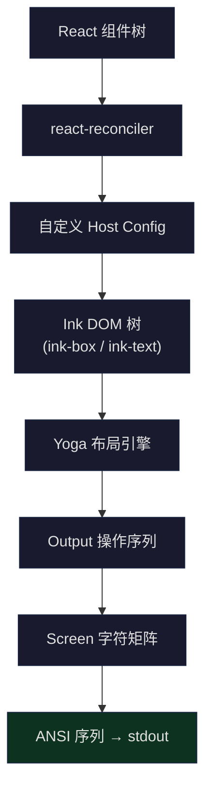
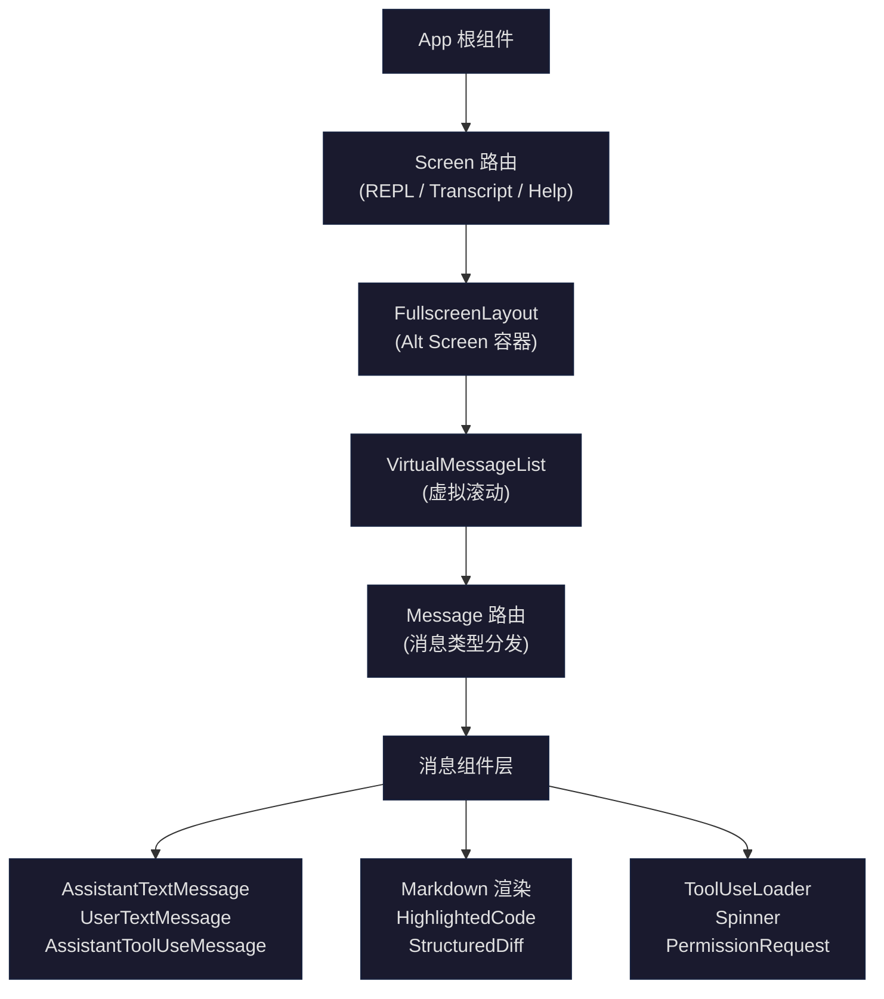

## 问题引入

当你在终端中运行 `claude` 命令时，看到的不是简陋的纯文本输出——而是带有语法高亮的代码块、实时跳动的加载动画、结构化的 diff 视图、可交互的权限对话框，以及流畅的虚拟滚动。这一切运行在一个没有浏览器、没有 DOM、没有 CSS 的环境中：你的终端。

这套终端 UI 背后是一个完整的 React 应用。Claude Code 将 React 的渲染目标从浏览器 DOM 切换为终端字符矩阵，通过自定义 reconciler 将 `<Box>` 和 `<Text>` 这样的组件转化为终端 ANSI 序列，构建了一套 140+ 组件的 UI 体系。它需要回答的核心问题是：

1. **渲染目标切换**：React reconciler 如何将组件树映射为终端像素（字符单元格）？布局引擎从 CSS 变成了什么？
2. **组件架构**：140+ 个组件如何组织？消息渲染、工具进度、diff 视图、权限对话框这些复杂 UI 如何在终端中实现？
3. **性能约束**：终端渲染帧率远低于浏览器 60fps，如何在 16ms 帧预算下完成布局计算、差异检测、终端写入？
4. **交互模型**：没有鼠标点击（大部分情况）、没有焦点切换，React Hooks 如何适配键盘优先的交互范式？

本文将从 Ink 框架的渲染管线开始，逐层深入到组件架构、核心 UI 剖析、Hooks 应用，最终讨论这套架构的限制与可迁移模式。

## Ink 框架概述：React 渲染目标从 DOM 变成终端字符

### 什么是 Ink

Ink 是一个将 React 的渲染目标从浏览器 DOM 替换为终端的框架。在浏览器中，React 通过 `react-dom` 将 `<div>`、`<span>` 渲染为 DOM 节点；在 Ink 中，React 通过自定义 reconciler 将 `<Box>`、`<Text>` 渲染为终端字符。Claude Code 在 Ink 的基础上做了大量深度定制——`src/ink/` 目录包含了完整的渲染引擎，而非简单引用 npm 包。

核心思路可以用一句话概括：**React 提供声明式 UI 编程模型，Ink 提供终端渲染后端**。



### 渲染管线：从 JSX 到终端像素

整个渲染管线分为六个阶段：

**阶段 1：React Reconciliation**

React 的 reconciler 将 JSX 组件树与上一帧的 Fiber 树进行 diff，产生一系列 DOM 操作（创建、更新、删除节点）。Claude Code 使用 `react-reconciler` 库创建自定义 reconciler：

```typescript
// src/ink/reconciler.ts (L224-239)
const reconciler = createReconciler<
  ElementNames,
  Props,
  DOMElement,
  DOMElement,
  TextNode,
  DOMElement,
  unknown,
  unknown,
  DOMElement,
  HostContext,
  null, // UpdatePayload - not used in React 19
  NodeJS.Timeout,
  -1,
  null
>({
  getRootHostContext: () => ({ isInsideText: false }),
  // ...
})
```

这个 reconciler 实现了 `createInstance`、`commitUpdate`、`removeChild` 等方法，将 React 的操作翻译为对 Ink DOM 树的操作。每一种 JSX 元素对应一种 Ink 节点类型：

```typescript
// src/ink/dom.ts (L19-27)
export type ElementNames =
  | 'ink-root'
  | 'ink-box'
  | 'ink-text'
  | 'ink-virtual-text'
  | 'ink-link'
  | 'ink-progress'
  | 'ink-raw-ansi'
```

注意 `HostContext` 的 `isInsideText` 字段——它禁止在 `<Text>` 内部嵌套 `<Box>`，这是终端渲染的一个基本约束（文本节点内不能有块级布局）：

```typescript
// src/ink/reconciler.ts (L331-340)
createInstance(
  originalType: ElementNames,
  newProps: Props,
  _root: DOMElement,
  hostContext: HostContext,
): DOMElement {
  if (hostContext.isInsideText && originalType === 'ink-box') {
    throw new Error(`<Box> can't be nested inside <Text> component`)
  }
  // ...
}
```

**阶段 2：Yoga 布局计算**

Ink DOM 树中的每个节点关联一个 Yoga 布局节点。Yoga 是 Facebook 开发的跨平台 Flexbox 布局引擎（最初为 React Native 设计）。在 reconciler 的 `resetAfterCommit` 中，布局计算被触发：

```typescript
// src/ink/reconciler.ts (L247-279)
resetAfterCommit(rootNode) {
  // ...
  if (typeof rootNode.onComputeLayout === 'function') {
    rootNode.onComputeLayout()
  }
  // ...
  rootNode.onRender?.()
}
```

`onComputeLayout` 调用 Yoga 的 `calculateLayout()` 方法，为每个节点计算出精确的 `x, y, width, height`——类似于浏览器的 CSS Flexbox 布局，但输出单位是终端字符单元格而非像素。

**阶段 3：渲染为 Output 操作**

布局完成后，`renderNodeToOutput` 遍历 Ink DOM 树，将每个可见节点转化为 `Output` 操作（write、clip、blit、clear 等）。这个阶段还处理了滚动、边框绘制、文本换行等终端特有逻辑：

```typescript
// src/ink/render-node-to-output.ts (L1-18)
import indentString from 'indent-string'
import { applyTextStyles } from './colorize.js'
import type { DOMElement } from './dom.js'
import getMaxWidth from './get-max-width.js'
import type { Rectangle } from './layout/geometry.js'
import { LayoutDisplay, LayoutEdge, type LayoutNode } from './layout/node.js'
import { nodeCache, pendingClears } from './node-cache.js'
import type Output from './output.js'
import renderBorder from './render-border.js'
import type { Screen } from './screen.js'
import {
  type StyledSegment,
  squashTextNodesToSegments,
} from './squash-text-nodes.js'
import type { Color } from './styles.js'
import { isXtermJs } from './terminal.js'
import { widestLine } from './widest-line.js'
import wrapText from './wrap-text.js'
```

关键优化：**blit（块传输）**。如果一个节点的位置和内容都没有变化，直接从上一帧的 Screen 缓冲区复制该区域的字符数据，跳过整个子树的渲染。这让稳态帧（只有 spinner 在跳动）的渲染成本趋近 O(changed cells) 而非 O(total cells)。

**阶段 4：Screen 缓冲区生成**

`Output` 操作被应用到 `Screen` 对象——一个二维字符矩阵。Screen 使用了池化和 interning 机制来优化内存：

```typescript
// src/ink/screen.ts (L21-53)
export class CharPool {
  private strings: string[] = [' ', ''] // Index 0 = space, 1 = empty
  private stringMap = new Map<string, number>([
    [' ', 0],
    ['', 1],
  ])
  private ascii: Int32Array = initCharAscii()

  intern(char: string): number {
    // ASCII fast-path: direct array lookup instead of Map.get
    if (char.length === 1) {
      const code = char.charCodeAt(0)
      if (code < 128) {
        const cached = this.ascii[code]!
        if (cached !== -1) return cached
        const index = this.strings.length
        this.strings.push(char)
        this.ascii[code] = index
        return index
      }
    }
    // ...
  }
}
```

每个字符位置存储的不是字符串本身，而是 `CharPool` 中的整数索引。这让帧间差异比较变成整数比较而非字符串比较——这是一个关键的性能优化。

**阶段 5：双缓冲帧差异**

`createRenderer` 维护前后两帧的 Screen 缓冲区，实现双缓冲：

```typescript
// src/ink/renderer.ts (L31-38)
export default function createRenderer(
  node: DOMElement,
  stylePool: StylePool,
): Renderer {
  let output: Output | undefined
  return options => {
    const { frontFrame, backFrame, isTTY, terminalWidth, terminalRows } =
      options
    // ...
  }
}
```

`LogUpdate` 类负责将两帧之间的差异转化为最小的终端写入操作——只更新实际变化的字符单元格，而非重绘整个屏幕。

**阶段 6：终端写入**

最终的 ANSI 序列通过 `stdout.write()` 发送到终端。渲染帧率通过 `throttle` 控制，默认间隔定义在 `FRAME_INTERVAL_MS` 中。

### 渲染管线完整流程


## `ink/` 目录的渲染器封装

`src/ink/` 目录包含 40+ 个文件，构成一个完整的终端渲染引擎。这不是对 npm `ink` 包的简单引用——Claude Code 团队 fork 并深度定制了整个渲染层。以下是核心模块的职责划分：

| 模块 | 文件 | 职责 |
|------|------|------|
| DOM 抽象 | `dom.ts` | 定义 Ink 节点类型、属性设置、子节点操作、dirty 标记 |
| Reconciler | `reconciler.ts` | React 19 reconciler host config，桥接 React Fiber 与 Ink DOM |
| 布局引擎 | `layout/` | Yoga Flexbox 引擎的 TypeScript 封装 |
| 样式系统 | `styles.ts` | Flexbox 属性（flex、margin、padding、border）映射到 Yoga 节点 |
| 渲染器 | `renderer.ts` | 从 Ink DOM 树生成 Screen 缓冲区 |
| 输出管线 | `output.ts` | 收集 write/blit/clip 操作并应用到 Screen |
| Screen | `screen.ts` | 二维字符矩阵，CharPool/StylePool/HyperlinkPool 池化 |
| 帧差异 | `log-update.ts` | 前后帧 Screen 差异 → 最小 ANSI 序列 |
| 节点渲染 | `render-node-to-output.ts` | Ink DOM 树遍历，处理 blit、scroll、border |
| 文本处理 | `squash-text-nodes.ts`, `wrap-text.ts`, `measure-text.ts` | 文本节点合并、换行、测量 |
| 字符宽度 | `stringWidth.ts`, `widest-line.ts` | Unicode 全角/半角、emoji 宽度计算 |
| 终端抽象 | `terminal.ts`, `termio/` | ANSI CSI/DEC/OSC 序列生成，终端能力探测 |
| 事件系统 | `events/` | 键盘事件分发、事件冒泡/捕获 |
| 焦点管理 | `focus.ts` | Tab 焦点链、autoFocus |
| 选择/搜索 | `selection.ts`, `searchHighlight.ts` | 文本选择（鼠标拖拽）、搜索高亮 |
| 组件库 | `components/` | Box、Text、ScrollBox、Link 等基础组件 |

### Ink 实例的生命周期

`ink.tsx` 是渲染引擎的核心类（1722 行），管理着整个 Ink 实例的生命周期：

```typescript
// src/ink/root.ts (L76-96)
export const renderSync = (
  node: ReactNode,
  options?: NodeJS.WriteStream | RenderOptions,
): Instance => {
  const opts = getOptions(options)
  const inkOptions: InkOptions = {
    stdout: process.stdout,
    stdin: process.stdin,
    stderr: process.stderr,
    exitOnCtrlC: true,
    patchConsole: true,
    ...opts,
  }

  const instance: Ink = getInstance(
    inkOptions.stdout,
    () => new Ink(inkOptions),
  )

  instance.render(node)
  // ...
}
```

`Ink` 类在 `ink.tsx` 中实现了以下关键职责：

1. **创建 React container**：通过 reconciler 创建 ConcurrentRoot（React 19 并发模式）
2. **帧调度**：throttle 渲染帧到固定间隔，避免过度渲染
3. **双缓冲管理**：交替使用 frontFrame / backFrame 两个 Screen 缓冲区
4. **输入处理**：从 stdin 读取原始按键，解析为 KeyboardEvent，通过 Dispatcher 分发
5. **鼠标/选择**：支持终端鼠标事件，实现文本选择和拖拽
6. **终端模式**：Alt Screen 支持、Kitty 键盘协议、修饰键协议
7. **调试工具**：commit 日志、Yoga 计数器、重绘调试

### 样式系统

Ink 的样式系统是 CSS Flexbox 的子集。`styles.ts` 定义了可用的样式属性，并将它们映射到 Yoga 布局节点：

```typescript
// src/ink/styles.ts (L55-61)
export type Styles = {
  readonly textWrap?:
    | 'wrap'
    | 'wrap-trim'
    | 'end'
    | 'middle'
  // ...flexDirection, alignItems, justifyContent, width, height,
  // minWidth, minHeight, padding*, margin*, border*, position, overflow...
}
```

颜色系统支持多种格式：

```typescript
// src/ink/styles.ts (L15-37)
export type RGBColor = `rgb(${number},${number},${number})`
export type HexColor = `#${string}`
export type Ansi256Color = `ansi256(${number})`
export type AnsiColor =
  | 'ansi:black'
  | 'ansi:red'
  | 'ansi:green'
  // ...16 种 ANSI 颜色
```

文本样式通过 `TextStyles` 类型定义，支持 bold、dim、italic、underline、strikethrough、inverse——这些直接映射到 ANSI SGR 转义序列。

## 140+ 组件的组织方式

Claude Code 的 `src/components/` 目录包含 144 个文件/目录，构成了一个层次分明的组件体系。

### 组件分层架构



### 基础层：Ink 原生组件

位于 `src/ink/components/`，共 18 个文件：

- **`Box.tsx`**：对应 HTML 的 `<div>`，支持 Flexbox 布局
- **`Text.tsx`**：对应 HTML 的 `<span>`，支持颜色、粗体、斜体等文本样式
- **`ScrollBox.tsx`**：带有滚动支持的 Box，实现了 `overflow: scroll` 语义
- **`Link.tsx`**：终端超链接（OSC 8 协议）
- **`RawAnsi.tsx`**：直接输出原始 ANSI 序列（绕过 Ink 的文本处理）
- **`AlternateScreen.tsx`**：切换到终端 Alt Screen（全屏模式）
- **`Spacer.tsx`**：Flexbox spacer，`flex: 1` 的简写

这些基础组件确立了终端 UI 的布局原语。`Box` 支持的属性子集几乎覆盖了 Flexbox 的全部能力：

```tsx
<Box
  flexDirection="column"
  padding={1}
  borderStyle="round"
  borderColor="cyan"
  width="100%"
>
  <Text bold color="green">标题</Text>
  <Text dimColor>描述文字</Text>
</Box>
```

### 应用层：业务组件

`src/components/` 中的 140+ 文件按功能域组织为多个子目录和独立文件：

| 功能域 | 组件/目录 | 数量 | 职责 |
|--------|----------|------|------|
| 消息渲染 | `messages/`, `Message.tsx`, `Messages.tsx` | ~15 | 各类消息（用户、助手、系统、工具结果）的渲染 |
| 权限系统 | `permissions/` | ~30 | 工具执行权限对话框（Bash、FileEdit、WebFetch 等） |
| Diff 视图 | `StructuredDiff/`, `diff/`, `FileEditToolDiff.tsx` | ~5 | 文件编辑的差异展示 |
| Spinner/进度 | `Spinner/`, `ToolUseLoader.tsx`, `AgentProgressLine.tsx` | ~12 | 加载动画、工具执行进度 |
| 输入 | `PromptInput/`, `TextInput.tsx`, `VimTextInput.tsx` | ~5 | 用户输入框（支持 Vim 模式） |
| 对话框 | `*Dialog.tsx` | ~15 | 各类模态对话框（模型选择、设置、导出等） |
| 导航 | `FullscreenLayout.tsx`, `VirtualMessageList.tsx` | ~3 | 全屏布局、虚拟滚动、屏幕管理 |
| 设计系统 | `design-system/` | ~5 | 主题色、排版组件、通用 UI 模式 |
| Markdown | `Markdown.tsx`, `MarkdownTable.tsx` | 2 | Markdown 终端渲染 |
| 代码高亮 | `HighlightedCode/` | ~2 | 语法高亮代码块 |
| 任务管理 | `tasks/`, `TaskListV2.tsx` | ~5 | 后台任务列表、Agent 状态 |
| Shell | `shell/` | ~3 | Shell 命令输出渲染 |

### 消息类型路由

`Message.tsx` 是消息渲染的核心路由组件。它根据消息类型和内容块类型分发到不同的子组件：

```typescript
// src/components/Message.tsx (L58-80)
function MessageImpl(t0) {
  const {
    message,
    lookups,
    containerWidth,
    addMargin,
    tools,
    commands,
    verbose,
    inProgressToolUseIDs,
    progressMessagesForMessage,
    shouldAnimate,
    shouldShowDot,
    style,
    width,
    isTranscriptMode,
    // ...
  } = t0;
```

消息分发逻辑处理以下类型：

- **用户文本消息** → `UserTextMessage`
- **用户图片消息** → `UserImageMessage`
- **助手文本输出** → `AssistantTextMessage` → `Markdown`
- **助手工具调用** → `AssistantToolUseMessage` → 各工具专属渲染组件
- **工具执行结果** → `UserToolResultMessage`
- **助手思考过程** → `AssistantThinkingMessage`
- **系统消息** → `SystemTextMessage`
- **附件消息** → `AttachmentMessage`
- **折叠的读取/搜索组** → `CollapsedReadSearchContent`
- **分组的工具调用** → `GroupedToolUseContent`

## 核心 UI 组件剖析

### Markdown 终端渲染

`Markdown.tsx` 将 Markdown 文本渲染为终端格式化输出。它使用 `marked` 库做词法分析，然后将 Token 转化为 ANSI 格式化字符串：

```typescript
// src/components/Markdown.tsx (L17-71)
// Module-level token cache — marked.lexer is the hot cost on virtual-scroll
// remounts (~3ms per message). useMemo doesn't survive unmount→remount
const TOKEN_CACHE_MAX = 500;
const tokenCache = new Map<string, Token[]>();

// Characters that indicate markdown syntax. If none are present, skip the
// ~3ms marked.lexer call entirely — render as a single paragraph.
const MD_SYNTAX_RE = /[#*`|[>\-_~]|\n\n|^\d+\. |\n\d+\. /;

function hasMarkdownSyntax(s: string): boolean {
  return MD_SYNTAX_RE.test(s.length > 500 ? s.slice(0, 500) : s);
}

function cachedLexer(content: string): Token[] {
  // Fast path: plain text with no markdown syntax → single paragraph token.
  if (!hasMarkdownSyntax(content)) {
    return [{
      type: 'paragraph',
      raw: content,
      text: content,
      tokens: [{ type: 'text', raw: content, text: content }]
    } as Token];
  }
  // LRU cache with hash key...
}
```

三个关键的性能优化值得注意：

1. **快速路径检测**：先用正则检查前 500 个字符是否包含 Markdown 语法标记。大多数短消息是纯文本，可以完全跳过 `marked.lexer` 的 3ms 解析开销。

2. **LRU Token 缓存**：消息内容不可变，同一消息的 Markdown Token 可以跨帧复用。使用 content hash 作为 key（避免保留完整字符串导致的内存膨胀），最多缓存 500 条。

3. **混合渲染**：表格使用 React 组件 `<MarkdownTable>` 渲染（需要 Flexbox 对齐列），其他内容使用 ANSI 字符串直接输出（通过 `<Ansi>` 组件绕过 Ink 的文本处理）。

Markdown 渲染还集成了 `cli-highlight` 做代码块的语法高亮——代码围栏（` ``` `）中的内容会被按语言进行语法着色，通过 `Suspense` 异步加载高亮器避免阻塞首次渲染。

### 工具执行进度：Spinner 与 ToolUseLoader

工具执行时的实时反馈由两个组件协作完成：

**`ToolUseLoader`** 是一个极简的状态指示器——一个可闪烁的黑色圆点：

```typescript
// src/components/ToolUseLoader.tsx (源码)
export function ToolUseLoader({ isError, isUnresolved, shouldAnimate }) {
  const [ref, isBlinking] = useBlink(shouldAnimate)
  const color = isUnresolved ? undefined : isError ? "error" : "success"

  return (
    <Box ref={ref} minWidth={2}>
      <Text color={color} dimColor={isUnresolved}>
        {!shouldAnimate || isBlinking || isError || !isUnresolved
          ? BLACK_CIRCLE
          : ' '}
      </Text>
    </Box>
  )
}
```

注意代码注释中提到的 ANSI 样式冲突问题：`</dim>` 和 `</bold>` 在 ANSI 中共享同一个重置码 `\x1b[22m`，chalk 无法区分它们。这导致 dim 后紧跟 bold 时，bold 文本也会变成 dim。解决方案是通过 `minWidth={2}` 的 `<Box>` 包裹，在 dim 和 bold 之间插入空白隔离。

**`Spinner`** 是一个复杂得多的组件（200+ 行），它显示：
- 动画帧（前后摇摆的字符序列）
- 当前操作描述（"Reading file...", "Running command..."）
- 已用时间
- Token 使用量
- Shimmer 效果（流式响应时）
- 后台 Agent 树状态

Spinner 使用 `useAnimationFrame` Hook 以固定间隔更新动画帧，而非依赖 `setInterval`——这与 Ink 的帧调度系统协调，避免不必要的 reconciliation。

### 文件 Diff 视图

`FileEditToolDiff.tsx` 展示文件编辑的差异视图。它使用 `Suspense` + `use()` 模式异步加载 diff 数据：

```typescript
// src/components/FileEditToolDiff.tsx (L23-52)
export function FileEditToolDiff(props) {
  const [dataPromise] = useState(() => loadDiffData(props.file_path, props.edits));

  return (
    <Suspense fallback={<DiffFrame placeholder={true} />}>
      <DiffBody promise={dataPromise} file_path={props.file_path} />
    </Suspense>
  )
}

function DiffBody({ promise, file_path }) {
  const { patch, firstLine, fileContent } = use(promise);
  const { columns } = useTerminalSize();

  return (
    <DiffFrame>
      <StructuredDiffList
        hunks={patch}
        dim={false}
        width={columns}
        filePath={file_path}
        firstLine={firstLine}
        fileContent={fileContent}
      />
    </DiffFrame>
  )
}
```

`StructuredDiffList` 组件将 diff hunks 渲染为终端格式的增删行视图，支持：
- 行号显示
- 增加行（绿色 `+`）/ 删除行（红色 `-`）的颜色编码
- 上下文行的灰色显示
- 根据终端宽度自动截断长行

### 权限对话框

权限系统是 Claude Code UI 中最复杂的交互模式之一。`PermissionRequest.tsx` 作为路由，根据工具类型分发到专属的权限请求组件：

```typescript
// src/components/permissions/PermissionRequest.tsx (L47-62)
function permissionComponentForTool(tool: Tool): ComponentType<PermissionRequestProps> {
  switch (tool) {
    case FileEditTool:
      return FileEditPermissionRequest;
    case FileWriteTool:
      return FileWritePermissionRequest;
    case BashTool:
      return BashPermissionRequest;
    case PowerShellTool:
      return PowerShellPermissionRequest;
    case WebFetchTool:
      return WebFetchPermissionRequest;
    // ... 12+ 种工具类型
  }
}
```

`permissions/` 目录包含约 30 个文件，每种需要权限的工具都有专门的对话框组件。以 `BashPermissionRequest` 为例，它展示：

1. 要执行的命令（带语法高亮）
2. 工作目录
3. 操作选项：允许一次 / 允许本会话 / 拒绝
4. 可选的规则说明（为什么需要权限）
5. Worker 标记（如果来自后台 Agent）

权限对话框使用 `useKeybinding` 注册快捷键处理（`y` 允许、`n` 拒绝、数字键选择选项），而非传统的表单交互。

### 虚拟滚动

当对话历史变长时，渲染所有消息会导致严重的性能问题。`VirtualMessageList` 配合 `useVirtualScroll` Hook 实现了虚拟滚动——只渲染视口附近的消息：

```typescript
// src/hooks/useVirtualScroll.ts (L18-57)
const DEFAULT_ESTIMATE = 3       // 未测量项的估计高度（行数）
const OVERSCAN_ROWS = 80         // 视口上下额外渲染的行数
const COLD_START_COUNT = 30      // ScrollBox 未布局时的初始渲染数
const SCROLL_QUANTUM = OVERSCAN_ROWS >> 1  // scrollTop 量化步长
const PESSIMISTIC_HEIGHT = 1     // 未测量项的最坏高度假设
const MAX_MOUNTED_ITEMS = 300    // 挂载项上限
const SLIDE_STEP = 25            // 每次 commit 最多新增挂载项
```

虚拟滚动的核心策略：

1. **高度估计**：未测量的项使用 `DEFAULT_ESTIMATE = 3` 行作为初始估计。故意偏低——高估会导致底部留白（过早停止挂载），低估只是多挂载几个项（被 overscan 吸收）。

2. **Overscan 缓冲**：视口上下各额外渲染 80 行的内容。因为消息高度差异极大（一条工具结果可能 100+ 行），需要足够大的缓冲。

3. **滚动量化**：`SCROLL_QUANTUM = 40` 行。每次滚动 wheel tick（3-5 像素）都触发 React commit 是不必要的——只要挂载范围不需要变化，视觉滚动由 ScrollBox 的 `forceRender` 处理（直接读 DOM 节点的 scrollTop，绕过 React）。

4. **渐进挂载**：`SLIDE_STEP = 25` 限制每次 commit 最多新增 25 个挂载项。防止快速滚动到全新区域时一次挂载 200+ 项导致的同步阻塞（每个 MessageRow 渲染约 1.5ms）。

5. **渲染时 clamp**：`scrollClampMin/Max` 在渲染时将 scrollTop 限制在已挂载内容的范围内。当 scrollTo 的写入先于 React 的异步 re-render 时，用户看到的是已挂载内容的边缘而非空白。

## React Hooks 在 CLI 中的应用

Claude Code 的 `src/hooks/` 目录包含 85 个 Hook，覆盖了从键盘交互、状态管理到 IDE 集成的各个方面。以下是最具代表性的几个。

### useGlobalKeybindings：全局快捷键

`useGlobalKeybindings.tsx` 注册了应用级别的快捷键处理器：

```typescript
// src/hooks/useGlobalKeybindings.tsx (L36-46)
/**
 * Registers global keybinding handlers for:
 * - ctrl+t: Toggle todo list
 * - ctrl+o: Toggle transcript mode
 * - ctrl+e: Toggle showing all messages in transcript
 * - ctrl+c/escape: Exit transcript mode
 */
export function GlobalKeybindingHandlers({
  screen, setScreen,
  showAllInTranscript, setShowAllInTranscript,
  messageCount,
  onEnterTranscript, onExitTranscript,
  virtualScrollActive, searchBarOpen,
}: Props): null {
```

注意这个组件的返回值——`null`。它是一个 **无渲染组件**（renderless component）：不产生任何 UI 输出，只通过 `useKeybinding` Hook 注册副作用。这种模式在 Claude Code 中被广泛使用：

- `GlobalKeybindingHandlers` → 全局快捷键
- `CancelRequestHandler` → 取消请求
- `ScrollKeybindingHandler` → 滚动控制
- `AutoUpdater` → 自动更新检查

这种模式的优势是将交互逻辑封装为可组合的 React 组件，享受 React 生命周期和状态管理的便利，同时避免了命令式事件监听器的注册/注销问题。

`ctrl+o` 的切换逻辑展示了状态机在 Hook 中的典型应用——它在 prompt、transcript、brief 三种视图之间切换，并处理了 feature flag 控制的 brief 模式的边界情况。

### useCancelRequest：请求取消

`useCancelRequest.ts` 是一个更复杂的例子，展示了 Hook 如何处理多优先级的键盘事件：

```typescript
// src/hooks/useCancelRequest.ts (L87-122)
const handleCancel = useCallback(() => {
  // Priority 1: If there's an active task running, cancel it first
  if (abortSignal !== undefined && !abortSignal.aborted) {
    logEvent('tengu_cancel', cancelProps)
    setToolUseConfirmQueue(() => [])
    onCancel()
    return
  }

  // Priority 2: Pop queue when Claude is idle
  if (hasCommandsInQueue()) {
    if (popCommandFromQueue) {
      popCommandFromQueue()
      return
    }
  }

  // Fallback: nothing to cancel or pop
  logEvent('tengu_cancel', cancelProps)
  setToolUseConfirmQueue(() => [])
  onCancel()
}, [abortSignal, popCommandFromQueue, setToolUseConfirmQueue, onCancel, streamMode])
```

取消逻辑有严格的优先级链：

1. 正在运行的任务 → 取消它
2. 命令队列中有待处理命令 → 弹出一个
3. 都没有 → 清空权限队列

更复杂的是 Escape 与 Ctrl+C 的区分：

```typescript
// src/hooks/useCancelRequest.ts (L129-154)
// Escape (chat:cancel) defers to mode-exit when in special mode
const isEscapeActive =
  isContextActive &&
  (canCancelRunningTask || hasQueuedCommands) &&
  !isInSpecialModeWithEmptyInput &&
  !isViewingTeammate

// Ctrl+C (app:interrupt): must NOT claim ctrl+c when main is idle
// at the prompt — that blocks the copy-selection handler
const isCtrlCActive =
  isContextActive &&
  (canCancelRunningTask || hasQueuedCommands || isViewingTeammate)
```

Escape 和 Ctrl+C 在不同上下文中有不同的行为：

- **Escape** 在特殊输入模式（bash/background mode）下让位给模式退出
- **Ctrl+C** 在查看 teammate 视图时，额外执行 kill agents + 退出 teammate 视图
- **Ctrl+C** 在主线程空闲时不可激活——否则会拦截文本复制和双击退出功能

### 后台 Agent 终止：两次按键确认模式

`useCancelRequest.ts` 还实现了一个巧妙的两次按键确认模式（`chat:killAgents`）：

```typescript
// src/hooks/useCancelRequest.ts (L225-266)
const handleKillAgents = useCallback(() => {
  const tasks = store.getState().tasks
  const hasRunningAgents = Object.values(tasks).some(
    t => t.type === 'local_agent' && t.status === 'running',
  )
  if (!hasRunningAgents) {
    addNotification({
      key: 'kill-agents-none',
      text: 'No background agents running',
      priority: 'immediate',
      timeoutMs: 2000,
    })
    return
  }
  const now = Date.now()
  const elapsed = now - lastKillAgentsPressRef.current
  if (elapsed <= KILL_AGENTS_CONFIRM_WINDOW_MS) {
    // Second press within window -- kill all background agents
    lastKillAgentsPressRef.current = 0
    removeNotification('kill-agents-confirm')
    killAllAgentsAndNotify()
    return
  }
  // First press -- show confirmation hint
  lastKillAgentsPressRef.current = now
  addNotification({
    key: 'kill-agents-confirm',
    text: `Press ${shortcut} again to stop background agents`,
    priority: 'immediate',
    timeoutMs: KILL_AGENTS_CONFIRM_WINDOW_MS,
  })
}, [store, addNotification, removeNotification, killAllAgentsAndNotify])
```

第一次按 `ctrl+x ctrl+k` 只显示提示通知，3 秒内再按一次才实际执行。这避免了误操作终止所有后台 Agent 的风险。`useRef` 存储上次按键时间——不用 state 是因为这个值不影响渲染。

### 更多有代表性的 Hooks

| Hook | 职责 | 关键技术点 |
|------|------|-----------|
| `useBlink` | 控制元素闪烁动画 | `useRef` + `requestAnimationFrame` 周期 |
| `useTerminalSize` | 跟踪终端尺寸变化 | 监听 `stdout.on('resize')` |
| `useVirtualScroll` | 虚拟滚动范围计算 | `useSyncExternalStore` 接入 ScrollBox |
| `useExitOnCtrlCD` | 双击 Ctrl+C/D 退出 | 时间窗口检测 + `useRef` |
| `useVimInput` | Vim 模式输入 | 模式状态机（NORMAL/INSERT/VISUAL） |
| `useDiffData` | 异步加载 diff 数据 | `useState(async)` + `Suspense` |
| `useElapsedTime` | 已用时间显示 | `useAnimationFrame` 驱动更新 |
| `useInputBuffer` | 输入缓冲与防抖 | 批量合并快速输入 |
| `usePasteHandler` | 粘贴检测与处理 | 区分打字与粘贴（时间阈值） |
| `useIDEIntegration` | IDE 连接状态 | WebSocket 事件桥接到 React state |

## Ink 的限制与变通

### 限制 1：没有 CSS 的完整能力

终端 Flexbox 只是 CSS Flexbox 的子集。不支持的特性：

- **Grid 布局**：只有 Flexbox，没有 CSS Grid
- **浮动/绝对定位**：Yoga 的 `position: absolute` 支持有限，且在终端中"绝对定位"意味着字符级覆盖
- **百分比高度**：在 scrollable 容器中计算百分比高度会导致布局循环
- **动画**：没有 CSS transition/animation，所有动画都是 JS 驱动（setInterval / requestAnimationFrame）

**变通方案**：
- 用 `flexDirection` + `alignItems` + `justifyContent` 组合模拟大部分布局需求
- 动画通过 `useBlink`、`useAnimationFrame` 等 Hook 手动控制
- 复杂布局（如权限对话框的多列选项）用嵌套 Box 实现

### 限制 2：终端渲染是全局的

浏览器中每个 DOM 元素独立渲染，但终端是一个全局字符矩阵。这意味着：

- **重绘范围**：任何节点的变化都可能触发整个 Screen 的重新计算
- **z-index 模拟**：`position: absolute` 的节点通过覆盖字符实现"层叠"，但移除时需要标记整帧为"被污染"，强制全量重绘

```typescript
// src/ink/render-node-to-output.ts (L129-135)
// Removing an absolute-positioned node poisons prevScreen: it may
// have painted over non-siblings (e.g. an overlay over a ScrollBox
// earlier in tree order), so their blits would restore the removed
// node's pixels.
const absoluteRemoved = consumeAbsoluteRemovedFlag()
renderNodeToOutput(node, output, {
  prevScreen: absoluteRemoved || options.prevFrameContaminated
    ? undefined
    : prevScreen,
})
```

**变通方案**：`blit` 优化在节点未变化时直接复制上一帧的数据。Layout shift 检测跟踪节点位置变化，只在必要时触发全量重绘。

### 限制 3：字符宽度不一致

Unicode 字符在不同终端中的宽度可能不同。CJK 字符（中日韩）占 2 个字符宽度，Emoji 可能占 1 或 2 个宽度，某些特殊字符（零宽连接符等）占 0 宽度。

```typescript
// src/ink/output.ts (L38-43)
type ClusteredChar = {
  value: string
  width: number    // 预计算的终端宽度
  styleId: number
  hyperlink: string | undefined
}
```

**变通方案**：`stringWidth.ts` 提供了精确的 Unicode 宽度计算，`ClusteredChar` 预计算并缓存每个字素簇的宽度，避免在渲染热路径中重复计算。

### 限制 4：ANSI 样式码冲突

前面提到的 bold/dim 重置码共享问题（`\x1b[22m`）是 ANSI 标准的历史遗留缺陷。chalk 库无法区分 `</bold>` 和 `</dim>`——关闭一个会同时关闭另一个。

**变通方案**：避免在相邻的内联元素间混用 bold 和 dim。需要混用时，用 `<Box>` 分隔（Block 级元素会重置 ANSI 状态）。`ToolUseLoader` 的 `minWidth={2}` 就是这种策略的实例。

### 限制 5：Alt Screen 高度约束

Alt Screen 模式下，内容高度必须精确等于终端行数。如果 Yoga 计算的高度超过终端行数，会导致游标位置错乱：

```typescript
// src/ink/renderer.ts (L97-104)
const height = options.altScreen ? terminalRows : yogaHeight
if (options.altScreen && yogaHeight > terminalRows) {
  logForDebugging(
    `alt-screen: yoga height ${yogaHeight} > terminalRows ${terminalRows} — ` +
    `something is rendering outside <AlternateScreen>. Overflow clipped.`,
    { level: 'warn' },
  )
}
```

**变通方案**：`<AlternateScreen>` 组件将子节点包裹在 `<Box height={rows} flexShrink={0}>` 中，强制高度等于终端行数。溢出的内容被静默裁剪，并输出警告日志。

## 可迁移模式

Claude Code 的终端 UI 架构中有多个模式值得在其他 CLI 项目中借鉴：

### 模式 1：无渲染组件（Renderless Components）

将交互逻辑封装为返回 `null` 的 React 组件：

```tsx
function MyKeybindingHandler({ onAction }): null {
  useKeybinding('action:trigger', onAction, {
    context: 'Global',
    isActive: true,
  })
  return null
}
```

优势：
- 享受 React 的生命周期管理（自动注销事件监听器）
- 可组合（与其他组件并行渲染）
- 可条件渲染（通过 `isActive` 或 `{condition && <Handler />}`）

### 模式 2：双缓冲 + 帧差异

维护两个 Screen 缓冲区，每帧只向终端写入变化的单元格：

```
帧 N:   [H][e][l][l][o][ ][ ]
帧 N+1: [H][e][l][l][o][!][ ]
差异:                   [!]    → 只写 1 个字符
```

这让稳态渲染（只有 spinner 在变化）的开销趋近 O(1)，而非 O(rows * cols)。

### 模式 3：虚拟滚动 + 渐进挂载

对于可能包含数百条消息的长对话：

1. 只挂载视口附近的消息（`useVirtualScroll`）
2. 用 spacer 填充未挂载区域
3. 快速滚动时渐进挂载（每帧最多 25 项）
4. 渲染时 clamp 防止空白闪烁

### 模式 4：Suspense 异步数据加载

用 `useState(() => promise)` + `use(promise)` + `<Suspense>` 处理异步数据：

```tsx
function DiffView({ file, edits }) {
  const [dataPromise] = useState(() => loadDiffData(file, edits));
  return (
    <Suspense fallback={<Placeholder />}>
      <DiffBody promise={dataPromise} />
    </Suspense>
  )
}
```

这让 UI 在数据加载时显示 placeholder，加载完成后自动替换——与浏览器中的 Suspense 用法完全一致。

### 模式 5：两次确认的破坏性操作

对于不可逆操作（如终止所有后台 Agent），使用时间窗口内的二次确认：

```tsx
const CONFIRM_WINDOW_MS = 3000
const lastPressRef = useRef<number>(0)

const handleDangerousAction = useCallback(() => {
  const elapsed = Date.now() - lastPressRef.current
  if (elapsed <= CONFIRM_WINDOW_MS) {
    // Execute
    performAction()
    lastPressRef.current = 0
  } else {
    // Show hint
    lastPressRef.current = Date.now()
    showNotification("Press again to confirm")
  }
}, [])
```

### 模式 6：池化字符串 Interning

对于需要频繁比较的字符串（字符、样式、超链接），使用 intern pool 将字符串映射为整数 ID：

```typescript
class CharPool {
  private strings: string[] = [' ', '']
  private stringMap = new Map<string, number>()
  private ascii: Int32Array // ASCII 快速路径

  intern(char: string): number {
    if (char.length === 1) {
      const code = char.charCodeAt(0)
      if (code < 128) {
        const cached = this.ascii[code]!
        if (cached !== -1) return cached
        // ...
      }
    }
    // ...
  }
}
```

帧间差异比较变成整数比较（`===`）而非字符串比较，在百万次操作级别有显著的性能提升。

## 小结

Claude Code 的终端 UI 架构展示了一个深度定制的 React 终端渲染方案。从 `react-reconciler` 的自定义 host config，到 Yoga 布局引擎、双缓冲 Screen 差异、虚拟滚动，再到 140+ 业务组件和 85 个 Hooks——它是目前已知最复杂的终端 React 应用之一。

核心要点回顾：

1. **渲染管线**：JSX → React Reconcile → Ink DOM → Yoga Layout → Screen Buffer → ANSI diff → stdout，六阶段管线，blit 优化让稳态帧接近零成本
2. **组件架构**：基础层（Box/Text/ScrollBox）+ 应用层（Message/Permission/Diff/Spinner），消息路由按类型分发到专属渲染组件
3. **性能策略**：Markdown Token LRU 缓存、虚拟滚动渐进挂载、字符串池化 interning、滚动量化减少 React commit
4. **交互模式**：无渲染组件封装快捷键逻辑、多优先级取消链、时间窗口二次确认
5. **限制应对**：bold/dim ANSI 码冲突用 Box 隔离、Alt Screen 高度强制 clamp、absolute 节点移除标记全帧污染

这套架构证明了一个重要的观点：**React 的价值不仅在于 DOM 渲染，更在于其声明式编程模型和组件化架构**。将渲染目标替换为终端字符矩阵后，React 的状态管理、生命周期、Hooks、Suspense 等核心能力仍然完美适用——而这些能力正是构建复杂交互式 CLI 应用所急需的。
