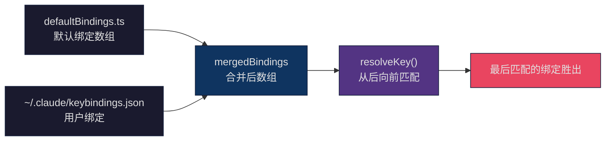
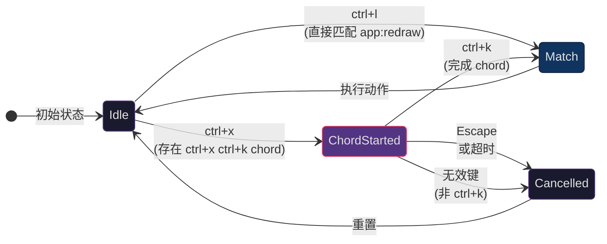
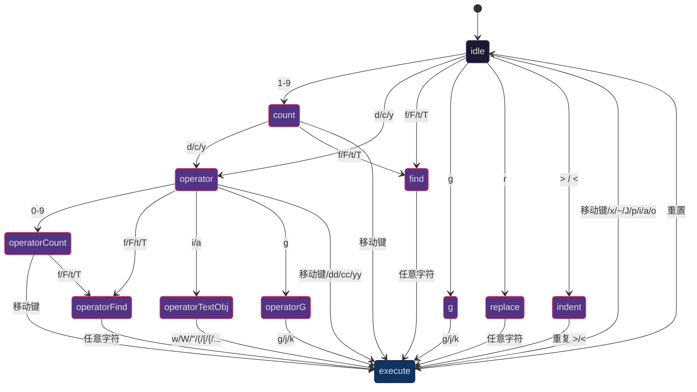
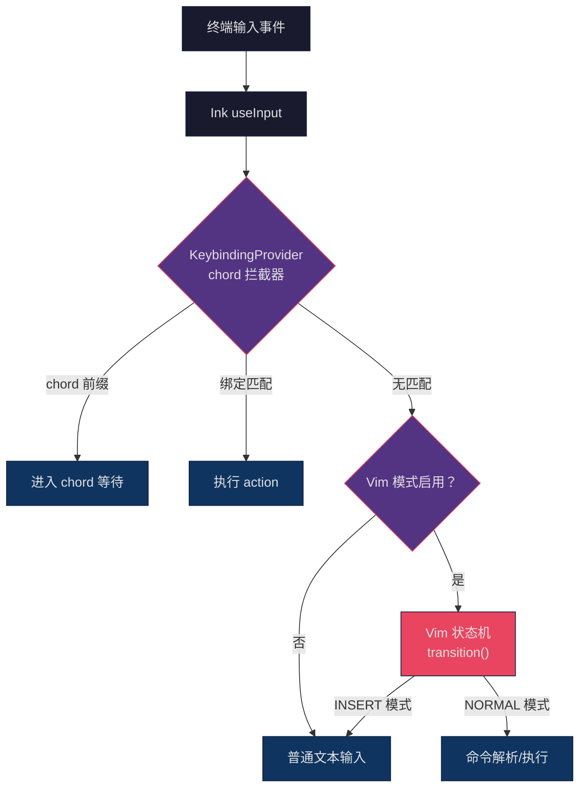

## 问题引入

在终端应用中，键盘是唯一的输入设备。与浏览器应用可以依赖鼠标点击、焦点切换、菜单系统不同，CLI 工具的每一个交互都必须映射到键盘操作。当一个 CLI 应用的功能复杂到包含 17 个上下文场景、70+ 个可绑定动作、多键组合序列（chord）、以及完整的 Vim 模态编辑时，键绑定系统就不再是"监听按键、执行动作"这么简单了。

Claude Code 的键绑定系统面临的核心挑战包括：

1. **分层覆盖**：默认绑定必须开箱即用，但用户应该能通过 `~/.claude/keybindings.json` 覆盖任意绑定——包括解绑（设为 `null`）。这种"默认 + 用户覆盖"的分层模型如何在运行时高效解析？
2. **上下文隔离**：同一个按键（如 `enter`）在聊天输入、确认对话框、自动补全菜单中应该触发完全不同的动作。17 个上下文如何互不干扰？
3. **多键组合（Chord）**：类似 VS Code 的 `Ctrl+K Ctrl+S` 这样的两步序列，在终端中如何实现？用户按下第一个键后，系统需要"等待"第二个键，同时不能误触发第一个键的单键绑定。
4. **Vim 模式状态机**：在 INSERT 和 NORMAL 两个模式之间切换，NORMAL 模式下需要解析 `d2w`（删除两个词）、`ciw`（修改内部词）这样的复合命令。一个字符序列如何驱动状态机转换？
5. **类型安全**：TypeScript 的类型系统如何确保每个状态转换都被穷举处理，不遗漏任何分支？

本文将从键绑定系统的配置层开始，逐步深入到解析引擎、chord 状态机、Vim 模式的状态机实现，最终讨论这些模式的可迁移性。

## 键绑定配置系统：~/.claude/keybindings.json

### 配置结构

Claude Code 的键绑定配置采用 JSON 文件格式，存储在 `~/.claude/keybindings.json`。文件结构使用 Zod schema 定义并在运行时验证：

```typescript
// src/keybindings/schema.ts (第 177-208 行)
export const KeybindingBlockSchema = lazySchema(() =>
  z.object({
    context: z.enum(KEYBINDING_CONTEXTS)
      .describe('UI context where these bindings apply'),
    bindings: z.record(
      z.string().describe('Keystroke pattern (e.g., "ctrl+k", "shift+tab")'),
      z.union([
        z.enum(KEYBINDING_ACTIONS),
        z.string().regex(/^command:[a-zA-Z0-9:\-_]+$/)
          .describe('Command binding (e.g., "command:help")'),
        z.null().describe('Set to null to unbind a default shortcut'),
      ])
    ),
  })
)
```

一个完整的配置文件示例：

```json
{
  "$schema": "https://www.schemastore.org/claude-code-keybindings.json",
  "$docs": "https://code.claude.com/docs/en/keybindings",
  "bindings": [
    {
      "context": "Chat",
      "bindings": {
        "ctrl+s": "chat:stash",
        "ctrl+x ctrl+e": "chat:externalEditor",
        "meta+p": null
      }
    },
    {
      "context": "Global",
      "bindings": {
        "ctrl+shift+f": "command:compact"
      }
    }
  ]
}
```

关键设计点：

- **`null` 解绑**：将某个按键绑定为 `null` 表示显式解绑该默认快捷键，按下时会被吞掉（不传递到其他处理器）
- **`command:` 前缀**：允许将按键绑定到斜杠命令，等价于在聊天中输入 `/compact`
- **`$schema` 元数据**：支持编辑器的 JSON Schema 验证和自动补全

### 17 个上下文

键绑定系统定义了 17 个上下文，每个上下文对应 UI 的一个状态：

```typescript
// src/keybindings/schema.ts (第 12-32 行)
export const KEYBINDING_CONTEXTS = [
  'Global',          // 全局生效
  'Chat',            // 聊天输入框
  'Autocomplete',    // 自动补全菜单
  'Confirmation',    // 确认/权限对话框
  'Help',            // 帮助覆盖层
  'Transcript',      // 对话记录查看
  'HistorySearch',   // 历史搜索 (ctrl+r)
  'Task',            // 任务/代理运行中
  'ThemePicker',     // 主题选择器
  'Settings',        // 设置菜单
  'Tabs',            // Tab 导航
  'Attachments',     // 图片附件导航
  'Footer',          // 页脚指示器
  'MessageSelector', // 消息选择器（回退对话框）
  'DiffDialog',      // Diff 对话框
  'ModelPicker',     // 模型选择器
  'Select',          // 通用列表选择组件
  'Plugin',          // 插件对话框
] as const
```

每个上下文有独立的绑定映射。当多个上下文同时激活时（例如 `Chat` + `Global`），解析器按上下文优先级匹配——更具体的上下文优先于 `Global`。

### 默认绑定：代码即配置

默认绑定定义在 `src/keybindings/defaultBindings.ts` 中，结构与用户配置完全相同。这个文件是键绑定的"出厂设置"：

```typescript
// src/keybindings/defaultBindings.ts (第 32-62 行)
export const DEFAULT_BINDINGS: KeybindingBlock[] = [
  {
    context: 'Global',
    bindings: {
      'ctrl+c': 'app:interrupt',
      'ctrl+d': 'app:exit',
      'ctrl+l': 'app:redraw',
      'ctrl+t': 'app:toggleTodos',
      'ctrl+o': 'app:toggleTranscript',
      'ctrl+r': 'history:search',
    },
  },
  {
    context: 'Chat',
    bindings: {
      escape: 'chat:cancel',
      'ctrl+x ctrl+k': 'chat:killAgents', // Chord binding!
      [MODE_CYCLE_KEY]: 'chat:cycleMode',
      enter: 'chat:submit',
      up: 'history:previous',
      'ctrl+s': 'chat:stash',
      [IMAGE_PASTE_KEY]: 'chat:imagePaste',
    },
  },
  // ... 15 more context blocks
]
```

注意 `'ctrl+x ctrl+k': 'chat:killAgents'` 这一行——这是一个 chord 绑定，用户需要先按 `Ctrl+X`，再按 `Ctrl+K` 才能触发。选择 `ctrl+x` 作为 chord 前缀是刻意的：它避免了与 readline 编辑键（`ctrl+a/b/e/f` 等）冲突。

平台自适应也内嵌在默认绑定中：

```typescript
// src/keybindings/defaultBindings.ts (第 15-30 行)
const IMAGE_PASTE_KEY = getPlatform() === 'windows' ? 'alt+v' : 'ctrl+v'

const MODE_CYCLE_KEY = SUPPORTS_TERMINAL_VT_MODE ? 'shift+tab' : 'meta+m'
```

Windows 上 `Ctrl+V` 被系统粘贴占用，所以图片粘贴改用 `Alt+V`；不支持 VT 模式的 Windows Terminal 上 `Shift+Tab` 不可靠，降级到 `Meta+M`。

## 分层覆盖：默认 + 用户绑定的合并策略

### "后者胜出"原则

键绑定合并采用简单但有效的策略——将用户绑定追加到默认绑定数组之后：

```typescript
// src/keybindings/loadUserBindings.ts (第 197 行)
const mergedBindings = [...defaultBindings, ...userParsed]
```

解析时从前到后遍历，**最后一个匹配的绑定胜出**。这意味着用户配置自动覆盖默认值，无需复杂的合并逻辑。



### 解析引擎

解析引擎的核心是 `resolveKey` 函数，它接收 Ink 的输入事件和当前活跃的上下文列表，返回匹配结果：

```typescript
// src/keybindings/resolver.ts (第 10-20 行)
export type ResolveResult =
  | { type: 'match'; action: string }
  | { type: 'none' }
  | { type: 'unbound' }

export type ChordResolveResult =
  | { type: 'match'; action: string }
  | { type: 'none' }
  | { type: 'unbound' }
  | { type: 'chord_started'; pending: ParsedKeystroke[] }
  | { type: 'chord_cancelled' }
```

五种结果类型覆盖了所有可能的情况：

- `match`：找到绑定，返回动作名
- `none`：无匹配，让其他处理器尝试
- `unbound`：显式解绑（用户设为 `null`），吞掉事件
- `chord_started`：当前按键可能是 chord 的前缀，进入等待状态
- `chord_cancelled`：chord 被取消（按了无效的第二键或 Escape）

### 按键解析器

按键字符串（如 `"ctrl+shift+k"`）被解析为结构化的 `ParsedKeystroke` 对象：

```typescript
// src/keybindings/parser.ts (第 13-75 行)
export function parseKeystroke(input: string): ParsedKeystroke {
  const parts = input.split('+')
  const keystroke: ParsedKeystroke = {
    key: '', ctrl: false, alt: false,
    shift: false, meta: false, super: false,
  }
  for (const part of parts) {
    const lower = part.toLowerCase()
    switch (lower) {
      case 'ctrl': case 'control':
        keystroke.ctrl = true; break
      case 'alt': case 'opt': case 'option':
        keystroke.alt = true; break
      case 'cmd': case 'command': case 'super': case 'win':
        keystroke.super = true; break
      case 'esc': keystroke.key = 'escape'; break
      case 'return': keystroke.key = 'enter'; break
      // ...
    }
  }
  return keystroke
}
```

解析器支持大量别名：`ctrl`/`control`、`alt`/`opt`/`option`、`cmd`/`command`/`super`/`win`。这使得用户可以用自己习惯的名称编写配置文件，不需要查文档确认"到底是 `alt` 还是 `option`"。

### 修饰键匹配的终端特异性

终端环境下的修饰键匹配有许多陷阱。`match.ts` 中的匹配逻辑处理了两个关键的终端怪癖：

```typescript
// src/keybindings/match.ts (第 60-79 行)
function modifiersMatch(inkMods: InkModifiers, target: ParsedKeystroke): boolean {
  if (inkMods.ctrl !== target.ctrl) return false
  if (inkMods.shift !== target.shift) return false

  // Alt 和 Meta 在终端中是同一个东西（key.meta = true）
  // 所以 "alt+k" 和 "meta+k" 匹配相同的输入
  const targetNeedsMeta = target.alt || target.meta
  if (inkMods.meta !== targetNeedsMeta) return false

  // Super (Cmd/Win) 是独立的修饰键
  // 只有支持 Kitty 键盘协议的终端才能发送
  if (inkMods.super !== target.super) return false

  return true
}
```

**Alt/Meta 合并**：传统终端无法区分 Alt 和 Meta 键——两者都发送 ESC 前缀序列。所以配置中 `alt+k` 和 `meta+k` 被视为等价。

**Escape 键特殊处理**：Ink 在收到 Escape 时会设置 `key.meta = true`（因为 ESC 序列是 Alt 键的底层表示）。如果不特殊处理，裸 `escape` 绑定永远不会匹配：

```typescript
// src/keybindings/match.ts (第 96-105 行)
export function matchesKeystroke(input: string, key: Key,
    target: ParsedKeystroke): boolean {
  const keyName = getKeyName(input, key)
  if (keyName !== target.key) return false
  const inkMods = getInkModifiers(key)
  // Escape 键时忽略 meta 修饰符
  if (key.escape) {
    return modifiersMatch({ ...inkMods, meta: false }, target)
  }
  return modifiersMatch(inkMods, target)
}
```

### 保留快捷键验证

某些快捷键不允许用户重绑定。`reservedShortcuts.ts` 定义了三类保留键：

```typescript
// src/keybindings/reservedShortcuts.ts (第 16-54 行)
// 不可重绑定 — 硬编码在 Claude Code 中
export const NON_REBINDABLE: ReservedShortcut[] = [
  { key: 'ctrl+c', reason: '中断/退出（硬编码）', severity: 'error' },
  { key: 'ctrl+d', reason: '退出（硬编码）', severity: 'error' },
  { key: 'ctrl+m', reason: '终端中等同于 Enter（都发送 CR）', severity: 'error' },
]

// 终端/OS 拦截 — 到不了应用
export const TERMINAL_RESERVED: ReservedShortcut[] = [
  { key: 'ctrl+z', reason: 'Unix SIGTSTP', severity: 'warning' },
  { key: 'ctrl+\\', reason: 'SIGQUIT', severity: 'error' },
]

// macOS 专属
export const MACOS_RESERVED: ReservedShortcut[] = [
  { key: 'cmd+c', reason: 'macOS 系统复制', severity: 'error' },
  { key: 'cmd+v', reason: 'macOS 系统粘贴', severity: 'error' },
  // ...
]
```

`ctrl+m` 的保留尤其值得注意——在终端中，`Ctrl+M` 发送的字节码（CR, 0x0D）与 Enter 键完全相同。如果允许将 `ctrl+m` 绑定到其他动作，Enter 键也会被劫持。

### 热重载与文件监听

用户修改 `keybindings.json` 后无需重启 Claude Code，文件监听器会自动重新加载：

```typescript
// src/keybindings/loadUserBindings.ts (第 386-396 行)
watcher = chokidar.watch(userPath, {
  persistent: true,
  ignoreInitial: true,
  awaitWriteFinish: {
    stabilityThreshold: FILE_STABILITY_THRESHOLD_MS, // 500ms
    pollInterval: FILE_STABILITY_POLL_INTERVAL_MS,     // 200ms
  },
})
watcher.on('add', handleChange)
watcher.on('change', handleChange)
watcher.on('unlink', handleDelete) // 删除文件 → 回退到默认
```

`awaitWriteFinish` 参数很关键——编辑器保存文件时可能先截断再写入，如果在截断和写入之间触发重载，会读到空文件。500ms 的稳定性阈值确保文件写入完成后才加载。

## Chord 绑定：多键组合的状态机

### 问题：前缀冲突

考虑以下绑定配置：

- `ctrl+x`: 某个单键动作
- `ctrl+x ctrl+k`: chord 绑定

当用户按下 `ctrl+x` 时，系统面临歧义：这是单键绑定的触发，还是 chord 的第一步？答案是 **chord 优先**——只要存在以当前按键为前缀的更长 chord，就进入等待状态。



### Chord 解析算法

`resolveKeyWithChordState` 函数实现了 chord 的完整解析逻辑：

```typescript
// src/keybindings/resolver.ts (第 166-244 行)
export function resolveKeyWithChordState(
  input: string, key: Key,
  activeContexts: KeybindingContextName[],
  bindings: ParsedBinding[],
  pending: ParsedKeystroke[] | null,  // 当前 chord 状态
): ChordResolveResult {
  // 1. Escape 取消 chord
  if (key.escape && pending !== null) {
    return { type: 'chord_cancelled' }
  }

  // 2. 构建当前测试序列
  const currentKeystroke = buildKeystroke(input, key)
  const testChord = pending
    ? [...pending, currentKeystroke]
    : [currentKeystroke]

  // 3. 检查是否可能是更长 chord 的前缀
  // 关键：null 覆盖也参与计算
  const chordWinners = new Map<string, string | null>()
  for (const binding of contextBindings) {
    if (binding.chord.length > testChord.length &&
        chordPrefixMatches(testChord, binding)) {
      chordWinners.set(chordToString(binding.chord), binding.action)
    }
  }
  // 只有存在非 null 的更长 chord 才等待
  let hasLongerChords = false
  for (const action of chordWinners.values()) {
    if (action !== null) { hasLongerChords = true; break }
  }

  // 4. 优先进入 chord 等待
  if (hasLongerChords) {
    return { type: 'chord_started', pending: testChord }
  }

  // 5. 检查完全匹配
  let exactMatch: ParsedBinding | undefined
  for (const binding of contextBindings) {
    if (chordExactlyMatches(testChord, binding)) {
      exactMatch = binding  // 最后一个胜出
    }
  }

  if (exactMatch) {
    return exactMatch.action === null
      ? { type: 'unbound' }
      : { type: 'match', action: exactMatch.action }
  }

  // 6. 无匹配 → 如果有 pending 则取消
  return pending !== null
    ? { type: 'chord_cancelled' }
    : { type: 'none' }
}
```

步骤 3 中的 `null` 覆盖处理值得注意。假设默认绑定有 `ctrl+x ctrl+k` → `chat:killAgents`，用户在配置中将其设为 `null`。如果不检查 `null`，按 `ctrl+x` 仍会进入 chord 等待——但第二步 `ctrl+k` 匹配到的动作是 `null`（解绑），用户永远无法使用 `ctrl+x` 的单键绑定。通过过滤掉全是 `null` 的 chord，系统正确地跳过等待。

### Chord 超时

在 `KeybindingProviderSetup.tsx` 中，chord 有 1 秒超时：

```typescript
// src/keybindings/KeybindingProviderSetup.tsx (第 30 行)
const CHORD_TIMEOUT_MS = 1000
```

如果用户按下 chord 前缀后 1 秒内没有按第二个键，chord 自动取消，按键恢复正常处理。

### useKeybinding Hook：React 中的绑定消费

组件通过 `useKeybinding` hook 注册键绑定处理器：

```typescript
// src/keybindings/useKeybinding.ts (第 33-97 行)
export function useKeybinding(
  action: string,
  handler: () => void | false | Promise<void>,
  options: Options = {},
): void {
  const { context = 'Global', isActive = true } = options
  const keybindingContext = useOptionalKeybindingContext()

  // 1. 注册 handler 到上下文（供 ChordInterceptor 使用）
  useEffect(() => {
    if (!keybindingContext || !isActive) return
    return keybindingContext.registerHandler({ action, context, handler })
  }, [action, context, handler, keybindingContext, isActive])

  // 2. 通过 useInput 拦截按键
  const handleInput = useCallback((input, key, event) => {
    const result = keybindingContext.resolve(input, key, uniqueContexts)

    switch (result.type) {
      case 'match':
        keybindingContext.setPendingChord(null)
        if (result.action === action) {
          if (handler() !== false) {
            event.stopImmediatePropagation()
          }
        }
        break
      case 'chord_started':
        keybindingContext.setPendingChord(result.pending)
        event.stopImmediatePropagation()
        break
      case 'unbound':
        keybindingContext.setPendingChord(null)
        event.stopImmediatePropagation() // 吞掉事件
        break
    }
  }, [action, context, handler, keybindingContext])

  useInput(handleInput, { isActive })
}
```

设计要点：

- **`stopImmediatePropagation()`**：匹配到绑定后阻止其他 `useInput` 处理器接收事件
- **`handler() !== false`**：handler 返回 `false` 表示"未消费"，事件继续传播。这用于场景如：滚动组件在内容不需要滚动时放行事件
- **批量注册**：`useKeybindings`（复数形式）允许一个 hook 调用注册多个绑定，减少 `useInput` 实例数

## Vim 模式：类型驱动的状态机

### /vim 命令切换

Vim 模式通过 `/vim` 斜杠命令开启/关闭：

```typescript
// src/commands/vim/vim.ts (第 8-38 行)
export const call: LocalCommandCall = async () => {
  const config = getGlobalConfig()
  let currentMode = config.editorMode || 'normal'

  // 向后兼容：'emacs' 视为 'normal'
  if (currentMode === 'emacs') {
    currentMode = 'normal'
  }

  const newMode = currentMode === 'normal' ? 'vim' : 'normal'
  saveGlobalConfig(current => ({
    ...current,
    editorMode: newMode,
  }))

  return {
    type: 'text',
    value: `Editor mode set to ${newMode}. ${
      newMode === 'vim'
        ? 'Use Escape key to toggle between INSERT and NORMAL modes.'
        : 'Using standard (readline) keyboard bindings.'
    }`,
  }
}
```

模式设置持久化到全局配置，重启后仍然生效。曾经存在的 `emacs` 模式已被废弃，自动降级为 `normal`。

### VimState：顶层状态类型

Vim 的状态模型分为两层——顶层的 `VimState` 区分 INSERT/NORMAL 模式，NORMAL 模式内部是一个 `CommandState` 状态机：

```typescript
// src/vim/types.ts (第 49-52 行)
export type VimState =
  | { mode: 'INSERT'; insertedText: string }
  | { mode: 'NORMAL'; command: CommandState }
```

`INSERT` 模式跟踪 `insertedText`——用户在插入模式中输入的文本，用于 dot-repeat（`.` 命令重复上次编辑）。`NORMAL` 模式包含一个 `CommandState`，这是复合命令的解析状态机。

### CommandState：11 个状态的穷举联合

`CommandState` 是 Vim 模式的核心。它用 TypeScript 的联合类型（discriminated union）定义了 11 个状态，每个状态精确记录了"系统正在等待什么输入"：

```typescript
// src/vim/types.ts (第 59-76 行)
export type CommandState =
  | { type: 'idle' }
  | { type: 'count'; digits: string }
  | { type: 'operator'; op: Operator; count: number }
  | { type: 'operatorCount'; op: Operator; count: number; digits: string }
  | { type: 'operatorFind'; op: Operator; count: number; find: FindType }
  | { type: 'operatorTextObj'; op: Operator; count: number; scope: TextObjScope }
  | { type: 'find'; find: FindType; count: number }
  | { type: 'g'; count: number }
  | { type: 'operatorG'; op: Operator; count: number }
  | { type: 'replace'; count: number }
  | { type: 'indent'; dir: '>' | '<'; count: number }
```

每个状态的字段就是该状态的"已收集输入"。以复合命令 `d2w` 为例：

1. **idle**：初始状态
2. 按 `d` → **operator** `{ type: 'operator', op: 'delete', count: 1 }`
3. 按 `2` → **operatorCount** `{ type: 'operatorCount', op: 'delete', count: 1, digits: '2' }`
4. 按 `w` → **执行**：删除 2 个词（count = 1 * 2 = 2）

再看 `3ciw`：

1. **idle**：初始
2. 按 `3` → **count** `{ type: 'count', digits: '3' }`
3. 按 `c` → **operator** `{ type: 'operator', op: 'change', count: 3 }`
4. 按 `i` → **operatorTextObj** `{ type: 'operatorTextObj', op: 'change', count: 3, scope: 'inner' }`
5. 按 `w` → **执行**：修改 3 个内部词



### TypeScript 编译时穷举匹配

状态机的转换函数使用 TypeScript 的 `switch` 进行穷举匹配。如果添加了新的状态类型但忘记处理，编译器会报错：

```typescript
// src/vim/transitions.ts (第 59-88 行)
export function transition(
  state: CommandState,
  input: string,
  ctx: TransitionContext,
): TransitionResult {
  switch (state.type) {
    case 'idle':          return fromIdle(input, ctx)
    case 'count':         return fromCount(state, input, ctx)
    case 'operator':      return fromOperator(state, input, ctx)
    case 'operatorCount': return fromOperatorCount(state, input, ctx)
    case 'operatorFind':  return fromOperatorFind(state, input, ctx)
    case 'operatorTextObj': return fromOperatorTextObj(state, input, ctx)
    case 'find':          return fromFind(state, input, ctx)
    case 'g':             return fromG(state, input, ctx)
    case 'operatorG':     return fromOperatorG(state, input, ctx)
    case 'replace':       return fromReplace(state, input, ctx)
    case 'indent':        return fromIndent(state, input, ctx)
    // 无需 default — TypeScript 在此检查穷举性
    // 如果 CommandState 新增了类型，这里会编译报错
  }
}
```

每个 `from*` 函数返回 `TransitionResult`，它只有两个字段：

```typescript
// src/vim/transitions.ts (第 51-54 行)
export type TransitionResult = {
  next?: CommandState    // 转换到新状态
  execute?: () => void   // 执行动作
}
```

如果 `next` 存在，切换到新状态；如果 `execute` 存在，执行动作然后重置到 `idle`。两者可以同时存在，但在实践中每个转换只设置其中之一。

### 类型安全的按键分组

Vim 的按键分组使用 `as const satisfies` 模式，让 TypeScript 同时推导字面量类型和验证值类型：

```typescript
// src/vim/types.ts (第 125-133 行)
export const OPERATORS = {
  d: 'delete',
  c: 'change',
  y: 'yank',
} as const satisfies Record<string, Operator>

export function isOperatorKey(key: string): key is keyof typeof OPERATORS {
  return key in OPERATORS
}
```

`as const satisfies Record<string, Operator>` 做了两件事：
1. `as const`：保留字面量类型——`OPERATORS.d` 的类型是 `'delete'` 而非 `string`
2. `satisfies Record<string, Operator>`：验证所有值都是合法的 `Operator` 类型

`isOperatorKey` 是一个类型守卫（type guard）。在调用点，一旦通过守卫检查，TypeScript 会将 `key` 的类型从 `string` 收窄为 `'d' | 'c' | 'y'`，使得 `OPERATORS[key]` 可以安全索引。

### 复合命令解析：d2w 全流程

让我们跟踪 `d2w` 从按键到执行的完整路径：

**第一步：按 `d`**

进入 `fromIdle`，`isOperatorKey('d')` 返回 `true`：

```typescript
// src/vim/transitions.ts (第 103-105 行)
if (isOperatorKey(input)) {
  return { next: { type: 'operator', op: OPERATORS[input], count } }
}
```

状态变为 `{ type: 'operator', op: 'delete', count: 1 }`。

**第二步：按 `2`**

进入 `fromOperator`，数字匹配：

```typescript
// src/vim/transitions.ts (第 295-302 行)
if (/[0-9]/.test(input)) {
  return {
    next: {
      type: 'operatorCount',
      op: state.op, count: state.count, digits: input,
    },
  }
}
```

状态变为 `{ type: 'operatorCount', op: 'delete', count: 1, digits: '2' }`。

**第三步：按 `w`**

进入 `fromOperatorCount`，非数字输入触发执行：

```typescript
// src/vim/transitions.ts (第 325-330 行)
const motionCount = parseInt(state.digits, 10)  // 2
const effectiveCount = state.count * motionCount  // 1 * 2 = 2
const result = handleOperatorInput(state.op, effectiveCount, input, ctx)
```

`handleOperatorInput` 检测到 `w` 是简单移动：

```typescript
// src/vim/transitions.ts (第 229-230 行)
if (SIMPLE_MOTIONS.has(input)) {
  return { execute: () => executeOperatorMotion(op, input, count, ctx) }
}
```

`executeOperatorMotion('delete', 'w', 2, ctx)` 被调用——解析移动目标，计算操作范围，删除两个词。

### 移动函数：纯计算

移动解析是纯函数——不修改任何状态，只返回目标光标位置：

```typescript
// src/vim/motions.ts (第 13-25 行)
export function resolveMotion(key: string, cursor: Cursor, count: number): Cursor {
  let result = cursor
  for (let i = 0; i < count; i++) {
    const next = applySingleMotion(key, result)
    if (next.equals(result)) break  // 到达边界，停止
    result = next
  }
  return result
}
```

`break` 条件很重要——如果移动已经到达文本边界（如 `$` 在行尾），重复执行不会越界。`Cursor` 对象本身是不可变的，每次移动返回新的 Cursor 实例。

移动函数覆盖了 Vim 中最常用的移动：

```typescript
// src/vim/motions.ts (第 30-67 行)
function applySingleMotion(key: string, cursor: Cursor): Cursor {
  switch (key) {
    case 'h': return cursor.left()
    case 'l': return cursor.right()
    case 'j': return cursor.downLogicalLine()
    case 'k': return cursor.upLogicalLine()
    case 'gj': return cursor.down()         // 视觉行（换行后的下一行）
    case 'gk': return cursor.up()           // 视觉行
    case 'w': return cursor.nextVimWord()
    case 'b': return cursor.prevVimWord()
    case 'e': return cursor.endOfVimWord()
    case 'W': return cursor.nextWORD()      // WORD（空白分隔）
    case 'B': return cursor.prevWORD()
    case 'E': return cursor.endOfWORD()
    case '0': return cursor.startOfLogicalLine()
    case '^': return cursor.firstNonBlankInLogicalLine()
    case '$': return cursor.endOfLogicalLine()
    default:  return cursor
  }
}
```

注意 `j`/`k` 使用 `downLogicalLine`/`upLogicalLine`（按逻辑行移动），而 `gj`/`gk` 使用 `down`/`up`（按视觉行移动）。这是 Vim 在终端中的标准行为——当一行文本被终端换行后，`j` 跳到下一个逻辑行，`gj` 跳到换行后的下一个视觉行。

### 文本对象：iw, aw, i", a(

文本对象是 Vim 操作符的第二类目标。`ciw` 表示 change inner word（修改光标所在的词），`da"` 表示 delete around "（删除包括引号在内的引号块）：

```typescript
// src/vim/textObjects.ts (第 38-58 行)
export function findTextObject(
  text: string, offset: number,
  objectType: string, isInner: boolean,
): TextObjectRange {
  if (objectType === 'w')
    return findWordObject(text, offset, isInner, isVimWordChar)
  if (objectType === 'W')
    return findWordObject(text, offset, isInner, ch => !isVimWhitespace(ch))

  const pair = PAIRS[objectType]
  if (pair) {
    const [open, close] = pair
    return open === close
      ? findQuoteObject(text, offset, open, isInner)      // 引号类
      : findBracketObject(text, offset, open, close, isInner) // 括号类
  }
  return null
}
```

支持的文本对象类型：

```typescript
// src/vim/types.ts (第 164-180 行)
export const TEXT_OBJ_TYPES = new Set([
  'w', 'W',           // word / WORD
  '"', "'", '`',       // 引号
  '(', ')', 'b',       // 小括号（b 是别名）
  '[', ']',            // 方括号
  '{', '}', 'B',       // 大括号（B 是别名）
  '<', '>',            // 尖括号
])
```

括号匹配使用经典的深度计数算法——向前找到 `depth === 0` 的开括号，向后找到 `depth === 0` 的闭括号：

```typescript
// src/vim/textObjects.ts (第 149-186 行)
function findBracketObject(text, offset, open, close, isInner) {
  let depth = 0, start = -1
  // 向前搜索开括号
  for (let i = offset; i >= 0; i--) {
    if (text[i] === close && i !== offset) depth++
    else if (text[i] === open) {
      if (depth === 0) { start = i; break }
      depth--
    }
  }
  if (start === -1) return null

  // 向后搜索闭括号
  depth = 0; let end = -1
  for (let i = start + 1; i < text.length; i++) {
    if (text[i] === open) depth++
    else if (text[i] === close) {
      if (depth === 0) { end = i; break }
      depth--
    }
  }
  if (end === -1) return null

  return isInner
    ? { start: start + 1, end }     // inner: 不含括号
    : { start, end: end + 1 }       // around: 含括号
}
```

### 操作符执行：OperatorContext

操作符的执行通过 `OperatorContext` 接口与编辑器通信：

```typescript
// src/vim/operators.ts (第 26-37 行)
export type OperatorContext = {
  cursor: Cursor              // 当前光标
  text: string                // 当前文本
  setText: (text: string) => void  // 设置新文本
  setOffset: (offset: number) => void  // 移动光标
  enterInsert: (offset: number) => void  // 进入 INSERT 模式
  getRegister: () => string    // 获取寄存器内容
  setRegister: (content: string, linewise: boolean) => void
  getLastFind: () => { type: FindType; char: string } | null
  setLastFind: (type: FindType, char: string) => void
  recordChange: (change: RecordedChange) => void  // dot-repeat 记录
}
```

这个接口是 Vim 引擎和 UI 组件之间的契约。Vim 状态机本身不知道文本存储在哪里、光标如何渲染——它只通过这个接口操作。这使得 Vim 引擎可以独立测试，不依赖 React 组件。

### RecordedChange：Dot-Repeat 的记忆

每次编辑操作都记录为 `RecordedChange`，供 `.` 命令（dot-repeat）重放：

```typescript
// src/vim/types.ts (第 92-119 行)
export type RecordedChange =
  | { type: 'insert'; text: string }
  | { type: 'operator'; op: Operator; motion: string; count: number }
  | { type: 'operatorTextObj'; op: Operator; objType: string;
      scope: TextObjScope; count: number }
  | { type: 'operatorFind'; op: Operator; find: FindType;
      char: string; count: number }
  | { type: 'replace'; char: string; count: number }
  | { type: 'x'; count: number }
  | { type: 'toggleCase'; count: number }
  | { type: 'indent'; dir: '>' | '<'; count: number }
  | { type: 'openLine'; direction: 'above' | 'below' }
  | { type: 'join'; count: number }
```

10 种变体覆盖了所有可重复的编辑类型。当用户按 `.` 时，系统读取 `lastChange` 并重放对应的操作。注意 `insert` 变体——当用户从 INSERT 模式回到 NORMAL 模式时，整个插入会话的文本被记录为一个 `RecordedChange`，`.` 会重新插入同样的文本。

### PersistentState：跨命令记忆

某些状态需要在命令之间持久化——寄存器（剪贴板）、上次查找、上次编辑：

```typescript
// src/vim/types.ts (第 81-86 行)
export type PersistentState = {
  lastChange: RecordedChange | null   // dot-repeat
  lastFind: { type: FindType; char: string } | null  // ;/, 重复查找
  register: string                     // 默认寄存器
  registerIsLinewise: boolean          // 寄存器内容是否整行
}
```

`registerIsLinewise` 影响粘贴行为——整行内容粘贴时会在新行插入，非整行内容会在光标后内联插入。

### 数字上限：MAX_VIM_COUNT

为了防止恶意输入（如 `99999999dw` 导致长时间计算），数字计数有上限：

```typescript
// src/vim/types.ts (第 182 行)
export const MAX_VIM_COUNT = 10000
```

```typescript
// src/vim/transitions.ts (第 271-273 行)
const newDigits = state.digits + input
const count = Math.min(parseInt(newDigits, 10), MAX_VIM_COUNT)
return { next: { type: 'count', digits: String(count) } }
```

## 键绑定与 Vim 模式的协作

### 分层输入处理

键绑定系统和 Vim 模式在输入处理中有明确的分层关系：



关键规则：
1. **键绑定优先于 Vim**：`ctrl+c`、`ctrl+d` 等系统快捷键始终由键绑定系统处理，不会进入 Vim 状态机
2. **Vim INSERT 模式 = 普通输入**：在 INSERT 模式下，按键作为文本输入处理
3. **Vim NORMAL 模式 = 命令解析**：在 NORMAL 模式下，每个按键驱动 CommandState 状态机

### 上下文注册机制

组件通过 `KeybindingContext` 注册和注销活跃上下文：

```typescript
// src/keybindings/KeybindingContext.tsx
type KeybindingContextValue = {
  registerActiveContext: (context: KeybindingContextName) => void
  unregisterActiveContext: (context: KeybindingContextName) => void
  activeContexts: Set<KeybindingContextName>
  // ...
}
```

当 Autocomplete 菜单弹出时，它注册 `'Autocomplete'` 上下文；菜单消失时注销。这确保 `tab` 键在自动补全可见时执行 `autocomplete:accept`，而非其他动作。

## 验证与诊断

### 多层验证

用户配置文件经过四层验证：

1. **结构验证**：JSON 解析 + `isKeybindingBlock` 类型守卫
2. **上下文验证**：检查 context 名称是否合法
3. **重复检测**：通过原始 JSON 字符串扫描检测同一 context 内的重复键名（`JSON.parse` 会静默使用最后一个值）
4. **保留键检查**：警告或阻止绑定到系统保留的快捷键

```typescript
// src/keybindings/validate.ts (第 425-451 行)
export function validateBindings(
  userBlocks: unknown,
  _parsedBindings: ParsedBinding[],
): KeybindingWarning[] {
  const warnings: KeybindingWarning[] = []
  warnings.push(...validateUserConfig(userBlocks))
  if (isKeybindingBlockArray(userBlocks)) {
    warnings.push(...checkDuplicates(userBlocks))
    const userBindings = getUserBindingsForValidation(userBlocks)
    warnings.push(...checkReservedShortcuts(userBindings))
  }
  // 去重：相同 key+context+type 只报一次
  const seen = new Set<string>()
  return warnings.filter(w => {
    const key = `${w.type}:${w.key}:${w.context}`
    if (seen.has(key)) return false
    seen.add(key)
    return true
  })
}
```

### JSON 重复键检测

这是一个容易被忽略的陷阱。JSON 规范允许对象中存在重复键，`JSON.parse` 静默使用最后一个值。用户可能不知道自己的配置被部分忽略了：

```typescript
// src/keybindings/validate.ts (第 258-307 行)
export function checkDuplicateKeysInJson(jsonString: string): KeybindingWarning[] {
  const bindingsBlockPattern =
    /"bindings"\s*:\s*\{([^{}]*(?:\{[^{}]*\}[^{}]*)*)\}/g

  // 对每个 bindings 块，用正则提取所有键名，检测重复
  let blockMatch
  while ((blockMatch = bindingsBlockPattern.exec(jsonString)) !== null) {
    const keyPattern = /"([^"]+)"\s*:/g
    const keysByName = new Map<string, number>()
    // ...
    if (count === 2) {
      warnings.push({
        type: 'duplicate',
        severity: 'warning',
        message: `Duplicate key "${key}" in ${context} bindings`,
        suggestion: `JSON uses the last value, earlier values are ignored.`,
      })
    }
  }
}
```

注意这个检测是在原始 JSON 字符串上做的——必须在 `JSON.parse` 之前，因为解析后重复键已经丢失了。

## 可迁移模式

Claude Code 的键绑定和 Vim 模式实现中有几个值得迁移到其他项目的通用模式。

### 模式 1：分层配置覆盖

"默认 + 用户覆盖"的模式适用于任何需要用户自定义的配置系统：

```
mergedConfig = [...defaults, ...userOverrides]
resolve(key) → 从后向前找第一个匹配
```

优点是实现简单（数组拼接），语义清晰（后者胜出），且支持 `null` 解绑。这个模式可以直接用于 VS Code 扩展、Electron 应用、甚至 Web 应用的快捷键系统。

### 模式 2：Discriminated Union 状态机

TypeScript 的联合类型天然适合状态机建模：

```typescript
type State =
  | { type: 'idle' }
  | { type: 'loading'; url: string }
  | { type: 'success'; data: T }
  | { type: 'error'; message: string }

function transition(state: State, event: Event): State {
  switch (state.type) {
    case 'idle': // TypeScript 知道 state 只有 type 字段
    case 'loading': // TypeScript 知道 state 有 url 字段
    // 遗漏任何 case → 编译错误
  }
}
```

Claude Code 的 Vim 实现证明了这种模式可以扩展到 11 个状态、50+ 种转换的复杂状态机，同时保持类型安全。

### 模式 3：Context + Hook 的事件分发

React 中的事件分发模式——通过 Context 注册处理器，useInput hook 分发事件——可以用于任何需要"多组件监听同一事件源"的场景。关键设计点：

- 使用 `stopImmediatePropagation()` 实现优先级
- Handler 返回 `false` 表示"不消费"，允许事件继续传播
- Context 管理活跃上下文集合，实现上下文隔离

### 模式 4：OperatorContext 抽象

Vim 的 `OperatorContext` 接口将"逻辑"（状态机、命令解析）与"渲染"（文本存储、光标显示）解耦。同样的模式适用于任何需要在不同宿主环境中运行同一逻辑的场景——比如在浏览器和 Node.js 中运行同一个编辑引擎。

### 模式 5：编译时按键分组

`as const satisfies Record<string, T>` 是一个通用的 TypeScript 模式——既保留字面量类型用于类型推导，又验证值的合法性：

```typescript
const SHORTCUTS = {
  save: 'ctrl+s',
  quit: 'ctrl+q',
} as const satisfies Record<string, string>

// SHORTCUTS.save 的类型是 'ctrl+s'，不是 string
// 如果值不是 string，编译报错
```

## 总结

Claude Code 的键绑定系统和 Vim 模式共同解决了"在终端中实现编辑器级交互"这个问题。键绑定系统提供了分层配置、上下文隔离、chord 组合的基础设施，处理了终端环境的各种特异性（Alt/Meta 合并、Escape 的 meta 怪癖、`Ctrl+M` = Enter 等）。Vim 模式在此基础上构建了一个 11 状态的命令解析状态机，通过 TypeScript 的联合类型和穷举匹配确保每个状态转换都被正确处理。

从工程角度看，这套系统最值得学习的是"类型即文档"的理念——`CommandState` 的 11 个变体就是 Vim 命令解析的完整规格说明，`ChordResolveResult` 的 5 种结果就是 chord 解析的所有可能输出。阅读类型定义比阅读注释更可靠，因为类型定义由编译器强制执行。
