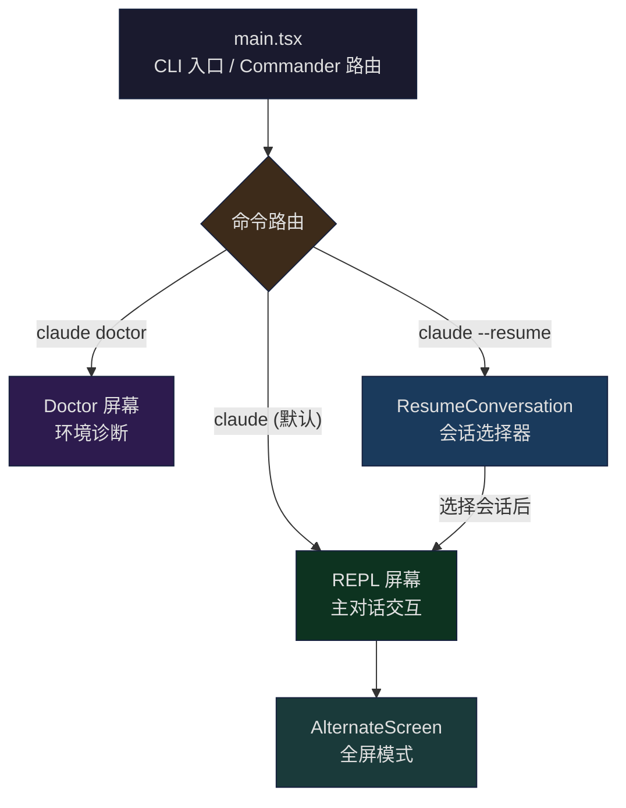
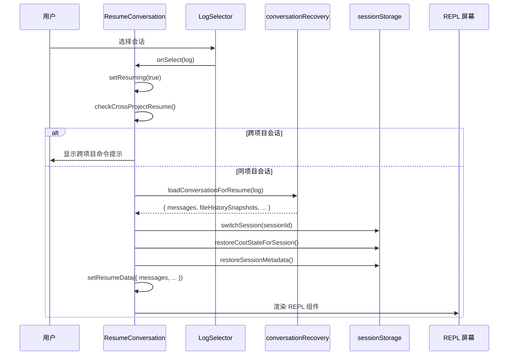
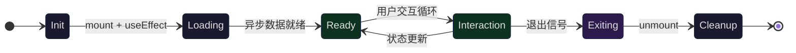

## 问题引入

当你输入 `claude` 启动一个新会话时，终端被一个全屏的交互界面接管——消息在上方滚动，输入框固定在底部，鼠标滚轮可以浏览历史。当你输入 `/doctor` 时，整个界面被诊断面板替换。当你执行 `claude --resume` 时，一个会话选择器出现，让你浏览和恢复历史对话。这三种截然不同的交互模式，都运行在同一个终端窗口中。

这些不同的"屏幕"是如何组织的？它们之间如何切换？全屏模式与普通终端输出有什么根本区别？终端的 alternate screen buffer 是如何被利用的？本文将深入 Claude Code 的 `src/screens/` 目录，解析这套屏幕系统的架构设计。

核心问题包括：

1. **屏幕目录架构**：三个屏幕文件（REPL、Doctor、ResumeConversation）如何分工？它们的共同模式是什么？
2. **全屏机制**：`AlternateScreen` 组件如何利用终端的 DEC Private Mode 1049 实现屏幕切换？
3. **生命周期管理**：屏幕的进入、渲染、交互、退出、状态恢复是如何编排的？
4. **跨屏切换**：Doctor 诊断完成后如何回到 REPL？Resume 选择会话后如何无缝过渡到 REPL？

## screens/ 目录架构

### 三个核心屏幕文件

Claude Code 的屏幕系统位于 `src/screens/` 目录下，包含三个核心文件：

```
src/screens/
├── REPL.tsx              # 主交互屏幕（~5000 行）
├── Doctor.tsx            # 诊断屏幕（~500 行）
└── ResumeConversation.tsx # 会话恢复屏幕（~400 行）
```

这三个文件的体量差异反映了它们的职责范围。REPL 是整个应用的主战场——消息流、工具执行、权限请求、滚动管理、快捷键处理全部在这里。Doctor 是一个一次性的诊断面板。ResumeConversation 是一个过渡屏幕，完成选择后将控制权交给 REPL。



### 屏幕的共同模式

尽管三个屏幕的复杂度差异巨大，它们共享一些关键的架构模式：

**Props 驱动的生命周期回调**。每个屏幕都接收一个回调函数来通知"完成"：

```typescript
// Doctor.tsx (第 32-36 行)
type Props = {
  onDone: (result?: string, options?: {
    display?: CommandResultDisplay;
  }) => void;
};
```

Doctor 屏幕在用户按 Enter 后调用 `onDone`；ResumeConversation 在加载完成后渲染内嵌的 REPL 组件。这种模式使得屏幕的组合变得声明式——父级不需要知道屏幕内部的状态机。

**React 状态管理 + 异步初始化**。每个屏幕在 mount 时发起异步操作（Doctor 获取诊断信息，Resume 加载历史日志），通过 `useState` + `useEffect` 驱动从 loading 到 ready 的状态转换。

**KeybindingSetup 包裹**。所有屏幕都在 `KeybindingSetup` 上下文中运行，确保快捷键系统（Ctrl+C 退出、Enter 确认等）在每个屏幕中可用。

## REPL 屏幕：主交互核心

### 组件规模与职责

REPL 是 Claude Code 最核心的屏幕，也是代码量最大的单一组件文件。它的 import 列表超过 280 行，涵盖了消息管理、工具执行、权限控制、MCP 连接、键绑定、滚动管理、语音集成等几乎所有子系统。

```typescript
// REPL.tsx (第 572-598 行)
export function REPL({
  commands: initialCommands,
  debug,
  initialTools,
  initialMessages,
  pendingHookMessages,
  initialFileHistorySnapshots,
  initialContentReplacements,
  initialAgentName,
  initialAgentColor,
  mcpClients: initialMcpClients,
  dynamicMcpConfig: initialDynamicMcpConfig,
  autoConnectIdeFlag,
  strictMcpConfig = false,
  systemPrompt: customSystemPrompt,
  appendSystemPrompt,
  onBeforeQuery,
  onTurnComplete,
  disabled = false,
  mainThreadAgentDefinition: initialMainThreadAgentDefinition,
  disableSlashCommands = false,
  taskListId,
  remoteSessionConfig,
  directConnectConfig,
  sshSession,
  thinkingConfig
}: Props): React.ReactNode {
```

REPL 接收的 props 定义了整个会话的初始状态——初始消息（用于 resume）、工具列表、MCP 客户端、系统提示词等。这些 props 由 `main.tsx` 在路由层注入。

### 全屏布局：FullscreenLayout

REPL 的核心布局由 `FullscreenLayout` 组件管理。这个组件将终端视口分为两个区域：可滚动的消息区域和固定在底部的输入区域。

```typescript
// FullscreenLayout.tsx (第 258-266 行 注释)
/**
 * Layout wrapper for the REPL. In fullscreen mode, puts scrollable
 * content in a sticky-scroll box and pins bottom content via flexbox.
 * Outside fullscreen mode, renders content sequentially so the existing
 * main-screen scrollback rendering works unchanged.
 *
 * Fullscreen mode defaults on for ants (CLAUDE_CODE_NO_FLICKER=0 to opt out)
 * and off for external users (CLAUDE_CODE_NO_FLICKER=1 to opt in).
 */
```

`FullscreenLayout` 有两种渲染路径。在全屏模式下，它使用 `ScrollBox`（带 `stickyScroll`）作为消息容器，底部区域通过 flexbox `flexShrink={0}` 固定：

```typescript
// FullscreenLayout.tsx (第 338-446 行 简化)
if (isFullscreenEnvEnabled()) {
  return (
    <PromptOverlayProvider>
      {/* 可滚动的消息区域 */}
      <Box flexGrow={1} flexDirection="column" overflow="hidden">
        <StickyPromptHeader />
        <ScrollBox ref={scrollRef} flexGrow={1} stickyScroll={true}>
          <ScrollChromeContext value={chromeCtx}>
            {scrollable}
          </ScrollChromeContext>
          {overlay}
        </ScrollBox>
        <NewMessagesPill count={newMessageCount} onClick={onPillClick} />
        {bottomFloat}
      </Box>
      {/* 固定的底部区域（输入框、spinner、权限请求） */}
      <Box flexDirection="column" flexShrink={0} maxHeight="50%">
        <SuggestionsOverlay />
        <DialogOverlay />
        <Box flexDirection="column" overflowY="hidden">
          {bottom}
        </Box>
      </Box>
      {/* 模态层（斜杠命令对话框） */}
      {modal && <ModalContext ...> ... </ModalContext>}
    </PromptOverlayProvider>
  );
}
// 非全屏模式：简单顺序渲染
return <>{scrollable}{bottom}{overlay}{modal}</>;
```

在非全屏模式下，所有内容按顺序渲染，依赖终端自身的滚动缓冲区。这是一个重要的降级路径——在 tmux `-CC` 模式或用户明确禁用全屏时使用。

### AlternateScreen：终端双缓冲

全屏模式的底层基础是终端的 alternate screen buffer（DEC Private Mode 1049）。`AlternateScreen` 组件封装了这个机制：

```typescript
// AlternateScreen.tsx (第 33-56 行 原始 TypeScript)
export function AlternateScreen({
  children,
  mouseTracking = true,
}: Props): React.ReactNode {
  const size = useContext(TerminalSizeContext)
  const writeRaw = useContext(TerminalWriteContext)

  useInsertionEffect(() => {
    const ink = instances.get(process.stdout)
    if (!writeRaw) return

    writeRaw(
      ENTER_ALT_SCREEN +        // ESC[?1049h
        '\x1b[2J\x1b[H' +       // 清屏 + 光标归位
        (mouseTracking ? ENABLE_MOUSE_TRACKING : ''),
    )
    ink?.setAltScreenActive(true, mouseTracking)

    return () => {
      ink?.setAltScreenActive(false)
      ink?.clearTextSelection()
      writeRaw(
        (mouseTracking ? DISABLE_MOUSE_TRACKING : '') +
        EXIT_ALT_SCREEN          // ESC[?1049l
      )
    }
  }, [writeRaw, mouseTracking])

  return (
    <Box flexDirection="column"
         height={size?.rows ?? 24}
         width="100%" flexShrink={0}>
      {children}
    </Box>
  )
}
```

这段代码值得逐行分析：

1. **`useInsertionEffect` 而非 `useLayoutEffect`**：这是一个关键细节。React reconciler 在 mutation 和 layout commit 之间调用 `resetAfterCommit`，Ink 的 `resetAfterCommit` 会触发 `onRender`。如果使用 `useLayoutEffect`，第一次 `onRender` 会在 effect 之前触发——将一个完整帧写入主屏幕。Insertion effect 在 mutation 阶段执行，确保 `ENTER_ALT_SCREEN` 序列在第一帧之前到达终端。

2. **`height={size?.rows ?? 24}`**：将组件高度固定为终端行数。这是全屏模式的核心约束——没有这个限制，`ScrollBox` 的 `flexGrow` 没有上限，viewport 等于 content height，`scrollTop` 永远为 0。

3. **清理函数的顺序**：先 `setAltScreenActive(false)` 通知 Ink 渲染器，再 `clearTextSelection` 清除文本选择状态，最后写入 `EXIT_ALT_SCREEN` 恢复主屏幕。

REPL 在根层级包裹 `AlternateScreen`：

```typescript
// REPL.tsx (第 4999-5003 行)
if (isFullscreenEnvEnabled()) {
  return <AlternateScreen mouseTracking={isMouseTrackingEnabled()}>
      {mainReturn}
    </AlternateScreen>;
}
return mainReturn;
```

## Doctor 屏幕：/doctor 环境诊断流程

### 启动路径

Doctor 屏幕有两个入口：

1. **CLI 子命令**：`claude doctor` 直接启动，通过 `main.tsx` 的 Commander 路由到 `doctorHandler`
2. **REPL 斜杠命令**：在对话中输入 `/doctor`，REPL 将 Doctor 组件渲染在当前上下文中

CLI 入口的启动代码展示了屏幕的独立启动模式：

```typescript
// cli/handlers/util.tsx (第 72-87 行)
export async function doctorHandler(root: Root): Promise<void> {
  logEvent('tengu_doctor_command', {});
  await new Promise<void>(resolve => {
    root.render(
      <AppStateProvider>
        <KeybindingSetup>
          <MCPConnectionManager
            dynamicMcpConfig={undefined}
            isStrictMcpConfig={false}
          >
            <DoctorWithPlugins onDone={() => {
              void resolve();
            }} />
          </MCPConnectionManager>
        </KeybindingSetup>
      </AppStateProvider>
    );
  });
  root.unmount();
  process.exit(0);
}
```

注意这里的模式：创建一个 `Promise`，将 `resolve` 传递给组件的 `onDone` 回调。当用户按 Enter 关闭诊断面板时，Promise resolve，随后 unmount 并退出进程。Doctor 作为 CLI 子命令时不需要 `AlternateScreen`——它是一个简单的信息展示面板，依赖终端原生滚动。

### 诊断数据收集

Doctor 组件在 mount 时并行收集多维诊断数据：

```typescript
// Doctor.tsx (第 119-221 行 简化)
const [diagnostic, setDiagnostic] = useState(null);
const [agentInfo, setAgentInfo] = useState(null);
const [contextWarnings, setContextWarnings] = useState(null);
const [versionLockInfo, setVersionLockInfo] = useState(null);
const validationErrors = useSettingsErrors();

useEffect(() => {
  // 1. 基础诊断：版本、安装路径、包管理器、ripgrep 状态
  getDoctorDiagnostic().then(setDiagnostic);

  (async () => {
    // 2. Agent 信息：加载的 agents、解析失败的文件
    const userAgentsDir = join(getClaudeConfigHomeDir(), "agents");
    const projectAgentsDir = join(getOriginalCwd(), ".claude", "agents");
    const { activeAgents, allAgents, failedFiles } = agentDefinitions;
    // ...

    // 3. 上下文警告：CLAUDE.md 大小、MCP 工具数量
    const warnings = await checkContextWarnings(tools, ...);
    setContextWarnings(warnings);

    // 4. 版本锁信息：PID 锁文件清理
    if (isPidBasedLockingEnabled()) {
      const staleLocksCleaned = cleanupStaleLocks(locksDir);
      const locks = getAllLockInfo(locksDir);
      setVersionLockInfo({ enabled: true, locks, locksDir, staleLocksCleaned });
    }
  })();
}, [toolPermissionContext, tools, agentDefinitions]);
```

收集的诊断信息分为多个面板渲染：

| 面板 | 内容 |
|------|------|
| Diagnostics | 版本号、安装类型、路径、包管理器、ripgrep 状态 |
| Updates | 自动更新状态、更新权限、稳定版/最新版号 |
| Sandbox | 沙箱隔离状态 |
| MCP | MCP 服务器配置解析警告 |
| Keybindings | 键绑定配置警告 |
| Environment Variables | 环境变量验证错误 |
| Version Locks | PID 锁文件状态、过期锁清理 |
| Agent Parse Errors | Agent 定义文件解析失败 |
| Plugin Errors | 插件错误 |
| Context Usage Warnings | CLAUDE.md 大小、Agent 上下文占用 |

所有面板使用 `Pane` 组件包裹，在 diagnostic 数据加载前显示 `Checking installation status...` 占位文本。

### 退出机制

Doctor 使用最简单的退出模式——`PressEnterToContinue` 组件加 keybinding 监听：

```typescript
// Doctor.tsx (第 234-255 行)
const handleDismiss = () => {
  onDone("Claude Code diagnostics dismissed", { display: "system" });
};

useKeybindings({
  "confirm:yes": handleDismiss,
  "confirm:no": handleDismiss
}, { context: "Confirmation" });

// 渲染底部
<Box><PressEnterToContinue /></Box>
```

`confirm:yes` 和 `confirm:no` 都映射到 dismiss——无论用户按 Enter 还是 Escape，都关闭面板。在 CLI 模式下这触发 `process.exit(0)`；在 REPL 的 `/doctor` 模式下这将控制权交还给对话流。

## Resume 屏幕：会话恢复 UI

### 渐进式日志加载

ResumeConversation 是一个过渡屏幕——它的唯一目的是让用户选择一个历史会话，然后将控制权交给 REPL。但"选择历史会话"这个看似简单的功能，涉及到渐进式加载的精巧设计。

```typescript
// ResumeConversation.tsx (第 126-136 行)
React.useEffect(() => {
  loadSameRepoMessageLogsProgressive(worktreePaths).then(result => {
    sessionLogResultRef.current = result;
    logCountRef.current = result.logs.length;
    setLogs(result.logs);
    setLoading(false);
  }).catch(error => {
    logError(error);
    setLoading(false);
  });
}, [worktreePaths]);
```

`loadSameRepoMessageLogsProgressive` 只加载同仓库（包括 worktree）的会话日志。用户可以切换到"所有项目"模式加载跨仓库日志：

```typescript
// ResumeConversation.tsx (第 156-168 行)
const loadLogs = React.useCallback((allProjects: boolean) => {
  setLoading(true);
  const promise = allProjects
    ? loadAllProjectsMessageLogsProgressive()
    : loadSameRepoMessageLogsProgressive(worktreePaths);
  promise.then(result => {
    sessionLogResultRef.current = result;
    logCountRef.current = result.logs.length;
    setLogs(result.logs);
  }).finally(() => setLoading(false));
}, [worktreePaths]);
```

更进一步，当用户滚动到列表底部时，`loadMoreLogs` 按需加载更多历史记录：

```typescript
// ResumeConversation.tsx (第 137-155 行)
const loadMoreLogs = React.useCallback((count: number) => {
  const ref = sessionLogResultRef.current;
  if (!ref || ref.nextIndex >= ref.allStatLogs.length) return;
  void enrichLogs(ref.allStatLogs, ref.nextIndex, count).then(result => {
    ref.nextIndex = result.nextIndex;
    if (result.logs.length > 0) {
      const offset = logCountRef.current;
      result.logs.forEach((log, i) => { log.value = offset + i; });
      setLogs(prev => prev.concat(result.logs));
      logCountRef.current += result.logs.length;
    } else if (ref.nextIndex < ref.allStatLogs.length) {
      loadMoreLogs(count); // 递归加载直到找到有效日志
    }
  });
}, []);
```

### 会话选择与恢复流程

当用户从 `LogSelector` 中选择一个会话时，触发 `onSelect` 回调，这是整个恢复流程中最复杂的部分：



恢复流程的关键步骤（第 178-292 行）：

1. **跨项目检测**：`checkCrossProjectResume` 检查选中的会话是否来自不同目录。如果是跨项目会话，显示一个提示命令（已复制到剪贴板）让用户在正确的目录中恢复。

2. **消息加载**：`loadConversationForResume` 从 JSONL 文件中反序列化消息历史。

3. **会话切换**：`switchSession` 更新全局 session ID；`restoreCostStateForSession` 恢复该会话的 API 调用费用统计。

4. **Agent 恢复**：`restoreAgentFromSession` 根据会话元数据恢复 agent 定义和配色。

5. **状态过渡**：`setResumeData` 触发 React 重新渲染，条件分支从 `LogSelector` 切换到 REPL 组件。

状态过渡的条件渲染逻辑：

```typescript
// ResumeConversation.tsx (第 293-314 行)
if (crossProjectCommand) {
  return <CrossProjectMessage command={crossProjectCommand} />;
}
if (resumeData) {
  return <REPL
    debug={debug}
    commands={commands}
    initialMessages={resumeData.messages}
    initialFileHistorySnapshots={resumeData.fileHistorySnapshots}
    // ... 所有恢复数据通过 props 注入 REPL
  />;
}
if (loading) {
  return <Box><Spinner /><Text> Loading conversations...</Text></Box>;
}
if (resuming) {
  return <Box><Spinner /><Text> Resuming conversation...</Text></Box>;
}
return <LogSelector logs={filteredLogs} ... />;
```

这是一个状态机驱动的渲染模式：`loading` -> `LogSelector` -> `resuming` -> `REPL`（或 `CrossProjectMessage`）。每个状态对应完全不同的 UI。

## 屏幕生命周期：进入 / 渲染 / 交互 / 退出 / 状态恢复

### 生命周期模型

三个屏幕各自有不同的生命周期模型，但可以抽象为统一的阶段：



**Doctor 的生命周期最简单**：

| 阶段 | 行为 |
|------|------|
| Init | mount，注册 keybinding |
| Loading | `getDoctorDiagnostic()` + 并行数据获取 |
| Ready | 渲染诊断面板 |
| Interaction | 仅监听 Enter/Escape |
| Exiting | 调用 `onDone`，触发 unmount |

**ResumeConversation 的生命周期是过渡式的**：

| 阶段 | 行为 |
|------|------|
| Init | mount |
| Loading | `loadSameRepoMessageLogsProgressive()` |
| Ready | 渲染 LogSelector |
| Interaction | 列表导航、搜索、跨项目切换 |
| Exiting | 不是真正退出——而是切换为渲染 REPL |

**REPL 的生命周期是长驻的**：

| 阶段 | 行为 |
|------|------|
| Init | mount，进入 alt screen，初始化 200+ 状态变量 |
| Loading | 并行加载 hooks、MCP 连接、工具池 |
| Ready | FullscreenLayout 渲染 |
| Interaction | 无限循环：用户输入 -> API 查询 -> 工具执行 -> 消息渲染 |
| Exiting | 执行 session end hooks -> 退出 alt screen -> unmount |

### AlternateScreen 的进入与退出

全屏模式的进入和退出是通过终端转义序列实现的。进入时：

```
ESC[?1049h    → 保存主屏幕光标位置，切换到备用屏幕缓冲区
ESC[2J        → 清空备用屏幕
ESC[H         → 光标移到 (0,0)
ESC[?1000h    → 启用鼠标点击追踪
ESC[?1002h    → 启用鼠标按钮事件追踪
ESC[?1006h    → 启用 SGR 扩展鼠标协议
```

退出时：

```
ESC[?1006l    → 禁用 SGR 鼠标
ESC[?1002l    → 禁用按钮事件追踪
ESC[?1000l    → 禁用鼠标追踪
ESC[?1049l    → 切换回主屏幕缓冲区，恢复光标位置
```

终端维护两个独立的屏幕缓冲区。主屏幕的内容在进入 alt screen 时被保存，在退出时自动恢复。这意味着 Claude Code 退出后，之前终端中的内容（命令历史、其他程序的输出）完好无损。

## 与主对话流的切换机制

### main.tsx 的路由层

屏幕的切换发生在两个层面：启动时的路由和运行时的模式切换。

启动时路由由 `main.tsx` 控制。它使用 Commander.js 解析命令行参数，根据子命令和标志决定渲染哪个屏幕：

```typescript
// main.tsx 路由逻辑（简化）

// claude doctor → 独立的诊断屏幕
program.command('doctor').action(async () => {
  const root = await createRoot(getBaseRenderOptions(false));
  await doctorHandler(root);  // render Doctor → onDone → unmount → exit
});

// claude --resume → 会话恢复屏幕或直接进入 REPL
if (hasResumeFlag) {
  if (specificSessionId) {
    // 直接恢复指定会话 → launchRepl
    await launchRepl(root, appProps, {
      initialMessages: resumedMessages,
      // ...
    }, renderAndRun);
  } else {
    // 显示选择器 → launchResumeChooser
    await launchResumeChooser(root, appProps, worktreePaths, {
      initialSearchQuery: searchTerm,
      forkSession: options.forkSession,
      // ...
    });
  }
} else {
  // 默认路径 → launchRepl（新会话）
  await launchRepl(root, appProps, sessionConfig, renderAndRun);
}
```

`launchRepl` 和 `launchResumeChooser` 封装了 React 树的构建和渲染：

```typescript
// replLauncher.tsx (第 12-22 行)
export async function launchRepl(
  root: Root,
  appProps: AppWrapperProps,
  replProps: REPLProps,
  renderAndRun: (root: Root, element: React.ReactNode) => Promise<void>,
): Promise<void> {
  const { App } = await import('./components/App.js');
  const { REPL } = await import('./screens/REPL.js');
  await renderAndRun(root, <App {...appProps}><REPL {...replProps} /></App>);
}
```

注意 `import()` 的使用——REPL 和 App 都是动态导入的。这使得 Doctor 子命令可以在不加载 REPL 代码的情况下运行，节省启动时间。

### 运行时的屏幕内切换

在 REPL 运行期间，`/doctor` 斜杠命令不会替换整个 React 树——它在 REPL 的现有上下文中渲染 Doctor 组件。Doctor 的 `onDone` 回调将结果作为系统消息注入对话流：

```typescript
// Doctor 在 REPL 中的 onDone
onDone: (result?: string, options?) => {
  onDone("Claude Code diagnostics dismissed", { display: "system" });
}
```

这种模式下 Doctor 不需要自己的 `AppStateProvider` 或 `KeybindingSetup`——它复用 REPL 已有的上下文。这也是为什么 Doctor 的 CLI 入口需要手动包裹这些 Provider，而 REPL 内置的 `/doctor` 不需要。

Transcript 模式（Ctrl+O）是另一种运行时切换。REPL 在同一个 `AlternateScreen` 内切换渲染内容：

```typescript
// REPL.tsx (第 4484-4489 行)
if (transcriptScrollRef) {
  return <AlternateScreen mouseTracking={isMouseTrackingEnabled()}>
      {transcriptReturn}
    </AlternateScreen>;
}
return transcriptReturn;
```

这确保了 alt buffer 在模式切换时保持不变——React reconciler 看到相同类型的 `AlternateScreen` 组件，只更新 children。

## 全屏模式的环境兼容性

### tmux -CC 检测

全屏模式不是在所有终端环境中都可用。最棘手的兼容性问题来自 tmux 的 `-CC` 模式（iTerm2 integration mode）。在这个模式下，tmux 的 alt screen + mouse tracking 会导致终端状态损坏。

`src/utils/fullscreen.ts` 实现了多层检测：

```typescript
// fullscreen.ts (第 29-86 行)
function isTmuxControlModeEnvHeuristic(): boolean {
  if (!process.env.TMUX) return false;
  if (process.env.TERM_PROGRAM !== 'iTerm.app') return false;
  const term = process.env.TERM ?? '';
  return !term.startsWith('screen') && !term.startsWith('tmux');
}

function probeTmuxControlModeSync(): void {
  tmuxControlModeProbed = isTmuxControlModeEnvHeuristic();
  if (tmuxControlModeProbed) return;
  if (!process.env.TMUX) return;
  if (process.env.TERM_PROGRAM) return; // 非 iTerm → 不需要探测
  // SSH 场景：TERM_PROGRAM 不传播，需要直接询问 tmux
  let result;
  try {
    result = spawnSync('tmux',
      ['display-message', '-p', '#{client_control_mode}'],
      { encoding: 'utf8', timeout: 2000 });
  } catch { return; }
  if (result.status !== 0) return;
  tmuxControlModeProbed = result.stdout.trim() === '1';
}
```

检测分两层：

1. **环境变量启发式**（零进程开销）：如果 `TMUX` 设置且 `TERM_PROGRAM` 是 `iTerm.app`，且 `TERM` 不以 `screen`/`tmux` 开头，则判定为 `-CC` 模式。
2. **同步 tmux 探测**（~5ms）：只在 SSH 场景（`TERM_PROGRAM` 未传播）触发，通过 `spawnSync` 查询 tmux 的 `client_control_mode` 变量。

使用 `spawnSync`（同步）而非异步版本是刻意的——这个结果决定是否进入全屏，异步探测曾导致竞态：在探测完成前 React 已经渲染了 alt screen，用户的鼠标滚轮就死了。

### 环境变量控制

全屏模式通过 `CLAUDE_CODE_NO_FLICKER` 环境变量控制：

```typescript
// fullscreen.ts (第 112-129 行)
export function isFullscreenEnvEnabled(): boolean {
  if (isEnvDefinedFalsy(process.env.CLAUDE_CODE_NO_FLICKER)) return false;
  if (isEnvTruthy(process.env.CLAUDE_CODE_NO_FLICKER)) return true;
  if (isTmuxControlMode()) {
    // 自动禁用，记录日志
    return false;
  }
  return process.env.USER_TYPE === 'ant'; // 内部用户默认开启
}
```

额外的精细控制包括：

- `CLAUDE_CODE_DISABLE_MOUSE`：保留 alt screen 但禁用鼠标追踪（解决 tmux 中的复制冲突）
- `CLAUDE_CODE_DISABLE_MOUSE_CLICKS`：禁用鼠标点击但保留滚轮（防止误触）

## 可迁移模式

Claude Code 的屏幕系统为终端应用提供了多个可复用的设计模式：

### 模式一：Props 回调驱动的屏幕生命周期

每个屏幕接收 `onDone` 回调，父级通过 `Promise` 等待完成。这种模式使得屏幕可以在不同上下文（独立 CLI 命令、REPL 内嵌、测试环境）中复用。

```typescript
// 通用模式
await new Promise<void>(resolve => {
  root.render(
    <Providers>
      <ScreenComponent onDone={() => resolve()} />
    </Providers>
  );
});
root.unmount();
```

### 模式二：AlternateScreen 双缓冲

利用终端 alt screen buffer 实现全屏应用，退出后自动恢复之前的终端内容。关键是用 `useInsertionEffect` 确保转义序列在第一帧渲染之前到达终端。

### 模式三：渐进式状态机渲染

ResumeConversation 的 `loading -> selector -> resuming -> REPL` 状态机展示了如何在单个组件中实现多阶段 UI 过渡，每个阶段渲染完全不同的组件树。

### 模式四：环境兼容性降级

全屏模式的多层检测（环境变量启发式 -> 同步进程探测 -> 环境变量覆盖）是一个可复用的终端能力检测策略。在无法使用全屏的环境中，系统降级为顺序渲染模式，功能不受影响。

### 模式五：屏幕复用与上下文继承

Doctor 在 REPL 内运行时复用 REPL 的 Provider 上下文（AppState、KeybindingSetup、MCPConnectionManager），在 CLI 模式下自带这些 Provider。这种设计使得同一个组件可以在两种场景中工作，无需修改组件本身。

## 总结

Claude Code 的屏幕系统是一个精心设计的多层架构：

- **底层**：`AlternateScreen` 组件利用终端 DEC 1049 私有模式实现双缓冲，`useInsertionEffect` 保证时序正确性
- **布局层**：`FullscreenLayout` 将终端视口分为可滚动区域和固定底部区域，通过 flexbox 实现自适应布局
- **屏幕层**：三个屏幕文件各司其职——REPL 负责主交互循环，Doctor 提供诊断信息，ResumeConversation 处理会话恢复过渡
- **路由层**：`main.tsx` 通过 Commander 路由决定启动哪个屏幕，`replLauncher.tsx` 和 `dialogLaunchers.tsx` 封装了 React 树的构建
- **兼容层**：tmux `-CC` 检测、环境变量控制、非全屏降级确保系统在各种终端环境中都能工作

这套系统最大的设计洞察是：**终端的 alternate screen buffer 等价于浏览器的 "page navigation"**。进入 alt screen 就像打开新页面（旧页面被保存），退出就像按返回键（旧页面被恢复）。Claude Code 在此基础上构建了一套 React 驱动的屏幕管理系统，使得终端应用也能拥有类似 SPA 的多视图体验。
