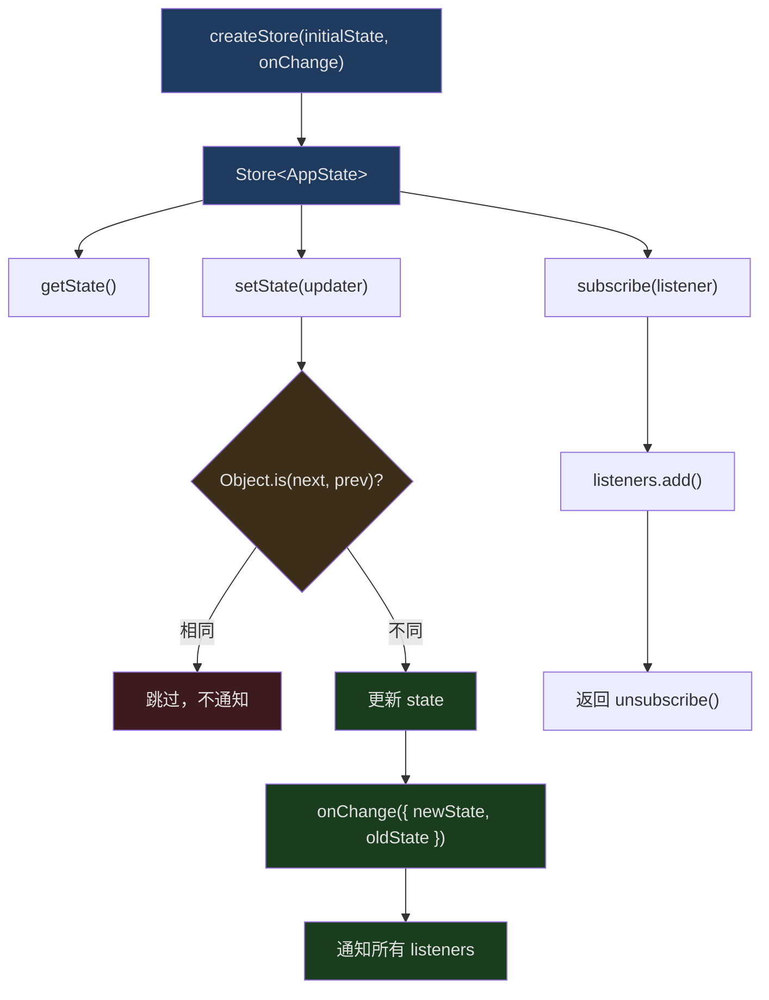
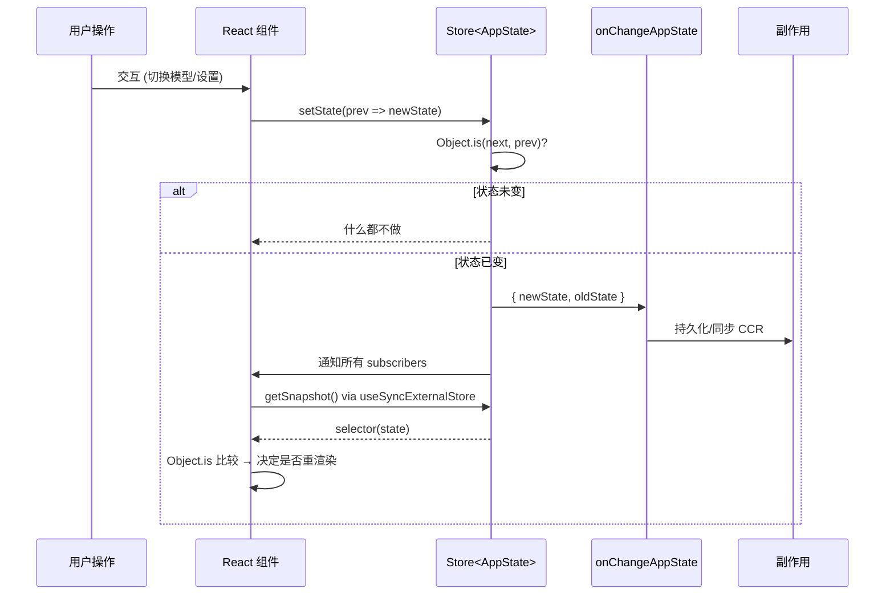
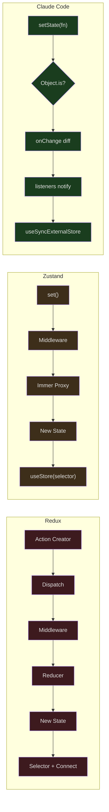

## 问题引入

React 状态管理是前端工程中永恒的话题。从 Redux 到 MobX，从 Zustand 到 Jotai，状态管理库层出不穷。然而 Claude Code 选择了一条令人意外的路径——用不到 35 行代码实现了一个完整的状态管理系统，却没有引入任何第三方库。

这不是玩具代码。Claude Code 的 `AppState` 包含超过 80 个字段，涵盖设置、MCP 连接、插件、权限、桥接状态、团队协作等维度。一个 35 行的 Store 如何撑起这么庞大的状态树？为什么它选择不用 Redux？这背后是怎样的权衡取舍？

## Store 的完整实现

先看代码。这是 `src/state/store.ts` 的全部内容：

```typescript
// src/state/store.ts
// 行 1-34
type Listener = () => void
type OnChange<T> = (args: { newState: T; oldState: T }) => void

export type Store<T> = {
  getState: () => T
  setState: (updater: (prev: T) => T) => void
  subscribe: (listener: Listener) => () => void
}

export function createStore<T>(
  initialState: T,
  onChange?: OnChange<T>,
): Store<T> {
  let state = initialState
  const listeners = new Set<Listener>()

  return {
    getState: () => state,

    setState: (updater: (prev: T) => T) => {
      const prev = state
      const next = updater(prev)
      if (Object.is(next, prev)) return
      state = next
      onChange?.({ newState: next, oldState: prev })
      for (const listener of listeners) listener()
    },

    subscribe: (listener: Listener) => {
      listeners.add(listener)
      return () => listeners.delete(listener)
    },
  }
}
```

34 行。没有 middleware、没有 devtools、没有 immer。让我们逐层剖析为什么这已经足够。

## 架构总览



### 三个核心 API

1. **`getState()`** — 同步获取当前状态快照，零开销。
2. **`setState(updater)`** — 接受一个纯函数 `(prev) => next`。如果 `Object.is(next, prev)` 为 true，什么都不做。
3. **`subscribe(listener)`** — 注册一个无参数回调，返回取消订阅函数。

这与 `useSyncExternalStore` 的契约完美匹配——React 18 专门为这种外部 Store 设计了这个 Hook。

## Object.is 变更检测：一行代码的深意

```typescript
// src/state/store.ts 行 23
if (Object.is(next, prev)) return
```

这一行看似简单，实则意义深远。

`Object.is` 执行的是引用相等比较——如果 `updater` 返回同一个对象引用，就认为状态没有变化。这意味着：

1. **不可变更新是强制的**。如果你想改变状态，必须返回一个新对象：`prev => ({ ...prev, verbose: true })`。
2. **无变化时零成本**。如果 updater 内部判断不需要更新，可以直接 `return prev`，Store 不会触发任何通知。
3. **没有深比较开销**。Redux 的 `shallowEqual`、Zustand 的 `Object.is` selector 对比——Claude Code 把这个检查放在了最上层。

来看一个实际的优化案例，`src/state/teammateViewHelpers.ts` 中的 `enterTeammateView`：

```typescript
// src/state/teammateViewHelpers.ts 行 51-80
export function enterTeammateView(
  taskId: string,
  setAppState: (updater: (prev: AppState) => AppState) => void,
): void {
  logEvent('tengu_transcript_view_enter', {})
  setAppState(prev => {
    const task = prev.tasks[taskId]
    const prevId = prev.viewingAgentTaskId
    const prevTask = prevId !== undefined ? prev.tasks[prevId] : undefined
    const switching =
      prevId !== undefined &&
      prevId !== taskId &&
      isLocalAgent(prevTask) &&
      prevTask.retain
    const needsRetain =
      isLocalAgent(task) && (!task.retain || task.evictAfter !== undefined)
    const needsView =
      prev.viewingAgentTaskId !== taskId ||
      prev.viewSelectionMode !== 'viewing-agent'
    // 关键：如果什么都不需要变，直接返回 prev
    if (!needsRetain && !needsView && !switching) return prev
    // ...构造新状态
  })
}
```

第 66 行的 `if (!needsRetain && !needsView && !switching) return prev` 是一个常见模式——在 updater 内部做条件判断，避免不必要的状态更新。由于 `Object.is` 检查，返回 `prev` 意味着零副作用。

## React Context 与 useSyncExternalStore

Store 的消费侧在 `src/state/AppState.tsx` 中实现。

### Provider 层

```typescript
// src/state/AppState.tsx 行 27-28, 37-110
export const AppStoreContext = React.createContext<AppStateStore | null>(null)

export function AppStateProvider({ children, initialState, onChangeAppState }) {
  // 防止嵌套
  const hasAppStateContext = useContext(HasAppStateContext)
  if (hasAppStateContext) {
    throw new Error("AppStateProvider can not be nested within another AppStateProvider")
  }

  const [store] = useState(
    () => createStore(initialState ?? getDefaultAppState(), onChangeAppState)
  )

  // 初始挂载时检查 bypass permissions 状态
  useEffect(() => {
    const { toolPermissionContext } = store.getState()
    if (toolPermissionContext.isBypassPermissionsModeAvailable &&
        isBypassPermissionsModeDisabled()) {
      store.setState(prev => ({
        ...prev,
        toolPermissionContext: createDisabledBypassPermissionsContext(
          prev.toolPermissionContext
        )
      }))
    }
  }, [])

  // 监听设置文件变更
  const onSettingsChange = useEffectEvent(
    source => applySettingsChange(source, store.setState)
  )
  useSettingsChange(onSettingsChange)

  return (
    <HasAppStateContext.Provider value={true}>
      <AppStoreContext.Provider value={store}>
        <MailboxProvider>
          <VoiceProvider>{children}</VoiceProvider>
        </MailboxProvider>
      </AppStoreContext.Provider>
    </HasAppStateContext.Provider>
  )
}
```

关键设计：

1. **Store 在 `useState` 惰性初始化中创建**，确保整个应用生命周期只有一个 Store 实例。
2. **嵌套检测** — `HasAppStateContext` 防止意外创建多个 Provider。
3. **`onChangeAppState` 回调** — 在创建时注入，用于状态变更的副作用。
4. **`useSettingsChange`** — 监听配置文件的外部变更（文件系统、环境变量），将其注入 Store。

### useAppState Hook

```typescript
// src/state/AppState.tsx 行 117-160
function useAppStore(): AppStateStore {
  const store = useContext(AppStoreContext)
  if (!store) {
    throw new ReferenceError(
      'useAppState/useSetAppState cannot be called outside of an <AppStateProvider />'
    )
  }
  return store
}

/**
 * 订阅 AppState 的一个切片。只在选中值变化时
 * 重渲染（通过 Object.is 比较）。
 */
export function useAppState(selector) {
  const store = useAppStore()
  const getSnapshot = () => {
    const state = store.getState()
    const selected = selector(state)
    return selected
  }
  return useSyncExternalStore(store.subscribe, getSnapshot, getSnapshot)
}
```

这是整个状态管理系统的核心消费 API。`useSyncExternalStore` 是 React 18 引入的底层 Hook，它接受三个参数：

1. `subscribe` — 注册变更通知
2. `getSnapshot` — 获取当前值
3. `getServerSnapshot` — SSR 快照（这里复用 getSnapshot）

当 Store 发出通知时，React 调用 `getSnapshot` 获取新值，与上次通过 `Object.is` 比较。如果值相同，跳过渲染；如果不同，触发组件重渲染。

这带来了细粒度更新能力：

```typescript
// 只在 verbose 变化时重渲染
const verbose = useAppState(s => s.verbose)

// 只在模型变化时重渲染
const model = useAppState(s => s.mainLoopModel)

// 引用稳定的子对象——只在 promptSuggestion 引用变化时重渲染
const { text, promptId } = useAppState(s => s.promptSuggestion)
```

## 数据流完整路径



## onChangeAppState：状态变更的副作用层

`src/state/onChangeAppState.ts` 是 Store 的 `onChange` 回调实现。这是整个系统中唯一集中处理状态变更副作用的地方。

```typescript
// src/state/onChangeAppState.ts 行 43-171
export function onChangeAppState({
  newState,
  oldState,
}: {
  newState: AppState
  oldState: AppState
}) {
  // 权限模式同步到 CCR 和 SDK
  const prevMode = oldState.toolPermissionContext.mode
  const newMode = newState.toolPermissionContext.mode
  if (prevMode !== newMode) {
    const prevExternal = toExternalPermissionMode(prevMode)
    const newExternal = toExternalPermissionMode(newMode)
    if (prevExternal !== newExternal) {
      notifySessionMetadataChanged({
        permission_mode: newExternal,
        is_ultraplan_mode: isUltraplan,
      })
    }
    notifyPermissionModeChanged(newMode)
  }

  // 模型变更持久化到设置
  if (newState.mainLoopModel !== oldState.mainLoopModel) {
    if (newState.mainLoopModel === null) {
      updateSettingsForSource('userSettings', { model: undefined })
      setMainLoopModelOverride(null)
    } else {
      updateSettingsForSource('userSettings', { model: newState.mainLoopModel })
      setMainLoopModelOverride(newState.mainLoopModel)
    }
  }

  // expandedView 持久化
  if (newState.expandedView !== oldState.expandedView) {
    saveGlobalConfig(current => ({
      ...current,
      showExpandedTodos: newState.expandedView === 'tasks',
      showSpinnerTree: newState.expandedView === 'teammates',
    }))
  }

  // verbose 持久化
  if (newState.verbose !== oldState.verbose) {
    saveGlobalConfig(current => ({ ...current, verbose: newState.verbose }))
  }

  // 设置变更时清除认证缓存
  if (newState.settings !== oldState.settings) {
    clearApiKeyHelperCache()
    clearAwsCredentialsCache()
    clearGcpCredentialsCache()
    if (newState.settings.env !== oldState.settings.env) {
      applyConfigEnvironmentVariables()
    }
  }
}
```

这个模式的精妙之处在于**关注点分离**：

1. Store 本身不知道任何副作用逻辑。
2. `onChangeAppState` 作为一个纯粹的diff-handler，只在状态实际变化时才执行。
3. 每个副作用块都独立——permission mode 同步、模型持久化、配置缓存清理，互不干扰。

对比 Redux 的 middleware 模式，这里没有 action type 字符串、没有 dispatch 链、没有 saga/thunk。直接比较 `oldState.x !== newState.x`，清晰无歧义。

## AppState 的结构设计

来看 `src/state/AppStateStore.ts` 中定义的 `AppState` 类型。它是一个约 450 行的庞大类型定义：

```typescript
// src/state/AppStateStore.ts 行 89-158（节选）
export type AppState = DeepImmutable<{
  settings: SettingsJson
  verbose: boolean
  mainLoopModel: ModelSetting
  statusLineText: string | undefined
  expandedView: 'none' | 'tasks' | 'teammates'
  kairosEnabled: boolean
  toolPermissionContext: ToolPermissionContext
  replBridgeEnabled: boolean
  replBridgeConnected: boolean
  replBridgeSessionActive: boolean
  // ... 更多 bridge 状态字段
}> & {
  // 排除在 DeepImmutable 之外的字段（包含函数类型）
  tasks: { [taskId: string]: TaskState }
  agentNameRegistry: Map<string, AgentId>
  mcp: {
    clients: MCPServerConnection[]
    tools: Tool[]
    commands: Command[]
    resources: Record<string, ServerResource[]>
    pluginReconnectKey: number
  }
  plugins: {
    enabled: LoadedPlugin[]
    disabled: LoadedPlugin[]
    commands: Command[]
    errors: PluginError[]
    installationStatus: { ... }
    needsRefresh: boolean
  }
  // ... 更多字段
}
```

注意 `DeepImmutable<...> & { ... }` 的结构：

- **DeepImmutable 部分** — 简单值类型字段，TypeScript 编译器保证不可变。
- **非 DeepImmutable 部分** — 包含函数类型（如 `AbortController`）或特殊集合（如 `Map`, `Set`）的字段，手动管理不可变性。

### 默认状态工厂

```typescript
// src/state/AppStateStore.ts 行 456-569
export function getDefaultAppState(): AppState {
  const initialMode: PermissionMode =
    teammateUtils.isTeammate() && teammateUtils.isPlanModeRequired()
      ? 'plan'
      : 'default'

  return {
    settings: getInitialSettings(),
    tasks: {},
    agentNameRegistry: new Map(),
    verbose: false,
    mainLoopModel: null,
    toolPermissionContext: {
      ...getEmptyToolPermissionContext(),
      mode: initialMode,
    },
    mcp: {
      clients: [],
      tools: [],
      commands: [],
      resources: {},
      pluginReconnectKey: 0,
    },
    plugins: {
      enabled: [],
      disabled: [],
      commands: [],
      errors: [],
      installationStatus: { marketplaces: [], plugins: [] },
      needsRefresh: false,
    },
    thinkingEnabled: shouldEnableThinkingByDefault(),
    promptSuggestionEnabled: shouldEnablePromptSuggestion(),
    // ... 30+ 更多默认值
  }
}
```

注意默认值不是硬编码常量——`getInitialSettings()` 从配置系统读取合并后的设置，`shouldEnableThinkingByDefault()` 根据环境决定是否启用 thinking mode。这意味着 Store 的初始状态本身就是动态计算的。

## Selectors 模式

`src/state/selectors.ts` 展示了如何从 AppState 派生计算值：

```typescript
// src/state/selectors.ts 行 18-40
export function getViewedTeammateTask(
  appState: Pick<AppState, 'viewingAgentTaskId' | 'tasks'>,
): InProcessTeammateTaskState | undefined {
  const { viewingAgentTaskId, tasks } = appState

  if (!viewingAgentTaskId) return undefined
  const task = tasks[viewingAgentTaskId]
  if (!task) return undefined
  if (!isInProcessTeammateTask(task)) return undefined

  return task
}

// src/state/selectors.ts 行 59-76
export function getActiveAgentForInput(appState: AppState): ActiveAgentForInput {
  const viewedTask = getViewedTeammateTask(appState)
  if (viewedTask) {
    return { type: 'viewed', task: viewedTask }
  }

  const { viewingAgentTaskId, tasks } = appState
  if (viewingAgentTaskId) {
    const task = tasks[viewingAgentTaskId]
    if (task?.type === 'local_agent') {
      return { type: 'named_agent', task }
    }
  }

  return { type: 'leader' }
}
```

Selector 使用 `Pick<AppState, ...>` 明确声明依赖——这不仅是类型安全，更是文档。你一眼就能看出 `getViewedTeammateTask` 只依赖两个字段。

## 与 Redux/Zustand 的对比



| 特性 | Redux | Zustand | Claude Code |
|------|-------|---------|-------------|
| 代码量 | ~2000 行核心 | ~400 行核心 | 34 行 |
| Action 类型 | 字符串常量 | 不需要 | 不需要 |
| Middleware | 链式 | 链式 | onChange 回调 |
| 不可变性 | 手动 / Immer | 可选 Immer | 手动 + TypeScript |
| DevTools | 内置 | 内置 | 无（不需要） |
| 变更检测 | shallowEqual | Object.is | Object.is |
| React 集成 | connect/useSelector | useStore | useSyncExternalStore |
| 副作用 | saga/thunk | middleware | onChangeAppState |
| 依赖 | react-redux | zustand | 零依赖 |

### 为什么不用 Redux？

1. **CLI 应用没有 undo/redo 需求** — Redux 的 action log 在 CLI 中没有实际价值。
2. **没有多 Store 交互** — Claude Code 只有一个全局 Store。
3. **没有复杂异步流** — 不需要 saga 的生成器或 thunk 的嵌套 dispatch。
4. **启动性能** — 35 行的 Store 不需要加载任何外部依赖。

### 为什么不用 Zustand？

Zustand 实际上非常接近 Claude Code 的设计。但仔细对比会发现：

1. **Zustand 的 `set` 接受 partial state** — Claude Code 强制使用 `prev => next` 函数式更新，避免意外覆盖。
2. **Zustand 的 `subscribe` 带 selector** — Claude Code 把 selector 放在 `useSyncExternalStore` 层，更接近 React 的原生模型。
3. **零依赖** — Claude Code 的 Store 不引入任何包。对于 CLI 应用的启动速度，每少一个依赖就少一次模块加载。

## 设置变更的热更新

`AppStateProvider` 中的 `useSettingsChange` 监听配置文件变化：

```typescript
// src/state/AppState.tsx 行 83-91
const onSettingsChange = useEffectEvent(
  source => applySettingsChange(source, store.setState)
)
useSettingsChange(onSettingsChange)
```

当用户在另一个终端编辑 `~/.claude/settings.json`，或者企业管理员推送远程配置时：

1. 文件系统监听器检测到变化
2. `useSettingsChange` 触发回调
3. `applySettingsChange` 构造新的 settings 对象
4. `store.setState` 更新状态
5. `onChangeAppState` 检测到 `newState.settings !== oldState.settings`
6. 清除认证缓存、重新应用环境变量

整个链路不需要手动调度任何事件——从文件变更到 UI 更新，完全自动。

## DCE 与条件 Provider

AppState.tsx 中有一个 feature flag 控制的条件加载：

```typescript
// src/state/AppState.tsx 行 14-19
const VoiceProvider: (props: {
  children: React.ReactNode;
}) => React.ReactNode = feature('VOICE_MODE')
  ? require('../context/voice.js').VoiceProvider
  : ({ children }) => children;
```

当 `VOICE_MODE` feature flag 关闭时，`VoiceProvider` 被替换为一个直通组件。Bun 的编译器会在打包时将 `feature('VOICE_MODE')` 替换为 `false`，然后通过死代码消除，整个 `require('../context/voice.js')` 都不会出现在最终产物中。

这意味着 `AppStateProvider` 的 Provider 包装层是可变的——根据编译配置，它可以包含或排除 Voice、Mailbox 等上下文。

## 性能特性

### 批量更新

React 18 默认启用自动批量更新。多个 `setState` 调用在同一个事件循环 tick 内只会触发一次重渲染。Claude Code 的 Store 天然兼容这个机制——`subscribe` 的 listener 触发后，React 的 scheduler 会合并渲染。

### 选择性订阅

```typescript
// 好：只在 verbose 变化时重渲染
const verbose = useAppState(s => s.verbose)

// 坏：每次任何状态变化都重渲染
// const state = useAppState(s => s) // 不允许
```

`useAppState` 的 JSDoc 明确警告不要返回整个状态对象。源码中甚至有一个（开发模式下启用的）运行时检查：

```typescript
// src/state/AppState.tsx 行 150-152
if (false && state === selected) {
  throw new Error(
    `Your selector returned the original state, which is not allowed.`
  )
}
```

`if (false && ...)` 意味着这个检查在生产构建中被完全消除，但开发时可以通过修改条件来启用。

### 无新对象规则

`useAppState` 的文档强调：

> Do NOT return new objects from the selector -- Object.is will always see them as changed.

```typescript
// 好：选择已有的子对象引用
const { text, promptId } = useAppState(s => s.promptSuggestion)

// 坏：每次都创建新对象
// const data = useAppState(s => ({ text: s.promptSuggestion.text }))
```

这个约束来自 `useSyncExternalStore` 的工作原理——每次 Store 发出通知，React 都会调用 `getSnapshot` 并通过 `Object.is` 与上次返回值比较。如果 selector 返回新对象，`Object.is` 永远为 false，导致无限重渲染。

## 实战：状态更新的完整路径

以切换 verbose 模式为例，追踪完整路径：

1. **用户操作**：在设置中切换 verbose

2. **setState 调用**：
```typescript
store.setState(prev => ({ ...prev, verbose: !prev.verbose }))
```

3. **Store 内部**：
   - `Object.is(next, prev)` → false（新对象）
   - 更新内部 `state` 引用
   - 调用 `onChange({ newState: next, oldState: prev })`
   - 遍历 `listeners` 通知

4. **onChangeAppState**：
```typescript
if (newState.verbose !== oldState.verbose) {
  saveGlobalConfig(current => ({ ...current, verbose: newState.verbose }))
}
```

5. **React 更新**：
   - `useSyncExternalStore` 收到通知
   - 调用 `selector(store.getState())` 获取新的 `verbose` 值
   - `Object.is(true, false)` → false → 触发重渲染

6. **UI 更新**：组件使用新的 verbose 值渲染

整个过程没有 action 类型字符串、没有 reducer switch-case、没有 middleware 管道。一个 setState 调用完成所有工作。

## 总结

Claude Code 的状态管理是一个极简主义的胜利：

- **34 行核心代码** — `createStore` 提供完整的订阅/更新/检测功能
- **零外部依赖** — 不引入 Redux、Zustand、MobX 中的任何一个
- **`Object.is` 短路** — 在最早的时机拦截无效更新
- **`useSyncExternalStore` 集成** — 利用 React 18 原生 API 实现细粒度订阅
- **`onChangeAppState` 集中副作用** — 取代 middleware，在一个函数中处理所有状态同步

不是每个项目都需要 Redux。当你的应用只有一个 Store、不需要时间旅行调试、不需要复杂异步流时，34 行代码就是最好的状态管理库。
