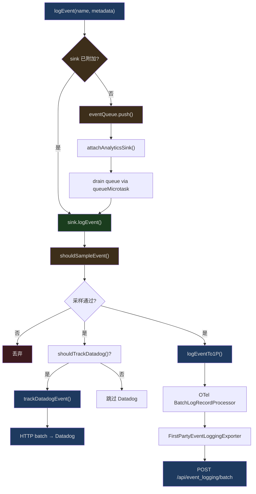
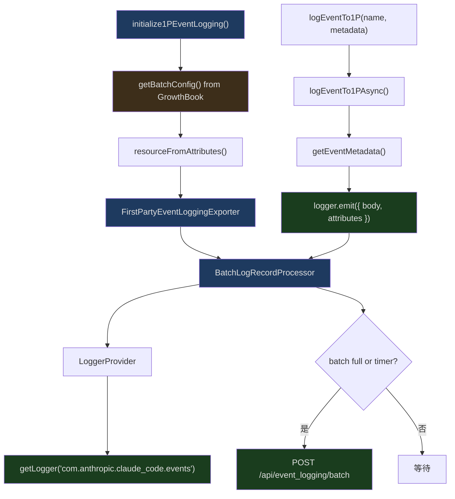
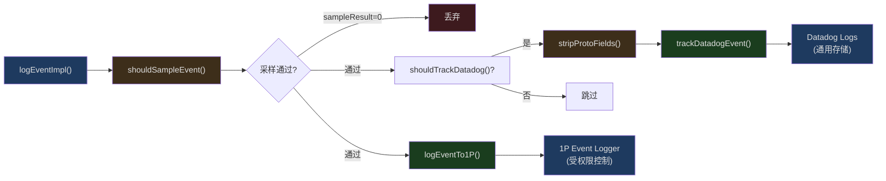

## 问题引入

一个 CLI 工具需要遥测吗？答案是肯定的——但方式截然不同于 Web 应用。Web 应用可以在页面加载后异步初始化 GA4，几百毫秒的延迟用户不会察觉。而 CLI 工具的启动时间以毫秒计——`claude --help` 如果因为加载 OpenTelemetry SDK 而多花 200ms，用户会立刻感受到。

Claude Code 的遥测系统面临三重挑战：
1. **启动零成本** — 遥测不能拖慢 CLI 启动
2. **隐私至上** — 不能记录代码、文件路径或任何敏感信息
3. **可靠投递** — 网络中断时事件不能丢失

这篇文章剖析它如何通过事件队列、惰性加载、多层 sink 和编译期死代码消除来解决这些问题。

## 遥测架构总览



## 零依赖的事件入口

`src/services/analytics/index.ts` 是整个遥测系统的入口。它的设计原则在文件顶部就说明了：

```typescript
// src/services/analytics/index.ts 行 1-9
/**
 * Analytics service - public API for event logging
 *
 * DESIGN: This module has NO dependencies to avoid import cycles.
 * Events are queued until attachAnalyticsSink() is called during app initialization.
 * The sink handles routing to Datadog and 1P event logging.
 */
```

**零依赖**。这个模块不导入任何项目内的其他模块——不导入 config、不导入 auth、不导入 model。为什么？因为几乎每个模块都需要 `logEvent`，如果 analytics 反过来依赖它们，就会形成循环导入。

### 事件队列机制

```typescript
// src/services/analytics/index.ts 行 81-84, 95-123
const eventQueue: QueuedEvent[] = []
let sink: AnalyticsSink | null = null

export function attachAnalyticsSink(newSink: AnalyticsSink): void {
  if (sink !== null) return  // 幂等
  sink = newSink

  if (eventQueue.length > 0) {
    const queuedEvents = [...eventQueue]
    eventQueue.length = 0

    // 异步排空，不阻塞启动路径
    queueMicrotask(() => {
      for (const event of queuedEvents) {
        if (event.async) {
          void sink!.logEventAsync(event.eventName, event.metadata)
        } else {
          sink!.logEvent(event.eventName, event.metadata)
        }
      }
    })
  }
}
```

这是一个经典的"先排队后消费"模式：

1. CLI 启动时，各模块初始化过程中调用 `logEvent` 记录事件
2. 此时 sink 还没初始化，事件被推入 `eventQueue`
3. 当应用完成核心初始化后，调用 `attachAnalyticsSink` 注入实际的 sink
4. 队列通过 `queueMicrotask` 异步排空——不阻塞当前的启动路径

关键细节是 `queueMicrotask` 而非 `setTimeout`。微任务在当前事件循环结束时执行，比 `setTimeout(fn, 0)` 更快，但不会阻塞同步代码。

### 类型安全的隐私防护

```typescript
// src/services/analytics/index.ts 行 19-33
export type AnalyticsMetadata_I_VERIFIED_THIS_IS_NOT_CODE_OR_FILEPATHS = never

export type AnalyticsMetadata_I_VERIFIED_THIS_IS_PII_TAGGED = never
```

这两个类型名称之长令人瞩目。它们是 `never` 类型的别名——任何 `string` 值想要作为事件元数据传递，必须显式断言：

```typescript
myString as AnalyticsMetadata_I_VERIFIED_THIS_IS_NOT_CODE_OR_FILEPATHS
```

而 `logEvent` 的元数据签名更加激进：

```typescript
// src/services/analytics/index.ts 行 61
type LogEventMetadata = { [key: string]: boolean | number | undefined }
```

**没有 string 类型**。元数据值只能是 `boolean`、`number` 或 `undefined`。这从类型系统层面杜绝了意外记录代码片段或文件路径的可能。

### _PROTO_ 键的 PII 隔离

```typescript
// src/services/analytics/index.ts 行 45-58
export function stripProtoFields<V>(
  metadata: Record<string, V>,
): Record<string, V> {
  let result: Record<string, V> | undefined
  for (const key in metadata) {
    if (key.startsWith('_PROTO_')) {
      if (result === undefined) {
        result = { ...metadata }
      }
      delete result[key]
    }
  }
  return result ?? metadata
}
```

以 `_PROTO_` 为前缀的键包含 PII（个人身份信息），它们只被路由到受权限控制的 1P proto 列。`stripProtoFields` 在发送给 Datadog 之前将这些字段剥离。注意优化——如果没有 `_PROTO_` 键，直接返回原引用，不做任何拷贝。

## Datadog 事件追踪

`src/services/analytics/datadog.ts` 实现了到 Datadog Logs API 的批量发送。

```typescript
// src/services/analytics/datadog.ts 行 12-18
const DATADOG_LOGS_ENDPOINT =
  'https://http-intake.logs.us5.datadoghq.com/api/v2/logs'
const DATADOG_CLIENT_TOKEN = 'pubbbf48e6d78dae54bceaa4acf463299bf'
const DEFAULT_FLUSH_INTERVAL_MS = 15000
const MAX_BATCH_SIZE = 100
const NETWORK_TIMEOUT_MS = 5000
```

### 事件白名单

```typescript
// src/services/analytics/datadog.ts 行 19-64
const DATADOG_ALLOWED_EVENTS = new Set([
  'tengu_api_error',
  'tengu_api_success',
  'tengu_cancel',
  'tengu_exit',
  'tengu_init',
  'tengu_started',
  'tengu_tool_use_error',
  'tengu_tool_use_success',
  // ... 共约 40 个事件名
])
```

不是所有事件都发送到 Datadog——只有明确列入白名单的事件才会发送。这是双重安全：即使有人意外在 `logEvent` 中传入了敏感数据，如果事件名不在白名单中，Datadog 根本不会收到。

### 批量发送与定时刷新

```typescript
// src/services/analytics/datadog.ts 行 98-128
let logBatch: DatadogLog[] = []
let flushTimer: NodeJS.Timeout | null = null

async function flushLogs(): Promise<void> {
  if (logBatch.length === 0) return
  const logsToSend = logBatch
  logBatch = []

  try {
    await axios.post(DATADOG_LOGS_ENDPOINT, logsToSend, {
      headers: {
        'Content-Type': 'application/json',
        'DD-API-KEY': DATADOG_CLIENT_TOKEN,
      },
      timeout: NETWORK_TIMEOUT_MS,
    })
  } catch (error) {
    logError(error)
  }
}

function scheduleFlush(): void {
  if (flushTimer) return
  flushTimer = setTimeout(() => {
    flushTimer = null
    void flushLogs()
  }, getFlushIntervalMs()).unref()
}
```

`.unref()` 是关键——它允许 Node.js 进程在没有其他活跃 handler 时退出，而不会因为 flush timer 挂起。这对 CLI 工具至关重要：用户按 Ctrl+C 后，进程应该立即退出，不应该等 15 秒 flush。

### 用户分桶

```typescript
// src/services/analytics/datadog.ts 行 281-299
const NUM_USER_BUCKETS = 30

const getUserBucket = memoize((): number => {
  const userId = getOrCreateUserID()
  const hash = createHash('sha256').update(userId).digest('hex')
  return parseInt(hash.slice(0, 8), 16) % NUM_USER_BUCKETS
})
```

这个设计用于告警。当出现问题时，我们想知道"有多少用户受影响"而不是"有多少事件"。将用户 ID 哈希到 30 个桶中，通过计算受影响的唯一桶数来估算用户数——既保护隐私，又降低基数。

## OpenTelemetry 1P 事件日志

`src/services/analytics/firstPartyEventLogger.ts` 使用 OpenTelemetry SDK 实现第一方事件日志。



### 初始化

```typescript
// src/services/analytics/firstPartyEventLogger.ts 行 312-389
export function initialize1PEventLogging(): void {
  profileCheckpoint('1p_event_logging_start')
  const enabled = is1PEventLoggingEnabled()
  if (!enabled) return

  const batchConfig = getBatchConfig()
  lastBatchConfig = batchConfig
  profileCheckpoint('1p_event_after_growthbook_config')

  const scheduledDelayMillis =
    batchConfig.scheduledDelayMillis || DEFAULT_LOGS_EXPORT_INTERVAL_MS

  const resource = resourceFromAttributes({
    [ATTR_SERVICE_NAME]: 'claude-code',
    [ATTR_SERVICE_VERSION]: MACRO.VERSION,
  })

  const eventLoggingExporter = new FirstPartyEventLoggingExporter({
    maxBatchSize: maxExportBatchSize,
    skipAuth: batchConfig.skipAuth,
    maxAttempts: batchConfig.maxAttempts,
    path: batchConfig.path,
    baseUrl: batchConfig.baseUrl,
    isKilled: () => isSinkKilled('firstParty'),
  })

  firstPartyEventLoggerProvider = new LoggerProvider({
    resource,
    processors: [
      new BatchLogRecordProcessor(eventLoggingExporter, {
        scheduledDelayMillis,
        maxExportBatchSize,
        maxQueueSize,
      }),
    ],
  })

  // 从本地 provider 获取 logger，不是全局 API
  firstPartyEventLogger = firstPartyEventLoggerProvider.getLogger(
    'com.anthropic.claude_code.events',
    MACRO.VERSION,
  )
}
```

关键设计决策：

1. **独立 LoggerProvider** — 不使用 OpenTelemetry 全局 API（`logs.getLogger()`），而是创建私有 provider。这确保内部事件不会泄漏到客户配置的 OTLP 端点。
2. **`profileCheckpoint`** — 在初始化的关键节点打点，追踪遥测系统自身的启动耗时。
3. **`MACRO.VERSION`** — 编译期替换的版本号常量。
4. **GrowthBook 批处理配置** — 批处理参数（间隔、大小、队列）从 GrowthBook 动态获取，允许远程调整。

### 运行时配置热更新

```typescript
// src/services/analytics/firstPartyEventLogger.ts 行 407-449
export async function reinitialize1PEventLoggingIfConfigChanged(): Promise<void> {
  if (!is1PEventLoggingEnabled() || !firstPartyEventLoggerProvider) return

  const newConfig = getBatchConfig()
  if (isEqual(newConfig, lastBatchConfig)) return

  // 1. 先置空 logger，阻止并发写入
  const oldProvider = firstPartyEventLoggerProvider
  const oldLogger = firstPartyEventLogger
  firstPartyEventLogger = null

  // 2. 排空旧 provider 的缓冲区
  try {
    await oldProvider.forceFlush()
  } catch { /* 导出失败已落盘 */ }

  // 3. 用新配置重建
  firstPartyEventLoggerProvider = null
  try {
    initialize1PEventLogging()
  } catch (e) {
    // 恢复旧 provider，保证可用性
    firstPartyEventLoggerProvider = oldProvider
    firstPartyEventLogger = oldLogger
    logError(e)
    return
  }

  // 4. 后台关闭旧 provider
  void oldProvider.shutdown().catch(() => {})
}
```

这是一个精心设计的热切换流程：

1. **先断后建** — 置空 logger 使并发的 `logEventTo1P` 调用直接跳过（而非写入即将关闭的 provider）
2. **先排空后关闭** — `forceFlush()` 确保旧缓冲区的事件不丢失
3. **失败回滚** — 如果新 provider 创建失败，恢复旧的，保持可用
4. **导出失败落盘** — 注释说明导出失败的事件会写入磁盘文件，新 exporter 启动后会重试

## 事件采样

```typescript
// src/services/analytics/firstPartyEventLogger.ts 行 43-85
export function getEventSamplingConfig(): EventSamplingConfig {
  return getDynamicConfig_CACHED_MAY_BE_STALE<EventSamplingConfig>(
    EVENT_SAMPLING_CONFIG_NAME,
    {},
  )
}

export function shouldSampleEvent(eventName: string): number | null {
  const config = getEventSamplingConfig()
  const eventConfig = config[eventName]

  // 无配置 = 100% 记录
  if (!eventConfig) return null

  const sampleRate = eventConfig.sample_rate
  if (typeof sampleRate !== 'number' || sampleRate < 0 || sampleRate > 1) {
    return null
  }

  if (sampleRate >= 1) return null  // 100%
  if (sampleRate <= 0) return 0     // 丢弃

  // 随机采样
  return Math.random() < sampleRate ? sampleRate : 0
}
```

采样配置从 GrowthBook 的 `tengu_event_sampling_config` 动态配置获取。返回值的语义：

- `null` — 100% 记录，不需要在元数据中标记采样率
- `0` — 丢弃此事件
- `0.05` — 此事件被采样记录，在元数据中标记 `sample_rate: 0.05`，便于后续数据分析时还原真实量

## GrowthBook Feature Flag 系统

`src/services/analytics/growthbook.ts` 管理 GrowthBook SDK 客户端。

### CACHED_MAY_BE_STALE 模式

Claude Code 的 GrowthBook 调用函数名中都带有 `_CACHED_MAY_BE_STALE` 后缀：

```typescript
// 在 sink.ts 中使用
checkStatsigFeatureGate_CACHED_MAY_BE_STALE(DATADOG_GATE_NAME)

// 在 firstPartyEventLogger.ts 中使用
getDynamicConfig_CACHED_MAY_BE_STALE<EventSamplingConfig>(
  EVENT_SAMPLING_CONFIG_NAME, {}
)

// 在 sinkKillswitch.ts 中使用
getDynamicConfig_CACHED_MAY_BE_STALE<Partial<Record<SinkName, boolean>>>(
  SINK_KILLSWITCH_CONFIG_NAME, {}
)
```

这个命名约定是刻意的设计——它在每个调用点提醒开发者：

1. 返回值可能是上一次会话缓存的旧值
2. 不要基于这个值做安全关键的决策
3. 新值会在后台异步加载

### Sink 紧急开关

```typescript
// src/services/analytics/sinkKillswitch.ts 行 1-25
import { getDynamicConfig_CACHED_MAY_BE_STALE } from './growthbook.js'

// 混淆名称：per-sink analytics killswitch
const SINK_KILLSWITCH_CONFIG_NAME = 'tengu_frond_boric'

export type SinkName = 'datadog' | 'firstParty'

export function isSinkKilled(sink: SinkName): boolean {
  const config = getDynamicConfig_CACHED_MAY_BE_STALE<
    Partial<Record<SinkName, boolean>>
  >(SINK_KILLSWITCH_CONFIG_NAME, {})
  return config?.[sink] === true
}
```

注意 `tengu_frond_boric` 是一个混淆过的配置名。如果 1P 日志管道出现问题，运维可以通过 GrowthBook 设置 `{ "firstParty": true }` 来立即停止发送，而不需要推送客户端更新。

## Sink 路由层

`src/services/analytics/sink.ts` 是事件的路由中心：

```typescript
// src/services/analytics/sink.ts 行 48-72
function logEventImpl(eventName: string, metadata: LogEventMetadata): void {
  // 采样检查
  const sampleResult = shouldSampleEvent(eventName)
  if (sampleResult === 0) return

  const metadataWithSampleRate =
    sampleResult !== null
      ? { ...metadata, sample_rate: sampleResult }
      : metadata

  if (shouldTrackDatadog()) {
    // Datadog 是通用后端——剥离 _PROTO_* 键
    void trackDatadogEvent(
      eventName,
      stripProtoFields(metadataWithSampleRate)
    )
  }

  // 1P 接收完整 payload（包含 _PROTO_*）
  logEventTo1P(eventName, metadataWithSampleRate)
}
```



路由逻辑的层次：

1. **采样** — 全局采样先行，被丢弃的事件不会进入任何 sink
2. **Datadog** — GrowthBook gate 控制开关 + 事件白名单双重过滤 + PII 剥离
3. **1P** — 接收完整数据（含 PII 标记字段），由受权限控制的存储保管

### Datadog Gate 的降级策略

```typescript
// src/services/analytics/sink.ts 行 29-43
let isDatadogGateEnabled: boolean | undefined = undefined

function shouldTrackDatadog(): boolean {
  if (isSinkKilled('datadog')) return false

  if (isDatadogGateEnabled !== undefined) {
    return isDatadogGateEnabled
  }

  // 回退到上一次会话的缓存值
  try {
    return checkStatsigFeatureGate_CACHED_MAY_BE_STALE(DATADOG_GATE_NAME)
  } catch {
    return false
  }
}
```

三层降级：
1. 如果 killswitch 激活 → 直接关闭
2. 如果本次会话已初始化 → 用当前值
3. 如果还未初始化 → 用上次缓存值（可能过时但不至于丢数据）

## 启动性能剖析

`src/utils/startupProfiler.ts` 追踪 CLI 启动的每个阶段：

```typescript
// src/utils/startupProfiler.ts 行 26-36
const DETAILED_PROFILING = isEnvTruthy(process.env.CLAUDE_CODE_PROFILE_STARTUP)

const STATSIG_SAMPLE_RATE = 0.005
const STATSIG_LOGGING_SAMPLED =
  process.env.USER_TYPE === 'ant' || Math.random() < STATSIG_SAMPLE_RATE

const SHOULD_PROFILE = DETAILED_PROFILING || STATSIG_LOGGING_SAMPLED
```

两种模式并行：
- **详细剖析** — `CLAUDE_CODE_PROFILE_STARTUP=1`，100% 用户可手动启用，写入完整报告到磁盘
- **采样上报** — 100% 内部用户、0.5% 外部用户自动上报关键阶段耗时

### profileCheckpoint 的使用

`main.tsx` 中密布着 checkpoint 调用：

```typescript
// src/main.tsx 中的 profileCheckpoint 调用（部分）
profileCheckpoint('main_tsx_entry')              // 行 12
profileCheckpoint('main_tsx_imports_loaded')      // 行 209
profileCheckpoint('main_function_start')          // 行 586
profileCheckpoint('main_warning_handler_initialized') // 行 607
profileCheckpoint('main_client_type_determined')  // 行 849
profileCheckpoint('main_before_run')              // 行 853
profileCheckpoint('run_function_start')           // 行 885
profileCheckpoint('preAction_start')              // 行 908
profileCheckpoint('preAction_after_mdm')          // 行 915
profileCheckpoint('preAction_after_init')         // 行 917
profileCheckpoint('preAction_after_sinks')        // 行 935
profileCheckpoint('preAction_after_migrations')   // 行 951
profileCheckpoint('preAction_after_remote_settings') // 行 959
profileCheckpoint('action_handler_start')         // 行 1007
profileCheckpoint('action_tools_loaded')          // 行 1878
profileCheckpoint('action_before_setup')          // 行 1904
profileCheckpoint('action_after_setup')           // 行 1936
profileCheckpoint('action_commands_loaded')       // 行 2031
profileCheckpoint('action_mcp_configs_loaded')    // 行 2402
```

### 阶段聚合

```typescript
// src/utils/startupProfiler.ts 行 49-54
const PHASE_DEFINITIONS = {
  import_time: ['cli_entry', 'main_tsx_imports_loaded'],
  init_time: ['init_function_start', 'init_function_end'],
  settings_time: ['eagerLoadSettings_start', 'eagerLoadSettings_end'],
  total_time: ['cli_entry', 'main_after_run'],
} as const
```

细粒度 checkpoint 被聚合成有意义的阶段——`import_time` 是模块加载耗时，`settings_time` 是配置读取耗时。这些数据让团队能精确定位启动瓶颈。

### 剖析报告

设置 `CLAUDE_CODE_PROFILE_STARTUP=1` 后，启动时会生成包含内存快照的完整报告：

```typescript
// src/utils/startupProfiler.ts 行 65-75
export function profileCheckpoint(name: string): void {
  if (!SHOULD_PROFILE) return

  const perf = getPerformance()
  perf.mark(name)

  // 只在详细模式下捕获内存
  if (DETAILED_PROFILING) {
    memorySnapshots.push(process.memoryUsage())
  }
}
```

注意 `if (!SHOULD_PROFILE) return` 的短路——未被采样的用户执行 `profileCheckpoint` 的成本是一次函数调用和一次布尔检查，几乎为零。

## 隐私与分析禁用

`src/services/analytics/config.ts` 定义了分析禁用的条件：

```typescript
// src/services/analytics/config.ts 行 19-27
export function isAnalyticsDisabled(): boolean {
  return (
    process.env.NODE_ENV === 'test' ||
    isEnvTruthy(process.env.CLAUDE_CODE_USE_BEDROCK) ||
    isEnvTruthy(process.env.CLAUDE_CODE_USE_VERTEX) ||
    isEnvTruthy(process.env.CLAUDE_CODE_USE_FOUNDRY) ||
    isTelemetryDisabled()
  )
}
```

分析在以下情况下被完全禁用：

1. **测试环境** — `NODE_ENV=test`
2. **第三方云提供商** — Bedrock、Vertex、Foundry 用户的数据不应流向 Anthropic
3. **隐私级别** — 用户设置 `no-telemetry` 或 `essential-traffic`

还有一个更细粒度的控制：

```typescript
// src/services/analytics/config.ts 行 36-38
export function isFeedbackSurveyDisabled(): boolean {
  return process.env.NODE_ENV === 'test' || isTelemetryDisabled()
}
```

反馈调查不受第三方提供商限制——因为调查是本地 UI 交互，不传输 transcript 数据。企业客户通过 OTEL 捕获响应。

## Datadog 的数据安全

Datadog 模块有多层数据保护：

```typescript
// src/services/analytics/datadog.ts 行 164-168
export async function trackDatadogEvent(
  eventName: string,
  properties: { [key: string]: boolean | number | undefined },
): Promise<void> {
  if (process.env.NODE_ENV !== 'production') return

  // 3P 提供商不发送
  if (getAPIProvider() !== 'firstParty') return
```

```typescript
// src/services/analytics/datadog.ts 行 196-217
    // MCP 工具名归一化，减少基数
    if (typeof allData.toolName === 'string' &&
        allData.toolName.startsWith('mcp__')) {
      allData.toolName = 'mcp'
    }

    // 模型名归一化（仅外部用户）
    if (process.env.USER_TYPE !== 'ant' && typeof allData.model === 'string') {
      const shortName = getCanonicalName(allData.model.replace(/\[1m]$/i, ''))
      allData.model = shortName in MODEL_COSTS ? shortName : 'other'
    }

    // 截断开发版本号
    if (typeof allData.version === 'string') {
      allData.version = allData.version.replace(
        /^(\d+\.\d+\.\d+-dev\.\d{8})\.t\d+\.sha[a-f0-9]+$/,
        '$1',
      )
    }
```

三个归一化操作都是为了**基数控制**：

1. **MCP 工具名** — `mcp__filesystem__read` 等高基数名被归一化为 `mcp`
2. **模型名** — 外部用户的非标准模型名被归一化为 `other`
3. **版本号** — 开发版本去掉时间戳和 SHA，减少不同版本的标签数

## GrowthBook 实验事件

```typescript
// src/services/analytics/firstPartyEventLogger.ts 行 255-298
export function logGrowthBookExperimentTo1P(
  data: GrowthBookExperimentData,
): void {
  if (!is1PEventLoggingEnabled()) return
  if (!firstPartyEventLogger || isSinkKilled('firstParty')) return

  const userId = getOrCreateUserID()
  const { accountUuid, organizationUuid } = getCoreUserData(true)

  const attributes = {
    event_type: 'GrowthbookExperimentEvent',
    event_id: randomUUID(),
    experiment_id: data.experimentId,
    variation_id: data.variationId,
    ...(userId && { device_id: userId }),
    ...(accountUuid && { account_uuid: accountUuid }),
    ...(organizationUuid && { organization_uuid: organizationUuid }),
    environment: getEnvironmentForGrowthBook(),
  }

  firstPartyEventLogger.emit({
    body: 'growthbook_experiment',
    attributes,
  })
}
```

GrowthBook A/B 实验的分配事件通过同一个 1P 管道记录。这意味着实验分析和事件分析共享同一个数据基础设施——不需要额外的实验平台。

## 优雅关闭

```typescript
// src/services/analytics/datadog.ts 行 151-157
export async function shutdownDatadog(): Promise<void> {
  if (flushTimer) {
    clearTimeout(flushTimer)
    flushTimer = null
  }
  await flushLogs()
}

// src/services/analytics/firstPartyEventLogger.ts 行 116-128
export async function shutdown1PEventLogging(): Promise<void> {
  if (!firstPartyEventLoggerProvider) return
  try {
    await firstPartyEventLoggerProvider.shutdown()
  } catch {
    // 忽略关闭错误
  }
}
```

在进程退出前，`gracefulShutdown()` 会调用这两个函数，确保缓冲区中的事件被刷新。Datadog 手动刷新批次；1P 通过 OpenTelemetry SDK 的 `shutdown()` 方法排空 `BatchLogRecordProcessor` 的内部队列。

## 总结

Claude Code 的遥测系统展现了 CLI 工具可观测性的最佳实践：

- **事件队列 + 惰性 Sink** — 启动阶段零成本记录事件，初始化完成后异步排空
- **类型系统隐私防护** — `LogEventMetadata` 只允许 `boolean | number | undefined`，从类型层面杜绝代码/路径泄漏
- **双 Sink 架构** — Datadog（通用存储 + 白名单过滤 + PII 剥离）和 1P（受权限控制 + 完整数据）
- **GrowthBook 动态配置** — 采样率、批处理参数、Sink 开关均可远程调整，无需推送客户端更新
- **CACHED_MAY_BE_STALE 命名** — 在每个调用点提醒开发者缓存数据的时效性
- **profileCheckpoint** — 零成本的启动性能追踪，0.5% 采样自动上报
- **多重禁用机制** — 环境变量、隐私级别、第三方提供商、GrowthBook killswitch，层层保护
