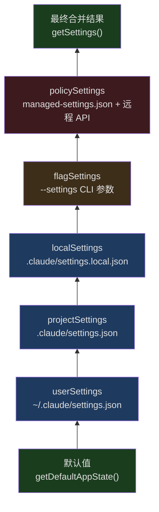
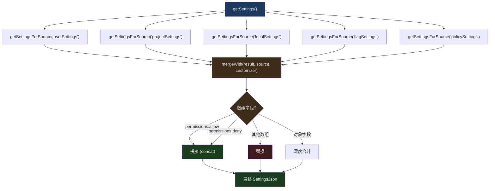
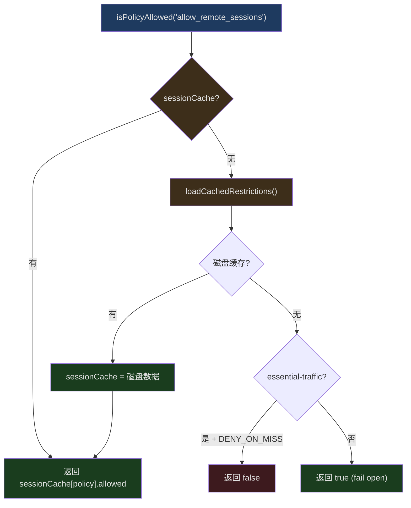

## 问题引入

配置管理听起来简单——读个 JSON 文件不就行了？但当你需要支持以下所有场景时，复杂度会指数级增长：

- 用户全局设置（`~/.claude/settings.json`）
- 项目共享设置（`.claude/settings.json`，提交到 git）
- 项目本地设置（`.claude/settings.local.json`，gitignore）
- CLI 标志覆盖（`--settings` 参数）
- 企业管理策略（MDM 推送或远程 API）
- 远程管理配置（从 API 拉取的组织级配置）
- 配置变更时的实时热更新
- 多来源之间的优先级合并
- 旧配置到新格式的自动迁移

Claude Code 的配置系统用 Zod Schema 验证每一层，用确定性的优先级规则合并 5 个来源，并通过 11 个迁移函数处理历史兼容性。这篇文章深入每一层的实现。

## 配置来源与优先级



`src/utils/settings/constants.ts` 定义了来源优先级：

```typescript
// src/utils/settings/constants.ts 行 7-22
export const SETTING_SOURCES = [
  'userSettings',      // 用户全局设置
  'projectSettings',   // 项目共享设置
  'localSettings',     // 项目本地设置（gitignored）
  'flagSettings',      // CLI --settings 标志
  'policySettings',    // 企业管理策略
] as const
```

顺序就是优先级——后面的覆盖前面的。这意味着：

1. **用户设置** 是基础层
2. **项目设置** 覆盖用户偏好（团队约定）
3. **本地设置** 覆盖项目设置（个人覆盖）
4. **CLI 标志** 覆盖一切文件配置（临时覆盖）
5. **策略设置** 最高优先级（企业强制）

### 来源类型

```typescript
// src/utils/settings/constants.ts 行 24, 182-185
export type SettingSource = (typeof SETTING_SOURCES)[number]

export type EditableSettingSource = Exclude<
  SettingSource,
  'policySettings' | 'flagSettings'
>
```

`EditableSettingSource` 排除了策略和标志来源——用户不能编辑管理策略或 CLI 标志生成的配置。只有 `userSettings`、`projectSettings`、`localSettings` 可以通过 `/config` 命令或直接编辑文件来修改。

### 来源启用控制

```typescript
// src/utils/settings/constants.ts 行 159-167
export function getEnabledSettingSources(): SettingSource[] {
  const allowed = getAllowedSettingSources()
  // 策略和标志来源始终启用
  const result = new Set<SettingSource>(allowed)
  result.add('policySettings')
  result.add('flagSettings')
  return Array.from(result)
}
```

即使通过 `--setting-sources` 限制了来源，策略和标志设置始终生效。这保证了企业管理策略无法被绕过。

## Zod Schema 验证

`src/utils/settings/types.ts` 定义了配置的完整 Schema。

### 权限 Schema

```typescript
// src/utils/settings/types.ts 行 42-85
export const PermissionsSchema = lazySchema(() =>
  z.object({
    allow: z.array(PermissionRuleSchema()).optional()
      .describe('List of permission rules for allowed operations'),
    deny: z.array(PermissionRuleSchema()).optional()
      .describe('List of permission rules for denied operations'),
    ask: z.array(PermissionRuleSchema()).optional()
      .describe('List of permission rules that should always prompt'),
    defaultMode: z.enum(
      feature('TRANSCRIPT_CLASSIFIER')
        ? PERMISSION_MODES
        : EXTERNAL_PERMISSION_MODES,
    ).optional(),
    disableBypassPermissionsMode: z.enum(['disable']).optional(),
    ...(feature('TRANSCRIPT_CLASSIFIER')
      ? { disableAutoMode: z.enum(['disable']).optional() }
      : {}),
    additionalDirectories: z.array(z.string()).optional(),
  }).passthrough(),
)
```

注意两个关键设计：

1. **`feature()` 编译期条件** — `TRANSCRIPT_CLASSIFIER` flag 控制 auto mode 的 Schema 是否包含。外部构建中，`disableAutoMode` 字段根本不存在于 Schema 中。
2. **`.passthrough()`** — 允许未知字段通过验证，保证前向兼容。未来版本添加新字段不会导致旧版本报错。

### Hook Schema

```typescript
// src/schemas/hooks.ts 行 32-171（核心部分）
function buildHookSchemas() {
  const BashCommandHookSchema = z.object({
    type: z.literal('command'),
    command: z.string(),
    if: IfConditionSchema(),
    shell: z.enum(SHELL_TYPES).optional(),
    timeout: z.number().positive().optional(),
    statusMessage: z.string().optional(),
    once: z.boolean().optional(),
    async: z.boolean().optional(),
    asyncRewake: z.boolean().optional(),
  })

  const PromptHookSchema = z.object({
    type: z.literal('prompt'),
    prompt: z.string(),
    if: IfConditionSchema(),
    timeout: z.number().positive().optional(),
    model: z.string().optional(),
    statusMessage: z.string().optional(),
    once: z.boolean().optional(),
  })

  const HttpHookSchema = z.object({
    type: z.literal('http'),
    url: z.string().url(),
    if: IfConditionSchema(),
    timeout: z.number().positive().optional(),
    headers: z.record(z.string(), z.string()).optional(),
    allowedEnvVars: z.array(z.string()).optional(),
    statusMessage: z.string().optional(),
    once: z.boolean().optional(),
  })

  const AgentHookSchema = z.object({
    type: z.literal('agent'),
    prompt: z.string(),
    if: IfConditionSchema(),
    timeout: z.number().positive().optional(),
    model: z.string().optional(),
    statusMessage: z.string().optional(),
    once: z.boolean().optional(),
  })

  return { BashCommandHookSchema, PromptHookSchema, HttpHookSchema, AgentHookSchema }
}
```

Hook 使用 Zod 的 `discriminatedUnion`，以 `type` 字段区分四种类型：

```typescript
// src/schemas/hooks.ts 行 176-189
export const HookCommandSchema = lazySchema(() => {
  const { BashCommandHookSchema, PromptHookSchema, AgentHookSchema, HttpHookSchema }
    = buildHookSchemas()
  return z.discriminatedUnion('type', [
    BashCommandHookSchema,
    PromptHookSchema,
    AgentHookSchema,
    HttpHookSchema,
  ])
})
```

### lazySchema 模式

注意所有 Schema 都用 `lazySchema` 包装。这是一个惰性求值包装器——Schema 只在第一次调用时构造，避免模块加载时执行昂贵的 Zod 类型构建。对于 CLI 的启动速度来说，这是重要的优化。

### 环境变量 Schema

```typescript
// src/utils/settings/types.ts 行 35-37
export const EnvironmentVariablesSchema = lazySchema(() =>
  z.record(z.string(), z.coerce.string()),
)
```

`z.coerce.string()` 意味着即使值是数字或布尔值，也会被强制转为字符串。这符合环境变量的语义——所有环境变量本质上都是字符串。

## 配置文件加载与合并

`src/utils/settings/settings.ts` 实现了配置的读取和合并。

### 文件 Managed Settings

```typescript
// src/utils/settings/settings.ts 行 74-100（loadManagedFileSettings）
export function loadManagedFileSettings(): {
  settings: SettingsJson | null
  errors: ValidationError[]
} {
  const errors: ValidationError[] = []
  let merged: SettingsJson = {}
  let found = false

  // 1. 加载基础文件
  const { settings, errors: baseErrors } = parseSettingsFile(
    getManagedSettingsFilePath()
  )
  errors.push(...baseErrors)
  if (settings && Object.keys(settings).length > 0) {
    merged = mergeWith(merged, settings, settingsMergeCustomizer)
    found = true
  }

  // 2. 加载 drop-in 目录
  const dropInDir = getManagedSettingsDropInDir()
  try {
    const entries = getFsImplementation()
      .readdirSync(dropInDir)
      .filter(d =>
        (d.isFile() || d.isSymbolicLink()) &&
        d.name.endsWith('.json') &&
        !d.name.startsWith('.')
      )
    // 按字母排序——后面的文件优先级更高
    // ...
  }
}
```

Managed settings 支持两种形式：

1. **单文件** — `managed-settings.json`，作为基础
2. **Drop-in 目录** — `managed-settings.d/*.json`，按字母排序合并

这个设计借鉴了 systemd 的 drop-in convention：不同团队可以独立部署策略片段（如 `10-otel.json`、`20-security.json`），无需协调编辑同一个文件。

### MDM (Mobile Device Management) 集成

```typescript
// 从 settings.ts 行 36-37 可以看到 MDM 导入
import { getHkcuSettings, getMdmSettings } from './mdm/settings.js'
```

Claude Code 还支持操作系统级别的 MDM 配置分发：
- **macOS** — 通过 MDM profile 分发到 `/Library/Managed Preferences/`
- **Windows** — 通过 HKCU 注册表键

这些都归入 `policySettings` 来源，与文件 managed settings 合并。

### 多来源合并

配置合并使用 lodash 的 `mergeWith`，配合自定义合并策略：



合并策略的关键区分：

- **权限规则数组** (`allow`, `deny`, `ask`) — **拼接**。项目的 `allow` 规则添加到用户的 `allow` 规则之后，而非替换。
- **其他数组** — **替换**。如 `additionalDirectories`，后面的来源完全覆盖前面的。
- **对象** — **深度合并**。嵌套字段逐个覆盖。

### 设置缓存

```typescript
// 从 settings.ts 行 40-46 可以看到缓存导入
import {
  getCachedParsedFile,
  getCachedSettingsForSource,
  getSessionSettingsCache,
  resetSettingsCache,
  setCachedParsedFile,
  setCachedSettingsForSource,
  setSessionSettingsCache,
} from './settingsCache.js'
```

配置读取使用多级缓存：

1. **文件解析缓存** — 同一个文件路径只解析一次
2. **来源缓存** — 每个 source 的设置只计算一次
3. **会话缓存** — 合并后的最终结果只计算一次

当任何来源的文件变更时，缓存被选择性地失效并重建。

### 设置变更检测

从 `settings.ts` 行 27 可以看到导入：

```typescript
import { settingsChangeDetector } from '../../utils/settings/changeDetector.js'
```

`changeDetector` 使用文件系统监听器（如 `fs.watch`）检测设置文件的变更。当检测到变更时：

1. 重新解析被修改的文件
2. 失效受影响的缓存层
3. 触发 `useSettingsChange` 回调
4. 通过 `store.setState` 更新 AppState
5. `onChangeAppState` 处理副作用（如清除认证缓存）

## 版本化迁移

`src/migrations/` 目录包含 11 个迁移函数，处理配置格式的历史演变。

### 迁移列表

```
migrateAutoUpdatesToSettings.ts       — 自动更新偏好迁移到 settings.json
migrateBypassPermissionsAcceptedToSettings.ts — 权限绕过设置迁移
migrateEnableAllProjectMcpServersToSettings.ts — MCP 服务器启用设置迁移
migrateFennecToOpus.ts                — Fennec 模型别名迁移到 Opus
migrateLegacyOpusToCurrent.ts         — 旧 Opus 名称迁移
migrateOpusToOpus1m.ts                — Opus → Opus[1m] 迁移
migrateReplBridgeEnabledToRemoteControlAtStartup.ts — Bridge 设置迁移
migrateSonnet1mToSonnet45.ts          — Sonnet 1m → Sonnet 4.5 迁移
migrateSonnet45ToSonnet46.ts          — Sonnet 4.5 → Sonnet 4.6 迁移
resetAutoModeOptInForDefaultOffer.ts  — 自动模式 opt-in 重置
resetProToOpusDefault.ts              — Pro 用户默认模型重置
```

### 迁移示例：自动更新

```typescript
// src/migrations/migrateAutoUpdatesToSettings.ts 行 13-61
export function migrateAutoUpdatesToSettings(): void {
  const globalConfig = getGlobalConfig()

  // 只迁移用户明确关闭自动更新的情况
  if (
    globalConfig.autoUpdates !== false ||
    globalConfig.autoUpdatesProtectedForNative === true
  ) {
    return
  }

  try {
    const userSettings = getSettingsForSource('userSettings') || {}

    // 迁移到 env 变量
    updateSettingsForSource('userSettings', {
      ...userSettings,
      env: {
        ...userSettings.env,
        DISABLE_AUTOUPDATER: '1',
      },
    })

    logEvent('tengu_migrate_autoupdates_to_settings', {
      was_user_preference: true,
      already_had_env_var: !!userSettings.env?.DISABLE_AUTOUPDATER,
    })

    // 立即生效
    process.env.DISABLE_AUTOUPDATER = '1'

    // 从旧配置中移除
    saveGlobalConfig(current => {
      const { autoUpdates: _, autoUpdatesProtectedForNative: __, ...rest } = current
      return rest
    })
  } catch (error) {
    logError(new Error(`Failed to migrate auto-updates: ${error}`))
  }
}
```

迁移的关键特征：

1. **幂等** — 多次运行不会产生副作用
2. **条件执行** — 只在检测到旧格式时触发
3. **原子性** — 先写新配置，再删旧配置
4. **可观测** — 通过 `logEvent` 记录迁移事件

### 迁移示例：模型别名

```typescript
// src/migrations/migrateFennecToOpus.ts 行 18-45
export function migrateFennecToOpus(): void {
  // 仅 ant 用户
  if (process.env.USER_TYPE !== 'ant') return

  const settings = getSettingsForSource('userSettings')
  const model = settings?.model

  if (typeof model === 'string') {
    if (model.startsWith('fennec-latest[1m]')) {
      updateSettingsForSource('userSettings', { model: 'opus[1m]' })
    } else if (model.startsWith('fennec-latest')) {
      updateSettingsForSource('userSettings', { model: 'opus' })
    } else if (
      model.startsWith('fennec-fast-latest') ||
      model.startsWith('opus-4-5-fast')
    ) {
      updateSettingsForSource('userSettings', {
        model: 'opus[1m]',
        fastMode: true,
      })
    }
  }
}
```

这个迁移展示了两个重要决策：

1. **只迁移 userSettings** — 不触碰 project/local/policy settings。源码注释解释了原因："读取 merged settings 会导致无限重运行 + 静默全局提升"。
2. **模型重映射** — `fennec-fast-latest` 映射到 `opus[1m]` + `fastMode: true`，保持用户的性能偏好。

### 迁移执行时机

迁移在 `main.tsx` 的 `preAction` 阶段执行：

```typescript
// main.tsx 中的 profileCheckpoint 显示顺序
profileCheckpoint('preAction_after_mdm')           // 行 915
profileCheckpoint('preAction_after_init')           // 行 917
profileCheckpoint('preAction_after_sinks')          // 行 935
profileCheckpoint('preAction_after_migrations')     // 行 951  ← 迁移在这里完成
profileCheckpoint('preAction_after_remote_settings') // 行 959
```

迁移在 sink 初始化之后、远程设置加载之前执行——这意味着迁移可以使用遥测（记录迁移事件），但不依赖远程设置。

## 远程管理配置

`src/services/remoteManagedSettings/index.ts` 实现了从 API 拉取企业级管理配置。

```typescript
// src/services/remoteManagedSettings/index.ts 行 1-13
/**
 * Remote Managed Settings Service
 *
 * Manages fetching, caching, and validation of remote-managed settings
 * for enterprise customers. Uses checksum-based validation to minimize
 * network traffic and provides graceful degradation on failures.
 *
 * Eligibility:
 * - Console users (API key): All eligible
 * - OAuth users (Claude.ai): Only Enterprise/C4E and Team subscribers
 * - API fails open (non-blocking)
 * - API returns empty settings for users without managed settings
 */
```

### Checksum 缓存

远程配置使用 checksum 机制减少网络流量。类似 HTTP ETag，但基于内容的 SHA256 哈希：

1. 首次拉取 → 存储配置 + 计算 checksum
2. 后续拉取 → 带上 checksum，服务端比对
3. 如果未变 → 304 Not Modified，使用缓存
4. 如果变了 → 200 + 新配置

### 安全检查

```typescript
// src/services/remoteManagedSettings/index.ts 行 38-39
import {
  checkManagedSettingsSecurity,
  handleSecurityCheckResult,
} from './securityCheck.jsx'
```

远程配置在应用前需要通过安全检查。`securityCheck.tsx` 确保远程配置不会引入危险操作——例如，远程配置不应该能设置任意的 `env` 变量或修改权限的 `deny` 规则。

### 后台轮询

```typescript
// src/services/remoteManagedSettings/index.ts 行 54-55
const POLLING_INTERVAL_MS = 60 * 60 * 1000 // 1 hour
```

远程配置每小时轮询一次。加载过程是非阻塞的——如果 API 不可达，继续使用缓存或无远程配置运行。

## 策略限制 (Policy Limits)

`src/services/policyLimits/index.ts` 是另一个企业配置层——组织级别的功能限制。

```typescript
// src/services/policyLimits/index.ts 行 510-526
export function isPolicyAllowed(policy: string): boolean {
  const restrictions = getRestrictionsFromCache()
  if (!restrictions) {
    // HIPAA 模式下的安全降级
    if (isEssentialTrafficOnly() && ESSENTIAL_TRAFFIC_DENY_ON_MISS.has(policy)) {
      return false
    }
    return true // fail open
  }
  const restriction = restrictions[policy]
  if (!restriction) return true // 未知策略 = 允许
  return restriction.allowed
}
```

策略限制的设计原则：

1. **Fail open** — 默认允许。网络故障不会阻止用户使用 CLI。
2. **HIPAA 例外** — 对于 `essential-traffic-only` 模式，特定策略（如 `allow_product_feedback`）在缓存不可用时默认拒绝。

```typescript
// src/services/policyLimits/index.ts 行 502
const ESSENTIAL_TRAFFIC_DENY_ON_MISS = new Set(['allow_product_feedback'])
```

### 缓存架构



三级缓存：

1. **会话缓存** — 内存中的 `sessionCache`，最快
2. **磁盘缓存** — `~/.claude/policy-limits.json`，进程重启后可恢复
3. **网络获取** — API 请求，带重试和指数退避

### ETag 缓存

```typescript
// src/services/policyLimits/index.ts 行 132-159
function computeChecksum(
  restrictions: PolicyLimitsResponse['restrictions'],
): string {
  const sorted = sortKeysDeep(restrictions)
  const normalized = jsonStringify(sorted)
  const hash = createHash('sha256').update(normalized).digest('hex')
  return `sha256:${hash}`
}
```

Checksum 基于规范化的 JSON 计算——先递归排序所有键，再序列化，再哈希。这确保即使服务端返回的字段顺序不同，只要内容相同，checksum 就相同。

### 认证支持

```typescript
// src/services/policyLimits/index.ts 行 227-262
function getAuthHeaders(): { headers: Record<string, string>; error?: string } {
  // 先尝试 API key（Console 用户）
  try {
    const { key: apiKey } = getAnthropicApiKeyWithSource({
      skipRetrievingKeyFromApiKeyHelper: true,
    })
    if (apiKey) {
      return { headers: { 'x-api-key': apiKey } }
    }
  } catch { /* 继续尝试 OAuth */ }

  // 回退到 OAuth tokens（Claude.ai 用户）
  const oauthTokens = getClaudeAIOAuthTokens()
  if (oauthTokens?.accessToken) {
    return {
      headers: {
        Authorization: `Bearer ${oauthTokens.accessToken}`,
        'anthropic-beta': OAUTH_BETA_HEADER,
      },
    }
  }

  return { headers: {}, error: 'No authentication available' }
}
```

策略限制 API 支持两种认证方式：

1. **API key** — Console 用户直接使用 `x-api-key` 头
2. **OAuth** — Claude.ai 用户使用 Bearer token

`skipRetrievingKeyFromApiKeyHelper: true` 避免触发 API key helper 的执行——在策略限制检查这样的高频路径上，不应该启动外部进程获取密钥。

## 初始化加载 Promise

```typescript
// src/services/policyLimits/index.ts 行 94-114
export function initializePolicyLimitsLoadingPromise(): void {
  if (loadingCompletePromise) return

  if (isPolicyLimitsEligible()) {
    loadingCompletePromise = new Promise(resolve => {
      loadingCompleteResolve = resolve

      // 防死锁超时
      setTimeout(() => {
        if (loadingCompleteResolve) {
          loadingCompleteResolve()
          loadingCompleteResolve = null
        }
      }, LOADING_PROMISE_TIMEOUT_MS) // 30 秒
    })
  }
}
```

远程管理配置和策略限制都使用了相同的 Promise 模式：

1. 在初始化早期创建 Promise
2. 其他系统可以 `await waitForPolicyLimitsToLoad()` 等待加载完成
3. 30 秒超时防止死锁——如果 `loadPolicyLimits()` 从未被调用（如在 Agent SDK 测试中），Promise 自动解决

## 配置验证与错误处理

配置文件解析不是简单的 `JSON.parse`。每个文件都经过完整的 Zod Schema 验证：

1. **JSON 解析** — 文件可能是无效 JSON
2. **Schema 验证** — 字段类型、格式、范围检查
3. **权限规则过滤** — 无效的权限规则被过滤而非拒绝整个文件
4. **错误收集** — 所有验证错误被收集，不中断加载

这种设计的核心原则是**韧性**——一个格式错误的配置文件不应该阻止 CLI 启动。无效的规则被跳过，有效的规则继续生效。

## 来源显示名称

```typescript
// src/utils/settings/constants.ts 行 26-93
export function getSettingSourceName(source: SettingSource): string {
  switch (source) {
    case 'userSettings':    return 'user'
    case 'projectSettings': return 'project'
    case 'localSettings':   return 'project, gitignored'
    case 'flagSettings':    return 'cli flag'
    case 'policySettings':  return 'managed'
  }
}

export function getSourceDisplayName(
  source: SettingSource | 'plugin' | 'built-in',
): string {
  switch (source) {
    case 'userSettings':    return 'User'
    case 'projectSettings': return 'Project'
    case 'localSettings':   return 'Local'
    case 'flagSettings':    return 'Flag'
    case 'policySettings':  return 'Managed'
    case 'plugin':          return 'Plugin'
    case 'built-in':        return 'Built-in'
  }
}
```

提供多种格式的显示名称——短名（UI 标签用）、描述名（内联文本用）、大写名（上下文/技能 UI 用）。这确保在不同的 UI 场景中，配置来源都能被清晰地识别。

## 总结

Claude Code 的配置系统是一个工程上的精品：

- **5 来源优先级合并** — user < project < local < flag < policy，策略不可绕过
- **Zod Schema 验证** — 编译期 feature flag 控制 Schema 形状，`lazySchema` 惰性构建
- **Drop-in 目录** — 借鉴 systemd convention，多团队独立部署策略片段
- **11 个版本迁移** — 幂等、条件执行、原子更新、可观测
- **远程管理配置** — checksum 缓存、ETag 优化、fail-open 策略
- **策略限制** — 三级缓存、HIPAA 安全降级、双认证支持
- **配置热更新** — 文件监听 → 缓存失效 → Store 更新 → 副作用执行
