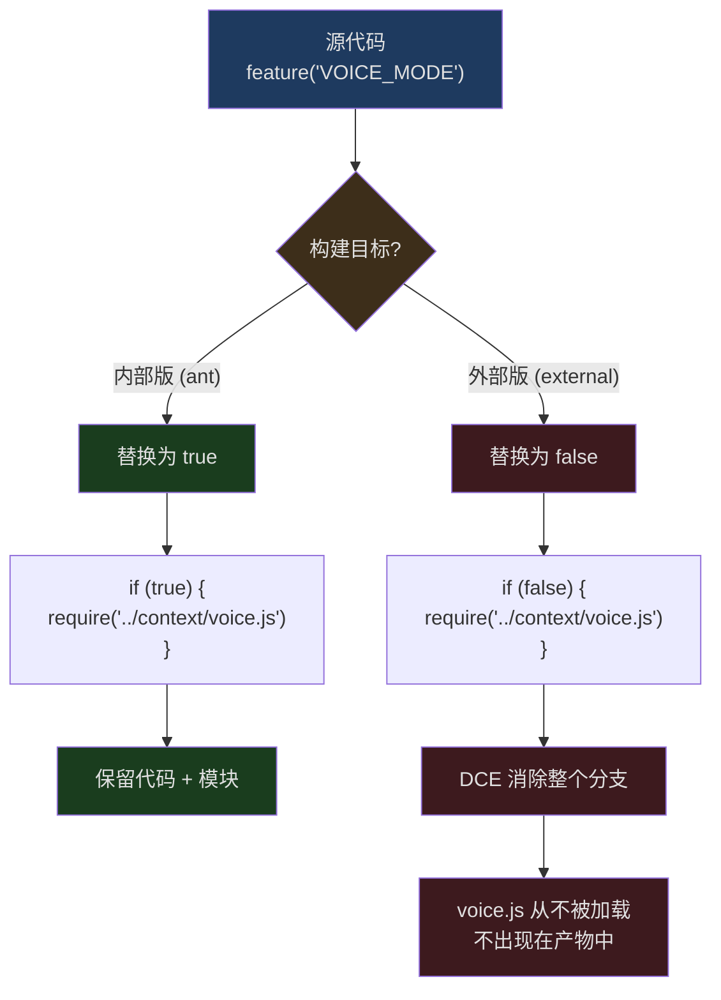
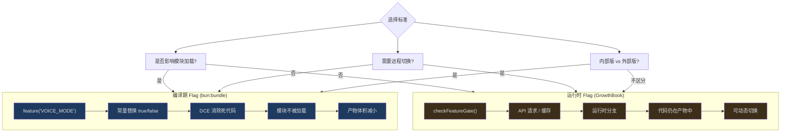

## 问题引入

Feature Flag 在 Web 开发中通常是运行时概念——LaunchDarkly、Unleash 这类平台在用户请求时动态决定功能开关。但 Claude Code 面对的是完全不同的约束：

1. **它是分发给外部用户的 CLI** — 不是所有功能都应该出现在公开发行版中
2. **启动速度极端敏感** — 加载未使用功能的模块是浪费
3. **内部版和外部版差异巨大** — 语音模式、Buddy 宠物、协调器模式只在内部版存在

运行时 flag 无法解决这些问题。即使 `if (false) { ... }` 中的代码不会执行，它的模块仍然会被加载和解析。Claude Code 需要的是**编译期**的代码消除——让不需要的功能从最终产物中彻底消失。

这就是 `bun:bundle` 的 `feature()` API 的用武之地。

## feature() API 的工作原理

```typescript
import { feature } from 'bun:bundle'

// 编译期常量——在打包时被替换为 true 或 false
if (feature('VOICE_MODE')) {
  // 这个分支的全部代码，在外部构建中被消除
  const VoiceProvider = require('../context/voice.js').VoiceProvider
}
```

`feature()` 不是一个函数调用——它是一个**编译器指令**。Bun 的打包器在构建时：

1. 读取构建配置中的 feature flag 定义
2. 将 `feature('FLAG_NAME')` 替换为对应的布尔字面量 `true` 或 `false`
3. JavaScript 引擎的常量折叠优化将 `if (false) { ... }` 识别为死代码
4. Tree-shaking 移除所有不可达的代码路径和相关的 `require()` 调用

### 内部版 vs 外部版



## 完整的 Flag 清单

Claude Code 代码库中使用了超过 85 个独立的 feature flag。以下按功能域分组：

### 核心产品功能

| Flag | 用途 |
|------|------|
| `KAIROS` | 助手模式（Claude Assistant） |
| `KAIROS_BRIEF` | 助手简洁模式 |
| `KAIROS_CHANNELS` | 助手频道（Telegram/iMessage） |
| `KAIROS_DREAM` | 助手自主执行 |
| `KAIROS_GITHUB_WEBHOOKS` | GitHub PR 订阅 |
| `KAIROS_PUSH_NOTIFICATION` | 推送通知 |
| `PROACTIVE` | 主动执行模式 |
| `BRIDGE_MODE` | 远程控制桥接 |
| `DAEMON` | 后台守护进程 |
| `VOICE_MODE` | 语音输入/输出 |
| `BUDDY` | 伴侣宠物（彩蛋） |

### 上下文与模型

| Flag | 用途 |
|------|------|
| `CONTEXT_COLLAPSE` | 上下文折叠压缩 |
| `REACTIVE_COMPACT` | 响应式压缩 |
| `CACHED_MICROCOMPACT` | 缓存微压缩 |
| `HISTORY_SNIP` | 历史裁剪 |
| `TOKEN_BUDGET` | Token 预算追踪 |
| `ULTRATHINK` | 超深度思考模式 |
| `COMPACTION_REMINDERS` | 压缩提醒 |
| `BREAK_CACHE_COMMAND` | 缓存打断指令 |
| `PROMPT_CACHE_BREAK_DETECTION` | Prompt Cache 断裂检测 |

### 工具与能力

| Flag | 用途 |
|------|------|
| `AGENT_TRIGGERS` | 定时触发器 (cron) |
| `AGENT_TRIGGERS_REMOTE` | 远程触发器 |
| `MONITOR_TOOL` | 监控工具 |
| `TERMINAL_PANEL` | 终端面板 (tmux) |
| `WEB_BROWSER_TOOL` | 浏览器工具 |
| `CHICAGO_MCP` | Computer Use (macOS) |
| `MCP_SKILLS` | MCP 技能发现 |
| `MCP_RICH_OUTPUT` | MCP 富文本输出 |
| `WORKFLOW_SCRIPTS` | 工作流脚本 |
| `TORCH` | 实验性搜索 |

### 团队与协作

| Flag | 用途 |
|------|------|
| `COORDINATOR_MODE` | 协调器模式 |
| `UDS_INBOX` | Unix Domain Socket 消息收件箱 |
| `FORK_SUBAGENT` | 子 Agent 分叉 |
| `TEAMMEM` | 团队记忆同步 |
| `BG_SESSIONS` | 后台会话 |
| `ULTRAPLAN` | 远程超级计划 |

### 连接与部署

| Flag | 用途 |
|------|------|
| `DIRECT_CONNECT` | 直连模式 |
| `SSH_REMOTE` | SSH 远程执行 |
| `CCR_AUTO_CONNECT` | CCR 自动连接 |
| `CCR_MIRROR` | CCR 镜像同步 |
| `CCR_REMOTE_SETUP` | CCR 远程设置 |
| `SELF_HOSTED_RUNNER` | 自托管运行器 |
| `BYOC_ENVIRONMENT_RUNNER` | BYOC 环境运行 |

### 遥测与诊断

| Flag | 用途 |
|------|------|
| `ENHANCED_TELEMETRY_BETA` | 增强遥测 |
| `COWORKER_TYPE_TELEMETRY` | 协作类型遥测 |
| `MEMORY_SHAPE_TELEMETRY` | 内存形状遥测 |
| `PERFETTO_TRACING` | Perfetto 追踪 |
| `SLOW_OPERATION_LOGGING` | 慢操作记录 |
| `SHOT_STATS` | 输出统计 |
| `DUMP_SYSTEM_PROMPT` | 系统 Prompt 转储 |

### 权限与安全

| Flag | 用途 |
|------|------|
| `TRANSCRIPT_CLASSIFIER` | 转录分类器（auto mode） |
| `BASH_CLASSIFIER` | Bash 命令分类 |
| `VERIFICATION_AGENT` | 验证 Agent |
| `NATIVE_CLIENT_ATTESTATION` | 原生客户端证明 |
| `ANTI_DISTILLATION_CC` | 反蒸馏保护 |

## 条件导入模式

Claude Code 中 `feature()` 与 `require()` 的配合使用遵循一个固定模式。

### 模式一：模块级条件加载

```typescript
// src/tools.ts 行 26-42
const cronTools = feature('AGENT_TRIGGERS')
  ? require('./tools/CronTool/index.js') as typeof import('./tools/CronTool/index.js')
  : null

const RemoteTriggerTool = feature('AGENT_TRIGGERS_REMOTE')
  ? require('./tools/RemoteTriggerTool/index.js').RemoteTriggerTool
  : null

const MonitorTool = feature('MONITOR_TOOL')
  ? require('./tools/MonitorTool/index.js').MonitorTool
  : null

const SendUserFileTool = feature('KAIROS')
  ? require('./tools/SendUserFileTool/index.js').SendUserFileTool
  : null
```

这是最常见的模式。`feature()` 作为三元表达式的条件，`require()` 只在 flag 为 true 时出现。当 flag 为 false 时，整个 `require()` 表达式和对应的模块都被 DCE 消除。

注意 `as typeof import(...)` 类型断言——它保证在 flag 为 true 时，`require` 的返回值具有正确的 TypeScript 类型。

### 模式二：组件级条件渲染

```typescript
// src/state/AppState.tsx 行 14-19
const VoiceProvider: (props: {
  children: React.ReactNode;
}) => React.ReactNode = feature('VOICE_MODE')
  ? require('../context/voice.js').VoiceProvider
  : ({ children }) => children;
```

当 `VOICE_MODE` 关闭时，`VoiceProvider` 被替换为一个直通组件 `({ children }) => children`。上层代码不需要知道 Voice 是否启用——它始终通过 `<VoiceProvider>` 包装子组件。

### 模式三：函数内条件分支

```typescript
// src/main.tsx 行 76-81
const coordinatorModeModule = feature('COORDINATOR_MODE')
  ? require('./coordinator/coordinatorMode.js') as typeof import('./coordinator/coordinatorMode.js')
  : null

const assistantModule = feature('KAIROS')
  ? require('./assistant/index.js') as typeof import('./assistant/index.js')
  : null

const kairosGate = feature('KAIROS')
  ? require('./assistant/gate.js') as typeof import('./assistant/gate.js')
  : null
```

在 `main.tsx` 中，大量模块通过这种模式条件加载。后续使用时配合 null check：

```typescript
// src/main.tsx 行 685
if (feature('KAIROS') && _pendingAssistantChat) {
  // ... 只在 KAIROS 启用时执行
}
```

双重守卫：`feature('KAIROS')` 确保编译期消除，`_pendingAssistantChat` 是运行时的 null check。

### 模式四：Schema 条件字段

```typescript
// src/utils/settings/types.ts 行 61-78
defaultMode: z.enum(
  feature('TRANSCRIPT_CLASSIFIER')
    ? PERMISSION_MODES        // 包含 'auto' 等内部模式
    : EXTERNAL_PERMISSION_MODES  // 仅公开模式
).optional(),
...(feature('TRANSCRIPT_CLASSIFIER')
  ? { disableAutoMode: z.enum(['disable']).optional() }
  : {}),
```

Schema 的形状本身是条件化的。外部构建的 Schema 根本没有 `disableAutoMode` 字段——不只是隐藏，而是在类型系统中不存在。

### 模式五：命令注册

```typescript
// src/commands.ts 行 63-118
feature('PROACTIVE') || feature('KAIROS')
  ? require('./commands/proactive.js').default : null

const bridge = feature('BRIDGE_MODE')
  ? require('./commands/bridge/index.js').default : null

feature('DAEMON') && feature('BRIDGE_MODE')
  ? require('./commands/daemon.js').default : null

const voiceCommand = feature('VOICE_MODE')
  ? require('./commands/voice/voice.js').default : null

const ultraplan = feature('ULTRAPLAN')
  ? require('./commands/ultraplan.js').default : null

const buddy = feature('BUDDY')
  ? require('./commands/buddy.js').default : null
```

每个斜杠命令的注册都受 feature flag 控制。外部版本的用户不会看到 `/voice`、`/buddy`、`/ultraplan` 等命令——它们的代码完全不存在于产物中。

## 编译期 vs 运行时 Flag



Claude Code 同时使用两种 flag 系统：

### 编译期 Feature Flag（`bun:bundle`）

- **决策时机**：打包/构建时
- **控制粒度**：整个模块/功能的存在与否
- **典型用途**：内部版专属功能（Voice、Buddy、Coordinator）
- **优势**：零运行时开销、减少产物体积、不可能在生产环境意外启用
- **劣势**：修改需要重新发布

### 运行时 Feature Flag（GrowthBook）

- **决策时机**：运行时，可能使用缓存
- **控制粒度**：行为参数（采样率、批处理大小）
- **典型用途**：遥测配置、A/B 实验、紧急开关
- **优势**：可远程切换、无需发版
- **劣势**：代码仍在产物中、需要网络请求

### 选择标准

| 问题 | 编译期 | 运行时 |
|------|--------|--------|
| 功能是否只在特定构建中存在？ | 是 | — |
| 功能是否需要加载额外模块？ | 是 | — |
| 功能是否需要 A/B 测试？ | — | 是 |
| 功能是否需要紧急远程关闭？ | — | 是 |
| 功能的开关频率？ | 低（按版本） | 高（随时） |

## 复合 Flag 模式

一些功能使用多个 flag 的组合：

```typescript
// src/commands.ts 行 77
feature('DAEMON') && feature('BRIDGE_MODE')
  ? require('./commands/daemon.js').default : null
```

Daemon 命令只在 `DAEMON` 和 `BRIDGE_MODE` 都启用时才存在。如果任一 flag 为 false，`&&` 的短路求值直接产生 false，整个表达式在编译期被消除。

```typescript
// src/tools.ts 行 26
feature('PROACTIVE') || feature('KAIROS')
```

SendMessageTool 在 `PROACTIVE` 或 `KAIROS` 任一启用时都可用——这意味着两个独立的功能域共享一个工具。

## DCE 的边界与注意事项

### require() 必须在 feature() 分支内

```typescript
// 正确——require 在 feature() 守卫内
const module = feature('X') ? require('./x.js') : null

// 错误——import 在模块顶层，DCE 无法消除
import { x } from './x.js'
if (feature('X')) { x() }
```

ES module 的 `import` 是静态声明，打包器在分析依赖图时就会包含模块。只有 `require()`（CommonJS 动态导入）在条件分支中才能被 DCE 消除。

### TypeScript 类型仍然可用

```typescript
const assistantModule = feature('KAIROS')
  ? require('./assistant/index.js') as typeof import('./assistant/index.js')
  : null
```

`typeof import(...)` 是纯类型操作——不产生运行时代码。即使 `KAIROS` 为 false，TypeScript 仍然知道 `assistantModule` 在非 null 时的类型形状。这允许后续代码做类型安全的 null check：

```typescript
if (feature('KAIROS') && assistantModule) {
  // TypeScript 知道这里 assistantModule 的类型
  assistantModule.isAssistantMode()
}
```

### AppState 中的条件字段

```typescript
// src/state/AppStateStore.ts 行 97-98
// Optional - only present when ENABLE_AGENT_SWARMS is true
showTeammateMessagePreview?: boolean
```

AppState 中使用 `?:` 可选字段来标记受 feature flag 影响的状态。源码注释明确说明了这种耦合关系，帮助开发者理解哪些字段在何种构建中有意义。

## REPL.tsx：Flag 密度最高的文件

`src/screens/REPL.tsx` 是整个代码库中 `feature()` 调用最密集的文件，包含 70+ 次调用。这是因为 REPL 是所有功能的汇聚点：

```typescript
// src/screens/REPL.tsx 行 3
import { feature } from 'bun:bundle';

// 条件模块加载
const useVoiceIntegration = feature('VOICE_MODE')
  ? require('../hooks/useVoiceIntegration.js').useVoiceIntegration
  : () => ({ /* noop */ })

const VoiceKeybindingHandler = feature('VOICE_MODE')
  ? require('../hooks/useVoiceIntegration.js').VoiceKeybindingHandler
  : () => null

const proactiveModule = feature('PROACTIVE') || feature('KAIROS')
  ? require('../proactive/index.js') : null

const useScheduledTasks = feature('AGENT_TRIGGERS')
  ? require('../hooks/useScheduledTasks.js').useScheduledTasks : null

const WebBrowserPanelModule = feature('WEB_BROWSER_TOOL')
  ? require('../tools/WebBrowserTool/WebBrowserPanel.js') : null
```

在 JSX 渲染中：

```typescript
{feature('VOICE_MODE')
  ? <VoiceKeybindingHandler ... /> : null}

{feature('WEB_BROWSER_TOOL')
  ? WebBrowserPanelModule && <WebBrowserPanelModule.WebBrowserPanel />
  : null}

{feature('BUDDY') && companionVisible
  ? <CompanionSprite /> : null}

{feature('ULTRAPLAN')
  ? focusedInputDialog === 'ultraplan-choice' && <UltraplanChoiceDialog ... />
  : null}
```

外部构建中，这些 JSX 表达式都被替换为 `null`，对应的组件代码完全不存在。

## 量化影响

85+ 个 feature flag 意味着外部构建可能排除了数十个完整模块。假设每个被排除的功能模块平均 50KB（代码 + 依赖），DCE 可能节省了数 MB 的产物体积。更重要的是：

- **启动时间** — 不需要加载的模块不需要解析，直接缩短冷启动
- **内存占用** — 不存在的代码不占用 V8 的代码空间
- **攻击面** — 外部用户无法触及内部功能，即使发现了对应的代码路径

## 与传统方案的对比

| 方案 | 运行时开销 | 产物体积 | 类型安全 | 远程控制 |
|------|-----------|---------|---------|---------|
| 环境变量 `if (process.env.X)` | 低 | 不变 | 弱 | 需重启 |
| LaunchDarkly/Unleash | 网络请求 | 不变 | 无 | 实时 |
| GrowthBook（运行时） | 缓存读取 | 不变 | 弱 | 准实时 |
| `bun:bundle` feature() | **零** | **减小** | **强** | **不可** |

`feature()` 的独特优势是**编译期类型安全 + 零运行时开销 + 产物体积减小**的三合一。代价是不支持远程切换——但对于"这个功能在不在这个版本中"这类决策，远程切换本来就不是正确的答案。

## 总结

Claude Code 的 feature flag 系统是编译器能力的极致运用：

- **85+ 个 `feature()` flag** — 覆盖产品功能、工具、连接、遥测、安全等所有维度
- **`bun:bundle` 编译期替换** — `feature('X')` → `true`/`false` → 常量折叠 → DCE
- **条件 `require()` 模式** — 确保被排除功能的模块从不被加载，从不出现在产物中
- **Schema 条件字段** — 配置验证的形状本身随 flag 变化
- **与运行时 GrowthBook 互补** — 编译期决定"有什么"，运行时决定"怎么用"
- **TypeScript 类型安全** — `typeof import(...)` 断言在编译期和运行时都保持正确性

不是所有 feature flag 都需要运行时。当问题是"这个功能应不应该存在于这个二进制文件中"时，编译期 flag 是唯一正确的答案。
