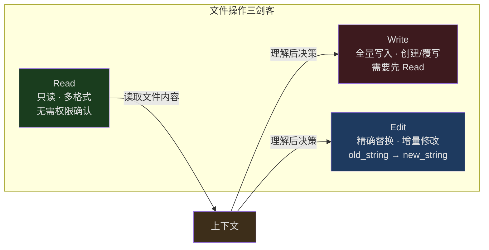
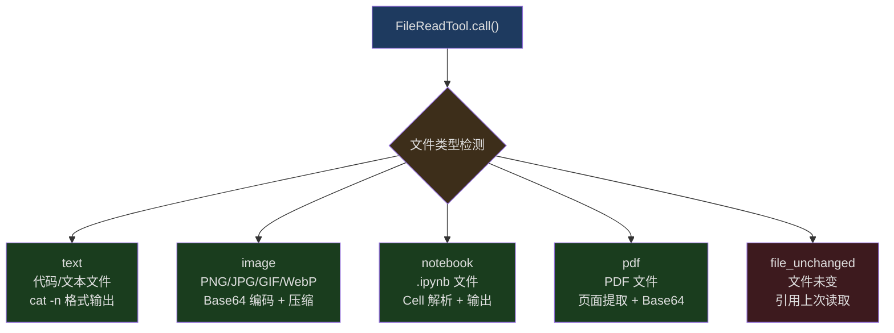
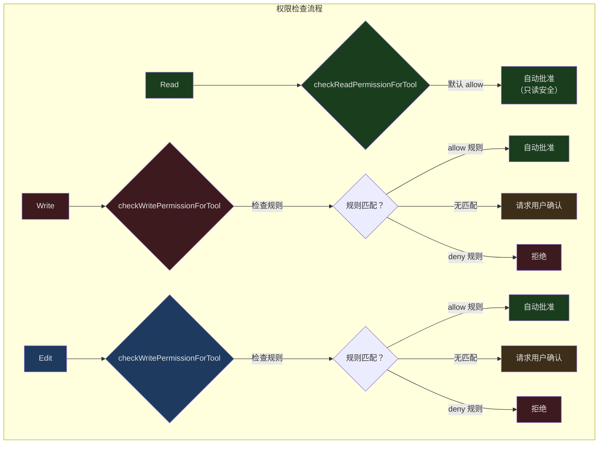
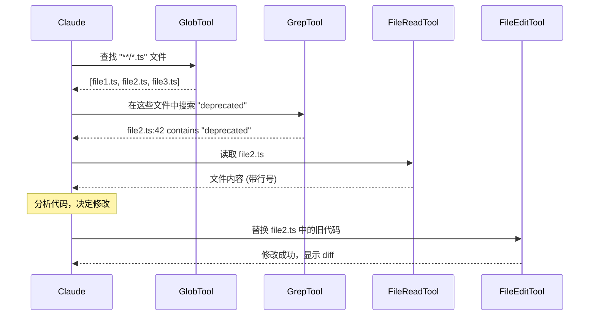

## 问题引入

AI 编码助手最核心的能力是什么？是理解代码逻辑，还是生成高质量的代码？都不是。如果 AI 不能**读取**现有代码、**修改**它、或者**创建**新文件，那么所有的理解和生成能力都毫无意义。

Claude Code 的文件操作系统面对着一组独特的约束：

1. **Token 经济** — 一个 50KB 的文件如果全部读入上下文，会消耗约 12,500 个 token。考虑到上下文窗口的有限性，必须在信息量和 token 消耗之间找到平衡
2. **安全约束** — AI 不应该未经审查就覆写用户的文件，也不应该读取敏感目录
3. **并发安全** — 当多个工具同时运行时，文件状态可能在读取和写入之间发生变化
4. **格式多样性** — 代码文件、图片、PDF、Jupyter Notebook，每种格式需要不同的处理路径

为了应对这些挑战，Claude Code 没有像传统编辑器那样设计一个统一的文件 API，而是将文件操作拆分为三个独立工具：**Read**、**Write**、**Edit**。这种三工具分离不是随意的——它反映了一组深思熟虑的设计决策。

---

## 三工具分离的设计决策



为什么不用一个 `FileOperation` 工具同时支持 read/write/edit？原因有三：

### 权限粒度不同

Read 是只读操作，在默认权限模式下自动批准。Write 和 Edit 修改文件系统，需要用户确认或规则匹配。如果合并为一个工具，权限系统需要在每次调用时解析 `operation` 参数来判断行为——这增加了复杂度和安全风险。

### Token 经济不同

Read 的结果可能非常大（整个文件内容），而 Edit 只需要发送变化的部分。Write 需要发送完整的新内容。将它们分开让 API 的 token 计算和限制策略可以针对每个工具独立调优。

### 并发安全语义不同

Read 可以安全地与任何其他操作并行（`isConcurrencySafe: true`），而 Write 和 Edit 对同一文件的并发执行需要额外的保护。分离后，流式工具执行器可以根据工具类型决定并发策略。

---

## FileReadTool：多格式智能读取

FileReadTool 是整个文件操作体系的起点。它不仅仅是 `cat` 命令的封装——它是一个多格式、token 感知的文件读取引擎。

### 输入 Schema

```typescript
// src/tools/FileReadTool/FileReadTool.ts:227-243
const inputSchema = lazySchema(() =>
  z.strictObject({
    file_path: z.string().describe('The absolute path to the file to read'),
    offset: semanticNumber(z.number().int().nonnegative().optional()).describe(
      'The line number to start reading from. Only provide if the file is too large to read at once',
    ),
    limit: semanticNumber(z.number().int().positive().optional()).describe(
      'The number of lines to read. Only provide if the file is too large to read at once.',
    ),
    pages: z
      .string()
      .optional()
      .describe(
        `Page range for PDF files (e.g., "1-5", "3", "10-20"). Only applicable to PDF files. Maximum ${PDF_MAX_PAGES_PER_READ} pages per request.`,
      ),
  }),
)
```

四个参数的设计意图清晰：

- **file_path** — 必须是绝对路径，避免工作目录歧义
- **offset/limit** — 分页读取大文件，默认读取前 2000 行
- **pages** — PDF 专用参数，每次最多 20 页

### 多格式输出

FileReadTool 的输出是一个 discriminated union，根据文件类型返回不同的数据结构：



### Token 预算控制

文件读取最关键的约束是 token 预算。源码中的限制体系有两层：

```typescript
// src/tools/FileReadTool/limits.ts:1-14
/**
 * Read tool output limits.  Two caps apply to text reads:
 *
 *   | limit         | default | checks                    | cost          | on overflow     |
 *   |---------------|---------|---------------------------|---------------|-----------------|
 *   | maxSizeBytes  | 256 KB  | TOTAL FILE SIZE (not out) | 1 stat        | throws pre-read |
 *   | maxTokens     | 25000   | actual output tokens      | API roundtrip | throws post-read|
 *
 * Known mismatch: maxSizeBytes gates on total file size, not the slice.
 * Tested truncating instead of throwing for explicit-limit reads that
 * exceed the byte cap (#21841, Mar 2026).  Reverted: tool error rate
 * dropped but mean tokens rose — the throw path yields a ~100-byte error
 * tool-result while truncation yields ~25K tokens of content at the cap.
 */
```

这个注释揭示了一个重要的工程权衡：团队曾经尝试在文件超大时截断内容而非抛出错误。结果发现，虽然错误率降低了，但平均 token 消耗上升了——因为截断后仍然返回了大量内容（约 25K tokens），而错误消息只有约 100 字节。**让 AI 快速失败然后用分页重试，比默默截断更节省 token。**

Token 限制的优先级链：

```typescript
// src/tools/FileReadTool/limits.ts:53-92
export const getDefaultFileReadingLimits = memoize((): FileReadingLimits => {
  const override =
    getFeatureValue_CACHED_MAY_BE_STALE<Partial<FileReadingLimits> | null>(
      'tengu_amber_wren',
      {},
    )

  const envMaxTokens = getEnvMaxTokens()
  const maxTokens =
    envMaxTokens ??
    (typeof override?.maxTokens === 'number' &&
    Number.isFinite(override.maxTokens) &&
    override.maxTokens > 0
      ? override.maxTokens
      : DEFAULT_MAX_OUTPUT_TOKENS)

  // ...
})
```

优先级：环境变量 (`CLAUDE_CODE_FILE_READ_MAX_OUTPUT_TOKENS`) > GrowthBook Feature Flag (`tengu_amber_wren`) > 硬编码默认值 (25000)。使用 `memoize` 确保 GrowthBook 值在首次调用时固定，避免限制在会话中途变化。

### 图片处理

当文件是图片时，FileReadTool 使用 Sharp 库进行处理：

```typescript
// src/tools/FileReadTool/imageProcessor.ts:37-67
export async function getImageProcessor(): Promise<SharpFunction> {
  if (imageProcessorModule) {
    return imageProcessorModule.default
  }

  if (isInBundledMode()) {
    // Try to load the native image processor first
    try {
      const imageProcessor = await import('image-processor-napi')
      const sharp = imageProcessor.sharp || imageProcessor.default
      imageProcessorModule = { default: sharp }
      return sharp
    } catch {
      // Fall back to sharp if native module is not available
      console.warn(
        'Native image processor not available, falling back to sharp',
      )
    }
  }

  // Use sharp for non-bundled builds or as fallback.
  const imported = (await import('sharp')) as unknown as MaybeDefault<SharpFunction>
  const sharp = unwrapDefault(imported)
  imageProcessorModule = { default: sharp }
  return sharp
}
```

注意双层回退策略：在打包模式下优先使用 `image-processor-napi`（原生 NAPI 模块，更快），失败则回退到 `sharp`。这是因为 NAPI 模块在某些平台上可能不可用。

图片被压缩并限制在 token 预算内后，以 Base64 格式嵌入到多模态消息中，让 Claude 能够"看到"图片内容。

### 文件未变化优化

一个精妙的优化——当文件自上次读取后未发生变化时，FileReadTool 返回一个轻量级的 stub：

```typescript
// src/tools/FileReadTool/prompt.ts:7-8
export const FILE_UNCHANGED_STUB =
  'File unchanged since last read. The content from the earlier Read tool_result in this conversation is still current — refer to that instead of re-reading.'
```

这个 stub 只有约 30 个 token，相比重新发送整个文件内容（可能数千 token），这是一个巨大的节省。检测机制基于 `readFileState` 中存储的文件修改时间戳（mtime）。

### 危险设备路径阻断

```typescript
// src/tools/FileReadTool/FileReadTool.ts:98-115
const BLOCKED_DEVICE_PATHS = new Set([
  // Infinite output — never reach EOF
  '/dev/zero',
  '/dev/random',
  '/dev/urandom',
  '/dev/full',
  // Blocks waiting for input
  '/dev/stdin',
  '/dev/tty',
  '/dev/console',
  // Nonsensical to read
  '/dev/stdout',
  '/dev/stderr',
  // fd aliases for stdin/stdout/stderr
  '/dev/fd/0',
  '/dev/fd/1',
  '/dev/fd/2',
])
```

如果 AI 尝试读取 `/dev/random`，进程将永远不会得到 EOF 而挂起。这些路径被预先阻断。同样的保护也覆盖了 Linux 的 `/proc/self/fd/0-2` 别名。

---

## FileWriteTool：先读后写的安全约束

FileWriteTool 的核心设计原则是：**你不能写一个你没读过的文件。**

### 先读后写验证

```typescript
// src/tools/FileWriteTool/FileWriteTool.ts:196-222
async validateInput({ file_path, content }, toolUseContext: ToolUseContext) {
    const fullFilePath = expandPath(file_path)

    // ... secret check, deny rule check, UNC path check ...

    const readTimestamp = toolUseContext.readFileState.get(fullFilePath)
    if (!readTimestamp || readTimestamp.isPartialView) {
      return {
        result: false,
        message:
          'File has not been read yet. Read it first before writing to it.',
        errorCode: 2,
      }
    }

    // Reuse mtime from the stat above
    const lastWriteTime = Math.floor(fileMtimeMs)
    if (lastWriteTime > readTimestamp.timestamp) {
      return {
        result: false,
        message:
          'File has been modified since read, either by the user or by a linter. Read it again before attempting to write it.',
        errorCode: 3,
      }
    }

    return { result: true }
  },
```

三个错误码对应三种失败场景：

| errorCode | 场景 | 含义 |
|-----------|------|------|
| 2 | 未读取或仅部分读取 | AI 不了解文件完整内容，写入可能破坏现有代码 |
| 3 | 读取后文件被修改 | 用户或 linter 已经修改了文件，基于旧内容的写入会丢失变更 |
| 0 | 团队记忆文件包含密钥 | 安全检查，防止敏感信息被写入共享文件 |

### 原子性写入

```typescript
// src/tools/FileWriteTool/FileWriteTool.ts:267-305
    // Load current state and confirm no changes since last read.
    // Please avoid async operations between here and writing to disk to preserve atomicity.
    let meta: ReturnType<typeof readFileSyncWithMetadata> | null
    try {
      meta = readFileSyncWithMetadata(fullFilePath)
    } catch (e) {
      if (isENOENT(e)) {
        meta = null
      } else {
        throw e
      }
    }

    if (meta !== null) {
      const lastWriteTime = getFileModificationTime(fullFilePath)
      const lastRead = readFileState.get(fullFilePath)
      if (!lastRead || lastWriteTime > lastRead.timestamp) {
        // Timestamp indicates modification, but on Windows timestamps can change
        // without content changes (cloud sync, antivirus, etc.). For full reads,
        // compare content as a fallback to avoid false positives.
        const isFullRead =
          lastRead &&
          lastRead.offset === undefined &&
          lastRead.limit === undefined
        if (!isFullRead || meta.content !== lastRead.content) {
          throw new Error(FILE_UNEXPECTEDLY_MODIFIED_ERROR)
        }
      }
    }

    // Write is a full content replacement — the model sent explicit line endings
    writeTextContent(fullFilePath, content, enc, 'LF')
```

注意代码中的注释："Please avoid async operations between here and writing to disk to preserve atomicity"。这段代码在读取当前内容和写入新内容之间保持同步，避免并发修改导致的竞态条件。

Windows 平台有一个特殊处理：文件的 mtime 可能因为云同步或杀毒软件而改变（但内容未变）。对于完整读取的文件，代码额外比较了文件内容作为回退。

### LSP 通知

文件写入后，FileWriteTool 自动通知 LSP 服务器：

```typescript
// src/tools/FileWriteTool/FileWriteTool.ts:308-326
    const lspManager = getLspServerManager()
    if (lspManager) {
      clearDeliveredDiagnosticsForFile(`file://${fullFilePath}`)
      lspManager.changeFile(fullFilePath, content).catch((err: Error) => {
        logForDebugging(
          `LSP: Failed to notify server of file change for ${fullFilePath}: ${err.message}`,
        )
      })
      lspManager.saveFile(fullFilePath).catch((err: Error) => {
        logForDebugging(
          `LSP: Failed to notify server of file save for ${fullFilePath}: ${err.message}`,
        )
      })
    }
```

这触发了两个 LSP 生命周期事件：`didChange`（内容已修改）和 `didSave`（文件已保存到磁盘）。后者会触发 TypeScript 服务器重新生成诊断信息，让 AI 在下一个循环中看到类型错误等问题。

---

## FileEditTool：精确替换模型

FileEditTool 是三个工具中设计最精妙的。它不是全量替换，而是基于 `old_string → new_string` 的精确替换模型。

### 输入 Schema

```typescript
// src/tools/FileEditTool/types.ts:6-19
const inputSchema = lazySchema(() =>
  z.strictObject({
    file_path: z.string().describe('The absolute path to the file to modify'),
    old_string: z.string().describe('The text to replace'),
    new_string: z
      .string()
      .describe(
        'The text to replace it with (must be different from old_string)',
      ),
    replace_all: semanticBoolean(
      z.boolean().default(false).optional(),
    ).describe('Replace all occurrences of old_string (default false)'),
  }),
)
```

这个模型的核心思想：**AI 只需要指定"什么变了"，而不是发送整个文件。** 对于一个 1000 行的文件中修改 3 行，Edit 只需要传输那 3 行的旧值和新值，而 Write 需要传输全部 1000 行。

### 唯一性约束

```typescript
// src/tools/FileEditTool/prompt.ts:20-27
function getDefaultEditDescription(): string {
  return `Performs exact string replacements in files.

Usage:${getPreReadInstruction()}
// ...
- The edit will FAIL if \`old_string\` is not unique in the file. Either provide a larger string with more surrounding context to make it unique or use \`replace_all\` to change every instance of \`old_string\`.
- Use \`replace_all\` for replacing and renaming strings across the file. This parameter is useful if you want to rename a variable for instance.`
}
```

如果 `old_string` 在文件中出现多次且 `replace_all` 为 false，编辑将失败。这个约束强制 AI 提供足够的上下文来唯一标识修改位置，避免意外修改了错误的代码段。

### 引号归一化

一个容易被忽视但非常实用的特性——curly quote 归一化：

```typescript
// src/tools/FileEditTool/utils.ts:21-37
export const LEFT_SINGLE_CURLY_QUOTE = '\u2018'
export const RIGHT_SINGLE_CURLY_QUOTE = '\u2019'
export const LEFT_DOUBLE_CURLY_QUOTE = '\u201C'
export const RIGHT_DOUBLE_CURLY_QUOTE = '\u201D'

export function normalizeQuotes(str: string): string {
  return str
    .replaceAll(LEFT_SINGLE_CURLY_QUOTE, "'")
    .replaceAll(RIGHT_SINGLE_CURLY_QUOTE, "'")
    .replaceAll(LEFT_DOUBLE_CURLY_QUOTE, '"')
    .replaceAll(RIGHT_DOUBLE_CURLY_QUOTE, '"')
}
```

当 AI 生成的 `old_string` 使用直引号但文件中使用弯引号（或反之），`findActualString` 会尝试引号归一化后的匹配：

```typescript
// src/tools/FileEditTool/utils.ts:73-93
export function findActualString(
  fileContent: string,
  searchString: string,
): string | null {
  // First try exact match
  if (fileContent.includes(searchString)) {
    return searchString
  }

  // Try with normalized quotes
  const normalizedSearch = normalizeQuotes(searchString)
  const normalizedFile = normalizeQuotes(fileContent)

  const searchIndex = normalizedFile.indexOf(normalizedSearch)
  if (searchIndex !== -1) {
    return fileContent.substring(searchIndex, searchIndex + searchString.length)
  }

  return null
}
```

更精妙的是 `preserveQuoteStyle`：当通过归一化匹配成功后，新字符串也会被转换为文件原有的引号风格，保持文件的排版一致性。

### 反消毒化处理

Claude 的 API 会对某些 XML 标签进行消毒（sanitization），将 `<function_results>` 替换为 `<fnr>` 等。当 AI 编辑包含这些字符串的文件时，它看到的是消毒后的版本，但文件中存的是原版。`desanitizeMatchString` 负责还原：

```typescript
// src/tools/FileEditTool/utils.ts:531-550
const DESANITIZATIONS: Record<string, string> = {
  '<fnr>': '<function_results>',
  '<n>': '<name>',
  '</n>': '</name>',
  '<o>': '<output>',
  '</o>': '</output>',
  '<e>': '<error>',
  '</e>': '</error>',
  '<s>': '<system>',
  '</s>': '</system>',
  '<r>': '<result>',
  '</r>': '</result>',
  '< META_START >': 'META_START',
  '\n\nH:': '\n\nHuman:',
  '\n\nA:': '\n\nAssistant:',
}
```

这个映射表列出了所有被 API 消毒的字符串及其原始形式。当 `old_string` 精确匹配失败时，系统会尝试反消毒后的版本重新匹配。同样的替换也会应用于 `new_string`，确保编辑后文件内容的一致性。

### 文件大小保护

```typescript
// src/tools/FileEditTool/FileEditTool.ts:84
const MAX_EDIT_FILE_SIZE = 1024 * 1024 * 1024 // 1 GiB (stat bytes)
```

V8/Bun 的字符串长度限制约为 2^30 个字符（约 10 亿）。对于典型的 ASCII/Latin-1 文件，1 字节 = 1 字符，所以 1 GiB 是一个安全的字节级保护，防止 OOM 而不至于过于限制。

### 编辑应用的核心逻辑

```typescript
// src/tools/FileEditTool/utils.ts:206-228
export function applyEditToFile(
  originalContent: string,
  oldString: string,
  newString: string,
  replaceAll: boolean = false,
): string {
  const f = replaceAll
    ? (content: string, search: string, replace: string) =>
        content.replaceAll(search, () => replace)
    : (content: string, search: string, replace: string) =>
        content.replace(search, () => replace)

  if (newString !== '') {
    return f(originalContent, oldString, newString)
  }

  // 当删除内容时，如果 oldString 不以换行符结尾，
  // 但后面跟着换行符，则一并删除该换行符
  const stripTrailingNewline =
    !oldString.endsWith('\n') && originalContent.includes(oldString + '\n')

  return stripTrailingNewline
    ? f(originalContent, oldString + '\n', newString)
    : f(originalContent, oldString, newString)
}
```

注意 `() => replace` 的使用而非直接传 `replace`：这避免了 `$1`、`$&` 等特殊替换模式被意外解释。当 `newString` 为空（删除操作）时，还有一个智能行为：如果被删除的文本后面紧跟换行符，换行符也会被一并删除，避免留下空行。

---

## 三工具的权限差异



Read 使用 `checkReadPermissionForTool`，在默认模式下自动批准。Write 和 Edit 共用 `checkWritePermissionForTool`，需要显式的 allow 规则或用户确认。

特殊案例：

1. **UNC 路径保护** — 在 Windows 上，`\\server\share` 形式的 UNC 路径会触发 SMB 认证，可能泄露 NTLM 凭据。所有三个工具都跳过对 UNC 路径的文件系统操作
2. **团队记忆密钥检查** — Write 和 Edit 会检查内容是否包含密钥（通过 `checkTeamMemSecrets`），防止敏感信息被写入共享的团队记忆文件
3. **.claude/ 目录** — 项目的 `.claude/` 目录有特殊的权限模式（`CLAUDE_FOLDER_PERMISSION_PATTERN`），在会话级别自动授权

---

## 与搜索工具的集成

文件操作三剑客不是孤立存在的。它们与 Glob 和 Grep 工具形成一个完整的工作流：



在 BashTool 的 prompt 中，系统明确指导 AI 优先使用专用工具而非 shell 命令：

```
- Read files: Use Read (NOT cat/head/tail)
- Edit files: Use Edit (NOT sed/awk)
- Write files: Use Write (NOT echo >/cat <<EOF)
```

这不仅是因为专用工具有更好的权限控制和错误处理，还因为它们的输出格式对 AI 更友好——Read 的 `cat -n` 格式输出带行号，Edit 的 diff 输出让 AI 清楚看到修改了什么。

---

## 设计启示

Claude Code 的文件操作三剑客体现了几个核心设计原则：

1. **职责分离** — Read/Write/Edit 各司其职，而非一个万能工具。这让权限模型更简单，token 预算更精确，并发语义更清晰

2. **防御性编程** — 先读后写验证、mtime 时间戳检查、UNC 路径阻断、设备路径黑名单——每一层都在防范特定的失败模式

3. **Token 感知** — 从 maxTokens 限制到 file_unchanged stub，从 diff 输出到错误快速失败，整个系统围绕"节省上下文空间"进行了深度优化

4. **渐进增强** — 基础的文本读写始终可用，图片/PDF/Notebook 支持按需加载，LSP 集成在有语言服务器时自动激活

这三个工具看似简单——毕竟只是读写文件。但当你将 token 经济、并发安全、权限模型、多格式支持、平台差异这些约束叠加在一起时，它们背后的工程量远超表面所见。'