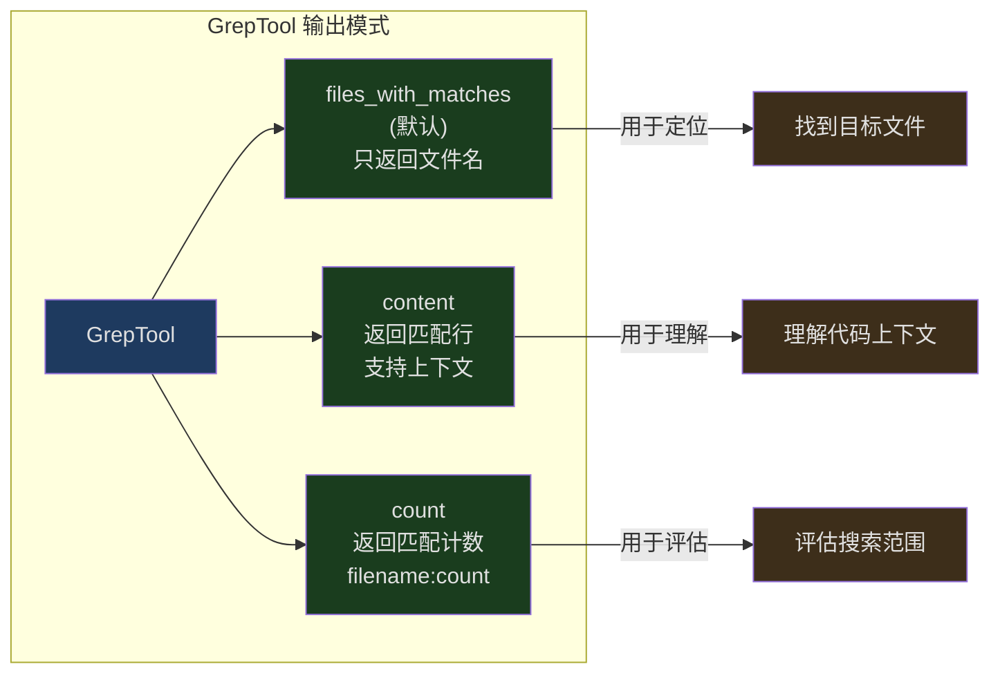
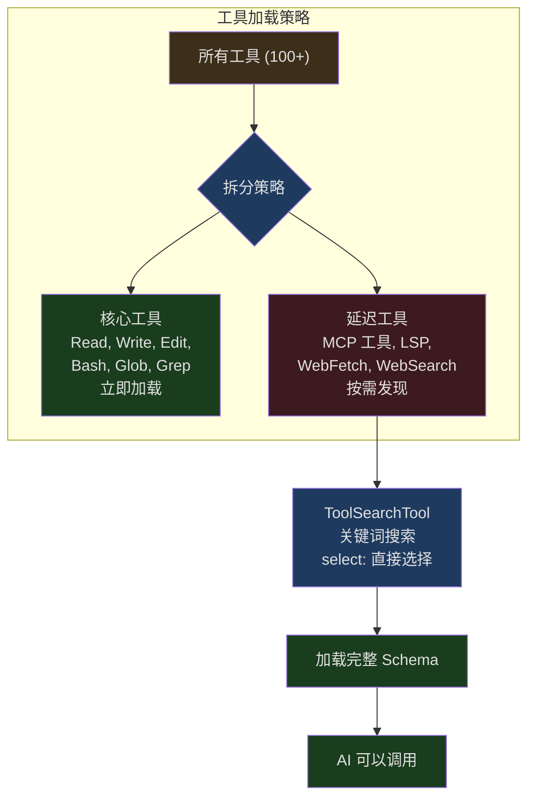
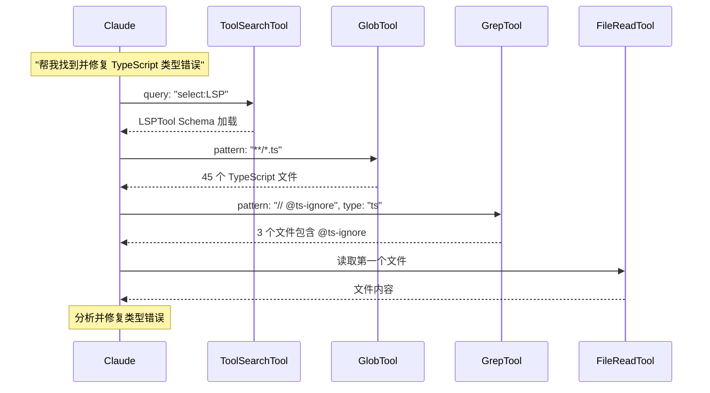

## 问题引入

当 AI 面对一个陌生的代码库时，它的第一个问题不是"怎么改代码"，而是"代码在哪里"。在一个包含上万个文件的项目中，找到正确的文件和代码位置是一切操作的前提。

传统的方法是用 `find` 和 `grep` 命令。但这些命令有几个问题：

1. **权限不可控** — Shell 命令绕过了 Claude Code 的权限系统
2. **输出不可控** — `grep -r pattern .` 可能返回几 MB 的结果，消耗大量 token
3. **格式不友好** — Shell 命令的输出格式对 AI 来说并不总是最优的

Claude Code 的解决方案是三个专用搜索工具：**GlobTool**（按文件名模式查找）、**GrepTool**（按内容搜索）、**ToolSearchTool**（延迟工具发现）。它们各自解决不同层面的搜索问题，组合使用时形成一个强大的搜索体系。

---

## GlobTool：文件模式匹配

GlobTool 是最简单的搜索工具——给定一个 glob 模式（如 `**/*.ts`），返回所有匹配的文件路径。

### 输入与输出

```typescript
// src/tools/GlobTool/GlobTool.ts:26-53
const inputSchema = lazySchema(() =>
  z.strictObject({
    pattern: z.string().describe('The glob pattern to match files against'),
    path: z
      .string()
      .optional()
      .describe(
        'The directory to search in. If not specified, the current working directory will be used...',
      ),
  }),
)

const outputSchema = lazySchema(() =>
  z.object({
    durationMs: z.number().describe('Time taken to execute the search'),
    numFiles: z.number().describe('Total number of files found'),
    filenames: z.array(z.string()).describe('Array of file paths'),
    truncated: z.boolean().describe('Whether results were truncated (limited to 100 files)'),
  }),
)
```

仅两个输入参数：`pattern` 和可选的 `path`。输出包含四个字段，其中 `truncated` 标志告诉 AI 结果是否被截断了。

### 100 文件截断

```typescript
// src/tools/GlobTool/GlobTool.ts:154-176
  async call(input, { abortController, getAppState, globLimits }) {
    const start = Date.now()
    const appState = getAppState()
    const limit = globLimits?.maxResults ?? 100
    const { files, truncated } = await glob(
      input.pattern,
      GlobTool.getPath(input),
      { limit, offset: 0 },
      abortController.signal,
      appState.toolPermissionContext,
    )
    // Relativize paths under cwd to save tokens
    const filenames = files.map(toRelativePath)
    const output: Output = {
      filenames,
      durationMs: Date.now() - start,
      numFiles: filenames.length,
      truncated,
    }
    return { data: output }
  },
```

默认限制 100 个文件。当结果被截断时，返回消息提示 AI 使用更具体的路径或模式。

截断后的消息：

```typescript
// src/tools/GlobTool/GlobTool.ts:186-196
  mapToolResultToToolResultBlockParam(output, toolUseID) {
    if (output.filenames.length === 0) {
      return { tool_use_id: toolUseID, type: 'tool_result', content: 'No files found' }
    }
    return {
      tool_use_id: toolUseID,
      type: 'tool_result',
      content: [
        ...output.filenames,
        ...(output.truncated
          ? ['(Results are truncated. Consider using a more specific path or pattern.)']
          : []),
      ].join('\n'),
    }
  },
```

### 路径相对化

```typescript
// Relativize paths under cwd to save tokens (same as GrepTool)
const filenames = files.map(toRelativePath)
```

所有返回的路径都被相对化——`/Users/noah/project/src/index.ts` 变成 `src/index.ts`。这是一个 token 优化：绝对路径中的项目根路径前缀在每个文件中重复出现，相对化后可以节省大量 token。

### 并发安全性

```typescript
// src/tools/GlobTool/GlobTool.ts:76-81
  isConcurrencySafe() {
    return true
  },
  isReadOnly() {
    return true
  },
```

GlobTool 是完全并发安全的只读操作。多个 GlobTool 调用可以并行执行而不会互相干扰。这意味着 AI 可以同时搜索 `**/*.ts` 和 `**/*.tsx` 而不需要串行化。

---

## GrepTool：基于 ripgrep 的内容搜索

GrepTool 是搜索系统的核心，基于 ripgrep（`rg`）构建，提供了远超原生 `grep` 的功能。

### 丰富的输入 Schema

```typescript
// src/tools/GrepTool/GrepTool.ts:33-89
const inputSchema = lazySchema(() =>
  z.strictObject({
    pattern: z.string().describe('The regular expression pattern to search for'),
    path: z.string().optional().describe('File or directory to search in'),
    glob: z.string().optional().describe('Glob pattern to filter files'),
    output_mode: z.enum(['content', 'files_with_matches', 'count']).optional(),
    '-B': semanticNumber(z.number().optional()).describe('Lines before match'),
    '-A': semanticNumber(z.number().optional()).describe('Lines after match'),
    '-C': semanticNumber(z.number().optional()).describe('Alias for context'),
    context: semanticNumber(z.number().optional()).describe('Lines before and after'),
    '-n': semanticBoolean(z.boolean().optional()).describe('Show line numbers'),
    '-i': semanticBoolean(z.boolean().optional()).describe('Case insensitive'),
    type: z.string().optional().describe('File type (js, py, rust, etc.)'),
    head_limit: semanticNumber(z.number().optional()).describe('Limit output'),
    offset: semanticNumber(z.number().optional()).describe('Skip first N entries'),
    multiline: semanticBoolean(z.boolean().optional()).describe('Multiline mode'),
  }),
)
```

13 个参数！这是 Claude Code 中参数最多的工具。设计理念是：把 ripgrep 的核心能力直接暴露给 AI，而不是做过多抽象。

### 三种输出模式



- **files_with_matches** — 默认模式。只返回匹配文件的路径，按修改时间排序。适合先定位再精读
- **content** — 返回匹配行及其上下文。支持 `-A`/`-B`/`-C` 控制上下文行数
- **count** — 返回每个文件的匹配次数。适合快速评估搜索范围

### 分页系统

```typescript
// src/tools/GrepTool/GrepTool.ts:106-128
const DEFAULT_HEAD_LIMIT = 250

function applyHeadLimit<T>(
  items: T[],
  limit: number | undefined,
  offset: number = 0,
): { items: T[]; appliedLimit: number | undefined } {
  // Explicit 0 = unlimited escape hatch
  if (limit === 0) {
    return { items: items.slice(offset), appliedLimit: undefined }
  }
  const effectiveLimit = limit ?? DEFAULT_HEAD_LIMIT
  const sliced = items.slice(offset, offset + effectiveLimit)
  // Only report appliedLimit when truncation actually occurred
  const wasTruncated = items.length - offset > effectiveLimit
  return {
    items: sliced,
    appliedLimit: wasTruncated ? effectiveLimit : undefined,
  }
}
```

默认限制 250 条结果。设计亮点：

1. `limit: 0` 是"无限制"的逃生舱口
2. `appliedLimit` 只在实际发生截断时才设置，告诉 AI 可以使用 `offset` 分页查看更多结果
3. `offset` 参数实现了 `tail -n +N | head -N` 的效果

### 排除目录

```typescript
// src/tools/GrepTool/GrepTool.ts:94-102
const VCS_DIRECTORIES_TO_EXCLUDE = [
  '.git', '.svn', '.hg', '.bzr', '.jj', '.sl',
] as const
```

版本控制目录自动排除，因为搜索 `.git` 内部几乎不会有用且会产生大量噪音。支持 6 种版本控制系统（Git、SVN、Mercurial、Bazaar、Jujutsu、Sapling）。

### ripgrep 参数构建

```typescript
// src/tools/GrepTool/GrepTool.ts:329-441
  async call({ pattern, path, glob, type, output_mode = 'files_with_matches',
    '-B': context_before, '-A': context_after, '-C': context_c, context,
    '-n': show_line_numbers = true, '-i': case_insensitive = false,
    head_limit, offset = 0, multiline = false,
  }, { abortController, getAppState }) {
    const absolutePath = path ? expandPath(path) : getCwd()
    const args = ['--hidden']

    for (const dir of VCS_DIRECTORIES_TO_EXCLUDE) {
      args.push('--glob', `!${dir}`)
    }

    args.push('--max-columns', '500')  // Limit line length

    if (multiline) {
      args.push('-U', '--multiline-dotall')
    }
    // ... build more args
  }
```

注意 `--max-columns 500`：限制行宽为 500 字符，防止 base64 编码或压缩后的内容（通常一行几千字符）淹没搜索结果。

### files_with_matches 模式的排序

```typescript
// src/tools/GrepTool/GrepTool.ts:529-553
    const stats = await Promise.allSettled(
      results.map(_ => getFsImplementation().stat(_)),
    )
    const sortedMatches = results
      .map((_, i) => {
        const r = stats[i]!
        return [
          _,
          r.status === 'fulfilled' ? (r.value.mtimeMs ?? 0) : 0,
        ] as const
      })
      .sort((a, b) => {
        if (process.env.NODE_ENV === 'test') {
          return a[0].localeCompare(b[0])  // 测试中按文件名排序保证确定性
        }
        const timeComparison = b[1] - a[1]
        if (timeComparison === 0) {
          return a[0].localeCompare(b[0])  // 文件名作为 tiebreaker
        }
        return timeComparison
      })
```

默认按**修改时间降序**排序——最近修改的文件排在前面。这个设计假设是：用户最可能关心的是最近活跃的文件。测试环境中改为按文件名排序，确保结果的确定性。

使用 `Promise.allSettled` 而非 `Promise.all`：当某个文件在 ripgrep 扫描和 stat 之间被删除时，不会导致整个批次失败。失败的 stat 被视为 mtime 0。

### 忽略模式集成

```typescript
// src/tools/GrepTool/GrepTool.ts:412-427
    const ignorePatterns = normalizePatternsToPath(
      getFileReadIgnorePatterns(appState.toolPermissionContext),
      getCwd(),
    )
    for (const ignorePattern of ignorePatterns) {
      const rgIgnorePattern = ignorePattern.startsWith('/')
        ? `!${ignorePattern}`
        : `!**/${ignorePattern}`
      args.push('--glob', rgIgnorePattern)
    }
```

权限系统中配置的 deny 规则被转换为 ripgrep 的 glob 排除模式。非绝对路径需要添加 `**/` 前缀，因为 ripgrep 只对工作目录相对路径应用 gitignore 模式。

---

## ToolSearchTool：延迟工具发现

ToolSearchTool 解决的是一个完全不同的搜索问题：当 Claude Code 有 100+ 个工具时，如何让 AI 高效地找到需要的工具？

### 延迟加载的动机



如果把所有工具的完整 Schema 都放入初始 prompt，会消耗大量 token。ToolSearchTool 实现了一种"工具目录"：延迟工具只有名字出现在 system-reminder 中，AI 需要时通过 ToolSearchTool 获取完整定义。

### 延迟工具判定

```typescript
// src/tools/ToolSearchTool/prompt.ts:62-108
export function isDeferredTool(tool: Tool): boolean {
  // Explicit opt-out via _meta['anthropic/alwaysLoad']
  if (tool.alwaysLoad === true) return false

  // MCP tools are always deferred (workflow-specific)
  if (tool.isMcp === true) return true

  // Never defer ToolSearch itself
  if (tool.name === TOOL_SEARCH_TOOL_NAME) return false

  // Agent tool must be available turn 1 in fork-first mode
  if (feature('FORK_SUBAGENT') && tool.name === AGENT_TOOL_NAME) {
    if (m.isForkSubagentEnabled()) return false
  }

  return tool.shouldDefer === true
}
```

判定规则的优先级：

1. `alwaysLoad: true` — 永不延迟（MCP 工具可通过 `_meta` 设置）
2. MCP 工具 — 默认延迟（工作流特定的）
3. ToolSearchTool 自身 — 永不延迟（用于加载其他工具的工具不能被延迟）
4. 特殊工具（Agent、Brief）— 条件不延迟
5. `shouldDefer: true` — 延迟

### 两种查询模式

```typescript
// src/tools/ToolSearchTool/ToolSearchTool.ts:21-33
export const inputSchema = lazySchema(() =>
  z.object({
    query: z
      .string()
      .describe(
        'Query to find deferred tools. Use "select:<tool_name>" for direct selection, or keywords to search.',
      ),
    max_results: z
      .number()
      .optional()
      .default(5)
      .describe('Maximum number of results to return (default: 5)'),
  }),
)
```

**select: 模式** — 精确选择：`select:Read,Edit,Grep` 直接按名字获取工具。支持逗号分隔的多选。

**关键词搜索** — 模糊搜索：`notebook jupyter` 会搜索工具名称和描述，返回最相关的结果。

### 关键词评分算法

```typescript
// src/tools/ToolSearchTool/ToolSearchTool.ts:259-301
async function searchToolsWithKeywords(query, deferredTools, tools, maxResults) {
  // ...
  const scored = await Promise.all(
    candidateTools.map(async tool => {
      const parsed = parseToolName(tool.name)
      const description = await getToolDescriptionMemoized(tool.name, tools)
      const hintNormalized = tool.searchHint?.toLowerCase() ?? ''

      let score = 0
      for (const term of allScoringTerms) {
        const pattern = termPatterns.get(term)!

        // Exact part match (high weight for MCP server names)
        if (parsed.parts.includes(term)) {
          score += parsed.isMcp ? 12 : 10
        } else if (parsed.parts.some(part => part.includes(term))) {
          score += parsed.isMcp ? 6 : 5
        }

        // searchHint match — curated phrase, higher signal than prompt
        if (hintNormalized && pattern.test(hintNormalized)) {
          score += 4
        }

        // Description match - word boundary to avoid false positives
        if (pattern.test(descNormalized)) {
          score += 2
        }
      }

      return { name: tool.name, score }
    }),
  )
}
```

评分层次：
| 匹配类型 | 分数 (普通) | 分数 (MCP) |
|----------|------------|------------|
| 工具名精确部分匹配 | 10 | 12 |
| 工具名包含匹配 | 5 | 6 |
| searchHint 匹配 | 4 | 4 |
| 全名回退匹配 | 3 | 3 |
| 描述词边界匹配 | 2 | 2 |

MCP 工具的名称匹配得分更高，因为 MCP 工具名通常包含服务器名称（如 `mcp__slack__send_message`），按服务器名搜索是最常见的查询模式。

### `+` 前缀的必需词

```typescript
// src/tools/ToolSearchTool/ToolSearchTool.ts:223-232
  const requiredTerms: string[] = []
  const optionalTerms: string[] = []
  for (const term of queryTerms) {
    if (term.startsWith('+') && term.length > 1) {
      requiredTerms.push(term.slice(1))
    } else {
      optionalTerms.push(term)
    }
  }
```

`+slack send` 表示：工具名或描述中**必须**包含 "slack"，然后在满足条件的工具中按 "send" 相关性排序。这让搜索更精确。

### 工具引用返回

```typescript
// src/tools/ToolSearchTool/ToolSearchTool.ts:444-470
  mapToolResultToToolResultBlockParam(content: Output, toolUseID: string) {
    if (content.matches.length === 0) {
      let text = 'No matching deferred tools found'
      if (content.pending_mcp_servers?.length > 0) {
        text += `. Some MCP servers are still connecting: ${content.pending_mcp_servers.join(', ')}...`
      }
      return { type: 'tool_result', tool_use_id: toolUseID, content: text }
    }
    return {
      type: 'tool_result',
      tool_use_id: toolUseID,
      content: content.matches.map(name => ({
        type: 'tool_reference' as const,
        tool_name: name,
      })),
    }
  },
```

返回 `tool_reference` 类型的内容块——这是 Anthropic API 的特殊格式，告诉 API 将匹配工具的完整 Schema 注入到模型的上下文中。AI 在下一个轮次就可以使用这些工具了。

当某些 MCP 服务器仍在连接中时，返回消息会包含挂起的服务器列表，提示 AI 稍后重试。

---

## 三工具组合工作流



典型的使用顺序：

1. **ToolSearchTool** — 如果需要特殊工具（LSP、WebFetch 等），先通过 ToolSearch 加载
2. **GlobTool** — 建立文件清单，了解项目结构
3. **GrepTool** — 在目标文件中搜索具体内容
4. **FileReadTool** — 精读找到的文件

这个顺序从粗到细，逐步缩小搜索范围。每一步都使用了路径相对化来节省 token。

---

## Prompt 引导

BashTool 的 prompt 明确引导 AI 使用搜索工具而非 Shell 命令：

```typescript
// src/tools/BashTool/prompt.ts:280-286
const toolPreferenceItems = [
  `File search: Use ${GLOB_TOOL_NAME} (NOT find or ls)`,
  `Content search: Use ${GREP_TOOL_NAME} (NOT grep or rg)`,
]
```

GrepTool 自己的 prompt 也强调了这一点：

```typescript
// src/tools/GrepTool/prompt.ts:7-17
`A powerful search tool built on ripgrep

  Usage:
  - ALWAYS use Grep for search tasks. NEVER invoke \`grep\` or \`rg\` as a Bash command.
    The Grep tool has been optimized for correct permissions and access.
  - Supports full regex syntax (e.g., "log.*Error", "function\\s+\\w+")
  - Filter files with glob parameter (e.g., "*.js", "**/*.tsx")
  - Output modes: "content", "files_with_matches" (default), "count"
  - Use Agent tool for open-ended searches requiring multiple rounds
  - Pattern syntax: Uses ripgrep (not grep) - literal braces need escaping`
```

关键词："ALWAYS" 和 "NEVER" 的明确指令，比 "prefer" 更有效地引导 AI 行为。

---

## 设计启示

Claude Code 的搜索系统体现了几个核心设计原则：

1. **专用工具优于通用命令** — Glob/Grep 提供了比 `find`/`grep` 更好的权限控制、token 管理和格式化输出

2. **渐进精炼** — 从 GlobTool 的粗粒度文件发现，到 GrepTool 的细粒度内容搜索，再到 FileReadTool 的完整读取，搜索工作流自然地从粗到细

3. **延迟加载** — ToolSearchTool 让系统可以支持 100+ 工具而不消耗 100+ 工具的 prompt token，只在需要时加载

4. **Token 感知设计** — 路径相对化、结果截断、默认 head_limit、修改时间排序——每个设计决策都考虑了 token 效率
