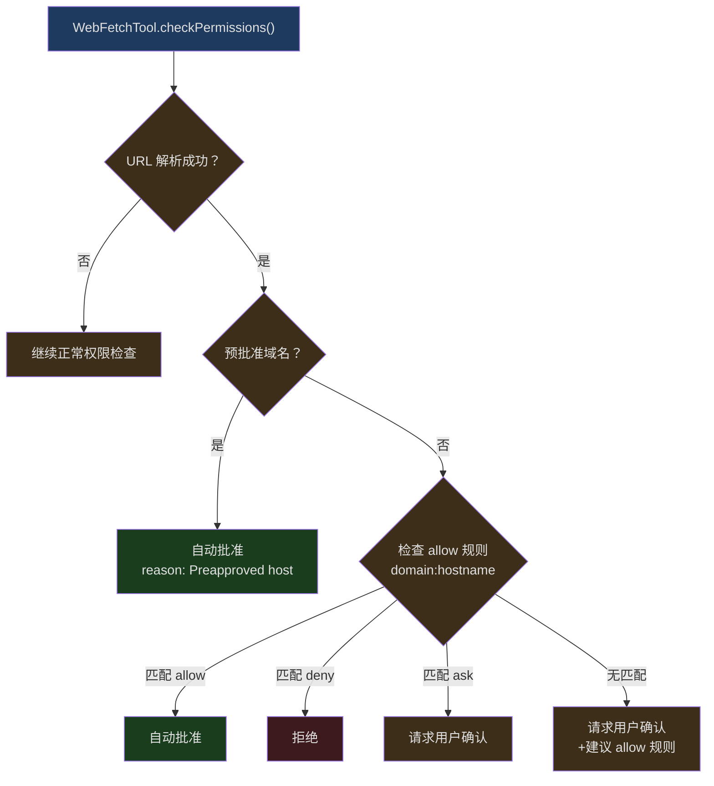
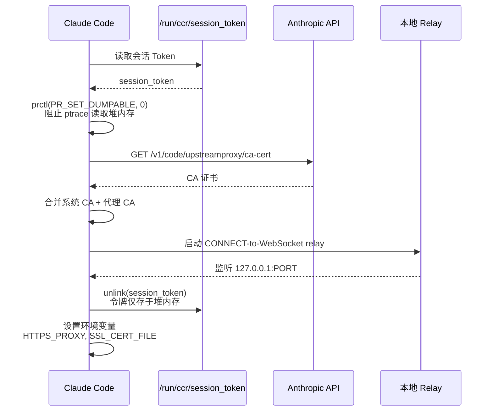
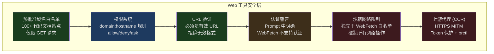

## 问题引入

AI 编码助手的知识有一个天然的截止日期——模型训练数据的时间点。当用户问"React 19 的新 API 怎么用"或"这个 npm 包最新版有什么 breaking changes"时，AI 只能靠互联网访问来获取最新信息。

但让 AI 访问互联网带来了新的安全挑战：

1. **SSRF（Server-Side Request Forgery）** — AI 可能被注入恶意 URL，访问内网服务
2. **数据外泄** — 恶意网页可能指示 AI 将用户代码发送到外部
3. **Token 炸弹** — 一个巨大的网页可能消耗全部上下文空间
4. **认证泄露** — 如果 AI 带着用户的 cookie 或 token 访问网页，可能泄露凭据

Claude Code 通过两个专用工具解决这些问题：**WebFetchTool**（获取指定 URL 的内容）和 **WebSearchTool**（搜索互联网）。在 CCR（Claude Code Remote）环境中，还有一个上游代理层提供额外的网络控制。

---

## WebFetchTool：内容获取

WebFetchTool 从指定 URL 获取内容，并让 AI 用自然语言 prompt 处理获取到的内容。

### 输入模型

```typescript
// src/tools/WebFetchTool/WebFetchTool.ts:24-30
const inputSchema = lazySchema(() =>
  z.strictObject({
    url: z.string().url().describe('The URL to fetch content from'),
    prompt: z.string().describe('The prompt to run on the fetched content'),
  }),
)
```

两个参数：`url` 和 `prompt`。`prompt` 的设计意图是让 AI 不仅仅获取原始内容，而是带着目的去提取信息。例如："从这个 API 文档中提取所有 endpoint 和它们的参数"。

输出包含 HTTP 状态码、处理后的文本、获取时间和内容大小：

```typescript
// src/tools/WebFetchTool/WebFetchTool.ts:32-45
const outputSchema = lazySchema(() =>
  z.object({
    bytes: z.number().describe('Size of the fetched content in bytes'),
    code: z.number().describe('HTTP response code'),
    codeText: z.string().describe('HTTP response code text'),
    result: z.string().describe('Processed result from applying the prompt'),
    durationMs: z.number().describe('Time taken to fetch and process'),
    url: z.string().describe('The URL that was fetched'),
  }),
)
```

### 预批准域名白名单

WebFetchTool 最重要的安全机制之一是预批准域名列表：

```typescript
// src/tools/WebFetchTool/preapproved.ts:14-131
export const PREAPPROVED_HOSTS = new Set([
  // Anthropic
  'platform.claude.com',
  'code.claude.com',
  'modelcontextprotocol.io',

  // Top Programming Languages
  'docs.python.org',
  'en.cppreference.com',
  'developer.mozilla.org',
  'doc.rust-lang.org',
  'www.typescriptlang.org',

  // Web Frameworks
  'react.dev',
  'nextjs.org',
  'vuejs.org',
  'tailwindcss.com',

  // Cloud & DevOps
  'docs.aws.amazon.com',
  'cloud.google.com',
  'kubernetes.io',

  // ... 100+ domains total
])
```

这些域名可以**无需用户确认**即可访问。列表的选择标准是"代码相关的文档站点"——它们是只读的参考资料，不涉及认证或用户数据。

注意源码中的安全警告：

```
// SECURITY WARNING: These preapproved domains are ONLY for WebFetch (GET requests only).
// The sandbox system deliberately does NOT inherit this list for network restrictions,
// as arbitrary network access (POST, uploads, etc.) to these domains could enable
// data exfiltration. Some domains like huggingface.co, kaggle.com, and nuget.org
// allow file uploads and would be dangerous for unrestricted network access.
```

这是一个关键的安全区分：WebFetch 只做 GET 请求（只读），而沙箱的网络限制控制的是任意网络操作（包括 POST）。两者不能共享白名单。

### 路径级别的预批准

```typescript
// src/tools/WebFetchTool/preapproved.ts:136-166
const { HOSTNAME_ONLY, PATH_PREFIXES } = (() => {
  const hosts = new Set<string>()
  const paths = new Map<string, string[]>()
  for (const entry of PREAPPROVED_HOSTS) {
    const slash = entry.indexOf('/')
    if (slash === -1) {
      hosts.add(entry)
    } else {
      const host = entry.slice(0, slash)
      const path = entry.slice(slash)
      const prefixes = paths.get(host)
      if (prefixes) prefixes.push(path)
      else paths.set(host, [path])
    }
  }
  return { HOSTNAME_ONLY: hosts, PATH_PREFIXES: paths }
})()

export function isPreapprovedHost(hostname: string, pathname: string): boolean {
  if (HOSTNAME_ONLY.has(hostname)) return true
  const prefixes = PATH_PREFIXES.get(hostname)
  if (prefixes) {
    for (const p of prefixes) {
      // Enforce path segment boundaries
      if (pathname === p || pathname.startsWith(p + '/')) return true
    }
  }
  return false
}
```

某些域名只对特定路径预批准。例如 `github.com/anthropics` 是预批准的，但 `github.com/random-user` 不是。路径匹配强制要求段边界（`/`），防止 `/anthropics-evil/malware` 被误匹配。

数据结构在模块加载时预处理为两个查找表（`HOSTNAME_ONLY` Set 和 `PATH_PREFIXES` Map），使运行时匹配为 O(1)。

### 权限检查流程



权限规则以 `domain:hostname` 格式存储。当用户批准访问某个域名时，该域名的所有 URL 都被批准。

### Prompt 中的认证警告

```typescript
// src/tools/WebFetchTool/WebFetchTool.ts:181-189
  async prompt(_options) {
    return `IMPORTANT: WebFetch WILL FAIL for authenticated or private URLs. Before using this tool, check if the URL points to an authenticated service (e.g. Google Docs, Confluence, Jira, GitHub). If so, look for a specialized MCP tool that provides authenticated access.
${DESCRIPTION}`
  },
```

这个警告始终包含在 prompt 中，不管 ToolSearchTool 是否可用。源码注释解释了原因：如果这个前缀根据 ToolSearch 可用性有条件地切换，会导致工具描述在连续的 API 调用间"闪烁"（flicker），破坏 Anthropic API 的 prompt 缓存——每次闪烁都意味着两次缓存未命中。

---

## WebSearchTool：互联网搜索

WebSearchTool 使用 Anthropic 的 Web Search API 进行互联网搜索。与 WebFetchTool 不同，它不是获取特定 URL，而是搜索整个互联网。

### 架构特殊性

WebSearchTool 不是简单地调用搜索 API——它是一个**模型套模型**的架构：

```typescript
// src/tools/WebSearchTool/WebSearchTool.ts:254-291
  async call(input, context, _canUseTool, _parentMessage, onProgress) {
    const { query } = input
    const userMessage = createUserMessage({
      content: 'Perform a web search for the query: ' + query,
    })
    const toolSchema = makeToolSchema(input)

    const queryStream = queryModelWithStreaming({
      messages: [userMessage],
      systemPrompt: asSystemPrompt([
        'You are an assistant for performing a web search tool use',
      ]),
      tools: [],
      signal: context.abortController.signal,
      options: {
        extraToolSchemas: [toolSchema],
        querySource: 'web_search_tool',
        // ...
      },
    })
    // ...
  }
```

它创建一个内部的 API 调用，传入 `web_search_20250305` 类型的工具 Schema。API 端会自动执行搜索并返回结果。这种架构的好处是：搜索的实际执行由 Anthropic 的基础设施处理，客户端只需要处理流式响应。

### 搜索限制

```typescript
// src/tools/WebSearchTool/WebSearchTool.ts:76-84
function makeToolSchema(input: Input): BetaWebSearchTool20250305 {
  return {
    type: 'web_search_20250305',
    name: 'web_search',
    allowed_domains: input.allowed_domains,
    blocked_domains: input.blocked_domains,
    max_uses: 8, // Hardcoded to 8 searches maximum
  }
}
```

每次调用最多执行 8 次搜索。`allowed_domains` 和 `blocked_domains` 允许 AI 控制搜索范围——例如只搜索官方文档站点，或排除已知的低质量结果源。

### 提供商可用性

```typescript
// src/tools/WebSearchTool/WebSearchTool.ts:169-193
  isEnabled() {
    const provider = getAPIProvider()
    const model = getMainLoopModel()

    if (provider === 'firstParty') return true

    if (provider === 'vertex') {
      const supportsWebSearch =
        model.includes('claude-opus-4') ||
        model.includes('claude-sonnet-4') ||
        model.includes('claude-haiku-4')
      return supportsWebSearch
    }

    if (provider === 'foundry') return true

    return false
  },
```

WebSearchTool 只在支持 Web Search API 的提供商上可用：Anthropic 第一方、Google Vertex（仅 Claude 4.0+ 模型）和 Foundry。

### 进度报告

```typescript
// src/tools/WebSearchTool/WebSearchTool.ts:298-388
    for await (const event of queryStream) {
      // Track tool use ID when server_tool_use starts
      if (event.type === 'stream_event' &&
          event.event?.type === 'content_block_start') {
        const contentBlock = event.event.content_block
        if (contentBlock?.type === 'server_tool_use') {
          currentToolUseId = contentBlock.id
          currentToolUseJson = ''
        }
      }

      // Accumulate JSON for current tool use
      if (currentToolUseId &&
          event.type === 'stream_event' &&
          event.event?.type === 'content_block_delta') {
        const delta = event.event.delta
        if (delta?.type === 'input_json_delta' && delta.partial_json) {
          currentToolUseJson += delta.partial_json
          // Try to extract query from partial JSON for progress updates
          // ...
        }
      }

      // Yield progress when search results come in
      if (event.type === 'stream_event' &&
          event.event?.type === 'content_block_start') {
        const contentBlock = event.event.content_block
        if (contentBlock?.type === 'web_search_tool_result') {
          // Report progress
          if (onProgress) {
            onProgress({
              toolUseID: toolUseId,
              data: { type: 'search_results_received', resultCount, query },
            })
          }
        }
      }
    }
```

WebSearchTool 在搜索过程中通过 `onProgress` 回调报告进度。由于搜索是流式的，它可以在搜索结果到达时实时更新 UI，而不是等所有搜索完成后才返回。

---

## 上游代理（Upstream Proxy）

在 CCR（Claude Code Remote）环境中，所有网络流量通过上游代理路由，提供额外的安全控制。

### 初始化流程



```typescript
// src/upstreamproxy/upstreamproxy.ts:79-153
export async function initUpstreamProxy(opts?) {
  if (!isEnvTruthy(process.env.CLAUDE_CODE_REMOTE)) return state
  if (!isEnvTruthy(process.env.CCR_UPSTREAM_PROXY_ENABLED)) return state

  const token = await readToken(tokenPath)
  if (!token) return state

  setNonDumpable()

  const caOk = await downloadCaBundle(baseUrl, systemCaPath, caBundlePath)
  if (!caOk) return state

  try {
    const relay = await startUpstreamProxyRelay({ wsUrl, sessionId, token })
    registerCleanup(async () => relay.stop())
    state = { enabled: true, port: relay.port, caBundlePath }

    // Only unlink after the listener is up
    await unlink(tokenPath).catch(() => {})
  } catch (err) {
    // Fail open — a broken proxy must never break a session
  }

  return state
}
```

关键安全措施：

1. **prctl 防护** — `PR_SET_DUMPABLE=0` 阻止同 UID 的进程通过 ptrace 读取此进程的堆内存。这防止了 prompt 注入攻击通过 `gdb -p $PPID` 窃取会话 token

2. **Token 文件删除** — token 在 relay 启动成功后从磁盘删除，仅保留在进程内存中。删除只在 relay 确认可用后执行，以便 supervisor 在失败时可以用磁盘上的 token 重试

3. **失败开放** — 任何步骤的失败都只是禁用代理，不会中断会话。注释说得很清楚："A broken proxy setup must never break an otherwise-working session."

### NO_PROXY 列表

```typescript
// src/upstreamproxy/upstreamproxy.ts:37-63
const NO_PROXY_LIST = [
  'localhost', '127.0.0.1', '::1',
  '169.254.0.0/16',     // Link-local
  '10.0.0.0/8',         // RFC1918
  '172.16.0.0/12',
  '192.168.0.0/16',

  // Anthropic API — three forms because NO_PROXY parsing differs:
  'anthropic.com',       // apex domain fallback
  '.anthropic.com',      // Python urllib/httpx (suffix match)
  '*.anthropic.com',     // Bun, curl, Go (glob match)

  'github.com',
  'registry.npmjs.org',
  'pypi.org',
].join(',')
```

Anthropic API 使用三种格式的同一域名，因为不同的运行时（Bun、Python、Go）解析 `NO_PROXY` 的方式不同。这种防御性编程确保 Anthropic API 请求永远不会通过上游代理，避免了 MITM 代理的伪造 CA 破坏非 Bun 运行时的 HTTPS 验证。

### 环境变量传播

```typescript
// src/upstreamproxy/upstreamproxy.ts:160-199
export function getUpstreamProxyEnv(): Record<string, string> {
  if (!state.enabled || !state.port || !state.caBundlePath) {
    // If we inherited proxy vars from the parent, pass them through
    if (process.env.HTTPS_PROXY && process.env.SSL_CERT_FILE) {
      const inherited: Record<string, string> = {}
      for (const key of ['HTTPS_PROXY', 'https_proxy', 'NO_PROXY', 'no_proxy',
        'SSL_CERT_FILE', 'NODE_EXTRA_CA_CERTS', 'REQUESTS_CA_BUNDLE',
        'CURL_CA_BUNDLE']) {
        if (process.env[key]) inherited[key] = process.env[key]
      }
      return inherited
    }
    return {}
  }
  const proxyUrl = `http://127.0.0.1:${state.port}`
  return {
    HTTPS_PROXY: proxyUrl,
    https_proxy: proxyUrl,       // lowercase for Python
    NO_PROXY: NO_PROXY_LIST,
    no_proxy: NO_PROXY_LIST,     // lowercase for Python
    SSL_CERT_FILE: state.caBundlePath,
    NODE_EXTRA_CA_CERTS: state.caBundlePath,
    REQUESTS_CA_BUNDLE: state.caBundlePath,  // Python requests
    CURL_CA_BUNDLE: state.caBundlePath,      // curl
  }
}
```

代理环境变量以多种格式设置，覆盖不同的客户端库：
- `HTTPS_PROXY` / `https_proxy` — 大小写两种形式（Node.js 用大写，Python 用小写）
- `SSL_CERT_FILE` — OpenSSL 通用
- `NODE_EXTRA_CA_CERTS` — Node.js 专用
- `REQUESTS_CA_BUNDLE` — Python requests 库
- `CURL_CA_BUNDLE` — curl 命令

子进程（Bash、MCP、LSP、Hooks）都通过 `subprocessEnv()` 继承这些变量。

---

## 安全考量总结



六层安全防护，从最宽松（预批准白名单自动通过）到最严格（上游代理 MITM 拦截），形成了纵深防御。

关键的安全隔离：**WebFetch 白名单 =/= 沙箱网络白名单**。huggingface.co 可能是读取文档的安全来源（WebFetch），但允许它通过沙箱进行任意网络操作就可能成为数据外泄通道（支持文件上传）。

---

## 设计启示

Claude Code 的 Web 工具设计体现了几个核心原则：

1. **最小权限** — 默认不允许访问任何域名，只有代码文档站点被预批准，其他需要用户明确授权

2. **安全隔离** — WebFetch（只读 GET）和沙箱网络（任意操作）有独立的白名单，WebSearch 不需要白名单（由 API 端控制）

3. **失败开放 vs 失败关闭** — 上游代理失败时开放（不阻断会话），但权限检查失败时关闭（阻止访问）。这反映了不同组件的风险等级

4. **多运行时兼容** — 环境变量、NO_PROXY 格式、CA 证书路径——每个网络配置都考虑了 Bun/Node.js/Python/curl 的差异
