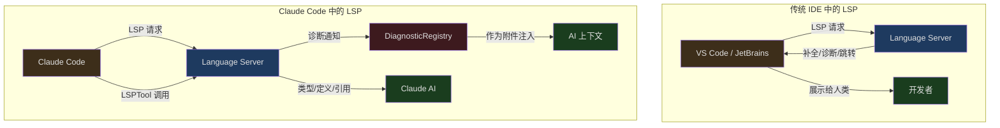
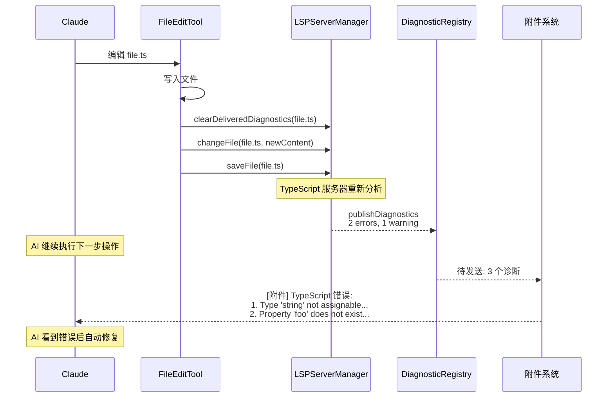

## 问题引入

Language Server Protocol (LSP) 是现代 IDE 的基石——它为编辑器提供了代码补全、跳转到定义、查找引用、悬停信息等能力。但 Claude Code 不是 IDE，它是一个 AI 编码助手。那么，为什么它需要 LSP？

考虑这个场景：AI 修改了一个 TypeScript 文件，将一个函数的参数从 `string` 改为 `number`。但它没有检查所有调用这个函数的地方——一些调用者仍然传入 `string`。如果没有 LSP，AI 不知道自己引入了类型错误，直到用户运行 `tsc` 编译器或在 IDE 中看到红色波浪线。

Claude Code 的 LSP 集成不是为了让终端变成 IDE。它的核心目的是**让 AI 在编辑代码后立即获得语义反馈**——类型错误、未使用的变量、找不到的引用——这些信息帮助 AI 在同一个交互循环中修复自己引入的问题。

---

## LSP 在 Claude Code 中的角色



两个关键区别：

1. **消费者不同** — IDE 中 LSP 的输出给人看；Claude Code 中 LSP 的输出给 AI 看
2. **触发方式不同** — IDE 在用户交互时主动请求 LSP；Claude Code 在文件编辑后被动接收诊断，在 AI 主动调用 LSPTool 时才发起请求

---

## LSPServerManager：多语言服务器管理

### 架构概览

```typescript
// src/services/lsp/LSPServerManager.ts:16-43
export type LSPServerManager = {
  initialize(): Promise<void>
  shutdown(): Promise<void>
  getServerForFile(filePath: string): LSPServerInstance | undefined
  ensureServerStarted(filePath: string): Promise<LSPServerInstance | undefined>
  sendRequest<T>(filePath: string, method: string, params: unknown): Promise<T | undefined>
  getAllServers(): Map<string, LSPServerInstance>
  openFile(filePath: string, content: string): Promise<void>
  changeFile(filePath: string, content: string): Promise<void>
  saveFile(filePath: string): Promise<void>
  closeFile(filePath: string): Promise<void>
  isFileOpen(filePath: string): boolean
}
```

LSPServerManager 管理多个语言服务器实例，根据文件扩展名将请求路由到正确的服务器。它使用**工厂函数模式**（而非类），通过闭包封装内部状态：

```typescript
// src/services/lsp/LSPServerManager.ts:59-65
export function createLSPServerManager(): LSPServerManager {
  const servers: Map<string, LSPServerInstance> = new Map()
  const extensionMap: Map<string, string[]> = new Map()
  const openedFiles: Map<string, string> = new Map()
  // ... 闭包内的私有状态
}
```

### 扩展名到服务器的映射

```typescript
// src/services/lsp/LSPServerManager.ts:88-104
    for (const [serverName, config] of Object.entries(serverConfigs)) {
      if (!config.command) {
        throw new Error(`Server ${serverName} missing required 'command' field`)
      }
      if (!config.extensionToLanguage ||
          Object.keys(config.extensionToLanguage).length === 0) {
        throw new Error(`Server ${serverName} missing required 'extensionToLanguage'`)
      }

      const fileExtensions = Object.keys(config.extensionToLanguage)
      for (const ext of fileExtensions) {
        const normalized = ext.toLowerCase()
        if (!extensionMap.has(normalized)) {
          extensionMap.set(normalized, [])
        }
        extensionMap.get(normalized)!.push(serverName)
      }

      const instance = createLSPServerInstance(serverName, config)
      servers.set(serverName, instance)
    }
```

每个语言服务器配置声明了它支持的文件扩展名和对应的语言标识符。一个扩展名可以映射到多个服务器（虽然不常见）。服务器在首次使用时才启动（懒加载）。

### workspace/configuration 处理

```typescript
// src/services/lsp/LSPServerManager.ts:124-135
      instance.onRequest(
        'workspace/configuration',
        (params: { items: Array<{ section?: string }> }) => {
          logForDebugging(
            `LSP: Received workspace/configuration request from ${serverName}`,
          )
          return params.items.map(() => null)
        },
      )
```

某些语言服务器（如 TypeScript）即使在客户端声明不支持 `workspace/configuration` 时也会发送请求。Claude Code 对每个请求项返回 `null`，满足协议要求而不提供实际配置。

---

## 全局单例与生命周期

```typescript
// src/services/lsp/manager.ts:14-25
type InitializationState = 'not-started' | 'pending' | 'success' | 'failed'

let lspManagerInstance: LSPServerManager | undefined
let initializationState: InitializationState = 'not-started'
let initializationError: Error | undefined
let initializationGeneration = 0
let initializationPromise: Promise<void> | undefined
```

LSP 管理器是一个全局单例，有四种状态：

```mermaid
stateDiagram-v2
  [*] --> not_started
  not_started --> pending: initializeLspServerManager()
  pending --> success: 初始化完成
  pending --> failed: 初始化失败
  failed --> pending: reinitializeLspServerManager()
  success --> not_started: reinitializeLspServerManager()

  state not_started {
    description: 未开始
  }
  state pending {
    description: 正在初始化
  }
  state success {
    description: 初始化成功
  }
  state failed {
    description: 初始化失败
  }
```

### 世代计数器

```typescript
// src/services/lsp/manager.ts:145-207
export function initializeLspServerManager(): void {
  if (isBareMode()) return

  if (lspManagerInstance !== undefined && initializationState !== 'failed') return

  lspManagerInstance = createLSPServerManager()
  initializationState = 'pending'

  const currentGeneration = ++initializationGeneration

  initializationPromise = lspManagerInstance
    .initialize()
    .then(() => {
      if (currentGeneration === initializationGeneration) {
        initializationState = 'success'
        if (lspManagerInstance) {
          registerLSPNotificationHandlers(lspManagerInstance)
        }
      }
    })
    .catch((error: unknown) => {
      if (currentGeneration === initializationGeneration) {
        initializationState = 'failed'
        lspManagerInstance = undefined
      }
    })
}
```

`initializationGeneration` 是一个世代计数器，防止过期的初始化 Promise 更新状态。当 `reinitializeLspServerManager()` 被调用时，世代递增，旧的初始化即使后续完成也不会影响新的状态。

这解决了一个真实的 bug（issue #15521）：`loadAllPlugins()` 被 memoize 且在启动早期调用（通过 `getCommands` 预取），此时 marketplace 还未协调，导致插件列表为空。LSP 用空列表初始化后就再也没有重新初始化。修复方案是在插件刷新时调用 `reinitializeLspServerManager()`。

### 健康检查

```typescript
// src/services/lsp/manager.ts:100-110
export function isLspConnected(): boolean {
  if (initializationState === 'failed') return false
  const manager = getLspServerManager()
  if (!manager) return false
  const servers = manager.getAllServers()
  if (servers.size === 0) return false
  for (const server of servers.values()) {
    if (server.state !== 'error') return true
  }
  return false
}
```

`isLspConnected()` 检查是否至少有一个非错误状态的服务器。这个函数支撑了 `LSPTool.isEnabled()`——只有当 LSP 可用时，LSPTool 才会出现在工具列表中。

---

## LSP Diagnostic Registry：被动诊断注入

LSP 集成最重要的功能不是 LSPTool（那是 AI 主动使用的），而是**被动诊断注入**——语言服务器在后台自动发送诊断，系统将其注入到 AI 的上下文中。

### 通知处理流程

```typescript
// src/services/lsp/passiveFeedback.ts:125-279
export function registerLSPNotificationHandlers(
  manager: LSPServerManager,
): HandlerRegistrationResult {
  const servers = manager.getAllServers()

  for (const [serverName, serverInstance] of servers.entries()) {
    serverInstance.onNotification(
      'textDocument/publishDiagnostics',
      (params: unknown) => {
        // Validate params structure
        if (!params || typeof params !== 'object' ||
            !('uri' in params) || !('diagnostics' in params)) {
          return
        }

        const diagnosticParams = params as PublishDiagnosticsParams

        // Convert LSP diagnostics to Claude format
        const diagnosticFiles = formatDiagnosticsForAttachment(diagnosticParams)

        // Register for async delivery
        registerPendingLSPDiagnostic({
          serverName,
          files: diagnosticFiles,
        })
      },
    )
  }
}
```

每个语言服务器都注册了 `textDocument/publishDiagnostics` 通知处理器。当文件被编辑后，语言服务器重新分析并推送新的诊断信息。

### 严重度映射

```typescript
// src/services/lsp/passiveFeedback.ts:18-35
function mapLSPSeverity(
  lspSeverity: number | undefined,
): 'Error' | 'Warning' | 'Info' | 'Hint' {
  switch (lspSeverity) {
    case 1: return 'Error'
    case 2: return 'Warning'
    case 3: return 'Info'
    case 4: return 'Hint'
    default: return 'Error'
  }
}
```

LSP 协议使用数字表示严重度，Claude Code 将其转换为字符串标签。默认值是 `Error`——当严重度未知时，宁可高估危险性。

### DiagnosticRegistry：去重与限流

```typescript
// src/services/lsp/LSPDiagnosticRegistry.ts:41-47
const MAX_DIAGNOSTICS_PER_FILE = 10
const MAX_TOTAL_DIAGNOSTICS = 30
const MAX_DELIVERED_FILES = 500

const pendingDiagnostics = new Map<string, PendingLSPDiagnostic>()
const deliveredDiagnostics = new LRUCache<string, Set<string>>({
  max: MAX_DELIVERED_FILES,
})
```

三重限制防止诊断信息淹没上下文：

1. **每文件最多 10 条** — 排序后优先保留高严重度（Error > Warning > Info > Hint）
2. **总共最多 30 条** — 全局限制
3. **交叉轮次去重** — 已经发送过的诊断不再重复发送（基于 LRU 缓存，最多跟踪 500 个文件）

去重的键由消息、严重度、范围、来源和代码组成：

```typescript
// src/services/lsp/LSPDiagnosticRegistry.ts:110-124
function createDiagnosticKey(diag: {
  message: string
  severity?: string
  range?: unknown
  source?: string
  code?: unknown
}): string {
  return jsonStringify({
    message: diag.message,
    severity: diag.severity,
    range: diag.range,
    source: diag.source || null,
    code: diag.code || null,
  })
}
```

### 文件编辑时重置

```typescript
// src/services/lsp/LSPDiagnosticRegistry.ts:372-379
export function clearDeliveredDiagnosticsForFile(fileUri: string): void {
  if (deliveredDiagnostics.has(fileUri)) {
    logForDebugging(
      `LSP Diagnostics: Clearing delivered diagnostics for ${fileUri}`,
    )
    deliveredDiagnostics.delete(fileUri)
  }
}
```

当文件被编辑时（FileWriteTool 或 FileEditTool 触发），该文件的已交付诊断被清除。这确保了新的诊断即使内容相同也会被重新发送——因为它们现在对应的是修改后的代码。

---

## LSPTool：AI 主动查询

LSPTool 让 AI 可以主动请求 LSP 功能，而不仅仅被动接收诊断。

### 支持的操作

```typescript
// src/tools/LSPTool/prompt.ts:3-21
export const DESCRIPTION = `Interact with Language Server Protocol (LSP) servers...

Supported operations:
- goToDefinition: Find where a symbol is defined
- findReferences: Find all references to a symbol
- hover: Get hover information (documentation, type info)
- documentSymbol: Get all symbols in a document
- workspaceSymbol: Search for symbols across the workspace
- goToImplementation: Find implementations of an interface
- prepareCallHierarchy: Get call hierarchy item at a position
- incomingCalls: Find all callers of a function
- outgoingCalls: Find all callees of a function`
```

九种操作覆盖了代码导航的核心需求。注意 `incomingCalls` 和 `outgoingCalls` 需要两步协议——先 `prepareCallHierarchy` 获取 `CallHierarchyItem`，再用它请求实际的调用关系。

### 坐标转换

```typescript
// src/tools/LSPTool/LSPTool.ts:427-513
function getMethodAndParams(input: Input, absolutePath: string) {
  const uri = pathToFileURL(absolutePath).href
  // Convert from 1-based (user-friendly) to 0-based (LSP protocol)
  const position = {
    line: input.line - 1,
    character: input.character - 1,
  }
  // ...
}
```

LSP 协议使用 0-based 坐标，但编辑器和 FileReadTool 使用 1-based 坐标。LSPTool 在边界处进行转换，让 AI 可以直接使用从 Read 工具输出中看到的行号。

### Gitignore 过滤

```typescript
// src/tools/LSPTool/LSPTool.ts:556-611
async function filterGitIgnoredLocations<T extends Location>(
  locations: T[],
  cwd: string,
): Promise<T[]> {
  const uniquePaths = uniq(uriToPath.values())
  const BATCH_SIZE = 50
  for (let i = 0; i < uniquePaths.length; i += BATCH_SIZE) {
    const batch = uniquePaths.slice(i, i + BATCH_SIZE)
    const result = await execFileNoThrowWithCwd(
      'git', ['check-ignore', ...batch],
      { cwd, timeout: 5_000 }
    )
    // ... parse ignored paths
  }
  return locations.filter(loc => !ignoredPaths.has(filePath))
}
```

LSP 服务器可能返回 `node_modules` 或其他 gitignored 目录中的结果。Claude Code 使用 `git check-ignore` 批量过滤这些结果（每批 50 个路径），避免 AI 被不相关的引用分散注意力。

### 文件大小限制

```typescript
// src/tools/LSPTool/LSPTool.ts:53
const MAX_LSP_FILE_SIZE_BYTES = 10_000_000
```

超过 10MB 的文件被拒绝进行 LSP 分析。大文件通常是生成的代码或数据文件，LSP 分析它们既慢又没有价值。

### 延迟工具设置

```typescript
// src/tools/LSPTool/LSPTool.ts:137-139
  shouldDefer: true,
  isEnabled() {
    return isLspConnected()
  },
```

LSPTool 被标记为 `shouldDefer: true`——它不会出现在初始 prompt 中，AI 需要通过 ToolSearchTool 加载。`isEnabled()` 检查确保只有当至少一个语言服务器连接成功时，工具才可用。

---

## Bridge LSP 共享

在 Bridge 模式下（Claude Code 作为 VS Code 扩展的后端运行），LSP 的角色发生了变化。VS Code 已经有自己的语言服务器，所以 Claude Code 不需要再启动一套。

```typescript
// src/services/lsp/manager.ts:145-150
export function initializeLspServerManager(): void {
  // --bare / SIMPLE: no LSP
  if (isBareMode()) {
    return
  }
  // ...
}
```

在 bare 模式（脚本化 `-p` 调用）下，LSP 被完全禁用——没有用户交互，不需要诊断反馈。

在 Bridge 模式下，诊断信息可能直接从 VS Code 的 LSP 客户端推送过来（通过 MCP SDK），而不是由 Claude Code 自己管理语言服务器。这避免了两个 LSP 客户端竞争同一个语言服务器的问题。

---

## 与文件编辑工具的集成

LSP 集成最有价值的地方在于它与文件编辑工具的自动配合：



这个流程完全自动化——AI 不需要主动调用任何东西就能获得诊断反馈。FileEditTool 在写入文件后通知 LSP 服务器，服务器分析后推送诊断，诊断通过附件系统注入到 AI 的下一个查询中。

---

## 设计启示

Claude Code 的 LSP 集成体现了几个核心设计原则：

1. **为 AI 设计，而非为人类设计** — LSP 的输出不是用来在 UI 中画红色波浪线的。它被转换为结构化文本，作为附件注入 AI 的上下文

2. **被动优先，主动辅助** — 诊断注入是自动的（被动），LSPTool 是按需的（主动）。大多数时候 AI 不需要主动调用 LSP——错误信息会自动送上门

3. **体积控制** — 每文件 10 条、总共 30 条、LRU 去重——这些限制确保 LSP 信息不会挤占其他有价值的上下文空间

4. **懒启动** — 语言服务器按需启动，LSPTool 延迟加载。在不需要 LSP 的场景中（纯文本编辑、bash 操作），系统不付出 LSP 的初始化成本

5. **防御性错误处理** — 初始化失败返回 undefined 而非抛出异常；世代计数器防止过期回调；每个服务器的通知处理互相隔离——LSP 的任何问题都不会影响 Claude Code 的核心功能
