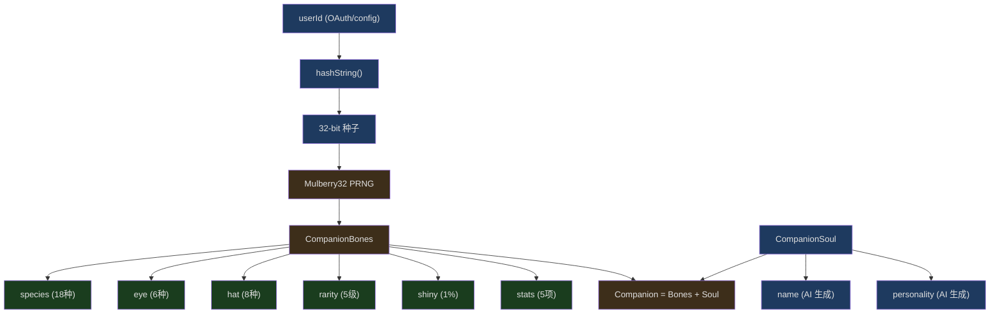
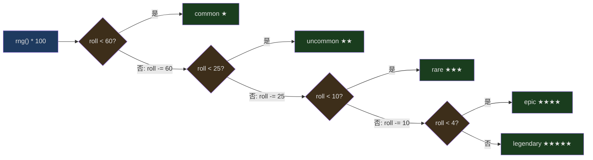
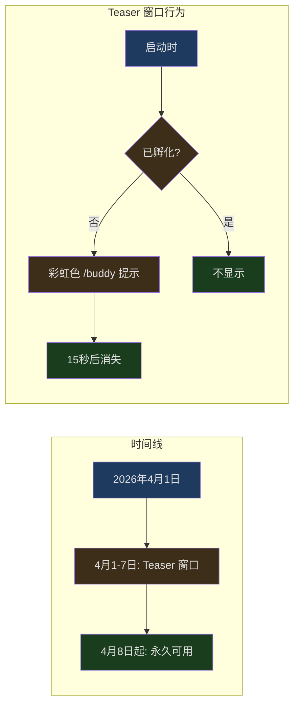

## 问题引入

在一个严肃的 CLI 编码工具中，你输入 `/buddy`，终端里蹦出一只戴着皇冠的鸭子，两只眼睛是 `✦` 符号，旁边显示着 `★★★★★ legendary`。它有名字，有性格，有五项能力值。每次你打开 Claude Code，同一只鸭子都会出现——它是你的。

这不是玩笑。Claude Code 的 Buddy 系统是一个完整的确定性伴侣生成器，它用 PRNG（伪随机数生成器）从你的 userId 派生出一个独一无二的虚拟宠物。这个系统涉及哈希函数、加权概率分布、Bones/Soul 持久化分离等严肃的工程话题。

让我们看看这个"愚人节彩蛋"背后的工程设计。

---

## 系统架构总览



系统分为两条完全不同的数据流：

- **Bones（骨架）** — 确定性派生，永远不持久化。从 userId 重新计算即可得到完全相同的结果
- **Soul（灵魂）** — 模型生成，首次孵化后存入 config，是唯一需要持久化的部分

这个分离设计是整个系统最精妙的架构决策，后文会详细分析。

---

## Mulberry32：确定性随机数生成器

Buddy 系统的核心是一个名为 Mulberry32 的 PRNG（Pseudo-Random Number Generator）。它只有 6 行代码，但决定了每个用户的伴侣长什么样。

```typescript
// src/buddy/companion.ts:16-25
function mulberry32(seed: number): () => number {
  let a = seed >>> 0
  return function () {
    a |= 0
    a = (a + 0x6d2b79f5) | 0
    let t = Math.imul(a ^ (a >>> 15), 1 | a)
    t = (t + Math.imul(t ^ (t >>> 7), 61 | t)) ^ t
    return ((t ^ (t >>> 14)) >>> 0) / 4294967296
  }
}
```

### 为什么选择 Mulberry32

在 PRNG 的世界里，有很多选择——xorshift128+、PCG、Mersenne Twister。Mulberry32 的优势在于：

1. **极致小巧** — 状态只有一个 32 位整数，闭包捕获即可
2. **输出质量好** — 通过了 BigCrush 测试套件中的大部分测试（对于这个用途远远够了）
3. **确定性** — 相同的 seed 永远产生相同的序列

源码注释写得很直白：`"good enough for picking ducks"`。这不是在做密码学，而是在挑鸭子。

### 位运算解析

让我们逐行拆解这个算法：

```
a |= 0                                    // 强制转为 32 位有符号整数
a = (a + 0x6d2b79f5) | 0                  // 加一个大素数作为步进常量
let t = Math.imul(a ^ (a >>> 15), 1 | a)  // 混合：异或右移 + 乘法
t = (t + Math.imul(t ^ (t >>> 7), 61 | t)) ^ t  // 二次混合
return ((t ^ (t >>> 14)) >>> 0) / 4294967296     // 归一化到 [0, 1)
```

`0x6d2b79f5` 是一个精心选择的常数（十进制 1831565813），它的二进制表示中 0 和 1 的分布接近均匀。`>>> 0` 将结果转为无符号 32 位整数，除以 `4294967296`（即 2^32）将其映射到 `[0, 1)` 区间——与 `Math.random()` 的范围一致。

### 从 userId 到种子

```typescript
// src/buddy/companion.ts:27-37
function hashString(s: string): number {
  if (typeof Bun !== 'undefined') {
    return Number(BigInt(Bun.hash(s)) & 0xffffffffn)
  }
  let h = 2166136261
  for (let i = 0; i < s.length; i++) {
    h ^= s.charCodeAt(i)
    h = Math.imul(h, 16777619)
  }
  return h >>> 0
}
```

这里有两条路径：

- **Bun 环境** — 使用 Bun 内置的 `Bun.hash()`（底层是 wyhash），取低 32 位
- **回退路径** — 手写的 FNV-1a 哈希。初始值 `2166136261` 和乘数 `16777619` 是 FNV 标准参数

SALT 常量 `'friend-2026-401'` 被拼接到 userId 后面再哈希，这确保即使知道某人的 userId，也无法不知道 salt 的情况下预测他们的伴侣：

```typescript
// src/buddy/companion.ts:84
const SALT = 'friend-2026-401'
```

名字中的 `401` 暗示了 4 月 1 日——愚人节。

---

## 物种编码：绕过字符串检查的巧技

类型定义文件中有一个有趣的工程决策。看看物种是怎么定义的：

```typescript
// src/buddy/types.ts:14-26
const c = String.fromCharCode
export const duck = c(0x64,0x75,0x63,0x6b) as 'duck'
export const goose = c(0x67, 0x6f, 0x6f, 0x73, 0x65) as 'goose'
export const blob = c(0x62, 0x6c, 0x6f, 0x62) as 'blob'
export const cat = c(0x63, 0x61, 0x74) as 'cat'
export const dragon = c(0x64, 0x72, 0x61, 0x67, 0x6f, 0x6e) as 'dragon'
// ... 13 more species
```

为什么不直接写 `export const duck = 'duck'`？源码注释解释了原因：

> One species name collides with a model-codename canary in excluded-strings.txt. The check greps build output (not source), so runtime-constructing the value keeps the literal out of the bundle while the check stays armed for the actual codename.

Anthropic 有一个 `excluded-strings.txt` 文件，构建流水线会扫描产物中是否包含这些受限字符串（通常是模型代号）。某个物种名恰好与某个模型代号冲突。解决方案不是只对那一个物种做编码，而是**统一编码所有物种名**，这样代码风格一致，未来新增物种时也不需要考虑冲突问题。

18 种物种的完整列表：duck, goose, blob, cat, dragon, octopus, owl, penguin, turtle, snail, ghost, axolotl, capybara, cactus, robot, rabbit, mushroom, chonk。

`as 'duck'` 类型断言确保 TypeScript 的类型系统仍然知道这些值的字面量类型——类型断言在编译期存在，不会出现在构建产物中。

---

## 稀有度系统：加权概率分布

```typescript
// src/buddy/types.ts:126-132
export const RARITY_WEIGHTS = {
  common: 60,
  uncommon: 25,
  rare: 10,
  epic: 4,
  legendary: 1,
} as const satisfies Record<Rarity, number>
```

总权重为 100，所以这些数值直接就是百分比概率。`rollRarity()` 函数实现了加权随机选择：

```typescript
// src/buddy/companion.ts:43-51
function rollRarity(rng: () => number): Rarity {
  const total = Object.values(RARITY_WEIGHTS).reduce((a, b) => a + b, 0)
  let roll = rng() * total
  for (const rarity of RARITIES) {
    roll -= RARITY_WEIGHTS[rarity]
    if (roll < 0) return rarity
  }
  return 'common'
}
```



这是经典的"轮盘赌选择"（roulette wheel selection）算法。每个稀有度占据数轴上一段区间，随机数落在哪个区间就选哪个。最后的 `return 'common'` 是浮点精度的安全网——正常情况下永远不会执行到。

### 稀有度对伴侣的影响

稀有度不仅仅是一个标签，它直接影响两个属性：

**帽子** — `common` 稀有度的伴侣没有帽子：

```typescript
// src/buddy/companion.ts:97
hat: rarity === 'common' ? 'none' : pick(rng, HATS),
```

**属性值下限** — 稀有度越高，所有属性的基础值越高：

```typescript
// src/buddy/companion.ts:53-59
const RARITY_FLOOR: Record<Rarity, number> = {
  common: 5,
  uncommon: 15,
  rare: 25,
  epic: 35,
  legendary: 50,
}
```

一个 legendary 伴侣的 dump stat（最弱属性）都有 `50 - 10 + rand(15)` = 40~54 点，而 common 伴侣的 peak stat（最强属性）也只有 `5 + 50 + rand(30)` = 55~84 点。

---

## 属性系统：Peak/Dump 设计

五项属性的名字充满了程序员幽默：

```typescript
// src/buddy/types.ts:91-98
export const STAT_NAMES = [
  'DEBUGGING',
  'PATIENCE',
  'CHAOS',
  'WISDOM',
  'SNARK',
] as const
```

DEBUGGING（调试）、PATIENCE（耐心）、CHAOS（混沌）、WISDOM（智慧）、SNARK（嘲讽）——这不是游戏属性，这是程序员的人格测试。

属性分配使用了 RPG 游戏中经典的 peak/dump 模式：

```typescript
// src/buddy/companion.ts:62-82
function rollStats(
  rng: () => number,
  rarity: Rarity,
): Record<StatName, number> {
  const floor = RARITY_FLOOR[rarity]
  const peak = pick(rng, STAT_NAMES)
  let dump = pick(rng, STAT_NAMES)
  while (dump === peak) dump = pick(rng, STAT_NAMES)

  const stats = {} as Record<StatName, number>
  for (const name of STAT_NAMES) {
    if (name === peak) {
      stats[name] = Math.min(100, floor + 50 + Math.floor(rng() * 30))
    } else if (name === dump) {
      stats[name] = Math.max(1, floor - 10 + Math.floor(rng() * 15))
    } else {
      stats[name] = floor + Math.floor(rng() * 40)
    }
  }
  return stats
}
```

设计逻辑：

1. 随机选一个**峰值属性**（peak）——它获得 `floor + 50 + rand(30)` 的值
2. 随机选一个**低谷属性**（dump），不能和峰值相同——它获得 `max(1, floor - 10 + rand(15))` 的值
3. 其余属性获得 `floor + rand(40)` 的值

`while (dump === peak) dump = pick(rng, STAT_NAMES)` 这个循环保证 dump 和 peak 不会是同一个属性。理论上这个循环可能执行多次，但每次有 4/5 的概率选中不同属性，所以平均只需要约 1.25 次。

---

## Bones vs Soul：一个巧妙的持久化分离

这是 Buddy 系统中最有工程深度的设计。先看类型定义：

```typescript
// src/buddy/types.ts:100-124
// Deterministic parts — derived from hash(userId)
export type CompanionBones = {
  rarity: Rarity
  species: Species
  eye: Eye
  hat: Hat
  shiny: boolean
  stats: Record<StatName, number>
}

// Model-generated soul — stored in config after first hatch
export type CompanionSoul = {
  name: string
  personality: string
}

export type Companion = CompanionBones &
  CompanionSoul & {
    hatchedAt: number
  }

// What actually persists in config. Bones are regenerated from hash(userId)
// on every read so species renames don't break stored companions and users
// can't edit their way to a legendary.
export type StoredCompanion = CompanionSoul & { hatchedAt: number }
```

持久化到 config 的 `StoredCompanion` 只包含 Soul 部分（`name`、`personality`、`hatchedAt`）。Bones 部分从不持久化——每次需要时从 userId 重新计算。

### 这个设计解决了三个问题

**1. 防作弊** — 用户可以编辑 `~/.claude/config.json`，但修改其中的 `rarity` 字段没有用，因为它会被重新计算的值覆盖：

```typescript
// src/buddy/companion.ts:127-133
export function getCompanion(): Companion | undefined {
  const stored = getGlobalConfig().companion
  if (!stored) return undefined
  const { bones } = roll(companionUserId())
  // bones last so stale bones fields in old-format configs get overridden
  return { ...stored, ...bones }
}
```

`{ ...stored, ...bones }` 中 `bones` 在后面，所以即使 config 中存了旧的 bones 字段，它们也会被新计算的值覆盖。

**2. 安全升级** — 如果开发团队重命名了某个物种（比如把 `blob` 改成 `slime`），或者调整了 `SPECIES` 数组的顺序，不需要做任何数据迁移。旧的 config 中根本没有物种信息，重新生成自然就是新的。

**3. 格式演进** — `StoredCompanion` 只有三个字段，非常稳定。未来 Bones 可以随意添加新属性（比如新的帽子类型），不影响已有的持久化数据。

---

## Roll 缓存：热路径优化

```typescript
// src/buddy/companion.ts:105-113
// Called from three hot paths (500ms sprite tick, per-keystroke PromptInput,
// per-turn observer) with the same userId → cache the deterministic result.
let rollCache: { key: string; value: Roll } | undefined
export function roll(userId: string): Roll {
  const key = userId + SALT
  if (rollCache?.key === key) return rollCache.value
  const value = rollFrom(mulberry32(hashString(key)))
  rollCache = { key, value }
  return value
}
```

注释说明了三个热路径：

1. **500ms sprite tick** — 伴侣精灵的动画帧更新
2. **per-keystroke PromptInput** — 每次按键时的输入框渲染
3. **per-turn observer** — 每个对话轮次的观察者

这三个路径都需要知道当前伴侣的信息，但 userId 在整个会话中不会变化。用一个简单的单值缓存（不是 Map，不是 LRU，就是一个变量）就够了——因为正常使用中 key 永远相同。

这种缓存策略的妙处在于：
- 零依赖（不需要 lodash 的 memoize）
- 最小内存占用（只缓存一个结果）
- 自然失效（如果 userId 变了——比如切换账号——自动重新计算）

---

## 精灵系统：ASCII 艺术动画

每个物种有三帧动画，每帧是 5 行 x 12 宽的 ASCII 字符矩阵：

```typescript
// src/buddy/sprites.ts:27-49 (duck 示例)
const BODIES: Record<Species, string[][]> = {
  [duck]: [
    [
      '            ',
      '    __      ',
      '  <({E} )___  ',
      '   (  ._>   ',
      '    `--´    ',
    ],
    [
      '            ',
      '    __      ',
      '  <({E} )___  ',
      '   (  ._>   ',
      '    `--´~   ',  // 尾巴摇了一下
    ],
    [
      '            ',
      '    __      ',
      '  <({E} )___  ',
      '   (  .__>  ',  // 嘴巴伸长了
      '    `--´    ',
    ],
  ],
```

`{E}` 是眼睛占位符，渲染时替换为伴侣的 eye 类型（`·`、`✦`、`×`、`◉`、`@`、`°`）。

帽子系统在第 0 行覆盖渲染：

```typescript
// src/buddy/sprites.ts:443-452
const HAT_LINES: Record<Hat, string> = {
  none: '',
  crown: '   \\^^^/    ',
  tophat: '   [___]    ',
  propeller: '    -+-     ',
  halo: '   (   )    ',
  wizard: '    /^\\     ',
  beanie: '   (___)    ',
  tinyduck: '    ,>      ',
}
```

渲染逻辑有一个微妙的细节：

```typescript
// src/buddy/sprites.ts:454-468
export function renderSprite(bones: CompanionBones, frame = 0): string[] {
  const frames = BODIES[bones.species]
  const body = frames[frame % frames.length]!.map(line =>
    line.replaceAll('{E}', bones.eye),
  )
  const lines = [...body]
  // Only replace with hat if line 0 is empty
  if (bones.hat !== 'none' && !lines[0]!.trim()) {
    lines[0] = HAT_LINES[bones.hat]
  }
  // Drop blank hat slot when no hat and frame isn't using it
  if (!lines[0]!.trim() && frames.every(f => !f[0]!.trim())) lines.shift()
  return lines
}
```

两个关键判断：

1. **只在空行放帽子** — 有些动画帧的第 0 行有特效（龙的 `~` 烟雾、机器人的 `*` 天线闪烁），这些帧不能被帽子覆盖
2. **去掉空白行** — 如果没有帽子且所有帧的第 0 行都是空的，就去掉这行节省空间。但只有**所有帧**都是空行才行，否则帧之间的高度会跳动

---

## CompanionSprite：React 组件中的动画

伴侣精灵在终端中以 React 组件（Ink）的形式渲染。关键常量定义了动画行为：

```typescript
// src/buddy/CompanionSprite.tsx:16-23
const TICK_MS = 500;
const BUBBLE_SHOW = 20;    // ticks → ~10s at 500ms
const FADE_WINDOW = 6;     // last ~3s the bubble dims
const PET_BURST_MS = 2500; // how long hearts float after /buddy pet

const IDLE_SEQUENCE = [0, 0, 0, 0, 1, 0, 0, 0, -1, 0, 0, 2, 0, 0, 0];
```

`IDLE_SEQUENCE` 是一个 15 帧的循环序列：

- `0` — 静止帧（占 10/15 = 67%，大部分时间在休息）
- `1` — 轻微动作（占 2/15）
- `2` — 较大动作（占 1/15）
- `-1` — 眨眼特效（占 1/15，在静止帧基础上叠加）

每个 tick 500ms，一轮循环 7.5 秒。这个节奏让伴侣看起来像是在"活着"但不会过于分散注意力。

语音气泡（SpeechBubble）有一个渐隐效果：显示 20 个 tick（10 秒），最后 6 个 tick（3 秒）开始变暗。这给用户一个视觉提示——"气泡快要消失了"，而不是突然消失。

---

## Prompt 集成：伴侣如何与 AI 互动

```typescript
// src/buddy/prompt.ts:7-12
export function companionIntroText(name: string, species: string): string {
  return `# Companion

A small ${species} named ${name} sits beside the user's input box and occasionally comments in a speech bubble. You're not ${name} — it's a separate watcher.

When the user addresses ${name} directly (by name), its bubble will answer. Your job in that moment is to stay out of the way: respond in ONE line or less, or just answer any part of the message meant for you. Don't explain that you're not ${name} — they know. Don't narrate what ${name} might say — the bubble handles that.`
}
```

这段 prompt 告诉 Claude AI：

1. **你不是伴侣** — 伴侣是一个独立的实体
2. **用户知道你们不同** — 不需要解释
3. **当用户对伴侣说话时，你退到一边** — 回应不超过一行

这是一个精心设计的 prompt 边界，防止 AI 试图扮演伴侣或者与伴侣的语音气泡冲突。

引入系统还有去重逻辑：

```typescript
// src/buddy/prompt.ts:15-36
export function getCompanionIntroAttachment(
  messages: Message[] | undefined,
): Attachment[] {
  if (!feature('BUDDY')) return []
  const companion = getCompanion()
  if (!companion || getGlobalConfig().companionMuted) return []

  // Skip if already announced for this companion.
  for (const msg of messages ?? []) {
    if (msg.type !== 'attachment') continue
    if (msg.attachment.type !== 'companion_intro') continue
    if (msg.attachment.name === companion.name) return []
  }

  return [
    {
      type: 'companion_intro',
      name: companion.name,
      species: companion.species,
    },
  ]
}
```

检查消息历史中是否已经有同名伴侣的 intro attachment，避免在长对话中重复引入伴侣信息浪费 token。

---

## 发布时间线：Teaser 窗口设计

```typescript
// src/buddy/useBuddyNotification.tsx:12-21
export function isBuddyTeaserWindow(): boolean {
  if ("external" === 'ant') return true;
  const d = new Date();
  return d.getFullYear() === 2026 && d.getMonth() === 3 && d.getDate() <= 7;
}
export function isBuddyLive(): boolean {
  if ("external" === 'ant') return true;
  const d = new Date();
  return d.getFullYear() > 2026 || d.getFullYear() === 2026 && d.getMonth() >= 3;
}
```



两个时间函数定义了发布策略：

1. **Teaser 窗口**（4 月 1-7 日）— 如果用户还没孵化伴侣，启动时显示彩虹色 `/buddy` 提示，15 秒后消失
2. **永久存活**（4 月 8 日起）— `/buddy` 命令永远可用，但不再主动提示

源码注释解释了使用本地时间而非 UTC 的设计原因：

> Local date, not UTC — 24h rolling wave across timezones. Sustained Twitter buzz instead of a single UTC-midnight spike, gentler on soul-gen load.

使用本地时间意味着东京的用户比纽约的用户早 14 小时看到这个彩蛋，产生一个跨越 24 小时的"发现浪潮"，而不是所有人同时涌入——这对后端的 soul 生成（需要调用 Claude 模型来生成名字和性格）更友好。

`"external" === 'ant'` 是一个构建时常量检查。在外部构建中这永远是 `false`（因为字符串 `"external"` 不等于 `"ant"`），而在内部构建中这个值可能不同——让 Anthropic 员工提前测试。

---

## 稀有度视觉系统

```typescript
// src/buddy/types.ts:134-148
export const RARITY_STARS = {
  common: '★',
  uncommon: '★★',
  rare: '★★★',
  epic: '★★★★',
  legendary: '★★★★★',
} as const satisfies Record<Rarity, string>

export const RARITY_COLORS = {
  common: 'inactive',
  uncommon: 'success',
  rare: 'permission',
  epic: 'autoAccept',
  legendary: 'warning',
} as const satisfies Record<Rarity, keyof import('../utils/theme.js').Theme>
```

颜色映射复用了 Claude Code 已有的主题色：
- `common` 用 `inactive`（灰色）——最常见，不需要引人注目
- `legendary` 用 `warning`（金/橙色）——在任何主题下都最醒目

Shiny 标记有 1% 的概率：

```typescript
// src/buddy/companion.ts:98
shiny: rng() < 0.01,
```

组合概率让 shiny legendary 成为万里挑一：`1% * 1% = 0.01%`。

---

## 工程文化的缩影

Buddy 系统虽然是一个彩蛋，但它的工程质量一点不含糊：

**类型安全** — 所有常量数组都用 `as const` 和 `satisfies` 约束。`RARITY_WEIGHTS` 的类型是 `Record<Rarity, number>`，如果新增了一个稀有度级别但忘了添加权重，编译器会报错。

**关注点分离** — Bones（确定性数据）、Soul（持久化数据）、Sprites（渲染逻辑）、Prompt（AI 交互）四个模块各司其职，互不耦合。

**防御性编程** — `rollRarity()` 末尾的 `return 'common'` 是浮点精度安全网；`while (dump === peak)` 防止峰值和低谷重叠；`bones last` 在对象合并中防止旧数据污染。

**性能意识** — 单值缓存优化了三条热路径；ASCII 精灵矩阵用预定义数组而非运行时生成；feature flag 在构建时消除死代码。

**发布策略** — 不是"做完就发"，而是精心设计了 teaser 窗口、时区滚动、内部先测试等机制。

这个系统用大约 800 行代码（不含 CompanionSprite 的 UI 代码），在一个严肃的开发工具中放入了一个完整的宠物养成彩蛋。没有第三方依赖，没有网络请求（除了首次 soul 生成），没有额外的进程——就是纯粹的确定性数学加上一点 ASCII 艺术。

这就是 Anthropic 的工程文化：即使是愚人节彩蛋，也要做得像产品特性一样扎实。
