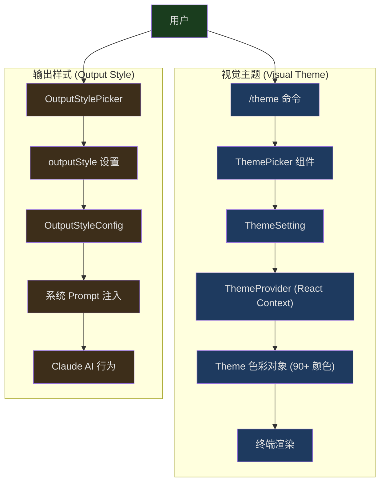
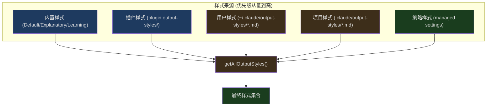
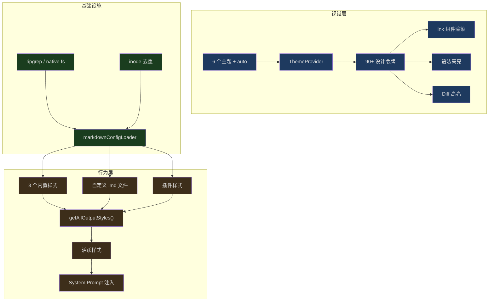

## 问题引入

打开 Claude Code，你会注意到终端有颜色——不是操作系统的默认颜色，而是精心设计的色彩方案。Claude 的回答有橙色边框，权限请求是紫色，diff 用绿/红高亮，代码块有语法高亮。切换到 `/theme light`，所有颜色无缝适配浅色背景。输入 `/output-style Learning`，Claude 的回答风格从简洁变成教学模式，开始解释决策背后的原因。

这背后有两个独立但协作的系统：

1. **Visual Theme（视觉主题）** — 控制颜色、边框、语法高亮等视觉呈现，通过 `/theme` 命令切换
2. **Output Style（输出样式）** — 控制 Claude AI 的回答风格和行为模式，通过 output style picker 选择

本文深入分析这两个系统的设计和实现。

---

## 双系统架构



关键区别：视觉主题改变的是**你看到什么颜色**，输出样式改变的是**AI 说什么话**。两者完全正交——你可以用深色主题配合 Learning 样式，也可以用浅色主题配合默认样式。

---

## 视觉主题系统

### Theme 类型：90+ 语义化颜色

```typescript
// src/utils/theme.ts:4-89
export type Theme = {
  autoAccept: string
  bashBorder: string
  claude: string
  claudeShimmer: string
  permission: string
  permissionShimmer: string
  text: string
  inverseText: string
  inactive: string
  subtle: string
  success: string
  error: string
  warning: string
  diffAdded: string
  diffRemoved: string
  diffAddedWord: string
  diffRemovedWord: string
  // ... 70+ more color tokens
}
```

这不是简单的"前景色/背景色"，而是一个完整的设计令牌（design token）系统。每个颜色都有明确的语义：

- `claude` — Claude 品牌橙色，用于 AI 回答的边框
- `permission` — 紫色，用于权限请求
- `bashBorder` — 粉色，用于 Bash 工具的输出边框
- `success` / `error` / `warning` — 语义状态色
- `diffAdded` / `diffRemoved` — diff 高亮色
- `*Shimmer` — 每个主色都有对应的"微光"变体，用于加载动画

Shimmer 变体是一个细节设计：当 AI 正在思考时，边框会在主色和微光色之间交替闪烁。没有微光变体，动画要么太突兀（两个差异很大的颜色），要么不可见（同一个颜色）。

### 6 个主题变体

```typescript
// src/utils/theme.ts:91-98
export const THEME_NAMES = [
  'dark',
  'light',
  'light-daltonized',
  'dark-daltonized',
  'light-ansi',
  'dark-ansi',
] as const
```

每个变体都针对特定场景优化：

- **dark / light** — 使用明确的 RGB 值，在所有终端上看起来一致
- **\*-daltonized** — 色觉障碍友好版本，避免依赖红/绿区分
- **\*-ansi** — 使用 ANSI 颜色代码而非 RGB，尊重用户自定义的终端配色方案

为什么 `light` 主题用 RGB 而不用 ANSI？因为用户可能在终端中把 ANSI "红色" 配置成亮粉色或暗红色——如果依赖 ANSI 颜色，diff 的红绿可能变得难以区分。用明确的 RGB 值保证了 Anthropic 设计师精心调配的色彩在任何终端上都一样。

而 ANSI 变体存在的意义是：有些用户投入大量精力调配了完美的终端配色，他们希望所有工具都使用自己的配色而不是被覆盖。

### ThemeSetting：'auto' 的智慧

```typescript
// src/utils/theme.ts:103-109
export const THEME_SETTINGS = ['auto', ...THEME_NAMES] as const

// A theme preference as stored in user config. 'auto' follows the system
// dark/light mode and is resolved to a ThemeName at runtime.
export type ThemeSetting = (typeof THEME_SETTINGS)[number]
```

`ThemeSetting` 和 `ThemeName` 是不同的类型。`ThemeSetting` 多了一个 `'auto'` 选项，它在运行时解析为具体的 `ThemeName`。

```typescript
// src/components/design-system/ThemeProvider.tsx:81
const currentTheme: ThemeName = activeSetting === 'auto'
  ? systemTheme : activeSetting;
```

Auto 模式通过 OSC 11 协议查询终端的背景色来判断深浅模式：

```typescript
// src/components/design-system/ThemeProvider.tsx:64-79
useEffect(() => {
  if (feature('AUTO_THEME')) {
    if (activeSetting !== 'auto' || !internal_querier) return;
    let cleanup: (() => void) | undefined;
    let cancelled = false;
    void import('../../utils/systemThemeWatcher.js').then(({
      watchSystemTheme
    }) => {
      if (cancelled) return;
      cleanup = watchSystemTheme(internal_querier, setSystemTheme);
    });
    return () => {
      cancelled = true;
      cleanup?.();
    };
  }
}, [activeSetting, internal_querier]);
```

几个实现细节：

1. **Feature flag 守护** — `AUTO_THEME` feature flag 让整个 `systemThemeWatcher` 模块在外部构建中被死代码消除
2. **动态导入** — `import('../../utils/systemThemeWatcher.js')` 避免在非 auto 模式下加载多余代码
3. **取消语义** — `cancelled` 标志防止组件卸载后设置状态
4. **$COLORFGBG 回退** — 初始化时从环境变量 `$COLORFGBG` 获取近似值，后续 OSC 11 查询纠正

---

## ThemePicker：实时预览的交互组件

```typescript
// src/components/ThemePicker.tsx:19-29
export type ThemePickerProps = {
  onThemeSelect: (setting: ThemeSetting) => void;
  showIntroText?: boolean;
  helpText?: string;
  showHelpTextBelow?: boolean;
  hideEscToCancel?: boolean;
  skipExitHandling?: boolean;
  onCancel?: () => void;
};
```

ThemePicker 有一个"预览"机制——用户在列表中导航时，主题实时切换让用户看到效果，但只有确认选择后才保存：

```typescript
// src/components/design-system/ThemeProvider.tsx:82-100
const value = useMemo<ThemeContextValue>(() => ({
  themeSetting,
  setThemeSetting: (newSetting: ThemeSetting) => {
    setThemeSetting(newSetting);
    setPreviewTheme(null);
    if (newSetting === 'auto') {
      setSystemTheme(getSystemThemeName());
    }
    onThemeSave?.(newSetting);
  },
  setPreviewTheme: (newSetting: ThemeSetting) => {
    setPreviewTheme(newSetting);
    if (newSetting === 'auto') {
      setSystemTheme(getSystemThemeName());
    }
  },
  // ...
```

三个操作的区别：
- `setPreviewTheme(setting)` — 临时切换，不写入 config
- `savePreview()` — 把当前预览保存为正式主题
- `cancelPreview()` — 恢复到预览前的主题

这样用户在挑选主题时可以实时看到每个选项的效果，按 Escape 就回到原来的状态。

---

## /theme 命令：最简斜杠命令

```typescript
// src/commands/theme/index.ts:1-10
import type { Command } from '../../commands.js'

const theme = {
  type: 'local-jsx',
  name: 'theme',
  description: 'Change the theme',
  load: () => import('./theme.js'),
} satisfies Command
```

这是一个 `local-jsx` 类型的命令——它返回一个 React 组件而不是纯文本。`load: () => import('./theme.js')` 使用动态导入实现按需加载。

实际执行逻辑非常简洁：

```typescript
// src/commands/theme/theme.tsx:54-56
export const call: LocalJSXCommandCall = async (onDone, _context) => {
  return <ThemePickerCommand onDone={onDone} />;
};
```

`ThemePickerCommand` 组件包装了 `ThemePicker`，在用户选择后调用 `setTheme(setting)` 和 onDone(Theme set to setting) 完成操作：

```typescript
// src/commands/theme/theme.tsx:13-52
function ThemePickerCommand({ onDone }: Props) {
  const [, setTheme] = useTheme();
  // ... 选择处理
  return (
    <Pane color="permission">
      <ThemePicker
        onThemeSelect={setting => {
          setTheme(setting);
          onDone(`Theme set to ${setting}`);
        }}
        onCancel={() => {
          onDone('Theme picker dismissed', { display: 'system' });
        }}
        skipExitHandling={true}
      />
    </Pane>
  );
}
```

用 `Pane color="permission"` 包裹，让主题选择器使用紫色边框——与其他权限/设置类界面保持视觉一致。

---

## 输出样式系统

### 内置样式：Default、Explanatory、Learning

```typescript
// src/constants/outputStyles.ts:41-135
export const OUTPUT_STYLE_CONFIG: OutputStyles = {
  [DEFAULT_OUTPUT_STYLE_NAME]: null,  // null 表示使用默认行为
  Explanatory: {
    name: 'Explanatory',
    source: 'built-in',
    description:
      'Claude explains its implementation choices and codebase patterns',
    keepCodingInstructions: true,
    prompt: `You are an interactive CLI tool that helps users with software
engineering tasks. In addition to software engineering tasks, you should
provide educational insights about the codebase along the way.
...
## Insights
In order to encourage learning, before and after writing code, always
provide brief educational explanations...`,
  },
  Learning: {
    name: 'Learning',
    source: 'built-in',
    description:
      'Claude pauses and asks you to write small pieces of code for hands-on practice',
    keepCodingInstructions: true,
    prompt: `...
## Requesting Human Contributions
In order to encourage learning, ask the human to contribute 2-10 line
code pieces when generating 20+ lines involving:
- Design decisions (error handling, data structures)
- Business logic with multiple valid approaches
- Key algorithms or interface definitions
...`,
  },
}
```

`Default` 样式的值是 `null`——它不注入任何额外 prompt，Claude 使用自己的默认行为。这个设计避免了"默认模式也有 prompt 开销"的问题。

`keepCodingInstructions: true` 告诉系统在切换到该样式时保留底层的编码指令 prompt，而不是完全替换。这对 Explanatory 和 Learning 样式很重要——它们是在默认行为基础上**叠加**教学能力，而不是替换编码能力。

### Explanatory 样式的 Insight 格式

```typescript
// src/constants/outputStyles.ts:30-37
const EXPLANATORY_FEATURE_PROMPT = `
## Insights
In order to encourage learning, before and after writing code, always
provide brief educational explanations about implementation choices using
(with backticks):
"\`${figures.star} Insight ─────────────────────────────────────\`
[2-3 key educational points]
\`─────────────────────────────────────────────────\`"
`
```

`figures.star` 来自 `figures` 库，在不同终端上渲染为合适的星号字符。整个 Insight 块使用反引号渲染为等宽文本，确保分隔线在终端中对齐。

### Learning 样式的交互模式

Learning 样式最有趣的部分是它要求 AI **暂停并让用户动手**：

```
${figures.bullet} **Learn by Doing**
**Context:** [what's built and why this decision matters]
**Your Task:** [specific function/section in file, mention file and TODO(human)]
**Guidance:** [trade-offs and constraints to consider]
```

Prompt 还指导 AI 在代码中插入 `TODO(human)` 标记——一种在代码库和对话之间创建链接的方式。AI 不应该在发出"Learn by Doing"请求后继续操作，而是等待用户实现。

---

## 自定义输出样式：Markdown 文件加载



自定义样式通过 Markdown 文件定义，放在 `.claude/output-styles/` 目录下。加载逻辑在 `loadOutputStylesDir.ts` 中：

```typescript
// src/outputStyles/loadOutputStylesDir.ts:26-92
export const getOutputStyleDirStyles = memoize(
  async (cwd: string): Promise<OutputStyleConfig[]> => {
    try {
      const markdownFiles = await loadMarkdownFilesForSubdir(
        'output-styles',
        cwd,
      )

      const styles = markdownFiles
        .map(({ filePath, frontmatter, content, source }) => {
          try {
            const fileName = basename(filePath)
            const styleName = fileName.replace(/\.md$/, '')

            const name = (frontmatter['name'] || styleName) as string
            const description =
              coerceDescriptionToString(
                frontmatter['description'],
                styleName,
              ) ??
              extractDescriptionFromMarkdown(
                content,
                `Custom ${styleName} output style`,
              )

            const keepCodingInstructionsRaw =
              frontmatter['keep-coding-instructions']
            const keepCodingInstructions =
              keepCodingInstructionsRaw === true ||
              keepCodingInstructionsRaw === 'true'
                ? true
                : keepCodingInstructionsRaw === false ||
                    keepCodingInstructionsRaw === 'false'
                  ? false
                  : undefined

            return {
              name,
              description,
              prompt: content.trim(),
              source,
              keepCodingInstructions,
            }
          } catch (error) {
            logError(error)
            return null
          }
        })
        .filter(style => style !== null)

      return styles
    } catch (error) {
      logError(error)
      return []
    }
  },
)
```

### 加载流程详解

1. **调用 `loadMarkdownFilesForSubdir('output-styles', cwd)`** — 这个通用函数同时在自定义输出样式中搜索用户目录（`~/.claude/output-styles/`）、项目目录（`.claude/output-styles/`）以及策略管理目录

2. **解析 Frontmatter** — Markdown 文件的 YAML 头部提供名称和描述：
   ```markdown
   ---
   name: Concise
   description: Short and sweet responses
   keep-coding-instructions: true
   ---
   Your style prompt content here...
   ```

3. **文件名作为回退** — 如果 frontmatter 没有 `name` 字段，使用文件名（去掉 `.md` 后缀）

4. **`keep-coding-instructions` 处理** — 支持布尔值和字符串值（`true` / `'true'`），因为 YAML frontmatter 的类型解析不总是一致的

5. **memoize 缓存** — 使用 lodash 的 `memoize` 避免重复扫描文件系统

### 样式合并优先级

```typescript
// src/constants/outputStyles.ts:137-175
export const getAllOutputStyles = memoize(async function getAllOutputStyles(
  cwd: string,
): Promise<{ [styleName: string]: OutputStyleConfig | null }> {
  const customStyles = await getOutputStyleDirStyles(cwd)
  const pluginStyles = await loadPluginOutputStyles()

  const allStyles = {
    ...OUTPUT_STYLE_CONFIG,  // 内置样式作为基础
  }

  const managedStyles = customStyles.filter(
    style => style.source === 'policySettings',
  )
  const userStyles = customStyles.filter(
    style => style.source === 'userSettings',
  )
  const projectStyles = customStyles.filter(
    style => style.source === 'projectSettings',
  )

  // 优先级从低到高：built-in, plugin, user, project, managed
  const styleGroups = [pluginStyles, userStyles, projectStyles, managedStyles]

  for (const styles of styleGroups) {
    for (const style of styles) {
      allStyles[style.name] = { ... }
    }
  }

  return allStyles
})
```

优先级顺序是 `built-in < plugin < user < project < managed`。这意味着：

- 项目可以定义与内置同名的样式来覆盖它
- 企业策略（managed）拥有最高优先级——即使项目定义了同名样式，策略的版本也会胜出
- 同名覆盖而非合并——后加载的完全替换先加载的

---

## Markdown 配置加载器：通用基础设施

输出样式的文件加载不是独立实现的，而是复用了 `markdownConfigLoader.ts` 中的通用基础设施。这个加载器同时服务于 commands、agents、output-styles、skills 等多个子目录：

```typescript
// src/utils/markdownConfigLoader.ts:29-36
export const CLAUDE_CONFIG_DIRECTORIES = [
  'commands',
  'agents',
  'output-styles',
  'skills',
  'workflows',
  ...(feature('TEMPLATES') ? (['templates'] as const) : []),
] as const
```

### 目录遍历策略

```typescript
// src/utils/markdownConfigLoader.ts:234-289
export function getProjectDirsUpToHome(
  subdir: ClaudeConfigDirectory,
  cwd: string,
): string[] {
  const home = resolve(homedir()).normalize('NFC')
  const gitRoot = resolveStopBoundary(cwd)
  let current = resolve(cwd)
  const dirs: string[] = []

  while (true) {
    if (
      normalizePathForComparison(current) ===
      normalizePathForComparison(home)
    ) {
      break
    }

    const claudeSubdir = join(current, '.claude', subdir)
    try {
      statSync(claudeSubdir)
      dirs.push(claudeSubdir)
    } catch (e: unknown) {
      if (!isFsInaccessible(e)) throw e
    }

    if (
      gitRoot &&
      normalizePathForComparison(current) ===
        normalizePathForComparison(gitRoot)
    ) {
      break
    }

    const parent = dirname(current)
    if (parent === current) break
    current = parent
  }

  return dirs
}
```

从当前目录向上遍历，直到遇到 git 根目录或 home 目录。**在 git 根目录处停止**是一个安全决策——防止父目录中的 `.claude/` 配置意外泄漏到子项目中。

例如，如果目录结构是：
```
~/projects/.claude/output-styles/verbose.md
~/projects/my-repo/.claude/output-styles/concise.md
```

当在 `my-repo` 中工作时，如果 `my-repo` 是一个 git 仓库，只会加载 `concise.md`，不会加载 `~/projects/` 级别的 `verbose.md`。

### 文件搜索：双引擎策略

```typescript
// src/utils/markdownConfigLoader.ts:553-568
const useNative = isEnvTruthy(process.env.CLAUDE_CODE_USE_NATIVE_FILE_SEARCH)
const signal = AbortSignal.timeout(3000)
let files: string[]
try {
  files = useNative
    ? await findMarkdownFilesNative(dir, signal)
    : await ripGrep(
        ['--files', '--hidden', '--follow', '--no-ignore',
         '--glob', '*.md'],
        dir,
        signal,
      )
} catch (e: unknown) {
  if (isFsInaccessible(e)) return []
  throw e
}
```

默认使用 ripgrep 查找 `.md` 文件（更快），但提供了 Node.js 原生实现作为回退。两个搜索引擎的差异：

- **ripgrep** — 更快，但在 native build 中启动开销较大
- **Node.js 原生** — 启动快，无需外部进程，但扫描大目录慢

3 秒超时（`AbortSignal.timeout(3000)`）防止在巨大的 `.claude/output-styles/` 目录上挂住。

### 去重：Inode 级别的精确去重

```typescript
// src/utils/markdownConfigLoader.ts:384-407
const fileIdentities = await Promise.all(
  allFiles.map(file => getFileIdentity(file.filePath)),
)

const seenFileIds = new Map<string, SettingSource>()
const deduplicatedFiles: MarkdownFile[] = []

for (const [i, file] of allFiles.entries()) {
  const fileId = fileIdentities[i] ?? null
  if (fileId === null) {
    deduplicatedFiles.push(file)  // fail open
    continue
  }
  const existingSource = seenFileIds.get(fileId)
  if (existingSource !== undefined) {
    logForDebugging(
      `Skipping duplicate file '${file.filePath}' from ${file.source}
       (same inode already loaded from ${existingSource})`,
    )
    continue
  }
  seenFileIds.set(fileId, file.source)
  deduplicatedFiles.push(file)
}
```

使用 `device:inode` 标识符进行去重，这能检测到通过符号链接或硬链接指向同一物理文件的路径。例如，如果 `~/.claude` 是一个指向项目内目录的符号链接，同一个 output-style 文件可能被发现两次——一次作为 user settings，一次作为 project settings。inode 去重确保只加载一次。

`getFileIdentity` 使用 `bigint: true` 调用 `lstat`，因为某些文件系统（如 ExFAT）的 inode 编号可能超过 JavaScript 的 Number 精度（53 位）。

---

## 插件输出样式

```typescript
// src/utils/plugins/loadPluginOutputStyles.ts:15-33
async function loadOutputStylesFromDirectory(
  outputStylesPath: string,
  pluginName: string,
  loadedPaths: Set<string>,
): Promise<OutputStyleConfig[]> {
  const styles: OutputStyleConfig[] = []
  await walkPluginMarkdown(
    outputStylesPath,
    async fullPath => {
      const style = await loadOutputStyleFromFile(
        fullPath,
        pluginName,
        loadedPaths,
      )
      if (style) styles.push(style)
    },
    { logLabel: 'output-styles' },
  )
  return styles
}
```

插件输出样式有一个关键区别——命名空间化：

```typescript
// src/utils/plugins/loadPluginOutputStyles.ts:53-55
const baseStyleName = (frontmatter.name as string) || fileName
const name = `${pluginName}:${baseStyleName}`
```

插件样式名会自动加上 `pluginName:` 前缀，比如 `my-plugin:concise`。这防止不同插件的同名样式冲突。

### force-for-plugin 机制

```typescript
// src/utils/plugins/loadPluginOutputStyles.ts:64-70
const forceRaw = frontmatter['force-for-plugin']
const forceForPlugin =
  forceRaw === true || forceRaw === 'true'
    ? true
    : forceRaw === false || forceRaw === 'false'
      ? false
      : undefined
```

插件可以在 frontmatter 中设置 `force-for-plugin: true`，当该插件启用时自动应用其输出样式，无需用户手动选择。如果多个插件都设置了 force，只会使用第一个并记录警告：

```typescript
// src/constants/outputStyles.ts:194-199
if (forcedStyles.length > 1) {
  logForDebugging(
    `Multiple plugins have forced output styles:
     ${forcedStyles.map(s => s.name).join(', ')}.
     Using: ${firstForcedStyle.name}`,
    { level: 'warn' },
  )
}
```

`force-for-plugin` 只对插件源的样式有效。如果用户自己的 output-style 文件设置了这个字段，会收到一个 debug 级别的警告。

---

## OutputStylePicker：样式选择 UI

```typescript
// src/components/OutputStylePicker.tsx:28-111
export function OutputStylePicker({
  initialStyle,
  onComplete,
  onCancel,
  isStandaloneCommand,
}: OutputStylePickerProps) {
  const [styleOptions, setStyleOptions] = useState([])
  const [isLoading, setIsLoading] = useState(true)

  useEffect(() => {
    getAllOutputStyles(getCwd())
      .then(allStyles => {
        const options = mapConfigsToOptions(allStyles)
        setStyleOptions(options)
        setIsLoading(false)
      })
      .catch(() => {
        // 错误时回退到内置样式
        const builtInOptions = mapConfigsToOptions(OUTPUT_STYLE_CONFIG)
        setStyleOptions(builtInOptions)
        setIsLoading(false)
      })
  }, [])
```

异步加载所有样式（包括自定义和插件），如果加载失败则降级到内置样式。加载过程中显示 `Loading output styles...` 提示。

`mapConfigsToOptions` 将样式配置转换为 Select 组件需要的格式：

```typescript
// src/components/OutputStylePicker.tsx:13-21
function mapConfigsToOptions(styles) {
  return Object.entries(styles).map(([style, config]) => ({
    label: config?.name ?? DEFAULT_OUTPUT_STYLE_LABEL,
    value: style,
    description: config?.description ?? DEFAULT_OUTPUT_STYLE_DESCRIPTION
  }));
}
```

`Default` 样式的 config 是 `null`，所以需要 `??` 提供回退标签和描述。

---

## 缓存清理：全局联动

```typescript
// src/outputStyles/loadOutputStylesDir.ts:94-98
export function clearOutputStyleCaches(): void {
  getOutputStyleDirStyles.cache?.clear?.()
  loadMarkdownFilesForSubdir.cache?.clear?.()
  clearPluginOutputStyleCache()
}
```

```typescript
// src/constants/outputStyles.ts:177-179
export function clearAllOutputStylesCache(): void {
  getAllOutputStyles.cache?.clear?.()
}
```

系统中有多层 memoize 缓存需要协调清理：

1. `getOutputStyleDirStyles` — 目录级样式加载缓存
2. `loadMarkdownFilesForSubdir` — 通用 Markdown 文件搜索缓存
3. `loadPluginOutputStyles` — 插件样式缓存
4. `getAllOutputStyles` — 最终合并结果缓存

`clearOutputStyleCaches()` 一次性清理前三层，`clearAllOutputStylesCache()` 清理最顶层。当用户修改了 `.claude/output-styles/` 下的文件时，需要调用这些函数让新样式生效。

`.cache?.clear?.()` 使用可选链——如果 memoize 的实现没有暴露 cache 对象，静默跳过而不报错。

---

## 分析集成：追踪样式使用

```typescript
// src/utils/promptCategory.ts:36-49
export function getQuerySourceForREPL(): QuerySource {
  const settings = getSettings_DEPRECATED()
  const style = settings?.outputStyle ?? DEFAULT_OUTPUT_STYLE_NAME

  if (style === DEFAULT_OUTPUT_STYLE_NAME) {
    return 'repl_main_thread'
  }

  const isBuiltIn = style in OUTPUT_STYLE_CONFIG
  return isBuiltIn
    ? (`repl_main_thread:outputStyle:${style}` as QuerySource)
    : 'repl_main_thread:outputStyle:custom'
}
```

分析事件区分三种情况：

1. **Default 样式** — `repl_main_thread`（无后缀）
2. **内置非默认样式** — `repl_main_thread:outputStyle:Explanatory`（包含样式名）
3. **自定义样式** — `repl_main_thread:outputStyle:custom`（不泄漏用户自定义样式的名称）

第三种情况的隐私考虑很重要——自定义样式名可能包含团队名或项目名等敏感信息。

---

## 系统初始化中的样式传递

```typescript
// src/utils/messages/systemInit.ts:53-56
export function buildSystemInitMessage(inputs: SystemInitInputs): SDKMessage {
  const settings = getSettings_DEPRECATED()
  const outputStyle = (settings?.outputStyle ??
    DEFAULT_OUTPUT_STYLE_NAME) as string
```

系统初始化消息（`system/init`）包含当前输出样式名称，传递给 SDK 消费者（如 VS Code 扩展）。这样远程客户端知道当前 session 使用什么样式，可以在 UI 中显示或提供切换选项。

---

## 设计总结



Claude Code 的输出样式系统展示了几个值得借鉴的设计模式：

**关注点分离** — 视觉主题和输出样式是两个独立系统，通过不同的接口控制。视觉主题是 React Context + CSS-in-JS 风格的令牌系统，输出样式是 prompt 工程。两者不互相依赖。

**层级化配置** — 内置 < 插件 < 用户 < 项目 < 策略，每层可以覆盖下层。企业环境下策略拥有最终决定权。

**安全边界** — Git 根目录阻止父目录配置泄漏；inode 去重防止符号链接引起的重复；分析中不泄漏自定义样式名称。

**渐进增强** — 默认样式零开销（`null` prompt）；自定义样式按需加载；ripgrep 不可用时回退到 Node.js 原生实现；主题选择失败时保持当前主题。

**开发者体验** — 写一个 Markdown 文件放到 `.claude/output-styles/` 就能创建自定义输出样式，frontmatter 提供元数据，文件内容就是 prompt。不需要写代码，不需要改配置文件，文件名就是样式名。

这种"Markdown 即配置"的模式在 Claude Code 中被广泛复用——命令、代理、技能、输出样式都使用相同的 `markdownConfigLoader` 基础设施。一个通用加载器服务于多个子系统，每个子系统只需定义自己的 frontmatter 解析逻辑和配置类型。
