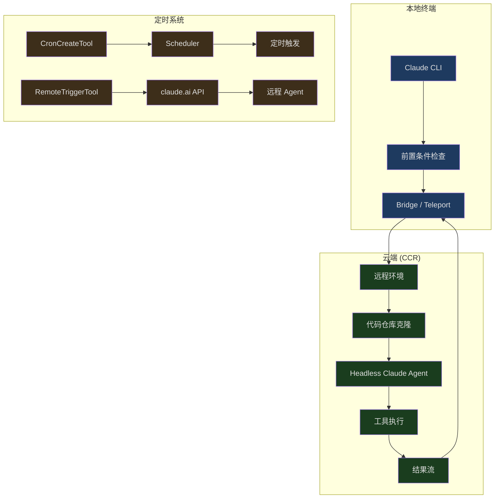
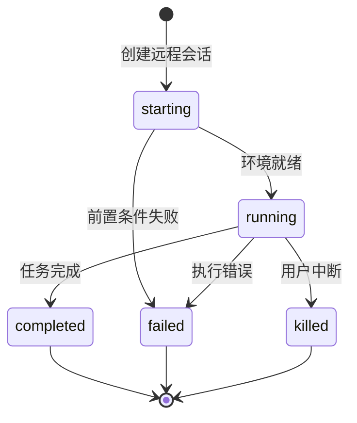
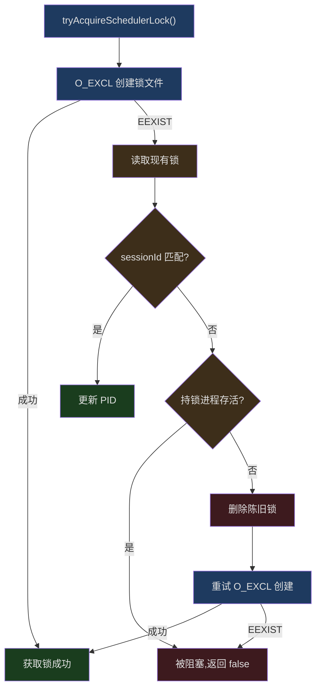
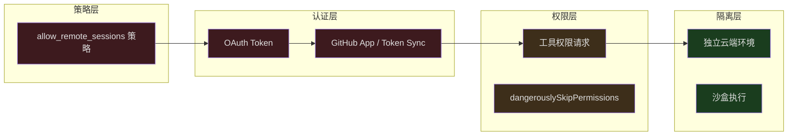

## 问题引入

你正在一台开发机上使用 Claude Code 修复 bug，突然需要出门。你不想中断当前任务——能不能让 Claude 在云端继续工作？第二天早上回来时，你还想让 Claude 每天自动检查 PR 状态并汇报。这不是科幻场景，而是 Claude Code 远程执行系统的核心能力。

传统 CLI 工具绑定在终端会话上——终端关闭，进程就死。Claude Code 打破了这个限制，引入了三个维度的远程能力：

1. **远程会话（Remote Session）** — 在云端环境中运行 Claude，本地终端只做代理
2. **Server 模式（Direct Connect）** — 通过 WebSocket 连接到远程 Claude 实例
3. **定时触发（Cron + RemoteTrigger）** — 让 Claude 按计划自动执行任务

本文深入分析这三个维度的设计与实现。

---

## 远程会话架构总览



---

## 远程会话前置条件

远程会话并非无条件可用。系统在创建远程会话前会执行一系列资格检查，确保环境满足要求。这些检查定义在 `src/utils/background/remote/preconditions.ts` 中：

```typescript
// src/utils/background/remote/preconditions.ts (第 23-28 行)
export async function checkNeedsClaudeAiLogin(): Promise<boolean> {
  if (!isClaudeAISubscriber()) {
    return false
  }
  return checkAndRefreshOAuthTokenIfNeeded()
}
```

前置条件检查采用并行执行策略，在 `remoteSession.ts` 中统一协调：

```typescript
// src/utils/background/remote/remoteSession.ts (第 58-62 行)
const [needsLogin, hasRemoteEnv, repository] = await Promise.all([
  checkNeedsClaudeAiLogin(),
  checkHasRemoteEnvironment(),
  detectCurrentRepositoryWithHost(),
])
```

这段代码体现了一个重要的设计模式——**并行前置条件检查**。三个独立的检查同时发出：

1. **登录状态** — OAuth token 是否有效
2. **远程环境** — 用户是否有可用的云端环境
3. **仓库检测** — 当前目录是否在 Git 仓库中，以及远端信息

### Bundle Seed 机制

一个有趣的优化是 Bundle Seed 机制。当启用时（通过 `CCR_FORCE_BUNDLE` 或 `CCR_ENABLE_BUNDLE` 环境变量），系统只需要本地有 `.git/` 目录即可——不需要 GitHub remote，也不需要 GitHub App：

```typescript
// src/utils/background/remote/remoteSession.ts (第 75-84 行)
const bundleSeedGateOn =
  !skipBundle &&
  (isEnvTruthy(process.env.CCR_FORCE_BUNDLE) ||
    isEnvTruthy(process.env.CCR_ENABLE_BUNDLE) ||
    (await checkGate_CACHED_OR_BLOCKING('tengu_ccr_bundle_seed_enabled')))

if (!checkIsInGitRepo()) {
  errors.push({ type: 'not_in_git_repo' })
} else if (bundleSeedGateOn) {
  // has .git/, bundle will work — skip remote+app checks
}
```

这意味着对于本地仓库（没有 GitHub remote 的 `git init` 仓库），Bundle Seed 可以打包本地代码上传到云端，而不是要求 CCR（Claude Code Remote）从 GitHub 拉取。

### 仓库访问分层

对于需要从 GitHub 拉取代码的场景，系统实现了分层访问检查：

```typescript
// src/utils/background/remote/preconditions.ts (第 222-235 行)
export async function checkRepoForRemoteAccess(
  owner: string,
  repo: string,
): Promise<{ hasAccess: boolean; method: RepoAccessMethod }> {
  if (await checkGithubAppInstalled(owner, repo)) {
    return { hasAccess: true, method: 'github-app' }
  }
  if (
    getFeatureValue_CACHED_MAY_BE_STALE('tengu_cobalt_lantern', false) &&
    (await checkGithubTokenSynced())
  ) {
    return { hasAccess: true, method: 'token-sync' }
  }
  return { hasAccess: false, method: 'none' }
}
```

三层优先级：
1. **GitHub App** — 最优方式，通过安装在仓库上的 GitHub App 授权
2. **Token Sync** — 通过 `/web-setup` 同步的 GitHub token（受 Feature Flag 控制）
3. **None** — 需要用户设置访问方式

---

## 远程会话类型系统

远程会话有明确的类型定义和状态机：

```typescript
// src/utils/background/remote/remoteSession.ts (第 17-26 行)
export type BackgroundRemoteSession = {
  id: string
  command: string
  startTime: number
  status: 'starting' | 'running' | 'completed' | 'failed' | 'killed'
  todoList: TodoList
  title: string
  type: 'remote_session'
  log: SDKMessage[]
}
```



会话通过 `SDKMessage[]` 记录完整的消息日志，这意味着即使本地断开连接，重新连接后也能恢复完整的执行历史。

---

## Direct Connect: Server 模式

Server 模式是另一种远程执行方式——不是通过 Teleport 在云端创建新环境，而是连接到一个已经运行 Claude Code 的服务器。这在企业内网场景中特别有用。

### 会话创建

```typescript
// src/server/createDirectConnectSession.ts (第 26-39 行)
export async function createDirectConnectSession({
  serverUrl,
  authToken,
  cwd,
  dangerouslySkipPermissions,
}: {
  serverUrl: string
  authToken?: string
  cwd: string
  dangerouslySkipPermissions?: boolean
}): Promise<{
  config: DirectConnectConfig
  workDir?: string
}> {
```

创建过程向 `${serverUrl}/sessions` 发送 POST 请求，返回的 `DirectConnectConfig` 包含关键信息：

```typescript
// src/server/directConnectManager.ts (第 13-18 行)
export type DirectConnectConfig = {
  serverUrl: string
  sessionId: string
  wsUrl: string
  authToken?: string
}
```

### WebSocket 双向通信

`DirectConnectSessionManager` 封装了完整的 WebSocket 通信协议：

```typescript
// src/server/directConnectManager.ts (第 40-46 行)
export class DirectConnectSessionManager {
  private ws: WebSocket | null = null
  private config: DirectConnectConfig
  private callbacks: DirectConnectCallbacks

  constructor(config: DirectConnectConfig, callbacks: DirectConnectCallbacks) {
    this.config = config
    this.callbacks = callbacks
  }
```

消息处理分为三个通道：

1. **SDK 消息** — assistant/result/system 等标准消息，转发给本地 UI
2. **权限请求** — `control_request` 类型，需要本地用户确认
3. **过滤消息** — keep_alive、streamlined_text 等内部消息，不转发

```typescript
// src/server/directConnectManager.ts (第 102-113 行)
if (
  parsed.type !== 'control_response' &&
  parsed.type !== 'keep_alive' &&
  parsed.type !== 'control_cancel_request' &&
  parsed.type !== 'streamlined_text' &&
  parsed.type !== 'streamlined_tool_use_summary' &&
  !(parsed.type === 'system' && parsed.subtype === 'post_turn_summary')
) {
  this.callbacks.onMessage(parsed)
}
```

### 权限请求与中断

远程执行中的权限处理特别关键。当远程 Agent 需要执行危险操作时，权限请求通过 WebSocket 传到本地，用户做出决定后，回传结果：

```typescript
// src/server/directConnectManager.ts (第 144-167 行)
respondToPermissionRequest(
  requestId: string,
  result: RemotePermissionResponse,
): void {
  if (!this.ws || this.ws.readyState !== WebSocket.OPEN) {
    return
  }
  const response = jsonStringify({
    type: 'control_response',
    response: {
      subtype: 'success',
      request_id: requestId,
      response: {
        behavior: result.behavior,
        ...(result.behavior === 'allow'
          ? { updatedInput: result.updatedInput }
          : { message: result.message }),
      },
    },
  })
  this.ws.send(response)
}
```

中断机制同样通过 WebSocket 实现：

```typescript
// src/server/directConnectManager.ts (第 172-186 行)
sendInterrupt(): void {
  if (!this.ws || this.ws.readyState !== WebSocket.OPEN) {
    return
  }
  const request = jsonStringify({
    type: 'control_request',
    request_id: crypto.randomUUID(),
    request: {
      subtype: 'interrupt',
    },
  })
  this.ws.send(request)
}
```

---

## Cron 定时任务系统

Claude Code 内置了一个完整的 Cron 调度系统，让 AI Agent 能按计划自动执行任务。

### 任务存储

```typescript
// src/utils/cronTasks.ts (第 30-70 行)
export type CronTask = {
  id: string
  /** 5-field cron string (local time) */
  cron: string
  /** Prompt to enqueue when the task fires. */
  prompt: string
  /** Epoch ms when the task was created. */
  createdAt: number
  /** Epoch ms of the most recent fire. */
  lastFiredAt?: number
  /** When true, the task reschedules after firing. */
  recurring?: boolean
  /** When true, exempt from recurringMaxAgeMs auto-expiry. */
  permanent?: boolean
  /** Runtime-only flag. false → session-scoped. */
  durable?: boolean
  /** Runtime-only. Created by an in-process teammate. */
  agentId?: string
}
```

任务分两种存储方式：

| 类型 | 存储位置 | 生命周期 | 使用场景 |
|------|---------|---------|---------|
| **Durable** | `.claude/scheduled_tasks.json` | 跨会话持久化 | 用户通过 CronCreateTool 创建 |
| **Session-only** | 进程内存 (bootstrap/state) | 随进程结束 | 子 Agent 创建的临时任务 |

### 调度器锁

当多个 Claude 会话在同一项目目录运行时，只有一个应该驱动 Cron 调度器。系统使用文件锁来协调：

```typescript
// src/utils/cronTasksLock.ts (第 111-173 行)
export async function tryAcquireSchedulerLock(
  opts?: SchedulerLockOptions,
): Promise<boolean> {
  const dir = opts?.dir
  const sessionId = opts?.lockIdentity ?? getSessionId()
  const lock: SchedulerLock = {
    sessionId,
    pid: process.pid,
    acquiredAt: Date.now(),
  }

  if (await tryCreateExclusive(lock, dir)) {
    lastBlockedBy = undefined
    registerLockCleanup(opts)
    return true
  }

  const existing = await readLock(dir)
  // Already ours (idempotent)
  if (existing?.sessionId === sessionId) {
    if (existing.pid !== process.pid) {
      await writeFile(getLockPath(dir), jsonStringify(lock))
      registerLockCleanup(opts)
    }
    return true
  }

  // Another live session — blocked
  if (existing && isProcessRunning(existing.pid)) {
    return false
  }

  // Stale — unlink and retry
  await unlink(getLockPath(dir)).catch(() => {})
  if (await tryCreateExclusive(lock, dir)) {
    return true
  }
  return false
}
```

锁的设计有几个精妙之处：

1. **O_EXCL 原子创建** — 使用 `'wx'` flag 确保创建锁文件是原子操作
2. **PID 活性探测** — 通过 `isProcessRunning()` 检测持锁进程是否存活
3. **陈旧锁恢复** — 如果持锁进程已死，删除锁文件并重试
4. **幂等重获取** — 如果 session ID 匹配（`--resume` 后 PID 变了），更新 PID



### Jitter 防雷群效应

当大量用户设置了相同的 cron 表达式（比如 `0 * * * *`，每小时整点），所有任务会同时触发，造成推理服务的负载尖峰。系统通过 Jitter 机制分散触发时间。

**循环任务的前向 Jitter：**

```typescript
// src/utils/cronTasks.ts (第 381-398 行)
export function jitteredNextCronRunMs(
  cron: string,
  fromMs: number,
  taskId: string,
  cfg: CronJitterConfig = DEFAULT_CRON_JITTER_CONFIG,
): number | null {
  const t1 = nextCronRunMs(cron, fromMs)
  if (t1 === null) return null
  const t2 = nextCronRunMs(cron, t1)
  if (t2 === null) return t1
  const jitter = Math.min(
    jitterFrac(taskId) * cfg.recurringFrac * (t2 - t1),
    cfg.recurringCapMs,
  )
  return t1 + jitter
}
```

Jitter 的计算基于 task ID 的哈希值，确保确定性（同一任务每次计算得到相同的延迟）且均匀分布。默认配置下，一小时间隔的循环任务会在 `:00` 到 `:06` 之间分散触发。

**一次性任务的后向 Jitter：**

一次性任务（如"提醒我下午 3 点"）不能延迟——延迟会违反用户预期。但稍微提前是可以接受的：

```typescript
// src/utils/cronTasks.ts (第 421-445 行)
export function oneShotJitteredNextCronRunMs(
  cron: string,
  fromMs: number,
  taskId: string,
  cfg: CronJitterConfig = DEFAULT_CRON_JITTER_CONFIG,
): number | null {
  const t1 = nextCronRunMs(cron, fromMs)
  if (t1 === null) return null
  if (new Date(t1).getMinutes() % cfg.oneShotMinuteMod !== 0) return t1
  const lead =
    cfg.oneShotFloorMs +
    jitterFrac(taskId) * (cfg.oneShotMaxMs - cfg.oneShotFloorMs)
  return Math.max(t1 - lead, fromMs)
}
```

只有在整点和半点（`:00` 和 `:30`）才应用 Jitter——因为人类倾向于选择这些"圆整"时间。默认最多提前 90 秒触发。

### Jitter 配置的运维旋钮

```typescript
// src/utils/cronTasks.ts (第 348-355 行)
export const DEFAULT_CRON_JITTER_CONFIG: CronJitterConfig = {
  recurringFrac: 0.1,
  recurringCapMs: 15 * 60 * 1000,      // 15 分钟上限
  oneShotMaxMs: 90 * 1000,              // 90 秒最大提前量
  oneShotFloorMs: 0,
  oneShotMinuteMod: 30,                  // :00 和 :30 才 jitter
  recurringMaxAgeMs: 7 * 24 * 60 * 60 * 1000,  // 7 天自动过期
}
```

这些配置可通过 GrowthBook 的 `tengu_kairos_cron_config` 远程调整。在推理服务出现容量问题时，运维可以推送更激进的配置，例如将 `oneShotMinuteMod` 改为 15（覆盖 `:00/:15/:30/:45`），`oneShotMaxMs` 改为 300000（5 分钟），从而大幅分散负载。

### 循环任务自动过期

循环任务有 7 天的默认生命周期，防止忘记清理的任务无限消耗资源：

```typescript
// cronTasks.ts 注释
// Recurring tasks auto-expire this many ms after creation (unless marked
// permanent). Cron is the primary driver of multi-day sessions (p99
// uptime 61min → 53h post-#19931), and unbounded recurrence lets Tier-1
// heap leaks compound indefinitely.
```

只有标记为 `permanent` 的任务（如 assistant 模式的内置 catch-up/morning-checkin/dream 任务）才不会过期。

---

## RemoteTrigger 工具

RemoteTriggerTool 是另一条远程执行路径——它不通过本地调度器，而是直接调用 claude.ai 的 API 来管理远程触发器：

```typescript
// src/tools/RemoteTriggerTool/prompt.ts (第 6-15 行)
export const PROMPT = `Call the claude.ai remote-trigger API.
Use this instead of curl — the OAuth token is added automatically
in-process and never exposed.

Actions:
- list: GET /v1/code/triggers
- get: GET /v1/code/triggers/{trigger_id}
- create: POST /v1/code/triggers (requires body)
- update: POST /v1/code/triggers/{trigger_id} (requires body, partial update)
- run: POST /v1/code/triggers/{trigger_id}/run`
```

安全设计的核心原则是——**OAuth token 永远不暴露在 shell 中**。工具在进程内直接添加认证头，避免 token 出现在命令行参数或环境变量中，防止被其他进程或日志记录捕获。

---

## SDK Headless 模式

远程执行的最底层是 SDK 的 headless 模式。当通过 `--input-format stream-json` 启动时，Claude Code 不启动终端 UI，而是通过 stdin/stdout 以 JSON 流的方式通信。

Direct Connect 的消息格式必须匹配 SDK 预期：

```typescript
// src/server/directConnectManager.ts (第 131-139 行)
const message = jsonStringify({
  type: 'user',
  message: {
    role: 'user',
    content: content,
  },
  parent_tool_use_id: null,
  session_id: '',
})
```

这个格式与 `SDKUserMessage` 完全一致，确保无论是本地 REPL 还是远程 headless 实例，都能统一处理消息。

---

## 安全模型

远程执行引入了额外的安全考量：



1. **策略控制** — `isPolicyAllowed('allow_remote_sessions')` 在最外层拦截
2. **OAuth 认证** — 确保用户身份合法
3. **仓库访问** — 分层检查 GitHub App 或 Token Sync
4. **权限代理** — 远程 Agent 的工具使用需要通过 WebSocket 获得本地用户确认
5. **环境隔离** — 每个远程会话在独立环境中运行

`dangerouslySkipPermissions` 选项仅用于受控环境（如 CI/CD），它跳过权限交互但不跳过安全策略。

---

## 数据流完整链路

一个完整的远程执行请求的数据流如下：

1. 用户在本地发起远程任务
2. 系统并行检查前置条件（登录、环境、仓库）
3. 通过 Teleport/Direct Connect 建立连接
4. 远程 Agent 接收 prompt，开始执行
5. 工具使用权限请求通过 WebSocket 回传本地
6. 用户确认后，权限响应回传远程
7. 执行结果通过 SDK 消息流回传
8. 任务完成，状态更新为 `completed`

对于 Cron 任务，触发流程略有不同：
1. 调度器获取锁（确保单实例）
2. 检查 `.claude/scheduled_tasks.json` 中的到期任务
3. 计算 Jitter 后的实际触发时间
4. 将 prompt 加入消息队列
5. 主 REPL 循环（或子 Agent）处理队列中的任务
6. 循环任务更新 `lastFiredAt` 并重新调度

---

## 小结

Claude Code 的远程执行系统展示了如何将一个终端工具扩展为分布式 AI Agent 平台。核心设计思想包括：

- **多路径远程执行** — Teleport（云端新环境）、Direct Connect（连接现有服务器）、RemoteTrigger（API 触发）三条独立路径，覆盖不同场景
- **确定性 Jitter** — 基于 task ID 哈希的确定性延迟，避免雷群效应同时保持可预测性
- **文件锁协调** — O_EXCL 原子创建 + PID 活性探测，解决多会话调度器竞争
- **安全分层** — 策略、认证、权限、隔离四层防护，远程执行不削弱安全保障
- **运维可控** — Jitter 配置、任务过期策略等都可通过远程配置实时调整

这些设计不是凭空构建的——它们解决的是 AI Agent 从单机工具走向分布式系统时必须面对的工程挑战。
