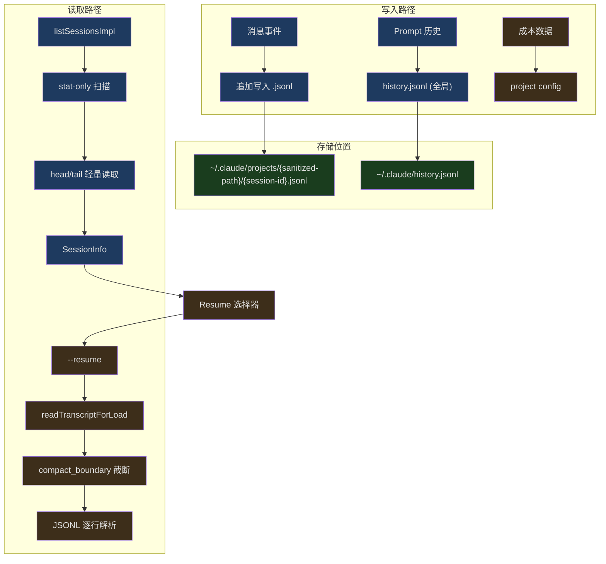
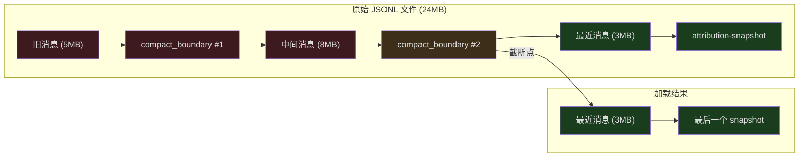

## 问题引入

你正在和 Claude 讨论一个复杂的架构重构，突然笔记本电池耗尽。几分钟后接上电源，你输入 `claude --resume` ——之前的整段对话完整恢复了，包括 Claude 的分析、已执行的文件修改、未完成的步骤。你甚至可以在另一台机器上通过 session URL 继续这个会话。

这不是魔法——这是 Claude Code 会话持久化系统的工作。它需要解决几个核心问题：

1. 如何把实时对话可靠地写入磁盘，不丢失数据？
2. 恢复时如何跳过已压缩的历史，只加载必要的上下文？
3. 如何在不同项目目录、不同设备间找到并恢复会话？

本文深入分析会话持久化的完整机制。

---

## 会话存储架构



---

## 路径安全化

会话文件存储在 `~/.claude/projects/` 下，子目录名称由项目路径转换而来。路径安全化确保任何操作系统都能正确处理：

```typescript
// src/utils/sessionStoragePortable.ts (第 311-319 行)
export function sanitizePath(name: string): string {
  const sanitized = name.replace(/[^a-zA-Z0-9]/g, '-')
  if (sanitized.length <= MAX_SANITIZED_LENGTH) {
    return sanitized
  }
  const hash =
    typeof Bun !== 'undefined' ? Bun.hash(name).toString(36) : simpleHash(name)
  return `${sanitized.slice(0, MAX_SANITIZED_LENGTH)}-${hash}`
}
```

所有非字母数字字符替换为连字符。对于深层嵌套路径（超过 200 字符），截断并追加哈希后缀确保唯一性。这里有一个微妙的兼容性问题——CLI 在 Bun 运行时使用 `Bun.hash`，而 SDK 在 Node.js 下使用 `djb2Hash`，两者对超长路径产生不同的目录后缀。`findProjectDir` 通过前缀匹配回退来解决这个问题：

```typescript
// src/utils/sessionStoragePortable.ts (第 354-380 行)
export async function findProjectDir(
  projectPath: string,
): Promise<string | undefined> {
  const exact = getProjectDir(projectPath)
  try {
    await readdir(exact)
    return exact
  } catch {
    const sanitized = sanitizePath(projectPath)
    if (sanitized.length <= MAX_SANITIZED_LENGTH) {
      return undefined
    }
    const prefix = sanitized.slice(0, MAX_SANITIZED_LENGTH)
    const projectsDir = getProjectsDir()
    try {
      const dirents = await readdir(projectsDir, { withFileTypes: true })
      const match = dirents.find(
        d => d.isDirectory() && d.name.startsWith(prefix + '-'),
      )
      return match ? join(projectsDir, match.name) : undefined
    } catch {
      return undefined
    }
  }
}
```

---

## 会话列表：两阶段扫描

列出会话时，系统需要在性能和完整性之间权衡。一个项目目录下可能有上千个会话文件——全部读取内容代价太高。

```typescript
// src/utils/listSessionsImpl.ts (第 439-454 行)
export async function listSessionsImpl(
  options?: ListSessionsOptions,
): Promise<SessionInfo[]> {
  const { dir, limit, offset, includeWorktrees } = options ?? {}
  const off = offset ?? 0
  const doStat = (limit !== undefined && limit > 0) || off > 0

  const candidates = dir
    ? await gatherProjectCandidates(dir, includeWorktrees ?? true, doStat)
    : await gatherAllCandidates(doStat)

  if (!doStat) return readAllAndSort(candidates)
  return applySortAndLimit(candidates, limit, off)
}
```

当有 `limit` 或 `offset` 时，采用两阶段策略：

1. **stat-only 扫描** — 只读文件元数据（mtime），每文件一次 syscall
2. **按需内容读取** — 排序后只读取前 N 个候选的 head/tail

这意味着 `limit: 20` 在 1000 个会话的目录中只做 ~1000 次 stat + ~20 次内容读取，而非 1000 次内容读取。

### 轻量元数据提取

每个会话文件的元数据通过 head/tail 读取获取——不需要解析整个文件：

```typescript
// src/utils/sessionStoragePortable.ts (第 215-242 行)
export async function readHeadAndTail(
  filePath: string,
  fileSize: number,
  buf: Buffer,
): Promise<{ head: string; tail: string }> {
  try {
    const fh = await fsOpen(filePath, 'r')
    try {
      const headResult = await fh.read(buf, 0, LITE_READ_BUF_SIZE, 0)
      if (headResult.bytesRead === 0) return { head: '', tail: '' }

      const head = buf.toString('utf8', 0, headResult.bytesRead)

      const tailOffset = Math.max(0, fileSize - LITE_READ_BUF_SIZE)
      let tail = head
      if (tailOffset > 0) {
        const tailResult = await fh.read(buf, 0, LITE_READ_BUF_SIZE, tailOffset)
        tail = buf.toString('utf8', 0, tailResult.bytesRead)
      }

      return { head, tail }
    } finally {
      await fh.close()
    }
  } catch {
    return { head: '', tail: '' }
  }
}
```

`LITE_READ_BUF_SIZE` 为 64KB——读文件头获取 session 创建信息，读文件尾获取最新状态（标题、分支、标签等）。元数据字段直接从 JSON 文本中正则提取，不做完整 JSON 解析：

```typescript
// src/utils/sessionStoragePortable.ts (第 53-76 行)
export function extractJsonStringField(
  text: string,
  key: string,
): string | undefined {
  const patterns = [`"${key}":"`, `"${key}": "`]
  for (const pattern of patterns) {
    const idx = text.indexOf(pattern)
    if (idx < 0) continue
    const valueStart = idx + pattern.length
    let i = valueStart
    while (i < text.length) {
      if (text[i] === '\\') { i += 2; continue }
      if (text[i] === '"') {
        return unescapeJsonString(text.slice(valueStart, i))
      }
      i++
    }
  }
  return undefined
}
```

这种"模式匹配而非完整解析"的方式在截断的 JSONL 行（文件被 tail 截断到中间）上也能工作。

### 会话信息组装

```typescript
// src/utils/listSessionsImpl.ts (第 79-149 行)
export function parseSessionInfoFromLite(
  sessionId: string,
  lite: LiteSessionFile,
  projectPath?: string,
): SessionInfo | null {
  const { head, tail, mtime, size } = lite

  // 过滤 sidechain 会话（子 Agent 的内部会话）
  const firstLine = firstNewline >= 0 ? head.slice(0, firstNewline) : head
  if (firstLine.includes('"isSidechain":true')) {
    return null
  }

  // 标题优先级：customTitle > aiTitle > lastPrompt > firstPrompt
  const customTitle =
    extractLastJsonStringField(tail, 'customTitle') ||
    extractLastJsonStringField(head, 'customTitle') ||
    extractLastJsonStringField(tail, 'aiTitle') ||
    extractLastJsonStringField(head, 'aiTitle') ||
    undefined

  const summary =
    customTitle ||
    extractLastJsonStringField(tail, 'lastPrompt') ||
    extractLastJsonStringField(tail, 'summary') ||
    firstPrompt

  // 没有标题也没有摘要——跳过元数据会话
  if (!summary) return null
  // ...
}
```

---

## 会话恢复：Compact Boundary 截断

对于长时间运行的会话（5MB+），完整加载所有消息效率低下且不必要——auto-compact 已经将旧消息压缩成摘要。`readTranscriptForLoad` 在文件层面找到最后一个 `compact_boundary` 标记，只加载其后的消息：

```typescript
// src/utils/sessionStoragePortable.ts (第 717-793 行)
export async function readTranscriptForLoad(
  filePath: string,
  fileSize: number,
): Promise<{
  boundaryStartOffset: number
  postBoundaryBuf: Buffer
  hasPreservedSegment: boolean
}> {
  // ...
  const chunk = Buffer.allocUnsafe(CHUNK_SIZE)
  const fd = await fsOpen(filePath, 'r')
  try {
    let filePos = 0
    while (filePos < fileSize) {
      const { bytesRead } = await fd.read(
        chunk, 0,
        Math.min(CHUNK_SIZE, fileSize - filePos),
        filePos,
      )
      if (bytesRead === 0) break
      filePos += bytesRead
      // processStraddle + scanChunkLines 处理跨 chunk 的行
    }
    finalizeOutput(s)
  } finally {
    await fd.close()
  }
}
```

这个函数的设计非常精细：

1. **1MB 分块读取** — 避免大文件一次性加载到内存
2. **attribution-snapshot 过滤** — 在 fd 层面跳过，最终只保留最后一个 snapshot
3. **compact_boundary 截断** — 遇到新的 boundary 时，丢弃之前所有输出
4. **preservedSegment 检测** — 保留段是 compact 中标记为重要的消息片段



### 跨 Chunk 行处理

JSONL 文件中的单行可能跨越 1MB chunk 的边界。`processStraddle` 处理这种情况：

```typescript
// 简化表示 — processStraddle 逻辑
// 前一个 chunk 的未完成行保存在 carryBuf 中
// 当前 chunk 的第一个 \n 完成这一行
// 然后判断这一行是 attr-snap（跳过）还是 boundary（截断）
```

这种流式处理确保内存峰值是输出大小而非文件大小——一个 24MB 的会话文件，如果最后一个 boundary 后只有 3MB 数据，那内存使用也只有 ~3MB。

---

## Prompt 历史

与会话消息（记录完整对话）不同，Prompt 历史只记录用户输入——用于 Up-arrow 和 Ctrl+R 搜索。

```typescript
// src/history.ts (第 281-284 行)
let pendingEntries: LogEntry[] = []
let isWriting = false
let currentFlushPromise: Promise<void> | null = null
let cleanupRegistered = false
```

历史写入是异步批量的——新条目先进入 `pendingEntries` 缓冲区，后台定期 flush 到 `~/.claude/history.jsonl`。

### 并发安全

多个 Claude 会话可能同时写入同一个历史文件。系统使用文件锁确保安全：

```typescript
// src/history.ts (第 297-327 行)
async function immediateFlushHistory(): Promise<void> {
  if (pendingEntries.length === 0) return

  let release
  try {
    const historyPath = join(getClaudeConfigHomeDir(), 'history.jsonl')
    await writeFile(historyPath, '', { encoding: 'utf8', mode: 0o600, flag: 'a' })

    release = await lock(historyPath, {
      stale: 10000,
      retries: { retries: 3, minTimeout: 50 },
    })

    const jsonLines = pendingEntries.map(entry => jsonStringify(entry) + '\n')
    pendingEntries = []

    await appendFile(historyPath, jsonLines.join(''), { mode: 0o600 })
  } catch (error) {
    logForDebugging(`Failed to write prompt history: ${error}`)
  } finally {
    if (release) { await release() }
  }
}
```

注意文件权限 `0o600`——只有所有者可读写，保护用户输入隐私。

### 历史去重与排序

```typescript
// src/history.ts (第 190-217 行)
export async function* getHistory(): AsyncGenerator<HistoryEntry> {
  const currentProject = getProjectRoot()
  const currentSession = getSessionId()
  const otherSessionEntries: LogEntry[] = []
  let yielded = 0

  for await (const entry of makeLogEntryReader()) {
    if (!entry || typeof entry.project !== 'string') continue
    if (entry.project !== currentProject) continue

    if (entry.sessionId === currentSession) {
      yield await logEntryToHistoryEntry(entry)
      yielded++
    } else {
      otherSessionEntries.push(entry)
    }

    if (yielded + otherSessionEntries.length >= MAX_HISTORY_ITEMS) break
  }

  for (const entry of otherSessionEntries) {
    if (yielded >= MAX_HISTORY_ITEMS) return
    yield await logEntryToHistoryEntry(entry)
    yielded++
  }
}
```

当前会话的历史条目优先于其他会话——这样并发会话不会相互插入历史记录。Up-arrow 总是先看到自己本次会话的输入。

### 撤销历史

当用户按 Esc 在 AI 回复前取消输入时，该输入应该从历史中移除：

```typescript
// src/history.ts (第 453-464 行)
export function removeLastFromHistory(): void {
  if (!lastAddedEntry) return
  const entry = lastAddedEntry
  lastAddedEntry = null

  const idx = pendingEntries.lastIndexOf(entry)
  if (idx !== -1) {
    pendingEntries.splice(idx, 1)
  } else {
    skippedTimestamps.add(entry.timestamp)
  }
}
```

快速路径从 pending buffer 中直接移除。如果异步 flush 已经将条目写入磁盘（TTFT 通常 >> 磁盘写入延迟，但偶尔会发生竞态），则将时间戳加入 skip-set，在下次读取时过滤。

### 粘贴内容处理

大段粘贴的文本不适合直接存入历史文件。系统按大小分层：

```typescript
// src/history.ts (第 365-395 行)
for (const [id, content] of Object.entries(entry.pastedContents)) {
  if (content.type === 'image') continue  // 图片单独存储

  if (content.content.length <= MAX_PASTED_CONTENT_LENGTH) {
    // 小文本（≤1024字符）内联存储
    storedPastedContents[Number(id)] = {
      id: content.id, type: content.type,
      content: content.content,
    }
  } else {
    // 大文本存哈希引用，内容写入 paste store
    const hash = hashPastedText(content.content)
    storedPastedContents[Number(id)] = {
      id: content.id, type: content.type,
      contentHash: hash,
    }
    void storePastedText(hash, content.content)
  }
}
```

---

## 跨项目恢复

用户可能在一个目录启动 Claude，然后想恢复另一个项目的会话。`crossProjectResume.ts` 处理这种场景：

```typescript
// src/utils/crossProjectResume.ts (第 30-75 行)
export function checkCrossProjectResume(
  log: LogOption,
  showAllProjects: boolean,
  worktreePaths: string[],
): CrossProjectResumeResult {
  const currentCwd = getOriginalCwd()

  if (!showAllProjects || !log.projectPath || log.projectPath === currentCwd) {
    return { isCrossProject: false }
  }

  // 检查是否是同一 Git 仓库的不同 worktree
  const isSameRepo = worktreePaths.some(
    wt => log.projectPath === wt || log.projectPath!.startsWith(wt + sep),
  )

  if (isSameRepo) {
    return {
      isCrossProject: true,
      isSameRepoWorktree: true,
      projectPath: log.projectPath,
    }
  }

  // 不同仓库——生成 cd 命令
  const sessionId = getSessionIdFromLog(log)
  const command = `cd ${quote([log.projectPath])} && claude --resume ${sessionId}`
  return {
    isCrossProject: true,
    isSameRepoWorktree: false,
    command,
    projectPath: log.projectPath,
  }
}
```

对于同一 Git 仓库的不同 worktree，可以直接恢复（代码库相同）。对于完全不同的项目，系统生成一条 `cd + claude --resume` 命令供用户执行。

---

## Session URL 解析

`--resume` 参数支持三种格式：

```typescript
// src/utils/sessionUrl.ts (第 20-64 行)
export function parseSessionIdentifier(
  resumeIdentifier: string,
): ParsedSessionUrl | null {
  // 1. JSONL 文件路径
  if (resumeIdentifier.toLowerCase().endsWith('.jsonl')) {
    return {
      sessionId: randomUUID() as UUID,
      ingressUrl: null,
      isUrl: false,
      jsonlFile: resumeIdentifier,
      isJsonlFile: true,
    }
  }

  // 2. UUID session ID
  if (validateUuid(resumeIdentifier)) {
    return {
      sessionId: resumeIdentifier as UUID,
      ingressUrl: null,
      isUrl: false,
      jsonlFile: null,
      isJsonlFile: false,
    }
  }

  // 3. Ingress URL（远程恢复）
  try {
    const url = new URL(resumeIdentifier)
    return {
      sessionId: randomUUID() as UUID,
      ingressUrl: url.href,
      isUrl: true,
      jsonlFile: null,
      isJsonlFile: false,
    }
  } catch {
    // Not a valid URL
  }

  return null
}
```

三种格式覆盖了不同的使用场景：
- **UUID** — 最常见，从本地 `~/.claude/projects/` 查找
- **JSONL 文件** — 直接指定文件路径，用于调试或导入
- **URL** — 连接远程 session ingress，用于跨设备恢复

---

## 会话文件解析

恢复会话时，系统需要在 `~/.claude/projects/` 下找到对应的 JSONL 文件。搜索逻辑考虑了 worktree 场景：

```typescript
// src/utils/sessionStoragePortable.ts (第 403-466 行)
export async function resolveSessionFilePath(
  sessionId: string,
  dir?: string,
): Promise<...> {
  const fileName = `${sessionId}.jsonl`

  if (dir) {
    // 先在当前项目目录找
    const canonical = await canonicalizePath(dir)
    const projectDir = await findProjectDir(canonical)
    if (projectDir) {
      const filePath = join(projectDir, fileName)
      // stat 检查 + 零字节过滤
    }

    // Worktree 回退——会话可能存在于不同的 worktree 根
    let worktreePaths = await getWorktreePathsPortable(canonical)
    for (const wt of worktreePaths) {
      if (wt === canonical) continue
      // 逐个 worktree 搜索
    }
    return undefined
  }

  // 无 dir——扫描所有项目目录
  const projectsDir = getProjectsDir()
  let dirents = await readdir(projectsDir)
  for (const name of dirents) {
    // 逐目录搜索
  }
  return undefined
}
```

零字节文件被视为未找到——这处理了文件被截断但未删除的情况，让搜索继续到兄弟目录中的有效副本。

---

## 成本状态恢复

恢复会话不仅恢复对话内容，还恢复成本追踪状态：

```typescript
// src/cost-tracker.ts (第 130-137 行)
export function restoreCostStateForSession(sessionId: string): boolean {
  const data = getStoredSessionCosts(sessionId)
  if (!data) {
    return false
  }
  setCostStateForRestore(data)
  return true
}
```

成本数据保存在项目配置中，按 session ID 关联。恢复时检查 session ID 是否匹配——防止不同会话的成本数据混淆。恢复的数据包括：

- 总 API 费用（USD）
- API 耗时（含重试和不含重试）
- 工具执行耗时
- 代码行变更统计
- 每模型使用量

---

## 小结

Claude Code 的会话管理系统解决了 AI Agent 持久化的核心挑战：

- **增量写入** — JSONL 格式支持追加写入，进程崩溃只丢最后一行
- **两阶段列表** — stat-only 预筛选 + 按需内容读取，千级会话目录也快
- **Compact Boundary 截断** — 恢复时只加载最后一次压缩后的消息，24MB 文件 → 3MB 内存
- **跨环境兼容** — Bun/Node 哈希差异通过前缀回退解决
- **并发安全** — 文件锁保护历史写入，session-first 排序防止会话交叉
- **完整状态恢复** — 对话、成本、权限上下文一并恢复

这套系统的设计核心是"面对现实"——文件会被截断、进程会崩溃、多个会话会并发运行、用户会在不同目录和设备间切换。每一个 edge case 都有对应的防护措施。
