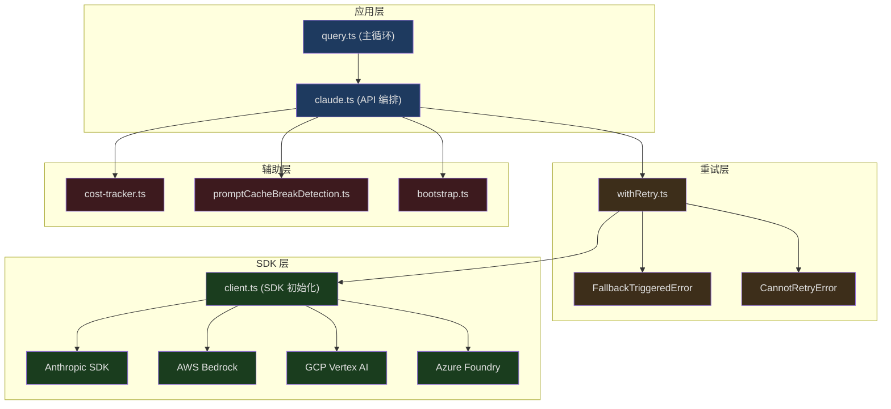
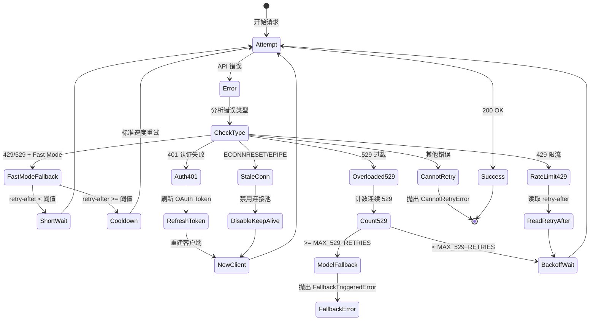

## 问题引入

当你在 Claude Code 中输入一个问题，按下回车的那一刻，一连串精密的操作开始执行：系统构建消息数组，选择合适的模型，添加 Beta 头，通过 SSE 流接收响应，实时解析 token 使用量，计算费用，处理可能的 429/529 错误，必要时降级到备选模型。这一切在 1-2 秒内完成，用户只看到文本开始流出。

Claude Code 的 API 客户端不是简单的 HTTP 封装——它是一个包含重试、降级、缓存、成本追踪、多 Provider 适配的复杂系统。本文深入分析这个系统的每一层。

---

## API 客户端层次结构



---

## 多 Provider 客户端

Claude Code 支持四种 API Provider，每种有不同的认证和配置方式：

```typescript
// src/services/api/client.ts (第 36-71 行，注释摘录)
// Direct API:
//   ANTHROPIC_API_KEY: Required for direct API access
//
// AWS Bedrock:
//   AWS credentials configured via aws-sdk defaults
//   AWS_REGION or AWS_DEFAULT_REGION
//   ANTHROPIC_SMALL_FAST_MODEL_AWS_REGION: Optional override for Haiku
//
// Foundry (Azure):
//   ANTHROPIC_FOUNDRY_RESOURCE: Azure resource name
//   ANTHROPIC_FOUNDRY_BASE_URL: Alternative full base URL
//
// Vertex AI:
//   Model-specific region variables (VERTEX_REGION_CLAUDE_*)
//   CLOUD_ML_REGION: Default GCP region
//   ANTHROPIC_VERTEX_PROJECT_ID: Required GCP project ID
```

客户端初始化考虑了调试需求——当标准错误输出为调试模式时，SDK 日志会重定向到 stderr：

```typescript
// src/services/api/client.ts (第 73-86 行)
function createStderrLogger(): ClientOptions['logger'] {
  return {
    error: (msg, ...args) =>
      console.error('[Anthropic SDK ERROR]', msg, ...args),
    warn: (msg, ...args) =>
      console.error('[Anthropic SDK WARN]', msg, ...args),
    info: (msg, ...args) =>
      console.error('[Anthropic SDK INFO]', msg, ...args),
    debug: (msg, ...args) =>
      console.error('[Anthropic SDK DEBUG]', msg, ...args),
  }
}
```

---

## Beta Headers 管理

Claude Code 使用了大量 Beta API 功能，通过 `anthropic-beta` header 声明：

```typescript
// src/services/api/claude.ts (第 134-143 行)
import {
  AFK_MODE_BETA_HEADER,
  CONTEXT_1M_BETA_HEADER,
  CONTEXT_MANAGEMENT_BETA_HEADER,
  EFFORT_BETA_HEADER,
  FAST_MODE_BETA_HEADER,
  PROMPT_CACHING_SCOPE_BETA_HEADER,
  REDACT_THINKING_BETA_HEADER,
  STRUCTURED_OUTPUTS_BETA_HEADER,
  TASK_BUDGETS_BETA_HEADER,
} from 'src/constants/betas.js'
```

这些 Beta 功能包括：

| Beta Header | 功能 |
|-------------|------|
| `CONTEXT_1M_BETA_HEADER` | 1M token 上下文窗口 |
| `CONTEXT_MANAGEMENT_BETA_HEADER` | API 端上下文管理 |
| `FAST_MODE_BETA_HEADER` | 快速模式（降低延迟） |
| `EFFORT_BETA_HEADER` | Effort 控制（调整推理深度） |
| `PROMPT_CACHING_SCOPE_BETA_HEADER` | Prompt 缓存作用域 |
| `REDACT_THINKING_BETA_HEADER` | Thinking 内容脱敏 |
| `STRUCTURED_OUTPUTS_BETA_HEADER` | 结构化输出 |
| `TASK_BUDGETS_BETA_HEADER` | 任务预算控制 |
| `AFK_MODE_BETA_HEADER` | 离开模式（后台运行优化） |

### Extra Body 参数

用户可以通过 `CLAUDE_CODE_EXTRA_BODY` 环境变量注入额外的 API 参数：

```typescript
// src/services/api/claude.ts (第 272-331 行)
export function getExtraBodyParams(betaHeaders?: string[]): JsonObject {
  const extraBodyStr = process.env.CLAUDE_CODE_EXTRA_BODY
  let result: JsonObject = {}

  if (extraBodyStr) {
    try {
      const parsed = safeParseJSON(extraBodyStr)
      if (parsed && typeof parsed === 'object' && !Array.isArray(parsed)) {
        // Shallow clone — safeParseJSON is LRU-cached and returns the
        // same object reference. Mutating result would poison the cache.
        result = { ...(parsed as JsonObject) }
      }
    } catch (error) {
      logForDebugging(`Error parsing CLAUDE_CODE_EXTRA_BODY: ${errorMessage(error)}`)
    }
  }

  // Anti-distillation: send fake_tools opt-in for 1P CLI only
  if (feature('ANTI_DISTILLATION_CC') ? /* gate check */ : false) {
    result.anti_distillation = ['fake_tools']
  }

  return result
}
```

注意 shallow clone——`safeParseJSON` 使用 LRU 缓存，直接修改返回值会污染缓存，导致后续调用看到被修改的值。

---

## Prompt 缓存控制

Prompt 缓存可以按模型粒度控制：

```typescript
// src/services/api/claude.ts (第 333 行起)
export function getPromptCachingEnabled(model: string): boolean {
  if (isEnvTruthy(process.env.DISABLE_PROMPT_CACHING)) return false
  if (isEnvTruthy(process.env.DISABLE_PROMPT_CACHING_HAIKU)) {
    if (model === getSmallFastModel()) return false
  }
  if (isEnvTruthy(process.env.DISABLE_PROMPT_CACHING_SONNET)) {
    if (model === getDefaultSonnetModel()) return false
  }
  // ...
}
```

这种按模型禁用的设计源于实际需求——某些模型的缓存创建成本可能不划算（比如 Haiku 本身就很便宜，缓存的创建费用反而更高）。

---

## 重试系统

重试逻辑是 API 客户端最复杂的部分，定义在 `withRetry.ts` 中。

### 重试配置

```typescript
// src/services/api/withRetry.ts (第 53-56 行)
const DEFAULT_MAX_RETRIES = 10
const FLOOR_OUTPUT_TOKENS = 3000
const MAX_529_RETRIES = 3
export const BASE_DELAY_MS = 500
```

### 前台 vs 后台查询源

不是所有查询都应该重试。后台查询（摘要、标题生成、分类器）在 529 错误时立即放弃——它们不是用户在等待的结果，重试只会放大容量级联：

```typescript
// src/services/api/withRetry.ts (第 62-82 行)
const FOREGROUND_529_RETRY_SOURCES = new Set<QuerySource>([
  'repl_main_thread',
  'repl_main_thread:outputStyle:custom',
  'repl_main_thread:outputStyle:Explanatory',
  'repl_main_thread:outputStyle:Learning',
  'sdk',
  'agent:custom',
  'agent:default',
  'agent:builtin',
  'compact',
  'hook_agent',
  'hook_prompt',
  'verification_agent',
  'side_question',
  'auto_mode',
])
```

### 重试状态机



### Fast Mode 降级

Fast Mode 是一种低延迟模式。当遇到限流时，系统需要决定是等待（保持缓存命中）还是降级（切换到标准速度）：

```typescript
// src/services/api/withRetry.ts (第 267-305 行)
if (wasFastModeActive && !isPersistentRetryEnabled() &&
    error instanceof APIError &&
    (error.status === 429 || is529Error(error))) {
  // Overage 限制——永久禁用 fast mode
  const overageReason = error.headers?.get(
    'anthropic-ratelimit-unified-overage-disabled-reason',
  )
  if (overageReason !== null && overageReason !== undefined) {
    handleFastModeOverageRejection(overageReason)
    retryContext.fastMode = false
    continue
  }

  const retryAfterMs = getRetryAfterMs(error)
  if (retryAfterMs !== null && retryAfterMs < SHORT_RETRY_THRESHOLD_MS) {
    // 短等待——保持 fast mode 以保护 prompt cache
    await sleep(retryAfterMs, options.signal, { abortError })
    continue
  }

  // 长等待或未知——进入冷却期（切换到标准速度）
  const cooldownMs = Math.max(
    retryAfterMs ?? DEFAULT_FAST_MODE_FALLBACK_HOLD_MS,
    MIN_COOLDOWN_MS,
  )
  triggerFastModeCooldown(Date.now() + cooldownMs, cooldownReason)
  retryContext.fastMode = false
  continue
}
```

决策逻辑：
- **retry-after < 阈值** → 短等待，保持 fast mode（保护 prompt cache 不失效）
- **retry-after >= 阈值或未知** → 进入冷却期，切换标准速度
- **Overage 限制** → 永久禁用 fast mode

### 认证错误恢复

```typescript
// src/services/api/withRetry.ts (第 218-251 行)
const isStaleConnection = isStaleConnectionError(lastError)
if (isStaleConnection && getFeatureValue_CACHED_MAY_BE_STALE(...)) {
  disableKeepAlive()  // 禁用连接池，重建连接
}

if (
  client === null ||
  (lastError instanceof APIError && lastError.status === 401) ||
  isOAuthTokenRevokedError(lastError) ||
  isBedrockAuthError(lastError) ||
  isVertexAuthError(lastError) ||
  isStaleConnection
) {
  if ((lastError instanceof APIError && lastError.status === 401) ||
      isOAuthTokenRevokedError(lastError)) {
    const failedAccessToken = getClaudeAIOAuthTokens()?.accessToken
    if (failedAccessToken) {
      await handleOAuth401Error(failedAccessToken)
    }
  }
  client = await getClient()  // 重建客户端
}
```

认证恢复涵盖了所有 Provider 的特殊情况：
- **Anthropic 1P** — 401 时刷新 OAuth token
- **AWS Bedrock** — 403 或 CredentialsProviderError
- **GCP Vertex** — 凭证刷新失败
- **连接重置** — ECONNRESET/EPIPE 时禁用 keep-alive 并重连

### 529 连续错误与模型降级

```typescript
// src/services/api/withRetry.ts (第 327-348 行)
if (is529Error(error) &&
    (process.env.FALLBACK_FOR_ALL_PRIMARY_MODELS ||
     (!isClaudeAISubscriber() && isNonCustomOpusModel(options.model)))) {
  consecutive529Errors++
  if (consecutive529Errors >= MAX_529_RETRIES) {
    if (options.fallbackModel) {
      throw new FallbackTriggeredError(
        options.model,
        options.fallbackModel,
      )
    }
  }
}
```

连续 3 次 529 后触发模型降级（如 Opus → Sonnet）。`FallbackTriggeredError` 被 `query.ts` 捕获并处理——清除已有的 assistant 消息，切换模型，重试整个请求。

### 持久化重试（无人值守模式）

对于自动化场景（CI/CD、cron 任务），系统支持无限重试：

```typescript
// src/services/api/withRetry.ts (第 96-104 行)
const PERSISTENT_MAX_BACKOFF_MS = 5 * 60 * 1000    // 5 分钟最大退避
const PERSISTENT_RESET_CAP_MS = 6 * 60 * 60 * 1000 // 6 小时超时
const HEARTBEAT_INTERVAL_MS = 30_000                 // 30 秒心跳

function isPersistentRetryEnabled(): boolean {
  return feature('UNATTENDED_RETRY')
    ? isEnvTruthy(process.env.CLAUDE_CODE_UNATTENDED_RETRY)
    : false
}
```

持久化重试通过 `SystemAPIErrorMessage` 发送心跳，防止宿主环境（如容器编排系统）将会话标记为空闲。

---

## 成本追踪

每次 API 响应都会更新成本状态：

```typescript
// src/cost-tracker.ts (第 71-79 行)
type StoredCostState = {
  totalCostUSD: number
  totalAPIDuration: number
  totalAPIDurationWithoutRetries: number
  totalToolDuration: number
  totalLinesAdded: number
  totalLinesRemoved: number
  lastDuration: number | undefined
  modelUsage: { [modelName: string]: ModelUsage } | undefined
}
```

成本计算通过 `calculateUSDCost` 函数基于每个模型的价格表：

```typescript
// src/services/api/claude.ts (第 146 行)
import { addToTotalSessionCost } from 'src/cost-tracker.js'
```

成本状态不仅用于显示——它在会话切换时保存到项目配置，恢复时读回：

```typescript
// src/cost-tracker.ts (第 143-158 行)
export function saveCurrentSessionCosts(fpsMetrics?: FpsMetrics): void {
  saveCurrentProjectConfig(current => ({
    ...current,
    lastCost: getTotalCostUSD(),
    lastAPIDuration: getTotalAPIDuration(),
    lastAPIDurationWithoutRetries: getTotalAPIDurationWithoutRetries(),
    lastToolDuration: getTotalToolDuration(),
    lastDuration: getTotalDuration(),
    // ...
  }))
}
```

---

## Bootstrap API

启动时，系统通过 Bootstrap API 获取服务端配置：

```typescript
// src/services/api/bootstrap.ts (第 42-100 行)
async function fetchBootstrapAPI(): Promise<BootstrapResponse | null> {
  if (isEssentialTrafficOnly()) return null  // 隐私模式跳过
  if (getAPIProvider() !== 'firstParty') return null  // 第三方 Provider 跳过

  // OAuth 优先，API Key 回退
  const hasUsableOAuth =
    getClaudeAIOAuthTokens()?.accessToken && hasProfileScope()
  if (!hasUsableOAuth && !apiKey) return null

  const endpoint = `${getOauthConfig().BASE_API_URL}/api/claude_cli/bootstrap`

  return await withOAuth401Retry(async () => {
    const token = getClaudeAIOAuthTokens()?.accessToken
    // 每次重读 OAuth token（retry 可能已刷新）
    let authHeaders: Record<string, string>
    if (token && hasProfileScope()) {
      authHeaders = { Authorization: `Bearer ${token}`, ... }
    } else if (apiKey) {
      authHeaders = { 'x-api-key': apiKey }
    } else {
      return null
    }

    const response = await axios.get(endpoint, {
      headers: { ...authHeaders },
      timeout: 5000,
    })
    return bootstrapResponseSchema().safeParse(response.data)
  })
}
```

Bootstrap 返回的数据包括：
- `client_data` — 客户端配置
- `additional_model_options` — 额外可用模型列表

5 秒超时确保启动不会因为网络问题而卡住。

---

## 流式响应处理

query.ts 中的主循环通过 `for await...of` 消费流式响应。关键的处理逻辑包括：

### Fallback 处理

当流式传输过程中触发模型降级时，已收到的部分消息需要被丢弃：

```typescript
// src/query.ts (第 709-741 行)
if (streamingFallbackOccured) {
  // 为已发出的消息生成 tombstone
  for (const msg of assistantMessages) {
    yield { type: 'tombstone' as const, message: msg }
  }

  assistantMessages.length = 0
  toolResults.length = 0
  toolUseBlocks.length = 0
  needsFollowUp = false

  // 丢弃流式工具执行器的待处理结果
  if (streamingToolExecutor) {
    streamingToolExecutor.discard()
    streamingToolExecutor = new StreamingToolExecutor(
      toolUseContext.options.tools,
      canUseTool,
      toolUseContext,
    )
  }
}
```

Tombstone 消息告诉 UI 和 transcript 移除这些部分消息——特别重要的是移除不完整的 thinking blocks，因为它们带有模型特定的签名，在降级到不同模型后会导致 API 错误。

### 错误抑制与恢复

某些 API 错误是可恢复的——系统在流式循环中抑制这些错误，在流结束后尝试恢复：

```typescript
// src/query.ts (第 800-825 行)
let withheld = false
if (feature('CONTEXT_COLLAPSE')) {
  if (contextCollapse?.isWithheldPromptTooLong(message, ...)) {
    withheld = true
  }
}
if (reactiveCompact?.isWithheldPromptTooLong(message)) {
  withheld = true
}
if (mediaRecoveryEnabled && reactiveCompact?.isWithheldMediaSizeError(message)) {
  withheld = true
}
if (isWithheldMaxOutputTokens(message)) {
  withheld = true
}
if (!withheld) {
  yield yieldMessage
}
```

被抑制的消息仍然加入 `assistantMessages` 数组——恢复逻辑需要检查它们。但不会发送给 SDK 消费者，因为这些消费者（如桌面应用）可能在看到错误后终止会话。

---

## 请求构建细节

### Tool Schema 转换

每个工具的定义需要转换为 API 兼容的格式，包含 deferred tools 的处理：

```typescript
// 引用: src/services/api/claude.ts
import {
  formatDeferredToolLine,
  isDeferredTool,
  TOOL_SEARCH_TOOL_NAME,
} from '../../tools/ToolSearchTool/prompt.js'
```

### Advisor 模式

当启用 Advisor 时，额外的模型（如 Opus 作为 Sonnet 的顾问）会参与决策：

```typescript
// src/services/api/claude.ts (第 150-155 行)
import {
  ADVISOR_TOOL_INSTRUCTIONS,
  getExperimentAdvisorModels,
  isAdvisorEnabled,
  isValidAdvisorModel,
  modelSupportsAdvisor,
} from 'src/utils/advisor.js'
```

### Session Activity 追踪

API 请求期间会标记 session 为活跃状态，用于远程环境的资源管理：

```typescript
// src/services/api/claude.ts (第 208-210 行)
import {
  startSessionActivity,
  stopSessionActivity,
} from '../../utils/sessionActivity.js'
```

---

## 小结

Claude Code 的 API 客户端是一个多层防御系统：

- **多 Provider 抽象** — Anthropic/Bedrock/Vertex/Foundry 统一接口，环境变量配置
- **分层重试** — 按错误类型（认证/限流/过载/连接重置）采取不同策略
- **智能降级** — Fast Mode → 标准速度 → 备选模型，每一步都有合理的决策逻辑
- **流式错误抑制** — 可恢复错误不立即暴露给消费者，给系统恢复的机会
- **成本全链路追踪** — 从 API 响应到项目配置持久化，支持会话恢复
- **运维旋钮** — Prompt 缓存、Fast Mode、重试策略等都可通过环境变量和 Feature Flag 控制

这个系统的复杂性不是偶然的——它反映了生产环境 AI 应用面临的现实：网络不可靠、服务会过载、认证会过期、用户需要不间断的体验。每一层防护都对应着一个真实的故障模式。
