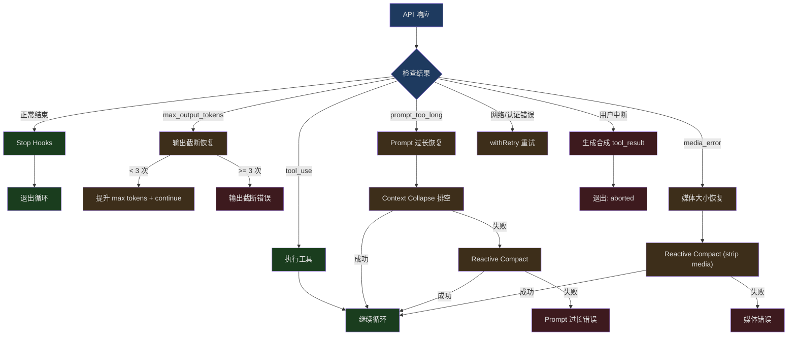
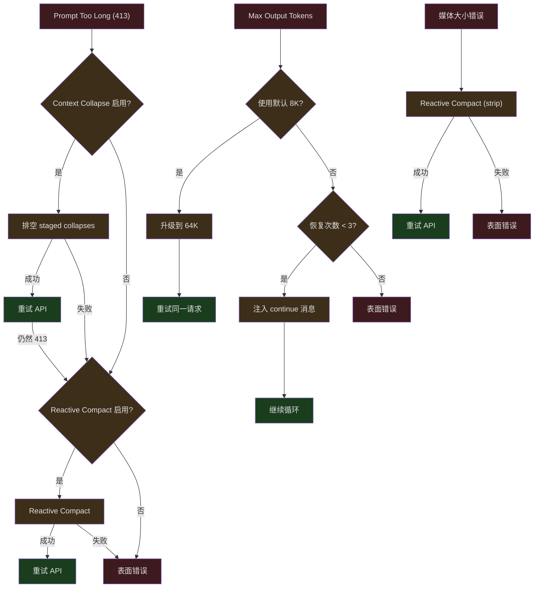

## 问题引入

一个 AI Agent 在真实环境中运行时，失败是常态而非例外。网络超时、API 过载、文件权限不足、模型输出截断、用户突然按下 Esc——这些不是边缘情况，而是每天发生数百万次的日常事件。

Claude Code 的核心设计哲学是：**错误不应该终止会话，而应该触发恢复**。`query.ts` 中的主循环不是线性的请求-响应，而是一个包含多种恢复路径的状态机。当 API 返回 `max_output_tokens` 错误时，系统会自动重试并注入 "continue" 指令；当 prompt 超长时，系统会触发响应式压缩然后重试；当用户按 Esc 中断时，系统会生成合成的 tool_result 保持消息格式合法。

本文深入分析这个恢复状态机的每一条路径。

---

## query.ts 恢复状态机

### 状态定义

query 循环维护一个可变状态对象，在每次迭代间传递：

```typescript
// src/query.ts (第 204-217 行)
type State = {
  messages: Message[]
  toolUseContext: ToolUseContext
  autoCompactTracking: AutoCompactTrackingState | undefined
  maxOutputTokensRecoveryCount: number
  hasAttemptedReactiveCompact: boolean
  maxOutputTokensOverride: number | undefined
  pendingToolUseSummary: Promise<ToolUseSummaryMessage | null> | undefined
  stopHookActive: boolean | undefined
  turnCount: number
  transition: Continue | undefined
}
```

关键的恢复状态字段：
- `maxOutputTokensRecoveryCount` — 已尝试的输出截断恢复次数（上限 3）
- `hasAttemptedReactiveCompact` — 是否已尝试过响应式压缩
- `maxOutputTokensOverride` — 当前覆盖的 max output tokens
- `transition` — 上一次迭代继续的原因（用于防止重复恢复）

### 循环初始化

```typescript
// src/query.ts (第 268-279 行)
let state: State = {
  messages: params.messages,
  toolUseContext: params.toolUseContext,
  maxOutputTokensOverride: params.maxOutputTokensOverride,
  autoCompactTracking: undefined,
  stopHookActive: undefined,
  maxOutputTokensRecoveryCount: 0,
  hasAttemptedReactiveCompact: false,
  turnCount: 1,
  pendingToolUseSummary: undefined,
  transition: undefined,
}
```

---

## 恢复路径总览



---

## max_output_tokens 恢复

当模型输出被截断（`stop_reason: max_output_tokens`）时，系统不是直接报错，而是尝试让模型继续：

```typescript
// src/query.ts (第 164 行)
const MAX_OUTPUT_TOKENS_RECOVERY_LIMIT = 3
```

### 错误抑制

流式循环中，max_output_tokens 错误被抑制（不发送给 SDK 消费者）：

```typescript
// src/query.ts (第 175-179 行)
function isWithheldMaxOutputTokens(
  msg: Message | StreamEvent | undefined,
): msg is AssistantMessage {
  return msg?.type === 'assistant' && msg.apiError === 'max_output_tokens'
}
```

```typescript
// src/query.ts (第 820-822 行)
if (isWithheldMaxOutputTokens(message)) {
  withheld = true
}
```

### 升级重试

如果使用的是默认 8K max output tokens，先升级到 64K 重试同一请求——不注入 continue 消息，不增加恢复计数：

```typescript
// src/query.ts (约第 1188-1200 行)
// Escalating retry: if we used the capped 8k default and hit the
// limit, retry the SAME request at 64k — no meta message, no
// multi-turn dance. This fires once per turn.
const capEnabled = getFeatureValue_CACHED_MAY_BE_STALE(
  'tengu_otk_slot_v1',
  false,
)
```

如果 64K 也不够，进入多轮恢复——注入一条用户消息（"你的输出在这里被截断，请从截断处继续"），然后循环回 API 调用：

```typescript
// 恢复逻辑伪代码
if (maxOutputTokensRecoveryCount < MAX_OUTPUT_TOKENS_RECOVERY_LIMIT) {
  // 注入 continue 消息
  state = {
    ...state,
    maxOutputTokensRecoveryCount: maxOutputTokensRecoveryCount + 1,
    maxOutputTokensOverride: ESCALATED_MAX_TOKENS,
    transition: { reason: 'max_output_tokens_recovery' },
  }
  continue  // 回到循环顶部
}
// 超过限制——表面错误
yield lastMessage
return { reason: 'max_output_tokens' }
```

恢复上限为 3 次——防止无限循环（模型可能在某些情况下持续产生超长输出）。

---

## Prompt Too Long 恢复

当上下文超过模型限制时，系统有两级恢复：

### 第一级：Context Collapse 排空

Context Collapse 是一种轻量级压缩——将旧的消息折叠成摘要，但保留粒度。排空（drain）是把所有已准备好的折叠一次性提交：

```typescript
// src/query.ts (第 1086-1117 行)
if (feature('CONTEXT_COLLAPSE') && contextCollapse &&
    state.transition?.reason !== 'collapse_drain_retry') {
  const drained = contextCollapse.recoverFromOverflow(
    messagesForQuery,
    querySource,
  )
  if (drained.committed > 0) {
    const next: State = {
      messages: drained.messages,
      toolUseContext,
      autoCompactTracking: tracking,
      maxOutputTokensRecoveryCount,
      hasAttemptedReactiveCompact,
      maxOutputTokensOverride: undefined,
      pendingToolUseSummary: undefined,
      stopHookActive: undefined,
      turnCount,
      transition: { reason: 'collapse_drain_retry', committed: drained.committed },
    }
    state = next
    continue
  }
}
```

注意 `state.transition?.reason !== 'collapse_drain_retry'` 检查——如果上一次迭代就是 collapse drain 且仍然 413，说明排空不够，需要更激进的措施。

### 第二级：Reactive Compact

如果 collapse 排空不够（或未启用），触发完整的响应式压缩：

```typescript
// src/query.ts (第 1119-1166 行)
if ((isWithheld413 || isWithheldMedia) && reactiveCompact) {
  const compacted = await reactiveCompact.tryReactiveCompact({
    hasAttempted: hasAttemptedReactiveCompact,
    querySource,
    aborted: toolUseContext.abortController.signal.aborted,
    messages: messagesForQuery,
    cacheSafeParams: {
      systemPrompt, userContext, systemContext,
      toolUseContext,
      forkContextMessages: messagesForQuery,
    },
  })

  if (compacted) {
    const postCompactMessages = buildPostCompactMessages(compacted)
    for (const msg of postCompactMessages) {
      yield msg
    }
    const next: State = {
      messages: postCompactMessages,
      toolUseContext,
      autoCompactTracking: undefined,
      maxOutputTokensRecoveryCount,
      hasAttemptedReactiveCompact: true,  // 标记为已尝试
      maxOutputTokensOverride: undefined,
      pendingToolUseSummary: undefined,
      stopHookActive: undefined,
      turnCount,
      transition: { reason: 'reactive_compact_retry' },
    }
    state = next
    continue
  }

  // 无法恢复——表面错误
  yield lastMessage
  void executeStopFailureHooks(lastMessage, toolUseContext)
  return { reason: isWithheldMedia ? 'image_error' : 'prompt_too_long' }
}
```

关键的安全措施：
- `hasAttemptedReactiveCompact: true` 确保只尝试一次——防止"压缩→重试→413→压缩"死循环
- 不执行 stop hooks——模型没有产生有效响应，hooks 无法评估
- `executeStopFailureHooks` 是不同的函数——它只做最基本的失败通知

### 前置阻断

在进入 API 调用前，如果 auto-compact 关闭且 token 已到阈值，直接阻断：

```typescript
// src/query.ts (约第 626-648 行)
if (!compactionResult && querySource !== 'compact' && querySource !== 'session_memory'
    && !(reactiveCompact?.isReactiveCompactEnabled() && isAutoCompactEnabled())
    && !collapseOwnsIt) {
  const { isAtBlockingLimit } = calculateTokenWarningState(
    tokenCountWithEstimation(messagesForQuery) - snipTokensFreed,
    toolUseContext.options.mainLoopModel,
  )
  if (isAtBlockingLimit) {
    yield createAssistantAPIErrorMessage({
      content: PROMPT_TOO_LONG_ERROR_MESSAGE,
    })
    return { reason: 'blocking_limit' }
  }
}
```

注意跳过条件——当 reactive compact 或 context collapse 启用时，不做前置阻断，因为它们能在 API 错误发生后恢复。前置阻断会阻止错误发生，也就阻止了恢复机会。

---

## 模型降级恢复

当流式传输过程中触发 `FallbackTriggeredError`：

```typescript
// src/query.ts (第 893-953 行)
} catch (innerError) {
  if (innerError instanceof FallbackTriggeredError && fallbackModel) {
    currentModel = fallbackModel
    attemptWithFallback = true

    // 为已发出的消息生成 tool_result 占位
    yield* yieldMissingToolResultBlocks(
      assistantMessages,
      'Model fallback triggered',
    )
    assistantMessages.length = 0
    toolResults.length = 0

    // 丢弃流式工具执行器的待处理结果
    if (streamingToolExecutor) {
      streamingToolExecutor.discard()
      streamingToolExecutor = new StreamingToolExecutor(...)
    }

    // 更新工具上下文中的模型
    toolUseContext.options.mainLoopModel = fallbackModel

    // Thinking 签名是模型绑定的——清除以避免 400 错误
    if (process.env.USER_TYPE === 'ant') {
      messagesForQuery = stripSignatureBlocks(messagesForQuery)
    }

    yield createSystemMessage(
      `Switched to ${renderModelName(innerError.fallbackModel)} due to high demand`,
      'warning',
    )

    continue  // 重试内层循环
  }
  throw innerError
}
```

特别值得注意的是 `stripSignatureBlocks`——protected thinking blocks 带有模型特定的加密签名，在降级到不同模型后会导致 API 400 错误。

---

## 用户中断处理

用户按 Esc 或 Ctrl+C 时，系统需要优雅地停止：

```typescript
// src/hooks/useCancelRequest.ts (第 87-122 行)
const handleCancel = useCallback(() => {
  // Priority 1: 如果有活跃任务，取消它
  if (abortSignal !== undefined && !abortSignal.aborted) {
    logEvent('tengu_cancel', cancelProps)
    setToolUseConfirmQueue(() => [])
    onCancel()
    return
  }

  // Priority 2: Claude 空闲时，弹出队列
  if (hasCommandsInQueue()) {
    if (popCommandFromQueue) {
      popCommandFromQueue()
      return
    }
  }

  // Fallback: 没有可取消的
  logEvent('tengu_cancel', cancelProps)
  setToolUseConfirmQueue(() => [])
  onCancel()
}, [...])
```

中断优先级：
1. **活跃任务** — 设置 abort signal，取消 API 调用和工具执行
2. **命令队列** — 如果 Claude 空闲但有排队命令，弹出最后一条
3. **回退** — 清空权限确认队列

### 中断后的消息清理

在 query.ts 中，中断后需要为所有未完成的 tool_use 生成合成的 tool_result：

```typescript
// src/query.ts (第 1015-1051 行)
if (toolUseContext.abortController.signal.aborted) {
  if (streamingToolExecutor) {
    // 消费剩余结果——executor 为中断的工具生成合成 tool_results
    for await (const update of streamingToolExecutor.getRemainingResults()) {
      if (update.message) {
        yield update.message
      }
    }
  } else {
    yield* yieldMissingToolResultBlocks(
      assistantMessages,
      'Interrupted by user',
    )
  }

  // 跳过 submit-interrupt 的中断消息
  if (toolUseContext.abortController.signal.reason !== 'interrupt') {
    yield createUserInterruptionMessage({ toolUse: false })
  }
  return { reason: 'aborted_streaming' }
}
```

`yieldMissingToolResultBlocks` 确保消息格式合法——API 要求每个 `tool_use` 后必须有对应的 `tool_result`：

```typescript
// src/query.ts (第 123-149 行)
function* yieldMissingToolResultBlocks(
  assistantMessages: AssistantMessage[],
  errorMessage: string,
) {
  for (const assistantMessage of assistantMessages) {
    const toolUseBlocks = assistantMessage.message.content.filter(
      content => content.type === 'tool_use',
    ) as ToolUseBlock[]

    for (const toolUse of toolUseBlocks) {
      yield createUserMessage({
        content: [{
          type: 'tool_result',
          content: errorMessage,
          is_error: true,
          tool_use_id: toolUse.id,
        }],
        toolUseResult: errorMessage,
        sourceToolAssistantUUID: assistantMessage.uuid,
      })
    }
  }
}
```

### Ctrl+C vs Esc 的区别

```typescript
// src/hooks/useCancelRequest.ts (第 148-155 行)
// Escape: 尊重模式切换，不在特殊输入模式时触发
const isEscapeActive =
  isContextActive &&
  (canCancelRunningTask || hasQueuedCommands) &&
  !isInSpecialModeWithEmptyInput &&
  !isViewingTeammate

// Ctrl+C: 更强势，在查看 teammate 时也能中断
const isCtrlCActive =
  isContextActive &&
  (canCancelRunningTask || hasQueuedCommands || isViewingTeammate)
```

Ctrl+C 额外处理了查看 teammate 的场景——停止所有后台 Agent 并返回主线程。

### Kill All Agents (二次确认)

```typescript
// src/hooks/useCancelRequest.ts (第 225-266 行)
const handleKillAgents = useCallback(() => {
  const now = Date.now()
  const elapsed = now - lastKillAgentsPressRef.current

  if (elapsed <= KILL_AGENTS_CONFIRM_WINDOW_MS) {
    // 3 秒内第二次按下——确认杀死所有后台 Agent
    lastKillAgentsPressRef.current = 0
    killAllAgentsAndNotify()
    return
  }

  // 第一次按下——显示确认提示
  lastKillAgentsPressRef.current = now
  addNotification({
    key: 'kill-agents-confirm',
    text: `Press ${shortcut} again to stop background agents`,
    timeoutMs: KILL_AGENTS_CONFIRM_WINDOW_MS,
  })
}, [...])
```

3 秒确认窗口防止误操作——后台 Agent 可能正在执行重要任务。

---

## 工具执行失败反馈

当工具执行失败时，错误信息作为 `tool_result` 的 `is_error: true` 内容反馈给模型。这让模型能理解发生了什么并决定下一步——是重试、换方法、还是向用户报告：

```typescript
// 简化表示——工具执行错误处理
yield createUserMessage({
  content: [{
    type: 'tool_result',
    content: `Error: ${error.message}`,
    is_error: true,
    tool_use_id: toolUse.id,
  }],
})
```

这是 Claude Code 的核心自愈模式——**错误不是系统终止信号，而是模型的输入信号**。模型看到 `bash` 命令失败后，通常会修改命令重试。看到文件不存在后，会先用 `ls` 检查。

---

## /doctor 环境自检

`/doctor` 命令提供系统级的诊断：

```typescript
// src/utils/doctorDiagnostic.ts (第 54-71 行)
export type DiagnosticInfo = {
  installationType: InstallationType
  version: string
  installationPath: string
  invokedBinary: string
  configInstallMethod: InstallMethod | 'not set'
  autoUpdates: string
  hasUpdatePermissions: boolean | null
  multipleInstallations: Array<{ type: string; path: string }>
  warnings: Array<{ issue: string; fix: string }>
  recommendation?: string
  packageManager?: string
  ripgrepStatus: {
    working: boolean
    mode: 'system' | 'builtin' | 'embedded'
    systemPath: string | null
  }
}
```

诊断覆盖：

1. **安装类型检测** — npm-global/npm-local/native/package-manager/development
2. **多安装检测** — 发现系统中多个 Claude Code 安装
3. **权限检查** — 自动更新是否有写权限
4. **ripgrep 状态** — 搜索引擎是否正常工作
5. **Shell 配置** — alias 和环境变量是否正确

安装类型检测逻辑相当详尽：

```typescript
// src/utils/doctorDiagnostic.ts (第 86-148 行)
export async function getCurrentInstallationType(): Promise<InstallationType> {
  if (process.env.NODE_ENV === 'development') return 'development'

  if (isInBundledMode()) {
    // 检查是否由包管理器安装
    if (detectHomebrew() || detectWinget() || detectMise() ||
        detectAsdf() || await detectPacman() ||
        await detectDeb() || await detectRpm() || await detectApk()) {
      return 'package-manager'
    }
    return 'native'
  }

  if (isRunningFromLocalInstallation()) return 'npm-local'

  // 检查典型的 npm 全局路径
  const npmGlobalPaths = [
    '/usr/local/lib/node_modules',
    '/usr/lib/node_modules',
    '/opt/homebrew/lib/node_modules',
    '/.nvm/versions/node/',
  ]
  if (npmGlobalPaths.some(path => invokedPath.includes(path))) {
    return 'npm-global'
  }

  return 'unknown'
}
```

检测覆盖了所有主流包管理器——Homebrew、winget、mise、asdf、pacman、deb、rpm、apk——确保在任何 Linux/macOS/Windows 环境下都能正确识别安装方式。

---

## 恢复路径的互动关系

各恢复路径之间有复杂的互动关系，理解这些关系是理解系统韧性的关键：



关键的互动规则：

1. **前置阻断与恢复互斥** — 启用 reactive compact 或 context collapse 时，不做前置阻断（否则恢复路径永远不会被触发）
2. **Collapse → Reactive 级联** — collapse 排空失败后才尝试 reactive compact
3. **同类型只尝试一次** — `hasAttemptedReactiveCompact` 防止 reactive compact 死循环
4. **transition 防止重复** — `state.transition?.reason` 检查防止同一恢复策略连续执行
5. **错误抑制与恢复必须一致** — 流式循环中抑制的错误，必须在恢复检查中有对应处理；否则错误会被吞掉

### 流式错误抑制的一致性要求

```typescript
// src/query.ts (约第 626 行，注释)
// Hoist media-recovery gate once per turn. Withholding (inside the
// stream loop) and recovery (after) must agree; CACHED_MAY_BE_STALE can
// flip during the 5-30s stream, and withhold-without-recover would eat
// the message.
const mediaRecoveryEnabled =
  reactiveCompact?.isReactiveCompactEnabled() ?? false
```

Feature flag 的值在流式传输的 5-30 秒内可能变化（GrowthBook 缓存刷新）。如果流开始时抑制了错误，但流结束时恢复检查看到 flag 关闭，错误就丢失了。所以在 turn 开始时一次性提取 flag 值，全程使用同一个值。

---

## 小结

Claude Code 的错误恢复系统体现了几个核心原则：

- **错误是输入，不是终止信号** — 工具执行失败变成 `tool_result(is_error: true)` 反馈给模型
- **分级恢复** — 从轻量（collapse drain）到重量（reactive compact），逐级升级
- **有限重试** — 每种恢复路径都有明确的尝试上限，防止死循环
- **状态完整性** — 中断后生成合成 tool_result，保持消息格式合法
- **Flag 一致性** — 抑制和恢复必须看到相同的 feature flag 值
- **环境自检** — /doctor 提供系统级诊断，帮助用户定位环境问题

这个系统的复杂性直接来源于"永远不应该终止会话"的设计目标。在一个 AI Agent 可能连续运行数小时的世界里，每一种故障模式都需要一条恢复路径——不是因为工程师喜欢复杂性，而是因为现实就是复杂的。
